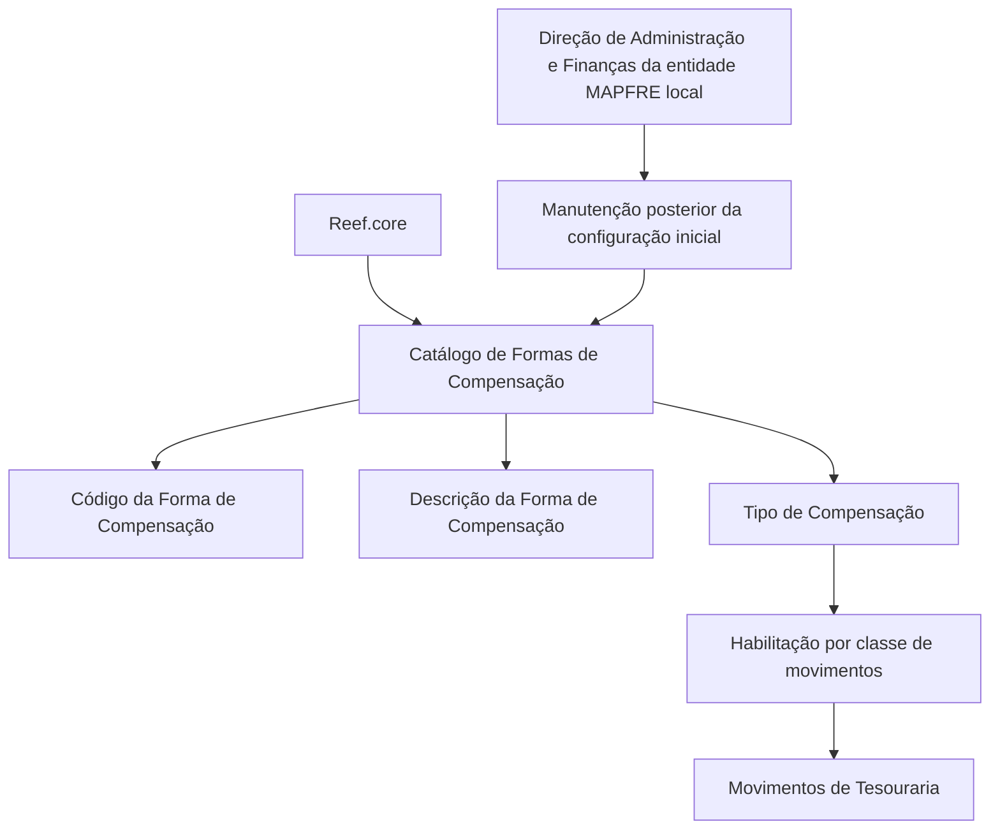

# Catálogo de Formas de Compensação no Reef.core para Movimentos de Tesouraria

## 1. Metadados do Documento
- **Arquivo de Origem:** Não identificado no conteúdo extraído
- **Tipo de Documento:** Especificação Funcional
- **Domínio / Sistema:** Reef.core / Tesouraria / MAPFRE
- **Público-Alvo:** Administração e Finanças da entidade MAPFRE local; utilizadores funcionais de Tesouraria
- **Data/Versão Identificada:** Não identificada

---

## 2. Resumo Executivo & Contexto de Negócio

O documento descreve o catálogo de **Formas de Compensação** disponível no núcleo do sistema Reef.core. O catálogo permite registar as formas de compensação utilizadas nos movimentos de Tesouraria da entidade.

A configuração inicial do catálogo é entregue às instalações com conteúdos previamente definidos. Os valores iniciais identificados incluem cheque bancário, numerário, transferência, contas de gestão, cartão, banco/numerário/transferência e ficheiro bancário.

Cada Forma de Compensação possui, no mínimo, um código, uma descrição e um tipo de compensação. O tipo identifica o âmbito operacional da compensação e permite determinar para quais classes de movimentos a respetiva forma de compensação está permitida ou habilitada.

A manutenção posterior da configuração inicial não é atribuída ao Reef.core no documento. O texto estabelece que a manutenção deve ser realizada pela **Direção de Administração e Finanças da entidade MAPFRE local**.

---

## 3. Arquitetura, Componentes & Tecnologias Envolvidas

Os elementos explicitamente identificados são:

| Componente / Entidade | Papel descrito |
| :--- | :--- |
| Reef.core | Núcleo do sistema que permite registar formas de compensação em movimentos de Tesouraria. |
| Catálogo de Formas de Compensação | Repositório funcional que contém os códigos, descrições e tipos de compensação. |
| Movimentos de Tesouraria | Movimentos nos quais a utilização das formas de compensação é registada ou habilitada. |
| Direção de Administração e Finanças | Área responsável pela manutenção posterior da configuração inicial do catálogo. |
| Entidade MAPFRE local | Entidade na qual a configuração inicial é entregue e cuja área de Administração e Finanças realiza a manutenção. |



**Nota de Análise:** O documento não detalha interfaces de utilizador, APIs, métodos HTTP, contratos JSON, persistência de dados, perfis de acesso ou fluxos de aprovação para a manutenção do catálogo.

---

## 4. Regras de Negócio, Especificações Funcionais & Processos

### 4.1 Finalidade do catálogo

1. O núcleo do sistema possui a capacidade de registar formas de compensação.
2. O registo ocorre em movimentos de Tesouraria da entidade.
3. As formas de compensação são mantidas num catálogo de informação.
4. O catálogo é entregue inicialmente às instalações com conteúdo previamente definido.

### 4.2 Propriedades da Forma de Compensação

1. **Código da Forma de Compensação**
   - Contém o código da compensação.

2. **Descrição da Forma de Compensação**
   - Contém a denominação ou descrição da forma de compensação.

3. **Tipo de Compensação**
   - Identifica o âmbito operacional no qual as compensações se enquadram.
   - Permite diferenciar para que classe de movimentos a utilização da forma de compensação está permitida ou habilitada.

### 4.3 Manutenção do catálogo

1. A configuração inicial é previamente definida.
2. A manutenção posterior da configuração deve ser realizada pela Direção de Administração e Finanças da entidade MAPFRE local.

**Nota de Análise:** O documento não especifica o procedimento operacional para criar, alterar, desativar ou eliminar formas de compensação após a configuração inicial.

---

## 5. Tabelas de Parâmetros, Ambientes e Estruturas de Dados

### 5.1 Estrutura funcional do catálogo

| Item / Parâmetro | Descrição / Função | Tipo / Valores / Formato | Ambiente / Observações |
| :--- | :--- | :--- | :--- |
| Código da Forma de Compensação | Contém o código da compensação. | Não detalhado. | Associado ao catálogo de Formas de Compensação. |
| Descrição da Forma de Compensação | Contém a denominação ou descrição da forma de compensação. | Não detalhado. | Associada ao catálogo de Formas de Compensação. |
| Tipo de Compensação | Identifica o âmbito operacional e diferencia as classes de movimentos para as quais a forma é permitida ou habilitada. | Não detalhado. | Aplicável aos movimentos de Tesouraria. |
| Configuração inicial | Conteúdo inicial entregue às instalações. | Pré-definida. | A manutenção posterior é da Direção de Administração e Finanças da entidade MAPFRE local. |

### 5.2 Valores iniciais de Formas de Compensação

| Item / Parâmetro | Descrição / Função | Tipo / Valores / Formato | Ambiente / Observações |
| :--- | :--- | :--- | :--- |
| Compensação 1 | CHEQUE BANCARIO | Código `1` | Valor inicialmente pré-fixado em Reef.core. |
| Compensação 2 | EFECTIVO | Código `2` | Valor inicialmente pré-fixado em Reef.core. |
| Compensação 3 | POR TRANSFERENCIA | Código `3` | Valor inicialmente pré-fixado em Reef.core. |
| Compensação 4 | CUENTAS GESTIÓN | Código `4` | Valor inicialmente pré-fixado em Reef.core. |
| Compensação 5 | TARJETA | Código `5` | Valor inicialmente pré-fixado em Reef.core. |
| Compensação 6 | BANCO EFECTIVO TRANSFERENCIA | Código `6` | Valor inicialmente pré-fixado em Reef.core. |
| Compensação 7 | FICHERO BANCARIO | Código `7` | Valor inicialmente pré-fixado em Reef.core. |

---

## 6. Bateria de Perguntas & Respostas para RAG (FAQ Sintético)

### P1: Qual é a finalidade do catálogo de Formas de Compensação no Reef.core?
**R:** O catálogo de Formas de Compensação permite registar as formas de compensação utilizadas nos movimentos de Tesouraria da entidade. O catálogo contém informação sobre as compensações e é entregue inicialmente com conteúdo previamente definido.

### P2: Quais propriedades são descritas para uma Forma de Compensação?
**R:** O documento descreve o Código da Forma de Compensação, a Descrição da Forma de Compensação e o Tipo de Compensação. O código contém o identificador da compensação; a descrição contém a denominação da forma; e o tipo identifica o seu âmbito operacional.

### P3: Para que serve o Tipo de Compensação?
**R:** O Tipo de Compensação identifica o âmbito operacional em que as compensações se enquadram. Essa propriedade permite diferenciar para quais classes de movimentos a utilização de uma determinada forma de compensação está permitida ou habilitada.

### P4: Quais são os valores iniciais de Formas de Compensação fornecidos pelo Reef.core?
**R:** Os valores iniciais listados são: `1` CHEQUE BANCARIO, `2` EFECTIVO, `3` POR TRANSFERENCIA, `4` CUENTAS GESTIÓN, `5` TARJETA, `6` BANCO EFECTIVO TRANSFERENCIA e `7` FICHERO BANCARIO.

### P5: A configuração do catálogo de Formas de Compensação já vem preenchida?
**R:** Sim. O documento informa que a configuração inicial vem previamente definida e que o catálogo é entregue inicialmente às instalações com o seu conteúdo pré-fixado.

### P6: Quem deve realizar a manutenção posterior do catálogo de Formas de Compensação?
**R:** A manutenção posterior da configuração inicial deve ser realizada pela Direção de Administração e Finanças da entidade MAPFRE local.

### P7: O documento define quais métodos ou interfaces devem ser usados para manter o catálogo?
**R:** Não. O documento define a responsabilidade de manutenção pela Direção de Administração e Finanças da entidade MAPFRE local, mas não descreve métodos, interfaces, APIs, ecrãs ou procedimentos técnicos de manutenção.

### P8: O catálogo de Formas de Compensação aplica-se a quais operações?
**R:** O catálogo aplica-se aos movimentos de Tesouraria da entidade. O Tipo de Compensação define o âmbito operacional e a habilitação da forma de compensação para classes de movimentos.

### P9: O documento especifica o formato técnico do código de compensação?
**R:** Não. O texto informa apenas que a propriedade Código da Forma de Compensação contém o código da compensação. Os exemplos fornecidos utilizam os códigos numéricos de `1` a `7`.

---

## 7. Glossário de Termos, Siglas & Conceitos-Chave

- **Reef.core:** Núcleo do sistema referido como disponibilizando o catálogo de Formas de Compensação.
- **Forma de Compensação:** Forma utilizada para compensar ou registar movimentos de Tesouraria; possui código, descrição e tipo.
- **Catálogo de Formas de Compensação:** Catálogo de informação que contém as formas de compensação disponibilizadas inicialmente nas instalações.
- **Movimentos de Tesouraria:** Movimentos da entidade nos quais as formas de compensação podem ser registadas e habilitadas.
- **Tipo de Compensação:** Propriedade que identifica o âmbito operacional e permite diferenciar as classes de movimentos habilitadas.
- **MAPFRE local:** Entidade MAPFRE local cuja Direção de Administração e Finanças deve manter posteriormente a configuração inicial.

---

## 8. Notas Críticas, Riscos & Limitações

- O documento não identifica o nome do ficheiro de origem, data, versão ou autor técnico.
- Não são especificados os tipos de dados, tamanhos, obrigatoriedade, regras de unicidade ou validações para código, descrição e tipo de compensação.
- Não é apresentado o mapeamento entre cada Tipo de Compensação e as classes de movimentos de Tesouraria habilitadas.
- Não há detalhe sobre autorização, perfis de utilizador, auditoria, aprovação ou segregação de funções para manutenção do catálogo.
- Não são descritas interfaces, APIs, integrações, bases de dados, rotas de logs, ambientes ou procedimentos de implantação.
- A manutenção posterior depende da Direção de Administração e Finanças da entidade MAPFRE local; o documento não detalha o processo de coordenação com equipas técnicas.

---

## 9. Conteúdo Bruto Estruturado (Referência Fiel)

```text
--- [PÁGINA 1 DE 2] ---

DEFINICIÓN de las Formas de Compensación
Funcionalmente, el núcleo del Sistema cuenta con la posibilidad de registrar las formas de Compensación en los movimientos de la Tesorería
de la Entidad en un catálogo de información que se entrega inicialmente a las instalaciones con su contenido prejado.
Código de la Forma de Compensación
Esta propiedad contiene el código de la compensación.
Descripción de la Forma de Compensación
Esta propiedad contiene la denominación o descripción de la forma de compensación.
A modo de ejemplo los valores inicialmente prejados en Reef.core son:
COMPENSACIÓN DESCRIPCIÓN
1 CHEQUE BANCARIO
2 EFECTIVO
3 POR TRANSFERENCIA
4 CUENTAS GESTIÓN
5 TARJETA
6 BANCO EFECTIVO TRANSFERENCIA
7 FICHERO BANCARIO
Tipo de Compensación
Esta propiedad identica el ámbito operativo en el que se inscriben las compensaciones pudiendo de esta manera diferenciar para qué clase
de movimientos el empleo de la forma de compensación está permitido o habilitado.
Vínculos
Documentation / DOCUMENTACIÓN Reef
DOCUMENTACIÓN Reef
Mapfredocument
DOCUMENTACIÓN Reef
Owner
user:agonzalez_mapfre.com
Lifecycle
Approved Source
 /
 VL
Buscar Inicio Soluciones Arquitecturas APIs Componentes Cloud Documentación Zeus Reef Ayuda
ES

--- [PÁGINA 2 DE 2] ---

Relación de Directrices y Documentos funcionales cuya lectura recomendada para evitar que la interpretación aislada del presente
documento pueda conducir a error.
Preguntas frecuentes
(1) ¿Existe alguna circunstancia operativa que deba ser tomada en consideración sobre este catálogo?
La conguración inicial viene prejada. Su posterior mantenimiento lo debe realizar la Dirección de Administración y Finanzas de la Entidad
MAPFRE local.
```
