# Sistema de Segurança do Reef.core — Catálogos e Ordem de Configuração de Usuários

## 1. Metadados do Documento
- **Arquivo de Origem:** Não identificado
- **Tipo de Documento:** Procedimento
- **Domínio / Sistema:** Reef.core / MAPFRE
- **Público-Alvo:** Não identificado
- **Data/Versão Identificada:** Não identificada

---

## 2. Resumo Executivo & Contexto de Negócio

O documento descreve o **Sistema de Segurança do Reef.core**, responsável pela criação e configuração de contas de usuários que utilizarão a aplicação. Uma conta de usuário permite autenticação no sistema e pode receber autorização para acessar recursos fornecidos ou conectados ao sistema.

O conteúdo diferencia explicitamente autenticação de autorização: autenticação ocorre por meio de senha para fins de contabilidade, segurança, registro e administração de recursos; autorização não é automaticamente concedida pela autenticação e é realizada pelo uso específico de **Roles**.

O objetivo declarado é conhecer os catálogos e a ordem de configuração necessária para criar um usuário totalmente operacional para uma companhia definida na aplicação. O processo engloba definições de usuários, roles, parâmetros de consulta, configuração no servidor de aplicações e parâmetros Java por usuário.

Após a realização das tarefas prévias de configuração, a entidade MAPFRE fica em condições de completar a configuração dos usuários criados em cada companhia na qual poderão trabalhar. O documento também relaciona controles de acesso por entidade, operações de terceiros, ramo técnico e restrições de visualização de informações.

---

## 3. Arquitetura, Componentes & Tecnologias Envolvidas

| Componente / Conceito | Papel descrito no documento |
| :--- | :--- |
| Reef.core | Sistema que permite criar contas de usuários, configurar roles e definir atributos operativos de autenticação. |
| Sistema de Segurança | Nome genérico, no contexto do Reef.core, para o grupo de catálogos de criação, configuração e controle de usuários. |
| Conta de Usuário | Permite ao usuário autenticar-se no sistema e potencialmente receber autorização de acesso a recursos. |
| Roles | Mecanismo específico pelo qual a autorização é efetuada. |
| Companhia | Contexto de trabalho para o qual um usuário deve ser configurado como operacional. |
| MAPFRE | Entidade mencionada como apta a completar a configuração dos usuários após as tarefas prévias. |
| Servidor de Aplicações | Ambiente no qual há configuração de usuários. |
| Parâmetros JAVA | Parâmetros configuráveis por usuário. |
| Informação Parcial | Conjunto de mecanismos de restrição para visualização de informações nas telas. |
| Consultas Parciais de Informação | Configurações adicionais que precisam permitir a funcionalidade de restrições de informação. |
| Terceiros | Entidade funcional associada a acessos de criação, modificação e restrições de informação por role. |
| Ramo Técnico | Contexto para atribuição de acessos. |

```mermaid
graph TD
  A[Definição de Usuários do Sistema] --> B[Definição de Roles por Companhia]
  B --> C[Atribuição de Roles aos Usuários]
  C --> D[Atribuição de Parâmetros de Consulta]
  D --> E[Configuração de Usuários no Servidor de Aplicações]
  E --> F[Configuração de Parâmetros JAVA por Usuário]
  F --> G[Definição de Grupos de Usuários]
  G --> H[MAPFRE completa a configuração por companhia]

  H --> I[Atribuição de Usuários por Entidade]
  I --> J[Acessos para criação e modificação de terceiros]
  J --> K[Configuração de Acesso à Informação]
  K --> L[Acessos por Ramo Técnico]

  L --> M[Configuração de Informação Parcial]
  M --> N[Roles de Informação Parcial]
  N --> O[Aplicações Software]
  O --> P[Roles de Informação Parcial por Aplicação]
  P --> Q[Conceitos Lógicos com Informação Parcial]
  Q --> R[Roles atribuídos a Conceitos Lógicos e Propriedades]
  R --> S[Restrições de Terceiros por Role]
  S --> T[Consultas Parciais de Informação]
  T --> U[Usuários em Consultas Parciais de Informação]
```



> **Nota de Análise:** O documento relaciona catálogos e etapas de configuração, mas não detalha telas, endpoints, contratos de integração, formatos de dados, métodos HTTP, versões de software ou valores técnicos dos parâmetros Java.

---

## 4. Regras de Negócio, Especificações Funcionais & Processos

1. A conta de um usuário permite autenticação no sistema e, potencialmente, autorização para acessar recursos fornecidos ou conectados ao sistema.
2. A autenticação não implica autorização.
3. A autorização é efetuada por meio do uso específico de Roles.
4. O início de sessão em uma conta de usuário requer autenticação por senha.
5. A autenticação por senha atende a fins de contabilidade, segurança, registro e administração de recursos.
6. O Reef.core permite criar contas dos usuários que utilizarão o sistema.
7. O Reef.core permite configurar Roles para os usuários.
8. O Reef.core permite definir atributos operativos de autenticação em um grupo de catálogos denominado genericamente Sistema de Segurança.
9. Para criar um usuário totalmente operacional para uma companhia definida na aplicação, o documento estabelece a necessidade de conhecer os catálogos e a ordem de configuração.
10. As tarefas prévias incluem:
   - Definição dos usuários do sistema.
   - Definição de roles por companhia.
   - Atribuição de roles aos usuários do sistema.
   - Atribuição de parâmetros de consulta aos usuários do sistema.
   - Configuração de usuários no servidor de aplicações.
   - Configuração de parâmetros JAVA por usuário.
   - Definição de grupos de usuários.
11. Após a realização das tarefas prévias, a entidade MAPFRE poderá completar a configuração dos usuários criados em cada companhia na qual esses usuários poderão trabalhar.
12. A configuração complementar inclui atribuição de usuários por entidade, acesso a operações de criação e modificação de terceiros, configuração de acesso à informação e atribuição de acessos por ramo técnico.
13. O Reef.core permite estabelecer, por usuário, restrições sobre a visualização de informações nas telas.
14. A funcionalidade de restrição de informação depende de configurações prévias que permitam seu uso, incluindo configuração de consultas parciais de informação e configuração de usuários nessas consultas.

---

## 5. Tabelas de Parâmetros, Ambientes e Estruturas de Dados

| Item / Parâmetro | Descrição / Função | Tipo / Valores / Formato | Ambiente / Observações |
| :--- | :--- | :--- | :--- |
| Usuários do Sistema | Contas dos usuários que utilizarão o Reef.core. | Catálogo de configuração. | Deve ser definido no processo de criação de usuário operacional. |
| Roles por Companhia | Roles definidos no contexto de uma companhia. | Catálogo de configuração. | A autorização é efetuada pelo uso específico de Roles. |
| Roles atribuídos a usuários | Associação de Roles aos usuários do sistema. | Catálogo de configuração. | Necessário para autorização; autenticação não concede autorização automaticamente. |
| Parâmetros de Consulta | Parâmetros atribuídos aos usuários do sistema. | Catálogo de configuração. | Valores e formato não detalhados. |
| Usuários no Servidor de Aplicações | Configuração de usuários no servidor de aplicações. | Catálogo de configuração. | Servidor e mecanismos técnicos não detalhados. |
| Parâmetros JAVA por Usuário | Parâmetros JAVA configurados individualmente por usuário. | Catálogo de configuração. | Nomes, valores e efeitos dos parâmetros não detalhados. |
| Grupos de Usuários | Definição de grupos de usuários. | Catálogo de configuração. | Relacionado às tarefas prévias. |
| Usuários por Entidade | Atribuição de usuários por entidade. | Configuração de acesso. | Executada após as tarefas prévias descritas. |
| Acessos de Terceiros | Acesso a operações de criação e modificação de terceiros. | Configuração de acesso. | Permissões específicas não detalhadas. |
| Acesso à Informação | Configuração de acesso à informação. | Configuração de acesso. | Associada ao controle de visualização. |
| Acessos por Ramo Técnico | Atribuição de acessos no contexto de ramo técnico. | Configuração de acesso. | Ramos técnicos possíveis não detalhados. |
| Roles de Informação Parcial | Definição de roles voltados à informação parcial. | Catálogo de restrição. | Usados em restrições de visualização nas telas. |
| Aplicações Software | Definição de aplicações software. | Catálogo de restrição. | Associado à configuração de roles de informação parcial por aplicação. |
| Roles de Informação Parcial por Aplicação | Definição de roles de informação parcial no nível de aplicação. | Catálogo de restrição. | Relação entre aplicações e roles. |
| Conceitos Lógicos com Informação Parcial | Definição de conceitos lógicos sujeitos a informação parcial. | Catálogo de restrição. | Propriedades e critérios não detalhados. |
| Roles em Conceitos Lógicos e Propriedades | Atribuição de roles de informação parcial a conceitos lógicos e respectivas propriedades. | Catálogo de restrição. | Controla restrições de visualização. |
| Restrições de Terceiros por Role | Restrições de acesso à informação de terceiros por role. | Catálogo de restrição. | Detalhamento das restrições não fornecido. |
| Consultas Parciais de Informação | Configuração necessária para permitir funcionalidades de informação parcial. | Configuração dependente. | Deve permitir previamente a funcionalidade. |
| Usuários em Consultas Parciais | Configuração de usuários em consultas parciais de informação. | Configuração dependente. | Deve permitir previamente a funcionalidade. |

---

## 6. Bateria de Perguntas & Respostas para RAG (FAQ Sintético)

### P1: A autenticação de um usuário no Reef.core concede automaticamente autorização aos recursos?
**R:** Não. O documento declara que a autenticação não implica autorização. A autenticação permite iniciar sessão mediante senha, enquanto a autorização é efetuada pelo uso específico de Roles.

### P2: Qual é o objetivo do Sistema de Segurança do Reef.core?
**R:** O Sistema de Segurança reúne catálogos para criar contas de usuários, configurar Roles e definir atributos operativos de autenticação. O objetivo do documento é apresentar os catálogos e a ordem de configuração necessários para criar um usuário totalmente operacional para uma companhia definida na aplicação.

### P3: Para quais finalidades a senha é exigida no início de sessão?
**R:** A senha é requerida para que o usuário se autentique ao iniciar sessão na conta. O documento associa essa autenticação a fins de contabilidade, segurança, registro e administração de recursos.

### P4: Quais são as tarefas prévias para a configuração de usuários no Reef.core?
**R:** As tarefas prévias relacionadas são: definição dos usuários do sistema; definição de roles por companhia; atribuição de roles aos usuários; atribuição de parâmetros de consulta; configuração de usuários no servidor de aplicações; configuração de parâmetros JAVA por usuário; e definição de grupos de usuários.

### P5: Quando a entidade MAPFRE pode completar a configuração dos usuários?
**R:** A entidade MAPFRE pode completar a configuração dos usuários criados em cada companhia em que poderão trabalhar após a realização das tarefas prévias de configuração relacionadas no documento.

### P6: Como o Reef.core trata restrições de visualização de informações?
**R:** O Reef.core permite estabelecer restrições por usuário sobre a visualização de informações nas telas. O documento relaciona Roles de Informação Parcial, aplicações software, conceitos lógicos, propriedades e restrições de informação de terceiros por Role como parte dessa configuração.

### P7: Quais configurações devem permitir previamente a funcionalidade de informação parcial?
**R:** O documento menciona que a funcionalidade depende de configurações afetadas realizadas previamente, incluindo a Configuração de Consultas Parciais de Informação e a Configuração de Usuários em Consultas Parciais de Informação.

### P8: Quais acessos complementares são previstos após a configuração básica do usuário?
**R:** O documento lista atribuição de usuários por entidade, atribuição de acessos às operações de criação e modificação de terceiros, configuração de acesso à informação e atribuição de acessos por ramo técnico.

### P9: O documento especifica os valores dos parâmetros JAVA por usuário?
**R:** Não. O documento apenas cita a configuração de parâmetros JAVA por usuário como uma tarefa de configuração. Não informa nomes, valores, formatos ou efeitos desses parâmetros.

### P10: O documento detalha quais permissões cada Role concede?
**R:** Não. O conteúdo informa que a autorização é efetuada pelo uso específico de Roles e lista a definição de roles por companhia e sua atribuição aos usuários, mas não detalha permissões individuais, operações ou critérios de cada Role.

---

## 7. Glossário de Termos, Siglas & Conceitos-Chave

- **Reef.core:** Sistema citado no documento, com capacidade de criar contas de usuários, configurar Roles e definir atributos operativos de autenticação.
- **Sistema de Segurança:** Denominação genérica, no Reef.core, para o grupo de catálogos relacionados a usuários, Roles e atributos de autenticação.
- **Autenticação:** Processo exigido para iniciar sessão em uma conta de usuário mediante senha.
- **Autorização:** Acesso a recursos efetuado pelo uso específico de Roles; não decorre automaticamente da autenticação.
- **Role:** Mecanismo utilizado para efetuar autorização no sistema.
- **Companhia:** Contexto definido na aplicação para o qual um usuário pode ser configurado como operacional.
- **MAPFRE:** Entidade citada no documento como responsável por completar a configuração de usuários após tarefas prévias.
- **Parâmetros JAVA:** Parâmetros configuráveis por usuário; o documento não informa seus valores ou finalidade individual.
- **Informação Parcial:** Configuração destinada a restringir a visualização de informações nas telas.
- **Conceitos Lógicos:** Elementos que podem receber atribuição de Roles de Informação Parcial, juntamente com suas propriedades.
- **Terceiros:** Elemento funcional para o qual existem acessos de criação, modificação e restrições de informação por Role.
- **Ramo Técnico:** Contexto para atribuição de acessos, sem detalhamento adicional no documento.

---

## 8. Notas Críticas, Riscos & Limitações

- O documento não identifica arquivo de origem, data, versão, autor técnico ou público-alvo.
- Não há detalhamento dos valores, nomes ou impactos dos parâmetros JAVA por usuário.
- Não são especificados os Roles existentes, suas permissões, critérios de autorização ou matriz de acessos.
- Não são descritos servidores, URLs, credenciais, portas, protocolos ou procedimentos técnicos para a configuração no servidor de aplicações.
- O documento não fornece regras detalhadas para criação e modificação de terceiros, acessos por ramo técnico ou restrições de informação.
- A funcionalidade de informação parcial possui dependência explícita de configurações prévias de consultas parciais e de usuários nessas consultas.
- **Nota de Análise:** O documento lista mecanismos de segurança e catálogos de configuração, mas não detalha a implementação técnica, os contratos de integração ou o comportamento das telas.

---

## 9. Conteúdo Bruto Estruturado (Referência Fiel)

```text
--- [PÁGINA 1 DE 2] ---

DEFINICIÓN del SISTEMA de SEGURIDAD
Contexto
La cuenta de un usuario le permite a este autenticarse en el sistema y, potencialmente, recibir autorización para acceder a los recursos
proporcionados o conectados a ese sistema; sin embargo, la autenticación no implica autorización puesto que esta se efectúa mediante el
uso especíco de los Roles.
Por otra parte para iniciar sesión en una cuenta de Usuario se requiere que los usuarios se autentiquen con una contraseña para nes de
contabilidad, seguridad, registro y administración de recursos.
Funcionalmente Reef.core cuenta con la posibilidad de crear las cuentas de los Usuarios que van a utilizar el Sistema, congurar sus Roles y
denir los atributos operativos de autenticación en un grupo de catálogos que conforman lo que en Reef.core se denomina genéricamente
como 'Sistema de Seguridad'.
Objetivo
Conocer los catálogos y el orden de conguración de los mismos para crear un Usuario totalmente operativo para una compañía denida en
la aplicación.
Catálogos de Conguración
Denición de los Usuarios del Sistema
Denición de Roles por Compañía
Asignación de Roles a los Usuarios del Sistema
Asignación de Parámetros de Consulta a los Usuarios del Sistema
Conguración de Usuarios en el Servidor de Aplicaciones
Conguración de Parámetros JAVA por Usuario
Una vez realizados las tareas previas, la entidad MAPFRE estará en disposición de completar la conguración de los Usuarios creados en
cada una de las compañías en las que estos van a poder trabajar.
Denición de Grupos de Usuarios
Documentation / DOCUMENTACIÓN Reef
DOCUMENTACIÓN Reef
Mapfredocument
DOCUMENTACIÓN Reef
Owner
user:agonzalez_mapfre.com
Lifecycle
Approved Source
 /
 VL
Buscar Inicio Soluciones Arquitecturas APIs Componentes Cloud Documentación Zeus Reef Ayuda
ES


--- [PÁGINA 2 DE 2] ---

Asignación de Usuarios por Entidad
Asignación de Accesos a las Operaciones de Creación y Modicación de Terceros
Conguración Acceso Información
Asignación Accesos por Ramo Técnico
Información Parcial/Restricciones
Por último y puesto que por Usuario en Reef.core se pueden establecer restricciones sobre la visualización de información en las pantallas,
se puede contemplar la conguración de los siguientes catálogos ...:
Denición de Roles de Información Parcial
Denición de Aplicaciones Software
Denición de Roles de Información Parcial por Aplicación
Denición de Conceptos Lógicos con Información Parcial
Asignación de Roles de Información Parcial a Conceptos Lógicos y sus Propiedades
Restricciones Acceso Información de Terceros por Rol
... Siempre y cuando las conguraciones afectas que se hayan realizado previamente permitan esta funcionalidad:
Conguración Consultas Parciales de Información
Conguración Usuarios en Consultas Parciales de Información
```
