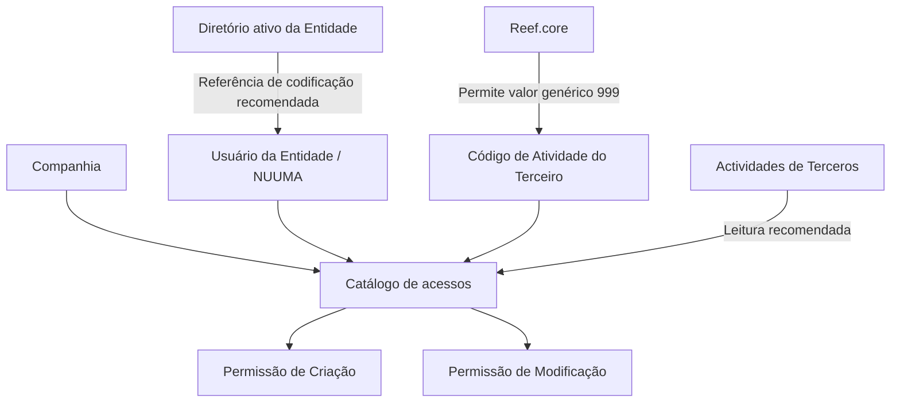

# Atribuição de Acessos para Criação e Modificação de Atividades de Terceiros no Reef.core

## 1. Metadados do Documento
- **Arquivo de Origem:** Não identificado no conteúdo extraído
- **Tipo de Documento:** Especificação Funcional
- **Domínio / Sistema:** DOCUMENTACIÓN Reef / Reef.core / MAPFRE
- **Público-Alvo:** Desenvolvedores, Arquitetos, Operação e Administradores de Acessos
- **Data/Versão Identificada:** Não identificada
- **Lifecycle Identificado:** Approved Source
- **Owner Identificado:** `user:agonzalez_mapfre.com`

---

## 2. Resumo Executivo & Contexto de Negócio

O documento descreve o catálogo de acessos usado pelo núcleo do sistema para associar usuários de uma entidade às atividades de terceiros sobre as quais esses usuários podem receber permissões de criação ou modificação.

A atribuição de acesso é definida por três dados identificativos: companhia, chave de usuário e código de atividade. A companhia delimita a entidade para a qual o acesso está sendo atribuído; a chave de usuário identifica o usuário destinatário da autorização; e o código de atividade identifica a atividade do terceiro abrangida pela permissão.

No contexto das entidades MAPFRE, o usuário é denominado `NUUMA`. O documento recomenda que os usuários sejam codificados nesse catálogo da mesma forma como são identificados no diretório ativo da entidade.

O Reef.core permite empregar o valor genérico `999` na definição do atributo de código de atividade. O conteúdo também referencia o documento funcional **Actividades de Terceros** como leitura recomendada para evitar interpretações isoladas e incorretas.

---

## 3. Arquitetura, Componentes & Tecnologias Envolvidas

| Componente / Conceito | Papel descrito no documento |
| :--- | :--- |
| Núcleo do Sistema | Possibilita associar e atribuir permissões aos usuários da entidade. |
| Catálogo de acessos | Contém os atributos utilizados para definir a atribuição do acesso. |
| Usuário da Entidade | Recebe permissões de criação ou modificação para atividades de terceiros. |
| Companhia | Define a companhia sobre a qual a atribuição de permissão é realizada. |
| Usuário `NUUMA` | Denominação do código de usuário nas entidades MAPFRE. |
| Código de Atividade | Identifica a atividade do terceiro à qual a permissão se aplica. |
| Reef.core | Permite o uso do valor genérico `999` no código de atividade. |
| Diretório ativo da Entidade | Referência para a codificação recomendada dos usuários no catálogo. |
| Actividades de Terceros | Documento funcional vinculado e recomendado para consulta. |



**Nota de Análise:** O documento não detalha interfaces, métodos HTTP, contratos JSON, modelo físico de dados, fluxos de aprovação ou mecanismos técnicos de autenticação e autorização.

---

## 4. Regras de Negócio, Especificações Funcionais & Processos

1. O núcleo do sistema permite associar e atribuir aos usuários da entidade as atividades de terceiros sobre as quais poderão ter permissões.
2. As permissões mencionadas são exclusivamente de:
   - Criação.
   - Modificação.
3. A atribuição de acesso é realizada sobre uma companhia específica.
4. A identificação do usuário autorizado é feita pelo atributo **Clave de Usuario**.
5. Nas entidades MAPFRE, o código de usuário é denominado `NUUMA`.
6. A atividade do terceiro abrangida pela permissão é identificada pelo atributo **Código de Actividad**.
7. O Reef.core permite utilizar o valor genérico `999` na definição do atributo de código de atividade.
8. É considerada boa prática codificar os usuários no catálogo da mesma forma como os usuários são identificados no diretório ativo da entidade.
9. A interpretação do catálogo de acessos deve considerar a documentação funcional vinculada **Actividades de Terceros**, pois a leitura isolada da entrada pode induzir a erro.

---

## 5. Tabelas de Parâmetros, Ambientes e Estruturas de Dados

| Item / Parâmetro | Descrição / Função | Tipo / Valores / Formato | Ambiente / Observações |
| :--- | :--- | :--- | :--- |
| Compañía | Código da companhia sobre a qual a atribuição da permissão de acesso é realizada. | Código de companhia; formato não detalhado. | Aplicável à companhia da entidade. |
| Clave de Usuario | Código do usuário ao qual a permissão de acesso é concedida. | Código de usuário; formato não detalhado. | Nas entidades MAPFRE, o usuário é denominado `NUUMA`. |
| Código de Actividad | Código da atividade do terceiro abrangida pela permissão. | Código de atividade; Reef.core permite o valor genérico `999`. | O significado operacional do valor `999` não é detalhado. |
| Permissão de Criação | Autoriza a criação em atividades de terceiros associadas ao usuário. | Permissão; mecanismo técnico não detalhado. | A concessão é suportada pelo núcleo do sistema. |
| Permissão de Modificação | Autoriza a modificação em atividades de terceiros associadas ao usuário. | Permissão; mecanismo técnico não detalhado. | A concessão é suportada pelo núcleo do sistema. |
| Codificação de usuários | Boa prática para identificação dos usuários no catálogo. | Deve corresponder à identificação no diretório ativo da entidade. | Recomendação explicitamente indicada no documento. |
| Documento vinculado | Documentação funcional relacionada. | `Actividades de Terceros`. | Leitura recomendada para reduzir riscos de interpretação isolada. |
| Lifecycle | Estado identificado na página de documentação. | `Approved Source`. | Não há detalhamento adicional sobre o ciclo de vida. |
| Owner | Proprietário identificado na página de documentação. | `user:agonzalez_mapfre.com`. | Identificador apresentado no conteúdo bruto. |

---

## 6. Bateria de Perguntas & Respostas para RAG (FAQ Sintético)

### P1: Qual é o objetivo do catálogo de acessos descrito no documento?
**R:** O catálogo de acessos permite ao núcleo do sistema associar usuários de uma entidade às atividades de terceiros sobre as quais esses usuários podem receber permissões de criação ou modificação.

### P2: Quais permissões podem ser atribuídas aos usuários para atividades de terceiros?
**R:** O documento menciona permissões de criação e de modificação para as atividades de terceiros associadas aos usuários da entidade.

### P3: Quais atributos identificativos compõem a atribuição de acesso?
**R:** A atribuição de acesso utiliza os atributos Compañía, Clave de Usuario e Código de Actividad. A companhia identifica a entidade sobre a qual o acesso é atribuído, a chave de usuário identifica o usuário autorizado e o código de atividade identifica a atividade do terceiro.

### P4: O que representa o atributo Compañía no catálogo de acessos?
**R:** O atributo Compañía contém o código da companhia sobre a qual está sendo realizada a atribuição da permissão de acesso.

### P5: O que significa Clave de Usuario no contexto das entidades MAPFRE?
**R:** Clave de Usuario é o atributo que contém o código do usuário que recebe a permissão de acesso. Nas entidades MAPFRE, esse usuário é denominado `NUUMA`.

### P6: Para que serve o Código de Actividad?
**R:** O Código de Actividad indica no sistema o código da atividade do terceiro sobre a qual a permissão de criação ou modificação pode ser atribuída.

### P7: O valor `999` pode ser utilizado no Código de Actividad?
**R:** Sim. O documento informa explicitamente que o Reef.core permite o emprego do valor genérico `999` na definição do atributo Código de Actividad. O significado funcional específico desse valor não é detalhado.

### P8: Como os usuários devem ser codificados no catálogo de acessos?
**R:** O documento recomenda como boa prática codificar os usuários no catálogo da mesma forma como eles são identificados no diretório ativo da entidade.

### P9: Qual documentação deve ser consultada para interpretar corretamente o catálogo de acessos?
**R:** Deve ser consultada a documentação funcional vinculada **Actividades de Terceros**. O documento alerta que a interpretação isolada da presente entrada pode conduzir a erro.

### P10: O documento detalha APIs, métodos HTTP ou contratos de integração para a atribuição de acessos?
**R:** Não. O conteúdo extraído descreve atributos funcionais e regras de uso do catálogo de acessos, mas não apresenta métodos HTTP, APIs, contratos JSON, endpoints, tecnologias de integração ou fluxos técnicos de autorização.

---

## 7. Glossário de Termos, Siglas & Conceitos-Chave

- **Reef.core:** Sistema mencionado como permissivo ao uso do valor genérico `999` no atributo Código de Actividad.
- **NUUMA:** Denominação do código de usuário nas entidades MAPFRE.
- **Compañía:** Atributo que contém o código da companhia sobre a qual a permissão de acesso é atribuída.
- **Clave de Usuario:** Atributo que contém o código do usuário que recebe a permissão de acesso.
- **Código de Actividad:** Propriedade que indica o código da atividade do terceiro no sistema.
- **Actividades de Terceros:** Documento funcional vinculado e recomendado para leitura complementar.
- **Diretório ativo da Entidade:** Referência utilizada para a recomendação de codificação dos usuários no catálogo.
- **Approved Source:** Estado de lifecycle exibido no conteúdo da documentação.

---

## 8. Notas Críticas, Riscos & Limitações

- A leitura isolada desta entrada pode conduzir a erro; o documento recomenda a consulta de **Actividades de Terceros**.
- O valor genérico `999` é permitido pelo Reef.core, mas o documento não define seu significado operacional, critérios de uso ou efeitos de autorização.
- Não são apresentados formatos, tamanhos, obrigatoriedade ou regras de validação para os atributos Compañía, Clave de Usuario e Código de Actividad.
- Não há detalhamento sobre como permissões de criação e modificação são persistidas, aprovadas, revogadas, auditadas ou aplicadas tecnicamente.
- Não são descritos ambientes, URLs, servidores, logs, integrações, APIs, perfis de acesso ou matriz de segregação de funções.
- O texto identifica o owner e o lifecycle da documentação, mas não fornece versão, data de publicação ou histórico de alterações.

---

## 9. Conteúdo Bruto Estruturado (Referência Fiel)

```text
--- [PÁGINA 1 DE 1] ---

ASIGNACIÓN de Accesos a las Operaciones de Creación y
Modicación de Terceros
Contexto
El núcleo del Sistema cuenta con la posibilidad de asociar y asignar a los Usuarios de la Entidad cuales van a ser las Actividades de los
Terceros sobre las que van a poder contar con permisos de Creación o Modicación.
Datos Identicativos
Compañía
Este Atributo del catálogo de accesos contiene el código de la compañía sobre la cual se está realizando la asignación del permiso de
acceso.
Clave de Usuario
Este Atributo del catálogo contiene el código del Usuario, denominado 'NUUMA' en las entidades MAPFRE, al que se concede el permiso de
acceso.
Código de Actividad
Esta propiedad indica en el sistema el código de la Actividad del Tercero.
NOTA: Reef.core permite el empleo del valor genérico 999 en la denición de este atributo.
Vínculos
Relación de Directrices y Documentos funcionales cuya lectura recomendada para evitar que la interpretación aislada de la presente entrada
pueda conducir a error.
Actividades de Terceros
Preguntas frecuentes
(1) ¿Existe alguna recomendación que pueda ser tomada en consideración en el uso y denición del Catálogo de Usuarios de la Entidad?
Es una buena práctica codicar a los usuarios en este catálogo de la misma manera con la que se identica a los usuarios en el directorio
activo de la Entidad.
Documentation / DOCUMENTACIÓN Reef
DOCUMENTACIÓN Reef
Mapfredocument
DOCUMENTACIÓN Reef
Owner
user:agonzalez_mapfre.com
Lifecycle
Approved Source
 /
VL
Buscar Inicio Soluciones Arquitecturas APIs Componentes Cloud Documentación Zeus Reef Ayuda
ES
```
