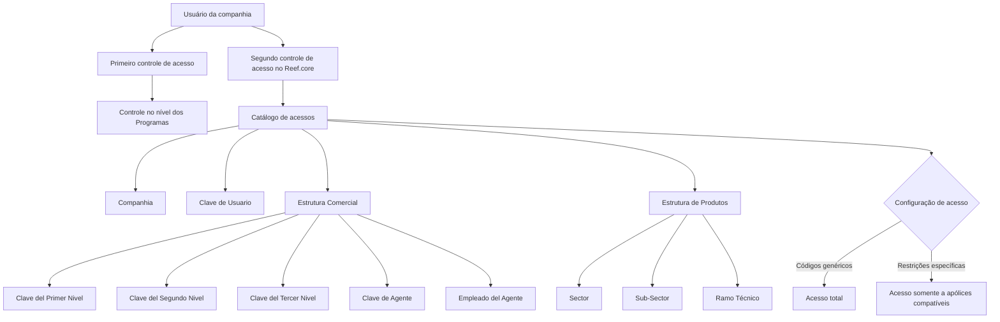

# Catálogo de Acessos à Informação de Usuários no Reef.core

## 1. Metadados do Documento
- **Arquivo de Origem:** Não identificado no conteúdo fornecido
- **Tipo de Documento:** Manual Operacional / Documentação Funcional
- **Domínio / Sistema:** Reef.core — controle de acesso a informações de apólices
- **Público-Alvo:** Administradores funcionais, operação, segurança de acesso e usuários responsáveis pela configuração de permissões
- **Data/Versão Identificada:** Não identificada
- **Status identificado no portal:** Approved Source
- **Proprietário identificado:** `user:agonzalez_mapfre.com`

---

## 2. Resumo Executivo & Contexto de Negócio

O documento descreve a atribuição de acessos às operações de consulta de informações no sistema Reef.core. O mecanismo apresentado complementa um primeiro controle de acesso implementado no nível dos Programas, adicionando um segundo nível de controle específico para cada usuário da companhia.

O segundo nível de controle permite restringir a consulta de informações segundo definições pertencentes à Estrutura Comercial e à Estrutura de Produtos. A configuração é registrada em um catálogo de acessos que associa uma companhia e uma chave de usuário às chaves de estruturas comerciais, intermediários, empregados de intermediários e classificações de produtos.

O documento estabelece que um usuário pode receber acesso total quando o perfil de acesso for configurado com códigos genéricos. Em contrapartida, quando o acesso for configurado para uma estrutura comercial ou de produtos específica, o usuário somente poderá consultar informações de apólices compatíveis com as restrições configuradas.

Entre os cenários exemplificados, o documento prevê usuários capazes de consultar somente apólices da própria Oficina Comercial, todas as apólices independentemente da oficina comercial, apólices de um único Ramo Técnico ou apólices vinculadas ao Sector de No Vida. A recomendação explícita é priorizar a restrição de acesso à informação em vez de conceder acesso sem restrições.

---

## 3. Arquitetura, Componentes & Tecnologias Envolvidas

### Componentes e conceitos identificados

| Componente / Conceito | Função descrita no documento |
| :--- | :--- |
| Reef.core | Sistema que permite definir um segundo nível de controle de acesso à informação por usuário da companhia. |
| Programas | Nível no qual já existe um primeiro controle de acesso. |
| Catálogo de acessos | Estrutura utilizada para configurar permissões de consulta de informações dos usuários. |
| Estrutura Comercial | Fonte de definições para restrição de acesso por níveis comerciais, agente e empregado do agente. |
| Estrutura de Produtos | Fonte de definições para restrição de acesso por Sector, Sub-Sector e Ramo Técnico. |
| Usuário da companhia | Entidade para a qual são atribuídas permissões de acesso à informação. |
| Apólices | Informações consultadas e sujeitas às restrições de acesso configuradas. |
| Companhia | Entidade sobre a qual a atribuição de permissão de acesso é realizada. |
| Intermediário / Agente | Entidade identificada pela Clave de Agente. |
| Empregado do Intermediário | Entidade identificada pela propriedade Empleado del Agente. |



**Nota de Análise:** O documento não detalha tecnologias de implementação, métodos HTTP, contratos JSON, banco de dados, URLs, ambientes, APIs ou mecanismos técnicos de autenticação/autorização do Reef.core.

---

## 4. Regras de Negócio, Especificações Funcionais & Processos

### 4.1 Modelo de controle de acesso

1. O Reef.core possui um primeiro controle de acesso implementado no nível dos Programas.
2. O Reef.core permite um segundo nível de controle de acesso à informação.
3. O segundo nível de controle é configurado individualmente para cada usuário da companhia.
4. As definições de acesso são baseadas na Estrutura Comercial e na Estrutura de Produtos.
5. A atribuição de permissões é realizada no catálogo de acessos.
6. A companhia e a Clave de Usuario identificam o contexto da atribuição da permissão.

### 4.2 Regra para acesso total

Para conceder acesso total a um usuário, o perfil de acesso deve ser configurado na tabela utilizando códigos genéricos.

O documento não especifica quais são os códigos genéricos, seus valores, formatos ou convenções de preenchimento.

### 4.3 Regra para acesso restrito

Quando o acesso de um usuário for configurado para uma estrutura comercial particular ou para uma estrutura de produtos particular, o usuário somente terá acesso às informações das apólices que cumpram as restrições configuradas.

As restrições podem estar relacionadas a:

- Primeiro, segundo ou terceiro nível da Estrutura Comercial.
- Agente ou intermediário.
- Empregado do intermediário.
- Sector.
- Sub-Sector.
- Ramo Técnico.

### 4.4 Cenários de configuração exemplificados

| Cenário | Regra de acesso descrita |
| :--- | :--- |
| Consulta por Oficina Comercial | O usuário pode acessar e consultar somente apólices da Oficina Comercial à qual está adscrito. |
| Consulta sem restrição comercial | O usuário pode acessar e consultar todas as apólices, independentemente da oficina à qual pertencem comercialmente. |
| Consulta por Ramo Técnico | O usuário pode acessar informações de apólices pertencentes a um Ramo Técnico, e somente a um Ramo Técnico. |
| Consulta por Sector | O usuário pode consultar apólices adscritas ao Sector de No Vida. |

### 4.5 Diretriz de segurança e configuração

A recomendação funcional explícita é priorizar a restrição de acesso à informação em vez da concessão de acesso sem restrições.

Essa diretriz implica que administradores responsáveis pelo catálogo de acessos devem privilegiar configurações específicas baseadas nas estruturas comercial e de produtos quando o acesso total não for estritamente necessário.

---

## 5. Tabelas de Parâmetros, Ambientes e Estruturas de Dados

### 5.1 Dados identificativos do catálogo de acessos

| Item / Parâmetro | Descrição / Função | Tipo / Valores / Formato | Ambiente / Observações |
| :--- | :--- | :--- | :--- |
| Compañía | Contém o código da companhia sobre a qual está sendo realizada a atribuição da permissão de acesso. | Código da companhia; formato não detalhado. | Dado identificativo do catálogo de acessos. |
| Clave de Usuario | Contém o código do usuário da companhia ao qual estão sendo atribuídas as permissões de acesso. | Código de usuário; formato não detalhado. | Dado identificativo do catálogo de acessos. |

### 5.2 Propriedades operativas da Estrutura Comercial

| Item / Parâmetro | Descrição / Função | Tipo / Valores / Formato | Ambiente / Observações |
| :--- | :--- | :--- | :--- |
| Clave del Primer Nivel | Contém o código que identifica o Primeiro Nível da Estrutura Comercial no sistema. | Código; formato não detalhado. | Propriedade operativa. |
| Clave del Segundo Nivel | Contém o código que identifica o Segundo Nível da Estrutura Comercial no sistema. | Código; formato não detalhado. | Propriedade operativa. |
| Clave del Tercer Nivel | Contém o código que identifica o Terceiro Nível da Estrutura Comercial no sistema. | Código; formato não detalhado. | Propriedade operativa. |
| Clave de Agente | Identifica a chave do intermediário segundo a configuração previamente estabelecida. | Chave/código de agente; formato não detalhado. | Relacionada à configuração de intermediários. |
| Empleado del Agente | Identifica a chave do empregado do intermediário segundo a configuração previamente estabelecida ao criar ou modificar um agente. | Chave/código de empregado; formato não detalhado. | Relacionada à criação ou modificação de um agente. |

### 5.3 Propriedades operativas da Estrutura de Produtos

| Item / Parâmetro | Descrição / Função | Tipo / Valores / Formato | Ambiente / Observações |
| :--- | :--- | :--- | :--- |
| Sector | Identifica a chave do Sector conforme a Estrutura de Produtos da entidade configurada no sistema. | Chave/código de Sector; formato não detalhado. | Pode ser utilizado para restringir acesso a apólices, como no exemplo de Sector de No Vida. |
| Sub-Sector | Identifica no sistema a chave do Sub-Sector conforme a Estrutura de Produtos da entidade. | Chave/código de Sub-Sector; formato não detalhado. | Propriedade operativa da Estrutura de Produtos. |
| Ramo Técnico | Contém o código do Ramo Técnico conforme a Estrutura de Produtos configurada para a entidade. | Código de Ramo Técnico; formato não detalhado. | Pode ser utilizado para conceder acesso a um único Ramo Técnico. |

### 5.4 Documentos e referências vinculadas

| Item / Parâmetro | Descrição / Função | Tipo / Valores / Formato | Ambiente / Observações |
| :--- | :--- | :--- | :--- |
| Estructura Comercial | Documento ou diretriz funcional cuja leitura é recomendada. | Referência documental. | A interpretação isolada do catálogo pode conduzir a erro. |
| Estructura Productos | Documento ou diretriz funcional cuja leitura é recomendada. | Referência documental. | A interpretação isolada do catálogo pode conduzir a erro. |
| Actividades de los Terceros | Documento ou diretriz funcional cuja leitura é recomendada. | Referência documental. | A interpretação isolada do catálogo pode conduzir a erro. |

### 5.5 Ambientes, URLs e infraestrutura

| Item / Parâmetro | Descrição / Função | Tipo / Valores / Formato | Ambiente / Observações |
| :--- | :--- | :--- | :--- |
| Ambientes | Não identificados no conteúdo fornecido. | Não aplicável. | O documento não informa desenvolvimento, homologação, produção ou outros ambientes. |
| URLs | Não identificadas no conteúdo fornecido. | Não aplicável. | O texto contém navegação de portal, mas não apresenta URL. |
| Servidores | Não identificados no conteúdo fornecido. | Não aplicável. | Não há nomes, endereços, portas ou rotas de servidor. |
| Logs | Não identificados no conteúdo fornecido. | Não aplicável. | Não há caminhos, variáveis ou regras de logging. |

---

## 6. Bateria de Perguntas & Respostas para RAG (FAQ Sintético)

### P1: Qual é a finalidade do segundo nível de controle de acesso do Reef.core?
**R:** O segundo nível de controle do Reef.core permite definir, para cada usuário da companhia, restrições de acesso à informação baseadas nas definições da Estrutura Comercial e da Estrutura de Produtos. Esse mecanismo complementa o primeiro controle de acesso implementado no nível dos Programas.

### P2: Como configurar acesso total à informação para um usuário no catálogo de acessos?
**R:** O documento informa que, para conceder acesso total a um usuário, o perfil de acesso deve ser configurado na tabela utilizando códigos genéricos. O conteúdo fornecido não especifica quais são os códigos genéricos nem os valores que devem ser utilizados.

### P3: O que acontece se o acesso do usuário for configurado para uma estrutura comercial ou de produtos específica?
**R:** Quando o acesso é configurado para uma Estrutura Comercial ou Estrutura de Produtos particular, o usuário somente pode acessar informações das apólices que atendam às restrições definidas nessa configuração.

### P4: Quais dados identificam uma atribuição de permissão no catálogo de acessos?
**R:** A atribuição de permissão é identificada pela Compañía, que representa o código da companhia sobre a qual a permissão é concedida, e pela Clave de Usuario, que representa o código do usuário da companhia que receberá as permissões de acesso.

### P5: Para que servem a Clave del Primer Nivel, Clave del Segundo Nivel e Clave del Tercer Nivel?
**R:** Esses atributos contêm os códigos que identificam, respectivamente, o primeiro, o segundo e o terceiro nível da Estrutura Comercial no sistema. Eles podem ser utilizados para configurar restrições de acesso relacionadas à estrutura comercial.

### P6: Como o catálogo de acessos pode restringir consultas por agente ou intermediário?
**R:** A propriedade Clave de Agente identifica a chave do intermediário de acordo com a configuração previamente estabelecida. Essa propriedade integra as definições operativas disponíveis para configuração de acesso à informação.

### P7: Qual é o papel de Empleado del Agente no controle de acesso?
**R:** Empleado del Agente identifica a chave do empregado do intermediário. A identificação depende de configurações previamente estabelecidas durante a criação ou modificação de um agente.

### P8: Como restringir o acesso de um usuário a um único Ramo Técnico?
**R:** O documento apresenta como exemplo a configuração que permite a um usuário acessar informações de apólices pertencentes a um Ramo Técnico e somente a um Ramo Técnico. O atributo Ramo Técnico contém o código correspondente segundo a Estrutura de Produtos configurada para a entidade.

### P9: O que representam Sector e Sub-Sector na configuração de acessos?
**R:** Sector identifica a chave do Sector conforme a Estrutura de Produtos da entidade configurada no sistema. Sub-Sector identifica a chave do Sub-Sector conforme a Estrutura de Produtos da entidade. Ambos são propriedades disponíveis para definição de restrições de consulta de apólices.

### P10: O documento fornece um exemplo de acesso por Sector?
**R:** Sim. O documento menciona a possibilidade de configurar um usuário para consultar todas as apólices adscritas ao Sector de No Vida.

### P11: Qual recomendação de segurança deve ser seguida ao configurar o Catálogo de Acessos à Informação?
**R:** A recomendação explícita é priorizar a restrição no acesso à informação em vez da concessão de acesso sem restrições.

### P12: Quais documentos devem ser consultados para evitar interpretações incorretas do catálogo de acessos?
**R:** O documento recomenda a leitura de Estructura Comercial, Estructura Productos e Actividades de los Terceros. A recomendação existe porque a interpretação isolada da entrada de documentação pode conduzir a erro.

---

## 7. Glossário de Termos, Siglas & Conceitos-Chave

- **Reef.core:** Sistema citado como responsável por permitir o segundo nível de controle de acesso à informação por usuário.
- **Programa:** Nível no qual o documento informa que já existe um primeiro controle de acesso.
- **Catálogo de acessos:** Estrutura em que são configuradas as permissões de acesso à informação dos usuários.
- **Compañía:** Companhia sobre a qual a atribuição do acesso é realizada.
- **Clave de Usuario:** Código do usuário da companhia ao qual as permissões são atribuídas.
- **Estrutura Comercial:** Estrutura utilizada para definir restrições associadas a níveis comerciais, agentes e empregados de agentes.
- **Estrutura de Produtos:** Estrutura utilizada para definir restrições associadas a Sector, Sub-Sector e Ramo Técnico.
- **Clave del Primer Nivel:** Código identificador do primeiro nível da Estrutura Comercial.
- **Clave del Segundo Nivel:** Código identificador do segundo nível da Estrutura Comercial.
- **Clave del Tercer Nivel:** Código identificador do terceiro nível da Estrutura Comercial.
- **Clave de Agente:** Chave que identifica o intermediário.
- **Empleado del Agente:** Chave que identifica o empregado do intermediário.
- **Sector:** Chave de classificação de produto segundo a Estrutura de Produtos da entidade.
- **Sub-Sector:** Chave de subcategoria de produto segundo a Estrutura de Produtos da entidade.
- **Ramo Técnico:** Código de classificação técnica de produto conforme a Estrutura de Produtos.
- **Apólice:** Informação de negócio cuja consulta é restringida ou permitida pela configuração de acesso.
- **Sector de No Vida:** Sector mencionado como exemplo de critério para consulta de apólices.

---

## 8. Notas Críticas, Riscos & Limitações

- O documento não informa os valores ou a semântica exata dos códigos genéricos necessários para configurar acesso total.
- O documento não detalha como as múltiplas restrições de Estrutura Comercial e Estrutura de Produtos são combinadas: não está definido se a combinação utiliza lógica aditiva, restritiva, opcional ou outra regra.
- O documento não especifica o comportamento aplicável quando um usuário não possui configuração no catálogo de acessos.
- O documento não informa fluxos de aprovação, segregação de funções, responsáveis pela manutenção das permissões ou trilhas de auditoria.
- Não há detalhes sobre APIs, métodos HTTP, contratos JSON, banco de dados, tecnologias de implementação, logs, URLs, servidores, portas ou ambientes.
- A leitura isolada da documentação pode conduzir a interpretações incorretas; o documento recomenda consultar Estructura Comercial, Estructura Productos e Actividades de los Terceros.
- A diretriz funcional recomenda priorizar restrições de acesso, reduzindo o risco de concessão excessiva de acesso a informações de apólices.

---

## 9. Conteúdo Bruto Estruturado (Referência Fiel)

```text
--- [PÁGINA 1 DE 2] ---

ASIGNACIÓN de Accesos a las Operaciones de Consulta de
Información

Contexto

Además del primer control de acceso implementado a nivel de los Programas, Reef.core permite denir para cada Usuario de la compañía un
segundo nivel de Control en el Acceso a la información, de acuerdo con las deniciones realizadas en las Estructuras Comercial y de
Productos.

Si se desea conceder a un Usuario el acceso total se debe congurar su perl de acceso en la Tabla utilizando los códigos genéricos, en
cambio, si se congura su acceso para una estructura Comercial o de Productos en particular el usuario sólo tendrá acceso a la información
de las pólizas que cumplan con estas restricciones.

De esta manera, con las posibles combinaciones resultantes y a modo de ejemplos, se puede congurar el sistema para que un Usuario
determinado pueda acceder y consultar las pólizas 1.) únicamente de la Ocina Comercial a la que está adscrito, 2.) acceder y Consultar en
cambio todas las pólizas independientemente de la ocina a la que pertenecen comercialmente, 3.) Acceder a la información de aquellas
pólizas pertenecientes a un Ramo Técnico y solamente a uno y 4.) o bien que pueda consultar en cambio todas aquellas pólizas adscritas al
Sector de No Vida,...

Datos Identicativos
Propiedades Operativas

Datos Identicativos

Compañía

Este Atributo del catálogo de accesos contiene el código de la compañía sobre la cual se está realizando la asignación del permiso de
acceso.

Clave de Usuario

Este Atributo del catálogo contiene el código del Usuario de la compañía al que se están asignando los permisos de acceso.

Propiedades Operativas

Clave del Primer Nivel

Este atributo contiene el código por el que se identica el Primer Nivel de la Estructura Comercial en el Sistema.

Clave del Segundo Nivel

Este atributo contiene el el código por el que se identica el Segundo Nivel de la Estructura Comercial en el Sistema.

Documentation / DOCUMENTACIÓN Reef
DOCUMENTACIÓN Reef
Mapfredocument
DOCUMENTACIÓN Reef
Owner
user:agonzalez_mapfre.com
Lifecycle
Approved Source
/
VL
Buscar Inicio Soluciones Arquitecturas APIs Componentes Cloud Documentación Zeus Reef Ayuda
ES

--- [PÁGINA 2 DE 2] ---

Clave del Tercer Nivel

Este atributo contiene el el código por el que se identica el Tercer Nivel de la Estructura Comercial en el Sistema.

Clave de Agente

Esta propiedad identica la clave del intermediario de acuerdo con la conguración previamente establecida.

Empleado del Agente

Esta propiedad identica la clave del Empleado del Intermediario de acuerdo con la conguración de las mismas previamente establecidas al
crear/modicar un Agente.

Sector

Esta propiedad identica la clave del Sector de acuerdo con la Estructura de Productos de la entidad que se está congurando en el Sistema.

Sub-Sector

Este atributo identica en el sistema la clave del Sub-Sector de acuerdo con la Estructura de Productos de la entidad.

Ramo Técnico

Este atributo contiene el código del Ramo Técnico de acuerdo con la Estructura de Productos congurada para la entidad.

Vínculos

Relación de Directrices y Documentos funcionales cuya lectura recomendada para evitar que la interpretación aislada de la presente entrada
pueda conducir a error.

Estructura Comercial
Estructura Productos
Actividades de los Terceros

Preguntas frecuentes

(1) ¿Existe alguna recomendación que pueda ser tomada en consideración en el uso y conguración del Catálogo de Accesos a la
Información de los Usuarios de la Entidad?

Primar la restricción en el acceso a la información frente a la concesión sin restricciones.
```
