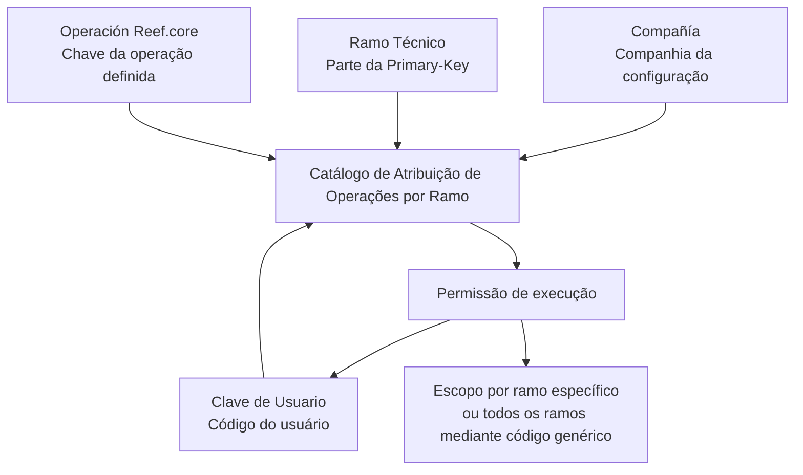
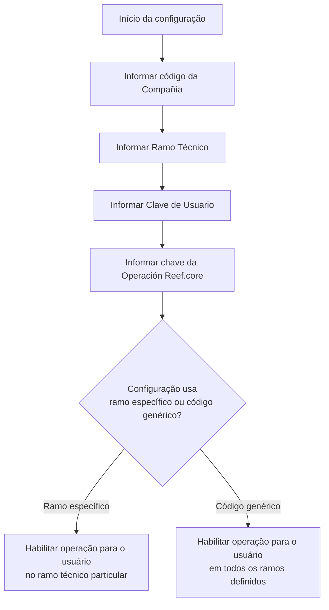

# Atribuição de Acessos às Operações do Reef.core por Usuário e Ramo Técnico

## 1. Metadados do Documento
- **Arquivo de Origem:** Não identificado no conteúdo fornecido
- **Tipo de Documento:** Especificação Técnica Funcional
- **Domínio / Sistema:** Reef.core / DOCUMENTACIÓN Reef / Mapfre
- **Público-Alvo:** Usuários administradores, analistas funcionais e equipes responsáveis pela configuração de acessos no Reef.core
- **Data/Versão Identificada:** Não identificada

---

## 2. Resumo Executivo & Contexto de Negócio

O documento descreve o catálogo de **Asignación de Operaciones por Ramo en Reef.core a los Usuarios de la Entidad**. O objetivo funcional do catálogo é determinar se os usuários de uma entidade possuem ou não permissões de execução sobre todas ou apenas parte das operações existentes no Reef.core.

A configuração de acesso é baseada em quatro propriedades: **Compañía**, **Ramo Técnico**, **Clave de Usuario** e **Operación Reef.core**. Esses atributos relacionam a companhia para a qual a configuração está sendo realizada, o ramo técnico autorizado, o código do usuário e a chave da operação definida no Reef.core.

O documento informa que o **Ramo Técnico** participa da **Primary-Key** do catálogo. Essa característica permite habilitar operações para um usuário em um ramo específico ou para todos os ramos definidos, desde que seja informado o código genérico na configuração.

O conteúdo também alerta para a existência de diretrizes e documentos funcionais relacionados. A leitura desses materiais é recomendada porque a interpretação isolada deste documento pode conduzir a erro. Não são apresentados detalhes adicionais sobre a interface de configuração, valores válidos, código genérico, mecanismos de validação ou contratos técnicos do Reef.core.

---

## 3. Arquitetura, Componentes & Tecnologias Envolvidas

### Componentes e entidades identificados

| Componente / Entidade | Papel descrito no documento |
| :--- | :--- |
| **Reef.core** | Sistema que define operações e oferece a capacidade funcional de atribuir permissões de execução aos usuários da entidade. |
| **Catálogo de Atribuição de Operações por Ramo** | Catálogo utilizado para configurar o acesso de usuários às operações do Reef.core. |
| **Usuário da Entidade** | Usuário cujo código é configurado no catálogo e que poderá ou não executar operações. |
| **Compañía** | Companhia sobre a qual a configuração de acessos é realizada. |
| **Ramo Técnico** | Código do ramo técnico ao qual o acesso é permitido; integra a Primary-Key do catálogo. |
| **Operação Reef.core** | Operação definida no Reef.core, identificada pela respectiva chave. |
| **DOCUMENTACIÓN Reef / Mapfredocument** | Repositório ou contexto documental exibido no conteúdo de origem. |
| **Owner: `user:agonzalez_mapfre.com`** | Proprietário apresentado na área de documentação. |
| **Lifecycle: Approved Source** | Estado de ciclo de vida exibido na área de documentação. |



> **Nota de Análise:** O documento identifica o Reef.core, o catálogo de atribuição e os atributos de configuração, mas não descreve arquitetura de infraestrutura, APIs, protocolos, bancos de dados, métodos HTTP, contratos JSON, autenticação ou topologia de implantação.

---

## 4. Regras de Negócio, Especificações Funcionais & Processos

### Objetivo funcional

1. O Reef.core possui a faculdade de atribuir permissões de execução aos usuários de uma entidade.
2. A atribuição pode determinar que o usuário:
   - possua permissão de execução sobre todas as operações existentes; ou
   - possua permissão de execução somente sobre parte das operações existentes.
3. A configuração é efetuada no catálogo de atribuição de operações por ramo.

### Regras de configuração de acesso

1. A configuração deve informar a **Compañía** sobre a qual os acessos estão sendo configurados.
2. A configuração deve associar um **Ramo Técnico** ao usuário autorizado.
3. A configuração deve identificar o usuário por meio da **Clave de Usuario**.
4. A configuração deve identificar a operação autorizada por meio da chave da **Operación Reef.core**.
5. O **Ramo Técnico** compõe a **Primary-Key** do catálogo.
6. A presença do Ramo Técnico na Primary-Key permite configurar operações de um usuário:
   - para um ramo técnico particular; ou
   - para todos os ramos definidos, mediante indicação de um código genérico na configuração.
7. A leitura de diretrizes e documentos funcionais relacionados é recomendada para evitar erro decorrente da interpretação isolada deste documento.

### Fluxo funcional extraído



> **Nota de Análise:** O documento não informa qual é o código genérico, não descreve como o catálogo é acessado ou mantido e não especifica se existem regras de precedência, negação explícita, expiração de acesso, aprovação ou auditoria.

---

## 5. Tabelas de Parâmetros, Ambientes e Estruturas de Dados

### Propriedades do catálogo

| Item / Parâmetro | Descrição / Função | Tipo / Valores / Formato | Ambiente / Observações |
| :--- | :--- | :--- | :--- |
| **Compañía** | Contém o código da companhia sobre a qual a configuração de acessos está sendo realizada. | Código de companhia; formato não detalhado. | Aplicável à configuração de acessos no Reef.core. |
| **Ramo Técnico** | Contém o código do ramo técnico ao qual o acesso é permitido ao usuário. | Código de ramo técnico; formato não detalhado. | Parte da Primary-Key do catálogo. Pode representar ramo específico ou todos os ramos mediante código genérico. |
| **Clave de Usuario** | Contém o código do usuário. | Código de usuário; formato não detalhado. | Identifica o usuário da entidade que receberá a configuração. |
| **Operación Reef.core** | Contém a chave da operação definida no Reef.core. | Chave de operação; formato não detalhado. | Determina a operação associada à permissão de execução. |

### Escopos de autorização por Ramo Técnico

| Item / Parâmetro | Descrição / Função | Tipo / Valores / Formato | Ambiente / Observações |
| :--- | :--- | :--- | :--- |
| Ramo técnico particular | Habilita as operações de um usuário para um ramo específico. | Código de Ramo Técnico. | O Ramo Técnico integra a Primary-Key do catálogo. |
| Todos os ramos definidos | Habilita as operações de um usuário para todos os ramos definidos. | Código genérico. | O documento não informa o valor concreto do código genérico. |

### Informações documentais identificadas

| Item / Parâmetro | Descrição / Função | Tipo / Valores / Formato | Ambiente / Observações |
| :--- | :--- | :--- | :--- |
| Documentação | Área de documentação apresentada no conteúdo. | `DOCUMENTACIÓN Reef` / `Mapfredocument`. | Não são fornecidos links diretos nem conteúdo dos documentos relacionados. |
| Owner | Proprietário exibido para o documento. | `user:agonzalez_mapfre.com` | Valor literal apresentado no texto de origem. |
| Lifecycle | Estado do ciclo de vida exibido. | `Approved Source` | Valor literal apresentado no texto de origem. |
| Idioma | Idioma exibido na interface documental. | `ES` | O conteúdo original está predominantemente em espanhol. |

> **Nota de Análise:** O documento não apresenta URLs de ambientes, nomes de servidores, portas, diretórios de logs, variáveis de ambiente, tabelas físicas, estruturas de banco de dados ou formatos de payload.

---

## 6. Bateria de Perguntas & Respostas para RAG (FAQ Sintético)

### P1: Qual é o objetivo do catálogo de atribuição de operações por ramo no Reef.core?
**R:** O catálogo permite configurar se os usuários de uma entidade terão ou não permissões de execução sobre todas ou parte das operações existentes no Reef.core. A configuração associa companhia, ramo técnico, usuário e operação do Reef.core.

### P2: Quais propriedades compõem a configuração de acesso às operações no Reef.core?
**R:** O documento identifica quatro propriedades: **Compañía**, que indica a companhia da configuração; **Ramo Técnico**, que indica o ramo ao qual o acesso é permitido; **Clave de Usuario**, que identifica o usuário; e **Operación Reef.core**, que identifica a chave da operação definida no sistema.

### P3: O que representa a propriedade Compañía no catálogo de acessos?
**R:** A propriedade **Compañía** contém o código da companhia sobre a qual a configuração de acessos está sendo realizada.

### P4: Qual é a função do Ramo Técnico na atribuição de permissões?
**R:** O **Ramo Técnico** contém o código do ramo ao qual o acesso é permitido ao usuário. O documento também informa que o Ramo Técnico faz parte da Primary-Key do catálogo de atribuição de operações.

### P5: Como habilitar uma operação do Reef.core para um usuário em apenas um ramo?
**R:** Deve-se configurar o acesso utilizando o código do Ramo Técnico específico para o qual a operação será habilitada ao usuário. O documento não detalha a tela, comando ou processo técnico utilizado para registrar essa configuração.

### P6: Como habilitar operações de um usuário para todos os ramos definidos?
**R:** O documento informa que as operações podem ser habilitadas para todos os ramos definidos quando é indicado um **código genérico** na configuração do catálogo. O valor específico desse código genérico não é apresentado.

### P7: O que é armazenado na propriedade Clave de Usuario?
**R:** A propriedade **Clave de Usuario** contém o código do usuário da entidade para o qual a permissão de execução das operações do Reef.core será configurada.

### P8: O que identifica a propriedade Operación Reef.core?
**R:** A propriedade **Operación Reef.core** contém a chave da operação definida no Reef.core. Essa chave é usada para associar a configuração de acesso a uma operação do sistema.

### P9: O documento informa os métodos HTTP ou contratos de API das operações do Reef.core?
**R:** Não. O documento apenas menciona a chave da Operación Reef.core e a configuração de permissões de execução. Métodos HTTP, endpoints, contratos JSON e mecanismos de integração não são detalhados.

### P10: Existe recomendação para uso e configuração do catálogo de atribuição de operações por ramo?
**R:** Sim. A recomendação apresentada é considerar que o Ramo Técnico integra a Primary-Key do catálogo. Essa característica permite habilitar operações para um ramo particular ou para todos os ramos definidos quando é utilizado o código genérico.

### P11: Por que o documento recomenda consultar diretrizes e documentos funcionais relacionados?
**R:** O documento recomenda a leitura de diretrizes e documentos funcionais relacionados para evitar que uma interpretação isolada do conteúdo atual conduza a erro.

### P12: O documento define o valor do código genérico usado para todos os ramos?
**R:** Não. O documento afirma que deve ser indicado um código genérico para habilitar operações em todos os ramos definidos, mas não informa qual código deve ser utilizado.

---

## 7. Glossário de Termos, Siglas & Conceitos-Chave

- **Reef.core:** Sistema mencionado como responsável por definir operações e permitir a atribuição de permissões de execução aos usuários da entidade.
- **Asignación de Operaciones por Ramo:** Catálogo de atribuição de operações por ramo técnico aos usuários da entidade no Reef.core.
- **Compañía:** Atributo que contém o código da companhia sobre a qual a configuração de acessos é realizada.
- **Ramo Técnico:** Atributo que contém o código do ramo técnico ao qual é permitido acesso ao usuário.
- **Clave de Usuario:** Atributo que contém o código do usuário.
- **Operación Reef.core:** Propriedade que contém a chave da operação definida no Reef.core.
- **Primary-Key:** Termo utilizado no documento para indicar que o Ramo Técnico compõe a chave primária do catálogo.
- **Código genérico:** Código mencionado como mecanismo para habilitar operações de um usuário em todos os ramos definidos; o valor não é especificado.
- **DOCUMENTACIÓN Reef:** Denominação exibida para a área ou contexto de documentação.
- **Mapfredocument:** Termo exibido na área documental; sua função específica não é detalhada.
- **Lifecycle:** Campo exibido na área de documentação com o valor `Approved Source`.
- **ES:** Indicador de idioma exibido na interface documental.

---

## 8. Notas Críticas, Riscos & Limitações

- A interpretação isolada do documento pode conduzir a erro; o próprio conteúdo recomenda a leitura de diretrizes e documentos funcionais relacionados.
- O documento não informa o valor do código genérico utilizado para aplicar a habilitação de operações a todos os ramos definidos.
- Não há descrição de interface, comandos, APIs, telas, serviços, endpoints ou procedimentos técnicos para criar, alterar ou remover atribuições.
- Não são definidos formatos, tamanhos, validações ou domínios permitidos para os códigos de companhia, ramo técnico, usuário e operação.
- Não são documentadas regras de precedência quando um usuário possui configurações simultâneas por ramo específico e por código genérico.
- O documento não descreve mecanismos de auditoria, trilha de alteração, aprovação, segregação de funções, expiração ou revogação de permissões.
- Não há informações sobre ambientes, servidores, URLs, logs, monitoramento, banco de dados ou integrações externas.
- O termo `Mapfredocument` e os campos `Owner` e `Lifecycle` são exibidos no conteúdo, mas sua relação operacional com o catálogo de acessos não é detalhada.

---

## 9. Conteúdo Bruto Estruturado (Referência Fiel)

```text
--- [PÁGINA 1 DE 1] ---

ASIGNACIÓN de ACCESOS a las OPERACIONES de Reef.core
Objetivo
Funcionalmente Reef.core cuenta con la facultad de asignar a los Usuarios de la Entidad si van a poder contar o no con permisos de
ejecución sobre todas o parte de las Operaciones existentes.
Propiedades
Propiedades
Compañía
Este Atributo del catálogo contiene el código de la compañía sobre la cual se está realizando la conguración de los accesos.
Ramo Técnico
Esta propiedad del catálogo contiene el código del Ramo Técnico al que se está permitiendo el acceso al Usuario.
Clave de Usuario
Este Atributo del catálogo contiene el código del Usuario.
Operación Reef.core
Esta Propiedad del catálogo contiene la clave de la Operación denida en Reef.core.
Vínculos
Relación de Directrices y Documentos funcionales cuya lectura recomendada para evitar que la interpretación aislada del presente
documento pueda conducir a error.
Preguntas frecuentes
(1) ¿Existe alguna recomendación que pueda ser tomada en consideración en el uso y conguración del Catálogo de Asignación de
Operaciones por Ramo en Reef.core a los Usuarios de la Entidad?
Puesto que este catálogo contempla el Ramo Técnico como parte de su Primary-Key se pueden habilitar las operaciones de un usuario para
un ramo en particular o para todos los ramos denidos si se indica el código genérico en su conguración.
Documentation / DOCUMENTACIÓN Reef
DOCUMENTACIÓN Reef
Mapfredocument
DOCUMENTACIÓN Reef
Owner
user:agonzalez_mapfre.com
Lifecycle
Approved Source
 / 
 VL
Buscar Inicio Soluciones Arquitecturas APIs Componentes Cloud Documentación Zeus Reef Ayuda
ES
```
