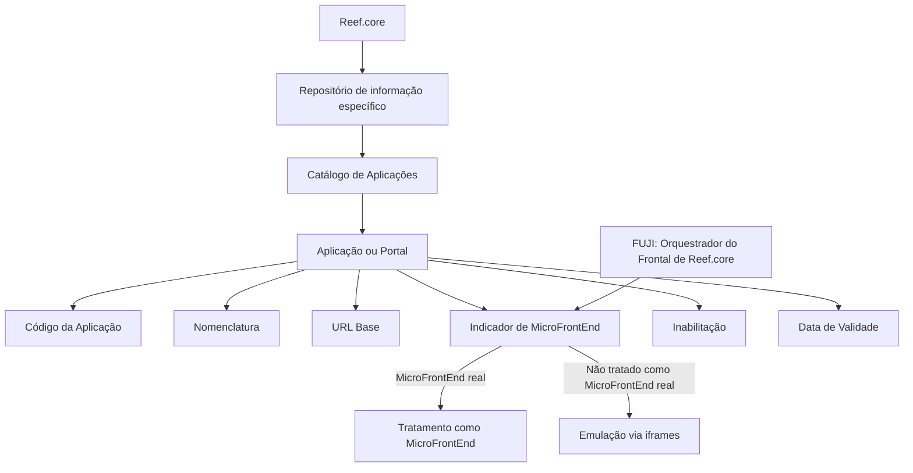

# Definição das Aplicações no Catálogo de Aplicações do Reef.core

## 1. Metadados do Documento
- **Arquivo de Origem:** Não identificado no conteúdo fornecido
- **Tipo de Documento:** Especificação Técnica
- **Domínio / Sistema:** Reef.core / Catálogo de Aplicações
- **Público-Alvo:** Desenvolvedores, Arquitetos, Operação e responsáveis pela configuração de catálogos
- **Data/Versão Identificada:** Não identificada

---

## 2. Resumo Executivo & Contexto de Negócio

O documento descreve a definição funcional de aplicações e portais no repositório de informações específico do Reef.core. O objetivo é codificar e administrar a relação de Aplicações Software do Sistema por meio de propriedades associadas a cada aplicação ou portal.

A configuração no Catálogo de Aplicações do Reef.core abrange, entre outros atributos, o código da aplicação, a nomenclatura, a URL base, a indicação de MicroFrontEnd, o status de inabilitação e a data de validade. Essas propriedades permitem identificar, acessar, classificar e controlar a disponibilidade operacional das aplicações.

O documento estabelece que FUJI atua como orquestrador do frontal do Reef.core. A propriedade que identifica uma aplicação como MicroFrontEnd determina se FUJI pode tratá-la como um MicroFrontEnd real, em substituição à emulação anterior via `iframes`.

A data de validade permite que uma aplicação seja considerada plenamente operativa a partir de uma data específica, preservando o histórico das alterações realizadas em suas definições. O documento também declara explicitamente que não existem restrições ou recomendações adicionais para o uso e a definição do Catálogo de Aplicações do Reef.core.

---

## 3. Arquitetura, Componentes & Tecnologias Envolvidas

Os componentes e conceitos explicitamente citados são:

| Componente / Conceito | Papel descrito |
| :--- | :--- |
| Reef.core | Sistema que possui um repositório específico para codificar a relação de Aplicações Software do Sistema. |
| Catálogo de Aplicações | Estrutura de configuração que utiliza códigos de aplicação ou portal. |
| Aplicação / Portal | Entidade configurável com código, nomenclatura, URL base, status de MicroFrontEnd, inabilitação e data de validade. |
| FUJI | Orquestrador do frontal do Reef.core. |
| MicroFrontEnd | Aplicação ou portal que FUJI pode tratar como MicroFrontEnd real. |
| `iframes` | Mecanismo de emulação usado anteriormente para tratar aplicações que não eram consideradas MicroFrontEnd reais. |
| Mapfredocument | Ambiente ou contexto exibido na interface de documentação Reef. |
| TRON | Referência presente no exemplo de URL `https://tron-desa-espejo.mapfre.net`. |



> **Nota de Análise:** O documento cita FUJI como orquestrador do frontal do Reef.core, mas não detalha interfaces, contratos, métodos HTTP, tecnologias de implementação ou regras técnicas de integração.

---

## 4. Regras de Negócio, Especificações Funcionais & Processos

### 4.1. Relação de Aplicações Software

O Reef.core possui a capacidade funcional de codificar a relação de Aplicações Software do Sistema em um repositório de informações específico do Reef.core.

### 4.2. Propriedade: Aplicação

A propriedade **Aplicação** contém o código da Aplicação ou Portal de Reef.core.

Exemplos de códigos apresentados:

- `GDC`
- `TSY`
- `LSS`
- `SPL`

### 4.3. Propriedade: Nomenclatura da Aplicação

A propriedade **Nomenclatura da Aplicação** contém a nomenclatura da Aplicação ou Portal.

Os exemplos fornecidos associam os códigos às seguintes nomenclaturas:

- `GDC` — GENERADOR DE CONCEPTOS
- `TSY` — NUEVO FRONTAL DE TESORERÍA
- `LSS` — NUEVO FRONTAL DE SINIESTROS
- `SPL` — NUEVO FRONTAL ÓRDENES DE SERVICIO

### 4.4. Propriedade: URL Base da Aplicação

A propriedade **URL Base da Aplicação** contém a URL de acesso à Aplicação ou Portal.

Exemplo literal fornecido:

```text
https://tron-desa-espejo.mapfre.net
```

> **Nota de Análise:** O conteúdo não informa se a URL base é obrigatória, quais formatos adicionais são aceitos, nem a forma de validação da URL.

### 4.5. Propriedade: Aplicação ou Portal é um MicroFrontEnd

Esta propriedade identifica se FUJI, como Orquestrador do Frontal de Reef.core, pode ou não tratar a Aplicação como um MicroFrontEnd real.

Quando a aplicação é tratada como MicroFrontEnd real, FUJI deixa de utilizar a emulação via `iframes` que era utilizada anteriormente.

### 4.6. Propriedade: Inabilitação

A propriedade **Inabilitação** estabelece se o código da Aplicação ou Portal está inabilitado para uso funcional na configuração dos catálogos.

### 4.7. Propriedade: Data de Validade

A propriedade **Data de Validade** informa ao sistema a data a partir da qual a Aplicação está plenamente operativa no sistema.

O uso correto da Data de Validade permite manter um histórico das alterações realizadas nas definições das aplicações ao longo do tempo.

### 4.8. Vínculos

O documento menciona vínculos com diretrizes e documentos funcionais cuja leitura é recomendada para evitar interpretações incorretas decorrentes da leitura isolada do documento atual.

### 4.9. Restrição Declarada

A seção de perguntas frequentes declara que não existe qualquer restrição ou recomendação adicional para considerar no uso e na definição do Catálogo de Aplicações do Reef.core.

---

## 5. Tabelas de Parâmetros, Ambientes e Estruturas de Dados

| Item / Parâmetro | Descrição / Função | Tipo / Valores / Formato | Ambiente / Observações |
| :--- | :--- | :--- | :--- |
| Aplicação | Contém o código da Aplicação ou Portal de Reef.core. | Código de aplicação ou portal. Exemplos: `GDC`, `TSY`, `LSS`, `SPL`. | Utilizado no Catálogo de Aplicações. |
| Nomenclatura da Aplicação | Contém o nome ou nomenclatura da Aplicação ou Portal. | Texto. | Associada ao código da aplicação. |
| URL Base da Aplicação | Contém a URL de acesso à Aplicação ou Portal. | URL. Exemplo: `https://tron-desa-espejo.mapfre.net`. | O documento não detalha regras de validação. |
| Aplicação ou Portal é um MicroFrontEnd | Identifica se FUJI pode tratar a aplicação como MicroFrontEnd real. | Indicador não especificado no texto. | Evita o tratamento por emulação via `iframes`, anteriormente utilizado. |
| Inabilitação | Define se o código da Aplicação ou Portal está inabilitado para uso funcional nos catálogos. | Estado de inabilitação; valores não especificados. | Afeta a utilização funcional na configuração dos catálogos. |
| Data de Validade | Indica a data a partir da qual a aplicação está plenamente operativa. | Data; formato não especificado. | Permite histórico das modificações de definição. |
| FUJI | Orquestrador do frontal do Reef.core. | Componente citado. | Relacionado ao tratamento de MicroFrontEnd. |
| `iframes` | Mecanismo de emulação usado anteriormente. | Mecanismo de apresentação/inclusão. | Substituído pelo tratamento como MicroFrontEnd real quando aplicável. |

| Código de Aplicação | Nomenclatura da Aplicação |
| :--- | :--- |
| `GDC` | GENERADOR DE CONCEPTOS |
| `TSY` | NUEVO FRONTAL DE TESORERÍA |
| `LSS` | NUEVO FRONTAL DE SINIESTROS |
| `SPL` | NUEVO FRONTAL ÓRDENES DE SERVICIO |

---

## 6. Bateria de Perguntas & Respostas para RAG (FAQ Sintético)

### P1: Qual é a finalidade do Catálogo de Aplicações do Reef.core?
**R:** O Catálogo de Aplicações do Reef.core suporta a codificação da relação de Aplicações Software do Sistema em um repositório de informações específico do Reef.core. Cada aplicação ou portal pode ser definido por propriedades como código, nomenclatura, URL base, condição de MicroFrontEnd, inabilitação e data de validade.

### P2: O que representa a propriedade Aplicação no Reef.core?
**R:** A propriedade Aplicação contém o código da Aplicação ou Portal de Reef.core. O documento apresenta como exemplos os códigos `GDC`, `TSY`, `LSS` e `SPL`.

### P3: Quais exemplos de códigos e nomenclaturas de aplicações são apresentados?
**R:** Os exemplos apresentados são: `GDC` para GENERADOR DE CONCEPTOS; `TSY` para NUEVO FRONTAL DE TESORERÍA; `LSS` para NUEVO FRONTAL DE SINIESTROS; e `SPL` para NUEVO FRONTAL ÓRDENES DE SERVICIO.

### P4: Para que serve a URL Base da Aplicação?
**R:** A URL Base da Aplicação contém a URL de acesso à Aplicação ou Portal. O documento fornece como exemplo `https://tron-desa-espejo.mapfre.net`, mas não descreve obrigatoriedade, regras de validação ou outros formatos aceitos.

### P5: Qual é o papel de FUJI no tratamento das aplicações do Reef.core?
**R:** FUJI é citado como o Orquestrador do Frontal de Reef.core. FUJI utiliza a propriedade que identifica uma aplicação como MicroFrontEnd para decidir se a aplicação pode ser tratada como um MicroFrontEnd real.

### P6: O que ocorre quando uma aplicação é tratada como MicroFrontEnd real?
**R:** Quando FUJI pode tratar uma Aplicação ou Portal como MicroFrontEnd real, deixa de ser necessário o tratamento por emulação com `iframes`, mecanismo utilizado anteriormente conforme o documento.

### P7: O que a propriedade Inabilitação controla?
**R:** A propriedade Inabilitação estabelece se o código da Aplicação ou Portal está inabilitado para poder ser utilizado funcionalmente na configuração dos catálogos.

### P8: Qual é a finalidade da Data de Validade de uma aplicação?
**R:** A Data de Validade informa ao sistema a partir de qual data uma Aplicação está plenamente operativa. O uso correto dessa propriedade permite manter um histórico das alterações realizadas nas definições da aplicação ao longo do tempo.

### P9: Existem restrições para o uso e a definição do Catálogo de Aplicações do Reef.core?
**R:** Não. A seção de perguntas frequentes afirma expressamente que não existe nenhuma restrição ou recomendação a considerar no uso e na definição do Catálogo de Aplicações do Reef.core.

### P10: Por que o documento recomenda a leitura de diretrizes e documentos funcionais vinculados?
**R:** O documento recomenda a leitura das diretrizes e dos documentos funcionais relacionados para evitar que uma interpretação isolada do conteúdo atual conduza a erro.

---

## 7. Glossário de Termos, Siglas & Conceitos-Chave

- **Reef.core:** Sistema que possui a capacidade de codificar a relação de Aplicações Software do Sistema em um repositório de informação específico.
- **Catálogo de Aplicações:** Estrutura de configuração que registra e utiliza informações das aplicações ou portais.
- **Aplicação / Portal:** Entidade registrada no Reef.core por meio de código, nomenclatura, URL base e demais propriedades descritas.
- **FUJI:** Orquestrador do Frontal de Reef.core, responsável por avaliar o tratamento de uma aplicação como MicroFrontEnd real.
- **MicroFrontEnd:** Tipo de aplicação ou portal que pode ser tratado por FUJI como um MicroFrontEnd real.
- **`iframes`:** Mecanismo de emulação anteriormente usado para tratar aplicações no frontal do Reef.core.
- **GDC:** Código associado a GENERADOR DE CONCEPTOS.
- **TSY:** Código associado a NUEVO FRONTAL DE TESORERÍA.
- **LSS:** Código associado a NUEVO FRONTAL DE SINIESTROS.
- **SPL:** Código associado a NUEVO FRONTAL ÓRDENES DE SERVICIO.
- **Data de Validade:** Propriedade que determina a data a partir da qual uma aplicação está plenamente operativa e viabiliza histórico de alterações.

---

## 8. Notas Críticas, Riscos & Limitações

- O documento não identifica arquivo de origem, data, versão, autor ou responsáveis pela manutenção do catálogo.
- O formato técnico dos campos, incluindo tipos de dados, valores válidos, obrigatoriedade e regras de validação, não é detalhado.
- O documento cita FUJI e o comportamento relacionado a MicroFrontEnds, mas não define contratos de integração, protocolos, endpoints ou critérios técnicos para classificação.
- Não há detalhamento sobre o fluxo operacional para criação, alteração, aprovação, inabilitação ou exclusão de registros no Catálogo de Aplicações.
- A Data de Validade é descrita como mecanismo de histórico, mas não há definição para sobreposição de períodos, retroatividade, expiração ou fuso horário.
- Embora a FAQ informe ausência de restrições ou recomendações, o documento recomenda consultar diretrizes e documentos funcionais vinculados para evitar interpretações isoladas incorretas.

---

## 9. Conteúdo Bruto Estruturado (Referência Fiel)

```text
--- [PÁGINA 1 DE 2] ---

DEFINICIÓN de las APLICACIONES
Contexto
Funcionalmente, Reef.core cuenta con la facultad de codicar la relación de Aplicaciones Software del Sistema en un repositorio de
información especíco de Reef.core.
Propiedades Operativas
Otras Propiedades
Propiedades Operativas
Aplicación
Esta Propiedad contiene el código de Aplicación o Portal de Reef.core.
Nomenclatura de la Aplicación
Esta Propiedad contiene la nomenclatura de la Aplicación o Portal de Reef.core.
A modo de ejemplo,...
APLICACIÓN NOMENCLATURA
GDC GENERADOR DE CONCEPTOS
TSY NUEVO FRONTAL DE TESORERÍA
LSS NUEVO FRONTAL DE SINIESTROS
SPL NUEVO FRONTAL ÓRDENES DE SERVICIO
... ...
URL Base de la Aplicación
Esta Propiedad contiene la url de acceso a la Aplicación o Portal, como por ejemplo: 'https://tron-desa-espejo.mapfre.net'
La Aplicación o Portal es un MicroFrontEnd
Documentation / DOCUMENTACIÓN Reef
DOCUMENTACIÓN Reef
Mapfredocument
DOCUMENTACIÓN Reef
Owner
user:agonzalez_mapfre.com
Lifecycle
Approved Source
 / 
 VL
Buscar Inicio Soluciones Arquitecturas APIs Componentes Cloud Documentación Zeus Reef Ayuda
ES


--- [PÁGINA 2 DE 2] ---

Esta Propiedad identica si FUJI, como Orquestador del Frontal de Reef.core, puede o no tratar la Aplicación como un MicroFrontEnd real y no
vía emulación con iframes como se hacía anteriormente.
Otras Propiedades
Inhabilitación
Esta propiedad establece si el Código de la Aplicación o Portal está inhabilitado para poder ser utilizado funcionalmente en la conguración
de los catálogos.
Fecha de Validez
Esta propiedad le indica al Sistema la fecha a partir de la cual la Aplicación está plenamente operativa en el sistema por lo que su correcto
uso permite tener un histórico de los cambios efectuados en sus deniciones a lo largo del tiempo.
Vínculos
Relación de Directrices y Documentos funcionales cuya lectura recomendada para evitar que la interpretación aislada del presente
documento pueda conducir a error.
Roles de Información Parcial por Aplicación
Preguntas frecuentes
(1) ¿Existe alguna restricción que tenga que ser tomada en cuenta en el uso y denición del Catálogo de Aplicaciones de Reef.core?
No existe Restricción o Recomendación alguna.
```
