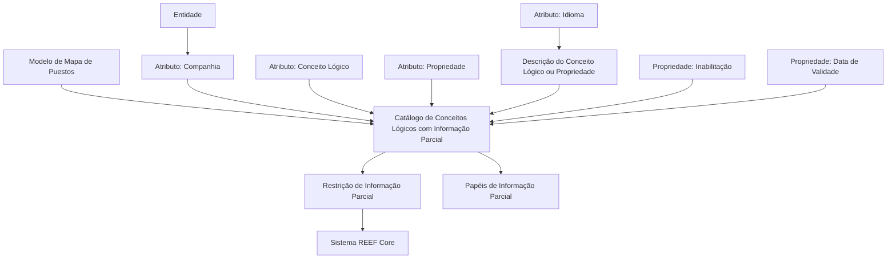
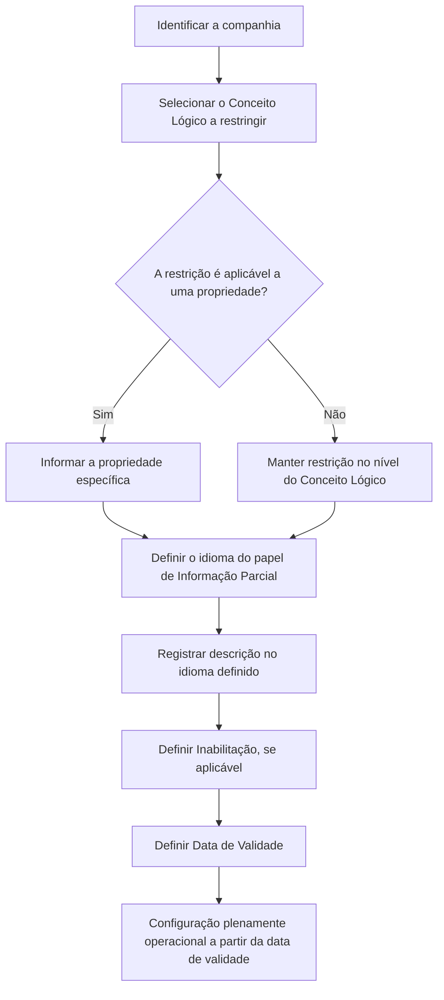

# Definição de Conceitos Lógicos com Informação Parcial no REEF Core

## 1. Metadados do Documento
- **Arquivo de Origem:** Não identificado no conteúdo fornecido
- **Tipo de Documento:** Especificação Funcional / Documentação de Sistema
- **Domínio / Sistema:** REEF Core; catálogo de Conceitos Lógicos com Informação Parcial
- **Público-Alvo:** Analistas funcionais, administradores de catálogo, arquitetos e equipes de configuração do sistema
- **Data/Versão Identificada:** Não identificada
- **Status identificado:** Approved Source
- **Owner identificado:** `user:agonzalez_mapfre.com`

---

## 2. Resumo Executivo & Contexto de Negócio

O documento descreve a configuração de restrições de **Informação Parcial** no sistema REEF Core. A funcionalidade permite definir, em um catálogo especificamente criado para essa finalidade, se um **Conceito Lógico** e/ou uma propriedade específica desse Conceito Lógico estará sujeito a algum tipo de restrição de Informação Parcial.

A configuração é orientada por atributos de catálogo que identificam a companhia, o Conceito Lógico a restringir, a propriedade específica — quando aplicável — e o idioma usado na definição do papel de Informação Parcial. O documento também prevê uma descrição localizada do Conceito Lógico ou da propriedade, de acordo com o idioma informado.

O catálogo inclui controles operacionais para inabilitar um Conceito Lógico com Informação Parcial e definir sua data de validade. A data de validade determina a partir de quando a configuração fica plenamente operacional no sistema e é apresentada como mecanismo para manter histórico das mudanças efetuadas nas definições.

Como recomendação de uso, o documento indica que a configuração dos papéis nesse catálogo pode começar segundo o modelo de **Mapa de Puestos da Entidade**. O conteúdo também referencia documentos e diretrizes correlatos sobre papéis de Informação Parcial, incluindo configurações por aplicação e por Conceito Lógico.

---

## 3. Arquitetura, Componentes & Tecnologias Envolvidas

O documento não detalha arquitetura física, protocolos, APIs, contratos JSON, banco de dados, tecnologias de infraestrutura, ambientes ou métodos HTTP. A arquitetura funcional explicitamente identificada é composta pelo sistema REEF Core, um catálogo de configuração de Conceitos Lógicos com Informação Parcial, Conceitos Lógicos, propriedades desses conceitos e papéis de Informação Parcial.



> **Nota de Análise:** O documento menciona REEF Core e o catálogo de Conceitos Lógicos com Informação Parcial, mas não especifica interfaces, tabelas físicas, integrações, endpoints, métodos HTTP, autenticação ou contratos de dados.

---

## 4. Regras de Negócio, Especificações Funcionais & Processos

### 4.1 Configuração de Informação Parcial

1. O REEF Core possui a possibilidade funcional de configurar restrições de Informação Parcial.
2. A restrição pode ser configurada:
   - para um Conceito Lógico;
   - para uma ou mais propriedades de um Conceito Lógico.
3. A configuração deve ocorrer em um catálogo de informação criado especificamente para esse fim.
4. O catálogo deve identificar a companhia sobre a qual a configuração está sendo realizada.
5. O catálogo deve identificar o código do Conceito Lógico que será restringido.
6. Quando a restrição for aplicada a uma propriedade, o catálogo deve identificar a propriedade específica do Conceito Lógico que se deseja restringir.
7. O idioma é a chave do idioma empregado na definição do papel de Informação Parcial. O documento apresenta como exemplos espanhol, inglês e português.
8. A descrição do Conceito Lógico ou da propriedade com Informação Parcial deve usar a nomenclatura correspondente ao idioma de definição.
9. A propriedade de Inabilitação estabelece se o Conceito Lógico com Informação Parcial está inabilitado para uso.
10. A propriedade de Data de Validade indica a data a partir da qual o Conceito Lógico com Informação Parcial fica plenamente operacional no sistema.
11. O uso correto da Data de Validade permite manter histórico dos cambios efetuados nas definições.

### 4.2 Fluxo funcional de configuração



### 4.3 Diretriz de configuração

O documento recomenda iniciar a configuração dos papéis no catálogo considerando o modelo de **Mapa de Puestos da Entidade**. A recomendação é apresentada como boa prática, e não como uma obrigatoriedade explicitamente definida.

### 4.4 Documentos relacionados

A interpretação isolada do documento pode conduzir a erro. Por esse motivo, são indicadas como leituras relacionadas:

- Roles de Información Parcial;
- Roles de Información Parcial por Aplicación;
- Roles de Información Parcial por Concepto Lógico.

---

## 5. Tabelas de Parâmetros, Ambientes e Estruturas de Dados

| Item / Parâmetro | Descrição / Função | Tipo / Valores / Formato | Ambiente / Observações |
| :--- | :--- | :--- | :--- |
| Companhia | Contém o código da companhia sobre a qual é realizada a configuração do Conceito Lógico ou de alguma propriedade. | Código de companhia; formato não detalhado. | Aplicável ao catálogo de Conceitos Lógicos com Informação Parcial. |
| Conceito Lógico | Contém o código do Conceito Lógico que deve ser restringido. | Código de Conceito Lógico; formato não detalhado. | Pode receber restrição de Informação Parcial. |
| Propriedade | Contém a propriedade específica do Conceito Lógico que deve ser restringida. | Identificador de propriedade; formato não detalhado. | Aplicável quando a restrição incidir sobre propriedade. |
| Idioma | Chave do idioma usado na definição do papel de Informação Parcial. | Exemplos: espanhol, inglês, português. | O documento não apresenta a lista completa de idiomas nem seus códigos. |
| Descrição do Conceito Lógico ou Propriedade | Contém a nomenclatura do Conceito Lógico ou da propriedade com Informação Parcial, conforme o idioma de definição. | Texto localizado; formato não detalhado. | Associada ao idioma definido. |
| Inabilitação | Estabelece se o Conceito Lógico com Informação Parcial está inabilitado para ser utilizado. | Valor não detalhado. | Controle operacional. |
| Data de Validade | Indica a data a partir da qual o Conceito Lógico com Informação Parcial fica plenamente operacional. | Data; formato não detalhado. | Permite histórico de mudanças nas definições. |
| REEF Core | Sistema que suporta a configuração de restrições de Informação Parcial. | Sistema corporativo. | Não há detalhes técnicos adicionais no texto. |
| Mapa de Puestos da Entidade | Modelo recomendado como referência para iniciar a configuração dos papéis. | Modelo organizacional; estrutura não detalhada. | Recomendação de boa prática. |
| Roles de Información Parcial | Documento/diretriz relacionada. | Referência documental. | Leitura recomendada. |
| Roles de Información Parcial por Aplicación | Documento/diretriz relacionada. | Referência documental. | Leitura recomendada. |
| Roles de Información Parcial por Concepto Lógico | Documento/diretriz relacionada. | Referência documental. | Leitura recomendada. |

---

## 6. Bateria de Perguntas & Respostas para RAG (FAQ Sintético)

### P1: Qual é a finalidade do catálogo de Conceitos Lógicos com Informação Parcial no REEF Core?
**R:** O catálogo permite configurar se um Conceito Lógico e/ou uma propriedade de um Conceito Lógico terá algum tipo de restrição de Informação Parcial. O documento informa que esse catálogo foi criado especificamente para essa finalidade.

### P2: Uma restrição de Informação Parcial pode ser configurada apenas no nível de uma propriedade?
**R:** Não. A configuração pode ser aplicada ao Conceito Lógico e/ou às propriedades desse Conceito Lógico. O documento permite restringir o conceito completo ou uma propriedade específica.

### P3: Qual atributo identifica a empresa para a qual a configuração está sendo realizada?
**R:** O atributo **Companhia** contém o código da companhia sobre a qual está sendo realizada a configuração do Conceito Lógico ou de alguma de suas propriedades.

### P4: Como é identificado o Conceito Lógico que deve receber restrição?
**R:** O atributo **Conceito Lógico** contém o código do Conceito Lógico que será restringido no catálogo de Informação Parcial.

### P5: Quando deve ser preenchido o atributo Propriedade?
**R:** O atributo **Propriedade** deve ser utilizado quando a restrição de Informação Parcial recair sobre uma propriedade específica de um Conceito Lógico. Ele contém a propriedade que se deseja restringir.

### P6: Qual é a função do idioma na configuração de Informação Parcial?
**R:** O idioma é a chave do idioma utilizado para definir o papel de Informação Parcial. O documento cita espanhol, inglês e português como exemplos. A descrição do Conceito Lógico ou da propriedade deve respeitar o idioma de sua definição.

### P7: O que a propriedade Inabilitação controla?
**R:** A propriedade **Inabilitação** estabelece se o Conceito Lógico com Informação Parcial está inabilitado para ser utilizado.

### P8: Quando uma configuração de Conceito Lógico com Informação Parcial passa a estar plenamente operacional?
**R:** A configuração fica plenamente operacional a partir da data definida na propriedade **Data de Validade**.

### P9: Qual é o benefício de configurar a Data de Validade?
**R:** Segundo o documento, o uso correto da Data de Validade permite manter um histórico das mudanças efetuadas nas definições de Conceitos Lógicos com Informação Parcial.

### P10: Qual boa prática é recomendada para iniciar a configuração dos papéis no catálogo?
**R:** O documento recomenda, como boa prática, iniciar a configuração dos papéis de acordo com o modelo de Mapa de Puestos da Entidade.

### P11: Quais documentos devem ser consultados para evitar interpretação isolada incorreta?
**R:** O documento recomenda a leitura de **Roles de Información Parcial**, **Roles de Información Parcial por Aplicación** e **Roles de Información Parcial por Concepto Lógico**.

### P12: O documento especifica APIs, métodos HTTP ou contratos JSON do REEF Core?
**R:** Não. O documento descreve atributos funcionais do catálogo e controles operacionais, mas não detalha APIs, métodos HTTP, contratos JSON, endpoints ou integrações técnicas.

---

## 7. Glossário de Termos, Siglas & Conceitos-Chave

- **REEF Core:** Sistema citado como possuidor da funcionalidade de configurar restrições de Informação Parcial em Conceitos Lógicos e propriedades.
- **Informação Parcial:** Tipo de restrição configurável sobre um Conceito Lógico ou uma propriedade de Conceito Lógico.
- **Conceito Lógico:** Entidade identificada por código que pode receber uma restrição de Informação Parcial.
- **Propriedade:** Elemento específico de um Conceito Lógico que também pode ser restringido.
- **Catálogo de Conceitos Lógicos com Informação Parcial:** Catálogo criado especificamente para configurar restrições de Informação Parcial.
- **Companhia:** Atributo que contém o código da empresa sobre a qual a configuração é realizada.
- **Idioma:** Chave do idioma empregado na definição do papel de Informação Parcial.
- **Inabilitação:** Propriedade que determina se um Conceito Lógico com Informação Parcial está inabilitado para uso.
- **Data de Validade:** Data a partir da qual a configuração fica plenamente operacional, permitindo histórico de mudanças.
- **Mapa de Puestos:** Modelo da Entidade indicado como referência recomendada para iniciar a configuração dos papéis.
- **Roles de Información Parcial:** Referência documental relacionada à funcionalidade de Informação Parcial.

---

## 8. Notas Críticas, Riscos & Limitações

- O documento não identifica o arquivo de origem, data, versão, autor formal, ambiente ou ciclo de implantação.
- Não há especificação de tecnologia, modelo de dados físico, APIs, integrações, autenticação, permissões, valores válidos ou formato dos campos.
- O documento não explica o comportamento do sistema para valores ausentes, datas inválidas, conflito entre configurações, duplicidade de registros ou tentativas de uso de um Conceito Lógico inabilitado.
- A Data de Validade é declarada como mecanismo de histórico, mas não são definidos procedimentos de versionamento, consulta de histórico ou tratamento de datas sobrepostas.
- A interpretação isolada pode conduzir a erro; o próprio documento recomenda consultar as diretrizes relacionadas sobre papéis de Informação Parcial.
- **Nota de Análise:** O conteúdo não detalha os métodos pelos quais as restrições configuradas são aplicadas em tempo de execução no REEF Core.

---

## 9. Conteúdo Bruto Estruturado (Referência Fiel)

```text
--- [PÁGINA 1 DE 2] ---

DEFINICIÓN de los Conceptos Lógicos con Información Parcial
Contexto
Funcionalmente Reef.core cuenta con la posibilidad de congurar en los Conceptos Lógicos y/o sus propiedades si van a contar o no con
algún tipo de restricción de Información Parcial en un catálogo de información especícamente creado al efecto.
Propiedades Operativas
Otras Propiedades
Propiedades Operativas
Compañía
Este Atributo del catálogo contiene el código de la compañía sobre la cual se está realizando la conguración del concepto lógico o alguna de
sus propiedades.
Concepto Lógico
Este Atributo del catálogo contiene el código del Concepto Lógico a Restringir.
Propiedad
Este Atributo del catálogo contiene la Propiedad especíca del Concepto Lógico que se desea Restringir.
Idioma.
Esta propiedad es la clave del Idioma empleado en la denición del Rol de Información Parcial como por ejemplo: español, inglés, portugués,
...
Descripción del Concepto Lógico o Propiedad
Este Atributo del catálogo contiene la nomenclatura del Concepto Lógico o Propiedad con Información Parcial de acuerdo con el idioma de
su denición.
Otras Propiedades
Inhabilitación
Esta propiedad establece si el Concepto Lógico con Información Parcial está inhabilitado para poder ser utilizado.
Fecha de Validez
Documentation / DOCUMENTACIÓN Reef
DOCUMENTACIÓN Reef
Mapfredocument
DOCUMENTACIÓN Reef
Owner
user:agonzalez_mapfre.com
Lifecycle
Approved Source
 /
VL
Buscar Inicio Soluciones Arquitecturas APIs Componentes Cloud Documentación Zeus Reef Ayuda
ES

--- [PÁGINA 2 DE 2] ---

Esta propiedad le indica al Sistema la fecha a partir de la cual el Concepto Lógico con Información Parcial está plenamente operativo en el
sistema por lo que su correcto uso permite tener un histórico de los cambios efectuados en sus deniciones.
Vínculos
Relación de Directrices y Documentos funcionales cuya lectura recomendada para evitar que la interpretación aislada del presente
documento pueda conducir a error.
Roles de Información Parcial
Roles de Información Parcial por Aplicación
Roles de Información Parcial por Concepto Lógico
Preguntas frecuentes
(1) ¿Existe alguna recomendación que pueda ser tomada en consideración en el uso y denición del Catálogo de Conceptos Lógicos con
Información Parcial del Sistema?
Puede ser una buena práctica iniciar la conguración de los Roles en este catálogo de acuerdo con el modelo de Mapa de Puestos de la
Entidad.
```
