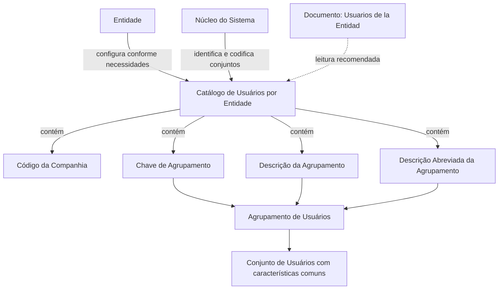

# Definição de Agrupamentos de Usuários por Entidade no REEF

## 1. Metadados do Documento
- **Arquivo de Origem:** Não informado no conteúdo fornecido
- **Tipo de Documento:** Especificação Funcional
- **Domínio / Sistema:** REEF / Catálogo de Usuários por Entidade
- **Público-Alvo:** Negócio, analistas funcionais, administradores do catálogo e equipes de configuração de entidades
- **Data/Versão Identificada:** Não identificada
- **Owner identificado:** `user:agonzalez_mapfre.com`
- **Lifecycle identificado:** Approved Source

---

## 2. Resumo Executivo & Contexto de Negócio

O documento define o conceito de **Agrupamento de Usuários** como um conjunto de usuários que compartilham características comuns. O catálogo de agrupamentos é disponibilizado no núcleo do sistema para permitir que cada entidade identifique e codifique os conjuntos em que seus usuários estão distribuídos.

O catálogo de informações é entregue inicialmente sem conteúdo. Cada entidade é responsável por configurá-lo de acordo com as próprias necessidades organizacionais e operacionais. Os exemplos fornecidos indicam usos para identificação de domínios hierárquicos, estruturas de trabalho e posições dentro da entidade.

A definição funcional do catálogo inclui propriedades operativas para vincular um agrupamento a uma companhia, atribuir uma chave de agrupamento, registrar uma descrição completa e manter uma descrição abreviada. Os exemplos mostram códigos e descrições associados a centros de emissão, centros tramitadores, usuários centrais e perfis de subscritores.

O documento também alerta que a leitura isolada pode levar a interpretações incorretas e recomenda consultar documentos funcionais relacionados, especialmente o conteúdo denominado **“Usuarios de la Entidad”**. Não existe recomendação corporativa específica para o uso ou a configuração do catálogo de agrupamentos de usuários.

---

## 3. Arquitetura, Componentes & Tecnologias Envolvidas

Os elementos identificados no documento são:

| Componente / Elemento | Papel identificado no documento |
| :--- | :--- |
| REEF | Contexto de documentação e sistema no qual o catálogo é apresentado. |
| Núcleo do Sistema | Possui a capacidade de identificar e codificar conjuntos de usuários. |
| Catálogo de Usuários por Entidade | Catálogo de informações usado para configurar agrupamentos de usuários por entidade. |
| Entidade | Responsável por configurar o catálogo inicialmente vazio conforme suas necessidades. |
| Companhia | Atributo que contém o código da companhia para a qual a definição é realizada. |
| Agrupamento de Usuários | Conjunto de usuários com características comuns. |
| Documento “Usuarios de la Entidad” | Documento funcional relacionado cuja leitura é recomendada. |



**Nota de Análise:** O conteúdo fornecido não detalha tecnologias de implementação, APIs, métodos HTTP, contratos JSON, bases de dados, integrações, URLs de ambientes ou mecanismos de autenticação.

---

## 4. Regras de Negócio, Especificações Funcionais & Processos

### 4.1 Definição de Agrupamento de Usuários

Um Agrupamento de Usuários corresponde a um conjunto de usuários que possuem características comuns entre si.

### 4.2 Configuração do catálogo

1. O núcleo do sistema possui a possibilidade de identificar e codificar os conjuntos nos quais os usuários são distribuídos.
2. Esses conjuntos são mantidos em um catálogo de informações.
3. O catálogo é entregue às entidades inicialmente vazio de conteúdo.
4. Cada entidade configura o catálogo conforme suas próprias necessidades.
5. Os usos exemplificados para a configuração incluem:
   - Domínios hierárquicos;
   - Estrutura de trabalho;
   - Posições na entidade.

### 4.3 Propriedades operativas

#### Companhia
O atributo **Companhia** do catálogo de usuários por entidade contém o código da companhia sobre a qual a definição está sendo realizada.

#### Chave de Agrupamento
O atributo **Chave de Agrupamento** do catálogo de usuários da entidade contém o código do agrupamento de usuários.

#### Descrição da Agrupamento
A propriedade **Descrição da Agrupamento** informa ao sistema a denominação ou descrição do agrupamento de usuários.

Exemplos apresentados:

| Agrupamento | Descrição |
| :--- | :--- |
| `01` | Usuarios Centros de Emisión |
| `02` | Usuarios Centros Tramitadores |
| `03` | Usuarios Central |
| `A100` | Suscriptores Junior |
| `B100` | Suscriptores Senior |

#### Descrição Abreviada da Agrupamento
A propriedade **Descrição Abreviada da Agrupamento** informa ao sistema uma denominação ou descrição abreviada do agrupamento de usuários.

Exemplos apresentados:

| Agrupamento | Abreviatura / Descrição |
| :--- | :--- |
| `01-EMI-AA1` | `EMAA1` - Usuarios Centro de Emisión AA1 |
| `01-EMI-AA2` | `EMAA2` - Usuarios Centro de Emisión AA2 |
| `01-SIN-00A` | `SI00A` - Usuarios Tramitación (Madrid) |

### 4.4 Vínculos e documentação relacionada

O documento aponta a existência de diretrizes e documentos funcionais cuja leitura é recomendada para evitar que a interpretação isolada do conteúdo gere erros. O vínculo explicitamente identificado é:

- **Usuarios de la Entidad**

### 4.5 Recomendação corporativa

Não existe recomendação corporativa específica para o bom uso ou para a configuração do Catálogo de Agrupamentos de Usuários da Entidade.

---

## 5. Tabelas de Parâmetros, Ambientes e Estruturas de Dados

| Item / Parâmetro | Descrição / Função | Tipo / Valores / Formato | Ambiente / Observações |
| :--- | :--- | :--- | :--- |
| Agrupamento de Usuários | Conjunto de usuários que compartilham características comuns. | Conceito funcional | Configurado no catálogo de usuários por entidade. |
| Catálogo de Usuários por Entidade | Repositório de informações para identificação e codificação dos conjuntos de usuários. | Catálogo funcional | Entregue inicialmente vazio para configuração pela entidade. |
| Companhia | Código da companhia sobre a qual a definição é realizada. | Código de companhia | Atributo do catálogo de usuários por entidade. |
| Chave de Agrupamento | Código do agrupamento de usuários. | Código de agrupamento | Atributo do catálogo de usuários da entidade. |
| Descrição da Agrupamento | Denominação ou descrição do agrupamento de usuários. | Texto descritivo | Exemplos: centros de emissão, centros tramitadores, usuários centrais e subscritores. |
| Descrição Abreviada da Agrupamento | Denominação ou descrição abreviada do agrupamento de usuários. | Texto abreviado | Exemplos: `EMAA1`, `EMAA2` e `SI00A`. |
| Documento relacionado | Material funcional recomendado para leitura complementar. | Referência documental | `Usuarios de la Entidad`. |
| Owner | Responsável identificado nos metadados da documentação. | Identificador de usuário | `user:agonzalez_mapfre.com` |
| Lifecycle | Estado identificado no conteúdo de documentação. | Texto | `Approved Source` |

### Exemplos de agrupamentos e descrições

| Código do Agrupamento | Descrição |
| :--- | :--- |
| `01` | Usuarios Centros de Emisión |
| `02` | Usuarios Centros Tramitadores |
| `03` | Usuarios Central |
| `A100` | Suscriptores Junior |
| `B100` | Suscriptores Senior |

### Exemplos de agrupamentos e abreviaturas

| Código do Agrupamento | Abreviatura | Descrição associada |
| :--- | :--- | :--- |
| `01-EMI-AA1` | `EMAA1` | Usuarios Centro de Emisión AA1 |
| `01-EMI-AA2` | `EMAA2` | Usuarios Centro de Emisión AA2 |
| `01-SIN-00A` | `SI00A` | Usuarios Tramitación (Madrid) |

---

## 6. Bateria de Perguntas & Respostas para RAG (FAQ Sintético)

### P1: O que é um Agrupamento de Usuários no catálogo por entidade?
**R:** Um Agrupamento de Usuários é um conjunto de usuários que compartilha características comuns. O núcleo do sistema pode identificar e codificar esses conjuntos no Catálogo de Usuários por Entidade.

### P2: O catálogo de agrupamentos já vem preenchido para as entidades?
**R:** Não. O catálogo de informações é entregue inicialmente vazio de conteúdo. Cada entidade deve configurá-lo de acordo com suas necessidades.

### P3: Quais necessidades organizacionais podem ser representadas pelos agrupamentos de usuários?
**R:** O documento apresenta como exemplos a identificação de domínios hierárquicos, a estrutura de trabalho e as posições existentes na entidade.

### P4: Qual é a função do atributo Companhia no Catálogo de Usuários por Entidade?
**R:** O atributo Companhia contém o código da companhia para a qual a definição do agrupamento está sendo realizada.

### P5: O que é armazenado na Chave de Agrupamento?
**R:** A Chave de Agrupamento contém o código do Agrupamento de Usuários no catálogo de usuários da entidade.

### P6: Para que serve a Descrição da Agrupamento?
**R:** A Descrição da Agrupamento informa ao sistema a denominação ou a descrição completa do Agrupamento de Usuários. O documento exemplifica descrições como “Usuarios Centros de Emisión”, “Usuarios Centros Tramitadores”, “Usuarios Central”, “Suscriptores Junior” e “Suscriptores Senior”.

### P7: Para que serve a Descrição Abreviada da Agrupamento?
**R:** A Descrição Abreviada da Agrupamento registra uma denominação ou descrição abreviada do Agrupamento de Usuários. Entre os exemplos estão `EMAA1`, `EMAA2` e `SI00A`.

### P8: Existe uma recomendação corporativa específica para configurar o Catálogo de Agrupamentos de Usuários?
**R:** Não. O documento declara explicitamente que não existe uma recomendação corporativa específica para o bom uso ou a configuração desse catálogo.

### P9: Qual documento funcional deve ser consultado para evitar interpretação isolada incorreta?
**R:** O documento recomenda a leitura de diretrizes e documentos funcionais relacionados, identificando especificamente o vínculo **“Usuarios de la Entidad”**.

### P10: O documento especifica APIs, métodos HTTP ou contratos JSON para o catálogo?
**R:** Não. O conteúdo fornecido descreve o conceito funcional, os atributos e exemplos de agrupamentos, mas não detalha APIs, métodos HTTP, contratos JSON, tecnologias de implementação ou mecanismos de integração.

---

## 7. Glossário de Termos, Siglas & Conceitos-Chave

- **Agrupamento de Usuários:** Conjunto de usuários que compartilham características comuns.
- **Catálogo de Usuários por Entidade:** Catálogo de informações disponibilizado para identificar e codificar conjuntos de usuários em uma entidade.
- **Chave de Agrupamento:** Código que identifica o agrupamento de usuários.
- **Companhia:** Atributo que contém o código da companhia sobre a qual uma definição é realizada.
- **Descrição da Agrupamento:** Denominação ou descrição completa de um agrupamento de usuários.
- **Descrição Abreviada da Agrupamento:** Denominação ou descrição abreviada de um agrupamento de usuários.
- **Entidade:** Organização que recebe o catálogo inicialmente vazio e realiza sua configuração segundo suas necessidades.
- **REEF:** Nome identificado no contexto de documentação e sistema; o conteúdo fornecido não expande a sigla.
- **Usuarios de la Entidad:** Documento funcional relacionado cuja leitura é recomendada.

---

## 8. Notas Críticas, Riscos & Limitações

- O catálogo é entregue inicialmente vazio; a qualidade e a consistência das classificações dependem da configuração executada por cada entidade.
- Não existe recomendação corporativa específica para o uso e a configuração do catálogo, conforme a resposta de perguntas frequentes do documento.
- O documento alerta que sua interpretação isolada pode conduzir a erro; a leitura de diretrizes e documentos funcionais relacionados é recomendada.
- O conteúdo não apresenta critérios de unicidade para códigos, regras de validação, permissões de manutenção, responsáveis operacionais, ciclo de vida dos agrupamentos ou procedimentos de exclusão.
- O conteúdo não detalha APIs, URLs, ambientes, tecnologias, integrações, persistência de dados, métodos HTTP ou contratos JSON.
- A sigla ou o nome REEF é citado no contexto documental, mas não recebe definição adicional no texto fornecido.

---

## 9. Conteúdo Bruto Estruturado (Referência Fiel)

```text
--- [PÁGINA 1 DE 2] ---

DEFINICIÓN de Agrupaciones de Usuarios
Contexto
Se entiende por una Agrupación de Usuarios al Conjunto de Usuarios que comparten características comunes entre ellos.
Funcionalmente, el núcleo del Sistema cuenta con la posibilidad de identificar y codificar los posibles Conjuntos en los que se distribuyen los
Usuarios en un catálogo de información que se entrega a las entidades inicialmente vacío de contenido para que las entidades lo configuren
de acuerdo con sus necesidades como por ejemplo parea identificar Dominios Jerárquicos, la Estructura de Trabajo, las Posiciones en la
Entidad, ... etcétera.
Propiedades Operativas
Compañía
Este Atributo del catálogo de Usuarios por Entidad contiene el código de la compañía sobre la cual se está realizando su definición.
Clave de Agrupación
Este Atributo del catálogo de Usuarios de la Entidad contiene el código de la Agrupación de los Usuarios.
Descripción de la Agrupación
Esta propiedad le indica al sistema cual es la denominación o descripción de la Agrupación de Usuarios. A modo de ejemplo ...
AGRUPACIÓN DESCRIPCIÓN
01 Usuarios Centros de Emisión
02 Usuarios Centros Tramitadores
03 Usuarios Central
... ...
A100 Suscriptores Junior
B100 Suscriptores Senior
... ...
Documentation / DOCUMENTACIÓN Reef
DOCUMENTACIÓN Reef
Mapfredocument
DOCUMENTACIÓN Reef
Owner
user:agonzalez_mapfre.com
Lifecycle
Approved Source
 / 
 VL
Buscar Inicio Soluciones Arquitecturas APIs Componentes Cloud Documentación Zeus Reef Ayuda
ES

--- [PÁGINA 2 DE 2] ---

Descripción Abreviada de la Agrupación
Esta propiedad le indica al sistema cual es la denominación o descripción abreviada de la Agrupación de los Usuarios. A modo de ejemplo ...
AGRUPACIÓN ABREVIATURA
01-EMI-AA1 EMAA1 - Usuarios Centro de Emisión AA1
01-EMI-AA2 EMAA2 - Usuarios Centro de Emisión AA2
01-SIN-00A SI00A - Usuarios Tramitación (Madrid)
... ...
Vínculos
Relación de Directrices y Documentos funcionales cuya lectura recomendada para evitar que la interpretación aislada del presente
documento pueda conducir a error.
Usuarios de la Entidad
Preguntas frecuentes
(1) ¿Existe alguna recomendación que pueda ser tomada en consideración en el uso y configuración del Catálogo de Agrupaciones de
Usuarios de la Entidad?
No existe una recomendación corporativa específica para el buen uso de este catálogo.
```
