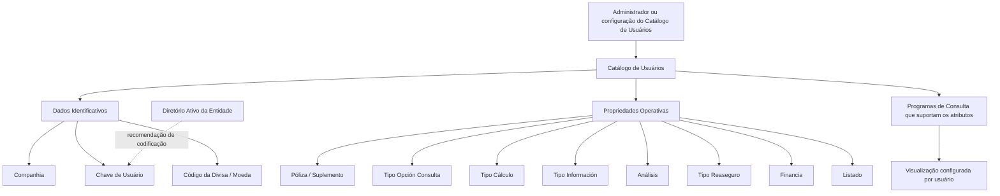

# Catálogo de Usuários — Atribuição de Parâmetros de Consulta no Sistema

## 1. Metadados do Documento
- **Arquivo de Origem:** Não identificado no conteúdo fornecido
- **Tipo de Documento:** Especificação Funcional
- **Domínio / Sistema:** DOCUMENTACIÓN Reef / Mapfre
- **Público-Alvo:** Analistas funcionais, desenvolvedores, operação e administradores de usuários
- **Data/Versão Identificada:** Não identificada
- **Status identificado no conteúdo:** `Approved Source`; seção marcada como `== Pendiente Revisión ==`

---

## 2. Resumo Executivo & Contexto de Negócio

O documento descreve a atribuição de parâmetros de consulta aos usuários do sistema. O núcleo do sistema permite configurar, por usuário, como determinadas informações serão visualizadas em programas que executam consultas sobre dados corporativos e que suportam funcionalmente essa configuração.

A configuração é identificada por companhia, chave de usuário e código de divisa/moeda. Esses atributos definem o contexto organizacional, o usuário destinatário da configuração e a moeda sobre a qual determinado parâmetro de consulta é estabelecido.

As propriedades operativas controlam principalmente a granularidade e a forma de apresentação de informações de apólices, suplementos e informações econômicas. O documento prevê opções para agrupamento por apólice, ramo, setor ou resumo de totais, além de definir se o usuário poderá aprofundar o detalhamento por meio de registros ou áreas interativas da tela.

O catálogo também possui atributos para determinar a apresentação de valores considerando ou não cessões a resseguro e juros de financiamento. Um atributo denominado `Listado` está declarado como defasado e não utilizado.

Como recomendação operacional, o documento orienta que os usuários sejam codificados neste catálogo da mesma forma que são identificados no diretório ativo da entidade. O documento referencia ainda os materiais funcionais `Usuarios` e `Monedas` como leitura recomendada para evitar interpretações isoladas ou incorretas.

---

## 3. Arquitetura, Componentes & Tecnologias Envolvidas

O conteúdo não descreve infraestrutura, APIs, métodos HTTP, contratos JSON, bancos de dados, microsserviços, versões de tecnologia ou URLs de ambientes.

Os componentes funcionais explicitamente citados são:

- **Núcleo do Sistema:** oferece configuração de visualização por usuário.
- **Catálogo de Usuários:** concentra os atributos de identificação e as propriedades operativas de consulta.
- **Programas de Consulta:** consomem os parâmetros configurados, desde que contemplem funcionalmente cada atributo.
- **Diretório Ativo da Entidade:** referência recomendada para a codificação do usuário.
- **Documentos relacionados:** `Usuarios` e `Monedas`.



> **Nota de Análise:** O documento não especifica quais programas de consulta suportam cada atributo, nem detalha os valores permitidos para `Tipo Opción Consulta`, `Tipo Cálculo`, `Tipo Reaseguro` ou `Financia`.

---

## 4. Regras de Negócio, Especificações Funcionais & Processos

### 4.1 Configuração de consulta por usuário

1. O núcleo do sistema permite configurar a forma de visualização de determinada informação por usuário.
2. A configuração é aplicável aos programas que realizam consultas sobre informações do sistema.
3. Cada programa de consulta deve contemplar funcionalmente o parâmetro para que o atributo produza efeito.
4. A atribuição é contextualizada por companhia, usuário e divisa/moeda.

### 4.2 Dados identificativos

- **Companhia:** contém o código da companhia para a qual ocorre a atribuição dos parâmetros ou critérios de consulta.
- **Chave de Usuário:** contém o código que identifica o usuário.
- **Código da Divisa:** contém o código da divisa/moeda para a qual o parâmetro é estabelecido.

### 4.3 Propriedades operativas

#### Póliza/Suplemento

Define se as informações das apólices, nos programas de consulta que suportam essa opção, serão visualizadas:

- agrupadas; ou
- individualizadas por cada suplemento emitido sobre as apólices.

#### Tipo Opción Consulta

Contém um dos valores dos possíveis tipos de opção pelos quais as informações consultadas podem ser visualizadas.

> **Nota de Análise:** O documento menciona o atributo `Tipo Opción Consulta`, mas não fornece seu catálogo de valores nem descreve as opções disponíveis.

#### Tipo Cálculo

Contém um dos valores dos possíveis tipos de cálculo pelos quais as informações consultadas podem ser visualizadas.

> **Nota de Análise:** O documento menciona o atributo `Tipo Cálculo`, mas não detalha os tipos de cálculo possíveis ou suas regras.

#### Tipo Información

Indica aos programas de consulta que suportam esse atributo se as informações econômicas serão mostradas agrupadas por uma das opções documentadas: apólice, ramo, setor ou resumo de totais.

#### Análisis

Indica se o usuário pode ou não aprofundar os dados para um nível maior de detalhe ao clicar em um registro ou em uma zona interativa da tela.

#### Tipo Reaseguro

Indica se as informações econômicas serão apresentadas:

- incluindo as cessões ao resseguro; ou
- como importes líquidos de resseguro.

#### Financia

Indica se as informações consultadas incluem ou não os juros de financiamento nos importes.

#### Listado

O atributo `Listado` está defasado e não é utilizado.

### 4.4 Recomendação de codificação de usuários

A boa prática indicada é codificar os usuários no catálogo da mesma forma que esses usuários são identificados no diretório ativo da entidade.

### 4.5 Documentação relacionada

O documento recomenda a leitura das diretrizes e documentos funcionais relacionados para evitar erros decorrentes de uma interpretação isolada:

- `Usuarios`
- `Monedas`

---

## 5. Tabelas de Parâmetros, Ambientes e Estruturas de Dados

| Item / Parâmetro | Descrição / Função | Tipo / Valores / Formato | Ambiente / Observações |
| :--- | :--- | :--- | :--- |
| Companhia | Código da companhia sobre a qual é realizada a atribuição dos parâmetros ou critérios de consulta. | Código de companhia; formato não detalhado. | Dado identificativo. |
| Chave de Usuário | Código pelo qual o usuário é identificado. | Código de usuário; formato não detalhado. | Dado identificativo. Recomenda-se alinhamento com o diretório ativo da entidade. |
| Código da Divisa | Código da divisa/moeda sobre a qual o parâmetro é estabelecido. | Código de divisa/moeda; formato não detalhado. | Dado identificativo. |
| Póliza/Suplemento | Define se informações de apólices são visualizadas agrupadas ou individualizadas por suplemento emitido. | Agrupada ou individualizada por suplemento. | Aplicável apenas aos programas de consulta que contemplem a opção. |
| Tipo Opción Consulta | Define um tipo de opção para visualização das informações consultadas. | Um dos possíveis tipos de opção; valores não detalhados. | Propriedade operativa. |
| Tipo Cálculo | Define um tipo de cálculo para visualização das informações consultadas. | Um dos possíveis tipos de cálculo; valores não detalhados. | Propriedade operativa. |
| Tipo Información | Define o agrupamento da informação econômica. | `P`, `R`, `S` ou `T`. | Aplicável aos programas de consulta que contemplem a opção. |
| Análisis | Define se o usuário pode aprofundar os dados por meio de clique em registro ou zona interativa. | Permite ou não permite aprofundamento; codificação não detalhada. | Propriedade operativa. |
| Tipo Reaseguro | Define a apresentação das informações econômicas em relação ao resseguro. | Incluindo cessões ao resseguro ou importes líquidos de resseguro. | Aplicável aos programas de consulta que contemplem a opção. |
| Financia | Define se os importes consultados incluem juros de financiamento. | Inclui ou não inclui juros; codificação não detalhada. | Propriedade operativa. |
| Listado | Atributo declarado defasado. | Não utilizado. | Não deve ser considerado como parâmetro operacional ativo. |

### Valores documentados para `Tipo Información`

| Código | Descrição | Efeito funcional documentado |
| :--- | :--- | :--- |
| `P` | PÓLIZA | Agrupa a informação econômica por apólice. |
| `R` | RAMO | Agrupa a informação econômica por ramo. |
| `S` | SECTOR | Agrupa a informação econômica por setor. |
| `T` | RESUMEN TOTALES | Agrupa a informação econômica como resumo de totais. |

### Referências documentais relacionadas

| Item / Parâmetro | Descrição / Função | Tipo / Valores / Formato | Ambiente / Observações |
| :--- | :--- | :--- | :--- |
| Usuarios | Documento funcional relacionado. | Referência documental. | Leitura recomendada para reduzir riscos de interpretação isolada. |
| Monedas | Documento funcional relacionado. | Referência documental. | Leitura recomendada para reduzir riscos de interpretação isolada. |

---

## 6. Bateria de Perguntas & Respostas para RAG (FAQ Sintético)

### P1: Qual é o objetivo do catálogo de usuários descrito no documento?
**R:** O catálogo permite configurar, por usuário, a forma de visualização de determinadas informações nos programas de consulta do sistema que contemplem funcionalmente essa configuração.

### P2: Quais atributos identificam uma atribuição de parâmetros de consulta?
**R:** A atribuição é identificada pelos atributos Companhia, Chave de Usuário e Código da Divisa. A Companhia indica a entidade para a qual a atribuição é realizada, a Chave de Usuário identifica o usuário e o Código da Divisa determina a moeda sobre a qual o parâmetro é estabelecido.

### P3: Como o parâmetro Póliza/Suplemento influencia a consulta?
**R:** O atributo Póliza/Suplemento indica se as informações das apólices devem ser mostradas agrupadas ou individualizadas por cada suplemento emitido sobre as apólices, desde que o programa de consulta suporte essa funcionalidade.

### P4: Quais valores de Tipo Información são documentados?
**R:** O atributo Tipo Información possui os valores `P` para PÓLIZA, `R` para RAMO, `S` para SECTOR e `T` para RESUMEN TOTALES. Esses valores determinam o agrupamento da informação econômica nos programas de consulta que contemplem o atributo.

### P5: O que significa o valor `T` em Tipo Información?
**R:** O valor `T` significa `RESUMEN TOTALES` e indica que a informação econômica deve ser visualizada como um resumo de totais.

### P6: O que o atributo Análisis controla?
**R:** O atributo Análisis indica aos programas de consulta se o usuário pode ou não aprofundar os dados em um maior nível de detalhe ao clicar sobre um registro ou uma zona interativa da tela.

### P7: Como o Tipo Reaseguro altera a visualização de informações econômicas?
**R:** O Tipo Reaseguro indica se a informação econômica será exibida incluindo as cessões ao resseguro ou como importes líquidos de resseguro. A escolha é aplicável apenas aos programas de consulta que contemplem funcionalmente esse atributo.

### P8: O que o parâmetro Financia determina?
**R:** O parâmetro Financia indica ao sistema se as informações consultadas incluem ou não os juros de financiamento nos importes apresentados.

### P9: O atributo Listado deve ser utilizado?
**R:** Não. O documento afirma expressamente que o atributo Listado está defasado e não é utilizado.

### P10: Quais valores são permitidos em Tipo Opción Consulta?
**R:** O documento informa apenas que Tipo Opción Consulta deve conter um dos possíveis tipos de opções pelos quais a informação consultada pode ser visualizada. Os valores específicos desse catálogo não são detalhados no conteúdo fornecido.

### P11: Quais tipos de cálculo são suportados pelo atributo Tipo Cálculo?
**R:** O documento informa que Tipo Cálculo contém um dos possíveis tipos de cálculo pelos quais as informações consultadas podem ser visualizadas, mas não especifica os valores disponíveis nem suas regras de aplicação.

### P12: Como os usuários devem ser codificados no catálogo?
**R:** A recomendação é codificar os usuários no catálogo da mesma maneira pela qual são identificados no diretório ativo da entidade.

### P13: Quais documentos devem ser consultados para complementar a interpretação deste catálogo?
**R:** O documento recomenda a leitura dos documentos funcionais `Usuarios` e `Monedas`, pois uma interpretação isolada da especificação pode conduzir a erro.

---

## 7. Glossário de Termos, Siglas & Conceitos-Chave

- **Análisis:** atributo que controla a possibilidade de aprofundar dados por clique em registros ou zonas interativas.
- **Catálogo de Usuários:** catálogo funcional que armazena atributos de identificação e parâmetros operativos de consulta por usuário.
- **Chave de Usuário:** código pelo qual o usuário é identificado.
- **Código da Divisa:** código da divisa ou moeda sobre a qual um parâmetro de consulta é configurado.
- **Companhia:** código da companhia para a qual são atribuídos os parâmetros ou critérios de consulta.
- **Financia:** atributo que determina a inclusão ou não de juros de financiamento nos importes consultados.
- **Listado:** atributo defasado e não utilizado.
- **Póliza:** termo utilizado no documento para apólice.
- **Ramo:** opção de agrupamento de informação econômica identificada pelo código `R`.
- **Reaseguro:** contexto usado pelo atributo Tipo Reaseguro para definir a apresentação de cessões ou valores líquidos de resseguro.
- **Sector:** opção de agrupamento de informação econômica identificada pelo código `S`.
- **Suplemento:** emissão associada a uma apólice; pode ser apresentada de forma individualizada.
- **Tipo Cálculo:** atributo com um dos possíveis tipos de cálculo para visualização de informações; valores não especificados.
- **Tipo Información:** atributo que define o agrupamento da informação econômica.
- **Tipo Opción Consulta:** atributo com um dos possíveis tipos de visualização da informação consultada; valores não especificados.

---

## 8. Notas Críticas, Riscos & Limitações

- O documento não identifica o nome do arquivo original, data, versão, autor, sistema operacional ou ambiente de execução.
- Não há detalhamento de APIs, interfaces, contratos de dados, banco de dados, integrações, logs, permissões ou rotas de ambiente.
- O documento não lista os programas de consulta que suportam cada parâmetro funcional.
- Os valores permitidos de `Tipo Opción Consulta` não são apresentados.
- Os valores permitidos de `Tipo Cálculo` não são apresentados.
- A codificação técnica dos valores booleanos ou enumerados de `Análisis`, `Tipo Reaseguro` e `Financia` não é apresentada.
- O atributo `Listado` está explicitamente obsoleto e não deve ser considerado uma funcionalidade ativa.
- A seção aparece marcada como `== Pendiente Revisión ==`, indicando pendência de revisão no conteúdo fornecido.
- A interpretação isolada do documento pode conduzir a erro; a própria fonte recomenda a leitura dos documentos `Usuarios` e `Monedas`.

---

## 9. Conteúdo Bruto Estruturado (Referência Fiel)

```text
--- [PÁGINA 1 DE 2] ---

ASIGNACIÓN de Parámetros de Consulta a los Usuarios del Sistema
Objetivo
Funcionalmente, el núcleo del Sistema cuenta con la posibilidad de congurar por Usuario la forma en la que se va a visualizar determinada
información, en aquellos programas que realizan Consultas sobre la información del sistema y así lo contemplan funcionalmente.
Datos Identicativos
Propiedades Operativas
Datos Identicativos
Compañía
Este Atributo del catálogo contiene el código de la compañía sobre la cual se está realizando la Asignación de los parámetros o criterios de
Consulta.
Clave de Usuario
Esta propiedad del catálogo se reere al código por el cual va a ser identicado el Usuario.
Código de la Divisa
Esta propiedad indica el código de la Divisa/Moneda sobre la que se establece el parámetro.
Propiedades Operativas
Póliza/Suplemento
Esta propiedad indica si la información de las pólizas en los Programas de Consultas que así lo contemplen se visualiza de manera agrupada
o individualizada por cada uno de los Suplementos emitidos sobre ellas.
Tipo Opción Consulta
Este atributo contendrá uno de los valores de los posibles Tipos de opciones por los que se puede visualizar la información consultada.
Tipo Cálculo
Este atributo contendrá uno de los valores de los posibles Tipos de Cálculo por los que se puede visualizar la información consultada.
== Pendiente Revisión ==
Tipo Información
Documentation / DOCUMENTACIÓN Reef
DOCUMENTACIÓN Reef
Mapfredocument
DOCUMENTACIÓN Reef
Owner
user:agonzalez_mapfre.com
Lifecycle
Approved Source
 / 
 VL
Buscar Inicio Soluciones Arquitecturas APIs Componentes Cloud Documentación Zeus Reef Ayuda
ES


--- [PÁGINA 2 DE 2] ---

Este atributo le indica a los programas de consulta que funcionalmente así lo contemplen si la información económica se va a mostrar
agrupada por una de las siguientes opciones:
TIPO DESCRIPCIÓN
P PÓLIZA
R RAMO
S SECTOR
T RESUMEN TOTALES
Análisis
Este atributo le indica a los programas de consulta que funcionalmente así lo contemplen si el Usuario puede o no profundizar en los datos
con un mayor nivel de detalle al hacer clic sobre un registro o zona interactiva de la pantalla.
Tipo Reaseguro
Este atributo le indica a los programas de consulta que funcionalmente así lo contemplen si la información económica se va a mostrar
incluyendo las cesiones al Reaseguro o como importes netos de Reaseguro.
Financia
Este atributo le indica al sistema si la información consultada incluye o no los intereses del nanciamiento en los importes.
Listado
Este atributo está desfasado y no se utiliza.
Vínculos
Relación de Directrices y Documentos funcionales cuya lectura recomendada para evitar que la interpretación aislada del presente
documento pueda conducir a error.
Usuarios
Monedas
Preguntas frecuentes
(1) ¿Existe alguna recomendación que pueda ser tomada en consideración en el uso y denición del Catálogo de Usuarios de la Entidad?
Es una buena práctica codicar a los usuarios en este catálogo de la misma manera con la que se identica a los usuarios en el directorio
activo de la Entidad.
```
