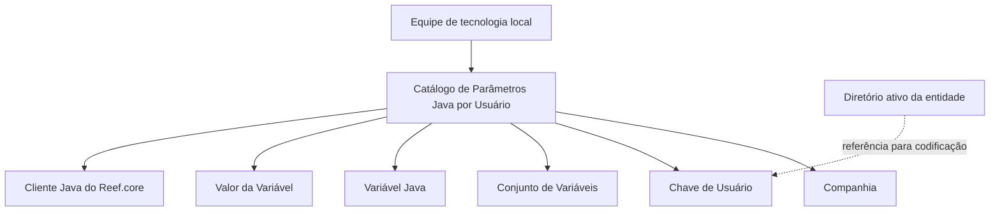

# Catálogo de Parâmetros Java por Usuário da Entidade no Reef.core

## 1. Metadados do Documento
- **Arquivo de Origem:** Não identificado no conteúdo fornecido
- **Tipo de Documento:** Especificação Técnica / Procedimento de Configuração
- **Domínio / Sistema:** Reef.core; catálogo de parâmetros Java por usuário
- **Público-Alvo:** Equipe de tecnologia local, administradores de usuários e operadores do Reef.core
- **Data/Versão Identificada:** 2024

---

## 2. Resumo Executivo & Contexto de Negócio

O documento descreve a definição de parâmetros Java por usuário no sistema Reef.core. O objetivo é configurar, para cada usuário criado nas companhias em que pode operar, as propriedades que devem ser consideradas pelo cliente Java do Reef.core.

A configuração é mantida em um catálogo composto por atributos de identificação da companhia, do usuário, da taxonomia de variáveis, da variável Java e de seu valor concreto. O catálogo permite associar parâmetros específicos a um usuário e a uma companhia.

Os exemplos apresentados incluem caminho e imagem JPEG de fundo da aplicação, companhia padrão de conexão, exercício contábil, caminho do compilador no equipamento do usuário e domínio do remetente para correios eletrônicos sem réplica.

O documento atribui a execução dessas tarefas exclusivamente à equipe de tecnologia local. Como boa prática, recomenda-se codificar os usuários no catálogo da mesma forma como são identificados no diretório ativo da entidade.

---

## 3. Arquitetura, Componentes & Tecnologias Envolvidas

Os elementos identificados são:

- **Reef.core:** Sistema no qual são configuradas propriedades para o cliente Java.
- **Cliente Java do Reef.core:** Consumidor dos parâmetros definidos por usuário.
- **Catálogo de Parâmetros Java por Usuário:** Estrutura de configuração composta por companhia, usuário, conjunto de variáveis, variável e valor.
- **Equipe de tecnologia local:** Responsável exclusiva pelas tarefas de configuração.
- **Diretório ativo da entidade:** Referência para a codificação recomendada dos usuários.
- **Servidor de Aplicações:** Citado como tema de documento relacionado, denominado “Configuración de Usuarios en el Servidor de Aplicaciones”.



> **Nota de Análise:** O documento não detalha mecanismos técnicos de persistência, interfaces de administração, métodos HTTP, contratos JSON, banco de dados, autenticação ou forma de leitura dos parâmetros pelo cliente Java.

---

## 4. Regras de Negócio, Especificações Funcionais & Processos

1. No Reef.core, devem ser configuradas as propriedades que o cliente Java deve contemplar para cada usuário criado.
2. A configuração deve considerar as companhias nas quais cada usuário pode operar.
3. As tarefas de definição dos parâmetros são de responsabilidade exclusiva da equipe de tecnologia local.
4. O atributo **Companhia** deve conter o código da companhia sobre a qual está sendo definida a configuração dos parâmetros.
5. O atributo **Chave de Usuário** deve conter o código do usuário da entidade.
6. O atributo **Conjunto de Variáveis** deve definir a taxonomia ou família da variável, permitindo relacionar variáveis com características ou propriedades comuns.
7. O atributo **Variável** deve definir o parâmetro Java do usuário.
8. A propriedade **Valor da Variável** deve armazenar o valor concreto do parâmetro Java.
9. Recomenda-se que os usuários sejam codificados no catálogo da mesma forma em que são identificados no diretório ativo da entidade.
10. A interpretação isolada do documento pode conduzir a erro; o texto recomenda a leitura de documentos funcionais e diretrizes relacionadas.

---

## 5. Tabelas de Parâmetros, Ambientes e Estruturas de Dados

| Item / Parâmetro | Descrição / Função | Tipo / Valores / Formato | Ambiente / Observações |
| :--- | :--- | :--- | :--- |
| Companhia | Código da companhia sobre a qual é realizada a definição dos parâmetros. | Código de companhia; formato não detalhado. | Associado à companhia em que o usuário pode operar. |
| Chave de Usuário | Código do usuário da entidade. | Código de usuário; formato não detalhado. | Recomenda-se usar a mesma identificação do diretório ativo da entidade. |
| Conjunto de Variáveis | Taxonomia ou família da variável definida para relacionar variáveis com características ou propriedades comuns. | Taxonomia ou família; valores não detalhados. | Usado para agrupamento conceitual de variáveis. |
| Variável | Parâmetro Java definido para o usuário. | Nome de parâmetro Java; formato não detalhado. | Pode representar imagem de fundo, companhia padrão, exercício, compilador ou domínio do remetente. |
| Valor da Variável | Valor concreto atribuído ao parâmetro Java. | Texto, caminho ou valor de configuração, conforme a variável. | Exemplos incluem caminho de imagem, ano, caminho do compilador e domínio. |
| Imagem de fundo | Caminho e imagem JPEG utilizados como fundo na aplicação. | `"mapfre/trn/images/molecule.jpg"` | Exemplo fornecido pelo documento. |
| Companhia padrão | Companhia com a qual o usuário se conecta na aplicação. | Não detalhado. | O documento cita o conceito, mas não fornece exemplo de valor. |
| Exercício contábil | Exercício contábil associado ao usuário. | `2024` | Exemplo fornecido no conteúdo extraído. |
| Caminho do compilador | Rota do compilador no equipamento do usuário. | `C:\wtw\jdk1.3\bin\` | Exemplo fornecido no conteúdo extraído. |
| Domínio do remetente | Domínio usado quando o usuário envia correio eletrônico sem réplica. | `"mapfre.com"` | Exemplo fornecido no conteúdo extraído. |
| Responsável pela configuração | Equipe que executa as tarefas de definição. | Equipe de tecnologia local. | Responsabilidade exclusiva indicada pelo documento. |

---

## 6. Bateria de Perguntas & Respostas para RAG (FAQ Sintético)

### P1: Qual é o objetivo do catálogo de parâmetros Java por usuário no Reef.core?
**R:** O catálogo permite configurar as propriedades que o cliente Java do Reef.core deve considerar para cada usuário criado nas companhias em que esse usuário pode operar.

### P2: Quem é responsável pela definição dos parâmetros Java por usuário?
**R:** As tarefas de definição dos parâmetros Java por usuário são de responsabilidade exclusiva da equipe de tecnologia local.

### P3: O que representa o atributo Companhia no catálogo?
**R:** O atributo Companhia contém o código da companhia sobre a qual está sendo realizada a definição dos parâmetros Java por usuário.

### P4: Para que serve a Chave de Usuário no catálogo?
**R:** A Chave de Usuário contém o código do usuário da entidade ao qual os parâmetros Java são associados.

### P5: Como os usuários devem ser codificados no catálogo de parâmetros Java?
**R:** Como boa prática, o documento recomenda codificar os usuários da mesma forma como são identificados no diretório ativo da entidade.

### P6: Qual é a finalidade do Conjunto de Variáveis?
**R:** O Conjunto de Variáveis estabelece a taxonomia ou família da variável definida, permitindo relacionar variáveis conforme características ou propriedades comuns.

### P7: Quais tipos de parâmetros Java por usuário são exemplificados?
**R:** O documento exemplifica caminho e imagem JPEG de fundo da aplicação, companhia padrão de conexão, exercício contábil, caminho do compilador no equipamento do usuário e domínio do remetente para envio de correio eletrônico sem réplica.

### P8: Qual é o exemplo fornecido para o caminho da imagem de fundo?
**R:** O valor exemplificado para a imagem de fundo é `"mapfre/trn/images/molecule.jpg"`.

### P9: Qual é o exemplo fornecido para o exercício contábil do usuário?
**R:** O documento apresenta `2024` como exemplo de valor para o exercício contábil do usuário.

### P10: Qual caminho de compilador é apresentado como exemplo?
**R:** O caminho do compilador apresentado é `C:\wtw\jdk1.3\bin\`.

### P11: Qual domínio de remetente é mostrado no documento?
**R:** O domínio mostrado como exemplo para o remetente de correio eletrônico sem réplica é `"mapfre.com"`.

### P12: Quais documentos relacionados devem ser considerados ao interpretar esta configuração?
**R:** O documento referencia “Usuarios de la Entidad” e “Configuración de Usuarios en el Servidor de Aplicaciones” como leituras recomendadas para evitar interpretações isoladas incorretas.

---

## 7. Glossário de Termos, Siglas & Conceitos-Chave

- **Reef.core:** Sistema citado como contexto da configuração de propriedades para o cliente Java.
- **Cliente Java:** Cliente do Reef.core que deve contemplar as propriedades configuradas no catálogo.
- **Catálogo de Parâmetros Java por Usuário:** Estrutura usada para definir parâmetros Java associados a usuários e companhias.
- **Companhia:** Entidade identificada por código sobre a qual é realizada a definição de parâmetros.
- **Chave de Usuário:** Código que identifica o usuário da entidade no catálogo.
- **Conjunto de Variáveis:** Taxonomia ou família usada para agrupar variáveis por características ou propriedades comuns.
- **Variável:** Parâmetro Java associado ao usuário.
- **Valor da Variável:** Valor concreto armazenado para uma variável Java.
- **Diretório ativo:** Referência de identificação de usuários que deve ser seguida como boa prática de codificação.
- **Exercício contábil:** Período contábil associado ao usuário; o documento apresenta `2024` como exemplo.
- **Correio eletrônico sem réplica:** Envio de e-mail para o qual é configurado um domínio de remetente.

---

## 8. Notas Críticas, Riscos & Limitações

- O conteúdo não identifica o nome do arquivo de origem.
- O documento não especifica versão de Reef.core, versão do cliente Java, sistema operacional, banco de dados ou mecanismo de persistência dos parâmetros.
- Não são descritos os valores permitidos, obrigatoriedade, validações, regras de precedência ou comportamento para parâmetros ausentes.
- Não há detalhamento sobre como o cliente Java consome, atualiza ou aplica os valores definidos no catálogo.
- Não são fornecidos contratos técnicos, métodos HTTP, interfaces administrativas ou integrações com o diretório ativo.
- A leitura isolada do documento pode conduzir a erro; o próprio texto recomenda consultar documentos funcionais e diretrizes relacionados.
- O texto extraído contém caracteres potencialmente corrompidos, como `congurar`, `denición` e `Conguración`. Esses trechos foram preservados na referência bruta.

---

## 9. Conteúdo Bruto Estruturado (Referência Fiel)

```text
--- [PÁGINA 1 DE 2] ---

DEFINICIÓN de Parámetros Java por Usuario
Contexto
En Reef.core se tienen que congurar las propiedades que debe contemplar el cliente Java de Reef.core por cada Usuario creado en las
compañías en las que estos puedan operar.
Datos Identicativos
Estas tareas son responsabilidad exclusiva del equipo de tecnología local.
Datos Identicativos
Compañía
Este Atributo del catálogo contiene el código de la compañía sobre la cual se está realizando la denición de los Parámetros.
Clave de Usuario
Este Atributo del catálogo contiene el código del Usuario de la entidad.
Conjunto de Variables
Este Atributo del catálogo establece la Taxonomía o Familia de la Variable Denida a efectos de relacionarlas de acuerdo a sus
características o propiedades comunes.
Variable
Este Atributo del catálogo establece el parámetro Java del Usuario como por ejemplo:
La ruta e imagen jpeg utilizada de fondo en la aplicación.
La Compañía por Defecto del Usuario con la que se conecta en la aplicación.
El Ejercicio contable del Usuario.
La Ruta del Compilador en el equipo del Usuario.
El Dominio del Remitente cuando el Usuario envía un Correo electrónico sin réplica,
...
Valor de la Variable
Esta Propiedad contiene el valor concreto del parámetro Java. Siguiendo con las variables de ejemplo anteriores:
"mapfre/trn/images/molecule.jpg"
Documentation / DOCUMENTACIÓN Reef
DOCUMENTACIÓN Reef
Mapfredocument
DOCUMENTACIÓN Reef
Owner
user:agonzalez_mapfre.com
Lifecycle
Approved Source
 / 
 VL
Buscar Inicio Soluciones Arquitecturas APIs Componentes Cloud Documentación Zeus Reef Ayuda
ES


--- [PÁGINA 2 DE 2] ---

1
2024
C:\wtw\jdk1.3\bin\
"mapfre.com"
...
Vínculos
Relación de Directrices y Documentos funcionales cuya lectura recomendada para evitar que la interpretación aislada del presente
documento pueda conducir a error.
Usuarios de la Entidad
Conguración de Usuarios en el Servidor de Aplicaciones
Preguntas frecuentes
(1) ¿Existe alguna recomendación que pueda ser tomada en consideración en el uso y denición del Catálogo de Parámetros Java por
Usuario de la Entidad?
Es una buena práctica codicar a los usuarios en este catálogo de la misma manera con la que se identica a los usuarios en el directorio
activo de la Entidad.
```
