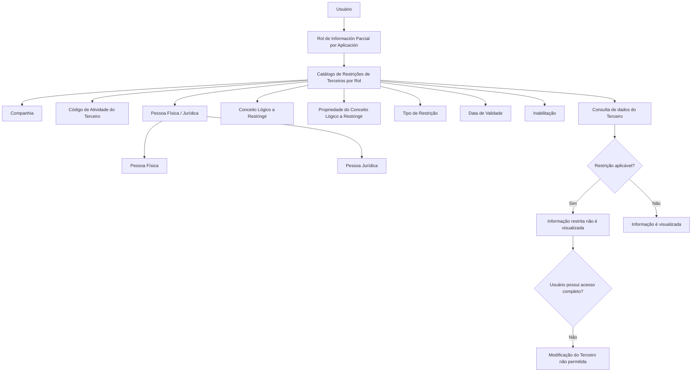

# Restrições de Terceiros por Rol no Reef.core — Configuração de Acesso Parcial por Atividade, Tipo de Pessoa e Conceito Lógico

## 1. Metadados do Documento
- **Arquivo de Origem:** Não informado
- **Tipo de Documento:** Especificação Funcional
- **Domínio / Sistema:** Reef.core — Catálogo de Restrições de Terceiros por Rol
- **Público-Alvo:** Desenvolvedores, Arquitetos, Analistas Funcionais e Operação
- **Data/Versão Identificada:** Não identificada

---

## 2. Resumo Executivo & Contexto de Negócio

O documento descreve o catálogo de **Restrições de Terceiros por Rol** do sistema Reef.core. Esse catálogo permite modular o comportamento da aplicação quando usuários recebem papéis associados a conceitos lógicos e restrições de acesso a informações de terceiros.

As restrições podem ser configuradas considerando a atividade do terceiro afetado, o tipo de pessoa — física ou jurídica — e a forma de restrição aplicada. A configuração é associada a um **Rol de Información Parcial por Aplicación**, a um conceito lógico e, opcionalmente, a uma propriedade específica do conceito lógico.

O comportamento exemplificado pelo documento determina que um usuário pode possuir um papel que afeta o conceito lógico de contatos de um terceiro, porém uma restrição pode impedir a visualização dos contatos apenas para pessoas físicas. Nesse caso, os contatos não são exibidos em uma consulta de pessoa física, mas continuam visíveis em uma consulta de pessoa jurídica.

O documento também estabelece uma regra de consistência operacional: caso um usuário não tenha acesso completo a todos os dados de um terceiro, esse usuário também não poderá modificá-los. A justificativa apresentada é que seria incoerente permitir alteração de informações que o usuário não consegue consultar integralmente.

---

## 3. Arquitetura, Componentes & Tecnologias Envolvidas

### Componentes e conceitos identificados

| Componente / Conceito | Descrição baseada no documento |
| :--- | :--- |
| **Reef.core** | Sistema no qual é configurada e aplicada a rotina de Terceiros e suas restrições por rol. |
| **Catálogo de Restrições de Terceiros por Rol** | Catálogo utilizado para definir restrições de informação associadas a papéis, atividades de terceiros, tipos de pessoa, conceitos lógicos e propriedades. |
| **Usuário** | Entidade à qual são atribuídos papéis e cujas permissões de consulta e modificação são moduladas pelas restrições. |
| **Rol de Información Parcial por Aplicación** | Papel sobre o qual é configurada a restrição de informação. |
| **Terceiro** | Entidade cujos dados podem sofrer restrições de acesso. O documento diferencia pessoas físicas e pessoas jurídicas. |
| **Código de Atividade do Terceiro** | Propriedade que identifica a atividade do terceiro no sistema. |
| **Conceito Lógico** | Conceito associado ao papel de informação parcial e sobre o qual é configurada uma restrição. |
| **Propriedade do Conceito Lógico** | Propriedade específica de um conceito lógico que pode ser restringida. |
| **Tipo de Restrição** | Classificação da restrição de acordo com os valores do catálogo do núcleo. |
| **Catálogo do núcleo** | Fonte de valores usada para classificar o tipo de restrição. O documento não detalha os valores disponíveis. |



> **Nota de Análise:** O documento não apresenta métodos HTTP, contratos JSON, banco de dados, protocolos de integração, URLs, ambientes técnicos, versões de tecnologia ou detalhes de implementação do Reef.core.

---

## 4. Regras de Negócio, Especificações Funcionais & Processos

### 4.1 Finalidade das restrições

1. O Reef.core permite aprofundar a forma como as restrições aplicadas à atribuição de papéis e conceitos lógicos aos usuários modulam o comportamento da aplicação.
2. A configuração de restrições considera as atividades dos terceiros afetados.
3. A configuração permite distinguir se uma atividade afeta pessoas físicas, pessoas jurídicas ou ambos os tipos.
4. A configuração determina a forma como a operação será restringida.
5. Uma restrição pode ser associada a um papel de informação parcial por aplicação.
6. Uma restrição pode ser direcionada a um conceito lógico específico.
7. Uma restrição pode ser direcionada a uma propriedade específica de um conceito lógico.

### 4.2 Regra de visibilidade por tipo de pessoa

O documento apresenta o seguinte comportamento funcional:

1. Um usuário possui um papel que afeta o conceito lógico de contatos de um terceiro.
2. A restrição configurada afeta somente consultas de informações de pessoas físicas.
3. Quando o usuário consulta dados de uma pessoa física, a aplicação não visualiza os contatos.
4. Quando o usuário consulta dados de uma pessoa jurídica, os contatos são exibidos.

### 4.3 Regra para ambos os tipos de pessoa

- Quando uma restrição precisar ser aplicada a **pessoas físicas e pessoas jurídicas**, o atributo **Persona Física/Jurídica** deve receber o valor **`Z`**.

### 4.4 Regra para todas as propriedades de um conceito lógico

- Quando uma restrição precisar ser aplicada a **todas as propriedades** de um conceito lógico, o atributo **Propiedad del Concepto Lógico a restringir** deve receber o valor genérico **`ZZZZ...ZZZZ`**.

### 4.5 Regra de acesso para alteração de dados

A rotina de Terceiros do Reef.core estabelece que:

1. Se um usuário não puder acessar completamente todos os dados de um terceiro, o usuário não poderá modificar os dados desse terceiro.
2. A regra evita a inconsistência de permitir que um usuário altere informações que não consegue consultar.

### 4.6 Gestão de vigência e histórico

1. O atributo **Fecha de Validez** indica a data a partir da qual a definição de restrição fica plenamente operacional no sistema.
2. O uso correto da data de validade permite manter um histórico das alterações efetuadas nas definições de restrição.

### 4.7 Inabilitação de registros

- O atributo **Inhabilitación** determina se um registro está inabilitado para utilização.

---

## 5. Tabelas de Parâmetros, Ambientes e Estruturas de Dados

| Item / Parâmetro | Descrição / Função | Tipo / Valores / Formato | Ambiente / Observações |
| :--- | :--- | :--- | :--- |
| Companhia | Código da companhia na qual a restrição de informação está sendo configurada. | Código de companhia; formato não detalhado. | Aplicável à configuração da restrição. |
| Código de Atividade do Terceiro | Indica o código da atividade do terceiro no sistema. | Código de atividade; valores não detalhados. | Utilizado para identificar a atividade afetada pela restrição. |
| Rol afetado | Código que identifica o Rol de Información Parcial por Aplicación sobre o qual é configurada a restrição. | Código de rol; formato não detalhado. | Papel afetado pela regra de restrição. |
| Persona Física/Jurídica | Indica se a restrição aplica-se a pessoas físicas ou pessoas jurídicas. | Pessoas físicas, pessoas jurídicas ou `Z`. | O valor `Z` deve ser utilizado quando a restrição se aplicar a ambos os tipos de pessoa. |
| Conceito Lógico a restringir | Associa ao rol de informação parcial por aplicação o código do conceito lógico cuja informação será restringida. | Código de conceito lógico; formato não detalhado. | Define o conceito lógico alvo da restrição. |
| Propriedade do Conceito Lógico a restringir | Associa ao rol uma propriedade concreta do conceito lógico que se deseja restringir. | Propriedade específica ou valor genérico `ZZZZ...ZZZZ`. | O valor `ZZZZ...ZZZZ` aplica a restrição a todas as propriedades do conceito lógico. |
| Tipo de Restrição | Identifica a classificação da restrição. | Valores do catálogo do núcleo; valores não detalhados. | O documento não lista as classificações disponíveis. |
| Inabilitação | Define se o registro está inabilitado para uso. | Estado de inabilitação; valores não detalhados. | Afeta a possibilidade de utilização do registro. |
| Data de Validade | Indica a data a partir da qual a definição de restrição está plenamente operativa. | Data; formato não detalhado. | Permite manter histórico de mudanças nas definições. |
| Contatos de um Terceiro | Exemplo de conceito lógico afetado por uma restrição. | Dados de contato; estrutura não detalhada. | Não são exibidos para pessoa física quando a restrição configurada afeta consultas desse tipo. |

### Documentos e vínculos relacionados

| Documento / Vínculo | Finalidade indicada |
| :--- | :--- |
| Roles de Información Parcial | Documento relacionado recomendado para leitura. |
| Roles de Información Parcial por Aplicación | Documento relacionado recomendado para leitura. |
| Roles de Información Parcial por Concepto Lógico | Documento relacionado recomendado para leitura. |

> **Nota de Análise:** O documento não informa servidores, URLs, ambientes de desenvolvimento/homologação/produção, rotas de log, portas, credenciais ou variáveis de configuração.

---

## 6. Bateria de Perguntas & Respostas para RAG (FAQ Sintético)

### P1: Qual é a finalidade do catálogo de Restrições de Terceiros por Rol no Reef.core?
**R:** O catálogo de Restrições de Terceiros por Rol permite configurar como as restrições associadas a papéis e conceitos lógicos modulam o comportamento da aplicação Reef.core. A configuração considera a atividade do terceiro, o tipo de pessoa — física ou jurídica —, o conceito lógico, uma propriedade específica e o tipo de restrição.

### P2: O que ocorre quando uma restrição de contatos é configurada apenas para pessoas físicas?
**R:** Quando um usuário possui um papel que afeta o conceito lógico de contatos de um terceiro e a restrição atinge apenas consultas de pessoas físicas, a aplicação não exibe os contatos durante a consulta de uma pessoa física. Os contatos continuam sendo exibidos quando a consulta é realizada para uma pessoa jurídica.

### P3: Qual valor deve ser utilizado para restringir simultaneamente pessoas físicas e jurídicas?
**R:** O atributo **Persona Física/Jurídica** deve receber o valor **`Z`** quando a restrição deve ser aplicada tanto a pessoas físicas quanto a pessoas jurídicas.

### P4: Como restringir todas as propriedades de um conceito lógico no Reef.core?
**R:** Para aplicar uma restrição a todas as propriedades de um conceito lógico, o atributo **Propiedad del Concepto Lógico a restringir** deve receber o valor genérico **`ZZZZ...ZZZZ`**.

### P5: Qual é a função do atributo Rol afetado?
**R:** O atributo **Rol afetado** contém o código que identifica o **Rol de Información Parcial por Aplicación** sobre o qual a restrição de informação está sendo configurada.

### P6: O que representa o Código de Atividade do Terceiro?
**R:** O **Código de Atividade do Terceiro** indica no sistema o código da atividade associada ao terceiro. O documento informa que as atividades dos terceiros afetados são consideradas na configuração das restrições.

### P7: Um usuário com acesso parcial aos dados de um terceiro pode modificar esse terceiro?
**R:** Não. A rotina de Terceiros do Reef.core estabelece que, se um usuário não puder acessar completamente todos os dados de um terceiro, o usuário também não poderá modificar esse terceiro. A regra evita que um usuário altere informações que não consegue consultar integralmente.

### P8: Para que serve a Data de Validade de uma restrição?
**R:** A **Data de Validade** informa a data a partir da qual a definição da restrição torna-se plenamente operacional no sistema. O atributo também permite manter um histórico das mudanças efetuadas nas definições de restrição.

### P9: Qual é a finalidade do atributo Inabilitação?
**R:** O atributo **Inabilitação** indica se o registro está inabilitado para poder ser utilizado.

### P10: Onde são definidos os valores do Tipo de Restrição?
**R:** O **Tipo de Restrição** é classificado de acordo com os valores do catálogo do núcleo. O documento não detalha quais são os valores ou classificações disponíveis nesse catálogo.

---

## 7. Glossário de Termos, Siglas & Conceitos-Chave

- **Reef.core:** Sistema citado como responsável pela rotina de Terceiros e pela aplicação das restrições descritas.
- **Terceiro:** Entidade cujos dados podem sofrer restrições de acesso; o documento diferencia terceiros pessoa física e pessoa jurídica.
- **Rol de Información Parcial por Aplicación:** Papel de informação parcial por aplicação sobre o qual uma restrição pode ser configurada.
- **Conceito Lógico:** Conceito associado ao papel e alvo potencial de uma restrição de informação.
- **Propriedade do Conceito Lógico:** Propriedade concreta pertencente a um conceito lógico que pode ser restringida.
- **Tipo de Restrição:** Classificação da restrição conforme valores existentes no catálogo do núcleo.
- **Catálogo do núcleo:** Catálogo referido como origem dos valores usados na classificação do tipo de restrição.
- **Inabilitação:** Propriedade que define se um registro está impedido de ser utilizado.
- **Data de Validade:** Data a partir da qual uma definição de restrição fica plenamente operacional.
- **`Z`:** Valor a ser utilizado no atributo Persona Física/Jurídica para aplicar uma restrição a pessoas físicas e jurídicas.
- **`ZZZZ...ZZZZ`:** Valor genérico a ser utilizado para restringir todas as propriedades de um conceito lógico.

---

## 8. Notas Críticas, Riscos & Limitações

- O documento recomenda a leitura de **Roles de Información Parcial**, **Roles de Información Parcial por Aplicación** e **Roles de Información Parcial por Concepto Lógico**, pois a interpretação isolada deste documento pode conduzir a erro.
- O documento não detalha os valores permitidos para o atributo **Tipo de Restrição**, apenas informa que a classificação depende do catálogo do núcleo.
- O documento não especifica os formatos dos códigos de companhia, atividade, rol ou conceito lógico.
- O documento não detalha as operações exatas afetadas por cada tipo de restrição além do exemplo de visualização de contatos.
- O documento não apresenta APIs, contratos de integração, métodos HTTP, eventos, estruturas de persistência, ambientes, URLs ou rotas de logs.
- A regra de bloqueio de modificação para usuários com acesso parcial a dados de terceiros representa uma restrição operacional relevante: configurações de acesso incompletas podem impedir manutenção de dados por determinados usuários.

---

## 9. Conteúdo Bruto Estruturado (Referência Fiel)

```text
--- [PÁGINA 1 DE 2] ---

ASIGNACIÓN de Restricciones de Terceros por Rol
Contexto
Reef.core permite profundizar la manera en la que las restricciones, en la asignación de los Roles y Conceptos Lógicos a los Usuarios, van a
modular el comportamiento de la aplicación ya que se contemplan por una parte las actividades de los Terceros afectadas, si para una
actividad en concreto están afectadas tanto las personas físicas como las personas jurídicas y la forma en que se restringe la operación.
Por ejemplo, si un usuario tuviera asignado un Rol que afectara al Concepto lógico de los Contactos de un Tercero y la restricción solamente
afectara las consultas de información de las personas físicas, cuando ese Usuario realizara una consulta a los datos de una persona física La
Aplicación no visualizaría sus Contactos mostrándolos en cambio si la consulta se realizara para una persona Jurídica.
Propiedades Operativas
Otras Propiedades
Propiedades Operativas
Compañía
Este Atributo del catálogo contiene el código de la compañía en la que se está congurando la restricción de la información.
Código de Actividad del Tercero
Esta propiedad indica en el sistema el código de la Actividad del Tercero.
Rol afectado
Este Atributo del catálogo contiene el código que identica el Rol de Información Parcial por Aplicación sobre el que se congura la
restricción.
Persona Física/Jurídica
Esta propiedad del catálogo indica si la restricción aplica a las personas físicas o a las personas jurídicas.
NOTA: Si la restricción se quiere realizar a ambos tipos de Personas el valor de este atributo debe ser 'Z'.
Concepto Lógico a restringir
Este Atributo del catálogo asocia al Rol de Información Parcial por Aplicación el código del concepto lógico sobre el que se está
estableciendo alguna restricción en su información.
Propiedad del Concepto Lógico a restringir
Documentation / DOCUMENTACIÓN Reef
DOCUMENTACIÓN Reef
Mapfredocument
DOCUMENTACIÓN Reef
Owner
user:agonzalez_mapfre.com
Lifecycle
Approved Source
 / 
 VL
Buscar Inicio Soluciones Arquitecturas APIs Componentes Cloud Documentación Zeus Reef Ayuda
ES


--- [PÁGINA 2 DE 2] ---

Este Atributo del catálogo asocia al Rol de Información Parcial por Aplicación una Propiedad concreta del Concepto Lógico que se desea
Restringir.
NOTA: Si la restricción se quiere realizar sobre todas las propiedades del Concepto Lógico el valor de este atributo debe ser el valor
genérico'ZZZZ...ZZZZ'.
Tipo de Restricción
Esta propiedad identica la Clasicación de la restricción de acuerdo con los valores del catálogo del núcleo.
Otras Propiedades
Inhabilitación
Esta propiedad establece si el registro está inhabilitado para poder ser utilizado.
Fecha de Validez
Esta propiedad le indica al Sistema la fecha a partir de la cual la denición de la restricción está plenamente operativa en el sistema por lo
que su correcto uso permite tener un histórico de los cambios efectuados en sus deniciones.
Vínculos
Relación de Directrices y Documentos funcionales cuya lectura recomendada para evitar que la interpretación aislada del presente
documento pueda conducir a error.
Roles de Información Parcial
Roles de Información Parcial por Aplicación
Roles de Información Parcial por Concepto Lógico
Preguntas frecuentes
(1) ¿Existe alguna recomendación que pueda ser tomada en consideración respecto del uso y denición del Catálogo de Restricciones de los
Terceros por Rol?
Es importante considerar que en la rutina de Terceros de Reef.core se estableció que si un Usuario no pudiera acceder completamente a
todos los datos del Tercero tampoco estaría en disposición de poder modicarlos; sería incongruente que no pudiera consultar lo que él
mismo está modicando.
```
