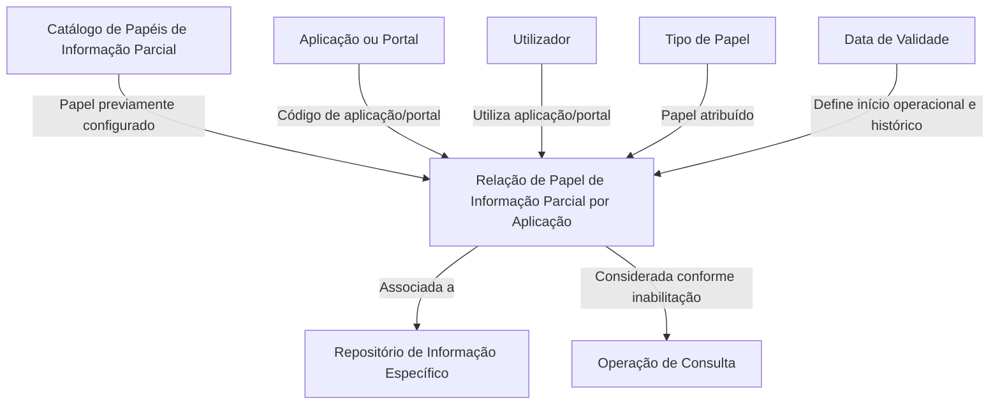

# Definição dos Papéis de Informação Parcial por Aplicação no Reef.core

## 1. Metadados do Documento
- **Arquivo de Origem:** Não identificado no conteúdo fornecido
- **Tipo de Documento:** Especificação Funcional
- **Domínio / Sistema:** Reef.core — Roles de Información Parcial
- **Público-Alvo:** Analistas funcionais, administradores de repositórios de informação e utilizadores de aplicações/portais
- **Data/Versão Identificada:** Não identificada

---

## 2. Resumo Executivo & Contexto de Negócio

O documento define a funcionalidade de **Papéis de Informação Parcial por Aplicação** no sistema **Reef.core**. Esta funcionalidade permite codificar a relação entre papéis de informação parcial que podem ser atribuídos a utilizadores num repositório de informação específico.

A configuração é orientada por aplicação ou portal e por utilizador. Para cada relação, o sistema considera a aplicação configurada, o utilizador que utiliza essa aplicação ou portal, o tipo de papel atribuído e o código do papel existente no catálogo.

A especificação também descreve propriedades operacionais para controlar a disponibilidade e a vigência da configuração. A propriedade de inabilitação determina se um código de papel fica indisponível para ser considerado na execução de operações de consulta. A data de validade determina a partir de quando um papel por aplicação se torna plenamente operacional, permitindo manter histórico das alterações nas definições.

O documento estabelece uma restrição explícita: quando um utilizador possuir um papel de informação parcial por aplicação, esse papel deve estar previamente configurado no catálogo de Papéis de Informação Parcial. A leitura isolada desta especificação pode conduzir a interpretações incorretas; por isso, o documento recomenda a consulta de diretrizes e documentos funcionais relacionados.

---

## 3. Arquitetura, Componentes & Tecnologias Envolvidas

Os elementos identificados no conteúdo são:

- **Reef.core:** sistema que possui a capacidade de codificar relações de papéis de informação parcial.
- **Catálogo de Papéis de Informação Parcial:** catálogo que contém os códigos de papel e que deve ser previamente configurado antes da atribuição de um papel por aplicação.
- **Aplicação ou Portal:** contexto de configuração do papel de informação parcial; o valor deve corresponder a um código existente no catálogo do sistema.
- **Utilizador:** pessoa associada à aplicação ou portal e destinatária do tipo de papel.
- **Repositório de Informação Específico:** contexto no qual os papéis de informação parcial podem ser atribuídos.
- **Operação de Consulta:** operação cuja execução considera ou ignora o código do papel conforme a propriedade de inabilitação.



**Nota de Análise:** O conteúdo não descreve interfaces técnicas, métodos HTTP, contratos JSON, bases de dados, mecanismos de autenticação, URLs, servidores ou tecnologias de implementação do Reef.core.

---

## 4. Regras de Negócio, Especificações Funcionais & Processos

### 4.1. Finalidade funcional

1. O Reef.core possui a faculdade de codificar a relação de papéis de informação parcial.
2. Os papéis de informação parcial podem ser atribuídos a utilizadores.
3. A atribuição ocorre no contexto de um repositório de informação específico.
4. A relação é configurada por aplicação ou portal.

### 4.2. Configuração da relação de papel por aplicação

A configuração de um papel de informação parcial por aplicação envolve os seguintes elementos:

1. Identificar a aplicação ou portal a que a configuração se aplica.
2. Utilizar um código de aplicação ou portal de acordo com os valores existentes no catálogo do sistema.
3. Identificar o utilizador que utiliza a aplicação ou portal.
4. Indicar o tipo de papel atribuído ao utilizador.
5. Informar o código que identifica o papel no catálogo.
6. Determinar se o código de papel está inabilitado para operações de consulta.
7. Definir a data a partir da qual o papel por aplicação está plenamente operativo.

### 4.3. Regra de pré-configuração obrigatória

A restrição descrita na pergunta frequente do documento é:

- Se um utilizador tiver atribuído um papel de informação parcial por aplicação, esse papel deve estar previamente configurado no **Catálogo de Papéis de Informação Parcial**.

Esta regra cria uma dependência funcional entre a atribuição de um papel por aplicação e a configuração prévia do mesmo código de papel no catálogo.

### 4.4. Regra de inabilitação

- A propriedade **Inabilitação** estabelece se o código do papel está inabilitado.
- Quando o código do papel estiver inabilitado, não pode ser considerado na execução da operação de consulta.

### 4.5. Regra de validade e histórico

- A propriedade **Data de Validade** indica ao sistema a data a partir da qual o papel por aplicação está plenamente operativo.
- A utilização correta da data de validade permite manter histórico das alterações efetuadas nas definições.

### 4.6. Documentação relacionada recomendada

O documento recomenda a leitura dos seguintes materiais para evitar interpretações isoladas e incorretas:

- Roles de Información Parcial
- Roles de Información Parcial por Concepto Lógico
- Preguntas frecuentes

---

## 5. Tabelas de Parâmetros, Ambientes e Estruturas de Dados

| Item / Parâmetro | Descrição / Função | Tipo / Valores / Formato | Ambiente / Observações |
| :--- | :--- | :--- | :--- |
| Aplicação | Contém o código da aplicação ou portal para o qual a funcionalidade do papel de informação parcial está a ser configurada. | Código existente no catálogo do sistema. | Aplicação ou portal. |
| Utilizador | Contém o utilizador que utiliza a aplicação ou portal. | Utilizador. | Associado à aplicação ou portal. |
| Tipo de Papel | Contém o tipo de papel atribuído ao utilizador. | Tipo de papel. | Não são detalhados valores permitidos. |
| Papel | Atributo do catálogo que contém o código identificador do papel. | Código de papel. | Deve estar previamente configurado no Catálogo de Papéis de Informação Parcial antes de ser atribuído por aplicação. |
| Inabilitação | Determina se o código de papel está inabilitado para ser considerado numa operação de consulta. | Estado de inabilitação; valores não detalhados. | Afeta a execução de operações de consulta. |
| Data de Validade | Indica a data a partir da qual o papel por aplicação está plenamente operativo no sistema. | Data; formato não detalhado. | Permite manter histórico das alterações nas definições. |
| Repositório de Informação Específico | Contexto de informação em que os papéis de informação parcial podem ser atribuídos aos utilizadores. | Repositório de informação. | Não são detalhados identificadores, estrutura ou localização. |
| Reef.core | Sistema que codifica a relação entre papéis de informação parcial e utilizadores. | Sistema. | O documento não detalha arquitetura técnica ou versão. |
| Documentação Reef | Vínculo documental apresentado no conteúdo. | Documentação. | Também são exibidos os termos “Mapfredocument” e “Approved Source”. |
| Owner | Proprietário indicado para o conteúdo documental. | `user:agonzalez_mapfre.com` | Informação literal apresentada no documento. |
| Lifecycle | Estado de ciclo de vida exibido no conteúdo. | `Approved Source` | Não há definição adicional do estado. |

---

## 6. Bateria de Perguntas & Respostas para RAG (FAQ Sintético)

### P1: Qual é a finalidade dos Papéis de Informação Parcial por Aplicação no Reef.core?
**R:** A funcionalidade permite ao Reef.core codificar a relação entre papéis de informação parcial e utilizadores, no contexto de um repositório de informação específico e de uma aplicação ou portal configurado.

### P2: Quais informações compõem uma configuração de papel de informação parcial por aplicação?
**R:** A configuração envolve a aplicação ou portal, o utilizador que utiliza a aplicação ou portal, o tipo de papel atribuído ao utilizador, o código identificador do papel, a propriedade de inabilitação e a data de validade.

### P3: O código da aplicação pode ser informado livremente na configuração?
**R:** Não. A propriedade Aplicação contém o código da aplicação ou portal sobre o qual a funcionalidade é configurada, de acordo com os valores existentes no catálogo do sistema.

### P4: O que representa a propriedade Utilizador?
**R:** A propriedade Utilizador contém o utilizador que utiliza a aplicação ou portal configurado na relação de papel de informação parcial por aplicação.

### P5: O que identifica o atributo Papel no catálogo?
**R:** O atributo Papel contém o código que identifica o papel no catálogo de Papéis de Informação Parcial.

### P6: Existe alguma condição obrigatória antes de atribuir um papel de informação parcial por aplicação a um utilizador?
**R:** Sim. Quando um utilizador tem atribuído um papel de informação parcial por aplicação, esse papel deve estar previamente configurado no Catálogo de Papéis de Informação Parcial.

### P7: Qual é o efeito da propriedade Inabilitação?
**R:** A propriedade Inabilitação estabelece se o código do papel está inabilitado para ser considerado durante a execução de uma operação de consulta.

### P8: O que acontece se um código de papel estiver inabilitado?
**R:** Se o código de papel estiver inabilitado, ele não pode ser considerado na execução da operação de consulta.

### P9: Para que serve a Data de Validade de um papel por aplicação?
**R:** A Data de Validade indica ao sistema a data a partir da qual o papel por aplicação está plenamente operativo. O uso correto desta propriedade permite manter histórico das alterações efetuadas nas definições.

### P10: O documento define o formato da Data de Validade?
**R:** Não. O conteúdo informa a finalidade da Data de Validade, mas não especifica formato, granularidade, fuso horário ou regras de validação da data.

### P11: Que documentos relacionados devem ser consultados para compreender corretamente a especificação?
**R:** O documento recomenda a leitura de “Roles de Información Parcial”, “Roles de Información Parcial por Concepto Lógico” e “Preguntas frecuentes”, pois a interpretação isolada do conteúdo atual pode conduzir a erro.

### P12: O documento informa APIs, métodos HTTP ou contratos de integração do Reef.core?
**R:** Não. O conteúdo apresenta propriedades funcionais e regras de configuração, mas não detalha APIs, métodos HTTP, contratos JSON, URLs, servidores ou mecanismos de integração.

---

## 7. Glossário de Termos, Siglas & Conceitos-Chave

- **Reef.core:** Sistema mencionado como responsável por codificar a relação entre papéis de informação parcial e utilizadores.
- **Papel de Informação Parcial:** Papel que pode ser atribuído a um utilizador num repositório de informação específico, configurado no contexto de uma aplicação ou portal.
- **Papel por Aplicação:** Relação configurada entre aplicação ou portal, utilizador, tipo de papel e código de papel.
- **Catálogo de Papéis de Informação Parcial:** Catálogo que contém o código identificador do papel e que deve ser previamente configurado antes de uma atribuição por aplicação.
- **Aplicação ou Portal:** Contexto ao qual a funcionalidade do papel de informação parcial é configurada.
- **Tipo de Papel:** Propriedade que contém o tipo de papel atribuído ao utilizador.
- **Inabilitação:** Propriedade que define se o código de papel está indisponível para consideração numa operação de consulta.
- **Data de Validade:** Data a partir da qual um papel por aplicação está plenamente operativo no sistema e que permite histórico de alterações.
- **Operação de Consulta:** Operação cuja execução considera ou desconsidera o código de papel conforme a propriedade de inabilitação.
- **Approved Source:** Estado de ciclo de vida exibido no conteúdo, sem definição adicional.
- **VL:** Termo exibido na área de lifecycle do conteúdo; o significado não é detalhado.

---

## 8. Notas Críticas, Riscos & Limitações

- O documento alerta que a interpretação isolada pode conduzir a erro e recomenda a leitura de documentação funcional relacionada.
- A atribuição de um papel de informação parcial por aplicação depende da configuração prévia do papel no Catálogo de Papéis de Informação Parcial.
- O conteúdo não informa os valores possíveis para Tipo de Papel, Inabilitação ou códigos de Aplicação/Portal.
- O conteúdo não define o formato, a granularidade ou as validações da Data de Validade.
- O documento não especifica comportamento para erros de configuração, atribuições duplicadas, conflitos de validade ou tentativas de associar papéis inexistentes.
- O documento não fornece detalhes técnicos sobre persistência, interfaces, APIs, contratos, ambientes, URLs, servidores, autenticação ou autorização.
- **Nota de Análise:** O conteúdo apresenta uma regra para que o papel esteja previamente configurado no catálogo, mas não descreve como o Reef.core valida essa pré-condição nem qual erro é apresentado quando a condição não é cumprida.
- **Nota de Análise:** O documento menciona um repositório de informação específico, porém não detalha como o repositório é identificado, configurado ou relacionado tecnicamente à aplicação, ao utilizador e ao papel.

---

## 9. Conteúdo Bruto Estruturado (Referência Fiel)

```text
--- [PÁGINA 1 DE 2] ---

DEFINICIÓN de los Roles de Información Parcial por Aplicación

Contexto

Funcionalmente, Reef.core cuenta con la facultad de codificar la relación de Roles de información parcial que se pueden asignar a los Usuarios en un repositorio de información específico.

Propiedades Operativas

Otras Propiedades

Propiedades Operativas

Aplicación

Esta Propiedad contiene el código de Aplicación o Portal sobre el que se está configurando la funcionalidad del Rol de información parcial, de acuerdo con los valores del catálogo existente en el Sistema.

Usuario

Esta Propiedad contiene el Usuario que utiliza la Aplicación o Portal.

Tipo de Rol

Esta Propiedad contiene el tipo de rol asignado al Usuario.

Rol

Este Atributo del catálogo contiene el código que identifica el Rol.

Otras Propiedades

Inhabilitación

Esta propiedad establece si el Código del Rol está inhabilitado para poder ser considerado en la ejecución de la operación de consulta.

Fecha de Validez

Esta propiedad le indica al Sistema la fecha a partir de la cual el Rol por Aplicación está plenamente operativo en el sistema por lo que su correcto uso permite tener un histórico de los cambios efectuados en sus definiciones.

Vínculos

Documentation / DOCUMENTACIÓN Reef

DOCUMENTACIÓN Reef

Mapfredocument

DOCUMENTACIÓN Reef

Owner

user:agonzalez_mapfre.com

Lifecycle

Approved Source / VL

Buscar Inicio Soluciones Arquitecturas APIs Componentes Cloud Documentación Zeus Reef Ayuda

ES


--- [PÁGINA 2 DE 2] ---

Relación de Directrices y Documentos funcionales cuya lectura recomendada para evitar que la interpretación aislada del presente documento pueda conducir a error.

Roles de Información Parcial

Roles de Información Parcial por Concepto Lógico

Preguntas frecuentes

(1) ¿Existe alguna restricción que tenga que ser tomada en cuenta en el uso y definición del Catálogo de Roles por Aplicación en Reef.core?

Se debe tener en cuenta que si un usuario tiene asignado un rol de información parcial por Aplicación, este Rol tiene que estar configurado previamente en el catálogo de Roles de Información Parcial.
```
