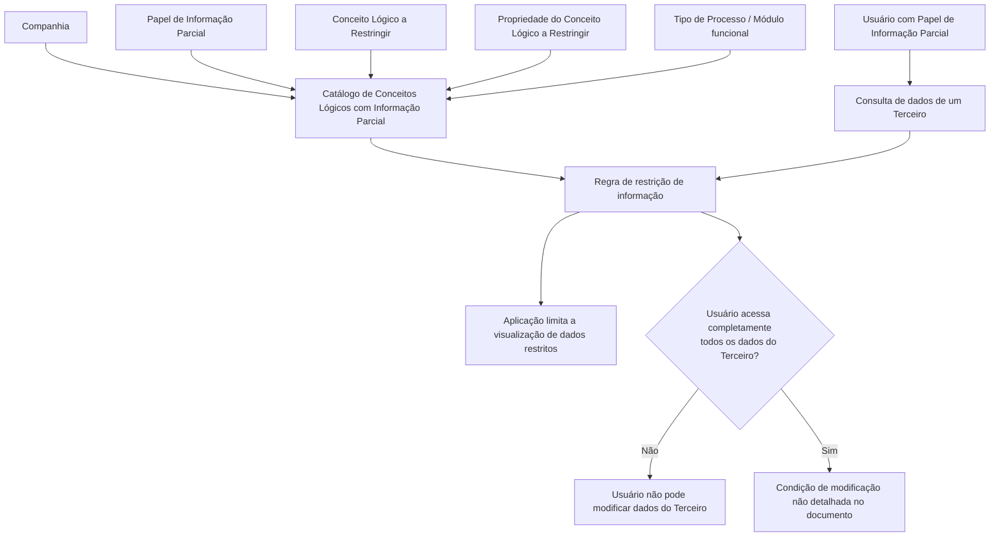

# Atribuição de Papéis de Informação Parcial a Conceitos Lógicos e/ou Propriedades no Reef.core

## 1. Metadados do Documento
- **Arquivo de Origem:** Não identificado no conteúdo fornecido
- **Tipo de Documento:** Especificação Técnica / Documentação Funcional
- **Domínio / Sistema:** Reef.core; catálogo de Conceitos Lógicos com Informação Parcial
- **Público-Alvo:** Analistas funcionais, desenvolvedores, arquitetos e administradores de acesso
- **Data/Versão Identificada:** Não identificada
- **Owner identificado no conteúdo:** `user:agonzalez_mapfre.com`
- **Lifecycle identificado no conteúdo:** Approved Source

---

## 2. Resumo Executivo & Contexto de Negócio

O documento descreve a funcionalidade do Reef.core para atribuir **Papéis de Informação Parcial** a **Conceitos Lógicos** e, opcionalmente, às propriedades específicas desses conceitos. A atribuição é realizada por meio de um catálogo de informação criado especificamente para controlar ou limitar o acesso à informação.

O mecanismo permite estabelecer restrições de visibilidade sobre informações de um Conceito Lógico. O exemplo apresentado relaciona um Papel de Informação Parcial ao Conceito Lógico de contatos de um terceiro: quando um usuário possui esse papel e consulta os dados de um terceiro, a aplicação não visualiza dados dos contatos desse terceiro.

A configuração da restrição considera, entre outros atributos, a companhia, o código do Papel de Informação Parcial, o Conceito Lógico a restringir, a propriedade específica a restringir e o Tipo de Processo. O Tipo de Processo identifica o módulo funcional no qual o papel, o conceito e as propriedades estão inscritos.

O documento também estabelece propriedades de operação e governança. A propriedade **Inhabilitación** define se o Conceito Lógico com Informação Parcial está desabilitado para uso. A **Fecha de Validez** estabelece a data a partir da qual o Conceito Lógico com Informação Parcial está plenamente operacional, permitindo manter histórico de alterações efetuadas em suas definições.

Há uma regra funcional explícita para a rotina de Terceiros do Reef.core: um usuário que não pode acessar completamente todos os dados de um terceiro também não pode modificá-los. O documento considera incoerente permitir a alteração de dados que o próprio usuário não pode consultar.

---

## 3. Arquitetura, Componentes & Tecnologias Envolvidas

### Componentes e elementos identificados

| Componente / Elemento | Papel no contexto documentado |
| :--- | :--- |
| Reef.core | Sistema no qual existe a funcionalidade de atribuir Papéis de Informação Parcial a Conceitos Lógicos e propriedades. |
| Catálogo de Conceitos Lógicos com Informação Parcial | Catálogo criado para controlar ou limitar o acesso a Conceitos Lógicos e/ou propriedades. |
| Papel de Informação Parcial | Papel associado a um Conceito Lógico e, opcionalmente, a uma propriedade específica para estabelecer restrições de informação. |
| Conceito Lógico | Entidade lógica cuja informação pode ser submetida a restrição de acesso. |
| Propriedade do Conceito Lógico | Propriedade específica de um Conceito Lógico que pode ser restringida. |
| Companhia | Contexto organizacional da atribuição do Papel de Informação Parcial ao Conceito Lógico ou à propriedade. |
| Tipo de Processo | Identifica o módulo funcional no qual se inscrevem o Papel de Informação Parcial, o Conceito Lógico e suas propriedades. |
| Rotina de Terceiros | Rotina do Reef.core para a qual existe uma regra de coerência entre acesso completo aos dados e possibilidade de modificação. |
| Aplicação | Camada que deixa de visualizar dados restritos durante a consulta efetuada por um usuário. |



> **Nota de Análise:** O documento não detalha tecnologias de implementação, métodos HTTP, contratos JSON, banco de dados, endpoints, ambientes técnicos, mecanismos de autenticação ou autorização subjacentes.

---

## 4. Regras de Negócio, Especificações Funcionais & Processos

### 4.1 Atribuição de Papéis de Informação Parcial

1. O Reef.core possui a possibilidade funcional de atribuir Papéis de Informação Parcial a Conceitos Lógicos.
2. A atribuição também pode ser realizada sobre propriedades de Conceitos Lógicos.
3. A finalidade da atribuição é controlar o acesso à informação ou limitar esse acesso por algum tipo de restrição.
4. As atribuições são mantidas em um catálogo de informação criado especificamente para esse efeito.
5. A atribuição é contextualizada pela companhia na qual está sendo realizada.
6. O Papel de Informação Parcial é identificado por um código.
7. O Conceito Lógico a restringir é identificado por um código associado ao Papel de Informação Parcial.
8. A restrição pode recair sobre uma propriedade específica de um Conceito Lógico.
9. O Tipo de Processo identifica o módulo funcional de inscrição do Papel de Informação Parcial, do Conceito Lógico e de suas propriedades.

### 4.2 Comportamento de restrição de visualização

O documento fornece o seguinte cenário funcional:

1. Existe um Papel de Informação Parcial que afeta o Conceito Lógico dos contatos de um terceiro.
2. Um usuário possui esse Papel de Informação Parcial atribuído.
3. O usuário realiza uma consulta aos dados de qualquer terceiro.
4. A aplicação não visualiza nenhum dado dos contatos do terceiro consultado.

A consequência explicitamente documentada é a ausência de visualização dos dados de contatos. O documento não especifica como a aplicação representa a ausência dos dados, se a informação é ocultada, filtrada, mascarada ou se a consulta retorna uma mensagem específica.

### 4.3 Regra de alteração de dados na rotina de Terceiros

A rotina de Terceiros do Reef.core estabelece a seguinte regra:

- Se um usuário não puder acessar completamente todos os dados de um terceiro, esse usuário também não poderá modificar os dados desse terceiro.
- A justificativa funcional é evitar a incoerência de permitir que um usuário modifique informação que não pode consultar integralmente.

### 4.4 Inabilitação e validade operacional

| Regra | Comportamento documentado |
| :--- | :--- |
| Inhabilitación | Estabelece se o Conceito Lógico com Informação Parcial está desabilitado para poder ser utilizado. |
| Fecha de Validez | Indica ao sistema a data a partir da qual o Conceito Lógico com Informação Parcial está plenamente operacional. |
| Histórico de definições | O uso correto da Fecha de Validez permite manter histórico das alterações realizadas nas definições. |

---

## 5. Tabelas de Parâmetros, Ambientes e Estruturas de Dados

### 5.1 Atributos do catálogo

| Item / Parâmetro | Descrição / Função | Tipo / Valores / Formato | Ambiente / Observações |
| :--- | :--- | :--- | :--- |
| Compañía | Contém o código da companhia na qual é realizada a atribuição do Papel de Informação Parcial ao Conceito Lógico ou a alguma de suas propriedades. | Código de companhia; formato não detalhado. | Aplicável à atribuição no catálogo. |
| Rol de Información Parcial | Contém o código que identifica o Papel de Informação Parcial. | Código; formato não detalhado. | Associado a restrições de informação. |
| Concepto Lógico a Restringir | Associa ao Papel de Informação Parcial o código do Conceito Lógico sobre o qual foi estabelecida alguma restrição de informação. | Código de Conceito Lógico; formato não detalhado. | Restrição no nível do Conceito Lógico. |
| Propiedad del Concepto Lógico a Restringir | Associa ao Papel de Informação Parcial a propriedade específica do Conceito Lógico que se deseja restringir. | Propriedade específica; formato não detalhado. | Restrição no nível da propriedade. |
| Tipo de Proceso | Identifica o módulo funcional no qual se inscrevem o Papel de Informação Parcial, o Conceito Lógico e suas propriedades. | Tipo de processo / módulo funcional; valores não detalhados. | Classificação funcional da atribuição. |
| Inhabilitación | Estabelece se o Conceito Lógico com Informação Parcial está desabilitado para utilização. | Estado de habilitação; valores não detalhados. | Propriedade operacional. |
| Fecha de Validez | Indica a data a partir da qual o Conceito Lógico com Informação Parcial está plenamente operacional. | Data; formato não detalhado. | Suporta histórico de mudanças nas definições. |

### 5.2 Documentos e vínculos relacionados

| Item / Parâmetro | Descrição / Função | Tipo / Valores / Formato | Ambiente / Observações |
| :--- | :--- | :--- | :--- |
| Roles de Información Parcial | Documento ou diretriz vinculada recomendada para leitura. | Vínculo documental. | A leitura é recomendada para evitar interpretação isolada. |
| Roles de Información Parcial por Aplicación | Documento ou diretriz vinculada recomendada para leitura. | Vínculo documental. | A leitura é recomendada para evitar interpretação isolada. |
| Preguntas frecuentes | Recurso vinculado no documento. | Vínculo documental. | Não há conteúdo adicional reproduzido além da pergunta frequente apresentada. |

### 5.3 Informações de governança documental

| Item / Parâmetro | Descrição / Função | Tipo / Valores / Formato | Ambiente / Observações |
| :--- | :--- | :--- | :--- |
| Plataforma documental | Mapfredocument / DOCUMENTACIÓN Reef | Referência documental. | Identificada no conteúdo extraído. |
| Owner | `user:agonzalez_mapfre.com` | Identificador de usuário. | Identificado no cabeçalho documental. |
| Lifecycle | Approved Source | Estado do documento. | Identificado no cabeçalho documental. |
| Idioma de interface | ES | Código de idioma exibido. | Identificado no cabeçalho documental. |

> **Nota de Análise:** O conteúdo fornecido não apresenta URLs de ambientes, servidores, portas, variáveis de log, credenciais, nomes de bancos de dados ou estruturas de payload.

---

## 6. Bateria de Perguntas & Respostas para RAG (FAQ Sintético)

### P1: Qual é a finalidade da atribuição de Papéis de Informação Parcial no Reef.core?
**R:** A atribuição de Papéis de Informação Parcial no Reef.core permite controlar ou limitar o acesso à informação de Conceitos Lógicos e, quando aplicável, às propriedades desses Conceitos Lógicos. As atribuições são configuradas em um catálogo criado especificamente para esse propósito.

### P2: Um Papel de Informação Parcial pode restringir somente um Conceito Lógico inteiro?
**R:** Não necessariamente. O documento informa que um Papel de Informação Parcial pode ser associado a um Conceito Lógico e também a uma propriedade específica desse Conceito Lógico. Portanto, a restrição pode existir tanto no nível do conceito quanto no nível de uma propriedade.

### P3: O que acontece quando um usuário possui um Papel de Informação Parcial associado aos contatos de um terceiro?
**R:** No exemplo apresentado, quando o Papel de Informação Parcial afeta o Conceito Lógico dos contatos de um terceiro e o usuário possui esse papel, a aplicação não visualiza nenhum dado dos contatos quando esse usuário consulta os dados de qualquer terceiro.

### P4: Qual atributo identifica a companhia em que a atribuição é realizada?
**R:** O atributo **Compañía** contém o código da companhia na qual está sendo realizada a atribuição do Papel de Informação Parcial ao Conceito Lógico ou a alguma de suas propriedades.

### P5: Como o Papel de Informação Parcial é identificado no catálogo?
**R:** O atributo **Rol de Información Parcial** contém o código que identifica o Papel de Informação Parcial. O documento não informa o formato, o tamanho ou uma lista de valores possíveis para esse código.

### P6: Para que serve o atributo Tipo de Proceso?
**R:** O atributo **Tipo de Proceso** identifica o módulo funcional no qual se inscrevem o Papel de Informação Parcial, o Conceito Lógico e suas propriedades. O documento não detalha quais módulos funcionais ou valores de Tipo de Proceso estão disponíveis.

### P7: O que a propriedade Inhabilitación controla?
**R:** A propriedade **Inhabilitación** estabelece se o Conceito Lógico com Informação Parcial está desabilitado para poder ser utilizado.

### P8: Qual é a finalidade da Fecha de Validez no catálogo de Informação Parcial?
**R:** A **Fecha de Validez** informa ao sistema a data a partir da qual o Conceito Lógico com Informação Parcial está plenamente operacional. Seu uso correto permite manter histórico das alterações realizadas nas definições.

### P9: Um usuário pode modificar dados de um terceiro se não puder consultar todos os dados desse terceiro?
**R:** Não. Na rotina de Terceiros do Reef.core, foi estabelecido que um usuário que não pode acessar completamente todos os dados de um terceiro também não pode modificar os dados desse terceiro.

### P10: Qual é a justificativa para bloquear a modificação quando não há acesso completo aos dados de um terceiro?
**R:** O documento considera incoerente que um usuário não possa consultar determinada informação e, ao mesmo tempo, possa modificar essa própria informação. Por esse motivo, a falta de acesso completo aos dados do terceiro impede a modificação.

### P11: O documento descreve APIs, métodos HTTP ou contratos JSON para as restrições?
**R:** Não. O documento descreve atributos funcionais do catálogo e regras de acesso, mas não detalha APIs, métodos HTTP, endpoints, contratos JSON, tecnologias de implementação ou integrações técnicas.

---

## 7. Glossário de Termos, Siglas & Conceitos-Chave

- **Reef.core:** Sistema citado como possuidor da funcionalidade de atribuir Papéis de Informação Parcial a Conceitos Lógicos e propriedades.
- **Papel de Informação Parcial / Rol de Información Parcial:** Papel identificado por código e usado para controlar ou restringir informação associada a Conceitos Lógicos e propriedades.
- **Conceito Lógico / Concepto Lógico:** Elemento lógico cuja informação pode receber restrições de acesso por meio de um Papel de Informação Parcial.
- **Propriedade do Conceito Lógico / Propiedad del Concepto Lógico:** Propriedade específica de um Conceito Lógico que pode ser restringida.
- **Catálogo de Conceitos Lógicos com Informação Parcial:** Catálogo de informação criado para configurar o controle ou limitação de acesso a Conceitos Lógicos e propriedades.
- **Compañía:** Atributo que contém o código da companhia na qual a atribuição é realizada.
- **Tipo de Proceso:** Propriedade que identifica o módulo funcional no qual estão inscritos o papel, o Conceito Lógico e suas propriedades.
- **Inhabilitación:** Propriedade que estabelece se o Conceito Lógico com Informação Parcial está desabilitado para uso.
- **Fecha de Validez:** Propriedade que indica a data a partir da qual o Conceito Lógico com Informação Parcial está plenamente operacional.
- **Rotina de Terceiros:** Rotina do Reef.core mencionada na regra que impede a modificação de dados por usuários sem acesso completo aos dados de um terceiro.
- **Approved Source:** Estado de lifecycle identificado no cabeçalho documental; o documento não fornece definição adicional.
- **Mapfredocument:** Referência exibida no cabeçalho documental; o documento não fornece definição adicional.

---

## 8. Notas Críticas, Riscos & Limitações

- O documento não informa o nome do arquivo de origem, data de publicação, versão formal, autor técnico ou histórico de revisões.
- O conteúdo não define formatos de códigos, domínios de valores, obrigatoriedade de atributos ou regras de validação de preenchimento para os campos do catálogo.
- O documento não detalha os critérios exatos de avaliação da restrição, a precedência entre múltiplos Papéis de Informação Parcial ou o comportamento quando uma restrição de Conceito Lógico conflita com uma restrição de propriedade.
- Não há especificação de APIs, endpoints, protocolos, contratos JSON, esquemas de banco de dados, servidores, ambientes, URLs, portas ou rotas de logs.
- O exemplo documenta a ausência de visualização dos contatos de um terceiro, mas não detalha a forma de ocultação, filtragem, mascaramento ou resposta da aplicação.
- A regra da rotina de Terceiros é clara quanto ao bloqueio de modificação sem acesso completo, porém não detalha permissões, mensagens de erro, auditoria, fluxos de aprovação ou exceções.
- O documento recomenda a leitura de **Roles de Información Parcial** e **Roles de Información Parcial por Aplicación** para evitar interpretação isolada, mas o conteúdo desses documentos vinculados não foi fornecido.
- **Nota de Análise:** Não é possível inferir detalhes adicionais sobre componentes técnicos ou comportamento operacional sem extrapolar o conteúdo original.

---

## 9. Conteúdo Bruto Estruturado (Referência Fiel)

```text
--- [PÁGINA 1 DE 2] ---

ASIGNACIÓN de Roles de Información Parcial a Conceptos Lógicos
y/o Propiedades
Contexto
Funcionalmente Reef.core cuenta con la posibilidad de asignar a los Roles de Información Parcial los Conceptos Lógicos sobre los que se
quiera controlar el acceso, o limitarlo con algún tipo de restricción, en un catálogo de información especícamente creado al efecto.
Por ejemplo, si existiera un 'Rol de Información Parcial' que afectara al Concepto lógico de los Contactos de un Tercero y un Usuario tuviera
asignado dicho rol, cuando ese Usuario realizara una consulta a los datos de un Tercero cualquiera La Aplicación no visualizaría ningún dato
de sus Contactos.
Propiedades Operativas
Otras Propiedades
Propiedades Operativas
Compañía
Este Atributo del catálogo contiene el código de la compañía en la que se está realizando la asignación del Rol de Información Parcial al
concepto lógico o alguna de sus propiedades.
Rol de Información Parcial
Este Atributo del catálogo contiene el código que identica el Rol de Información Parcial.
Concepto Lógico a Restringir
Este Atributo del catálogo asocia al Rol de Información Parcial el código del Concepto Lógico sobre el que se ha establecido alguna
restricción sobre su información.
Propiedad del Concepto Lógico a Restringir
Este Atributo del catálogo asocia al Rol de Información Parcial la Propiedad especíca del Concepto Lógico que se desea Restringir.
Tipo de Proceso
Esta propiedad identica el módulo funcional en el que se inscribe el Rol de Información Parcial, el Concepto Lógico y sus Propiedades.
Otras Propiedades
Inhabilitación
Documentation / DOCUMENTACIÓN Reef
DOCUMENTACIÓN Reef
Mapfredocument
DOCUMENTACIÓN Reef
Owner
user:agonzalez_mapfre.com
Lifecycle
Approved Source
 /
VL
Buscar Inicio Soluciones Arquitecturas APIs Componentes Cloud Documentación Zeus Reef Ayuda
ES


--- [PÁGINA 2 DE 2] ---

Esta propiedad establece si el Concepto Lógico con Información Parcial está inhabilitado para poder ser utilizado.
Fecha de Validez
Esta propiedad le indica al Sistema la fecha a partir de la cual el Concepto Lógico con Información Parcial está plenamente operativo en el
sistema por lo que su correcto uso permite tener un histórico de los cambios efectuados en sus deniciones.
Vínculos
Relación de Directrices y Documentos funcionales cuya lectura recomendada para evitar que la interpretación aislada del presente
documento pueda conducir a error.
Roles de Información Parcial
Roles de Información Parcial por Aplicación
Preguntas frecuentes
(1) ¿Existe alguna recomendación que pueda ser tomada en consideración en el uso y denición del Catálogo de Conceptos Lógicos con
Información Parcial del Sistema?
Es importante considerar que en la rutina de Terceros de Reef.core se estableció que si un Usuario no pudiera acceder completamente a
todos los datos del Tercero tampoco estaría en disposición de poder modicarlos; sería incongruente que no pudiera consultar lo que él
mismo está modicando.
```
