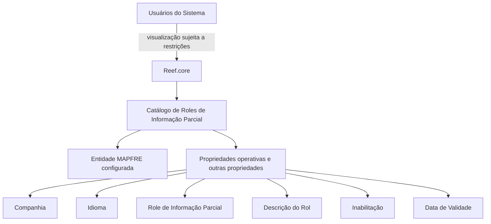

# Definição dos Roles de Informação Parcial no Reef.core

## 1. Metadados do Documento
- **Arquivo de Origem:** Não identificado no conteúdo fornecido
- **Tipo de Documento:** Especificação Funcional
- **Domínio / Sistema:** Reef.core / MAPFRE
- **Público-Alvo:** Administradores funcionais, operação e equipes responsáveis pela configuração de entidades MAPFRE
- **Data/Versão Identificada:** Não identificada

---

## 2. Resumo Executivo & Contexto de Negócio

O documento define os **Roles de Informação Parcial**, utilizados para estabelecer restrições sobre a visualização de informações por usuários do sistema Reef.core. O controle é configurado por entidade MAPFRE cadastrada no sistema.

O Reef.core permite codificar a relação de Roles de Informação Parcial em um catálogo de informação criado especificamente para essa finalidade. A configuração contém propriedades operativas, como companhia, idioma, código do rol, descrição, inabilitação e data de validade.

A configuração deve permitir administrar a disponibilidade dos roles e manter histórico das alterações em suas definições, por meio da data a partir da qual cada rol passa a estar plenamente operacional. O documento recomenda iniciar a configuração considerando o modelo de Mapa de Puestos da entidade.

O conteúdo também indica documentos funcionais relacionados — “Roles de Información Parcial por Aplicación” e “Roles de Información Parcial por Concepto Lógico” — cuja leitura é recomendada para evitar interpretações isoladas ou incorretas.

---

## 3. Arquitetura, Componentes & Tecnologias Envolvidas

Os componentes e conceitos identificados são:

| Componente / Conceito | Papel identificado no documento |
| :--- | :--- |
| **Reef.core** | Sistema que disponibiliza a codificação da relação de Roles de Informação Parcial. |
| **Usuários do Sistema** | Consumidores sujeitos às restrições de visualização de informação. |
| **Entidade MAPFRE** | Entidade configurada no sistema para a qual a relação de roles pode ser codificada. |
| **Catálogo de Roles de Informação Parcial** | Catálogo criado para registrar a configuração dos roles por entidade. |
| **Role de Informação Parcial** | Código que identifica uma regra de restrição de visualização de informação. |
| **Mapa de Puestos da Entidade** | Modelo recomendado como ponto de partida para configurar os roles no catálogo. |
| **Roles de Información Parcial por Aplicación** | Documento funcional relacionado citado como leitura recomendada. |
| **Roles de Información Parcial por Concepto Lógico** | Documento funcional relacionado citado como leitura recomendada. |



**Nota de Análise:** O documento não detalha interfaces, APIs, métodos HTTP, persistência de dados, tecnologias de infraestrutura ou contratos de integração do Reef.core.

---

## 4. Regras de Negócio, Especificações Funcionais & Processos

1. Os Roles de Informação Parcial são utilizados para estabelecer restrições na visualização de informações por usuários do sistema.
2. A relação de Roles de Informação Parcial é codificada para cada entidade MAPFRE configurada no Reef.core.
3. A configuração é mantida em um catálogo de informação criado para a definição dos Roles de Informação Parcial.
4. O atributo **Companhia** deve conter o código da companhia sobre a qual está sendo realizada a configuração do rol.
5. O atributo **Idioma** deve conter o código do idioma empregado na definição do Role de Informação Parcial. O documento cita espanhol, inglês e português como exemplos.
6. O atributo **Rol de Información Parcial** deve conter o código identificador do rol.
7. O atributo **Descripción del Rol** deve conter a nomenclatura do Role de Informação Parcial no idioma utilizado em sua definição.
8. A propriedade **Inhabilitación** define se o código do Role de Informação Parcial está inabilitado para uso.
9. A propriedade **Fecha de Validez** informa ao sistema a data a partir da qual o Role de Informação Parcial está plenamente operacional.
10. O uso correto da **Fecha de Validez** permite manter histórico das mudanças efetuadas nas definições dos roles.
11. A leitura dos documentos “Roles de Información Parcial por Aplicación” e “Roles de Información Parcial por Concepto Lógico” é recomendada para evitar erros decorrentes de uma interpretação isolada deste documento.
12. Como boa prática, a configuração dos roles no catálogo pode ser iniciada de acordo com o modelo de Mapa de Puestos da entidade.

---

## 5. Tabelas de Parâmetros, Ambientes e Estruturas de Dados

| Item / Parâmetro | Descrição / Função | Tipo / Valores / Formato | Ambiente / Observações |
| :--- | :--- | :--- | :--- |
| Companhia | Código da companhia para a qual está sendo configurado o Role de Informação Parcial. | Código de companhia; formato não detalhado. | Aplicável à entidade MAPFRE configurada. |
| Idioma | Código do idioma empregado na definição do Role de Informação Parcial. | Código de idioma; exemplos: espanhol, inglês, português. | A descrição do rol segue o idioma da definição. |
| Rol de Información Parcial | Código que identifica o Role de Informação Parcial. | Código; formato não detalhado. | Pode ser inabilitado para uso. |
| Descripción del Rol | Nomenclatura do Role de Informação Parcial no idioma de sua definição. | Texto; formato não detalhado. | Associada ao idioma informado na configuração. |
| Inhabilitación | Indica se o código do Role de Informação Parcial está inabilitado para utilização. | Indicador de habilitação/inabilitação; valores não detalhados. | Controla a possibilidade de uso do código do rol. |
| Fecha de Validez | Data a partir da qual o Role de Informação Parcial passa a estar plenamente operacional no sistema. | Data; formato não detalhado. | Permite histórico de mudanças nas definições. |
| Roles de Información Parcial por Aplicación | Documento funcional relacionado. | Referência documental. | Leitura recomendada. |
| Roles de Información Parcial por Concepto Lógico | Documento funcional relacionado. | Referência documental. | Leitura recomendada. |
| Mapa de Puestos de la Entidad | Modelo recomendado como base inicial para configuração de roles. | Modelo organizacional; estrutura não detalhada. | Recomendação de boa prática. |

---

## 6. Bateria de Perguntas & Respostas para RAG (FAQ Sintético)

### P1: Qual é a finalidade dos Roles de Informação Parcial no Reef.core?
**R:** Os Roles de Informação Parcial permitem estabelecer restrições na visualização de informações por usuários do sistema Reef.core.

### P2: Onde é configurada a relação de Roles de Informação Parcial?
**R:** A relação é configurada em um catálogo de informação criado para essa finalidade no Reef.core, para cada entidade MAPFRE configurada no sistema.

### P3: O que deve ser informado no atributo Companhia?
**R:** O atributo Companhia deve conter o código da companhia sobre a qual está sendo realizada a configuração do Role de Informação Parcial.

### P4: Qual é a função do atributo Idioma no catálogo?
**R:** O atributo Idioma contém o código do idioma empregado na definição do Role de Informação Parcial. O documento apresenta espanhol, inglês e português como exemplos.

### P5: Como um Role de Informação Parcial é identificado?
**R:** Um Role de Informação Parcial é identificado pelo atributo “Rol de Información Parcial”, que contém o código identificador do rol.

### P6: Como deve ser preenchida a descrição de um Role de Informação Parcial?
**R:** A propriedade “Descripción del Rol” deve conter a nomenclatura do Role de Informação Parcial de acordo com o idioma utilizado em sua definição.

### P7: O que a propriedade Inhabilitación controla?
**R:** A propriedade Inhabilitación estabelece se o código do Role de Informação Parcial está inabilitado para poder ser utilizado.

### P8: Qual é o propósito da Fecha de Validez?
**R:** A Fecha de Validez informa ao sistema a data a partir da qual o Role de Informação Parcial está plenamente operacional. Seu uso correto permite manter histórico das alterações realizadas nas definições dos roles.

### P9: Qual recomendação é apresentada para iniciar a configuração dos roles?
**R:** O documento recomenda como boa prática iniciar a configuração dos Roles de Informação Parcial no catálogo de acordo com o modelo de Mapa de Puestos da entidade.

### P10: Quais documentos devem ser consultados para evitar interpretação isolada da definição de roles?
**R:** O documento recomenda a leitura de “Roles de Información Parcial por Aplicación” e “Roles de Información Parcial por Concepto Lógico”, pois uma interpretação isolada do documento atual pode conduzir a erro.

---

## 7. Glossário de Termos, Siglas & Conceitos-Chave

- **Role de Informação Parcial:** Elemento configurável usado para estabelecer restrições na visualização de informações por usuários do sistema.
- **Catálogo de Roles de Informação Parcial:** Catálogo de informação destinado à codificação da relação de Roles de Informação Parcial para entidades MAPFRE configuradas.
- **Companhia:** Código da companhia sobre a qual a configuração de um rol é realizada.
- **Idioma:** Código do idioma empregado na definição de um Role de Informação Parcial.
- **Inhabilitación:** Propriedade que determina se um código de Role de Informação Parcial está inabilitado para uso.
- **Fecha de Validez:** Data a partir da qual um Role de Informação Parcial está plenamente operacional, permitindo histórico de alterações.
- **Mapa de Puestos:** Modelo recomendado como referência para iniciar a configuração de roles no catálogo.
- **MAPFRE:** Termo utilizado no documento para designar entidades configuradas no sistema; o significado da sigla não é detalhado.
- **Reef.core:** Sistema citado como responsável por permitir a codificação da relação de Roles de Informação Parcial.

---

## 8. Notas Críticas, Riscos & Limitações

- O documento não especifica os valores permitidos, formato ou domínio técnico dos campos Companhia, Idioma, Role de Informação Parcial, Inhabilitación e Fecha de Validez.
- Não há detalhamento de permissões, critérios de precedência, comportamento de conflito entre roles ou lógica de avaliação das restrições de visualização.
- Não são documentadas APIs, métodos HTTP, contratos JSON, banco de dados, mecanismos de autenticação ou fluxos de integração.
- A ausência de consulta aos documentos funcionais relacionados pode levar a interpretação incorreta ou incompleta do catálogo.
- O Mapa de Puestos é apresentado como boa prática, não como requisito obrigatório.
- Não há detalhamento adicional sobre o significado corporativo de MAPFRE, Reef.core ou Mapa de Puestos.

---

## 9. Conteúdo Bruto Estruturado (Referência Fiel)

```text
--- [PÁGINA 1 DE 2] ---

DEFINICIÓN de los Roles de Información Parcial
Contexto
Los Roles de Información Parcial permiten establecer restricciones en la visualización de información a los Usuarios del Sistema.
Funcionalmente, Reef.core cuenta con la posibilidad de codicar la relación de Roles de Información Parcial, para cada entidad MAPFRE
congurada en el Sistema, en un catálogo de información creado al efecto.
Propiedades Operativas
Otras Propiedades
Propiedades Operativas
Compañía
Este Atributo del catálogo contiene el código de la compañía sobre la cual se está realizando la conguración del rol de información parcial.
Idioma.
Esta propiedad contiene el código del Idioma empleado en la denición del Rol de Información Parcial como por ejemplo: español, inglés,
portugués, ...
Rol de Información Parcial
Este Atributo del catálogo contiene el código que identica el Rol de Información Parcial.
Descripción del Rol
Este Atributo del catálogo contiene la nomenclatura del Rol de Información Parcial de acuerdo con el idioma de su denición.
Otras Propiedades
Inhabilitación
Esta propiedad establece si el Código del Rol de Información Parcial está inhabilitado para poder ser utilizado.
Fecha de Validez
Esta propiedad le indica al Sistema la fecha a partir de la cual el Rol de Información Parcial está plenamente operativo en el sistema por lo
que su correcto uso permite tener un histórico de los cambios efectuados en sus deniciones.
Vínculos
Documentation / DOCUMENTACIÓN Reef
DOCUMENTACIÓN Reef
Mapfredocument
DOCUMENTACIÓN Reef
Owner
user:agonzalez_mapfre.com
Lifecycle
Approved Source
 / 
 VL
Buscar Inicio Soluciones Arquitecturas APIs Componentes Cloud Documentación Zeus Reef Ayuda
ES


--- [PÁGINA 2 DE 2] ---

Relación de Directrices y Documentos funcionales cuya lectura recomendada para evitar que la interpretación aislada del presente
documento pueda conducir a error.
Roles de Información Parcial por Aplicación
Roles de Información Parcial por Concepto Lógico
Preguntas frecuentes
(1) ¿Existe alguna recomendación que pueda ser tomada en consideración en el uso y denición del Catálogo de Roles de la Entidad?
Puede ser una buena práctica iniciar la conguración de los Roles en este catálogo de acuerdo con el modelo de Mapa de Puestos de la
Entidad.
```
