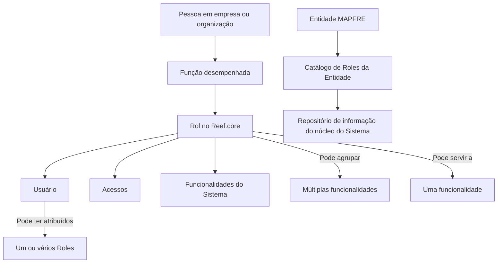
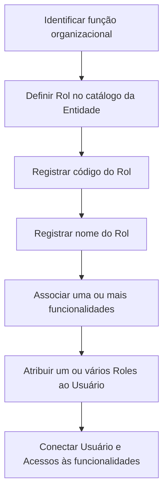

# Definição de Roles por Entidade no Reef.core

## 1. Metadados do Documento
- **Arquivo de Origem:** Não identificado
- **Tipo de Documento:** Especificação Funcional
- **Domínio / Sistema:** Reef.core / MAPFRE
- **Público-Alvo:** Administradores funcionais, gestores de identidade e acesso, equipes de negócio e operação
- **Data/Versão Identificada:** Não identificada
- **Owner identificado:** `user:agonzalez_mapfre.com`
- **Lifecycle identificado:** Approved Source

---

## 2. Resumo Executivo & Contexto de Negócio

O documento define o conceito de **Rol** no contexto do sistema Reef.core. Um Rol está associado à função desempenhada por uma Pessoa em uma empresa ou organização e, no âmbito tecnológico do Reef.core, representa as funções que um Usuário pode realizar e executar no Sistema.

A gestão de Roles conecta os Usuários aos Acessos às funcionalidades do Sistema. Um Rol pode reunir múltiplas funcionalidades ou atender exclusivamente a uma única funcionalidade, permitindo representar diferentes necessidades de acesso e atuação dentro do Reef.core.

Um Usuário pode receber um ou mais Roles. Dessa forma, a atribuição de acesso não é limitada a uma única função organizacional ou funcionalidade do Sistema.

O núcleo do Sistema permite codificar a relação de Roles de cada entidade MAPFRE em um repositório simples de informação. O catálogo de Roles da Entidade possui atributos identificativos para o código e o nome do Rol.

O documento recomenda consultar a documentação relacionada à atribuição de Roles aos Usuários do Sistema e sugere que a configuração inicial do catálogo de Roles considere o modelo de Mapa de Puestos da Entidade.

---

## 3. Arquitetura, Componentes & Tecnologias Envolvidas

### Componentes e conceitos identificados

| Componente / Conceito | Papel descrito no documento |
| :--- | :--- |
| **Reef.core** | Sistema no qual Roles representam funções que um Usuário pode realizar e executar. |
| **Rol** | Elemento vinculado à função de uma Pessoa em uma organização; agrupa funcionalidades ou representa uma funcionalidade única. |
| **Usuário** | Entidade que pode possuir um ou vários Roles atribuídos. |
| **Acessos** | Elementos conectados aos Usuários e às funcionalidades do Sistema por meio dos Roles. |
| **Funcionalidades do Sistema** | Capacidades que podem ser agrupadas por um Rol ou associadas individualmente a um Rol. |
| **Entidade MAPFRE** | Entidade para a qual a relação de Roles pode ser codificada no repositório de informação do núcleo do Sistema. |
| **Catálogo de Roles da Entidade** | Estrutura que contém, ao menos, o código e o nome de cada Rol criado. |
| **Repositório de informação** | Repositório simples no qual o núcleo do Sistema mantém a relação de Roles por entidade MAPFRE. |
| **Mapa de Puestos da Entidade** | Modelo citado como referência de boa prática para iniciar a configuração de Roles. |



**Nota de Análise:** O documento não detalha métodos HTTP, contratos JSON, banco de dados, URLs técnicas, mecanismos de autenticação, matrizes de permissão ou procedimentos operacionais para criação e atribuição de Roles.

---

## 4. Regras de Negócio, Especificações Funcionais & Processos

1. O conceito de Rol está vinculado à função que uma Pessoa desempenha em uma empresa ou organização.
2. No Reef.core, um Rol representa funções que um Usuário pode realizar e executar no Sistema.
3. Os Roles permitem conectar Usuários e Acessos às funcionalidades do Sistema.
4. Um Rol pode agrupar um conjunto de funcionalidades do Sistema.
5. Um Rol também pode servir exclusivamente a uma única funcionalidade do Sistema.
6. Um Usuário pode ter um ou mais Roles atribuídos.
7. O núcleo do Sistema permite codificar a relação de Roles de cada entidade MAPFRE.
8. A relação de Roles por entidade MAPFRE é mantida em um repositório simples de informação.
9. O atributo **Rol** no catálogo de Roles da Entidade contém o código do Rol.
10. O atributo **Nombre del Rol** contém o nome utilizado para reconhecer e denominar o Rol criado.
11. A documentação relacionada à atribuição de Roles aos Usuários do Sistema deve ser considerada como leitura recomendada para evitar interpretações isoladas incorretas.
12. Como boa prática, a configuração inicial dos Roles no catálogo deve seguir o modelo de **Mapa de Puestos de la Entidad**.

### Fluxo funcional identificado



**Nota de Análise:** O documento não especifica quem possui autorização para criar, alterar, excluir ou aprovar Roles. Também não descreve validações, regras de segregação de funções, expiração de acessos ou processo de revisão periódica.

---

## 5. Tabelas de Parâmetros, Ambientes e Estruturas de Dados

| Item / Parâmetro | Descrição / Função | Tipo / Valores / Formato | Ambiente / Observações |
| :--- | :--- | :--- | :--- |
| Rol | Atributo do catálogo de Roles da Entidade que contém o código do Rol. | Código do Rol; formato não detalhado. | Reef.core / Catálogo de Roles da Entidade. |
| Nombre del Rol | Atributo que contém o nome pelo qual o Rol criado será reconhecido e denominado. | Nome do Rol; formato não detalhado. | Reef.core / Catálogo de Roles da Entidade. |
| Usuário | Entidade que pode receber Roles. | Pode ter um ou vários Roles. | Reef.core. |
| Rol | Representação de funções que um Usuário pode realizar e executar no Sistema. | Pode abranger múltiplas funcionalidades ou uma funcionalidade única. | Reef.core. |
| Funcionalidades do Sistema | Capacidades relacionadas aos Roles. | Uma ou várias funcionalidades por Rol. | Reef.core. |
| Entidade MAPFRE | Entidade cuja relação de Roles pode ser codificada. | Não detalhado. | MAPFRE / Reef.core. |
| Repositório de informação | Local lógico para codificar a relação de Roles de cada entidade MAPFRE. | Descrito como “sencillo repositorio de información”. | Núcleo do Sistema. |
| Mapa de Puestos da Entidade | Referência sugerida para a configuração inicial do catálogo de Roles. | Modelo organizacional; estrutura não detalhada. | Boa prática recomendada. |
| Owner | Proprietário identificado na página de documentação. | `user:agonzalez_mapfre.com` | Documentação Reef. |
| Lifecycle | Estado identificado na documentação. | `Approved Source` | Documentação Reef. |

---

## 6. Bateria de Perguntas & Respostas para RAG (FAQ Sintético)

### P1: O que é um Rol no contexto do Reef.core?
**R:** No Reef.core, um Rol representa as funções que um Usuário pode realizar e executar no Sistema. O conceito de Rol está vinculado à função que uma Pessoa desempenha em uma empresa ou organização.

### P2: Qual é a relação entre Roles, Usuários e Acessos no Reef.core?
**R:** Os Roles permitem conectar os Usuários e os Acessos às funcionalidades do Sistema. Por meio da atribuição de Roles, um Usuário fica relacionado às funcionalidades abrangidas pelo Rol.

### P3: Um Rol no Reef.core pode conter mais de uma funcionalidade?
**R:** Sim. Um Rol pode agrupar um conjunto de funcionalidades do Sistema. O documento também estabelece que um Rol pode servir a uma única funcionalidade do Sistema.

### P4: Um Usuário pode ter vários Roles atribuídos?
**R:** Sim. O documento informa explicitamente que um Usuário pode ter atribuídos um ou vários Roles.

### P5: Quais dados identificam um Rol no catálogo de Roles da Entidade?
**R:** O catálogo identifica um Rol por meio do atributo **Rol**, que contém o código do Rol, e do atributo **Nombre del Rol**, que contém o nome utilizado para reconhecer e denominar o Rol criado.

### P6: Onde a relação de Roles por entidade MAPFRE é mantida?
**R:** O núcleo do Sistema possui a possibilidade de codificar a relação de Roles de cada entidade MAPFRE em um repositório simples de informação.

### P7: Qual boa prática é recomendada para iniciar a configuração de Roles?
**R:** O documento recomenda como boa prática iniciar a configuração dos Roles no catálogo de acordo com o modelo de Mapa de Puestos da Entidade.

### P8: O documento detalha APIs, métodos HTTP ou contratos JSON para gestão de Roles?
**R:** Não. O documento descreve o conceito funcional de Roles, seus atributos identificativos e sua relação com Usuários, Acessos e funcionalidades, mas não detalha APIs, métodos HTTP ou contratos JSON.

### P9: O documento estabelece uma matriz de permissões ou regras de segregação de funções?
**R:** Não. O conteúdo informa que Roles podem conectar Usuários e Acessos às funcionalidades do Sistema, mas não apresenta uma matriz de permissões, regras de segregação de funções ou critérios de conflito entre Roles.

### P10: Qual documentação adicional deve ser considerada ao interpretar esta definição de Roles?
**R:** O documento indica como vínculo a documentação **“Asignación de Roles a los Usuarios del Sistema”** e recomenda sua leitura para evitar que a interpretação isolada do documento conduza a erro.

---

## 7. Glossário de Termos, Siglas & Conceitos-Chave

- **Reef.core:** Sistema no qual Roles definem funções que Usuários podem realizar e executar.
- **Rol:** Elemento associado à função de uma Pessoa em uma organização e às funcionalidades que um Usuário pode acessar ou executar no Sistema.
- **Usuário:** Entidade que pode ter um ou vários Roles atribuídos.
- **Acessos:** Elementos conectados aos Usuários e às funcionalidades do Sistema por intermédio dos Roles.
- **Funcionalidades do Sistema:** Capacidades do Reef.core que podem ser agrupadas em um Rol ou associadas a um Rol único.
- **Entidade MAPFRE:** Entidade para a qual a relação de Roles pode ser codificada no repositório de informação do núcleo do Sistema.
- **Catálogo de Roles da Entidade:** Estrutura que contém os dados identificativos dos Roles, incluindo código e nome.
- **Mapa de Puestos:** Modelo citado como referência para iniciar a configuração de Roles no catálogo da Entidade.
- **Lifecycle:** Campo identificado na documentação com o valor `Approved Source`.
- **Owner:** Campo de propriedade identificado com o valor `user:agonzalez_mapfre.com`.

---

## 8. Notas Críticas, Riscos & Limitações

- O documento é funcional e conceitual; não fornece detalhes de implementação técnica.
- Não há descrição de APIs, endpoints, métodos HTTP, contratos de integração, modelos JSON, banco de dados ou tecnologias de infraestrutura.
- Não são informados critérios para criação, edição, exclusão, aprovação ou desativação de Roles.
- Não existe matriz de permissão, detalhamento de acessos, segregação de funções ou regras para conflitos entre múltiplos Roles.
- Não há informação sobre auditoria, trilhas de alteração, revisões periódicas, expiração de atribuições ou processos de recertificação.
- A documentação relacionada à atribuição de Roles aos Usuários deve ser consultada para evitar interpretação isolada incorreta.
- O documento sugere o Mapa de Puestos da Entidade como boa prática, mas não fornece sua estrutura ou regras de mapeamento para Roles.

---

## 9. Conteúdo Bruto Estruturado (Referência Fiel)

```text
--- [PÁGINA 1 DE 1] ---

DEFINICIÓN de los Roles por Entidad
Contexto
El concepto del Rol está vinculado a la función que una Persona desempeña en una empresa u organización y en el ámbito tecnológico de
Reef.core se reere a las funciones que un Usuario puede realizar y ejecutar en el Sistema.
Los Roles permiten conectar a los Usuarios y los Accesos a las funcionalidades del Sistema
Un Rol puede agrupar un conjunto de funcionalidades o servir a una única funcionalidad del Sistema, y
Un Usuario puede tener asignados uno o varios Roles.
Funcionalmente, el núcleo del Sistema cuenta con la posibilidad de codicar la relación de Roles de cada entidad MAPFRE en un sencillo
repositorio de información.
Datos Identicativos
Rol
Este Atributo del catálogo de Roles de la Entidad contiene el código del Rol.
Nombre del Rol
Este Atributo del catálogo de Roles de la Entidad contiene el nombre por el que vamos a reconocer y denominar al Rol creado.
Vínculos
Relación de Directrices y Documentos funcionales cuya lectura recomendada para evitar que la interpretación aislada del presente
documento pueda conducir a error.
Asignación de Roles a los Usuarios del Sistema
Preguntas frecuentes
(1) ¿Existe alguna recomendación que pueda ser tomada en consideración en el uso y denición del Catálogo de Roles de la Entidad?
Puede ser una buena práctica iniciar la conguración de los Roles en este catálogo de acuerdo con el modelo de Mapa de Puestos de la
Entidad.
Documentation / DOCUMENTACIÓN Reef
DOCUMENTACIÓN Reef
Mapfredocument
DOCUMENTACIÓN Reef
Owner
user:agonzalez_mapfre.com
Lifecycle
Approved Source
 / 
 VL
Buscar Inicio Soluciones Arquitecturas APIs Componentes Cloud Documentación Zeus Reef Ayuda
ES
```
