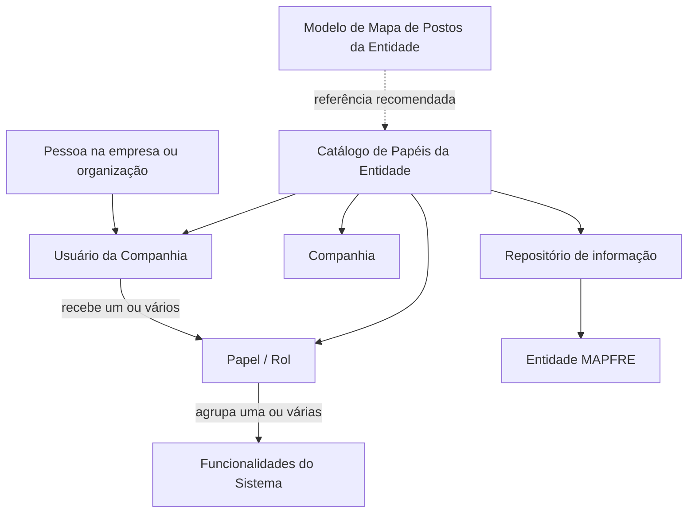
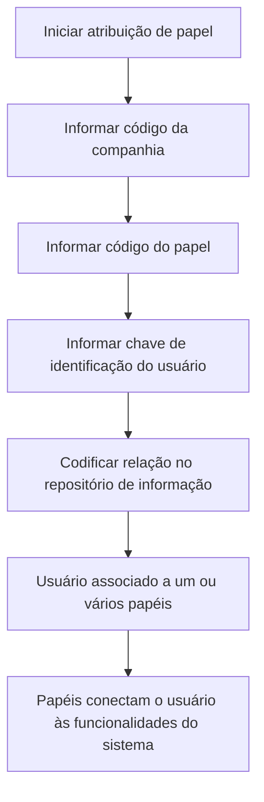

# Atribuição de Papéis aos Usuários do Sistema — Reef.core / MAPFRE

## 1. Metadados do Documento
- **Arquivo de Origem:** Não informado
- **Tipo de Documento:** Especificação Funcional
- **Domínio / Sistema:** Reef.core / MAPFRE
- **Público-Alvo:** Usuários e responsáveis pela configuração de papéis da entidade
- **Data/Versão Identificada:** Não identificada

---

## 2. Resumo Executivo & Contexto de Negócio

O documento descreve a atribuição de papéis (*Roles*) aos usuários no sistema Reef.core. O conceito de papel está associado à função que uma pessoa desempenha em uma empresa ou organização.

No Reef.core, os papéis conectam usuários aos acessos às funcionalidades do sistema. Um papel pode agrupar várias funcionalidades ou atender uma única funcionalidade. Um usuário pode possuir um ou vários papéis atribuídos.

O núcleo do sistema permite codificar e manter a relação entre papéis e a entidade MAPFRE em um repositório simples de informações. A configuração utiliza atributos identificativos de companhia, papel e usuário da companhia.

O documento recomenda interpretar a configuração de papéis junto com as diretrizes e documentos funcionais relacionados, especialmente o material denominado **“Roles por Entidad”**, para evitar conclusões incorretas decorrentes de leitura isolada.

---

## 3. Arquitetura, Componentes & Tecnologias Envolvidas

| Componente / Conceito | Papel no contexto documentado |
| :--- | :--- |
| Reef.core | Sistema no qual ocorre a atribuição de papéis e acessos. |
| Usuário | Pessoa identificada no catálogo de papéis da entidade e destinatária da atribuição de um ou mais papéis. |
| Papel / Rol | Representação da função de uma pessoa na organização; conecta usuários às funcionalidades do sistema. |
| Funcionalidade do sistema | Capacidade do sistema que pode ser agrupada por um papel ou associada individualmente a um papel. |
| Entidade MAPFRE | Entidade para a qual a relação de papéis é codificada no repositório de informações. |
| Catálogo de Papéis da Entidade | Catálogo que contém atributos de companhia, papel e usuário da companhia. |
| Repositório de informação | Repositório simples no qual a relação de papéis da entidade MAPFRE é codificada. |
| Mapa de Postos da Entidade | Modelo recomendado como base para iniciar a configuração dos papéis. |
| Roles por Entidad | Documento funcional relacionado cuja leitura é recomendada. |



> **Nota de Análise:** O documento não detalha métodos HTTP, contratos JSON, banco de dados, tecnologias de infraestrutura, URLs de ambiente, mecanismos de autenticação ou regras técnicas de persistência.

---

## 4. Regras de Negócio, Especificações Funcionais & Processos

1. O conceito de papel está vinculado à função que uma pessoa desempenha em uma empresa ou organização.
2. No Reef.core, o uso de papéis permite conectar usuários aos acessos às funcionalidades do sistema.
3. Um papel pode agrupar um conjunto de funcionalidades do sistema.
4. Um papel também pode servir a uma única funcionalidade do sistema.
5. Um usuário pode ter um ou vários papéis atribuídos.
6. O núcleo do sistema permite codificar a relação de papéis da entidade MAPFRE em um repositório simples de informações.
7. A atribuição de um papel utiliza, no mínimo, os atributos identificativos de companhia, papel e usuário da companhia.
8. O atributo **Companhia** contém o código da companhia sobre a qual está sendo realizada a atribuição do papel.
9. O atributo **Papel** contém o código do papel que está sendo atribuído ao usuário.
10. O atributo **Usuário da Companhia** contém a chave de identificação do usuário ao qual o papel está sendo atribuído.
11. A configuração inicial de papéis no catálogo deve seguir, como boa prática, o modelo de Mapa de Postos da Entidade.
12. A leitura do documento relacionado **“Roles por Entidad”** é recomendada para evitar erros de interpretação do documento em análise quando lido isoladamente.

### Fluxo funcional de atribuição de papel



---

## 5. Tabelas de Parâmetros, Ambientes e Estruturas de Dados

| Item / Parâmetro | Descrição / Função | Tipo / Valores / Formato | Ambiente / Observações |
| :--- | :--- | :--- | :--- |
| Companhia | Código da companhia sobre a qual ocorre a atribuição do papel. | Código de companhia; formato não detalhado. | Atributo do catálogo. |
| Papel / Rol | Código do papel atribuído ao usuário. | Código de papel; formato não detalhado. | Atributo do catálogo. |
| Usuário da Companhia | Chave de identificação do usuário que receberá o papel. | Chave de identificação; formato não detalhado. | Atributo do Catálogo de Papéis da Entidade. |
| Relação de papéis | Relação entre papéis e a entidade MAPFRE. | Não detalhado. | Codificada em repositório simples de informação. |
| Funcionalidades do sistema | Funcionalidades às quais os papéis se vinculam. | Um conjunto de funcionalidades ou uma única funcionalidade. | O documento não lista funcionalidades específicas. |
| Mapa de Postos da Entidade | Modelo recomendado para iniciar a configuração de papéis. | Modelo organizacional; estrutura não detalhada. | Boa prática de configuração. |
| Roles por Entidad | Documento funcional relacionado. | Documento de referência. | Leitura recomendada para evitar interpretação isolada. |
| Lifecycle | Estado apresentado nos metadados da página documental. | Approved Source. | Sem detalhamento adicional. |
| Owner | Proprietário apresentado nos metadados da página documental. | `user:agonzalez_mapfre.com` | Apresentado literalmente no conteúdo bruto. |

---

## 6. Bateria de Perguntas & Respostas para RAG (FAQ Sintético)

### P1: Qual é a finalidade dos papéis no sistema Reef.core?
**R:** No Reef.core, os papéis conectam os usuários aos acessos às funcionalidades do sistema. O papel representa a função que uma pessoa desempenha em uma empresa ou organização.

### P2: Um usuário pode receber mais de um papel no Reef.core?
**R:** Sim. O documento informa que um usuário pode ter atribuídos um ou vários papéis.

### P3: Um papel no Reef.core pode controlar mais de uma funcionalidade?
**R:** Sim. Um papel pode agrupar um conjunto de funcionalidades do sistema. O documento também informa que um papel pode servir a uma única funcionalidade.

### P4: Quais atributos identificativos são utilizados na atribuição de um papel?
**R:** A atribuição utiliza os atributos Companhia, Papel e Usuário da Companhia. Companhia identifica o código da companhia, Papel identifica o código do papel e Usuário da Companhia identifica o usuário destinatário da atribuição.

### P5: O que representa o atributo Companhia no Catálogo de Papéis da Entidade?
**R:** O atributo Companhia contém o código da companhia sobre a qual está sendo realizada a atribuição do papel.

### P6: O que representa o atributo Papel no catálogo?
**R:** O atributo Papel contém o código do papel que está sendo atribuído ao usuário.

### P7: O que representa o atributo Usuário da Companhia?
**R:** O atributo Usuário da Companhia contém a chave de identificação do usuário ao qual o papel está sendo atribuído.

### P8: Onde é codificada a relação de papéis da entidade MAPFRE?
**R:** A relação de papéis da entidade MAPFRE é codificada pelo núcleo do sistema em um repositório simples de informações.

### P9: Qual recomendação existe para iniciar a configuração dos papéis?
**R:** A recomendação é iniciar a configuração dos papéis no catálogo de acordo com o modelo de Mapa de Postos da Entidade.

### P10: Qual documento relacionado deve ser consultado para evitar interpretações isoladas?
**R:** O documento recomenda consultar a relação de diretrizes e documentos funcionais, incluindo o material denominado “Roles por Entidad”, para evitar que a interpretação isolada conduza a erro.

---

## 7. Glossário de Termos, Siglas & Conceitos-Chave

- **Reef.core:** Sistema no qual os papéis são utilizados para conectar usuários aos acessos às funcionalidades.
- **Rol / Papel:** Conceito vinculado à função que uma pessoa desempenha em uma empresa ou organização.
- **Usuário:** Pessoa à qual um ou mais papéis podem ser atribuídos.
- **Catálogo de Papéis da Entidade:** Catálogo que contém os dados de companhia, papel e usuário da companhia para a atribuição.
- **Entidade MAPFRE:** Entidade cuja relação de papéis pode ser codificada no repositório de informação.
- **Mapa de Postos da Entidade:** Modelo recomendado como referência para iniciar a configuração dos papéis.
- **Roles por Entidad:** Documento funcional relacionado cuja leitura é recomendada.
- **Lifecycle:** Metadado exibido no conteúdo original com o valor “Approved Source”.
- **Owner:** Metadado exibido no conteúdo original com o valor `user:agonzalez_mapfre.com`.

---

## 8. Notas Críticas, Riscos & Limitações

- O documento não detalha o formato dos códigos de companhia e papel, nem o formato da chave de identificação do usuário.
- O documento não apresenta regras de validação, mensagens de erro, aprovação, revogação ou auditoria da atribuição de papéis.
- O documento não lista as funcionalidades específicas associadas a cada papel.
- O documento não detalha a estrutura, localização ou tecnologia do repositório de informações.
- O documento recomenda a leitura de documentos funcionais relacionados, especialmente **“Roles por Entidad”**; a interpretação isolada pode conduzir a erro.
- Há caracteres aparentemente corrompidos na extração bruta em palavras como `codicar`, `identicación`, `conguración` e `denición`. A análise interpretou esses trechos apenas pelo contexto textual apresentado, sem introduzir fatos adicionais.

---

## 9. Conteúdo Bruto Estruturado (Referência Fiel)

```text
--- [PÁGINA 1 DE 1] ---

ASIGNACIÓN de Roles a los Usuarios del Sistema
Contexto
El concepto del Rol está vinculado a la función que una Persona desempeña en una empresa u organización.
Su empleo en Reef.core permite conectar a los Usuarios y los Accesos a las funcionalidades del Sistema (un Rol puede agrupar un conjunto
de funcionalidades o servir a una única funcionalidad del Sistema y un Usuario puede tener asignados uno o varios Roles).
Funcionalmente, el núcleo del Sistema cuenta con la posibilidad de codicar la relación de Roles de la entidad MAPFRE en un sencillo
repositorio de información.
Datos Identicativos
Compañía
Este Atributo del catálogo contiene el código de la compañía sobre la cual se está realizando la asignación del Rol.
Rol
Este Atributo del catálogo contiene el código del Rol que se está asignando al Usuario.
Usuario de la Compañía
Este Atributo del catálogo de Roles de la Entidad contiene la clave de identicación del Usuario al que se le está asignando el Rol.
Vínculos
Relación de Directrices y Documentos funcionales cuya lectura recomendada para evitar que la interpretación aislada del presente
documento pueda conducir a error.
Roles por Entidad
Preguntas frecuentes
(1) ¿Existe alguna recomendación que pueda ser tomada en consideración en el uso y denición del Catálogo de Roles de la Entidad?
Es una buena práctica iniciar la conguración de los Roles en este catálogo de acuerdo con el modelo de Mapa de Puestos de la Entidad.
Documentation / DOCUMENTACIÓN Reef
DOCUMENTACIÓN Reef
Mapfredocument
DOCUMENTACIÓN Reef
Owner
user:agonzalez_mapfre.com
Lifecycle
Approved Source
 /
 VL
Buscar Inicio Soluciones Arquitecturas APIs Componentes Cloud Documentación Zeus Reef Ayuda
ES
```
