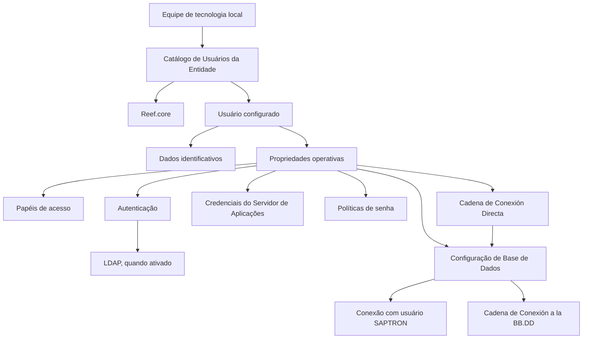

# Definição de Usuários no Servidor de Aplicações — Reef.core

## 1. Metadados do Documento
- **Arquivo de Origem:** Não identificado no conteúdo fornecido
- **Tipo de Documento:** Especificação Técnica
- **Domínio / Sistema:** Reef.core / MAPFRE / Servidor de Aplicações
- **Público-Alvo:** Equipe de tecnologia local, administradores e operadores do sistema
- **Data/Versão Identificada:** Não identificada

---

## 2. Resumo Executivo & Contexto de Negócio

O documento define a configuração de usuários no Servidor de Aplicações do sistema Reef.core. A configuração deve ser realizada para todos os usuários cadastrados e para cada entidade MAPFRE na qual esses usuários possam operar.

A finalidade técnica é manter os dados de acesso de cada usuário em um repositório de informação específico. A definição inclui dados identificativos, propriedades operacionais, papéis de acesso, credenciais, parâmetros de conexão com base de dados e políticas de senha.

A responsabilidade pela execução dessas tarefas é exclusiva da equipe de tecnologia local. O catálogo de usuários deve ser configurado considerando as recomendações emitidas pela Dirección de Seguridad Corporativa (DISMA).

O documento também descreve comportamentos condicionais importantes, como a ativação de LDAP, a conexão à base de dados com o usuário SAPTRON, a possibilidade de acesso sem senha e a prevalência de uma cadeia de conexão direta sobre as propriedades individuais de conexão.

---

## 3. Arquitetura, Componentes & Tecnologias Envolvidas

Os componentes e conceitos identificados no documento são:

| Componente / Tecnologia | Papel no contexto documentado |
| :--- | :--- |
| **Reef.core** | Sistema no qual são configurados os dados de acesso dos usuários. |
| **Servidor de Aplicações** | Camada onde são definidos usuários, credenciais, papéis e propriedades operacionais. |
| **Entidade MAPFRE** | Companhia ou entidade para a qual a definição de usuários e acessos é realizada. |
| **Catálogo de Usuários da Entidade** | Repositório de configuração dos usuários no Servidor de Aplicações. |
| **LDAP** | Mecanismo de autenticação cuja ativação exige que a propriedade de Usuário de Rede esteja ativa e a propriedade Modificar Usuário esteja inativa. |
| **Base de Dados (BB.DD)** | Destino configurável por usuário, incluindo usuário, senha e cadeia de conexão. |
| **SAPTRON** | Usuário citado na propriedade que determina se a conexão à base de dados deve utilizar o usuário do Servidor de Aplicações. |
| **JSPOOL** | Contexto associado aos papéis AJP/EJP, UJP e OJP. |
| **DISMA** | Dirección de Seguridad Corporativa, cujas recomendações devem ser consideradas como boa prática na configuração. |



**Nota de Análise:** O documento menciona LDAP, SAPTRON, JSPOOL e Reef.core, mas não detalha protocolos, métodos de autenticação, contratos de integração, tecnologias de banco de dados ou formatos técnicos da cadeia de conexão.

---

## 4. Regras de Negócio, Especificações Funcionais & Processos

### 4.1 Responsabilidade de configuração

1. Os dados de acesso devem ser configurados no Reef.core.
2. A configuração deve contemplar todos os usuários cadastrados.
3. A configuração deve ser realizada por entidade MAPFRE na qual cada usuário possa operar.
4. As tarefas de configuração são responsabilidade exclusiva da equipe de tecnologia local.
5. Como boa prática, a configuração do Catálogo de Usuários da Entidade deve considerar as recomendações da Dirección de Seguridad Corporativa (DISMA).

### 4.2 Dados identificativos

1. O atributo **Compañía** contém o código da companhia para a qual está sendo definida a configuração de usuários e dados de acesso.
2. O atributo **Clave de Usuario** contém o código do usuário cujos dados de acesso estão sendo definidos.
3. O atributo **Sistema Operativo** contém o tipo de sistema operacional do equipamento do usuário que se conecta ao sistema.

### 4.3 Regras para papéis de acesso

1. A propriedade **Roles de Acceso** contém a relação de papéis atribuídos ao usuário.
2. Por padrão, os usuários são criados com os papéis **PRG** e **OJP**.
3. Para atribuir mais de um papel ao mesmo usuário, deve existir um espaço em branco entre os códigos dos papéis.

### 4.4 Regras de autenticação e modificação de usuário

1. A propriedade **Usuario de Red** define se o usuário do Servidor de Aplicações e o usuário de rede devem coincidir.
2. Quando LDAP for ativado como autenticação de usuários na aplicação:
   - A propriedade **Usuario de Red** deve ser ativada.
   - A propriedade **Modificar Usuario** deve permanecer inativa.
3. A propriedade **Modificar Usuario** define se o usuário pode ser modificado depois de configurado.
4. A propriedade **Acceso sin Clave** define se o usuário pode acessar diretamente a aplicação usando o código de usuário.

### 4.5 Regras de conexão com base de dados

1. A propriedade **Conexión a BB.DD con Usuario SAPTRON** define se a conexão à base de dados deve ser realizada com o usuário do Servidor de Aplicações.
2. O atributo **Usuario de Acceso a la BB.DD** define o usuário de acesso à base de dados.
3. O atributo **Clave de Acceso a la BB.DD** define a senha de acesso à base de dados.
4. A propriedade **Cadena de Conexión a la BB.DD** contém a cadeia de conexão da base de dados, incluindo host, porta, protocolo e outros elementos não detalhados no documento.
5. Caso **Cadena de Conexión Directa** possua valor, o sistema altera a forma interna de conexão à aplicação:
   - As definições individuais das propriedades deixam de ser consideradas.
   - O valor da cadeia direta passa a ser considerado.
6. A **Cadena de Conexión Directa** deve conter:
   - Usuário do Servidor de Aplicações;
   - Senha do usuário do Servidor de Aplicações;
   - Usuário de acesso à base de dados;
   - Senha de acesso à base de dados;
   - Cadeia de conexão à base de dados.

### 4.6 Regras de senha

1. A propriedade **Clave del Servidor de Aplicaciones** define a senha de acesso ao Servidor de Aplicações.
2. **Días de Validez de la Clave** define a quantidade de dias para que a senha de acesso seja considerada expirada.
3. Quando **Días de Validez de la Clave** possui valor `0`, não há validação de expiração de senha.
4. **Fecha última Modificación Clave de Acceso** registra a data da última modificação da senha de acesso.
5. **Obligatoriedad de cambiar la Clave de Acceso** define se existe obrigatoriedade de alterar a senha conforme os parâmetros de dias de validade e data da última modificação.
6. **Números y Letras en Clave de Acceso** define se a senha deve ser composta por combinação de letras e números.
7. **Longitud Mínima** define o tamanho mínimo da senha:
   - Valor `0`: não valida tamanho mínimo.
8. **Longitud Máxima** define o tamanho máximo da senha:
   - Valor `0`: não valida tamanho máximo.

---

## 5. Tabelas de Parâmetros, Ambientes e Estruturas de Dados

### 5.1 Papéis de acesso

| Item / Parâmetro | Descrição / Função | Tipo / Valores / Formato | Ambiente / Observações |
| :--- | :--- | :--- | :--- |
| Roles de Acceso | Relação de papéis atribuídos ao usuário. | Lista de códigos de papel. | Para múltiplos papéis, separar os códigos por espaço em branco. |
| SUA/ADM | Super Usuario / Administrador. | Código de papel. | Papel de acesso. |
| PRG | Usuario / Operador. | Código de papel. | Papel padrão na criação de usuários. |
| AJP/EJP | Administrador / Super Usuario JSPOOL. | Código de papel. | Associado a JSPOOL. |
| UJP | Usuario JSPOOL. | Código de papel. | Associado a JSPOOL. |
| OJP | Operador JSPOOL. | Código de papel. | Papel padrão na criação de usuários. |
| WTWPRG | Operador Web Reef.core. | Código de papel. | Associado ao Reef.core Web. |
| WTWADM | Administrador Web Reef.core. | Código de papel. | Associado ao Reef.core Web. |

### 5.2 Dados identificativos

| Item / Parâmetro | Descrição / Função | Tipo / Valores / Formato | Ambiente / Observações |
| :--- | :--- | :--- | :--- |
| Compañía | Código da companhia sobre a qual é realizada a definição de usuários e dados de acesso. | Código de companhia. | Entidade MAPFRE. |
| Clave de Usuario | Código do usuário para o qual os dados de acesso são definidos. | Código de usuário. | Servidor de Aplicações. |
| Sistema Operativo | Tipo de sistema operacional do equipamento do usuário que se conecta ao sistema. | Tipo de sistema operacional. | Equipamento do usuário. |

### 5.3 Propriedades operativas, autenticação e conexão

| Item / Parâmetro | Descrição / Função | Tipo / Valores / Formato | Ambiente / Observações |
| :--- | :--- | :--- | :--- |
| Usuario de Red | Define se o usuário do Servidor de Aplicações e o usuário de rede devem coincidir. | Propriedade booleana ou equivalente. | Deve ser ativada quando LDAP for usado para autenticação. |
| Modificar Usuario | Define se o usuário pode ser modificado após ter sido configurado. | Propriedade booleana ou equivalente. | Deve permanecer inativa quando LDAP estiver ativado. |
| Conexión a BB.DD con Usuario SAPTRON | Define se a conexão com a base de dados deve ser realizada com o usuário do Servidor de Aplicações. | Propriedade booleana ou equivalente. | Relacionada ao usuário SAPTRON. |
| Acceso sin Clave | Define se o usuário pode acessar diretamente a aplicação com o código de usuário. | Propriedade booleana ou equivalente. | Acesso à aplicação. |
| Clave del Servidor de Aplicaciones | Define a senha de acesso ao Servidor de Aplicações. | Senha. | Credencial do Servidor de Aplicações. |
| Usuario de Acceso a la BB.DD | Define o usuário utilizado para acesso à base de dados. | Usuário de base de dados. | Base de dados. |
| Clave de Acceso a la BB.DD | Define a senha de acesso à base de dados. | Senha. | Base de dados. |
| Cadena de Conexión a la BB.DD | Contém a cadeia de conexão à base de dados. | Host, porta, protocolo e outros elementos. | Base de dados. |
| Cadena de Conexión Directa | Altera o modo interno de conexão à aplicação quando possui valor. | Cadeia de conexão composta. | Substitui a consideração das propriedades individuais de conexão. |

### 5.4 Políticas de senha

| Item / Parâmetro | Descrição / Função | Tipo / Valores / Formato | Ambiente / Observações |
| :--- | :--- | :--- | :--- |
| Días de Validez de la Clave | Define os dias decorridos até a senha ser considerada expirada. | Número de dias. | Valor `0` desativa a validação de expiração. |
| Fecha última Modificación Clave de Acceso | Registra a data da última alteração da senha de acesso. | Data. | Utilizada em conjunto com os dias de validade. |
| Obligatoriedad de cambiar la Clave de Acceso | Define se há obrigatoriedade de alterar a senha. | Propriedade booleana ou equivalente. | Considera dias de validade e última modificação. |
| Números y Letras en Clave de Acceso | Define se a senha deve combinar letras e números. | Propriedade booleana ou equivalente. | Política de composição de senha. |
| Longitud Mínima | Define o comprimento mínimo da senha. | Número inteiro. | Valor `0` desativa a validação de comprimento mínimo. |
| Longitud Máxima | Define o comprimento máximo da senha. | Número inteiro. | Valor `0` desativa a validação de comprimento máximo. |

---

## 6. Bateria de Perguntas & Respostas para RAG (FAQ Sintético)

### P1: Qual equipe é responsável por configurar usuários no Servidor de Aplicações do Reef.core?
**R:** As tarefas de configuração dos usuários no Servidor de Aplicações são de responsabilidade exclusiva da equipe de tecnologia local.

### P2: Quais papéis são atribuídos por padrão a um novo usuário?
**R:** Por padrão, os usuários são criados com os papéis `PRG` e `OJP`. O papel `PRG` corresponde a Usuario / Operador e o papel `OJP` corresponde a Operador JSPOOL.

### P3: Como atribuir mais de um papel de acesso ao mesmo usuário?
**R:** Para atribuir mais de um papel ao mesmo usuário, os códigos dos papéis devem ser separados por um espaço em branco na propriedade `Roles de Acceso`.

### P4: O que deve ocorrer com as propriedades Usuario de Red e Modificar Usuario quando LDAP está ativo?
**R:** Quando LDAP é ativado como mecanismo de autenticação dos usuários na aplicação, a propriedade `Usuario de Red` deve ser ativada e a propriedade `Modificar Usuario` deve permanecer inativa.

### P5: O que acontece quando Días de Validez de la Clave possui valor zero?
**R:** Quando `Días de Validez de la Clave` possui valor `0`, a expiração da senha de acesso não é validada.

### P6: O que acontece quando Longitud Mínima ou Longitud Máxima possuem valor zero?
**R:** Quando `Longitud Mínima` possui valor `0`, não existe validação de tamanho mínimo da senha. Quando `Longitud Máxima` possui valor `0`, não existe validação de tamanho máximo da senha.

### P7: Quais informações devem compor a Cadena de Conexión Directa?
**R:** A `Cadena de Conexión Directa` deve conter o usuário do Servidor de Aplicações, a senha do usuário do Servidor de Aplicações, o usuário de acesso à base de dados, a senha de acesso à base de dados e a cadeia de conexão à base de dados.

### P8: Qual é o efeito de configurar uma Cadena de Conexión Directa?
**R:** Se a propriedade `Cadena de Conexión Directa` possuir valor, o sistema altera internamente a forma de conexão à aplicação. Em vez de considerar as definições individuais de propriedades de acesso e conexão, o sistema considera o valor definido na cadeia direta.

### P9: O que define a propriedade Conexión a BB.DD con Usuario SAPTRON?
**R:** A propriedade `Conexión a BB.DD con Usuario SAPTRON` define se a conexão à base de dados deve ou não ser realizada com o usuário do Servidor de Aplicações.

### P10: Qual é a finalidade da propriedade Acceso sin Clave?
**R:** A propriedade `Acceso sin Clave` indica se o usuário pode acessar diretamente a aplicação usando o Código de Usuário.

### P11: Quais recomendações devem ser consideradas ao configurar o Catálogo de Usuários da Entidade?
**R:** O documento recomenda, como boa prática, configurar os usuários do Catálogo de Usuários da Entidade considerando as recomendações emitidas pela Dirección de Seguridad Corporativa (DISMA).

---

## 7. Glossário de Termos, Siglas & Conceitos-Chave

- **AJP/EJP:** Administrador / Super Usuario JSPOOL.
- **BB.DD:** Base de Dados.
- **Cadena de Conexión a la BB.DD:** Cadeia de conexão da base de dados, contendo host, porta, protocolo e outros elementos.
- **Cadena de Conexión Directa:** Cadeia que substitui a consideração das propriedades individuais de conexão quando recebe valor.
- **DISMA:** Dirección de Seguridad Corporativa.
- **JSPOOL:** Contexto associado aos papéis AJP/EJP, UJP e OJP.
- **LDAP:** Mecanismo de autenticação de usuários citado no documento.
- **OJP:** Operador JSPOOL.
- **PRG:** Usuario / Operador.
- **Reef.core:** Sistema no qual são configurados os usuários e seus dados de acesso.
- **SAPTRON:** Usuário citado na propriedade de conexão com base de dados.
- **SUA/ADM:** Super Usuario / Administrador.
- **UJP:** Usuario JSPOOL.
- **WTWADM:** Administrador Web Reef.core.
- **WTWPRG:** Operador Web Reef.core.

---

## 8. Notas Críticas, Riscos & Limitações

- O documento não detalha o formato técnico, protocolo, codificação ou mecanismo de proteção das credenciais armazenadas nas propriedades de senha.
- O documento menciona LDAP, mas não especifica servidor LDAP, atributos de diretório, grupos, mecanismo de sincronização ou fluxo de autorização.
- A `Cadena de Conexión Directa` prevalece sobre as propriedades individuais de conexão, o que pode reduzir a visibilidade operacional sobre os valores individualmente configurados.
- A configuração de `Días de Validez de la Clave`, `Longitud Mínima` ou `Longitud Máxima` com valor `0` desativa as respectivas validações descritas.
- A responsabilidade é exclusiva da equipe de tecnologia local, criando dependência operacional dessa equipe para alterações de usuários e acessos.
- O documento recomenda seguir as diretrizes da DISMA, mas não reproduz as diretrizes de segurança corporativa.
- **Nota de Análise:** O documento não detalha métodos HTTP, contratos JSON, portas, versões de software, tipos de banco de dados, ambientes ou URLs.

---

## 9. Conteúdo Bruto Estruturado (Referência Fiel)

```text
--- [PÁGINA 1 DE 3] ---

DEFINICIÓN de Usuarios en el Servidor de Aplicaciones
Objetivo
Desde el punto de vista tecnológico es necesario congurar en Reef.core, para todos los Usuarios congurados y por cada entidad MAPFRE
en las que puedan operar en el Sistema, sus datos de acceso en un repositorio de información especíco.
Datos Identicativos
Propiedades Operativas
Estas tareas son responsabilidad exclusiva del equipo de tecnología local.
Datos Identicativos
Compañía
Este Atributo del catálogo contiene el código de la compañía sobre la cual se está realizando la denición de los Usuarios y sus datos de
acceso.
Clave de Usuario
Este Atributo del catálogo contiene el código del Usuario para el que se están deniendo sus datos de acceso.
Sistema Operativo
Este atributo contendrá el Tipo de Sistema Operativo del Equipo del Usuario con el que se conecta al Sistema.
Propiedades Operativas
Roles de Acceso
Este atributo contendrá la relación de Roles asignados al Usuario. Sus posibles valores son:
ROL DESCRIPCIÓN
SUA/ADM Super Usuario / Administrador
PRG Usuario / Operador
AJP/EJP Administrador / Super Usuario JSPOOL
Documentation / DOCUMENTACIÓN Reef
DOCUMENTACIÓN Reef
Mapfredocument
DOCUMENTACIÓN Reef
Owner
user:agonzalez_mapfre.com
Lifecycle
Approved Source
 /
VL
Buscar Inicio Soluciones Arquitecturas APIs Componentes Cloud Documentación Zeus Reef Ayuda
ES


--- [PÁGINA 2 DE 3] ---

ROL DESCRIPCIÓN
UJP Usuario JSPOOL
OJP Operador JSPOOL
WTWPRG Operador Web Reef.core
WTWADM Administrador Web Reef.core
NOTA: Por defecto los usuarios se crean con los Roles PRG y OJP. Para asignar más de un rol al Usuario se tiene que dejar un espacio en
blanco entre ellos.
Usuario de Red
Esta Propiedad establece si el Usuario del Servidor de Aplicaciones y el Usuario de Red han de coincidir o no.
Si se activa LDAP como autenticación de los Usuarios en la aplicación habrá que activar la propiedad y dejar inactiva la Propiedad que
permite Modicar el Usuario.
Modicar Usuario
Esta Propiedad indica si el Usuario puede o no modicarse una vez haya sido congurado.
Conexión a BB.DD con Usuario SAPTRON
Esta Propiedad establece si la conexión a la Base de Datos tiene o no que realizarse con el Usuario del Servidor de Aplicaciones.
Acceso sin Clave
Esta Propiedad indica si el Usuario puede acceder o no directamente a la aplicación con el Código de Usuario.
Clave del Servidor de Aplicaciones
Esta Propiedad dene la Clave de acceso al Servidor de Aplicaciones.
Usuario de Acceso a la BB.DD
Este atributo establece el Usuario de Acceso a la Base de Datos.
Clave de Acceso a la BB.DD
Este atributo establece la Clave de Acceso a la Base de Datos del Usuario.
Cadena de Conexión a la BB.DD
Esta Propiedad contiene la cadena de conexión a la Base de Datos (Host, Puerto, Protocolo, ...)
Días de Validez de la Clave
Esta Propiedad establece los días de deben transcurrir para considerar a la Clave de Acceso como una Clave caducada. Si su valor es 0
implica que no se valida caducidad alguna.
Fecha última Modicación Clave de Acceso
Este atributo establece la fecha en la que se ha modicado por última vez la Clave de Acceso.
Obligatoriedad de cambiar la Clave de Acceso
Esta Propiedad indica si existe o no la obligatoriedad de modicar la clave de acceso de acuerdo con los parámetros que establecen los días
de validez y la fecha de la última modicación realizada.


--- [PÁGINA 3 DE 3] ---

Números y Letras en Clave de Acceso
Esta Propiedad indica si la Clave de acceso tiene o no que estar conformada por una combinación de Letras y Números.
Longitud Mínima
Esta Propiedad indica la longitud mínima que tiene que tener la Clave de Acceso. Si su valor es 0 no se valida longitud mínima alguna.
Longitud Máxima
Esta Propiedad indica la longitud máxima que tiene que tener la Clave de Acceso. Si su valor es 0 no se valida longitud máxima alguna.
Cadena de Conexión Directa
Si tiene un valor asignado esta Propiedad hace que se cambie la manera en la que el Sistema realiza internamente la conexión a la aplicación
puesto que en vez de tener en cuenta las deniciones individuales de las propiedades toma en consideración el valor de la cadena.
La cadena debe contener el Usuario del Servidor de Aplicaciones, la Clave de Usuario del Servidor de Aplicaciones, el Usuario y la Clave de
Acceso a la Base de Datos y la Cadena de Conexión a la Base de Datos.
Vínculos
Relación de Directrices y Documentos funcionales cuya lectura recomendada para evitar que la interpretación aislada del presente
documento pueda conducir a error.
Usuarios de la Entidad
Parámetros Java por Usuario de la Entidad
Preguntas frecuentes
(1) ¿Existe alguna recomendación que pueda ser tomada en consideración en la conguración del Catálogo de Usuarios de la Entidad en el
Servidor de Aplicaciones?
Es una buena práctica congurar a los usuarios en este catálogo contemplando las recomendaciones emitidas por la Dirección de Seguridad
Corporativa (DISMA).
```
