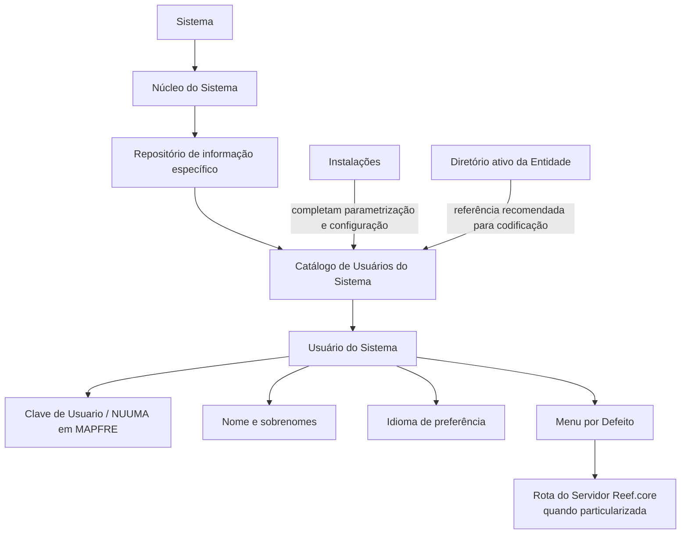

# Definição de Usuários do Sistema — Catálogo, Dados Identificativos e Parametrização no Reef.core

## 1. Metadados do Documento
- **Arquivo de Origem:** `Não identificado`
- **Tipo de Documento:** `Especificação Funcional`
- **Domínio / Sistema:** `Sistema / MAPFRE / Reef.core`
- **Público-Alvo:** `Desenvolvedores, Arquitetos, Operação e Negócio`
- **Data/Versão Identificada:** `Não identificada`

---

## 2. Resumo Executivo & Contexto de Negócio

O documento descreve a definição funcional do catálogo de Usuários do Sistema. O núcleo do Sistema permite identificar e codificar as relações dos Usuários do Sistema em um repositório de informação específico.

O repositório de Usuários do Sistema é entregue inicialmente às instalações com conteúdo mínimo. Cada instalação deve completar a parametrização e a configuração necessárias para o seu contexto operacional.

O catálogo de Usuários do Sistema contém atributos para identificação do usuário, nome e sobrenomes, idioma de preferência e menu padrão. A chave de usuário é denominada `NUUMA` no contexto MAPFRE.

O idioma configurado para cada Usuário do Sistema determina a língua usada para visualizar palavras, expressões ou textos. O atributo Menu por Defeito pode conter uma rota do servidor Reef.core quando essa rota estiver particularizada para o usuário.

O documento recomenda alinhar a codificação dos Usuários do Sistema à identificação utilizada no diretório ativo da Entidade, evitando divergências entre o catálogo corporativo e o diretório ativo.

---

## 3. Arquitetura, Componentes & Tecnologias Envolvidas

Os componentes e conceitos explicitamente citados são:

| Componente / Conceito | Papel descrito |
| :--- | :--- |
| Sistema | Possui núcleo funcional capaz de identificar e codificar relações de Usuários do Sistema. |
| Catálogo de Usuários do Sistema | Repositório/catálogo que contém atributos identificativos e de configuração dos usuários. |
| Repositório de informação específico | Local onde as relações de Usuários do Sistema são identificadas e codificadas. |
| Instalações | Recebem o repositório inicialmente com conteúdo mínimo e completam a parametrização e configuração. |
| Diretório ativo da Entidade | Referência recomendada para a codificação dos usuários no catálogo. |
| MAPFRE | Contexto no qual a chave de identificação do usuário é denominada `NUUMA`. |
| Reef.core | Servidor cuja rota pode ser particularizada no atributo Menu por Defeito. |
| Idiomas | Documento relacionado listado na seção de vínculos. |
| Perguntas frequentes | Documento relacionado listado na seção de vínculos. |



> **Nota de Análise:** O documento cita Reef.core apenas como servidor cuja rota pode ser associada ao atributo Menu por Defeito. Não detalha protocolos, URLs, portas, métodos HTTP, autenticação ou contratos de integração.

---

## 4. Regras de Negócio, Especificações Funcionais & Processos

### 4.1 Gestão do catálogo de Usuários do Sistema

1. O núcleo do Sistema possui a capacidade funcional de identificar relações de Usuários do Sistema.
2. O núcleo do Sistema possui a capacidade funcional de codificar relações de Usuários do Sistema.
3. As relações de Usuários do Sistema são mantidas em um repositório de informação específico.
4. O repositório é entregue inicialmente às instalações com conteúdo mínimo.
5. As instalações devem completar a parametrização do repositório.
6. As instalações devem completar a configuração do repositório.

### 4.2 Dados identificativos do Usuário do Sistema

1. A **Clave de Usuario** contém a chave de identificação do Usuário do Sistema.
2. No contexto MAPFRE, a chave de identificação do usuário é denominada `NUUMA`.
3. O **Nombre de Usuario** contém o nome e os sobrenomes do Usuário do Sistema.
4. O **Idioma** contém o código do idioma de preferência atribuído ao Usuário do Sistema.
5. O código de idioma permite ao Usuário do Sistema visualizar palavras, expressões ou textos na língua configurada.
6. O **Menú por Defecto** contém a rota do servidor Reef.core quando essa rota está particularizada para o Usuário do Sistema.

### 4.3 Recomendação de codificação

- É considerada uma boa prática codificar os usuários no Catálogo de Usuários do Sistema da mesma maneira pela qual os usuários são identificados no diretório ativo da Entidade.
- A recomendação visa manter consistência entre a identificação do catálogo e a identificação corporativa disponível no diretório ativo.

### 4.4 Vínculos documentais

- A leitura dos documentos funcionais relacionados é recomendada.
- O documento alerta que a interpretação isolada da presente documentação pode conduzir a erro.
- Os vínculos citados são: `Idiomas` e `Preguntas frecuentes`.

---

## 5. Tabelas de Parâmetros, Ambientes e Estruturas de Dados

| Item / Parâmetro | Descrição / Função | Tipo / Valores / Formato | Ambiente / Observações |
| :--- | :--- | :--- | :--- |
| Catálogo de Usuários do Sistema | Catálogo que reúne a identificação e a codificação das relações de Usuários do Sistema. | Repositório de informação específico. | Entregue inicialmente com conteúdo mínimo às instalações. |
| Clave de Usuario | Chave de identificação do Usuário do Sistema. | `NUUMA` no contexto MAPFRE. | Recomenda-se alinhamento com a identificação no diretório ativo da Entidade. |
| Nombre de Usuario | Nome e sobrenomes do Usuário do Sistema. | Texto. | Não há restrições de formato detalhadas. |
| Idioma | Código do idioma de preferência atribuído ao Usuário do Sistema. | Código de idioma. | Permite visualizar palavras, expressões ou textos na língua associada. |
| Menú por Defecto | Rota do servidor Reef.core para o Usuário do Sistema. | Rota de servidor. | Aplicável caso a rota esteja particularizada para o usuário. |
| Repositório de informação específico | Local de manutenção das relações de Usuários do Sistema. | Não detalhado. | Deve ser parametrizado e configurado pelas instalações. |
| Diretório ativo da Entidade | Referência corporativa para identificação dos usuários. | Não detalhado. | Usado como recomendação de boa prática de codificação. |
| Reef.core | Servidor citado no atributo Menu por Defeito. | Não detalhado. | Não foram informadas URLs, protocolos, portas ou ambientes. |
| Idiomas | Documento funcional relacionado. | Vínculo documental. | Leitura recomendada. |
| Preguntas frecuentes | Documento funcional relacionado. | Vínculo documental. | Leitura recomendada. |

---

## 6. Bateria de Perguntas & Respostas para RAG (FAQ Sintético)

### P1: Qual é a finalidade do Catálogo de Usuários do Sistema?
**R:** O Catálogo de Usuários do Sistema permite identificar e codificar as relações de Usuários do Sistema em um repositório de informação específico.

### P2: O que é entregue inicialmente às instalações?
**R:** O repositório de informação específico é entregue inicialmente às instalações com conteúdo mínimo, para que cada instalação complete a parametrização e a configuração necessárias.

### P3: O que significa NUUMA no documento?
**R:** `NUUMA` é a denominação usada em MAPFRE para a chave de identificação do Usuário do Sistema, armazenada no atributo Clave de Usuario.

### P4: Quais dados são mantidos no atributo Nombre de Usuario?
**R:** O atributo Nombre de Usuario contém o nome e os sobrenomes do Usuário do Sistema.

### P5: Como o atributo Idioma afeta a experiência do usuário?
**R:** O atributo Idioma contém o código do idioma de preferência atribuído ao Usuário do Sistema. Esse código permite visualizar palavras, expressões ou textos na língua configurada.

### P6: Quando o atributo Menú por Defecto possui uma rota do Reef.core?
**R:** O atributo Menú por Defecto contém a rota do servidor Reef.core quando essa rota foi particularizada para o Usuário do Sistema.

### P7: Qual é a recomendação para codificar usuários no catálogo?
**R:** O documento recomenda codificar os Usuários do Sistema da mesma forma pela qual eles são identificados no diretório ativo da Entidade.

### P8: O documento especifica métodos HTTP, contratos JSON ou URLs do Reef.core?
**R:** Não. O documento apenas informa que o atributo Menú por Defecto pode conter uma rota do servidor Reef.core quando particularizada para o usuário. Métodos HTTP, contratos JSON, URLs, portas e protocolos não são detalhados.

### P9: Por que a leitura dos documentos vinculados é recomendada?
**R:** A leitura dos documentos vinculados é recomendada para evitar que uma interpretação isolada do documento sobre Usuários do Sistema conduza a erro.

### P10: Quais documentos relacionados são citados?
**R:** Os documentos relacionados citados são `Idiomas` e `Preguntas frecuentes`.

---

## 7. Glossário de Termos, Siglas & Conceitos-Chave

- **Catálogo de Usuários do Sistema:** Catálogo que contém dados identificativos e configurações associadas aos Usuários do Sistema.
- **Clave de Usuario:** Atributo que contém a chave de identificação do Usuário do Sistema.
- **Diretório ativo da Entidade:** Referência de identificação corporativa que deve orientar, como boa prática, a codificação dos usuários no catálogo.
- **Idioma:** Atributo que contém o código do idioma de preferência do Usuário do Sistema.
- **MAPFRE:** Contexto organizacional no qual a chave de identificação do usuário é denominada `NUUMA`.
- **Menú por Defecto:** Atributo que pode conter a rota do servidor Reef.core particularizada para o Usuário do Sistema.
- **NUUMA:** Denominação da chave de identificação do Usuário do Sistema em MAPFRE.
- **Reef.core:** Servidor citado como destino de rota no atributo Menú por Defecto.
- **Repositório de informação específico:** Repositório onde as relações de Usuários do Sistema são identificadas e codificadas.

---

## 8. Notas Críticas, Riscos & Limitações

- O documento não informa o nome do arquivo de origem, data, versão, autor técnico ou escopo de aprovação.
- O documento não define o modelo físico ou lógico do repositório de Usuários do Sistema.
- O documento não descreve formatos, obrigatoriedade, unicidade, tamanho ou regras de validação para `NUUMA`, nome, sobrenomes, idioma ou rota do Menu por Defeito.
- O documento não detalha como as instalações devem executar a parametrização ou a configuração inicial.
- O documento não especifica integrações técnicas entre o Catálogo de Usuários do Sistema e o diretório ativo da Entidade.
- O documento apresenta o alinhamento com o diretório ativo como boa prática, não como uma regra técnica obrigatória explicitamente declarada.
- O documento cita Reef.core, mas não detalha URLs, ambientes, credenciais, protocolos, portas, APIs ou procedimentos de acesso.
- A interpretação isolada do documento pode conduzir a erro; a leitura dos vínculos `Idiomas` e `Preguntas frecuentes` é recomendada.

---

## 9. Conteúdo Bruto Estruturado (Referência Fiel)

```text
--- [PÁGINA 1 DE 1] ---

DEFINICIÓN de Usuarios del Sistema
Contexto
Funcionalmente, el núcleo del Sistema cuenta con la posibilidad de identicar y codicar la relación de Usuarios del Sistema en un
repositorio de información especíco, repositorio que se entrega inicialmente a las instalaciones con un mínimo contenido para que estas
completen su Parametrización y Conguración.
Datos Identicativos
Clave de Usuario
Este Atributo del catálogo de Usuarios del Sistema contiene la clave de identicación del Usuario, denominado 'NUUMA' en MAPFRE.
Nombre de Usuario
Este Atributo del catálogo de Usuarios del Sistema contiene el nombre y los apellidos del Usuario.
Idioma
Este Atributo del catálogo de Usuarios del Sistema contiene el código del idioma de preferencia asignado al Usuario, código que le permitirá
visualizar palabras, expresiones o textos en esta lengua.
Menú por Defecto
Este Atributo del catálogo de Usuarios del Sistema contiene la ruta del Servidor de Reef.core caso de estar particularizado para el Usuario.
Vínculos
Relación de Directrices y Documentos funcionales cuya lectura recomendada para evitar que la interpretación aislada del presente
documento pueda conducir a error.
Idiomas
Preguntas frecuentes
(1) ¿Existe alguna recomendación que pueda ser tomada en consideración en el uso y denición del Catálogo de Usuarios del Sistema?
Es una buena práctica codicar a los usuarios en este catálogo de la misma manera con la que se identica a los usuarios en el directorio
activo de la Entidad.
Documentation / DOCUMENTACIÓN Reef
DOCUMENTACIÓN Reef
Mapfredocument
DOCUMENTACIÓN Reef
Owner
user:agonzalez_mapfre.com
Lifecycle
Approved Source
 / 
 VL
Buscar Inicio Soluciones Arquitecturas APIs Componentes Cloud Documentación Zeus Reef Ayuda
ES
```
