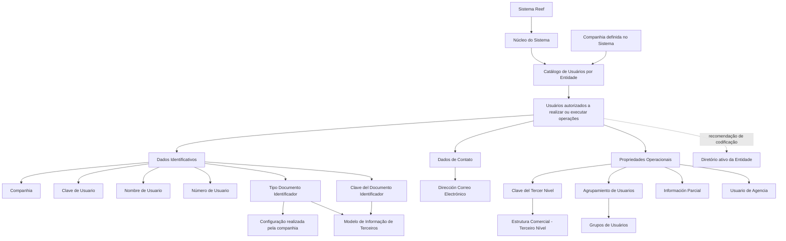

# Catálogo de Usuários por Entidade — Atribuição, Identificação, Contato e Propriedades Operacionais

## 1. Metadados do Documento
- **Arquivo de Origem:** Não identificado no conteúdo fornecido
- **Tipo de Documento:** Especificação Funcional
- **Domínio / Sistema:** Reef / MAPFRE — Catálogo de Usuários por Entidade
- **Público-Alvo:** Não identificado explicitamente; conteúdo direcionado à definição funcional de usuários por entidade
- **Data/Versão Identificada:** Não identificada
- **Owner identificado:** `user:agonzalez_mapfre.com`
- **Lifecycle identificado:** `Approved Source`

---

## 2. Resumo Executivo & Contexto de Negócio

O documento descreve o catálogo de **Usuários por Entidade** do sistema Reef. Funcionalmente, o núcleo do sistema permite associar cada companhia definida no sistema à relação de usuários autorizados a realizar ou executar operações.

A entidade MAPFRE é mencionada como possuidora de um repositório específico de informações. Esse repositório é entregue inicialmente às instalações sem conteúdo, devendo ser preenchido com as definições de usuários aplicáveis à entidade.

A especificação organiza os dados de usuários em três grupos: **Dados Identificativos**, **Dados de Contato** e **Propriedades Operacionais**. Os atributos abrangem associação à companhia, chaves de usuário, identificação documental, endereço corporativo de e-mail, vínculo à estrutura comercial e restrições de visualização de informações.

O documento também indica dependências funcionais para interpretação correta do catálogo: **Grupos de Usuários** e **Estrutura Comercial — Terceiro Nível**. Como prática recomendada, a codificação dos usuários no catálogo deve ser igual à utilizada no diretório ativo da entidade.

---

## 3. Arquitetura, Componentes & Tecnologias Envolvidas

### Componentes e conceitos identificados

| Componente / Conceito | Papel descrito no documento |
| :--- | :--- |
| Sistema Reef | Sistema no qual existe a funcionalidade de associar usuários às companhias definidas. |
| Núcleo do Sistema | Camada funcional que possibilita associar companhias e usuários autorizados a operar. |
| Catálogo de Usuários por Entidade | Repositório lógico que contém a relação de usuários associados a uma entidade/companhia. |
| MAPFRE | Entidade mencionada como possuidora de repositório específico de informação inicialmente vazio. |
| Companhia | Entidade cujo código é registrado durante a definição dos usuários. |
| Usuário | Pessoa cadastrada no catálogo, identificada por códigos, nome, identificação documental, e-mail e propriedades operacionais. |
| Modelo de Informação de Terceiros | Modelo de referência no qual usuários devem ser identificados de forma coerente com outras pessoas físicas ou jurídicas. |
| Tipos de Documentos Identificadores | Valores configurados pela companhia para identificar usuários. |
| Estrutura Comercial — Terceiro Nível | Estrutura à qual o usuário pode estar adscrito por meio da respectiva chave/código. |
| Agrupamento de Usuários | Código que permite à entidade classificar internamente o coletivo de usuários. |
| Diretório ativo da Entidade | Referência recomendada para a codificação dos usuários no catálogo. |



> **Nota de Análise:** O documento não detalha arquitetura técnica de implantação, APIs, métodos HTTP, contratos JSON, banco de dados, tecnologias de desenvolvimento, ambientes, servidores, URLs ou mecanismos de autenticação.

---

## 4. Regras de Negócio, Especificações Funcionais & Processos

### 4.1 Associação de usuários por companhia

1. O núcleo do Sistema Reef permite associar cada companhia definida no sistema a uma relação de usuários.
2. A relação de usuários associada à companhia determina os usuários que podem realizar ou executar operações.
3. A entidade MAPFRE possui um repositório específico de informações.
4. O repositório específico da entidade MAPFRE é entregue inicialmente às instalações vazio de conteúdo.

### 4.2 Identificação de usuários

1. O atributo **Compañía** contém o código da companhia para a qual está sendo definida a relação de usuários.
2. O atributo **Clave de Usuario** contém o código do usuário.
3. A propriedade **Nombre de Usuario** contém o nome e os sobrenomes do usuário.
4. O atributo **Número de Usuario** contém o código numérico único do usuário.
5. Por coerência com o Modelo de Informação de Terceiros e com as informações das demais pessoas físicas ou jurídicas, os usuários devem ser identificados no sistema por:
   - um tipo de documento identificador; e
   - uma chave associada.
6. O atributo **Tipo Documento Identificador** deve conter um dos valores possíveis de tipos de documentos identificadores, conforme a configuração realizada pela companhia.
7. O atributo **Clave del Documento Identificador** deve conter a chave única do tipo de documento identificador.

### 4.3 Dados de contato

1. O atributo **Dirección Correo Electrónico** contém o endereço de e-mail corporativo do usuário.

### 4.4 Propriedades operacionais

1. A **Clave del Tercer Nivel** contém o código do Terceiro Nível da Estrutura Comercial ao qual o usuário está adscrito.
2. O **Agrupamiento de Usuarios** contém o código do agrupamento ao qual o usuário pertence.
3. O código de agrupamento permite que a entidade classifique internamente o coletivo de usuários.
4. A propriedade **Información Parcial** define se o usuário pode visualizar:
   - informações com maior nível de detalhe; ou
   - somente dados agregados.
5. A visualização parcial em programas de consulta depende de duas condições:
   - o programa deve contemplar funcionalmente essa possibilidade; e
   - o parâmetro de configuração específico da entidade deve permitir essa possibilidade.
6. A propriedade **Usuario de Agencia** identifica se o usuário da entidade será identificado como:
   - empregado de agência; ou
   - empregado de agente.

### 4.5 Recomendação de cadastro

A documentação recomenda codificar os usuários no Catálogo de Usuários por Entidade da mesma forma como os usuários são identificados no diretório ativo da entidade.

### 4.6 Documentos funcionais relacionados

A interpretação isolada deste documento pode conduzir a erro. A leitura recomendada inclui:

1. **Grupos de Usuários**
2. **Estrutura Comercial — Terceiro Nível**

---

## 5. Tabelas de Parâmetros, Ambientes e Estruturas de Dados

| Item / Parâmetro | Descrição / Função | Tipo / Valores / Formato | Ambiente / Observações |
| :--- | :--- | :--- | :--- |
| Compañía | Contém o código da companhia sobre a qual é realizada a definição dos usuários. | Código da companhia. | Dados Identificativos. |
| Clave de Usuario | Contém o código do usuário. | Código do usuário. | Dados Identificativos. |
| Nombre de Usuario | Contém o nome e os sobrenomes do usuário. | Nome e sobrenomes. | Dados Identificativos. |
| Número de Usuario | Contém o código numérico único do usuário. | Código numérico único. | Dados Identificativos. |
| Tipo Documento Identificador | Identifica o tipo de documento do usuário. | Um dos tipos de documentos identificadores configurados pela companhia. | Dados Identificativos; aplicável no Modelo de Informação de Terceiros. |
| Clave del Documento Identificador | Contém a chave única relacionada ao tipo de documento identificador. | Chave única. | Dados Identificativos; aplicável no Modelo de Informação de Terceiros. |
| Dirección Correo Electrónico | Contém o endereço de e-mail corporativo do usuário. | Endereço de e-mail corporativo. | Dados de Contato. |
| Clave del Tercer Nivel | Contém o código do Terceiro Nível da Estrutura Comercial ao qual o usuário está adscrito. | Código de Terceiro Nível. | Propriedades Operacionais. |
| Agrupamiento de Usuarios | Contém o código do agrupamento ao qual o usuário pertence. | Código de agrupamento. | Permite classificação interna do coletivo de usuários pela entidade. |
| Información Parcial | Define o nível de detalhe que o usuário pode visualizar em programas de consulta. | Visualização detalhada ou consulta de dados agregados. | Depende da capacidade funcional do programa e da configuração específica da entidade. |
| Usuario de Agencia | Identifica a condição do usuário perante agência ou agente. | Empregado de Agência ou Empregado de Agente. | Propriedades Operacionais. |
| Repositório de MAPFRE | Repositório específico de informação da entidade MAPFRE. | Conteúdo não especificado. | Entregue inicialmente às instalações vazio de conteúdo. |
| Codificação de usuários | Recomendação para identificação dos usuários. | Deve seguir a mesma codificação do diretório ativo da entidade. | Boa prática documentada. |

> **Nota de Análise:** O conteúdo não informa tipos de dados técnicos, obrigatoriedade dos campos, tamanhos máximos, valores nulos, chaves de banco de dados, APIs, URLs ou ambientes de desenvolvimento/homologação/produção.

---

## 6. Bateria de Perguntas & Respostas para RAG (FAQ Sintético)

### P1: Qual é a finalidade do Catálogo de Usuários por Entidade no sistema Reef?
**R:** O Catálogo de Usuários por Entidade permite associar cada companhia definida no Sistema Reef à relação de usuários que podem realizar ou executar operações. A associação é tratada funcionalmente pelo núcleo do sistema.

### P2: Qual é a situação inicial do repositório de informações da entidade MAPFRE?
**R:** A entidade MAPFRE possui um repositório específico de informações que é entregue inicialmente às instalações vazio de conteúdo. O documento não especifica o processo técnico ou operacional de carga inicial desse repositório.

### P3: Quais grupos de informação estruturam os dados de um usuário por entidade?
**R:** Os dados são organizados em três grupos: Dados Identificativos, Dados de Contato e Propriedades Operacionais. Os Dados Identificativos incluem companhia, chaves e dados documentais; os Dados de Contato incluem o e-mail corporativo; e as Propriedades Operacionais incluem estrutura comercial, agrupamento, visibilidade parcial e condição de usuário de agência.

### P4: Como um usuário deve ser identificado no Modelo de Informação de Terceiros?
**R:** Por coerência com as informações das demais pessoas físicas ou jurídicas no Modelo de Informação de Terceiros, um usuário deve ser identificado por um tipo de documento identificador e uma chave associada. O tipo de documento deve ser um dos valores configurados pela companhia.

### P5: O que representa o campo “Número de Usuario”?
**R:** O campo “Número de Usuario” contém o código numérico único do usuário no Catálogo de Usuários da Entidade.

### P6: Como deve ser preenchido o tipo de documento identificador de um usuário?
**R:** O atributo “Tipo Documento Identificador” deve conter um dos possíveis valores de tipos de documentos identificadores, de acordo com a configuração realizada pela companhia. O documento não lista quais são esses valores possíveis.

### P7: Qual é a função da “Clave del Documento Identificador”?
**R:** A “Clave del Documento Identificador” contém a chave única do tipo de documento identificador usado para identificar o usuário no contexto do Modelo de Informação de Terceiros.

### P8: Em quais condições um usuário pode visualizar somente dados agregados?
**R:** A propriedade “Información Parcial” define se o usuário visualiza informações detalhadas ou somente dados agregados em programas de consulta. A consulta agregada somente é aplicável quando o programa contempla essa possibilidade funcionalmente e quando o parâmetro de configuração específico da entidade também permite essa condição.

### P9: Para que serve o agrupamento de usuários?
**R:** O campo “Agrupamiento de Usuarios” contém o código do agrupamento ao qual o usuário pertence. Esse código permite à entidade classificar internamente o coletivo de usuários.

### P10: O que é a “Clave del Tercer Nivel”?
**R:** A “Clave del Tercer Nivel” contém o código do Terceiro Nível da Estrutura Comercial ao qual o usuário está adscrito.

### P11: O que identifica a propriedade “Usuario de Agencia”?
**R:** A propriedade “Usuario de Agencia” identifica se o usuário da entidade está identificado como Empregado de Agência ou Empregado de Agente.

### P12: Qual prática é recomendada para definir códigos de usuários no catálogo?
**R:** É recomendada a codificação dos usuários no Catálogo de Usuários por Entidade da mesma forma utilizada para identificar os usuários no diretório ativo da entidade.

### P13: Quais documentos devem ser consultados para evitar interpretação isolada incorreta?
**R:** O documento recomenda a leitura dos materiais funcionais “Grupos de Usuários” e “Estrutura Comercial - Terceiro Nível”, pois a interpretação isolada da presente documentação pode conduzir a erro.

---

## 7. Glossário de Termos, Siglas & Conceitos-Chave

- **Reef:** Sistema citado como contexto da documentação de usuários por entidade.
- **MAPFRE:** Entidade mencionada como possuidora de um repositório específico de informações.
- **Catálogo de Usuários por Entidade:** Estrutura que associa uma companhia à relação de usuários capazes de realizar ou executar operações.
- **Compañía:** Companhia definida no sistema para a qual são cadastrados os usuários.
- **Clave de Usuario:** Código do usuário.
- **Número de Usuario:** Código numérico único do usuário.
- **Modelo de Informação de Terceiros:** Modelo no qual usuários devem ser identificados coerentemente com outras pessoas físicas ou jurídicas.
- **Tipo Documento Identificador:** Tipo de documento usado para identificar o usuário, selecionado entre valores configurados pela companhia.
- **Clave del Documento Identificador:** Chave única do tipo de documento identificador.
- **Tercer Nivel:** Terceiro Nível da Estrutura Comercial ao qual o usuário está adscrito.
- **Agrupamiento de Usuarios:** Agrupamento que permite classificar internamente o coletivo de usuários.
- **Información Parcial:** Propriedade que regula a visualização detalhada ou agregada de informações em programas de consulta.
- **Usuario de Agencia:** Propriedade que identifica um usuário como empregado de agência ou empregado de agente.
- **Diretório ativo da Entidade:** Referência de identificação cuja codificação é recomendada para o catálogo de usuários.

---

## 8. Notas Críticas, Riscos & Limitações

- A documentação alerta que sua interpretação isolada pode conduzir a erro e recomenda a leitura de **Grupos de Usuários** e **Estrutura Comercial — Terceiro Nível**.
- O documento não especifica métodos HTTP, APIs, contratos JSON, mecanismos de integração, modelo físico de dados, tabelas de banco, autenticação ou autorização técnica.
- O documento não informa os valores permitidos para tipos de documentos identificadores; apenas estabelece que eles dependem da configuração realizada pela companhia.
- A propriedade **Información Parcial** não garante isoladamente a visualização agregada: o programa de consulta deve suportar essa função e a configuração específica da entidade deve permiti-la.
- O repositório específico da entidade MAPFRE é informado como inicialmente vazio, mas não há detalhamento sobre governança, carga, responsáveis, validações ou processo de manutenção.
- Não são identificadas versões, datas, ambientes, servidores, URLs, portas ou tecnologias de implementação.
- O termo **Reef** é identificado como sistema/documentação, mas o conteúdo fornecido não expande a sigla nem descreve sua arquitetura técnica.

---

## 9. Conteúdo Bruto Estruturado (Referência Fiel)

```text
--- [PÁGINA 1 DE 2] ---

ASIGNACIÓN de Usuarios por Entidad
Contexto
Funcionalmente el núcleo del Sistema cuenta con la posibilidad de asociar a cada una de las compañías denidas en el Sistema, la relación
de Usuarios que van a poder realizar o ejecutar operaciones
la entidad MAPFRE en un repositorio de información especíco que se entrega inicialmente a las instalaciones vacío de contenido.
Datos Identicativos
Datos de Contacto
Propiedades Operativas
Datos Identicativos
Compañía
Este Atributo del catálogo de Usuarios por Entidad contiene el código de la compañía sobre la cual se está realizando la denición de los
Usuarios.
Clave de Usuario
Este Atributo del catálogo de Usuarios de la Entidad contiene el código del Usuario.
Nombre de Usuario
Esta Propiedad del catálogo de Usuarios de la Entidad contiene el nombre y los apellidos del Usuario.
Número de Usuario
Este Atributo del catálogo de Usuarios de la Entidad contiene el código numérico único del Usuario.
Tipo Documento Identicador
En el Modelo de Información de Terceros y por coherencia con la información del del resto de Personas Físicas o Jurídicas los Usuarios se
deben identicar en el sistema con un tipo de documento identicativo y una clave asociada.
Este atributo contendrá uno de los posibles valores de los Tipos de documentos Identicadores de acuerdo con la conguración realizada por
la compañía.
Clave del Documento Identicador
Documentation / DOCUMENTACIÓN Reef
DOCUMENTACIÓN Reef
Mapfredocument
DOCUMENTACIÓN Reef
Owner
user:agonzalez_mapfre.com
Lifecycle
Approved Source
 / 
 VL
Buscar Inicio Soluciones Arquitecturas APIs Componentes Cloud Documentación Zeus Reef Ayuda
ES


--- [PÁGINA 2 DE 2] ---

En el Modelo de Información de Terceros y por coherencia con la información del del resto de Personas Físicas o Jurídicas los Usuarios se
deben identicar en el sistema con un tipo de documento identicativo y una clave asociada.
Este atributo contendrá la clave única del Tipo de documento Identicador.
Datos de Contacto
Dirección Correo Electrónico
Este atributo contiene la dirección de correo electrónico corporativo del Usuario.
Propiedades Operativas
Clave del Tercer Nivel
Este atributo contiene el código del Tercer Nivel de la Estructura Comercial al que está adscrito el Usuario.
Agrupamiento de Usuarios
Este atributo contiene el código del Agrupamiento de Usuarios al que pertenece el Usuario, código que permite a la entidad clasicar
internamente al colectivo de Usuarios.
Información Parcial
Este atributo establece si el Usuario puede o no visualizar la información con mayor nivel de detalle o solamente puede consultar los datos
de manera agregada en aquellos programas que realizan Consultas sobre la información del sistema (siempre y cuando estos programas lo
contemplen funcionalmente además que el parámetro de conguración especíco de la entidad así lo permita).
Usuario de Agencia
Esta Propiedad identica si el Usuario de la Entidad va a estar identicado o no como un Empleado de Agencia o Empleado de Agente.
Vínculos
Relación de Directrices y Documentos funcionales cuya lectura recomendada para evitar que la interpretación aislada del presente
documento pueda conducir a error.
Grupos de Usuarios
Estructura Comercial - Tercer Nivel
Preguntas frecuentes
(1) ¿Existe alguna recomendación que pueda ser tomada en consideración en el uso y denición del Catálogo de Usuarios de la Entidad?
Es una buena práctica codicar a los usuarios en este catálogo de la misma manera con la que se identica a los usuarios en el directorio
activo de la Entidad.
```
