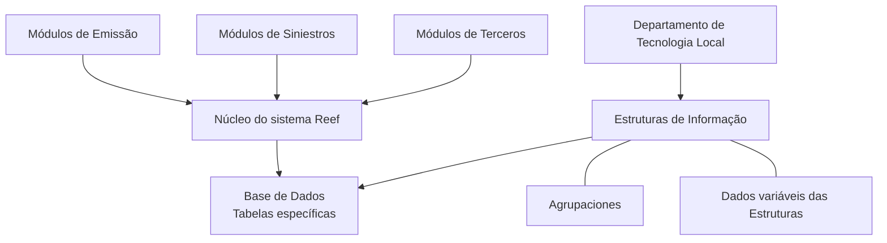

# Definição de Estruturas de Informação no Reef

## 1. Metadados do Documento
- **Arquivo de Origem:** Não identificado
- **Tipo de Documento:** Especificação Técnica
- **Domínio / Sistema:** Reef / Mapfre
- **Público-Alvo:** Departamento de Tecnologia Local, desenvolvedores e administradores de configuração
- **Data/Versão Identificada:** Não identificada

---

## 2. Resumo Executivo & Contexto de Negócio

O documento descreve o conceito de **Estruturas de Informação** no núcleo do sistema Reef. O mecanismo atende à necessidade de tratar informações heterogêneas presentes nos módulos de Emissão, Siniestros e Terceros.

Segundo o documento, o núcleo do sistema resolve a diversidade de informações permitindo a criação de tabelas específicas na Base de Dados. As Estruturas de Informação são o mecanismo usado para registrar, identificar e classificar essas informações.

A configuração adequada e correta das Estruturas de Informação é responsabilidade do Departamento de Tecnologia Local. O conteúdo também menciona Agrupaciones, associação entre estruturas e agrupamentos, e dados variáveis das estruturas.

O trecho extraído não detalha modelos de dados, campos, contratos de integração, procedimentos operacionais, permissões ou regras de validação para a criação e manutenção das tabelas específicas.

---

## 3. Arquitetura, Componentes & Tecnologias Envolvidas

| Componente / Termo | Papel identificado no documento |
| :--- | :--- |
| Reef | Sistema cujo núcleo permite a criação de tabelas específicas na Base de Dados. |
| Módulos de Emissão | Módulo citado como consumidor de informações heterogêneas. |
| Módulos de Siniestros | Módulo citado como consumidor de informações heterogêneas. |
| Módulos de Terceros | Módulo citado como consumidor de informações heterogêneas. |
| Base de Dados | Repositório no qual o núcleo do sistema permite criar tabelas específicas. |
| Estruturas de Informação | Elemento utilizado para registrar, identificar e classificar informações. |
| Agrupaciones | Conceito listado em conjunto com Estruturas de Informação. |
| Associação de Estruturas e Agrupamentos | Relação funcional explicitamente listada no documento. |
| Dados Variáveis das Estruturas | Elemento funcional explicitamente listado no documento. |
| Departamento de Tecnologia Local | Área responsável pela configuração adequada e correta das Estruturas de Informação. |



> **Nota de Análise:** O documento não detalha interfaces, tecnologias de implementação, métodos HTTP, contratos JSON, servidores, URLs, versões ou mecanismos técnicos de persistência.

---

## 4. Regras de Negócio, Especificações Funcionais & Processos

1. Os módulos de Emissão, Siniestros e Terceros precisam considerar uma variedade heterogênea de informações para o tratamento adequado de suas funcionalidades.
2. O núcleo do sistema permite a criação de tabelas específicas na Base de Dados para lidar com essa heterogeneidade de informações.
3. O registro, a identificação e a classificação das informações são realizados por meio das **Estruturas de Informação**.
4. A configuração adequada e correta das Estruturas de Informação é responsabilidade do **Departamento de Tecnologia Local**.
5. O documento lista as seguintes capacidades ou tópicos relacionados:
   - Agrupaciones;
   - Estruturas de Informação;
   - Associação de Estruturas e Agrupamentos;
   - Dados Variáveis das Estruturas.

> **Nota de Análise:** O conteúdo extraído não especifica critérios de criação, regras de associação, cardinalidades, campos, valores permitidos ou fluxo operacional para Agrupaciones, Estruturas de Informação e Dados Variáveis.

---

## 5. Tabelas de Parâmetros, Ambientes e Estruturas de Dados

| Item / Parâmetro | Descrição / Função | Tipo / Valores / Formato | Ambiente / Observações |
| :--- | :--- | :--- | :--- |
| Estruturas de Informação | Permitem o registro, a identificação e a classificação das informações tratadas pelo sistema. | Conceito funcional/configurável. | Configuração sob responsabilidade do Departamento de Tecnologia Local. |
| Tabelas específicas | Mecanismo permitido pelo núcleo do sistema para tratar informações heterogêneas. | Tabelas na Base de Dados. | Não há nomes de tabelas, campos ou tipos de dados. |
| Agrupaciones | Tópico funcional listado no documento. | Não detalhado. | Sem definição adicional no trecho extraído. |
| Associação de Estruturas e Agrupamentos | Relação entre Estruturas de Informação e Agrupaciones. | Não detalhado. | Sem cardinalidade ou regra de associação informada. |
| Dados Variáveis das Estruturas | Tópico relacionado às Estruturas de Informação. | Não detalhado. | Sem atributos ou regras de preenchimento informados. |
| Módulos de Emissão | Módulo que trata informações heterogêneas. | Módulo de sistema. | Detalhamento funcional não informado. |
| Módulos de Siniestros | Módulo que trata informações heterogêneas. | Módulo de sistema. | Detalhamento funcional não informado. |
| Módulos de Terceros | Módulo que trata informações heterogêneas. | Módulo de sistema. | Detalhamento funcional não informado. |
| Owner | Identificador apresentado na interface documental. | `user:agonzalez_mapfre.com` | A semântica do identificador não é detalhada. |
| Lifecycle | Estado apresentado na interface documental. | `Approved Source` | Não há processo de aprovação descrito. |
| Localização documental | Caminho apresentado na interface documental. | `/ VL` | Significado de `VL` não detalhado. |

---

## 6. Bateria de Perguntas & Respostas para RAG (FAQ Sintético)

### P1: Qual problema as Estruturas de Informação resolvem no sistema Reef?
**R:** As Estruturas de Informação permitem registrar, identificar e classificar informações heterogêneas que precisam ser consideradas para o tratamento adequado das funcionalidades dos módulos de Emissão, Siniestros e Terceros.

### P2: Quais módulos são citados como consumidores de informações heterogêneas?
**R:** O documento cita os módulos de Emissão, Siniestros e Terceros como módulos nos quais a variedade de informações deve ser considerada para o tratamento adequado das funcionalidades.

### P3: Como o núcleo do sistema trata a heterogeneidade de informações?
**R:** O núcleo do sistema trata a heterogeneidade permitindo a criação de tabelas específicas na Base de Dados.

### P4: Quem é responsável pela configuração das Estruturas de Informação?
**R:** A responsabilidade pela configuração adequada e correta das Estruturas de Informação é atribuída ao Departamento de Tecnologia Local.

### P5: O documento define os campos ou o esquema das tabelas específicas?
**R:** Não. O documento afirma que o núcleo permite criar tabelas específicas na Base de Dados, mas não informa nomes de tabelas, campos, tipos de dados, chaves ou relacionamentos.

### P6: O que são Agrupaciones no contexto apresentado?
**R:** Agrupaciones é um tópico listado pelo documento em conjunto com Estruturas de Informação. O trecho extraído não apresenta uma definição, regras de uso ou estrutura de dados para Agrupaciones.

### P7: Como funciona a associação entre Estruturas de Informação e Agrupaciones?
**R:** O documento menciona a “Asociación de Estructuras y Agrupaciones”, porém não descreve cardinalidades, critérios de associação, fluxo de configuração ou validações aplicáveis.

### P8: Existem regras detalhadas para Dados Variáveis das Estruturas?
**R:** Não. O documento lista “Datos Variables de las Estructuras”, mas não detalha atributos, formatos, obrigatoriedades, valores aceitos ou regras de negócio.

### P9: O documento informa APIs, métodos HTTP ou contratos de integração das Estruturas de Informação?
**R:** Não. O conteúdo disponível não informa APIs, métodos HTTP, endpoints, contratos JSON, eventos, filas ou outros mecanismos de integração.

### P10: Há ambientes, URLs, portas ou servidores identificados no documento?
**R:** Não há URLs, portas, endereços de servidores ou descrição de ambientes técnicos. O trecho mostra apenas a interface de documentação com o caminho `/ VL`.

---

## 7. Glossário de Termos, Siglas & Conceitos-Chave

- **Reef:** Nome do sistema ou domínio documental citado em “DOCUMENTACIÓN Reef”.
- **Estruturas de Informação:** Mecanismo para registrar, identificar e classificar informações no contexto dos módulos citados.
- **Agrupaciones:** Termo listado como tópico relacionado às Estruturas de Informação; sem definição adicional no conteúdo.
- **Emissão:** Módulo citado como um dos contextos que devem tratar informações heterogêneas.
- **Siniestros:** Módulo citado como um dos contextos que devem tratar informações heterogêneas.
- **Terceros:** Módulo citado como um dos contextos que devem tratar informações heterogêneas.
- **Departamento de Tecnologia Local:** Área responsável pela configuração adequada e correta das Estruturas de Informação.
- **Base de Dados:** Repositório no qual o núcleo do sistema permite a criação de tabelas específicas.
- **Lifecycle:** Campo da interface documental apresentado com o valor `Approved Source`.
- **Owner:** Campo da interface documental apresentado com o valor `user:agonzalez_mapfre.com`.

---

## 8. Notas Críticas, Riscos & Limitações

- A configuração das Estruturas de Informação depende do Departamento de Tecnologia Local, criando uma dependência operacional explícita dessa área.
- O documento não informa governança, autorização, controle de mudanças, auditoria ou processo de aprovação para alterações nas Estruturas de Informação.
- Não há especificação de tabelas, campos, tipos, relacionamentos, índices, regras de integridade ou procedimentos de migração de Base de Dados.
- Não há detalhamento sobre as regras de associação entre Estruturas de Informação e Agrupaciones.
- Não há detalhamento sobre Dados Variáveis das Estruturas.
- Não há informações sobre integração, APIs, URLs, ambientes, servidores, logs, monitoramento ou tratamento de erros.
- O trecho parece ser uma visão introdutória ou índice de tópicos; tópicos listados sem detalhamento não devem ser interpretados como requisitos técnicos completos.

---

## 9. Conteúdo Bruto Estruturado (Referência Fiel)

```text
--- [PÁGINA 1 DE 1] ---

DEFINICIÓN de ESTRUCTURAS de INFORMACIÓN
Contexto
En los Módulos de Emisión, Siniestros o Terceros la variedad de información que se ha de considerar para el adecuado tratamiento de sus
funcionalidades es tan heterogénea que el núcleo del sistema lo ha solventado permitiendo la creación de tablas especícas en la Base de
Datos.
Su registro, identicación y clasicación se realiza en lo que denominamos 'Estructuras de Información' siendo responsabilidad del
Departamento de Tecnología Local su adecuada y correcta conguración.
Agrupaciones y Estructuras de Información
Agrupaciones
Estructuras de Información
Asociación de Estructuras y Agrupaciones
Datos Variables de las de Estructuras
Documentation / DOCUMENTACIÓN Reef
DOCUMENTACIÓN Reef
Mapfredocument
DOCUMENTACIÓN Reef
Owner
user:agonzalez_mapfre.com
Lifecycle
Approved Source
 / 
 VL
Buscar Inicio Soluciones Arquitecturas APIs Componentes Cloud Documentación Zeus Reef Ayuda
ES
```
