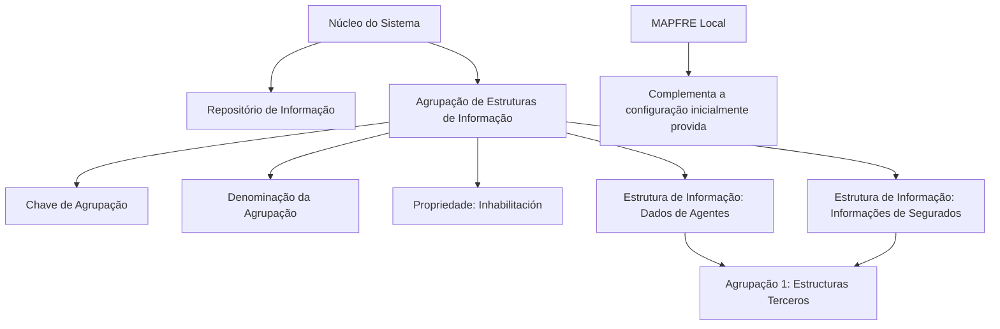

# Definição das Agrupações de Estruturas de Informação — Catálogo Reef

## 1. Metadados do Documento
- **Arquivo de Origem:** Não identificado no conteúdo fornecido
- **Tipo de Documento:** Especificação Técnica / Documentação Funcional
- **Domínio / Sistema:** Reef / Mapfre
- **Público-Alvo:** Desenvolvedores, Arquitetos, Analistas Funcionais e Operação
- **Data/Versão Identificada:** Não identificada

---

## 2. Resumo Executivo & Contexto de Negócio

O documento descreve o catálogo de **Agrupações de Estruturas de Informação** do núcleo do Sistema Reef. A finalidade do catálogo é identificar e agrupar estruturas de informação com natureza igual ou semelhante em um repositório específico disponibilizado às instalações com conteúdo inicial determinado.

Cada Agrupação possui uma **chave de agrupamento** e uma **denominação**, permitindo classificar diversas Estruturas de Informação existentes ou definidas no Sistema. O documento apresenta códigos inicialmente fornecidos para áreas funcionais como terceiros, sinistros, expedientes, emissões, tarefas, liquidação e serviços de fornecedores.

O exemplo funcional apresentado associa duas Estruturas de Informação — uma contendo dados de Agentes e outra contendo informações de Segurados — à Agrupação de código `1`, denominada **Estructuras Terceros**. A Agrupação atua, portanto, como mecanismo de relacionamento e classificação entre estruturas de informação do mesmo domínio.

O catálogo inclui a propriedade de **Inhabilitación**, que controla se uma chave de Agrupação pode ser utilizada em operações de definição e/ou modificação de Estruturas de Informação. O documento também determina que a configuração inicial fornecida deve ser respeitada, embora possa ser complementada conforme necessidades específicas de cada entidade MAPFRE Local.

---

## 3. Arquitetura, Componentes & Tecnologias Envolvidas

O documento cita os seguintes elementos funcionais:

- **Sistema / núcleo do Sistema:** componente funcional que identifica, agrupa e administra Estruturas de Informação.
- **Repositório de informação:** repositório específico que contém as estruturas disponibilizadas às instalações.
- **Agrupação:** entidade classificadora identificada por chave e denominação.
- **Estruturas de Informação:** estruturas de dados associadas a uma Agrupação.
- **MAPFRE Local:** entidade que pode complementar a configuração inicialmente provida.
- **Reef:** contexto documental e de sistema indicado pela seção “DOCUMENTACIÓN Reef”.

> **Nota de Análise:** O conteúdo não detalha tecnologias de implementação, bancos de dados, APIs, métodos HTTP, contratos JSON, ambientes de execução ou integrações técnicas.



---

## 4. Regras de Negócio, Especificações Funcionais & Processos

1. O núcleo do Sistema deve possibilitar a identificação e o agrupamento de Estruturas de Informação de natureza igual ou semelhante.
2. As Estruturas de Informação devem ser agrupadas em um repositório de informação específico.
3. O repositório de informação é entregue às instalações com determinado conteúdo inicial.
4. Cada Agrupação possui uma **Chave de Agrupação**.
5. A Chave de Agrupação deve estar associada a todas as possíveis Estruturas de Informação existentes ou definidas no Sistema.
6. Cada Agrupação possui uma **Denominação da Agrupação**, usada como denominação ou descrição da chave de Agrupação definida.
7. O Sistema disponibiliza inicialmente códigos de Agrupação predefinidos.
8. É possível configurar diferentes Estruturas de Informação sob uma mesma Agrupação quando essas estruturas pertencem ao mesmo contexto de classificação.
9. O exemplo apresentado estabelece que dados de Agentes e informações de Segurados podem pertencer à Agrupação `1 - Estructuras Terceros`.
10. A propriedade **Inhabilitación** indica se a chave de Agrupação está inabilitada para uso nas operações de definição e/ou modificação das Estruturas de Informação.
11. A configuração inicialmente provida deve ser respeitada.
12. A configuração inicialmente provida pode ser complementada conforme necessidades específicas da entidade MAPFRE Local.
13. A leitura de diretrizes e documentos vinculados é recomendada para evitar interpretações isoladas e incorretas do documento.

---

## 5. Tabelas de Parâmetros, Ambientes e Estruturas de Dados

| Item / Parâmetro | Descrição / Função | Tipo / Valores / Formato | Ambiente / Observações |
| :--- | :--- | :--- | :--- |
| Chave de Agrupação | Identifica a Agrupação associada às Estruturas de Informação existentes ou definidas no Sistema. | Código numérico | Associada às Estruturas de Informação. |
| Denominação da Agrupação | Descreve a chave de Agrupação definida. | Texto | Representa a descrição funcional da Agrupação. |
| Inhabilitación | Indica se uma chave de Agrupação está inabilitada para uso. | Propriedade de controle; valores não detalhados | Afeta operações de definição e/ou modificação de Estruturas de Informação. |
| Estrutura de Informação | Estrutura de dados classificada por uma Agrupação. | Não detalhado | Pode representar, por exemplo, dados de Agentes ou informações de Segurados. |
| Configuração inicialmente provida | Configuração de catálogo entregue inicialmente às instalações. | Lista de códigos e denominações | Deve ser respeitada; pode ser complementada pela MAPFRE Local. |

| Código de Agrupação | Denominação original | Domínio funcional indicado |
| :--- | :--- | :--- |
| 1 | Estructuras Terceros | Terceiros |
| 2 | Estructuras Datos Fijos Siniestro | Dados fixos de sinistro |
| 3 | Estructuras Datos Fijos del Expediente | Dados fixos do expediente |
| 4 | Estructuras Complementarias Expediente | Estruturas complementares do expediente |
| 5 | Estructuras de Trámites | Trâmites |
| 6 | Estructuras de Salvamentos | Salvamentos |
| 7 | Estructuras de Peritaciones | Peritagens |
| 8 | Estructuras de Emisión | Emissão |
| 9 | Estructuras de Emisión (Anexos) | Emissão — anexos |
| 10 | Estructuras de Tareas | Tarefas |
| 22 | Estructuras Antes de las Consecuencias | Estruturas antes das consequências |
| 23 | Estructuras de Liquidación de Expedientes | Liquidação de expedientes |
| 30 | Estructuras Complementarias Servicios Proveedores | Estruturas complementares de serviços de fornecedores |

---

## 6. Bateria de Perguntas & Respostas para RAG (FAQ Sintético)

### P1: Qual é a finalidade das Agrupações de Estruturas de Informação no Sistema?
**R:** As Agrupações de Estruturas de Informação permitem que o núcleo do Sistema identifique e classifique Estruturas de Informação de natureza igual ou semelhante dentro de um repositório de informação específico.

### P2: O que representa a Chave de Agrupação?
**R:** A Chave de Agrupação é a propriedade que identifica uma Agrupação e que fica associada a todas as possíveis Estruturas de Informação existentes ou definidas no Sistema.

### P3: Qual é a função da Denominação da Agrupação?
**R:** A Denominação da Agrupação indica o nome, a denominação ou a descrição da Chave de Agrupação que está sendo definida.

### P4: Quais Estruturas de Informação podem ser associadas à Agrupação 1?
**R:** O exemplo do documento indica que uma Estrutura de Informação contendo dados particulares de Agentes e outra contendo informações específicas de Segurados podem ser associadas à Agrupação `1 - Estructuras Terceros`.

### P5: O que significa a propriedade Inhabilitación?
**R:** Inhabilitación indica ao Sistema se uma Chave de Agrupação está inabilitada para ser utilizada nas operações de definição e/ou modificação das Estruturas de Informação.

### P6: A configuração inicial do catálogo pode ser modificada?
**R:** O documento determina que a configuração inicialmente provida deve ser respeitada. Contudo, essa configuração pode ser complementada de acordo com necessidades específicas da entidade MAPFRE Local.

### P7: Qual código corresponde às Estruturas de Liquidação de Expedientes?
**R:** O código `23` corresponde à denominação `Estructuras de Liquidación de Expedientes`.

### P8: Qual código corresponde às Estruturas de Emissão e aos respectivos anexos?
**R:** O código `8` corresponde a `Estructuras de Emisión`, enquanto o código `9` corresponde a `Estructuras de Emisión (Anexos)`.

### P9: Existe detalhamento sobre APIs ou contratos de integração das Estruturas de Informação?
**R:** Não. O documento descreve o catálogo funcional de Agrupações e suas propriedades, mas não especifica APIs, métodos HTTP, formatos JSON, tecnologias de implementação ou contratos de integração.

### P10: Por que o documento recomenda a leitura de diretrizes e documentos vinculados?
**R:** A leitura é recomendada porque a interpretação isolada do documento pode conduzir a erro. Os vínculos relacionam diretrizes e documentos complementares relevantes.

---

## 7. Glossário de Termos, Siglas & Conceitos-Chave

- **Agrupação:** classificação que relaciona Estruturas de Informação de natureza igual ou semelhante.
- **Chave de Agrupação:** código identificador da Agrupação.
- **Denominação da Agrupação:** descrição textual associada à Chave de Agrupação.
- **Estrutura de Informação:** estrutura existente ou definida no Sistema e associada a uma Agrupação.
- **Expediente:** termo funcional presente nas denominações de agrupações; o documento não apresenta definição adicional.
- **Inhabilitación:** propriedade que informa se uma Chave de Agrupação está inabilitada para operações de definição e/ou modificação.
- **MAPFRE Local:** entidade MAPFRE cuja necessidade específica pode justificar complementos à configuração inicialmente fornecida.
- **Reef:** nome indicado no contexto da documentação; o documento não expande o significado da denominação.
- **Siniestro:** termo presente em “Estructuras Datos Fijos Siniestro”; o documento não apresenta definição adicional.
- **Peritaciones:** termo presente em “Estructuras de Peritaciones”; o documento não apresenta definição adicional.

---

## 8. Notas Críticas, Riscos & Limitações

- O documento não identifica arquivo de origem, versão, data de publicação ou autores técnicos.
- Não há detalhamento de tecnologias, componentes de infraestrutura, banco de dados, APIs, autenticação, autorização ou ambientes.
- Os valores permitidos para a propriedade **Inhabilitación** não são especificados.
- O documento não define o processo operacional para criação, alteração, exclusão ou governança das Agrupações.
- A configuração inicial deve ser respeitada; alterações ou complementos devem considerar necessidades específicas da MAPFRE Local.
- A interpretação isolada do documento pode levar a erros; o próprio texto recomenda consultar diretrizes e documentos vinculados.
- Os caracteres `` presentes no conteúdo bruto indicam imperfeições de extração textual e foram preservados na referência fiel.

---

## 9. Conteúdo Bruto Estruturado (Referência Fiel)

```text
--- [PÁGINA 1 DE 2] ---

DEFINICIÓN de las Agrupaciones de Estructuras de Información
Funcionalmente, el núcleo del Sistema cuenta con la posibilidad de identicar y agrupar estructuras de información de igual o similar
naturaleza en un repositorio de información especíco que se entrega a las instalaciones con determinado contenido inicial.
Clave de Agrupación
Esta propiedad indica la clave de la Agrupación que tendrá asociada todas y cada una de las posibles Estructuras de Información existentes
o denidas en el Sistema.
Denominación de la Agrupación
Este Atributo indica cual es la denominación o descripción de la clave de Agrupación que se está deniendo.
Los códigos inicialmente provistos son:
AGRUPACIÓN DENOMINACIÓN
1 Estructuras Terceros
2 Estructuras Datos Fijos Siniestro
3 Estructuras Datos Fijos del Expediente
4 Estructuras Complementarias Expediente
5 Estructuras de Trámites
6 Estructuras de Salvamentos
7 Estructuras de Peritaciones
8 Estructuras de Emisión
9 Estructuras de Emisión (Anexos)
10 Estructuras de Tareas
22 Estructuras Antes de las Consecuencias
Documentation / DOCUMENTACIÓN Reef
DOCUMENTACIÓN Reef
Mapfredocument
DOCUMENTACIÓN Reef
Owner
user:agonzalez_mapfre.com
Lifecycle
Approved Source
 / 
 VL
Buscar Inicio Soluciones Arquitecturas APIs Componentes Cloud Documentación Zeus Reef Ayuda
ES


--- [PÁGINA 2 DE 2] ---

AGRUPACIÓN DENOMINACIÓN
23 Estructuras de Liquidación de Expedientes
30 Estructuras Complementarias Servicios Proveedores
A modo de ejemplo en el Sistema se podrían congurar dos diferentes Estructuras de Información, una para contener los datos particulares
de los Agentes y otra para contener la información especíca de los Asegurados, estando ambas Estructuras de Información asociadas a una
Agrupación de código 1 - 'Estructuras Terceros' que las relaciona y clasica.
Otras Propiedades
Inhabilitación
Esta propiedad le indica al Sistema si la clave de Agrupación está inhabilitada para poder ser utilizada en las operaciones de Denición y/o
modicación de las estructuras de información.
Vínculos
Relación de Directrices y Documentos cuya lectura está recomendada para evitar que la interpretación aislada del presente documento pueda
conducir a error.
Estructuras de Información
Preguntas frecuentes
(1) ¿Existe alguna circunstancia operativa que deba ser tomada en consideración sobre este catálogo?
Se debe respetar la conguración inicialmente provista, si bien es posible complementarla de acuerdo con las necesidades especícas de la
entidad MAPFRE Local.
```
