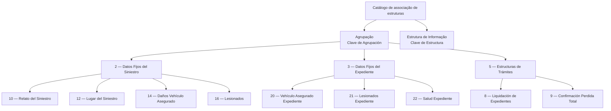

# Catálogo de Associação de Estruturas de Informação às Agrupações — DOCUMENTACIÓN Reef

## 1. Metadados do Documento
- **Arquivo de Origem:** `Não identificado no conteúdo fornecido`
- **Tipo de Documento:** `Especificação Técnica`
- **Domínio / Sistema:** `Reef / Mapfredocument / MAPFRE Local`
- **Público-Alvo:** `Desenvolvedores, Arquitetos, Analistas Funcionais e Operação`
- **Data/Versão Identificada:** `Não identificada`
- **Owner identificado:** `user:agonzalez_mapfre.com`
- **Lifecycle identificado:** `Approved Source`

---

## 2. Resumo Executivo & Contexto de Negócio

O documento descreve o catálogo de **associação de estruturas de informação às agrupações** no contexto da DOCUMENTACIÓN Reef. O catálogo define quais estruturas de informação podem ser relacionadas a cada agrupação funcional, permitindo organizar as informações disponíveis conforme o ponto do processo em que serão consultadas ou utilizadas.

O exemplo apresentado indica que uma agrupação de informações solicitáveis em um sinistro pode reunir todas as estruturas que podem ser chamadas nesse contexto. De modo equivalente, a agrupação de trâmites concentra as estruturas que podem ser chamadas a partir do plano de tramitação.

A associação é formada por duas propriedades principais: a **Clave de Agrupación**, que identifica a agrupação destinatária, e a **Clave de Estructura**, que identifica a estrutura de informação associada. O catálogo apresentado relaciona agrupações de dados fixos de sinistro, dados fixos de expediente e estruturas de trâmites a estruturas específicas.

A única orientação operacional explícita determina que a configuração inicialmente fornecida deve ser respeitada. O documento permite complementar essa configuração quando houver necessidades específicas de uma entidade **MAPFRE Local**.

---

## 3. Arquitetura, Componentes & Tecnologias Envolvidas

### Componentes e entidades identificadas

| Componente / Entidade | Papel identificado no documento |
| :--- | :--- |
| DOCUMENTACIÓN Reef | Área documental na qual o catálogo está publicado. |
| Reef | Contexto do catálogo e da documentação. |
| Mapfredocument | Sistema ou área identificada na navegação documental. O documento não detalha sua função técnica. |
| Catálogo de associação | Define as estruturas de informação associadas às agrupações. |
| Agrupación de Estructuras | Referência associada à propriedade `Clave de Agrupación`. |
| Estruturas de Informação | Estruturas associadas às agrupações mediante `Clave de Estructura`. |
| Plano de tramitação | Contexto a partir do qual estruturas de trâmites podem ser chamadas. |
| MAPFRE Local | Entidade que pode complementar a configuração inicial conforme necessidades específicas. |



> **Nota de Análise:** O documento não descreve tecnologias de implementação, APIs, protocolos, métodos HTTP, contratos JSON, servidores, ambientes ou mecanismos de persistência para o catálogo.

---

## 4. Regras de Negócio, Especificações Funcionais & Processos

### Finalidade do catálogo

1. O catálogo define as diferentes estruturas de informação que serão associadas às distintas agrupações.
2. Uma agrupação pode representar informações que podem ser solicitadas em um sinistro.
3. Para uma agrupação de informações de sinistro, devem ser associadas todas as estruturas que podem ser chamadas naquele ponto.
4. Para uma agrupação de trâmites, devem ser associadas as estruturas que podem ser chamadas a partir do plano de tramitação.

### Propriedades gerais

1. **Clave de Agrupación**
   - Indica a chave da agrupação à qual as estruturas de informação serão associadas.
   - Está relacionada ao conceito de **Agrupaciones de Estructuras**.

2. **Clave de Estructura**
   - Indica a chave da estrutura de informação que está sendo associada à agrupação.

### Regra operacional de configuração

1. A configuração inicialmente fornecida deve ser respeitada.
2. A configuração pode ser complementada segundo as necessidades específicas da entidade **MAPFRE Local**.
3. O documento não detalha processo de aprovação, responsáveis pela alteração, validações técnicas, limites de complementação ou procedimento de reversão de configurações.

---

## 5. Tabelas de Parâmetros, Ambientes e Estruturas de Dados

### Propriedades do catálogo

| Item / Parâmetro | Descrição / Função | Tipo / Valores / Formato | Ambiente / Observações |
| :--- | :--- | :--- | :--- |
| Clave de Agrupación | Indica a chave da agrupação à qual serão associadas estruturas de informação. | Chave de agrupação; formato não detalhado. | Relacionada a Agrupaciones de Estructuras. |
| Clave de Estructura | Indica a chave da estrutura de informação associada à agrupação. | Chave de estrutura; formato não detalhado. | Relacionada a Estruturas de Informação. |

### Mapeamento de agrupações e estruturas

| Agrupação — Código | Agrupação — Nome | Estrutura — Código | Estrutura — Nome | Ambiente / Observações |
| :--- | :--- | :--- | :--- | :--- |
| 2 | Datos Fijos del Siniestro | 10 | Relato del Siniestro | Estrutura associada à agrupação de dados fixos do sinistro. |
| 2 | Datos Fijos del Siniestro | 12 | Lugar del Siniestro | Estrutura associada à agrupação de dados fixos do sinistro. |
| 2 | Datos Fijos del Siniestro | 14 | Daños Vehículo Asegurado | Estrutura associada à agrupação de dados fixos do sinistro. |
| 2 | Datos Fijos del Siniestro | 16 | Lesionados | Estrutura associada à agrupação de dados fixos do sinistro. |
| 3 | Datos Fijos del Expediente | 20 | Vehículo Asegurado Expediente | Estrutura associada à agrupação de dados fixos do expediente. |
| 3 | Datos Fijos del Expediente | 21 | Lesionados Expediente | Estrutura associada à agrupação de dados fixos do expediente. |
| 3 | Datos Fijos del Expediente | 22 | Salud Expediente | Estrutura associada à agrupação de dados fixos do expediente. |
| 5 | Estructuras de Trámites | 8 | Liquidación de Expedientes | Estrutura que pode ser chamada a partir do plano de tramitação. |
| 5 | Estructuras de Trámites | 9 | Confirmación Perdida Total | Estrutura que pode ser chamada a partir do plano de tramitação. |

### Identificadores documentais

| Item / Parâmetro | Descrição / Função | Tipo / Valores / Formato | Ambiente / Observações |
| :--- | :--- | :--- | :--- |
| Área documental | Área em que o conteúdo aparece publicado. | DOCUMENTACIÓN Reef | O texto também apresenta `Documentation / DOCUMENTACIÓN Reef`. |
| Sistema / contexto | Referência exibida na navegação documental. | Mapfredocument | Não há detalhamento funcional adicional. |
| Owner | Proprietário identificado no documento. | `user:agonzalez_mapfre.com` | Valor literal apresentado no conteúdo. |
| Lifecycle | Estado de ciclo de vida exibido. | `Approved Source` | Não há definição do significado operacional desse estado. |
| Entidade local | Entidade que pode complementar a configuração inicial. | MAPFRE Local | A configuração inicial deve ser respeitada. |

---

## 6. Bateria de Perguntas & Respostas para RAG (FAQ Sintético)

### P1: Qual é a finalidade do catálogo de associação de estruturas de informação às agrupações?
**R:** O catálogo define quais estruturas de informação devem ser associadas às diferentes agrupações. A finalidade é organizar as estruturas que podem ser chamadas em cada contexto funcional, como informações de sinistro, dados de expediente e trâmites.

### P2: O que representa a propriedade Clave de Agrupación?
**R:** A propriedade **Clave de Agrupación** indica a chave da agrupação à qual as estruturas de informação serão associadas. O documento relaciona essa propriedade ao conceito de Agrupaciones de Estructuras.

### P3: O que representa a propriedade Clave de Estructura?
**R:** A propriedade **Clave de Estructura** indica a chave da estrutura de informação que está sendo associada a uma agrupação.

### P4: Quais estruturas pertencem à agrupação 2, Datos Fijos del Siniestro?
**R:** A agrupação 2, **Datos Fijos del Siniestro**, possui as seguintes estruturas associadas: 10 — Relato del Siniestro; 12 — Lugar del Siniestro; 14 — Daños Vehículo Asegurado; e 16 — Lesionados.

### P5: Quais estruturas pertencem à agrupação 3, Datos Fijos del Expediente?
**R:** A agrupação 3, **Datos Fijos del Expediente**, possui as estruturas 20 — Vehículo Asegurado Expediente; 21 — Lesionados Expediente; e 22 — Salud Expediente.

### P6: Quais estruturas pertencem à agrupação 5, Estructuras de Trámites?
**R:** A agrupação 5, **Estructuras de Trámites**, possui as estruturas 8 — Liquidación de Expedientes e 9 — Confirmación Perdida Total. O documento informa que estruturas da agrupação de trâmites podem ser chamadas a partir do plano de tramitação.

### P7: É permitido alterar a configuração inicial do catálogo?
**R:** O documento determina que a configuração inicialmente provida deve ser respeitada. Contudo, essa configuração pode ser complementada de acordo com as necessidades específicas da entidade MAPFRE Local.

### P8: O documento define como complementar a configuração para uma MAPFRE Local?
**R:** Não. O documento apenas informa que a configuração pode ser complementada conforme as necessidades específicas da entidade MAPFRE Local. Não são descritos responsáveis, fluxo de aprovação, formato de alteração ou critérios técnicos de validação.

### P9: O catálogo descreve APIs, métodos HTTP ou contratos JSON para consultar as estruturas?
**R:** Não. O conteúdo fornecido não detalha APIs, métodos HTTP, contratos JSON, endpoints, protocolos ou integrações técnicas para consulta ou manutenção do catálogo.

### P10: Qual é o estado de ciclo de vida identificado para o documento?
**R:** O conteúdo identifica o campo **Lifecycle** com o valor **Approved Source**. O documento não explica o significado operacional ou governança associada a esse estado.

### P11: Quem é o owner identificado no conteúdo?
**R:** O owner identificado literalmente no documento é `user:agonzalez_mapfre.com`.

### P12: O que são as estruturas de trâmites no contexto apresentado?
**R:** As estruturas de trâmites correspondem à agrupação 5, **Estructuras de Trámites**. O documento informa que essa agrupação reúne estruturas que podem ser chamadas desde o plano de tramitação, incluindo Liquidación de Expedientes e Confirmación Perdida Total.

---

## 7. Glossário de Termos, Siglas & Conceitos-Chave

- **Agrupación:** Agrupamento ao qual estruturas de informação são associadas.
- **Agrupaciones de Estructuras:** Referência relacionada à propriedade Clave de Agrupación.
- **Clave de Agrupación:** Chave que identifica a agrupação à qual serão associadas estruturas de informação.
- **Clave de Estructura:** Chave que identifica uma estrutura de informação associada a uma agrupação.
- **Datos Fijos del Siniestro:** Agrupação 2 de dados fixos do sinistro.
- **Datos Fijos del Expediente:** Agrupação 3 de dados fixos do expediente.
- **Estructuras de Información:** Estruturas associadas às agrupações por meio de suas chaves.
- **Estructuras de Trámites:** Agrupação 5 que reúne estruturas utilizáveis desde o plano de tramitação.
- **Expediente:** Termo apresentado como parte das agrupações e estruturas; o documento não fornece definição adicional.
- **MAPFRE Local:** Entidade local cujas necessidades específicas podem justificar complementação da configuração inicial.
- **Mapfredocument:** Referência exibida na navegação documental; não definida tecnicamente no conteúdo.
- **Reef:** Contexto documental identificado como DOCUMENTACIÓN Reef; o documento não detalha o significado da denominação.
- **Siniestro:** Contexto de sinistro citado para a associação de informações e estruturas.
- **Trámites:** Trâmites ou procedimentos associados ao plano de tramitação.

---

## 8. Notas Críticas, Riscos & Limitações

- A configuração inicialmente provida deve ser respeitada; alterações ou complementações sem preservação dessa base podem contrariar a orientação operacional explícita.
- A possibilidade de complementar a configuração para uma MAPFRE Local não possui critérios, responsáveis, aprovações ou controles técnicos descritos.
- O documento não informa formato, tipo de dado, unicidade, obrigatoriedade ou mecanismo de validação para `Clave de Agrupación` e `Clave de Estructura`.
- O documento não descreve métodos de manutenção, consulta, auditoria, versionamento ou reversão das associações.
- Não há especificação de APIs, interfaces, contratos de integração, mecanismos de persistência, ambientes, URLs, servidores ou rotas de log.
- Não há detalhamento adicional sobre a função técnica de Reef, Mapfredocument ou do estado `Approved Source`.

---

## 9. Conteúdo Bruto Estruturado (Referência Fiel)

```text
--- [PÁGINA 1 DE 2] ---

Asociación de Estructuras de Información a las Agrupaciones
Este catálogo lo que dene son las diferentes estructuras de información que se le va a asociar a las distintas agrupaciones.
Por ejemplo: - Asociar a la agrupación de información que se puede pedir en un siniestro, todas las estructuras a las que se va a poder llamar
en este punto.
Asociar a la agrupación de trámites, todas las estructuras que pueden ser llamadas desde el plan de tramitación
AGRUPACIÓN ESTRUCTURA
2 Datos Fijos del Siniestro 10 Relato del Siniestro
12 Lugar del Siniestro
14 Daños Vehículo Asegurado
16 Lesionados
3 Datos Fijos del Expediente 20 Vehículo Asegurado Expediente
21 Lesionados Expediente
22 Salud Expediente
5 Estructuras de Trámites 8 Liquidación de Expedientes
9 Conrmación Perdida Total
Propiedades Generales
Clave de Agrupación
Esta propiedad indica la clave de la Agrupación a la que se le va a asociar las estructuras de Información. - Agrupaciones de Estructuras
Clave de Estructura
Esta propiedad indica la clave de la Estructura de Información que se está asociando a la Agrupación.
Estructuras de Información
Documentation / DOCUMENTACIÓN Reef
DOCUMENTACIÓN Reef
Mapfredocument
DOCUMENTACIÓN Reef
Owner
user:agonzalez_mapfre.com
Lifecycle
Approved Source
 / 
 VL
Buscar Inicio Soluciones Arquitecturas APIs Componentes Cloud Documentación Zeus Reef Ayuda
ES


--- [PÁGINA 2 DE 2] ---

Preguntas frecuentes
(1) ¿Existe alguna circunstancia operativa que deba ser tomada en consideración sobre este catálogo?
Se debe respetar la conguración inicialmente provista, si bien es posible complementarla de acuerdo con las necesidades especícas de la
entidad MAPFRE Local.
```
