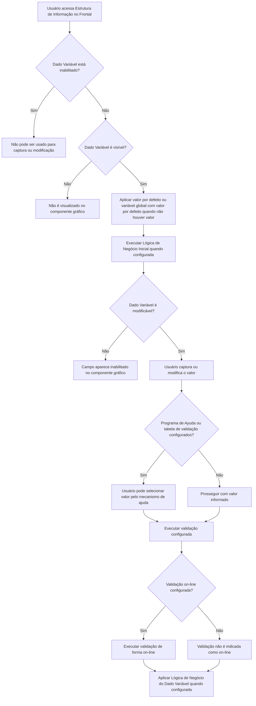

# Definição dos Dados Variáveis das Estruturas de Informação — DOCUMENTACIÓN Reef

## 1. Metadados do Documento
- **Arquivo de Origem:** Não identificado no conteúdo fornecido
- **Tipo de Documento:** Especificação Técnica / Manual Funcional
- **Domínio / Sistema:** Reef / Reef.core / Estruturas de Informação / Dados Variáveis
- **Público-Alvo:** Desenvolvedores, Arquitetos, Analistas Funcionais e Operação
- **Data/Versão Identificada:** Não identificada

---

## 2. Resumo Executivo & Contexto de Negócio

O documento descreve o catálogo de definição dos **Dados Variáveis**, também denominados **colunas**, associados às Estruturas de Informação do sistema Reef. O núcleo do sistema disponibiliza um repositório de informação pré-carregado nas instalações, no qual cada registro do catálogo representa a definição de um atributo de uma Estrutura de Informação.

A configuração de cada Dado Variável determina como o atributo será identificado, ordenado, apresentado, capturado, validado, armazenado e eventualmente protegido contra alteração. As propriedades estão organizadas em três grupos: propriedades gerais, propriedades operativas e outras propriedades.

No âmbito operacional, o documento especifica controles relacionados a tabelas Oracle, tabelas Oracle Nested, chave primária, visibilidade no componente gráfico frontal, obrigatoriedade, valores padrão, lógica de negócio, programas de ajuda, tabelas de validação, listas de valores, painel de visualização e validação on-line.

O mecanismo de lógica de negócio possui dois papéis distintos: a **Lógica de Negócio Inicial** pode obter o valor e a descrição do Dado Variável, além de impedir que o usuário altere o valor; a **Lógica de Negócio do Dado Variável** permite validar o valor capturado e obter a respectiva descrição.

O documento estabelece restrições explícitas: a propriedade **Variable Global de Ayuda** está descontinuada e obsoleta no núcleo do sistema e não pode ser usada nem reutilizada localmente. Além disso, as indicações definidas pelo **Módulo de Siniestros** devem ser respeitadas, pois esse módulo é o principal consumidor das Estruturas de Informação e dos Dados Variáveis associados.

---

## 3. Arquitetura, Componentes & Tecnologias Envolvidas

### Componentes e conceitos identificados

| Componente / Tecnologia | Papel identificado no documento |
| :--- | :--- |
| Reef | Sistema no qual são definidas as Estruturas de Informação e os Dados Variáveis. |
| Reef.core | Núcleo do sistema; disponibiliza o programa de ajuda out-of-the-box `AL000020`. |
| Estrutura de Informação | Estrutura que agrupa Dados Variáveis ou colunas. |
| Dado Variável / Coluna | Atributo definido individualmente no catálogo e associado a uma Estrutura de Informação. |
| Repositório de informação | Repositório entregue às instalações com determinado conteúdo pré-carregado. |
| Frontal | Componente gráfico no qual os Dados Variáveis podem ser exibidos, capturados e modificados. |
| Tabela Oracle | Tabela associada à Estrutura de Informação, podendo receber Dados Variáveis como colunas. |
| Tabela Oracle Nested | Tabela Oracle Nested associada, na qual um Dado Variável pode ser configurado como coluna. |
| Programa de Ayuda | Programa do sistema utilizado para selecionar o valor de um Dado Variável. |
| `AL000020` | Código do programa de ajuda out-of-the-box do Reef.core, recomendado quando há poucos valores possíveis. |
| Tabela de validación asociada | Tabela Oracle consultada quando o usuário aciona o ícone de ajuda no Frontal. |
| Lista de valores | Relação de valores disparada por um Dado Variável para permitir a captura de `n` ocorrências. |
| Lógica de Negócio Inicial | Lógica utilizada para obter valor e descrição, podendo bloquear a modificação pelo usuário. |
| Lógica de Negócio do Dado Variável | Lógica usada para validar o valor e obter a descrição correspondente. |
| Módulo de Siniestros | Módulo que utiliza majoritariamente Estruturas de Informação e Dados Variáveis associados. |

```mermaid
graph TD
    A[Catálogo de Dados Variáveis] --> B[Registro de definição de atributo]
    B --> C[Estrutura de Informação]
    B --> D[Propriedades Gerais]
    B --> E[Propriedades Operativas]
    B --> F[Outras Propriedades]

    D --> D1[Chave da Estrutura]
    D --> D2[Ordem de exibição e solicitação]
    D --> D3[Chave do Dado Variável ou Coluna]
    D --> D4[Objeto]
    D --> D5[Objeto relacionado]

    E --> E1[Armazenamento em Tabela Oracle ou Oracle Nested]
    E --> E2[Chave primária]
    E --> E3[Visibilidade no Frontal]
    E --> E4[Modificável ou inabilitado]
    E --> E5[Obrigatoriedade e validação sem valor]
    E --> E6[Valor padrão ou variável global]
    E --> E7[Lógica de Negócio Inicial]
    E --> E8[Lógica de Negócio do Dado Variável]
    E --> E9[Programa de Ayuda]
    E --> E10[Tabela de validação associada]
    E --> E11[Lista de valores e nível 5]
    E --> E12[Painel de visualização]
    E --> E13[Validação on-line]

    E9 --> G[Seleção de valor no Frontal]
    E10 --> G
    E7 --> H[Valor e descrição inicial]
    E8 --> I[Validação e descrição]
    E4 --> J[Captura ou modificação pelo usuário]
    F --> K[Inhabilitación]
```



### Fluxo funcional de captura e tratamento de um Dado Variável



---

## 4. Regras de Negócio, Especificações Funcionais & Processos

### 4.1 Definição do catálogo de Dados Variáveis

1. O núcleo do sistema permite associar Dados Variáveis ou colunas às Estruturas de Informação.
2. As instalações recebem um repositório de informação com determinado conteúdo pré-carregado.
3. Cada registro do catálogo representa a definição de um atributo da Estrutura de Informação.
4. Deve existir um registro para cada Dado Variável ou atributo que se deseje solicitar.
5. Um Dado Variável pode ser tratado como coluna dentro da Estrutura de Informação.

### 4.2 Propriedades gerais

1. **Estructura:** indica a chave pela qual a Estrutura de Informação é identificada no sistema.
2. **Orden:** define a ordem ou sequência na qual o Dado Variável é exibido e solicitado dentro da Estrutura de Informação.
3. **Dato Variable/columna:** informa a chave do Dado Variável ou coluna definida na Estrutura de Informação.
4. **Objeto:** identifica o objeto ao qual a coluna ou Dado Variável pertence dentro da Estrutura de Informação.
5. **Objeto relacionado:** identifica o objeto relacionado ao qual a coluna ou Dado Variável pertence.

### 4.3 Armazenamento e chave primária

1. A propriedade **El dato variable es columna de una Tabla Nested** indica se o Dado Variável será uma coluna na tabela Oracle Nested associada.
2. A propriedade **El dato variable es columna de la tabla** informa ao sistema se o Dado Variável será ou não uma coluna na tabela Oracle associada.
3. A propriedade **El dato variable es clave primaria** informa se o Dado Variável fará ou não parte da chave primária.

### 4.4 Exibição, habilitação e modificação

1. A propriedade **El dato variable es visible** informa se o Dado Variável será visualizado no componente gráfico frontal.
2. A propriedade **Dato variable modificable** define se é permitido modificar o valor do Dado Variável.
3. Quando a modificação não é permitida, o campo deve aparecer inabilitado no componente gráfico que exibe os campos da Estrutura de Informação.
4. Um valor pode ser atribuído a um Dado Variável não modificável por meio de:
   - valor por defeito do Dado Variável; ou
   - lógica de negócio inicial do Dado Variável.
5. Dados Variáveis não modificáveis não executam a lógica de negócio do Dado Variável.
6. Quando for necessário obter a descrição ou validar o conteúdo de um Dado Variável não modificável, essa operação deve ocorrer por meio da execução da lógica de negócio inicial.
7. A propriedade **Inhabilitación** indica que o Dado Variável está inabilitado para uso na captura e/ou modificação da Estrutura de Informação.

### 4.5 Obrigatoriedade, valores padrão e validações

1. A propriedade **Dato variable obligatorio** determina se o valor do Dado Variável deve obrigatoriamente ser capturado ou se pode permanecer vazio.
2. A propriedade **Validación si no tiene Valor** permite validar o Dado Variável mesmo quando não possui valor.
3. A validação de Dado Variável sem valor permite controlar se o atributo será obrigatório conforme as características da Estrutura de Informação.
4. A propriedade **Valor por defecto del dato variable** fornece um valor padrão quando o Dado Variável não possui valor.
5. A propriedade **Variable global con valor por defecto** permite fornecer dinamicamente um valor padrão quando o Dado Variável não possui valor.
6. A propriedade **Validación on-line del dato variable** define se a validação do Dado Variável deve ser realizada de forma on-line.

### 4.6 Lógicas de negócio

1. A propriedade **Lógica de negocio inicial del dato variable** contém uma Lógica de Negócio capaz de:
   - obter o valor do Dado Variável;
   - obter a descrição do Dado Variável;
   - impedir que o usuário modifique o valor.
2. A propriedade **Lógica de negocio del dato variable** contém uma Lógica de Negócio capaz de:
   - validar o valor do Dado Variável;
   - obter a descrição do valor.
3. Para Dados Variáveis não modificáveis, a Lógica de Negócio do Dado Variável não é executada.
4. Para validar ou obter a descrição de Dados Variáveis não modificáveis, deve-se utilizar a Lógica de Negócio Inicial.

### 4.7 Ajuda, tabelas de validação e listas de valores

1. A propriedade **Programa de Ayuda** referencia o Programa de Ajuda do sistema que permite selecionar o valor do Dado Variável.
2. Quando os valores possíveis do Dado Variável forem reduzidos, o atributo Programa de Ajuda deve conter o valor `AL000020`.
3. O código `AL000020` corresponde ao programa de ajuda out-of-the-box fornecido pelo Reef.core.
4. A propriedade **Tabla de validación asociada** informa o nome da tabela Oracle consultada se o usuário pressionar o ícone de ajuda no Frontal.
5. O valor da propriedade Tabela de Validação Associada está relacionado ao atributo que indica o Programa de Ajuda.
6. A propriedade **Versión de la Lista de Valores** informa a versão da relação de valores da Tabela de Validação Associada que será utilizada para obter o valor do Dado Variável.
7. A propriedade **Lista de valores del dato variable** contém o nome da lista de valores disparada pelo Dado Variável para permitir a captura de `n` ocorrências.
8. O valor da Lista de Valores deve ser replicado nos Dados Variáveis da Estrutura de Informação que compõem essa lista.
9. A coluna **Nivel del Dato Variable** deve ter valor constante `5` exclusivamente nos Dados Variáveis solicitados repetidamente por meio da execução de uma Lista de Valores à qual estejam associados.

### 4.8 Demais regras de apresentação e uso

1. A propriedade **Sensible a mayúsculas y minúsculas** determina se o valor do Dado Variável diferencia letras maiúsculas de minúsculas; o documento apresenta `pH` e `PH` como exemplo.
2. A propriedade **Panel de Visualización** indica o painel em que o Dado Variável é exibido, permitindo agrupamento e organização da apresentação.
3. A propriedade **Variable Global de Ayuda** está descontinuada e obsoleta no núcleo do sistema.
4. A propriedade **Variable Global de Ayuda** não pode ser usada nem reutilizada para qualquer finalidade de âmbito local.
5. Originalmente, a propriedade Variable Global de Ayuda indicava a variável global onde era depositado o valor selecionado após a chamada ao Programa de Ajuda.
6. As indicações do Módulo de Siniestros devem ser respeitadas, pois esse módulo utiliza majoritariamente as Estruturas de Informação e os Dados Variáveis associados.

---

## 5. Tabelas de Parâmetros, Ambientes e Estruturas de Dados

### 5.1 Propriedades gerais do Dado Variável

| Item / Parâmetro | Descrição / Função | Tipo / Valores / Formato | Ambiente / Observações |
| :--- | :--- | :--- | :--- |
| Estructura | Indica a chave de identificação da Estrutura de Informação no sistema. | Chave | Sistema Reef |
| Orden | Define a ordem ou sequência de exibição e solicitação do Dado Variável. | Ordem / sequência | Dentro da Estrutura de Informação |
| Dato Variable/columna | Indica a chave do Dado Variável ou coluna definida. | Chave | Estrutura de Informação |
| Objeto | Indica o objeto ao qual o Dado Variável ou coluna pertence. | Objeto | Estrutura de Informação |
| Objeto relacionado | Indica o objeto relacionado ao qual o Dado Variável ou coluna pertence. | Objeto relacionado | Estrutura de Informação |

### 5.2 Propriedades operativas de armazenamento, exibição e edição

| Item / Parâmetro | Descrição / Função | Tipo / Valores / Formato | Ambiente / Observações |
| :--- | :--- | :--- | :--- |
| El dato variable es columna de una Tabla Nested | Indica se o Dado Variável será coluna na tabela Oracle Nested associada. | Sim / Não, não detalhado | Tabela Oracle Nested associada |
| El dato variable es columna de la tabla | Indica se o Dado Variável será coluna na tabela Oracle associada. | Sim / Não, não detalhado | Tabela Oracle associada |
| El dato variable es clave primaria | Define se o Dado Variável faz parte da chave primária. | Sim / Não, não detalhado | Estrutura de Informação |
| El dato variable es visible | Define se o Dado Variável será visualizado no componente gráfico frontal. | Sim / Não, não detalhado | Frontal |
| Dato variable modificable | Define se o valor pode ser modificado. | Sim / Não, não detalhado | Se não modificável, o campo aparece inabilitado no componente gráfico. |
| Dato variable obligatorio | Define se o valor deve ser obrigatoriamente capturado. | Obrigatório / pode ficar vazio | Estrutura de Informação |
| Validación si no tiene Valor | Permite validar o Dado Variável mesmo sem valor. | Sim / Não, não detalhado | Permite controlar obrigatoriedade conforme características da Estrutura. |
| Inhabilitación | Indica que o Dado Variável está inabilitado para captura e/ou modificação. | Estado de inabilitação | Estrutura de Informação |

### 5.3 Parâmetros de valor, lógica e validação

| Item / Parâmetro | Descrição / Função | Tipo / Valores / Formato | Ambiente / Observações |
| :--- | :--- | :--- | :--- |
| Valor por defecto del dato variable | Define valor padrão quando o Dado Variável não possui valor. | Valor padrão | Aplicável se não houver valor. |
| Variable global con valor por defecto | Fornece dinamicamente valor padrão quando o Dado Variável não possui valor. | Variável global | Aplicável se não houver valor. |
| Lógica de negocio inicial del dato variable | Obtém valor e descrição; pode impedir modificação pelo usuário. | Lógica de Negócio | Deve ser usada para obter descrição ou validar conteúdo de Dados Variáveis não modificáveis. |
| Lógica de negocio del dato variable | Valida o valor e obtém sua descrição. | Lógica de Negócio | Não é executada para Dados Variáveis não modificáveis. |
| Validación on-line del dato variable | Distingue se a validação deve ser on-line. | On-line / não on-line | O documento não especifica o mecanismo técnico da validação. |
| Sensible a mayúsculas y minúsculas | Determina relevância de maiúsculas e minúsculas no valor. | Sensível / não sensível, não detalhado | Exemplo apresentado: `pH` e `PH`. |

### 5.4 Parâmetros de ajuda e listas de valores

| Item / Parâmetro | Descrição / Função | Tipo / Valores / Formato | Ambiente / Observações |
| :--- | :--- | :--- | :--- |
| Programa de Ayuda | Referencia programa do sistema para seleção do valor do Dado Variável. | Código de programa | Usado pelo sistema. |
| Programa de Ayuda para poucos valores | Valor recomendado para poucos valores possíveis. | `AL000020` | Programa out-of-the-box do Reef.core. |
| Tabla de validación asociada | Nome da tabela Oracle consultada ao pressionar o ícone de ajuda. | Nome de tabela Oracle | Relacionada ao atributo Programa de Ayuda. |
| Versión de la Lista de Valores | Versão da relação de valores da tabela de validação usada para obter valor. | Versão | Associada à Tabela de Validação. |
| Variable Global de Ayuda | Originalmente, apontava a variável global que recebia o valor selecionado após a ajuda. | Funcionalidade obsoleta | Descontinuada no núcleo; não usar nem reutilizar localmente. |
| Lista de valores del dato variable | Nome da lista de valores disparada para capturar `n` ocorrências. | Nome de lista | Deve ser replicada nos Dados Variáveis que compõem a lista. |
| Nivel del Dato Variable | Indica configuração para Dados Variáveis solicitados repetidamente por Lista de Valores. | Valor constante `5` | Usar somente nos Dados Variáveis associados à lista de valores repetida. |
| Panel de Visualización | Indica o painel no qual o Dado Variável será exibido. | Painel | Permite apresentação agrupada. |

### 5.5 Ambientes, URLs, servidores e logs

| Item / Parâmetro | Descrição / Função | Tipo / Valores / Formato | Ambiente / Observações |
| :--- | :--- | :--- | :--- |
| Ambientes | Não detalhados no conteúdo. | Não identificado | O documento não fornece mapeamento de ambientes. |
| URLs | Não detalhadas no conteúdo. | Não identificado | O conteúdo apresenta elementos de navegação do portal, mas não apresenta URLs completas. |
| Servidores | Não detalhados no conteúdo. | Não identificado | Não há nomes, IPs, portas ou configurações de servidor. |
| Rotas de logs | Não detalhadas no conteúdo. | Não identificado | Não há caminhos, variáveis ou políticas de log. |

---

## 6. Bateria de Perguntas & Respostas para RAG (FAQ Sintético)

### P1: Qual é a finalidade do catálogo de Dados Variáveis nas Estruturas de Informação do Reef?
**R:** O catálogo de Dados Variáveis define os atributos ou colunas associados às Estruturas de Informação do Reef. Cada registro representa a definição de um atributo que se deseja solicitar, permitindo configurar identificação, ordem, armazenamento, exibição, obrigatoriedade, validação, ajuda, valores padrão e comportamento de modificação.

### P2: Como um Dado Variável é identificado dentro de uma Estrutura de Informação?
**R:** A identificação envolve a propriedade **Estructura**, que representa a chave da Estrutura de Informação no sistema, e a propriedade **Dato Variable/columna**, que representa a chave do Dado Variável ou coluna definido nessa estrutura. O documento também prevê as propriedades **Objeto** e **Objeto relacionado** para indicar os objetos aos quais o atributo pertence.

### P3: O que acontece quando um Dado Variável não é modificável?
**R:** Quando o Dado Variável não é modificável, o campo aparece inabilitado no componente gráfico que exibe os campos da Estrutura de Informação. Ainda é possível atribuir valor por meio do valor por defeito ou da Lógica de Negócio Inicial. Além disso, Dados Variáveis não modificáveis não executam a Lógica de Negócio do Dado Variável; para obter descrição ou validar conteúdo, deve-se utilizar a Lógica de Negócio Inicial.

### P4: Qual é a diferença entre Lógica de Negócio Inicial e Lógica de Negócio do Dado Variável?
**R:** A **Lógica de Negócio Inicial** permite obter o valor e a descrição do Dado Variável, além de impedir que o usuário modifique o valor. A **Lógica de Negócio do Dado Variável** permite validar o valor informado e obter sua descrição. A Lógica de Negócio do Dado Variável não é executada para Dados Variáveis não modificáveis.

### P5: Como configurar um Dado Variável obrigatório?
**R:** A obrigatoriedade é definida pela propriedade **Dato variable obligatorio**, que indica se o valor deve obrigatoriamente ser capturado ou se pode permanecer vazio. A propriedade **Validación si no tiene Valor** pode validar o Dado Variável mesmo quando não possui valor e permite controlar se ele deve ser obrigatório conforme as características da Estrutura de Informação.

### P6: Quando deve ser usado o programa de ajuda `AL000020`?
**R:** O valor `AL000020` deve ser configurado no atributo **Programa de Ayuda** quando a relação de valores possíveis para o Dado Variável for reduzida. O documento identifica `AL000020` como o código do programa de ajuda out-of-the-box fornecido pelo Reef.core.

### P7: Qual é a relação entre Programa de Ayuda e Tabla de validación asociada?
**R:** O Programa de Ayuda aponta para o mecanismo do sistema que permite selecionar o valor do Dado Variável. A **Tabla de validación asociada** informa o nome da tabela Oracle consultada se o usuário pressionar o ícone de ajuda no Frontal. O documento afirma que o valor dessa tabela está relacionado ao atributo que indica o Programa de Ayuda.

### P8: Como configurar captura repetida de ocorrências usando uma Lista de Valores?
**R:** Deve-se configurar a propriedade **Lista de valores del dato variable** com o nome da lista de valores que o Dado Variável disparará para permitir a captura de `n` ocorrências. Esse valor deve ser replicado nos Dados Variáveis da Estrutura de Informação que compõem a lista. Para os Dados Variáveis solicitados repetidamente por essa lista, a coluna **Nivel del Dato Variable** deve ter exclusivamente o valor constante `5`.

### P9: A propriedade Variable Global de Ayuda pode ser reutilizada em uma implementação local?
**R:** Não. O documento declara que a funcionalidade **Variable Global de Ayuda** está descontinuada e obsoleta no núcleo do sistema. Portanto, ela não pode ser usada nem reutilizada para qualquer propósito de âmbito local.

### P10: Como um Dado Variável pode ser associado a tabelas Oracle?
**R:** A propriedade **El dato variable es columna de la tabla** define se o Dado Variável será uma coluna na tabela Oracle associada. A propriedade **El dato variable es columna de una Tabla Nested** define se ele será uma coluna na tabela Oracle Nested associada. A propriedade **El dato variable es clave primaria** define se o atributo fará parte da chave primária.

### P11: Como controlar a apresentação dos Dados Variáveis no Frontal?
**R:** A propriedade **El dato variable es visible** define se o Dado Variável será visualizado no componente gráfico frontal. A propriedade **Panel de Visualización** define em qual painel o Dado Variável será apresentado, permitindo estruturar e agrupar os atributos. A propriedade **Orden** define a sequência em que o Dado Variável é exibido e solicitado.

### P12: O sistema permite diferenciar maiúsculas de minúsculas na validação do valor?
**R:** Sim. A propriedade **Sensible a mayúsculas y minúsculas** informa se há relevância entre caracteres maiúsculos e minúsculos no valor do Dado Variável. O documento apresenta como exemplo a diferença entre `pH` e `PH`.

### P13: Qual módulo deve orientar o uso das Estruturas de Informação e Dados Variáveis?
**R:** Devem ser respeitadas as indicações definidas pelo **Módulo de Siniestros**, pois o documento afirma que esse módulo é o que mais utiliza as Estruturas de Informação e os Dados Variáveis associados.

---

## 7. Glossário de Termos, Siglas & Conceitos-Chave

- **Reef:** Sistema citado no documento como contexto para definição de Dados Variáveis e Estruturas de Informação.
- **Reef.core:** Núcleo do sistema Reef; fornece o programa de ajuda out-of-the-box `AL000020`.
- **Estrutura de Informação:** Estrutura identificada no sistema que contém Dados Variáveis ou colunas.
- **Dado Variável / Dato Variable:** Atributo ou coluna definido em uma Estrutura de Informação.
- **Coluna:** Denominação alternativa para Dado Variável no contexto das Estruturas de Informação.
- **Frontal:** Componente gráfico responsável por visualizar, capturar ou permitir modificação dos campos da Estrutura de Informação.
- **Tabela Oracle:** Tabela Oracle associada à Estrutura de Informação.
- **Tabela Oracle Nested:** Tabela Oracle Nested associada, na qual o Dado Variável pode ser configurado como coluna.
- **Lógica de Negócio Inicial:** Lógica configurada para obter valor e descrição do Dado Variável e impedir sua modificação pelo usuário.
- **Lógica de Negócio do Dado Variável:** Lógica configurada para validar o valor e obter a descrição correspondente.
- **Programa de Ayuda:** Programa do sistema utilizado para selecionar o valor de um Dado Variável.
- **`AL000020`:** Código do programa de ajuda out-of-the-box do Reef.core indicado para relações reduzidas de valores possíveis.
- **Tabela de Validação Associada:** Tabela Oracle consultada ao usar o ícone de ajuda no Frontal.
- **Lista de Valores:** Lista disparada por um Dado Variável para permitir a captura de múltiplas ocorrências.
- **Nivel del Dato Variable:** Campo que deve conter o valor constante `5` para Dados Variáveis repetidos por uma Lista de Valores associada.
- **Variable Global de Ayuda:** Propriedade obsoleta e descontinuada que originalmente recebia o valor selecionado após a chamada do Programa de Ajuda.
- **Módulo de Siniestros:** Módulo que utiliza majoritariamente as Estruturas de Informação e os Dados Variáveis associados.

---

## 8. Notas Críticas, Riscos & Limitações

- **Propriedade obsoleta:** A propriedade **Variable Global de Ayuda** está explicitamente descontinuada e obsoleta no núcleo do sistema. Seu uso ou reutilização local é proibido pelo documento.
- **Dados Variáveis não modificáveis:** Esses atributos não executam a Lógica de Negócio do Dado Variável. A obtenção de descrição ou validação do conteúdo deve ocorrer por meio da Lógica de Negócio Inicial.
- **Dependência do Módulo de Siniestros:** As orientações desse módulo devem ser respeitadas, pois ele é o maior consumidor de Estruturas de Informação e Dados Variáveis associados.
- **Detalhamento técnico ausente:** O documento não descreve contratos, métodos HTTP, endpoints, esquemas JSON, mecanismos de persistência, comandos SQL, versões de Oracle, ambientes, URLs, servidores, portas ou rotas de logs.
- **Nota de Análise:** O documento cita o Frontal, tabelas Oracle, tabelas Oracle Nested, programas de ajuda e lógicas de negócio, mas não detalha as implementações técnicas, interfaces, assinaturas ou contratos desses componentes.
- **Nota de Análise:** O documento define a possibilidade de validação on-line, mas não descreve quando ela é disparada, como é implementada ou quais respostas são esperadas em caso de falha.

---

## 9. Conteúdo Bruto Estruturado (Referência Fiel)

```text
--- [PÁGINA 1 DE 4] ---

DEFINICIÓN de los Datos Variables de las Estructuras de Información
Funcionalmente, el núcleo del Sistema cuenta con la posibilidad de asociar Datos Variables o columnas a las estructuras de información en
un repositorio de información que se entrega a las instalaciones con cierto contenido pre cargado. Cada registro de este catálogo es la
denición de un atributo de la estructura, es decir se denirá un registro por cada dato, atributo que se quiera solicitar.
Propiedades generales
Propiedades Operativas
Otras Propiedades
Propiedades generales
Estructura
Esta propiedad indica la clave por la que se identica en el Sistema a la Estructura de Información.
Orden
Este atributo indica el orden o secuencia en el que se muestra y solicita el Dato Variable dentro de la estructura de información.
Dato Variable/columna
Este Campo indica la clave del Dato Variable/Columna que se dene en la estructura de información.
Objeto
Este atributo indica el objeto al que pertenece la columna o dato variable dentro de la estructura de información.
Objeto relacionado
Esta propiedad indica el objeto relacionado al que pertenece la columna o dato variable dentro de la estructura de información.
Propiedades Operativas
El dato variable es columna de una Tabla Nested
Este atributo indica si el dato variable/columna de la estructura de información va a ser o no una columna en la tabla Oracle Nested asociada.
El dato variable es columna de la tabla
Esta propiedad le indica al sistema que el dato variable de la estructura de información va a ser o no una columna en la tabla Oracle
asociada.
Documentation / DOCUMENTACIÓN Reef
DOCUMENTACIÓN Reef
Mapfredocument
DOCUMENTACIÓN Reef
Owner
user:agonzalez_mapfre.com
Lifecycle
Approved Source
 / 
 VL
Buscar Inicio Soluciones Arquitecturas APIs Componentes Cloud Documentación Zeus Reef Ayuda
ES


--- [PÁGINA 2 DE 4] ---

El dato variable es clave primaria
Esta propiedad le indica al sistema que el dato variable de la estructura de información va a formar parte o no, de la clave primaria.
El dato variable es visible
Esta propiedad le indica al sistema que el dato variable de la estructura de información va a ser o no visualizado en el componente gráco del
frontal.
Dato variable modicable
Este atributo permite establecer en la denición si se permite o no modicar el valor del dato variable.
Si no se permitiera modicar el valor del dato variable, el campo aparecerá inhabilitado en el componente gráco que muestra los campos de
la estructura de información.
Es posible asignar un valor al dato variable mediante el uso de los atributos valor por defecto o lógica de negocio inicial del dato variable.
Los datos variables no modicables no ejecutan la lógica de negocio del dato variable por lo que si se requiere obtener su descripción o
validar su contenido esto se ha de realizar mediante la ejecución de la lógica de negocio inicial.
Dato variable obligatorio
Este atributo señala si el valor del Dato Variable debe ser obligatoriamente capturado en la estructura de información o por el contrario puede
dejarse vacío.
Validación si no tiene Valor
Este atributo permite que el sistema valide el Dato Variable en la Estructura aún cuando este no tenga valor alguno, pudiendo de esta forma
controlar el que sea o no obligatorio de acuerdo con las características de la Estructura de información.
Valor por defecto del dato variable
Este atributo se utiliza para dar un valor por defecto al dato variable siempre y cuando el dato variable no tenga valor alguno.
Variable global con valor por defecto
Este atributo permite dar dinámicamente un valor por defecto al dato variable siempre y cuando el dato variable no tenga valor alguno.
Lógica de negocio inicial del dato variable
Esta propiedad contiene una Lógica de Negocio que permite obtener el valor del dato variable además de su descripción e impedir que el
Usuario pueda modicar su valor.
Lógica de negocio del dato variable
Este atributo contiene una Lógica de Negocio que permite validar el valor del dato variable además de obtener la descripción del mismo.
Programa de Ayuda
Esta propiedad apunta al Programa de Ayuda del Sistema desde el cual se permita seleccionar el valor del dato variable.
En el caso que la relación de los valores posibles del dato variable sea un número reducido de valores este atributo debería contener el
valor 'AL000020' (código del programa de ayuda out-of-the-box que trae Reef.core)
Tabla de validación asociada
En este atributo se indica el nombre de la Tabla Oracle sobre la cual se efectuará la operación de consulta si el usuario pulsa el icono de
ayuda en el Frontal.
Consejo:


--- [PÁGINA 3 DE 4] ---

El valor de esta propiedad está relacionado con el atributo que indica el Programa de Ayuda
Versión de la Lista de Valores
Este atributo contiene la versión de la relación de valores de la Tabla de validación asociada que se ha de emplear para obtener el valor del
dato variable de la estructura de información.
Variable Global de Ayuda
La funcionalidad de esta propiedad está descontinuada y obsoleta en el núcleo del sistema por lo que no se puede usar o reutilizar para
ningún propósito de ámbito local.
Originalmente esta propiedad le indicaba al sistema la variable global en la que se depositaba el valor seleccionado tras realizar la llamada
al Programa de Ayuda.
Lista de valores del dato variable
Esta propiedad contiene el nombre de la lista de valores que el dato variable va a desencadenar para permitir la captura de n ocurrencias.
El valor de este atributo se replica en aquellos datos variables de la estructura de información que componen la lista de valores.
Nivel del Dato Variable
Esta columna ha de tener el valor constante 5 únicamente en aquellos datos variables que se han de solicitar repetidamente mediante la
ejecución de una determinada lista de valores (a la que están asociados)
Sensible a mayúsculas y minúsculas
Esta propiedad le indica al sistema si en el valor del dato variable tiene o no relevancia escribir un carácter en mayúsculas o minúsculas
(ejemplo: pH y PH).
Panel de Visualización
Este atributo indica el panel en el que se visualiza el dato variable pudiendo así estructurarlos y presentarlos de manera agrupada.
Validación on-line del dato variable
Este atributo permite distinguir si la validación del dato variable se ha de realizar de forma on-line o no.
Otras Propiedades
Inhabilitación
Esta propiedad indica en el Sistema que el Dato Variable dentro de la Estructura de Información está inhabilitado para ser utilizado en la
captura y/o modicación de la Estructura de Información.
Vínculos
Relación de Directrices y Documentos cuya lectura está recomendada para evitar que la interpretación aislada del presente documento pueda
conducir a error.
Datos Variables
Estructuras de Información
Paneles de Información
Preguntas frecuentes
(1) ¿Existe alguna circunstancia operativa que deba ser tomada en consideración sobre este catálogo?


--- [PÁGINA 4 DE 4] ---

Se deben respetar las indicaciones denidas por el Módulo de Siniestros puesto que este módulo es es que mayormente utiliza las
estructuras de información así como los datos variables asociados a ellas.
```
