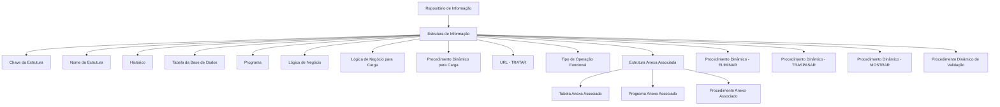

# Definición de las Estructuras de Información en Reef.core

## 1. Metadados do Documento
- **Arquivo de Origem:** Não identificado no conteúdo extraído
- **Tipo de Documento:** Especificação Técnica
- **Domínio / Sistema:** Reef.core / DOCUMENTACIÓN Reef / Módulo de Siniestros
- **Público-Alvo:** Desenvolvedores, Arquitetos, Operação e equipes funcionais
- **Data/Versão Identificada:** Não identificada
- **Owner identificado:** `user:agonzalez_mapfre.com`
- **Lifecycle identificado:** Approved Source

---

## 2. Resumo Executivo & Contexto de Negócio

O documento descreve o catálogo de propriedades utilizado para definir e identificar Estruturas de Informação no núcleo do sistema Reef.core. Essas estruturas são codificadas e identificadas em um repositório de informação específico, entregue inicialmente às instalações com conteúdo definido conforme classificações de agrupamentos consideradas necessárias pelo núcleo do sistema.

A definição de uma Estrutura de Informação reúne propriedades Reef.core e propriedades gerais. Essas propriedades permitem identificar uma estrutura, registrar sua denominação, controlar histórico de alterações, relacionar tabelas de banco de dados, associar programas, lógicas de negócio, procedimentos Oracle e recursos web.

O documento estabelece mecanismos de extensão da execução original por meio de estruturas anexas, tabelas anexas, programas complementares e procedimentos Oracle complementares. Esses mecanismos permitem implementar árvores de estruturas e complementar dados ou comportamentos após a conclusão do fluxo principal.

Também são descritas propriedades para operações dinâmicas, incluindo carga, tratamento por URL, exclusão, transferência, exibição e validação de registros. O atributo de Tipo de Operação Funcional identifica expressamente operações funcionais do sistema no Módulo de Siniestros.

A orientação operacional explícita é preservar a configuração inicialmente fornecida. A configuração pode ser complementada conforme necessidades específicas de cada entidade MAPFRE Local.

---

## 3. Arquitetura, Componentes & Tecnologias Envolvidas

### Componentes e conceitos identificados

| Componente / Conceito | Papel descrito |
| :--- | :--- |
| **Reef.core** | Núcleo do sistema no qual Estruturas de Informação são definidas e carregadas. |
| **Estrutura de Informação** | Entidade configurável, identificada no sistema e associada a dados, programas, lógicas e procedimentos. |
| **Repositório de informação** | Repositório específico que contém estruturas de informação e conteúdo inicial entregue às instalações. |
| **Base de Dados** | Camada que armazena os dados da Estrutura de Informação por meio de uma entidade/tabela. |
| **Tabela** | Entidade da Base de Dados que armazena dados da Estrutura de Informação. |
| **Tabela Anexa Associada** | Tabela complementar da Base de Dados com dados adicionais à tabela original. |
| **Programa** | Programa executado quando uma Estrutura de Informação é chamada. |
| **Programa Anexo Associado** | Programa complementar executado após o fluxo do programa original. |
| **Lógica de Negócio** | Lógica responsável por validações relacionadas à Estrutura de Informação. |
| **Lógica de Negócio para a Carga** | Lógica de Negócio que permite executar a carga da Estrutura de Informação em Reef.core. |
| **Procedimento Oracle** | Procedimento utilizado para carga, validação, transferência, exibição ou extensão da execução. |
| **URL - TRATAR** | Endereço web para executar a Operação Reef.core que atende informações da tabela. |
| **Módulo de Siniestros** | Módulo para o qual são identificadas operações funcionais pelo atributo Tipo de Operação Funcional. |
| **MAPFRE Local** | Entidade que pode complementar a configuração inicialmente fornecida segundo necessidades específicas. |



**Nota de Análise:** O documento menciona programas, lógicas de negócio, procedimentos Oracle, URL e operações Reef.core, mas não especifica nomes concretos de implementações, contratos HTTP, métodos HTTP, formatos JSON, esquemas de banco de dados ou tecnologias adicionais.

---

## 4. Regras de Negócio, Especificações Funcionais & Processos

### Definição e identificação de Estruturas de Informação

1. O núcleo do sistema permite codificar e identificar Estruturas de Informação.
2. As Estruturas de Informação são mantidas em um repositório de informação específico.
3. O repositório é entregue às instalações com determinado conteúdo inicial.
4. O conteúdo inicial é definido de acordo com a classificação de agrupamentos considerada necessária pelo núcleo.
5. As propriedades e funcionalidades da Estrutura de Informação são agrupadas em:
   - Propriedades Reef.core.
   - Propriedades Gerais.

### Regras das propriedades estruturais

1. A propriedade **Estrutura** representa a chave pela qual a Estrutura de Informação é identificada no sistema.
2. O atributo **Nome da Estrutura** define a denominação ou descrição da Estrutura de Informação.
3. A propriedade **Histórico** determina se a Estrutura de Informação permite histórico das alterações realizadas em suas definições.
4. A propriedade **Tabela** define o nome da entidade da Base de Dados que armazena os dados da Estrutura de Informação.
5. A propriedade **Programa** define o nome do programa executado quando a Estrutura de Informação é chamada.
6. A propriedade **Lógica de Negócio** define o nome da lógica de negócio responsável por realizar validações.
7. A propriedade **Lógica de Negócio para a Carga da Estrutura** define o nome da lógica de negócio que permite executar a carga da Estrutura de Informação em Reef.core.
8. O atributo **Tipo de Conceito Lógico** contém o valor de classificação do Tipo de Conceito Lógico associado à Estrutura de Informação.
9. O atributo **Tipo de Operação Funcional** identifica expressamente as operações funcionais do sistema no Módulo de Siniestros.

### Regras para componentes anexos e extensão do fluxo

1. A **Estrutura Anexa Associada** identifica uma Estrutura de Informação complementar.
2. A Estrutura Anexa Associada é executada após a finalização do fluxo de execução da Estrutura de Informação inicial.
3. A associação de estruturas permite implementar uma árvore de estruturas.
4. A **Tabela Anexa Associada** identifica uma tabela anexa da Base de Dados com dados complementares aos dados da tabela original definida na Estrutura de Informação.
5. O **Programa Anexo Associado** identifica o programa complementar executado após a finalização do fluxo de execução do programa original.
6. O **Procedimento Anexo Associado** identifica o Procedimento Oracle complementar executado após a finalização da execução do Procedimento Oracle original.

### Regras para operações dinâmicas

1. O **Procedimento Dinâmico para Efetuar a Carga da Estrutura** identifica o procedimento que permite executar a carga da Estrutura de Informação em Reef.core.
2. O atributo **URL - TRATAR** contém um endereço web associado a um recurso web, especificando sua localização em uma rede informática e um mecanismo para sua recuperação.
3. A URL é utilizada para executar a **Operação Reef.core** responsável por atender a informação da tabela.
4. O **Procedimento Dinâmico - ELIMINAR** identifica a lógica de negócio executada ao eliminar um registro da tabela.
5. O **Procedimento Dinâmico - TRASPASAR** identifica o Procedimento Oracle executado ao transferir um registro da tabela.
6. O **Procedimento Dinâmico - MOSTRAR** identifica o Procedimento Oracle executado ao mostrar um registro da tabela.
7. O **Procedimento Dinâmico** identifica o Procedimento Oracle que permite efetuar validações necessárias sobre as informações da Estrutura de Informação.

### Restrição operacional explícita

- A configuração inicialmente fornecida deve ser respeitada.
- A configuração inicial pode ser complementada conforme necessidades específicas da entidade MAPFRE Local.

---

## 5. Tabelas de Parâmetros, Ambientes e Estruturas de Dados

| Item / Parâmetro | Descrição / Função | Tipo / Valores / Formato | Ambiente / Observações |
| :--- | :--- | :--- | :--- |
| Estrutura | Chave de identificação da Estrutura de Informação no sistema. | Chave; formato não detalhado. | Reef.core. |
| Nome da Estrutura | Denominação ou descrição da Estrutura de Informação. | Texto; formato não detalhado. | Não detalhado. |
| Histórico | Indica se a Estrutura de Informação permite histórico de mudanças em suas definições. | Indicador; valores não detalhados. | Não detalhado. |
| Tabela | Nome da entidade de Base de Dados que armazena dados da Estrutura de Informação. | Nome de entidade/tabela; formato não detalhado. | Base de Dados. |
| Programa | Nome do programa executado quando a estrutura é chamada. | Nome de programa; formato não detalhado. | Fluxo principal da estrutura. |
| Lógica de Negócio | Nome da lógica de negócio utilizada para validações. | Nome de lógica; formato não detalhado. | Validações da estrutura. |
| Lógica de Negócio para a Carga da Estrutura | Nome da lógica que permite executar a carga da Estrutura de Informação. | Nome de lógica; formato não detalhado. | Reef.core. |
| Estrutura Anexa Associada | Nome da Estrutura de Informação complementar que será executada após o fluxo inicial. | Nome de estrutura; formato não detalhado. | Permite árvore de estruturas. |
| Tabela Anexa Associada | Nome da tabela anexa com dados complementares à tabela original. | Nome de tabela; formato não detalhado. | Base de Dados. |
| Programa Anexo Associado | Nome do programa complementar executado após o programa original. | Nome de programa; formato não detalhado. | Pós-execução do fluxo original. |
| Procedimento Anexo Associado | Nome do Procedimento Oracle complementar executado após o Procedimento Oracle original. | Nome de procedimento Oracle; formato não detalhado. | Pós-execução do procedimento original. |
| Tipo de Conceito Lógico | Classificação do Tipo de Conceito Lógico associado à Estrutura de Informação. | Valor de classificação; valores não detalhados. | Não detalhado. |
| Procedimento Dinâmico para Efetuar a Carga da Estrutura | Nome do procedimento que executa a carga da estrutura. | Nome de procedimento; formato não detalhado. | Reef.core. |
| URL - TRATAR | Direção web para executar a Operação Reef.core que atende informações da tabela. | URL; protocolo e formato não detalhados. | Recurso web em rede informática. |
| Procedimento Dinâmico - ELIMINAR | Lógica de negócio executada ao eliminar registro da tabela. | Nome de lógica; formato não detalhado. | Operação de exclusão. |
| Procedimento Dinâmico - TRASPASAR | Procedimento Oracle executado ao transferir registro da tabela. | Nome de procedimento Oracle; formato não detalhado. | Operação de transferência. |
| Procedimento Dinâmico - MOSTRAR | Procedimento Oracle executado ao mostrar registro da tabela. | Nome de procedimento Oracle; formato não detalhado. | Operação de exibição. |
| Procedimento Dinâmico | Procedimento Oracle que realiza validações necessárias sobre a informação da estrutura. | Nome de procedimento Oracle; formato não detalhado. | Validação. |
| Tipo de Operação Funcional | Identifica operações funcionais do sistema. | Tipo/identificador; valores não detalhados. | Módulo de Siniestros. |
| Configuração inicial | Configuração provida inicialmente que deve ser respeitada. | Não detalhado. | Pode ser complementada por MAPFRE Local. |

---

## 6. Bateria de Perguntas & Respostas para RAG (FAQ Sintético)

### P1: O que é uma Estrutura de Informação no contexto do Reef.core?
**R:** Uma Estrutura de Informação é uma entidade configurável do Reef.core que pode ser codificada e identificada em um repositório de informação específico. A estrutura reúne propriedades para identificação, descrição, histórico, armazenamento de dados, execução de programas, validações, carga e operações dinâmicas.

### P2: Qual propriedade identifica uma Estrutura de Informação no sistema?
**R:** A propriedade **Estrutura** indica a chave pela qual a Estrutura de Informação é identificada no sistema. O documento não informa o formato técnico ou os valores possíveis dessa chave.

### P3: Como o histórico de alterações é controlado em uma Estrutura de Informação?
**R:** A propriedade **Histórico** indica ao sistema se a Estrutura de Informação permite ou não manter histórico das mudanças efetuadas em suas definições. O documento não especifica como o histórico é persistido, consultado ou configurado.

### P4: Como uma Estrutura de Informação se relaciona com a Base de Dados?
**R:** A propriedade **Tabela** informa o nome da entidade da Base de Dados que armazena os dados da Estrutura de Informação. Para informações adicionais, a propriedade **Tabela Anexa Associada** aponta para uma tabela anexa com dados complementares aos dados da tabela original.

### P5: Qual é a diferença entre Programa, Programa Anexo Associado e Procedimento Anexo Associado?
**R:** O **Programa** é executado quando a Estrutura de Informação é chamada. O **Programa Anexo Associado** é um programa complementar executado após o fluxo do programa original. O **Procedimento Anexo Associado** é um Procedimento Oracle complementar executado após a execução do Procedimento Oracle original.

### P6: Como o documento permite criar uma árvore de estruturas?
**R:** A propriedade **Estrutura Anexa Associada** identifica uma Estrutura de Informação complementar que é executada após o fluxo da Estrutura de Informação inicial. Essa associação permite implementar uma árvore de estruturas.

### P7: Quais operações dinâmicas estão descritas para registros de tabela?
**R:** O documento descreve procedimentos dinâmicos para carga, eliminação, transferência, exibição e validação. O Procedimento Dinâmico para Carga executa a carga da estrutura; ELIMINAR executa lógica de negócio para exclusão; TRASPASAR executa Procedimento Oracle para transferência; MOSTRAR executa Procedimento Oracle para exibição; e Procedimento Dinâmico executa validações necessárias.

### P8: Para que serve o atributo URL - TRATAR?
**R:** O atributo **URL - TRATAR** contém um endereço web referente a um recurso web, sua localização em uma rede informática e um mecanismo para recuperação. Essa URL é utilizada para executar a Operação Reef.core que atende a informação da tabela. O documento não detalha URL concreta, protocolo, autenticação, método HTTP ou contrato de integração.

### P9: Qual é o papel da Lógica de Negócio em uma Estrutura de Informação?
**R:** A propriedade **Lógica de Negócio** identifica a lógica responsável por realizar validações. Já a **Lógica de Negócio para a Carga da Estrutura** identifica a lógica que permite executar a carga da Estrutura de Informação em Reef.core.

### P10: Como as operações funcionais são classificadas no Módulo de Siniestros?
**R:** O atributo **Tipo de Operação Funcional** identifica expressamente as operações funcionais do sistema para o Módulo de Siniestros. O documento não fornece a lista de tipos ou valores possíveis para essa classificação.

### P11: A configuração inicial das Estruturas de Informação pode ser alterada?
**R:** A configuração inicialmente provida deve ser respeitada. O documento estabelece que essa configuração pode ser complementada conforme necessidades específicas da entidade MAPFRE Local.

### P12: O documento especifica os nomes concretos dos programas, tabelas, procedimentos Oracle ou URLs?
**R:** Não. O documento descreve a finalidade das propriedades que armazenam esses nomes, mas não apresenta valores concretos de tabelas, programas, lógicas de negócio, procedimentos Oracle, URLs, métodos HTTP ou contratos de dados.

---

## 7. Glossário de Termos, Siglas & Conceitos-Chave

- **Reef.core:** Núcleo do sistema mencionado no documento, responsável por permitir a codificação, identificação e carga de Estruturas de Informação.
- **Estrutura de Informação:** Estrutura configurável identificada no sistema e associada a propriedades, tabelas, programas, lógicas de negócio e procedimentos.
- **Base de Dados:** Camada de persistência cujas entidades ou tabelas armazenam dados das Estruturas de Informação.
- **Tabela Anexa Associada:** Tabela de Base de Dados que contém dados complementares aos da tabela original definida na estrutura.
- **Lógica de Negócio:** Lógica associada à realização de validações ou à carga de Estruturas de Informação.
- **Procedimento Oracle:** Procedimento mencionado para carga, validação, transferência, exibição ou execução complementar.
- **URL:** Endereço web que referencia um recurso em rede e permite sua recuperação.
- **Operação Reef.core:** Operação executada mediante a URL - TRATAR para atender a informação de uma tabela.
- **Tipo de Conceito Lógico:** Classificação associada à Estrutura de Informação.
- **Tipo de Operação Funcional:** Atributo que identifica operações funcionais do sistema no Módulo de Siniestros.
- **Módulo de Siniestros:** Módulo do sistema para o qual o Tipo de Operação Funcional é identificado.
- **MAPFRE Local:** Entidade local que pode complementar a configuração inicialmente fornecida.
- **Lifecycle:** Metadado identificado como `Approved Source`; não há detalhamento adicional no conteúdo.
- **VL:** Sigla exibida nos metadados de navegação; significado não detalhado no conteúdo extraído.

---

## 8. Notas Críticas, Riscos & Limitações

- A configuração inicialmente fornecida deve ser respeitada; alterações ou complementações devem considerar as necessidades específicas da entidade MAPFRE Local.
- O documento não fornece valores concretos para chaves de estruturas, nomes de tabelas, programas, lógicas de negócio, procedimentos Oracle ou URLs.
- Não há especificação de métodos HTTP, autenticação, formatos de requisição, formatos de resposta ou contratos JSON para a propriedade **URL - TRATAR**.
- Não há modelo de dados, tipos de campos, chaves primárias, chaves estrangeiras ou esquema físico da Base de Dados.
- O documento não detalha regras transacionais, tratamento de erros, auditoria, permissões, concorrência ou mecanismos técnicos de persistência de histórico.
- A definição de “complementar” para estruturas, tabelas, programas e procedimentos é funcional; critérios de ordenação, dependências e falhas na execução encadeada não são especificados.
- **Nota de Análise:** O documento apresenta um catálogo de metadados e comportamentos configuráveis, mas não detalha implementações concretas nem contratos técnicos executáveis.

---

## 9. Conteúdo Bruto Estruturado (Referência Fiel)

```text
--- [PÁGINA 1 DE 3] ---

DEFINICIÓN de las Estructuras de Información
Funcionalmente, el núcleo del Sistema cuenta con la posibilidad de codicar e identicar las estructuras de información en un repositorio de
información especíco que se entrega a las instalaciones con determinado contenido inicial de acuerdo con la clasicación de agrupaciones
que el núcleo ha considerado son necesarias.
En la denición de una Estructura de Información, las Propiedades y funcionalidades existentes se agrupan en:
Propiedades Reef.core
Propiedades Generales
Estructura
Esta propiedad indica la clave por la que se identica en el Sistema a la Estructura de Información.
Nombre de la Estructura
Este Atributo indica cual es la denominación o descripción de la Estructura de Información.
Histórico
Esta propiedad le indica al Sistema si la Estructura de Información permite o no tener un histórico de los cambios efectuados en sus
deniciones.
Tabla
Esta propiedad le indica al Sistema el nombre de la entidad de la Base de Datos que almacena los Datos para la Estructura de Información.
Programa
Esta propiedad le indica al Sistema el nombre del Programa que se va a ejecutar cuando se llame a esa Estructura de información.
Lógica de Negocio
Esta propiedad le indica al Sistema el nombre de la lógica de Negocio para realizar validaciones.
Lógica de Negocio para la Carga de la Estructura
Esta propiedad le indica al Sistema el nombre de la Lógica de Negocio que que permite ejecutar la carga de la Estructura de Información en
Reef.core.
Estructura Anexa Asociada
Documentation / DOCUMENTACIÓN Reef
DOCUMENTACIÓN Reef
Mapfredocument
DOCUMENTACIÓN Reef
Owner
user:agonzalez_mapfre.com
Lifecycle
Approved Source
 / 
 VL
Buscar Inicio Soluciones Arquitecturas APIs Componentes Cloud Documentación Zeus Reef Ayuda
ES


--- [PÁGINA 2 DE 3] ---

Esta propiedad le indicaría al Sistema el nombre de la Estructura de Información complementaria que se ejecutaría una vez nalizado el ujo
de ejecución de la Estructura de Información inicial pudiendo de esta manera por tanto implementar un árbol de estructuras.
Tabla Anexa Asociada
Esta propiedad le indicaría al Sistema el nombre de la Tabla Anexa de la Base de Datos que contendría datos complementarios a los de la
Tabla original denida en la Estructura de Información.
Programa Anexo Asociado
Esta propiedad le indicaría al Sistema el nombre del Programa Complementario que se ejecutaría una vez nalizado el ujo de ejecución del
Programa original denido en la Estructura de Información.
Procedimiento Anexo Asociado
Esta propiedad le indicaría al Sistema el nombre del Procedimiento Oracle Complementario que se ejecutaría una vez nalizada la ejecución
del Procedimiento Oracle Original denido en la Estructura de Información.
Tipo de Concepto Lógico
Este atributo contiene el valor de la clasicación del Tipo de Concepto Lógico asociado a la Estructura de Información.
Procedimiento Dinámico para Efectuar la Carga de la Estructura
Esta propiedad le indica al Sistema el nombre del Procedimiento que permite ejecutar la carga de la Estructura de Información en Reef.core.
URL- TRATAR
Este atributo contiene la dirección web, en referencia a un recurso web que especica su ubicación en una red informática y un mecanismo
para la recuperación de esta misma, para ejecutar la "Operación Reef.core" que se ocupa de atender la información de la Tabla.
Procedimiento Dinámico - ELIMINAR
Esta propiedad le indicaría al Sistema el nombre de la lógica de Negocio que se ejecutaría al realizar la acción de eliminar el registro de la
Tabla.
Procedimiento Dinámico - TRASPASAR
Esta propiedad le indicaría al Sistema el nombre del Procedimiento Oracle que se ejecutaría al realizar la acción de traspasar el registro de la
Tabla.
Procedimiento Dinámico - MOSTRAR
Esta propiedad le indicaría al Sistema el nombre del Procedimiento Oracle que se ejecutaría al realizar la acción de mostrar el registro de la
Tabla.
Procedimiento Dinámico
Esta propiedad le indica al Sistema el nombre del Procedimiento Oracle que permite efectuar cualquier validación que fuera necesaria
efectuar sobre la información de la Estructura.
Tipo de Operación Funcional
Expresamente con este atributo se identican las operaciones funcionales del Sistema para el Módulo de Siniestros.
Vínculos
Relación de Directrices y Documentos cuya lectura está recomendada para evitar que la interpretación aislada del presente documento pueda
conducir a error.
Estructuras de Información
Preguntas frecuentes


--- [PÁGINA 3 DE 3] ---

(1) ¿Existe alguna circunstancia operativa que deba ser tomada en consideración sobre este catálogo?
Se debe respetar la conguración inicialmente provista, si bien es posible complementarla de acuerdo con las necesidades especícas de la
entidad MAPFRE Local.
```
