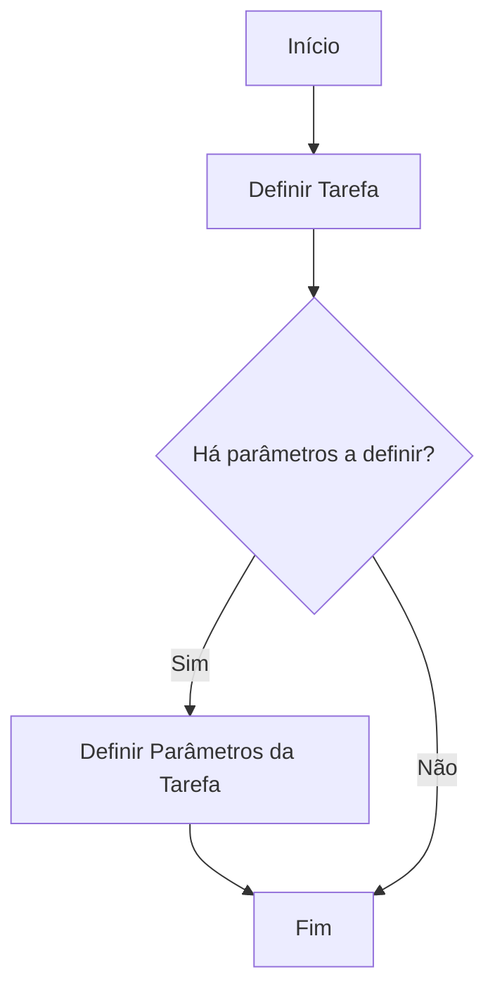

# Definição de Tarefas no Reef — Processo de Definição e Parâmetros

## 1. Metadados do Documento
- **Arquivo de Origem:** Não identificado
- **Tipo de Documento:** Procedimento
- **Domínio / Sistema:** Reef / Mapfredocument
- **Público-Alvo:** Não identificado
- **Data/Versão Identificada:** Não identificada

---

## 2. Resumo Executivo & Contexto de Negócio

O conteúdo descreve a **definição de uma Tarefa** e de seus respectivos parâmetros no contexto da documentação Reef. A finalidade declarada é estabelecer uma tarefa e, quando aplicável, definir seus parâmetros associados.

O procedimento possui uma decisão explícita: após definir a Tarefa, deve-se verificar se existem parâmetros que precisam ser definidos. Caso existam parâmetros, o processo continua para a etapa de definição de parâmetros; caso contrário, o fluxo é encerrado.

O documento está associado a referências de documentação denominadas **Documentation / DOCUMENTACIÓN Reef**, **DOCUMENTACIÓN Reef** e **Mapfredocument**. A fonte também apresenta um identificador de proprietário (`user:agonzalez_mapfre.com`) e o ciclo de vida como `Approved`.

O material não especifica atributos da Tarefa, tipos de parâmetros, regras de validação, interfaces, APIs, tecnologias de implementação ou contratos de integração. Portanto, o escopo fielmente recuperável limita-se ao fluxo de decisão entre definir a Tarefa e, opcionalmente, definir os parâmetros da Tarefa.

---

## 3. Arquitetura, Componentes & Tecnologias Envolvidas

O documento não descreve uma arquitetura de software, componentes técnicos, microsserviços, bancos de dados, APIs ou ambientes de execução. O único fluxo identificável é o procedimento funcional para definição de Tarefas e parâmetros.



### Elementos explicitamente citados

| Item | Descrição sustentada pelo conteúdo |
| :--- | :--- |
| Tarefa | Entidade que deve ser definida no procedimento. |
| Parâmetros da Tarefa | Elementos que podem precisar ser definidos após a definição da Tarefa. |
| Reef | Nome presente nas referências de documentação. Não há definição adicional no conteúdo. |
| Mapfredocument | Nome presente no conteúdo. Não há descrição funcional ou técnica adicional. |
| Owner | Campo de propriedade exibido com o valor `user:agonzalez_mapfre.com`. |
| Lifecycle | Campo exibido com o valor `Approved`. |
| Source | Campo exibido, sem valor claramente associado no trecho extraído. |
| VL | Sigla exibida após o campo `Source`; o significado não é detalhado. |

---

## 4. Regras de Negócio, Especificações Funcionais & Processos

### Processo de definição de uma Tarefa

1. Definir a **Tarefa**.
2. Avaliar a pergunta: **“¿Hay que Definir Parámetros?”**
3. Se a resposta for **“SI”**, definir os **Parâmetros da Tarefa**.
4. Se a resposta for **“NO”**, encerrar o processo.
5. Após definir os parâmetros, encerrar o processo.

### Regras explicitamente identificadas

| Regra | Condição | Ação |
| :--- | :--- | :--- |
| Definição inicial | Início do processo | Definir a Tarefa. |
| Decisão sobre parâmetros | Há necessidade de definir parâmetros | Definir os Parâmetros da Tarefa. |
| Encerramento sem parâmetros | Não há necessidade de definir parâmetros | Finalizar o processo. |
| Encerramento após parâmetros | Os parâmetros foram definidos | Finalizar o processo. |

> *Nota de Análise: O documento não informa quais são os parâmetros possíveis, se algum parâmetro é obrigatório, quais valores são aceitos ou como a definição da Tarefa é persistida.*

---

## 5. Tabelas de Parâmetros, Ambientes e Estruturas de Dados

| Item / Parâmetro | Descrição / Função | Tipo / Valores / Formato | Ambiente / Observações |
| :--- | :--- | :--- | :--- |
| Tarefa | Entidade a ser definida no início do processo. | Não especificado. | Não são informados atributos ou identificadores. |
| Parâmetros da Tarefa | Parâmetros associados à Tarefa, definidos somente quando necessários. | Não especificado. | O conteúdo não apresenta nomes, tipos, valores ou obrigatoriedade. |
| Owner | Proprietário apresentado na documentação. | `user:agonzalez_mapfre.com` | Exibido em `Mapfredocument`. |
| Lifecycle | Estado de ciclo de vida apresentado. | `Approved` | Exibido em `Mapfredocument`. |
| Source | Campo apresentado na documentação. | Não identificado no trecho. | O valor não está claramente disponível. |
| VL | Sigla exibida junto à área de metadados. | `VL` | Significado não detalhado. |
| Idioma | Idioma mostrado no menu da documentação. | `ES` | Exibido na interface de navegação. |
| Navegação documental | Opções apresentadas no menu. | `Buscar`, `Inicio`, `Soluciones`, `Arquitecturas`, `APIs`, `Componentes`, `Cloud`, `Documentación`, `Zeus`, `Reef`, `Ayuda` | Não há descrição detalhada das opções. |

---

## 6. Bateria de Perguntas & Respostas para RAG (FAQ Sintético)

### P1: Em que consiste a definição de uma Tarefa?
**R:** A definição de uma Tarefa consiste em definir uma Tarefa e seus parâmetros. O conteúdo não detalha os atributos, campos ou formato dessa Tarefa.

### P2: Qual é a primeira etapa do processo de definição de uma Tarefa?
**R:** A primeira etapa é **DEFINIR Tarea**, isto é, definir a Tarefa.

### P3: Quando os parâmetros da Tarefa devem ser definidos?
**R:** Os parâmetros da Tarefa devem ser definidos quando a decisão “¿Hay que Definir Parámetros?” tiver resposta **“SI”**.

### P4: O que ocorre quando não há parâmetros a definir para uma Tarefa?
**R:** Quando a resposta à pergunta sobre a necessidade de definir parâmetros for **“NO”**, o fluxo segue diretamente para **FIN**, encerrando o processo.

### P5: O processo termina depois de definir os parâmetros da Tarefa?
**R:** Sim. Após a etapa **Definir Parámetros**, o fluxo indicado segue para **FIN**.

### P6: Quais tipos de parâmetros de Tarefa são documentados?
**R:** Nenhum tipo, nome, formato, valor permitido ou regra de obrigatoriedade de parâmetro é documentado no conteúdo extraído.

### P7: Qual é o ciclo de vida identificado na documentação Mapfredocument?
**R:** O campo **Lifecycle** está apresentado com o valor **Approved**.

### P8: Quem aparece como proprietário da documentação?
**R:** O campo **Owner** apresenta o valor `user:agonzalez_mapfre.com`.

### P9: O documento informa APIs, métodos HTTP ou contratos de integração?
**R:** Não. O conteúdo apresenta referências de navegação, incluindo “APIs”, mas não descreve APIs, métodos HTTP, endpoints, contratos ou integrações.

### P10: O que significa a sigla VL no documento?
**R:** O trecho exibe a sigla `VL`, mas não fornece sua expansão ou definição.

---

## 7. Glossário de Termos, Siglas & Conceitos-Chave

- **Tarefa / Tarea:** Entidade que deve ser definida no processo apresentado.
- **Parâmetros da Tarefa / Parámetros Tarea:** Elementos que podem ser definidos para uma Tarefa quando a decisão do fluxo indicar necessidade.
- **Reef:** Nome presente nas referências de documentação; o conteúdo não define seu significado ou função.
- **Mapfredocument:** Nome exibido na documentação; não há descrição adicional disponível.
- **Owner:** Campo que identifica o proprietário da documentação.
- **Lifecycle:** Campo que apresenta o ciclo de vida da documentação.
- **Approved:** Valor apresentado para o campo `Lifecycle`.
- **VL:** Sigla exibida no conteúdo sem definição.
- **ES:** Indicador de idioma exibido na interface.

---

## 8. Notas Críticas, Riscos & Limitações

- O conteúdo é resumido e não informa os atributos, regras de preenchimento, persistência ou ciclo de vida de uma Tarefa.
- Não há detalhamento dos parâmetros que podem ser associados a uma Tarefa.
- Não há critérios documentados para decidir se os parâmetros devem ser definidos.
- Não são apresentados ambientes, URLs, servidores, logs, versões, tecnologias ou integrações.
- A sigla `VL` é exibida, mas não é explicada.
- O texto extraído contém caracteres aparentando problema de codificação em ocorrências de “definición” (`denición`).
- Não há detalhamento adicional sobre as opções de navegação `Soluciones`, `Arquitecturas`, `APIs`, `Componentes`, `Cloud`, `Zeus`, `Reef` e `Ayuda`.

---

## 9. Conteúdo Bruto Estruturado (Referência Fiel)

```text
--- [PÁGINA 1 DE 1] ---

DEFINICIÓN de Tareas
¿En que consiste?
Es la denición de una Tarea y sus parámetros
Proceso a seguir para Denición de una Tarea
SI
NO
DEFINIR
Tarea
(1)
¿Hay que
Definir Parámetros?
Definir Parámetros
(2)
FIN
1. DEFINIR Tarea 1. DEFINIR Parámetros Tarea
Documentation / DOCUMENTACIÓN Reef
DOCUMENTACIÓN Reef
Mapfredocument
DOCUMENTACIÓN Reef
Owner
user:agonzalez_mapfre.com
Lifecycle
Approved Source
 / 
 VL
Buscar Inicio Soluciones Arquitecturas APIs Componentes Cloud Documentación Zeus Reef Ayuda
ES
```
