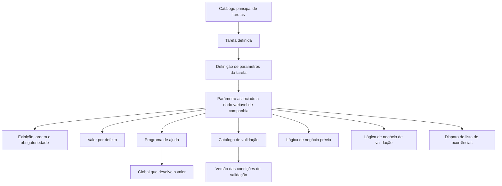

# Definição de Parâmetros de uma Tarefa no REEF

## 1. Metadados do Documento
- **Arquivo de Origem:** Não identificado no conteúdo fornecido
- **Tipo de Documento:** Procedimento
- **Domínio / Sistema:** REEF / Mapfre
- **Público-Alvo:** Usuários responsáveis pela configuração de tarefas e seus parâmetros
- **Data/Versão Identificada:** Não identificada

---

## 2. Resumo Executivo & Contexto de Negócio

O documento descreve como definir parâmetros necessários para a execução de uma tarefa no sistema REEF. As tarefas devem estar previamente cadastradas no catálogo principal de tarefas antes que os respectivos parâmetros sejam configurados.

Os parâmetros permitem fornecer informações que uma tarefa não consegue obter por outros meios e que, portanto, precisam ser introduzidas pelo usuário. Os exemplos fornecidos incluem processos de fechamento que exigem uma data de mês, cartas que podem exigir informações adicionais e listados que requerem companhia, estrutura comercial ou ramo.

A definição de cada parâmetro inclui propriedades de identificação, exibição, obrigatoriedade, ordenação, valor padrão, ajuda ao preenchimento, catálogo de validação, versão, lógica de negócio e comportamento relacionado a ocorrências.

O procedimento também permite que lógicas de negócio preencham ou validem valores de dados variáveis conforme condições prévias. A validação pode verificar, por exemplo, a existência de um valor em catálogo ou a vigência de um dado.

---

## 3. Arquitetura, Componentes & Tecnologias Envolvidas

Os elementos explicitamente citados são:

- **REEF:** sistema ou domínio onde ocorre a definição de parâmetros de tarefas.
- **Catálogo principal de tarefas:** repositório no qual a tarefa deve estar definida previamente.
- **Tarefa:** carta, processo, listado ou outro elemento executável que pode requerer parâmetros.
- **Dados variáveis:** dados associados aos parâmetros; o parâmetro deve estar cadastrado como dado variável em nível de companhia.
- **Programa de ajuda:** programa que auxilia na obtenção de possíveis valores do atributo.
- **Catálogo de validação:** catálogo contra o qual o valor introduzido para o dado variável é validado.
- **Lógica de negócio:** lógica aplicada antes do preenchimento do campo ou para validar o valor informado.
- **Lista de ocorrências:** lista que pode ser disparada por um dado variável.



> **Nota de Análise:** O documento não detalha tecnologias de implementação, métodos HTTP, contratos JSON, bancos de dados, integrações externas ou ambientes técnicos.

---

## 4. Regras de Negócio, Especificações Funcionais & Processos

### Pré-requisito para definição de parâmetros

1. A tarefa deve estar definida no catálogo principal de tarefas.
2. A chave da tarefa deve ser informada no atributo **Tarefa**.
3. O parâmetro associado à tarefa deve existir como dado variável em nível de companhia.

### Propriedades da definição de parâmetro

1. **Tarefa**
   - Contém a chave da tarefa para a qual serão definidos parâmetros.

2. **Nome do parâmetro**
   - Contém o parâmetro da tarefa.
   - O parâmetro deve estar cadastrado como dado variável em nível de companhia.

3. **Ordem do parâmetro**
   - Define a ordem de apresentação do parâmetro quando houver vários parâmetros.

4. **É visível?**
   - Indica se o parâmetro será visível ao usuário.
   - Alguns dados variáveis podem ser preenchidos apenas ao atribuir valor a outros dados variáveis.

5. **É obrigatório**
   - Indica se o usuário deve obrigatoriamente informar valor para o dado variável.

6. **Lógica de negócio antes de ir ao dado variável**
   - Contém lógica de negócio anterior ao campo.
   - A lógica pode preencher o campo conforme determinadas condições.

7. **Valor por defeito**
   - Define o valor adquirido pelo atributo por padrão.

8. **Programa de ajuda**
   - Define o programa que oferecerá ajuda para os possíveis valores do atributo.

9. **Catálogo de validação**
   - Define o nome do catálogo contra o qual será validado o valor introduzido para o dado variável.

10. **Versão**
    - Define a versão das condições utilizadas para extrair a validação do atributo.

11. **Nome da global que devolve o programa de ajuda**
    - Define o nome da global onde o valor retornado pelo programa de ajuda será disponibilizado, quando necessário.

12. **Lógica de negócio de validação**
    - Define a lógica de validação do valor do atributo.
    - Os exemplos citados são:
      - Verificar se o valor existe em um catálogo.
      - Verificar se o dado está vigente.

13. **Desencadeia ocorrências?**
    - Indica se o dado variável dispara uma lista de ocorrências.
    - Exemplo: um dado variável pergunta se existem joias; uma resposta positiva desencadeia a solicitação de ocorrências.

14. **Valida o dado variável se estiver nulo?**
    - Define se a validação do campo será executada mesmo quando o campo não tiver valor ou estiver nulo.

### Casos de uso mencionados

- **Processos de fechamento:** requerem a data do mês que será fechado.
- **Cartas:** podem utilizar informações existentes na base de dados ou requerer informações adicionais inseridas pelo usuário.
- **Listados:** podem requerer companhia, estrutura comercial e ramo para determinar o conteúdo solicitado.

---

## 5. Tabelas de Parâmetros, Ambientes e Estruturas de Dados

| Item / Parâmetro | Descrição / Função | Tipo / Valores / Formato | Ambiente / Observações |
| :--- | :--- | :--- | :--- |
| Tarefa | Contém a chave da tarefa para a qual serão definidos parâmetros. | Chave da tarefa. | A tarefa deve estar definida no catálogo principal de tarefas. |
| Nome do parâmetro | Contém o parâmetro associado à tarefa. | Dado variável. | Deve estar cadastrado como dado variável em nível de companhia. |
| Ordem do parâmetro | Define a ordem de apresentação quando houver vários parâmetros. | Ordem de exibição. | Aplicável quando a tarefa possui múltiplos parâmetros. |
| É visível? | Define se o parâmetro é apresentado ao usuário. | Indicador de visibilidade. | Dados variáveis podem ser preenchidos ao dar valor a outros dados variáveis. |
| É obrigatório | Define se o usuário deve informar valor ao dado variável. | Indicador de obrigatoriedade. | O documento não informa valores técnicos possíveis. |
| Lógica de negócio antes de ir ao dado variável | Executa lógica anterior ao campo e pode preencher o campo mediante condições. | Lógica de negócio. | Condições específicas não são detalhadas. |
| Valor por defeito | Define o valor padrão do atributo. | Valor padrão. | O documento não informa formato ou origem do valor. |
| Programa de ajuda | Disponibiliza ajuda para possíveis valores do atributo. | Programa. | O documento não identifica o programa ou sua tecnologia. |
| Catálogo de validação | Define o catálogo usado para validar o valor introduzido. | Nome de catálogo. | Aplicado ao valor do dado variável. |
| Versão | Define a versão das condições para extração da validação do atributo. | Versão de condições. | O formato de versão não é especificado. |
| Nome da global que devolve o programa de ajuda | Define a global onde será devolvido o valor do programa de ajuda. | Nome de global. | Usado quando necessário. |
| Lógica de negócio de validação | Valida o valor informado para o atributo. | Lógica de negócio. | Exemplos: existência em catálogo e vigência do dado. |
| Desencadeia ocorrências? | Define se o dado variável dispara uma lista de ocorrências. | Indicador de disparo. | Exemplo relacionado à pergunta sobre joias. |
| Valida o dado variável se estiver nulo? | Define se a validação é disparada mesmo sem valor informado. | Indicador de validação para nulo. | Trata campos sem valor ou nulos. |
| Processos de fechamento | Tarefas que podem requerer a data do mês a ser fechado. | Caso de uso. | Exemplo de informação introduzida pelo usuário. |
| Cartas | Tarefas que podem usar dados da base ou exigir informação adicional. | Caso de uso. | A informação adicional pode ser introduzida pelo usuário. |
| Listados | Tarefas que podem requerer companhia, estrutura comercial e ramo. | Caso de uso. | Os critérios são necessários para a solicitação do listado. |

---

## 6. Bateria de Perguntas & Respostas para RAG (FAQ Sintético)

### P1: Qual é o pré-requisito para definir parâmetros de uma tarefa no REEF?
**R:** A tarefa deve estar previamente definida no catálogo principal de tarefas. O atributo **Tarefa** contém a chave da tarefa para a qual os parâmetros serão configurados.

### P2: Por que uma tarefa precisa de parâmetros?
**R:** Os parâmetros são necessários quando uma tarefa, como uma carta, processo ou listado, requer informações que não podem ser obtidas de outra forma e precisam ser introduzidas pelo usuário.

### P3: O que é exigido para cadastrar o nome de um parâmetro de tarefa?
**R:** O parâmetro deve estar previamente cadastrado como dado variável em nível de companhia. O atributo **Nome do parâmetro** contém esse parâmetro associado à tarefa.

### P4: Como é definida a ordem de exibição de vários parâmetros?
**R:** O atributo **Ordem do parâmetro** define a ordem em que cada parâmetro será mostrado quando a tarefa possuir mais de um parâmetro.

### P5: Um parâmetro pode não ser visível para o usuário?
**R:** Sim. O atributo **É visível?** indica se o parâmetro será apresentado ao usuário. O documento informa que podem existir dados variáveis preenchidos apenas quando são atribuídos valores a outros dados variáveis.

### P6: Para que serve a lógica de negócio anterior ao dado variável?
**R:** A **Lógica de negócio antes de ir ao dado variável** permite aplicar condições antes do campo e pode preencher o campo conforme essas condições.

### P7: Como o valor de um dado variável pode ser validado?
**R:** O valor pode ser validado por um **Catálogo de validação**, por sua versão de condições e por uma **Lógica de negócio de validação**. Os exemplos citados incluem verificar se o valor existe em um catálogo e verificar se o dado está vigente.

### P8: O que significa desencadear ocorrências em um parâmetro?
**R:** Significa que um dado variável pode disparar uma lista de ocorrências. O exemplo apresentado é um dado variável que pergunta se existem joias; uma resposta afirmativa desencadeia a solicitação de ocorrências.

### P9: A validação pode ser executada quando o dado variável estiver nulo?
**R:** Sim, essa possibilidade é controlada pelo atributo **Valida o dado variável se estiver nulo?**, que determina se a validação deve ser lançada mesmo quando o campo não possui valor ou está nulo.

### P10: Que informação um processo de fechamento pode requerer?
**R:** Um processo de fechamento pode requerer a data do mês que será fechado. Essa informação é um exemplo de dado que precisa ser introduzido pelo usuário.

### P11: Quais informações um listado pode requerer?
**R:** Um listado pode requerer a companhia, a estrutura comercial e o ramo para o qual o listado será solicitado.

### P12: Qual é a função do programa de ajuda?
**R:** O **Programa de ajuda** serve para auxiliar na identificação dos possíveis valores do atributo. Quando necessário, o campo **Nome da global que devolve o programa de ajuda** indica a global onde o valor retornado será disponibilizado.

---

## 7. Glossário de Termos, Siglas & Conceitos-Chave

- **REEF:** Sistema ou domínio citado como contexto da documentação.
- **Tarefa:** Elemento executável que pode corresponder, entre outros exemplos citados, a uma carta, processo ou listado.
- **Catálogo principal de tarefas:** Catálogo no qual a tarefa precisa estar definida antes da configuração dos parâmetros.
- **Dado variável:** Dado associado a um parâmetro de tarefa; deve estar cadastrado em nível de companhia.
- **Catálogo de validação:** Catálogo contra o qual é validado o valor introduzido para um dado variável.
- **Programa de ajuda:** Programa utilizado para ajudar na seleção ou identificação de possíveis valores de um atributo.
- **Global:** Local identificado por nome onde o valor devolvido pelo programa de ajuda pode ser disponibilizado.
- **Ocorrências:** Lista que pode ser disparada por um dado variável conforme uma resposta ou condição.
- **Valor por defeito:** Valor padrão que um atributo assume.
- **Vigência:** Condição utilizada como exemplo de validação para determinar se um dado está válido.

---

## 8. Notas Críticas, Riscos & Limitações

- O documento não apresenta o nome do arquivo de origem, data, versão documental ou autor técnico.
- O documento não detalha os valores possíveis para indicadores como visibilidade, obrigatoriedade, disparo de ocorrências ou validação de nulos.
- Não há especificação de tecnologia, interface, banco de dados, APIs, formatos de integração ou contratos técnicos.
- Não são identificados nomes concretos de catálogos de validação, programas de ajuda, globais ou regras de negócio.
- Não são definidos critérios completos para a lógica de negócio anterior ao campo nem para a lógica de negócio de validação.
- O documento apresenta uma imagem de manutenção de parâmetros, mas a extração fornecida não contém detalhes visuais ou campos adicionais presentes na imagem.

---

## 9. Conteúdo Bruto Estruturado (Referência Fiel)

```text
--- [PÁGINA 1 DE 3] ---

DEFINICIÓN de Parámetros de una Tarea
Objetivo
La nalidad de este documento es explicar, cómo denir los parámetros que necesitar una tarea para ser ejecutada. Las tareas tienen que
estar denidas en el catálogo principal de tareas
Imagen del Mantenimiento Parámetros de una Tarea:
En esta imagen podemos ver la denición para los parámetros de una tarea.
Propiedades
Tarea
Este atributo contiene la clave de la tarea a la que se le va a denir parámetros. Esta tarea
Nombre del parámetro
Documentation / DOCUMENTACIÓN Reef
DOCUMENTACIÓN Reef
Mapfredocument
DOCUMENTACIÓN Reef
Owner
user:agonzalez_mapfre.com
Lifecycle
Approved Source
 / 
 VL
Buscar Inicio Soluciones Arquitecturas APIs Componentes Cloud Documentación Zeus Reef Ayuda
ES


--- [PÁGINA 2 DE 3] ---

Este atributo contendrá el parámetro de la tarea. Este parámetro tiene que estar dado de alta como dato variable a nivel de compañía.
Orden del parámetro
Este atributo contendrá el orden en el que se va a mostrar el parámetro, en el caso de ser varios.
¿Es visible?
Este atributo indica si el parámetro es visible para el usuario, pueden ser datos variables que se rellenen solo al dar valor a otros datos
variables
¿Es obligatorio
Este atributo indica si hay que dar valor al dato variable obligatoriamente o no.
Lógica de negocio ante de ir al dato variable
Este atributo contendrá una lógica de negocio previa al campo. Es decir esta lógica podrá rellenar el campo dependiendo de algunas
condiciones
Valor por defecto
Este atributo contendrá el valor que adquiere el atributo por defecto.
Programa de ayuda
Aquí se tendrá el programa que servirá de ayuda para los posibles valores del atributo.
Catálogo de Validación
Este atributo contendrá el nombre del catálogo contra la que se va a validar el valor del dato variable introducido
Versión
La versión de las condiciones para las que se va a extraer la validación del atributo.
Nombre de la global que devuelve el programa de ayuda
Este campo tiene el nombre de la global donde se devuelve el valor, si se necesita.
Lógica de Negocio de validación
Lógica de negocio de validación del valor del atributo.
Ejemplos:
Que exista el valor en un catálogo
Que el dato esté vigente
Etc
¿Desencadena Ocurrencias?
Este atributo indica si este dato variable dispara una lista de ocurrencias.
Ejemplo:
Datos variable que pregunta si hay joyas, si contesta que sí desencadenará la petición de ocurrencias.
¿Valida el dato variable si es nulo?
¿Se lanza la validación del campo aunque este no tenga valor, sea nulo?
Preguntas frecuentes
¿ Para qué se necesitan los parámetros de las tareas?


--- [PÁGINA 3 DE 3] ---

Porque a veces la tarea (carta, proceso, etc) necesitan información que no puede obtenerse de otra manera sino es introducida por el
usuario.
Ejemplos:
- Si se lanzan procesos de cierre, se necesita la fecha del mes que se quiere cerrar.
- Si lanzan cartas, se puede tener toda la información en la base de datos y obtenerla o se puede necesitar de información adicional que
tenga que ser introducida por el usuario.
- Si se lanzan Listados se puede necesitar para que compañía, para que estructura comercial, para que ramo se necesita el listado.
```
