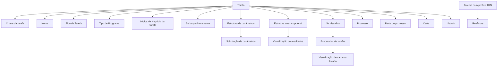
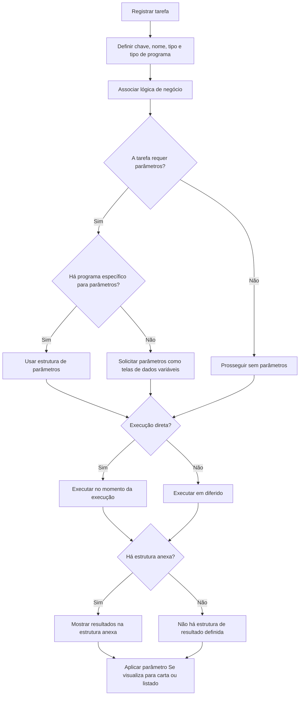

# Definição de uma Tarefa — Documentação Reef

## 1. Metadados do Documento
- **Arquivo de Origem:** Não identificado no conteúdo fornecido
- **Tipo de Documento:** Procedimento / Manual Operacional
- **Domínio / Sistema:** Reef / Reef.core
- **Público-Alvo:** Não identificado explicitamente
- **Data/Versão Identificada:** Não identificada
- **Owner identificado:** `user:agonzalez_mapfre.com`
- **Lifecycle identificado:** `Approved Source`

---

## 2. Resumo Executivo & Contexto de Negócio

O documento descreve como definir uma tarefa no contexto da documentação Reef. Uma tarefa pode representar um processo completo, uma parte de processo, uma carta ou um listado. Os exemplos incluem o processo de fechamento contábil, cálculo de reservas de fim de mês, solicitação de documentos ao segurado e listados de carteira de apólices.

A definição de tarefa permite criar programas simples sem a necessidade de criar telas. Uma tarefa pode exigir parâmetros para execução ou não exigir parâmetros; quando exige parâmetros, pode utilizar uma tela específica ou solicitar os parâmetros por meio de telas de dados variáveis.

A execução de uma tarefa pode ocorrer diretamente, no momento da execução, ou em diferido. Após a execução, uma tarefa pode possuir uma estrutura para apresentação de resultados, mas essa estrutura é opcional.

O documento também caracteriza tarefas de núcleo: tarefas iniciadas por `TRN` são tarefas do `Reef.core`. Entre os exemplos de uso dessas tarefas estão processos de fechamento contábil, listados operacionais e de gestão de sinistros, listados de caixa e listados de ordens de pagamento.

---

## 3. Arquitetura, Componentes & Tecnologias Envolvidas

### Componentes e conceitos identificados

| Componente / Conceito | Descrição baseada no documento |
| :--- | :--- |
| Reef | Domínio identificado na documentação apresentada. |
| Reef.core | Componente citado como origem das tarefas cujo código começa por `TRN`. |
| Tarefa | Registro que pode representar processo, parte de processo, carta ou listado. |
| Executador de tarefas | Componente mencionado como responsável por avaliar o parâmetro **Se visualiza** para exibir uma carta ou listado. |
| Lógica de Negócio da Tarefa | Lógica que deve ser disparada para executar a tarefa. |
| Estrutura de parâmetros | Programa que solicita parâmetros necessários à execução; quando não há programa específico, os parâmetros são solicitados como telas de dados variáveis. |
| Estrutura anexa | Estrutura opcional utilizada para mostrar resultados. |
| Tipo de Programa | Classificação do programa associado à tarefa. O exemplo visual menciona o tipo `PLSQL`. |
| Carta | Tipo de tarefa utilizado para comunicações, como solicitação de informação adicional ou cancelamento de apólice por falta de pagamento. |
| Listado | Tipo de tarefa usado para obter listagens, como carteira de apólices ou sinistros pendentes. |



> **Nota de Análise:** O documento não detalha métodos HTTP, contratos JSON, bancos de dados, protocolos de integração, ambientes técnicos, URLs, portas ou versões de tecnologias.

---

## 4. Regras de Negócio, Especificações Funcionais & Processos

### 4.1 Definição funcional de tarefa

Uma tarefa pode corresponder a uma das seguintes categorias:

1. **Processo:** por exemplo, o processo de fechamento contábil.
2. **Parte de um processo:** por exemplo:
   - cálculo de IBNR;
   - cálculo mensal de reservas de sinistros;
   - geração de informação para listados dentro do processo de fechamento contábil.
3. **Carta:** por exemplo:
   - solicitação ao segurado para entrega de informação adicional;
   - comunicação ao segurado sobre o cancelamento da apólice por falta de pagamento.
4. **Listado:** por exemplo:
   - listado da carteira de apólices;
   - listado de sinistros pendentes.

### 4.2 Regras de parâmetros e execução

- Uma tarefa **pode necessitar ou não de parâmetros** para ser executada.
- Quando uma tarefa necessita de parâmetros, ela pode:
  - possuir uma tela específica para solicitação de parâmetros; ou
  - não possuir tela específica, utilizando telas de dados variáveis.
- Uma tarefa pode ser executada:
  - **diretamente**, no momento da execução; ou
  - **em diferido**.
- Uma tarefa pode possuir ou não telas ou estruturas para visualizar resultados após a execução.
- A **estrutura anexa** é opcional e contém a estrutura utilizada para apresentar resultados.
- O parâmetro **Se visualiza** informa ao executador de tarefas se uma carta ou listado deve ser visualizado.

### 4.3 Regras para tarefas de núcleo

- Todas as tarefas cujo identificador começa por `TRN` são tarefas de `Reef.core`.
- Exemplos de finalidades mencionadas para tarefas `TRN`:
  - processo de fechamento contábil;
  - listados operacionais de sinistros;
  - listados de gestão de sinistros;
  - listados de caixa;
  - listados de ordens de pagamento.

### 4.4 Fluxo funcional de configuração e execução



---

## 5. Tabelas de Parâmetros, Ambientes e Estruturas de Dados

### 5.1 Atributos da tarefa

| Item / Parâmetro | Descrição / Função | Tipo / Valores / Formato | Ambiente / Observações |
| :--- | :--- | :--- | :--- |
| Tarefa | Contém a chave de um processo, parte de processo, listado, carta ou outro elemento tratado como tarefa. | Exemplos: `TRN00001`, `TRN00002`, `TRN00003`, `TRN00004`. | Tarefas iniciadas por `TRN` são tarefas de Reef.core. |
| Nome | Contém o nome atribuído à tarefa. | Texto. | O documento não especifica restrições de tamanho ou formato. |
| Tipo de Tarefa | Contém o tipo da tarefa registrada. | Tipo não detalhado. | Pode corresponder, entre outros, a processo, parte de processo, carta ou listado. |
| Tipo de Programa | Contém o tipo de programa da tarefa registrada. | Tipo de programa não detalhado; a imagem menciona `PLSQL`. | Não são detalhados valores permitidos, versões ou comportamento técnico. |
| Lógica de Negócio da Tarefa | Contém a lógica de negócio que deve ser lançada para execução da tarefa. | Não detalhado. | O documento não especifica contratos, interfaces ou implementação da lógica. |
| Se lança diretamente | Indica se a tarefa será iniciada diretamente no momento da execução. | Indicador booleano implícito: diretamente / em diferido. | O documento não informa o mecanismo de agendamento para execução em diferido. |
| Estrutura de parâmetros | Contém o programa que solicitará os parâmetros. | Programa específico ou telas de dados variáveis. | Aplicável quando a tarefa necessita de parâmetros. |
| Estrutura anexa | Contém a estrutura onde os resultados serão mostrados. | Opcional. | Não há detalhamento sobre o formato da estrutura. |
| Se visualiza | Indica ao executador de tarefas se a carta ou listado será visualizado. | Indicador de visualização. | Referência específica a cartas e listados. |

### 5.2 Exemplos de chaves de tarefas

| Item / Parâmetro | Descrição / Função | Tipo / Valores / Formato | Ambiente / Observações |
| :--- | :--- | :--- | :--- |
| `TRN00001` | Processo de fechamento contábil. | Chave de tarefa. | Tarefa com prefixo `TRN`; portanto, tarefa de Reef.core. |
| `TRN00002` | Cálculo de reservas de fim de mês. | Chave de tarefa. | Tarefa com prefixo `TRN`; portanto, tarefa de Reef.core. |
| `TRN00003` | Carta de solicitação de documentos. | Chave de tarefa. | Tarefa com prefixo `TRN`; portanto, tarefa de Reef.core. |
| `TRN00004` | Listado da carteira. | Chave de tarefa. | Tarefa com prefixo `TRN`; portanto, tarefa de Reef.core. |

### 5.3 Dados de identificação documental

| Item / Parâmetro | Descrição / Função | Tipo / Valores / Formato | Ambiente / Observações |
| :--- | :--- | :--- | :--- |
| Área de documentação | Documentação Reef. | Texto. | Também são exibidos os rótulos `Documentation / DOCUMENTACIÓN Reef` e `Mapfredocument`. |
| Owner | Responsável identificado na página. | `user:agonzalez_mapfre.com` | Valor literal extraído do conteúdo. |
| Lifecycle | Estado de ciclo de vida identificado. | `Approved Source` | Valor literal extraído do conteúdo. |
| Idioma da interface | Idioma indicado na navegação visual. | `ES` | O conteúdo principal está em espanhol. |

---

## 6. Bateria de Perguntas & Respostas para RAG (FAQ Sintético)

### P1: O que uma tarefa pode representar na documentação Reef?
**R:** Uma tarefa pode representar um processo, uma parte de processo, uma carta ou um listado. Os exemplos citados incluem processo de fechamento contábil, cálculo de IBNR, cálculo mensal de reservas de sinistros, carta de solicitação de documentos e listado da carteira de apólices.

### P2: Uma tarefa Reef sempre precisa de parâmetros para execução?
**R:** Não. O documento estabelece que tarefas podem necessitar ou não de parâmetros. Quando necessita de parâmetros, a tarefa pode utilizar um programa específico para solicitá-los ou, se não houver programa específico, solicitá-los como telas de dados variáveis.

### P3: Quais são as opções de execução de uma tarefa?
**R:** Uma tarefa pode ser executada diretamente, no momento da execução, ou em diferido. O atributo **Se lança diretamente** indica se a tarefa será iniciada diretamente no momento da execução.

### P4: Qual atributo registra a lógica que deve ser iniciada para executar uma tarefa?
**R:** O atributo **Lógica de Negócio da Tarefa** contém a lógica de negócio que deve ser lançada para que a tarefa seja executada. O documento não detalha a implementação técnica, os contratos ou os métodos associados a essa lógica.

### P5: Para que serve a estrutura de parâmetros?
**R:** A **Estrutura de parâmetros** contém o programa que solicitará os parâmetros necessários à execução da tarefa. Quando a tarefa não tem programa específico para solicitação de parâmetros, os parâmetros são solicitados como telas de dados variáveis.

### P6: A estrutura anexa é obrigatória em uma tarefa?
**R:** Não. A **Estrutura anexa** é opcional. Quando definida, ela contém uma estrutura onde os resultados da tarefa podem ser apresentados.

### P7: Qual é a função do parâmetro “Se visualiza”?
**R:** O parâmetro **Se visualiza** informa ao executador de tarefas se uma carta ou um listado deve ser visualizado. O documento não apresenta os valores possíveis desse parâmetro nem detalha o comportamento de interface associado.

### P8: Como identificar uma tarefa de Reef.core?
**R:** Todas as tarefas cuja chave começa por `TRN` são tarefas de `Reef.core`. O documento cita como exemplos tarefas para fechamento contábil, listados operacionais de sinistros, listados de gestão de sinistros, listados de caixa e listados de ordens de pagamento.

### P9: O que representa a tarefa `TRN00002`?
**R:** A tarefa `TRN00002` representa o cálculo de reservas de fim de mês. Como o identificador começa por `TRN`, o documento a classifica como uma tarefa de `Reef.core`.

### P10: É possível criar programas simples sem criar telas?
**R:** Sim. Segundo a seção de perguntas frequentes, as tarefas são úteis para criar programas simples sem a necessidade de criar telas. Ainda assim, uma tarefa pode ter tela específica para solicitar parâmetros ou para mostrar resultados, conforme sua configuração.

### P11: Quais exemplos de cartas podem ser implementados como tarefas?
**R:** O documento cita como exemplos uma solicitação ao segurado para entrega de informação adicional e uma comunicação ao segurado sobre o cancelamento da apólice por falta de pagamento.

### P12: O documento detalha os métodos HTTP ou contratos de integração das tarefas?
**R:** Não. O documento descreve atributos funcionais para definição, parametrização, execução e visualização de tarefas, mas não detalha métodos HTTP, APIs, contratos JSON, bancos de dados, protocolos ou endpoints.

---

## 7. Glossário de Termos, Siglas & Conceitos-Chave

- **Carta:** Tipo de tarefa usado para comunicações, como solicitação de informação adicional ou comunicação de cancelamento de apólice por falta de pagamento.
- **Estrutura anexa:** Estrutura opcional onde os resultados da tarefa podem ser mostrados.
- **Estrutura de parâmetros:** Programa que solicita os parâmetros da tarefa; sem programa específico, os parâmetros são solicitados como telas de dados variáveis.
- **IBNR:** Sigla citada como exemplo de cálculo em uma parte de processo; o documento não apresenta sua expansão.
- **Listado:** Tipo de tarefa destinado à obtenção de listagens, como carteira de apólices ou sinistros pendentes.
- **PLSQL:** Tipo de programa citado na descrição de uma imagem de manutenção de tarefas; o documento não apresenta expansão nem especificação técnica adicional.
- **Reef.core:** Componente citado como origem das tarefas cujo identificador começa por `TRN`.
- **Tarefa:** Registro que pode representar processo, parte de processo, carta ou listado.
- **TRN:** Prefixo de identificador usado para tarefas de Reef.core, conforme o documento.

---

## 8. Notas Críticas, Riscos & Limitações

- O documento não informa o nome do arquivo de origem, data, versão ou autoria documental além do valor de owner exibido.
- Não há detalhamento de esquemas de dados, tipos de campos, valores permitidos, obrigatoriedade de atributos ou validações.
- O documento não descreve o mecanismo de execução em diferido, como agendamento, filas, monitoramento ou tratamento de falhas.
- Não são apresentados métodos HTTP, APIs, contratos JSON, URLs, servidores, credenciais, bancos de dados, protocolos ou ambientes técnicos.
- A imagem citada como “Mantenimiento Tareas a nivel de Compañía” é descrita textualmente, mas não disponibiliza detalhes suficientes para reconstruir campos visuais adicionais.
- O tipo de programa `PLSQL` é mencionado, porém não há explicação sobre sua implementação, versão, execução ou integração.
- A sigla `IBNR` aparece como exemplo de cálculo, mas não é expandida ou detalhada no conteúdo original.

---

## 9. Conteúdo Bruto Estruturado (Referência Fiel)

```text
--- [PÁGINA 1 DE 3] ---

DEFINICIÓN de una Tarea
Objetivo
La finalidad de este documento es explicar, cómo definir una tarea.
Una tarea puede ser:
Un proceso, como por ejemplo el proceso de cierre contable.
Una parte de un proceso, como por ejemplo el cálculo del IBNR, el cálculo de las Reservas de siniestros mensual o la generación de
información para listados dentro del proceso de cierre contable.
Una carta, como por ejemplo realizar una Solicitud al asegurado para la entrega de información adicional, Informar al Asegurado de la
Cancelación de su póliza por falta de pago, ...
Un listado, como por ejemplo la obtención de un Listado de la Cartera de Pólizas, Listado de siniestros pendientes, ...
Las tareas:
Pueden o no necesitar parámetros para poder ejecutarse (en cuyo caso pueden contar a su vez o no con una pantalla específica que los
solicite)
Pueden ejecutarse directamente o en diferido.
Pueden tener o no pantallas para visualizar resultados tras su ejecución.
Imagen del Mantenimiento Tareas a nivel de Compañía:
En esta imagen podemos ver la definición de un tipo de tarea, carta, tipo de programa PLSQL, sin una pantalla específica para pedir
parámetros y sin una pantalla específica para mostrar el resultado
Documentation / DOCUMENTACIÓN Reef
DOCUMENTACIÓN Reef
Mapfredocument
DOCUMENTACIÓN Reef
Owner
user:agonzalez_mapfre.com
Lifecycle
Approved Source
 /
VL
Buscar Inicio Soluciones Arquitecturas APIs Componentes Cloud Documentación Zeus Reef Ayuda
ES

--- [PÁGINA 2 DE 3] ---

Propiedades
Tarea
Este atributo contendrá la clave de un proceso, parte de un proceso, un listado, una carta, etc.
Ejemplos:
TRN00001 Proceso de Cierre Contable.
TRN00002 Cálculo de Reservas Fin de Mes.
TRN00003 Carta de Solicitud de documentos.
TRN00004 Listado de la Cartera.
Nombre
Este atributo contendrá el nombre que se le va a dar a la tarea.
Tipo de Tarea
Este atributo contendrá de qué Tipo es la tarea que se está registrando.
Tipo de Programa
Este atributo contendrá el Tipo de Programa que es la tarea que se está registrando.
Lógica de Negocio de la Tarea
Este atributo contendrá la lógica de Negocio que hay que lanzar para que se ejecute la tarea.
Se lanza directamente
Este atributo indicará si la tarea se va a lanzar directamente en el momento de la ejecución.
Estructura de parámetros
Este parámetro tendrá el programa que pedirá los parámetros, si no tiene un programa específico se pedirá como las pantallas de datos
variables.

--- [PÁGINA 3 DE 3] ---

Estructura anexa
Este atributo contendrá una estructura donde mostrar los resultados. Es opcional.
Se visualiza
Este parámetro le indica al ejecutor de tareas si se visualiza la carta, o el listado.
Preguntas frecuentes
1 ¿ Para qué son útiles las tareas?
Para crear programas sencillos, sin necesidad de crear pantallas.
2 ¿Hay tareas de Núcleo?
Sí, todas las tareas que empiezan por TRN son Tareas de Reef.core como por ejemplo: Tareas para el proceso de Cierre Contable, Listados
Operativos de Siniestros, Listados de Gestión de Siniestros, Listados de Cajero o de órdenes de pago, ... etcétera.
```
