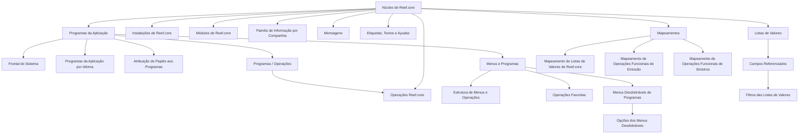

# Configuração de Programas, Menus, Mensagens, Etiquetas, Textos, Ayudas e Catálogos no Reef.core

## 1. Metadados do Documento
- **Arquivo de Origem:** `Não identificado no conteúdo fornecido`
- **Tipo de Documento:** `Procedimento / Documentação funcional`
- **Domínio / Sistema:** `Reef.core`
- **Público-Alvo:** `Não explicitamente identificado; o conteúdo destina-se a utilizadores responsáveis pela configuração funcional de Reef.core`
- **Data/Versão Identificada:** `Não identificada`
- **Owner identificado:** `user:agonzalez_mapfre.com`
- **Lifecycle identificado:** `Approved Source / VL`

---

## 2. Resumo Executivo & Contexto de Negócio

O documento descreve a funcionalidade corporativa de definição e configuração de programas que serão utilizados pelo frontal do sistema Reef.core. O conteúdo posiciona o núcleo de Reef.core como o componente que permite criar programas destinados ao uso no frontal do sistema.

O objetivo declarado é conhecer a relação de catálogos necessária e a ordem de configuração desses catálogos para definir e tornar plenamente operacional essa funcionalidade da ferramenta corporativa. O material apresenta, portanto, um inventário de elementos de configuração, mas não detalha procedimentos operacionais passo a passo, campos obrigatórios, interfaces, contratos ou critérios de validação.

Os elementos listados abrangem instalações e módulos de Reef.core, painéis de informação por companhia, operações Reef.core, programas e operações, programas da aplicação por idioma, atribuição de papéis aos programas e organização de programas e operações. O conteúdo também inclui menus, operações favoritas, mensagens, etiquetas, textos, ajudas, listas de valores, filtros, menus desdobráveis e mapeamentos funcionais.

O documento relaciona especificamente mapeamentos de listas de valores de Reef.core, operações funcionais de emissão e operações funcionais de sinistros. Contudo, a extração não apresenta a definição dos mapeamentos, os valores possíveis, as entidades envolvidas, regras de precedência, fluxos transacionais ou integrações técnicas.

---

## 3. Arquitetura, Componentes & Tecnologias Envolvidas

Os componentes e áreas funcionais explicitamente citados são:

- **Núcleo de Reef.core:** permite criar programas para uso no frontal do sistema.
- **Frontal do Sistema:** destino de utilização dos programas criados no núcleo de Reef.core.
- **Instalações de Reef.core:** catálogo citado para configuração.
- **Módulos de Reef.core:** catálogo citado para configuração.
- **Painéis de Informação por Companhia:** elemento de configuração por companhia.
- **Operações Reef.core:** operações associadas ao ecossistema Reef.core.
- **Programas / Operações:** relação funcional citada no catálogo.
- **Programas da Aplicação:** programas configuráveis na aplicação.
- **Programas da Aplicação por Idioma:** programas associados a idioma.
- **Atribuição de Papéis aos Programas da Aplicação:** associação entre papéis e programas.
- **Programas Reef.core / Operações Reef.core:** relação entre programas e operações.
- **Organização de Programas e Operações:** estrutura organizacional de programas e operações.
- **Menus e Programas:** estrutura de menus, operações e programas.
- **Mensagens:** mensagens do sistema.
- **Etiquetas, Textos e Ayudas:** elementos textuais da interface Reef.core.
- **Listas de Valores:** listas, opções, campos referenciados e filtros.
- **Menus Desdobráveis de Programas:** menus e respetivas opções.
- **Opções de Programas do Menu:** opções associadas a programas no menu.
- **Mapeamentos Funcionais:** listas de valores Reef.core, emissão e sinistros.



> **Nota de Análise:** O conteúdo não descreve arquitetura de infraestrutura, microsserviços, protocolos, URLs, ambientes, bases de dados, métodos HTTP, contratos JSON, versões tecnológicas ou mecanismos de autenticação.

---

## 4. Regras de Negócio, Especificações Funcionais & Processos

### 4.1 Objetivo funcional identificado

O núcleo de Reef.core permite criar programas para utilização no frontal do sistema. Para que esta funcionalidade esteja plenamente operativa, o documento indica a necessidade de conhecer:

1. A relação de catálogos a configurar.
2. A ordem de configuração desses catálogos.
3. Os elementos funcionais relacionados com programas, operações, menus, mensagens, textos, listas de valores e mapeamentos.

### 4.2 Catálogos e elementos de configuração listados

A relação de catálogos apresentada no conteúdo é:

1. Instalações de Reef.core.
2. Módulos de Reef.core.
3. Painéis de Informação por Companhia.
4. Operações Reef.core.
5. Programas / Operações.
6. Programas da Aplicação.
7. Programas da Aplicação por Idioma.
8. Atribuição de Papéis aos Programas da Aplicação.
9. Programas Reef.core / Operações Reef.core.
10. Organização de Programas e Operações.

### 4.3 Menus e programas

O documento identifica os seguintes tópicos relativos à estrutura de menus e programas:

- Menus e Programas.
- Estrutura de Menus e Operações de Reef.core.
- Operações Favoritas em Reef.core.
- Menus Desdobráveis de Programas.
- Opções dos Menus Desdobráveis.
- Opções de Programas do Menu.

### 4.4 Elementos textuais e de interface

O conteúdo lista elementos de interface e comunicação apresentados em Reef.core:

- Mensagens.
- Etiquetas e Textos.
- Etiquetas e Ayudas.
- Textos na Interface de Reef.core.

### 4.5 Listas de valores e campos referenciados

O documento enumera os seguintes elementos associados a listas de valores:

- Listas de Valores e Opções das Listas.
- Listas de Valores.
- Opções das Listas de Valores.
- Listas de Valores e Filtros das Listas de Campos Referenciados.
- Listas de Valores de Campos Referenciados.
- Filtros das Listas de Valores de Campos Referenciados.

### 4.6 Mapeamentos funcionais

Os mapeamentos explicitamente identificados são:

- Mapeamento de Listas de Valores de Reef.core.
- Mapeamento de Operações Funcionais de Emissão.
- Mapeamento de Operações Funcionais de Sinistros.

> **Nota de Análise:** O conteúdo declara que existe uma ordem de configuração dos catálogos, mas a sequência concreta dessa ordem não está apresentada na extração fornecida.  
>
> **Nota de Análise:** O conteúdo cita operações funcionais de emissão e sinistros, mas não detalha regras de negócio, condições, estados, operações específicas, campos, entradas, saídas ou comportamentos associados.

---

## 5. Tabelas de Parâmetros, Ambientes e Estruturas de Dados

| Item / Parâmetro | Descrição / Função | Tipo / Valores / Formato | Ambiente / Observações |
| :--- | :--- | :--- | :--- |
| Núcleo de Reef.core | Permite criar programas para uso no frontal do sistema. | Componente / núcleo do sistema | Não são apresentados detalhes técnicos adicionais. |
| Programas da Aplicação | Programas configuráveis na aplicação. | Catálogo funcional | O documento não especifica atributos, identificadores ou operações disponíveis. |
| Programas da Aplicação por Idioma | Programas da aplicação associados a idioma. | Catálogo funcional | Idiomas e regras de seleção não são detalhados. |
| Atribuição de Papéis aos Programas da Aplicação | Associação de papéis a programas da aplicação. | Configuração de papéis | Papéis, permissões e critérios de acesso não são especificados. |
| Operações Reef.core | Operações pertencentes a Reef.core. | Catálogo funcional | Não há lista de operações, métodos ou contratos. |
| Programas / Operações | Relação entre programas e operações. | Relação funcional | Cardinalidade e regras de associação não são apresentadas. |
| Programas Reef.core / Operações Reef.core | Relação explicitamente citada entre programas e operações Reef.core. | Relação funcional | Sem detalhamento de configuração. |
| Organização de Programas e Operações | Organização de programas e operações. | Estrutura organizacional | Hierarquia e critérios organizacionais não são detalhados. |
| Instalações de Reef.core | Catálogo listado como parte da configuração. | Catálogo | Valores e procedimento não informados. |
| Módulos de Reef.core | Catálogo listado como parte da configuração. | Catálogo | Módulos disponíveis não são identificados. |
| Painéis de Informação por Companhia | Painéis organizados por companhia. | Configuração funcional | Companhias, conteúdo dos painéis e regras de exibição não são informados. |
| Estrutura de Menus e Operações de Reef.core | Estrutura de menus e operações. | Estrutura de interface | Sem definição de níveis, rotas ou permissões. |
| Operações Favoritas em Reef.core | Operações classificadas como favoritas. | Configuração de interface | Critérios de seleção ou persistência não são informados. |
| Mensagens | Mensagens do sistema. | Elemento de interface | Catálogo, códigos, idiomas e severidade não detalhados. |
| Etiquetas e Textos | Etiquetas e textos da interface. | Elemento de interface | Não são apresentados valores, chaves ou localização. |
| Etiquetas e Ayudas | Etiquetas e ajudas associadas à interface. | Elemento de interface | Conteúdo e mecanismo de exibição não especificados. |
| Textos na Interface de Reef.core | Textos apresentados na interface Reef.core. | Elemento de interface | Idiomas, localização e manutenção não detalhados. |
| Listas de Valores | Listas de valores utilizadas na configuração. | Estrutura de dados funcional | Sem campos, tipos, valores ou origem dos dados. |
| Opções das Listas de Valores | Opções pertencentes às listas de valores. | Estrutura de dados funcional | Sem regras de ordenação, ativação ou validação. |
| Listas de Valores de Campos Referenciados | Listas de valores associadas a campos referenciados. | Estrutura de dados funcional | Campos referenciados não são identificados. |
| Filtros das Listas de Valores de Campos Referenciados | Filtros aplicáveis a listas de valores de campos referenciados. | Regra de filtragem | Critérios e expressões de filtro não são informados. |
| Menus Desdobráveis de Programas | Menus desdobráveis associados a programas. | Elemento de interface | Sem estrutura, comportamento ou regras de visibilidade. |
| Opções dos Menus Desdobráveis | Opções disponíveis nos menus desdobráveis. | Elemento de interface | Opções concretas não são apresentadas. |
| Opções de Programas do Menu | Opções de programas no menu. | Configuração de menu | Sem associação detalhada entre programa e opção. |
| Mapeamento de Listas de Valores de Reef.core | Mapeamento de listas de valores. | Mapeamento funcional | Regras e origem/destino do mapeamento não são apresentados. |
| Mapeamento de Operações Funcionais de Emissão | Mapeamento de operações funcionais de emissão. | Mapeamento funcional | Operações de emissão não são especificadas. |
| Mapeamento de Operações Funcionais de Sinistros | Mapeamento de operações funcionais de sinistros. | Mapeamento funcional | Operações de sinistros não são especificadas. |
| Owner | Responsável identificado na página de documentação. | `user:agonzalez_mapfre.com` | Apresentado no conteúdo bruto. |
| Lifecycle | Estado do conteúdo na documentação. | `Approved Source / VL` | Significado de `VL` não é explicado no documento. |

---

## 6. Bateria de Perguntas & Respostas para RAG (FAQ Sintético)

### P1: Qual é o objetivo do núcleo de Reef.core descrito no documento?
**R:** O núcleo de Reef.core permite criar programas para serem utilizados desde o frontal do sistema. O documento enquadra essa capacidade como parte de uma funcionalidade corporativa que requer configuração de catálogos relacionados.

### P2: Qual é o objetivo da documentação sobre programas, menus, mensagens e textos em Reef.core?
**R:** O objetivo declarado é conhecer a relação de catálogos que devem ser configurados e a ordem da respetiva configuração para definir e tornar plenamente operativa a funcionalidade corporativa relacionada a programas no Reef.core.

### P3: Quais catálogos são citados para a configuração de programas no Reef.core?
**R:** São citados Instalações de Reef.core, Módulos de Reef.core, Painéis de Informação por Companhia, Operações Reef.core, Programas / Operações, Programas da Aplicação, Programas da Aplicação por Idioma, Atribuição de Papéis aos Programas da Aplicação, Programas Reef.core / Operações Reef.core e Organização de Programas e Operações.

### P4: O documento define a ordem exata de configuração dos catálogos de Reef.core?
**R:** Não. O documento declara que é necessário conhecer a ordem de configuração dos catálogos, mas a extração fornecida não apresenta a sequência concreta dos passos de configuração.

### P5: O que o documento informa sobre programas da aplicação por idioma?
**R:** O documento lista “Programas da Aplicação por Idioma” como um catálogo ou tópico de configuração. Contudo, não especifica idiomas suportados, campos de tradução, regras de fallback, critérios de seleção ou comportamento da interface.

### P6: Como são tratadas as permissões ou os papéis associados aos programas da aplicação?
**R:** O documento cita “Atribuição de Papéis aos Programas da Aplicação”. No entanto, não detalha quais papéis existem, quais permissões cada papel concede, como a associação é configurada ou como ocorre a validação de acesso.

### P7: Que elementos de menu são abordados na documentação de Reef.core?
**R:** O conteúdo inclui Menus e Programas, Estrutura de Menus e Operações de Reef.core, Operações Favoritas em Reef.core, Menus Desdobráveis de Programas, Opções dos Menus Desdobráveis e Opções de Programas do Menu.

### P8: Quais recursos de mensagens e textos de interface são mencionados?
**R:** São mencionados Mensagens, Etiquetas e Textos, Etiquetas e Ayudas e Textos na Interface de Reef.core. A extração não descreve códigos de mensagem, severidades, chaves de tradução, formatos ou mecanismos de manutenção desses elementos.

### P9: O que são as listas de valores mencionadas no conteúdo?
**R:** O documento lista Listas de Valores, Opções das Listas de Valores, Listas de Valores de Campos Referenciados e Filtros das Listas de Valores de Campos Referenciados. Não são fornecidos os valores concretos, a estrutura de campos, a origem dos dados ou regras de filtragem.

### P10: Quais mapeamentos funcionais são citados para Reef.core?
**R:** São citados Mapeamento de Listas de Valores de Reef.core, Mapeamento de Operações Funcionais de Emissão e Mapeamento de Operações Funcionais de Sinistros.

### P11: O documento descreve as operações funcionais de emissão e sinistros?
**R:** Não. O documento apenas cita os mapeamentos de operações funcionais de emissão e de sinistros. Não apresenta operações específicas, fluxos, eventos, regras, entradas, saídas ou contratos associados.

### P12: Existem detalhes técnicos de integração, como APIs, URLs, portas ou contratos JSON?
**R:** Não. A extração não apresenta APIs, URLs, portas, microsserviços, protocolos, contratos JSON, ambientes, versões ou especificações de integração técnica.

---

## 7. Glossário de Termos, Siglas & Conceitos-Chave

- **Reef.core:** Sistema ou núcleo corporativo citado no documento; permite criar programas para utilização no frontal do sistema.
- **Núcleo de Reef.core:** Componente de Reef.core responsável, conforme o texto, por permitir a criação de programas.
- **Frontal do Sistema:** Camada ou interface do sistema onde os programas criados no núcleo de Reef.core serão utilizados.
- **Programa da Aplicação:** Programa configurável na aplicação, citado como elemento de catálogo.
- **Operação Reef.core:** Operação associada ao sistema Reef.core.
- **Programa / Operação:** Relação funcional entre programas e operações, sem regras detalhadas na extração.
- **Papel:** Elemento associado a programas da aplicação na funcionalidade de atribuição de papéis.
- **Painel de Informação por Companhia:** Painel de informação organizado por companhia.
- **Operação Favorita:** Operação identificada como favorita em Reef.core; o critério de favoritismo não é detalhado.
- **Etiqueta:** Elemento textual de interface citado no conteúdo.
- **Ayuda:** Termo em espanhol para ajuda; citado como elemento associado a etiquetas.
- **Lista de Valores:** Estrutura funcional que agrupa valores e opções.
- **Campo Referenciado:** Campo associado a listas de valores referenciados; a definição técnica não é apresentada.
- **Filtro de Lista de Valores:** Filtro aplicável a listas de valores de campos referenciados.
- **Menu Desdobrável:** Menu expansível associado a programas.
- **Emissão:** Domínio funcional mencionado apenas no contexto de mapeamento de operações funcionais.
- **Sinistros:** Domínio funcional mencionado apenas no contexto de mapeamento de operações funcionais.
- **Lifecycle:** Campo apresentado na documentação com o valor `Approved Source / VL`.
- **VL:** Sigla apresentada no campo Lifecycle; o significado não é definido no conteúdo fornecido.

---

## 8. Notas Críticas, Riscos & Limitações

- O conteúdo identifica a necessidade de uma ordem de configuração dos catálogos, mas não apresenta essa ordem. Isso impede derivar um procedimento operacional completo apenas a partir da extração.
- Não há descrição de campos, formatos, chaves, valores permitidos, critérios de obrigatoriedade, validações ou mensagens de erro para nenhum catálogo listado.
- A atribuição de papéis aos programas é citada, mas o modelo de autorização, os papéis existentes, as permissões e as regras de acesso não são detalhados.
- Os tópicos de listas de valores e filtros são enumerados sem informar estruturas de dados, fontes, critérios de filtro ou relações entre campos.
- Os mapeamentos funcionais de emissão e sinistros são apenas mencionados; não há especificação das operações mapeadas ou dos respetivos comportamentos.
- Não são apresentados ambientes, servidores, URLs, APIs, portas, tecnologias de infraestrutura, bases de dados, mecanismos de autenticação ou contratos de integração.
- Não há versão identificada do documento, data de publicação ou nome de arquivo de origem no conteúdo fornecido.
- A expressão `Approved Source / VL` aparece como Lifecycle, mas o significado operacional de `VL` não é explicado.

---

## 9. Conteúdo Bruto Estruturado (Referência Fiel)

```text
--- [PÁGINA 1 DE 2] ---

DEFINICIÓN de PROGRAMAS, MENÚS, MENSAJES, ETIQUETAS,
TEXTOS, AYUDAS, ...
Contexto
El Núcleo de Reef.core permite crear Programas para ser utilizados desde el Frontal del Sistema.
Objetivo
Conocer la relación de Catálogos que se deben congurar y el orden en su conguración para denir y tener plenamente operativa esta
funcionalidad de las herramienta Corporativa.
Catálogos
Instalaciones de Reef.core
Módulos de Reef.core
Paneles de Información por Compañía
Operaciones Reef.core
Programas / Operaciones
Programas de la Aplicación
Programas de la Aplicación por Idioma
Asignación de Roles a los Programas de la Aplicación
Programas Reef.core / Operaciones Reef.core
Organización de Programas y Operaciones
Documentation / DOCUMENTACIÓN Reef
DOCUMENTACIÓN Reef
Mapfredocument
DOCUMENTACIÓN Reef
Owner
user:agonzalez_mapfre.com
Lifecycle
Approved Source
 /
VL
Buscar Inicio Soluciones Arquitecturas APIs Componentes Cloud Documentación Zeus Reef Ayuda
ES


--- [PÁGINA 2 DE 2] ---

Menús y Programas
Estructura de Menús y Operaciones de Reef.core
Operaciones Favoritas en Reef.core
Mensajes
Mensajes
Etiquetas y Textos
Etiquetas y Ayudas
Textos en la Interfaz de Reef.core
Listas de Valores y Opciones de las Listas
Listas de Valores
Opciones de las Listas de Valores
Listas de Valores y Filtros de las Listas de Campos Referenciados
Listas de Valores de Campos Referenciados
Filtros de las Listas de Valores de Campos Referenciados
Menús Desplegables de Programas
Menús Desplegables de Programas
Opciones de los Menús Desplegables
Misceláneos
Opciones de Programas del Menú
Mapeo Listas de Valores de Reef.core
Mapeo Operaciones Funcionales Emisión
Mapeo Operaciones Funcionales Siniestros
```
