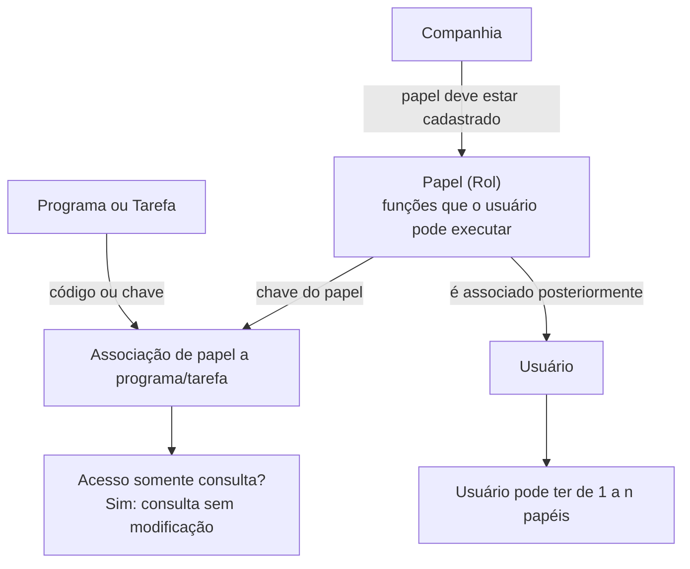

# Associação de Papéis a Programas ou Tarefas no Sistema Reef.core

## 1. Metadados do Documento
- **Arquivo de Origem:** Não identificado no conteúdo extraído
- **Tipo de Documento:** Procedimento
- **Domínio / Sistema:** Reef.core / DOCUMENTACIÓN Reef / Mapfre
- **Público-Alvo:** Administradores de acesso, operação e usuários responsáveis pela manutenção de permissões
- **Data/Versão Identificada:** Não identificada
- **Lifecycle Identificado:** Approved Source / VL
- **Owner Identificado:** `user:agonzalez_mapfre.com`

---

## 2. Resumo Executivo & Contexto de Negócio

O documento descreve o processo de associação de papéis (*roles*) a programas ou tarefas existentes no sistema Reef.core. O objetivo declarado é explicar como os papéis de acesso são vinculados aos programas do sistema, permitindo definir quais programas ou tarefas cada papel corporativo pode executar ou consultar.

O modelo de autorização apresentado utiliza o papel como representação da função desempenhada por uma pessoa na empresa ou organização. No Reef.core, um papel define as funções que um usuário pode realizar e executar no sistema. Antes de associar um papel a um programa ou tarefa, o papel precisa estar previamente cadastrado no nível da companhia.

Após a definição dos papéis e dos programas aos quais cada papel pode acessar, os papéis são associados a usuários. Um usuário pode possuir de um a múltiplos papéis, possibilitando compor permissões conforme a necessidade operacional. Como exemplo, um usuário tramitador pode receber simultaneamente o papel de tramitador e o papel de consultas gerais.

O documento também define uma modalidade de acesso exclusivamente consultiva. Quando o atributo “¿Acceso sólo Consulta?” é afirmativo, o papel acessa o programa somente em modo consulta e não pode modificar informações.

---

## 3. Arquitetura, Componentes & Tecnologias Envolvidas

Os elementos funcionais identificados no documento são:

- **Reef.core:** Sistema no qual os papéis representam as funções que um usuário pode realizar e executar.
- **Companhia:** Escopo no qual um papel deve estar cadastrado antes de receber associações com programas ou tarefas.
- **Papel / Rol:** Chave de autorização vinculada à função de uma pessoa na organização.
- **Programa:** Programa do sistema ao qual um papel recebe acesso.
- **Tarefa:** Unidade funcional que também pode ser associada a um papel.
- **Usuário:** Entidade que recebe de um a múltiplos papéis.
- **Acesso somente consulta:** Restrição que permite consultar um programa, mas impede a modificação de informações.



> **Nota de Análise:** O documento não detalha interfaces de administração, métodos HTTP, contratos JSON, banco de dados, integrações externas, tecnologias de implementação ou mecanismos técnicos de autenticação.

---

## 4. Regras de Negócio, Especificações Funcionais & Processos

### 4.1. Definição de permissões por papel

1. O sistema permite definir, para cada papel da companhia, quais programas ou tarefas podem ser executados ou consultados.
2. Um papel está vinculado à função que uma pessoa desempenha na empresa ou organização.
3. No Reef.core, o papel representa as funções que um usuário pode realizar e executar no sistema.
4. O papel utilizado na associação deve estar previamente cadastrado no nível da companhia.

### 4.2. Associação entre papel e programa ou tarefa

1. O atributo **Rol** contém a chave do papel ao qual será atribuído um programa ou tarefa.
2. O atributo **Programa** contém o código ou a chave do programa ou da tarefa que será atribuída ao papel.
3. A manutenção de associação deve vincular um papel cadastrado a um programa ou tarefa identificada por código ou chave.

### 4.3. Regra de acesso somente consulta

1. O atributo **¿Acceso sólo Consulta?** determina se o acesso ao programa será restrito à consulta.
2. Quando o atributo possui valor afirmativo, o papel pode acessar o programa apenas em modo consulta.
3. Na modalidade de acesso somente consulta, o usuário não pode modificar informações no programa.

### 4.4. Associação de papéis a usuários

1. Após a definição dos papéis e dos programas acessíveis por cada papel, os papéis devem ser associados aos usuários.
2. Um usuário pode possuir de **1 a n papéis**.
3. Um usuário pode receber múltiplos papéis para combinar permissões funcionais.

### 4.5. Exemplos funcionais documentados

- O **papel de tramitador** possui todos os programas de sinistros atribuídos.
- O **papel de consultas gerais** possui todas as consultas de apólices, consultas de recibos e consultas de ordens de pagamento atribuídas.
- O **papel de emissor** possui todos os programas de emissão e suplementos atribuídos.
- Um usuário que atuará como tramitador pode possuir simultaneamente o **papel de tramitador** e o **papel de consultas gerais**.

---

## 5. Tabelas de Parâmetros, Ambientes e Estruturas de Dados

| Item / Parâmetro | Descrição / Função | Tipo / Valores / Formato | Ambiente / Observações |
| :--- | :--- | :--- | :--- |
| Rol | Contém a chave do papel ao qual será atribuído um programa ou tarefa. | Chave de papel | O papel deve estar cadastrado no nível da companhia. |
| Programa | Contém o código ou a chave do programa ou tarefa associada ao papel. | Código ou chave de programa/tarefa | Pode representar um programa ou uma tarefa. |
| ¿Acceso sólo Consulta? | Define se o acesso ao programa será exclusivamente em modo consulta. | Afirmativo ou não afirmativo, conforme o texto | Quando afirmativo, não é permitida a modificação de informações. |
| Papel de tramitador | Papel associado a programas de sinistros. | Papel funcional | O texto informa que terá atribuídos todos os programas de sinistros. |
| Papel de consultas gerais | Papel associado a consultas funcionais. | Papel funcional | Inclui consultas de apólices, recibos e ordens de pagamento. |
| Papel de emissor | Papel associado a programas de emissão e suplementos. | Papel funcional | O texto menciona programas de emissão e suplementos. |
| Usuário | Entidade à qual os papéis são associados. | De 1 a n papéis por usuário | A associação ocorre após a definição de papéis e programas acessíveis. |
| Companhia | Escopo organizacional de cadastro do papel. | Organização/companhia | O papel deve estar dado de alta nesse nível antes da associação. |
| Reef.core | Sistema em que o papel representa funções executáveis pelo usuário. | Sistema | Não há detalhamento técnico adicional sobre a plataforma. |

---

## 6. Bateria de Perguntas & Respostas para RAG (FAQ Sintético)

### P1: Qual é o objetivo da associação de papéis a programas no Reef.core?
**R:** O objetivo é definir quais programas ou tarefas cada papel da companhia pode executar ou consultar no sistema. Posteriormente, esses papéis são associados aos usuários para conceder as permissões correspondentes.

### P2: O que representa um papel no sistema Reef.core?
**R:** No Reef.core, o conceito de papel está vinculado à função que uma pessoa desempenha na empresa ou organização. O papel representa as funções que um usuário pode realizar e executar no sistema.

### P3: Um papel pode ser associado a um programa antes de estar cadastrado na companhia?
**R:** Não. O documento estabelece que o papel informado no atributo “Rol” precisa estar previamente cadastrado no nível da companhia antes de receber a associação com um programa ou tarefa.

### P4: Qual informação deve ser informada no atributo “Rol”?
**R:** O atributo “Rol” deve conter a chave do papel ao qual será atribuído um programa ou uma tarefa.

### P5: Qual informação deve ser informada no atributo “Programa”?
**R:** O atributo “Programa” deve conter o código ou a chave do programa ou da tarefa que será associada ao papel.

### P6: O que ocorre quando “¿Acceso sólo Consulta?” é afirmativo?
**R:** Quando o atributo “¿Acceso sólo Consulta?” é afirmativo, o acesso ao programa é permitido somente em modo consulta. Nessa condição, o usuário não pode modificar informações.

### P7: Um usuário pode possuir mais de um papel no Reef.core?
**R:** Sim. O documento informa que um usuário pode ter associados de 1 a n papéis. Isso permite combinar permissões de diferentes funções no mesmo usuário.

### P8: Quais permissões são citadas para o papel de tramitador?
**R:** O papel de tramitador tem atribuídos todos os programas de sinistros, conforme o exemplo apresentado no documento.

### P9: Quais consultas são atribuídas ao papel de consultas gerais?
**R:** O papel de consultas gerais possui todas as consultas de apólices, consultas de recibos e consultas de ordens de pagamento.

### P10: Quais programas são atribuídos ao papel de emissor?
**R:** O papel de emissor possui todos os programas de emissão e suplementos.

### P11: Como um usuário tramitador pode receber permissões de consulta adicionais?
**R:** O documento apresenta o exemplo de um usuário tramitador que pode ter associados simultaneamente o papel de tramitador e o papel de consultas gerais.

### P12: O documento especifica APIs, métodos HTTP ou contratos de integração para a manutenção de papéis?
**R:** Não. O documento descreve conceitos funcionais de associação entre papéis, programas, tarefas e usuários, mas não detalha APIs, métodos HTTP, contratos JSON ou integrações técnicas.

---

## 7. Glossário de Termos, Siglas & Conceitos-Chave

- **Reef.core:** Sistema no qual os papéis representam as funções que um usuário pode realizar e executar.
- **Rol / Papel:** Conceito vinculado à função que uma pessoa desempenha na empresa ou organização; define funções e permissões de execução ou consulta no sistema.
- **Programa:** Elemento identificado por código ou chave que pode ser associado a um papel.
- **Tarefa:** Elemento funcional que pode ser associado a um papel, assim como um programa.
- **Companhia:** Escopo organizacional no qual o papel deve estar cadastrado.
- **Usuário:** Entidade que recebe um ou mais papéis após a definição de suas permissões.
- **Acesso somente consulta:** Modalidade que permite acessar um programa para consulta, sem autorização para modificar informações.
- **Sinistros:** Área funcional citada como associada aos programas atribuídos ao papel de tramitador.
- **Apólices:** Objeto de consulta citado nas permissões do papel de consultas gerais.
- **Recibos:** Objeto de consulta citado nas permissões do papel de consultas gerais.
- **Ordens de pagamento:** Objeto de consulta citado nas permissões do papel de consultas gerais.
- **Suplementos:** Programas citados como atribuídos ao papel de emissor.

---

## 8. Notas Críticas, Riscos & Limitações

- O documento não identifica o nome do arquivo de origem, data, versão formal ou autor em formato completo; apenas apresenta o campo de owner como `user:agonzalez_mapfre.com`.
- Não há especificação dos valores aceitos pelo atributo “¿Acceso sólo Consulta?” além da condição “afirmativo”.
- O documento não detalha o comportamento quando o atributo de consulta não é afirmativo.
- Não são descritos fluxos de aprovação, auditoria, segregação de funções, expiração de permissões ou processo de remoção de associações.
- Não são fornecidos detalhes sobre interfaces, APIs, persistência de dados, autenticação, autorização técnica ou logs.
- Não há definição técnica dos programas, tarefas, sinistros, emissão ou suplementos citados nos exemplos.
- O documento utiliza exemplos de atribuição de permissões, mas não informa se os papéis possuem herança, conflitos de permissão ou prioridades entre múltiplos papéis.

---

## 9. Conteúdo Bruto Estruturado (Referência Fiel)

```text
--- [PÁGINA 1 DE 2] ---

ASIGNACIÓN de Roles a Programas
Objetivo
El objetivo es explicar como se asocian a los diferentes programas existentes en el Sistema sus roles de acceso. El sistema permite denir
para cada rol de la compañía qué programas o tareas puede ejecutar o consultar.
Posteriormente a la denición de los roles y de los programas a los que pueden acceder cada rol, esos roles se asociarán a un usuario. Un
usuario puede tener asociado de 1 a n roles.
Ejemplos:
Rol de tramitador tendrá asignado todos los programas de siniestros.
Rol de consultas generales tendrá asignado todos las consultas de pólizas, consulta de recibos, consulta de órdenes de pago.
Rol de emisor tendrá asignado todos los programas de emisión, suplementos....
Posteriormente un usuario que va a ser tramitador podría tener asociado el Rol de tramitador + el Rol de consultas Generales.
Mantenimiento Asociación de roles a un programa o tarea
Documentation / DOCUMENTACIÓN Reef
DOCUMENTACIÓN Reef
Mapfredocument
DOCUMENTACIÓN Reef
Owner
user:agonzalez_mapfre.com
Lifecycle
Approved Source
 / 
 VL
Buscar Inicio Soluciones Arquitecturas APIs Componentes Cloud Documentación Zeus Reef Ayuda
ES


--- [PÁGINA 2 DE 2] ---

Propiedades
Rol
El concepto del Rol está vinculado a la función que una Persona desempeña en la empresa u organización en Reef.core se reere a las
funciones que un Usuario puede realizar y ejecutar en el Sistema.
Este atributo contiene la clave del rol al cual se le va a asignar un programa o tarea. Ese rol tiene que estar dado de alta a nivel de compañía.
Programa
Este atributo contendrá el código o clave del programa o de una tarea a la cual se está asignando al rol.
¿Acceso sólo Consulta?
Este atributo si es armativo, lo que está indicando es que se va a tener acceso al programa sólo en modo consulta, no va a poder modicar
información.
```
