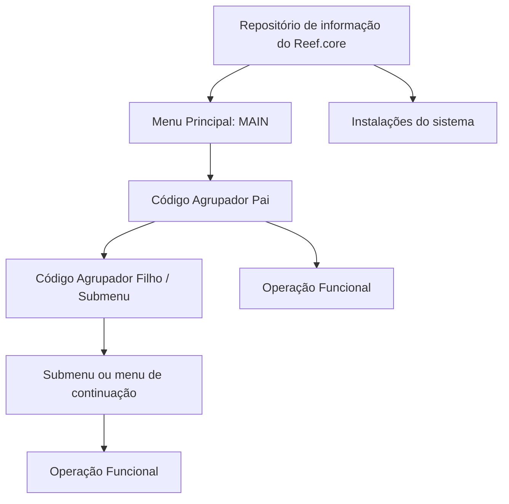

# Definição da Estrutura de Menus do Reef.core

## 1. Metadados do Documento
- **Arquivo de Origem:** Não identificado — conteúdo bruto fornecido na solicitação
- **Tipo de Documento:** Especificação Técnica / Funcional
- **Domínio / Sistema:** Reef.core
- **Público-Alvo:** Responsáveis pela configuração de catálogos e estrutura de menus do Reef.core
- **Data/Versão Identificada:** Não identificada

---

## 2. Resumo Executivo & Contexto de Negócio

O documento define a estrutura do catálogo de menus no âmbito do Reef.core. A finalidade declarada é agrupar e organizar os programas da aplicação que os usuários da companhia podem executar, desde que possuam permissões para isso. A estrutura busca agilizar e facilitar a experiência do usuário.

Funcionalmente, o Reef.core permite configurar a relação de menus e as operações contidas nesses menus em um mesmo repositório de informação. Esse repositório é entregue às instalações com o conteúdo necessário para o funcionamento correto do sistema.

A estrutura é hierárquica e recursiva. O menu principal possui valor constante `MAIN`; a partir dele podem ser configurados submenus ou menus de continuação. Esses elementos exibem funções mais específicas das operações a realizar.

A configuração requer atenção ao atributo de ordenação. Ao incluir um novo registro antes de uma agrupação ou operação já existente, deve-se modificar a ordem dos registros existentes. Além disso, as instalações existentes devem ser obrigatoriamente respeitadas, pois o catálogo integra o núcleo do Reef.core.

---

## 3. Arquitetura, Componentes & Tecnologias Envolvidas

Os elementos identificados são:

- **Reef.core:** Sistema no qual a estrutura de menus é configurada.
- **Catálogo de menus:** Repositório de informação que concentra menus e operações.
- **Menu principal:** Raiz da estrutura, com valor constante `MAIN`.
- **Código agrupador pai:** Código que determina o menu.
- **Código agrupador filho ou operação funcional:** Pode representar um submenu/menu de continuação associado ao pai ou uma operação funcional final.
- **Instalações:** Recebem o repositório com o conteúdo necessário ao funcionamento do sistema.
- **Catálogos do sistema:** Utilizam a estrutura configurada; determinados códigos de segundo nível podem ser inabilitados para uso nessa configuração.



**Nota de Análise:** O documento descreve a hierarquia funcional do catálogo de menus, mas não detalha tecnologias de implementação, banco de dados, APIs, métodos HTTP, contratos JSON, servidores ou ambientes técnicos.

---

## 4. Regras de Negócio, Especificações Funcionais & Processos

### Finalidade do catálogo de menus

1. O catálogo de menus do Reef.core agrupa e organiza os programas da aplicação.
2. Os usuários da companhia podem executar programas apenas quando possuem permissões para isso.
3. A organização dos menus tem como objetivo agilizar e facilitar a experiência do usuário.
4. Menus e operações são configurados em um único repositório de informação.
5. O repositório é entregue às instalações com o conteúdo necessário ao correto funcionamento do sistema.

### Estrutura hierárquica de menus

1. O atributo **Companhia** contém o código da companhia para a qual está sendo configurada a estrutura de menus do Reef.core.
2. O atributo **Código Agrupador Pai** determina o código do menu.
3. O nome do menu principal da aplicação possui o valor constante `MAIN`.
4. A partir do menu principal podem ser configurados submenus ou menus de continuação, quando necessário.
5. Submenus e menus de continuação procedem do menu principal.
6. Submenus e menus de continuação exibem funções mais específicas das operações a realizar.
7. A configuração possui comportamento recursivo.
8. O atributo **Código Agrupador Filho ou Operação Funcional** pode determinar:
   - o código agrupador de um submenu ou menu de continuação associado ao código agrupador pai; ou
   - a operação funcional final.
9. O atributo **Ordem** determina a sequência em que o código agrupador filho ou a operação funcional será exibido na interface.

### Regra de ordenação

1. A inclusão de um novo registro que deva ser exibido antes de uma agrupação ou operação existente exige cuidado especial.
2. Quando o novo registro for posicionado antes de registros existentes, a ordem dos demais registros deve ser modificada.

### Regra de inabilitação

1. A propriedade **Inabilitação** estabelece que o código de segundo nível da estrutura está inabilitado.
2. Um código de segundo nível inabilitado não pode ser empregado na configuração dos catálogos do sistema.

### Restrição sobre instalações

1. As instalações existentes devem ser obrigatoriamente respeitadas.
2. A justificativa apresentada é que o catálogo é parte do núcleo do Reef.core.

---

## 5. Tabelas de Parâmetros, Ambientes e Estruturas de Dados

| Item / Parâmetro | Descrição / Função | Tipo / Valores / Formato | Ambiente / Observações |
| :--- | :--- | :--- | :--- |
| Companhia | Contém o código da companhia sobre a qual a configuração da estrutura de menus do Reef.core está sendo realizada. | Código de companhia; formato não detalhado. | Aplicável à configuração da estrutura de menus. |
| Código Agrupador Pai | Determina o código do menu. | Código agrupador; formato não detalhado. | O menu principal possui valor constante `MAIN`. |
| Menu Principal | Raiz da estrutura de menus da aplicação. | Valor constante: `MAIN`. | Pode originar submenus ou menus de continuação. |
| Código Agrupador Filho | Determina o código agrupador de submenu ou menu de continuação associado ao código agrupador pai. | Código agrupador; formato não detalhado. | Pode representar níveis subsequentes da estrutura recursiva. |
| Operação Funcional | Pode ser determinada pelo atributo “Código Agrupador Filho ou Operação Funcional”. | Operação funcional; formato não detalhado. | Representa a função final exibida na estrutura. |
| Ordem | Define a posição de exibição do código agrupador filho ou da operação funcional na interface. | Ordem; formato não detalhado. | A inserção de um novo registro antes de outro exige reordenar os registros existentes. |
| Inabilitação | Estabelece que o código de segundo nível está inabilitado para utilização. | Propriedade de inabilitação; valores não detalhados. | Impede o uso do código na configuração dos catálogos do sistema. |
| Repositório de informação | Centraliza a relação de menus e suas operações. | Repositório; tecnologia não detalhada. | É entregue às instalações com o conteúdo necessário ao funcionamento do sistema. |
| Instalações existentes | Instalações que devem ser obrigatoriamente respeitadas. | Não detalhado. | A restrição existe porque o catálogo integra o núcleo do Reef.core. |

---

## 6. Bateria de Perguntas & Respostas para RAG (FAQ Sintético)

### P1: Qual é a finalidade do catálogo de menus no Reef.core?
**R:** O catálogo de menus do Reef.core permite agrupar e organizar os programas da aplicação que os usuários da companhia podem executar, desde que tenham permissões para isso. A finalidade é agilizar e facilitar a experiência do usuário.

### P2: Onde são configurados os menus e as operações do Reef.core?
**R:** Menus e operações são configurados em um mesmo repositório de informação. Esse repositório é entregue às instalações com o conteúdo necessário para o correto funcionamento do sistema.

### P3: Qual é o valor do menu principal da aplicação Reef.core?
**R:** O nome do menu principal da aplicação possui o valor constante `MAIN`.

### P4: O que o atributo Código Agrupador Pai representa?
**R:** O atributo Código Agrupador Pai determina o código do menu na estrutura de menus do Reef.core.

### P5: O que pode ser definido pelo atributo Código Agrupador Filho ou Operação Funcional?
**R:** Esse atributo pode definir o código agrupador de um submenu ou menu de continuação associado ao código agrupador pai. Alternativamente, pode definir a operação funcional final.

### P6: Como funcionam os submenus e menus de continuação no Reef.core?
**R:** Submenus ou menus de continuação podem ser configurados a partir do menu principal quando necessário. Eles procedem do menu principal, exibem funções mais específicas das operações a realizar e seguem uma forma de atuação recursiva.

### P7: Para que serve o atributo Ordem na estrutura de menus?
**R:** O atributo Ordem determina a sequência em que o código agrupador filho ou a operação funcional é exibido na interface.

### P8: O que deve ser feito ao inserir um registro antes de uma agrupação ou operação existente?
**R:** Deve-se modificar a ordem dos demais registros existentes, pois o novo registro precisa ser visualizado antes da agrupação ou operação já cadastrada.

### P9: Qual é o efeito da propriedade Inabilitação?
**R:** A propriedade Inabilitação estabelece que o código de segundo nível da estrutura está inabilitado e não pode ser empregado na configuração dos catálogos do sistema.

### P10: Existe alguma restrição para o uso e a definição do catálogo de instalações do Reef.core?
**R:** Sim. As instalações existentes devem ser obrigatoriamente respeitadas, porque o catálogo é parte do núcleo do Reef.core.

### P11: O documento especifica APIs, métodos HTTP ou contratos JSON para o catálogo de menus?
**R:** Não. O documento descreve propriedades funcionais e regras de configuração da estrutura de menus, mas não detalha APIs, métodos HTTP, contratos JSON ou tecnologias de implementação.

---

## 7. Glossário de Termos, Siglas & Conceitos-Chave

- **Reef.core:** Sistema ao qual se aplica a definição da estrutura de menus e seus catálogos.
- **Catálogo de menus:** Estrutura que agrupa e organiza programas e operações disponíveis na aplicação.
- **Código Agrupador Pai:** Código que determina um menu.
- **Código Agrupador Filho:** Código que representa um submenu ou menu de continuação associado a um código agrupador pai.
- **Menu Principal:** Menu raiz da aplicação, identificado pelo valor constante `MAIN`.
- **Menu de continuação:** Menu procedente do menu principal, utilizado para apresentar funções mais específicas.
- **Operação Funcional:** Função final que pode ser exibida na estrutura de menus.
- **Ordem:** Atributo que define a posição de exibição de um código agrupador filho ou operação funcional na interface.
- **Inabilitação:** Propriedade que impede a utilização de um código de segundo nível na configuração dos catálogos do sistema.
- **Instalações:** Destinatárias do repositório de informação com o conteúdo necessário ao funcionamento do sistema.

---

## 8. Notas Críticas, Riscos & Limitações

- A alteração de posição de uma agrupação ou operação exige atualização da ordem dos registros existentes, criando risco de ordenação inconsistente se o reordenamento não for realizado.
- Códigos de segundo nível marcados com a propriedade de inabilitação não podem ser empregados na configuração dos catálogos do sistema.
- As instalações existentes devem ser respeitadas obrigatoriamente, pois o catálogo faz parte do núcleo do Reef.core.
- O documento menciona vínculos com “Definição Programas” e “Perguntas frequentes”, mas não fornece o conteúdo desses materiais.
- O documento não detalha formatos dos códigos, critérios de permissão, persistência do repositório, APIs, tecnologias, contratos de integração ou procedimentos operacionais de implantação.

---

## 9. Conteúdo Bruto Estruturado (Referência Fiel)

```text
--- [PÁGINA 1 DE 2] ---

DEFINICIÓN de la ESTRUCTURA de MENUS de Reef.core
Contexto
La nalidad básica de tener un catálogo de menús en el ámbito de Reef.core permite agrupar y organizar los programas de la aplicación que
pueden ejecutar los usuarios de la compañía (siempre y cuando tengan permisos para ello) agilizando y facilitando la experiencia del usuario.
Objetivo
Funcionalmente, Reef.core cuenta con la posibilidad de congurar tanto la relación de menús como las operaciones que estos contienen en
un mismo repositorio de información que se entrega a las instalaciones con el contenido necesario para el correcto funcionamiento del
Sistema.
Propiedades Operativas
Otras Propiedades
Propiedades Operativas
Compañía
Este atributo del catálogo contiene el código de la compañía sobre la que se está realizando la conguración de la estructura de Menús de
Reef.core.
Código Agrupador Padre
Esta propiedad del catálogo determina el código del Menú.
El nombre del Menú Principal de la aplicación tiene el valor constante: 'MAIN'. A partir del Menú Principal y de ser necesario, podrán
congurarse Sub menús o menús de continuación, siendo estos los que proceden del menú principal y en los que se exhiben funciones
más especícas de la operaciones a realizar siendo esta forma de actuación recursiva.
Código Agrupador Hijo u Operación Funcional
Esta propiedad del catálogo determina o bien el código agrupador del Sub menú o menú de continuación asociado al código agrupador padre
o nalmente la operación funcional.
Orden
Este atributo del catálogo determina el orden en el que se mostrará el código agrupador hijo o la operación funcional en la interfaz.
Documentation / DOCUMENTACIÓN Reef
DOCUMENTACIÓN Reef
Mapfredocument
DOCUMENTACIÓN Reef
Owner
user:agonzalez_mapfre.com
Lifecycle
Approved Source
 /
 VL
Buscar Inicio Soluciones Arquitecturas APIs Componentes Cloud Documentación Zeus Reef Ayuda
ES


--- [PÁGINA 2 DE 2] ---

Hay que tener especial cuidado cuando se quiera incluir un nuevo registro que se quiera visualizar antes de alguna agrupación u operación
existente ya que habrá que modicar el orden del resto de registros existentes.
Otras Propiedades
Inhabilitación
Esta propiedad establece que el Código del Segundo Nivel de la Estructura está inhabilitado para poder ser empleado en la conguración de
los catálogos del Sistema.
Vínculos
Relación de Directrices y Documentos funcionales cuya lectura recomendada para evitar que la interpretación aislada del presente
documento pueda conducir a error.
Denición Programas
Preguntas frecuentes
(1) ¿Existe alguna restricción que tenga que ser tomada en cuenta en el uso y denición del Catálogo de instalaciones de Reef.core?
Se han de respetar obligatoriamente las instalaciones existentes por ser el catálogo parte del núcleo de Reef.core.
Consejo:
```
