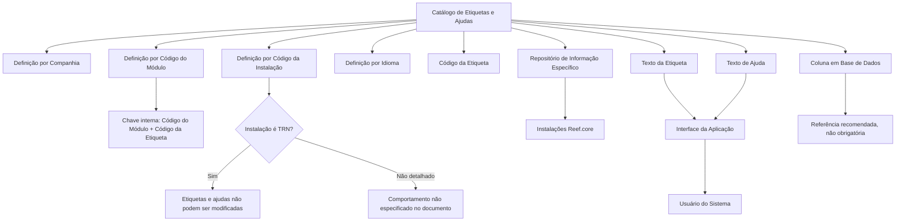

# Catálogo de Etiquetas e Ajudas da Aplicação Reef.core

## 1. Metadados do Documento
- **Arquivo de Origem:** Não identificado no conteúdo extraído
- **Tipo de Documento:** Especificação Técnica / Documentação Funcional
- **Domínio / Sistema:** Reef.core
- **Público-Alvo:** Desenvolvedores, Arquitetos, Operação e equipes de tecnologia de entidades seguradoras
- **Data/Versão Identificada:** Não identificada

---

## 2. Resumo Executivo & Contexto de Negócio

O documento define o catálogo de etiquetas e ajudas da aplicação no âmbito do sistema Reef.core. Uma etiqueta é apresentada como um código utilizado para marcar e estruturar textos em programas ou páginas web, fornecendo instruções ao navegador sobre como o conteúdo deve ser exibido. As etiquetas organizam e definem conteúdos de formulários ou programas.

O documento também descreve o conceito de *tooltip*, ajuda, descrição emergente ou texto alternativo. Esse recurso fornece ajuda visual adicional quando o usuário posiciona o cursor sobre um elemento gráfico, informando a finalidade do elemento da interface.

A finalidade do catálogo de etiquetas e ajudas é agrupar, organizar e identificar os textos de etiquetas e ajudas associados aos campos de formulários dos programas Reef.core. O catálogo facilita a recuperação desses textos para representação gráfica e também apoia sua compreensão funcional.

Funcionalmente, Reef.core permite codificar a relação entre etiquetas e ajudas de campos em um repositório de informação específico. Esse repositório é entregue às instalações com o conteúdo necessário para o funcionamento correto do sistema.

Existe uma restrição explícita para configurações associadas à instalação do núcleo, identificada como TRN: etiquetas e ajudas correspondentes a essa instalação não podem ser modificadas. O documento determina que a configuração do núcleo deve ser obrigatoriamente respeitada.

---

## 3. Arquitetura, Componentes & Tecnologias Envolvidas

Os elementos identificados no documento são:

- **Reef.core:** Sistema no qual o catálogo de etiquetas e ajudas é utilizado.
- **Catálogo de etiquetas e ajudas:** Repositório lógico para definição, organização, identificação e recuperação de textos de interface.
- **Formulários e programas:** Consumidores das etiquetas e ajudas configuradas no catálogo.
- **Repositório de informação específico:** Repositório entregue às instalações com o conteúdo necessário ao funcionamento do sistema.
- **Instalação do núcleo (TRN):** Instalação cuja configuração de etiquetas e ajudas não pode ser alterada.
- **Base de dados:** Referência opcional para associar uma etiqueta a uma coluna de banco de dados.
- **Interface da aplicação:** Camada que apresenta o texto da etiqueta e o texto de ajuda conforme o idioma do usuário e a configuração cadastrada.



**Nota de Análise:** O documento não detalha tecnologias de implementação, métodos HTTP, contratos JSON, modelo físico de dados, nomes de tabelas, mecanismos de autenticação ou fluxos de publicação do repositório de informação.

---

## 4. Regras de Negócio, Especificações Funcionais & Processos

### 4.1 Finalidade do catálogo

1. O catálogo deve agrupar, organizar e identificar etiquetas e ajudas dos campos de formulários dos programas Reef.core.
2. O catálogo deve facilitar a recuperação das etiquetas e ajudas para representação gráfica.
3. O catálogo deve facilitar a compreensão funcional das etiquetas e ajudas.
4. Reef.core permite codificar a relação entre etiquetas e ajudas dos campos em um repositório de informação específico.
5. O repositório de informação específico é entregue às instalações com o conteúdo necessário ao funcionamento correto do sistema.

### 4.2 Regras para apresentação de textos

1. O texto da etiqueta é exibido na interface da aplicação conforme:
   - o idioma do usuário que utiliza o sistema;
   - o idioma da definição da etiqueta ou ajuda.
2. O texto de ajuda é exibido como ajuda emergente quando o cursor é posicionado sobre a etiqueta.
3. A apresentação do texto de ajuda também depende:
   - do idioma do usuário do sistema;
   - do idioma utilizado na configuração da ajuda.

### 4.3 Regra de chave interna

A dupla abaixo constitui a chave interna das etiquetas:

| Componente da chave | Regra |
| :--- | :--- |
| Código do Módulo | Identifica o módulo Reef.core no qual a etiqueta ou ajuda está registrada. |
| Código da Etiqueta | Identifica a etiqueta dentro do catálogo. |
| Chave interna | `Código do Módulo + Código da Etiqueta`. |

### 4.4 Restrição obrigatória da instalação do núcleo

1. Quando o valor da instalação na configuração da etiqueta corresponder à instalação do núcleo, identificada como **TRN**, as etiquetas não poderão ser modificadas.
2. A configuração de etiquetas e ajudas correspondente à instalação TRN deve ser respeitada obrigatoriamente.
3. A restrição é reafirmada na pergunta frequente do documento como uma condição aplicável ao uso e à definição do catálogo por companhia, instalação e idioma.

### 4.5 Regra sobre coluna em base de dados

1. A propriedade **Coluna em Base de Dados** identifica o código da coluna de banco de dados à qual a etiqueta se refere.
2. Essa informação é apresentada como facilitadora para a equipe de tecnologia da entidade seguradora.
3. O preenchimento dessa propriedade não é obrigatório.
4. Apesar de não obrigatório, o documento recomenda registrar esse valor devido ao grande número de tabelas, programas, formulários e atributos existentes em Reef.core.

### 4.6 Regra sobre marca de controle

1. A propriedade **Marca de control** é obsoleta.
2. A funcionalidade dessa propriedade foi descontinuada na definição da etiqueta.
3. A propriedade não deve ser utilizada nem reutilizada para qualquer finalidade de âmbito local.
4. Originalmente, a ativação da propriedade indicava se as modificações realizadas na definição das etiquetas deveriam ser controladas nos envios de software.

---

## 5. Tabelas de Parâmetros, Ambientes e Estruturas de Dados

| Item / Parâmetro | Descrição / Função | Tipo / Valores / Formato | Ambiente / Observações |
| :--- | :--- | :--- | :--- |
| Companhia | Contém o código da companhia para a qual está sendo realizada a definição da etiqueta. | Código da companhia; formato não especificado. | Aplicável ao catálogo de etiquetas. |
| Código da Instalação | Identifica o código da instalação da etiqueta. | Código de instalação; formato não especificado. | A instalação do núcleo é identificada como `TRN`. |
| Instalação TRN | Representa a instalação do núcleo. | Valor de instalação `TRN`. | Etiquetas e ajudas associadas à instalação TRN não podem ser modificadas. |
| Código do Módulo | Identifica o código do módulo Reef.core no qual a etiqueta ou ajuda está registrada. | Código de módulo; formato não especificado. | Compõe a chave interna da etiqueta. |
| Idioma | Identifica o idioma no qual o texto da etiqueta ou ajuda foi definido. | Exemplos: espanhol, inglês, turco; códigos não especificados. | Deve estar alinhado ao idioma do usuário para exibição do texto. |
| Código da Etiqueta | Determina o identificador da etiqueta. | Código de etiqueta; formato não especificado. | Compõe a chave interna junto ao Código do Módulo. |
| Chave interna da etiqueta | Identificador interno da etiqueta no catálogo. | `Código do Módulo + Código da Etiqueta`. | Regra explicitamente definida pelo documento. |
| Texto da Etiqueta | Determina o texto exibido na interface da aplicação. | Texto. | Exibido conforme o idioma do usuário e o idioma da definição. |
| Texto de Ajuda | Determina o texto de ajuda emergente exibido ao posicionar o cursor sobre a etiqueta. | Texto. | Exibido conforme o idioma do usuário e o idioma configurado para a ajuda. |
| Coluna em Base de Dados | Identifica o código da coluna de banco de dados à qual a etiqueta se refere. | Código de coluna; formato não especificado. | Não obrigatório; recomendado para facilitar o trabalho da equipe de tecnologia da entidade seguradora. |
| Marca de controle | Propriedade anteriormente relacionada ao controle de alterações em envios de software. | Propriedade obsoleta. | Funcionalidade descontinuada; não deve ser usada nem reutilizada localmente. |
| Repositório de informação específico | Armazena a relação codificada entre etiquetas e ajudas dos campos. | Repositório; tecnologia não especificada. | Entregue às instalações com o conteúdo necessário para o funcionamento correto do sistema. |

### Documentos e diretrizes vinculados

| Item / Parâmetro | Descrição / Função | Tipo / Valores / Formato | Ambiente / Observações |
| :--- | :--- | :--- | :--- |
| Definición Programas | Documento funcional relacionado. | Referência documental. | Leitura recomendada para evitar interpretação isolada incorreta. |
| Definición Usuarios del Sistema | Documento funcional relacionado. | Referência documental. | Leitura recomendada para evitar interpretação isolada incorreta. |

---

## 6. Bateria de Perguntas & Respostas para RAG (FAQ Sintético)

### P1: Qual é a finalidade do catálogo de etiquetas e ajudas no Reef.core?
**R:** O catálogo de etiquetas e ajudas do Reef.core tem a finalidade de agrupar, organizar e identificar os textos de etiquetas e ajudas associados aos campos de formulários dos programas. Essa organização facilita tanto a recuperação dos textos para representação gráfica quanto a compreensão funcional dos elementos de interface.

### P2: O que é uma etiqueta no contexto da aplicação descrita?
**R:** Uma etiqueta é um código utilizado para marcar texto em um programa ou página web. A etiqueta fornece instruções ao navegador sobre como o conteúdo deve ser apresentado e é utilizada para estruturar e definir o conteúdo de um formulário ou programa.

### P3: O que é o texto de ajuda ou tooltip no Reef.core?
**R:** O texto de ajuda, também chamado de tooltip, ajuda, descrição emergente ou texto alternativo, é uma ferramenta de ajuda visual. Ele apresenta informação adicional sobre a finalidade de um elemento gráfico quando o usuário posiciona o cursor sobre esse elemento ou sobre a etiqueta correspondente.

### P4: Como é formada a chave interna das etiquetas no catálogo?
**R:** A chave interna das etiquetas é formada pela dupla `Código do Módulo + Código da Etiqueta`. O Código do Módulo identifica o módulo Reef.core em que a etiqueta ou ajuda está registrada, enquanto o Código da Etiqueta identifica a própria etiqueta.

### P5: As etiquetas da instalação TRN podem ser modificadas?
**R:** Não. Quando o valor da instalação na configuração da etiqueta corresponde à instalação do núcleo, identificada como `TRN`, as etiquetas não podem ser modificadas. O documento determina que a configuração das etiquetas e ajudas associadas à instalação TRN deve ser obrigatoriamente respeitada.

### P6: Como o idioma influencia a exibição de etiquetas e ajudas?
**R:** O atributo Idioma identifica o idioma no qual o texto da etiqueta ou ajuda foi definido. O texto da etiqueta e o texto de ajuda são exibidos na interface de acordo com o idioma do usuário do sistema e o idioma registrado na definição da etiqueta ou na configuração da ajuda.

### P7: A referência à coluna de banco de dados é obrigatória no catálogo?
**R:** Não. A propriedade Coluna em Base de Dados não é obrigatória. Entretanto, o documento recomenda registrar o código da coluna de banco de dados associada à etiqueta, pois essa informação facilita o trabalho da equipe de tecnologia da entidade seguradora diante do grande número de tabelas, programas, formulários e atributos existentes no Reef.core.

### P8: Para que serve a propriedade Marca de controle?
**R:** A Marca de controle é uma propriedade obsoleta cuja funcionalidade foi descontinuada na definição da etiqueta. Ela não deve ser utilizada nem reutilizada para nenhuma finalidade local. Originalmente, indicava se as modificações nas definições de etiquetas deveriam ser controladas nos envios de software.

### P9: Onde a relação entre etiquetas e ajudas é armazenada?
**R:** O Reef.core permite codificar a relação entre etiquetas e ajudas dos campos em um repositório de informação específico. Esse repositório é entregue às instalações com o conteúdo necessário para o funcionamento correto do sistema.

### P10: Quais informações identificam uma definição de etiqueta no catálogo?
**R:** O documento apresenta como propriedades operativas a Companhia, o Código da Instalação, o Código do Módulo, o Idioma, o Código da Etiqueta, o Texto da Etiqueta, o Texto de Ajuda, a Coluna em Base de Dados e a Marca de controle. Cada propriedade possui uma finalidade específica na definição, identificação, apresentação ou governança das etiquetas e ajudas.

### P11: Quais documentos devem ser consultados juntamente com esta especificação?
**R:** O documento recomenda a leitura das referências `Definición Programas` e `Definición Usuarios del Sistema`. A recomendação existe para evitar que uma interpretação isolada do presente documento conduza a erro.

---

## 7. Glossário de Termos, Siglas & Conceitos-Chave

- **Reef.core:** Sistema no âmbito do qual é definido e utilizado o catálogo de etiquetas e ajudas.
- **Etiqueta:** Código usado para marcar, estruturar e definir conteúdo em programas ou páginas web, instruindo o navegador sobre sua apresentação.
- **Ajuda:** Texto de suporte associado a uma etiqueta ou elemento de interface.
- **Tooltip:** Ajuda visual, descrição emergente ou texto alternativo apresentado ao posicionar o cursor sobre um elemento gráfico.
- **TRN:** Código que identifica a instalação do núcleo. As etiquetas e ajudas correspondentes a essa instalação não podem ser modificadas.
- **Código do Módulo:** Código que identifica o módulo Reef.core em que uma etiqueta ou ajuda é registrada.
- **Código da Etiqueta:** Identificador da etiqueta no catálogo.
- **Chave interna:** Dupla formada pelo Código do Módulo e pelo Código da Etiqueta.
- **Coluna em Base de Dados:** Código da coluna de banco de dados à qual uma etiqueta se refere.
- **Marca de controle:** Propriedade obsoleta e descontinuada que originalmente indicava controle de alterações nos envios de software.
- **Repositório de informação específico:** Repositório que contém a relação codificada entre etiquetas e ajudas dos campos.

---

## 8. Notas Críticas, Riscos & Limitações

- A configuração de etiquetas e ajudas da instalação do núcleo `TRN` não pode ser alterada. Alterações nessa configuração violariam uma restrição obrigatória documentada.
- A propriedade **Marca de controle** está obsoleta e descontinuada; seu uso ou reutilização local é explicitamente proibido pelo documento.
- A associação entre etiqueta e coluna de banco de dados não é obrigatória. A ausência desse preenchimento pode reduzir a capacidade de rastreabilidade técnica para equipes de tecnologia, embora o documento não descreva impactos operacionais específicos.
- O documento não fornece detalhes sobre estrutura física do repositório, tabelas de banco de dados, formatos dos códigos, tecnologias utilizadas, APIs, contratos de integração ou procedimentos de manutenção.
- O documento recomenda consultar `Definición Programas` e `Definición Usuarios del Sistema`, pois a interpretação isolada desta especificação pode conduzir a erro.
- **Nota de Análise:** O conteúdo extraído termina após o termo `Consejo:`. Não há conteúdo adicional disponível que permita identificar uma recomendação, exemplo ou instrução subsequente.

---

## 9. Conteúdo Bruto Estruturado (Referência Fiel)

```text
--- [PÁGINA 1 DE 2] ---

DEFINICIÓN de las ETIQUETAS y AYUDAS la Aplicación
Contexto
Una etiqueta es un código utilizado para "marcar" el texto en un programa o página web con el n de dar instrucciones al navegador sobre
cómo mostrarlo (es decir, las etiquetas se utilizan para estructurar y denir el contenido en un formulario o programa determinado).
Un "tooltip", ayuda, descripción emergente o texto alternativo es una herramienta de ayuda visual que funciona al situar el cursor sobre algún
elemento gráco, mostrando de esta manera una ayuda adicional que informa al usuario de la nalidad del elemento sobre el que se
encuentra.
La nalidad básica del catálogo de etiquetas y ayudas en el ámbito de Reef.core es agrupar, organizar e identicar las etiquetas y ayudas de
los campos de los formularios en los programas facilitando de esta manera tanto su recuperación (para su representación gráca) como su
comprensión funcional.
Objetivo
Funcionalmente, Reef.core cuenta con la posibilidad de codicar la relación de etiquetas y ayudas de los campos en un repositorio de
información especíco que se entrega a las instalaciones con el contenido necesario para el correcto funcionamiento del Sistema.
Si el valor de la instalación en la conguración de la etiqueta es la correspondiente a la instalación del núcleo, instalación (TRN) las
etiquetas no podrán modicarse.
Propiedades Operativas
Propiedades Operativas
Compañía
Este atributo del catálogo contiene el código de la compañía sobre la que se está realizando la denición de la etiqueta.
Código de la Instalación
Esta propiedad de la denición identica el código de la instalación de la etiqueta.
Código del módulo
Esta propiedad de la denición identica el código del módulo de Reef.core en el que se inscribe la etiqueta o ayuda.
Idioma
Documentation / DOCUMENTACIÓN Reef
DOCUMENTACIÓN Reef
Mapfredocument
DOCUMENTACIÓN Reef
Owner
user:agonzalez_mapfre.com
Lifecycle
Approved Source
 / 
 VL
Buscar Inicio Soluciones Arquitecturas APIs Componentes Cloud Documentación Zeus Reef Ayuda
ES


--- [PÁGINA 2 DE 2] ---

Esta propiedad identica el idioma en el que está denido el texto de la etiqueta o de la ayuda, como por ejemplo con los códigos que
identiquen a los idiomas español, inglés, turco,...
Código de la etiqueta
Esta propiedad del catálogo determina el identicador de la etiqueta.
La dupla Código del Módulo + Código de la Etiqueta conforma la clave interna de las etiquetas.
Texto de la etiqueta
Esta propiedad determina el texto que se mostrará en la interfaz de la aplicación de acuerdo con el idioma que tenga al usuario que utiliza el
sistema y el idioma de la denición de la etiqueta o ayuda.
Texto de ayuda
Este atributo determina el texto de ayuda emergente que se mostrará en la interfaz de la aplicación al posicionar el cursor sobre la etiqueta y
de acuerdo con el idioma que tenga al usuario que utiliza el sistema y el idioma empleado en la conguración de la ayuda.
Columna en Base de Datos
Esta propiedad identica, como facilitador para el equipo de tecnología de la entidad aseguradora, el código de la columna en la base de
datos a la que se reere la etiqueta.
Por el ingente número de tablas, programas, formularios y atributos existentes en Reef.core, no siendo una tarea que se haya de realizar
obligatoriamente, sí se recomienda la captura de este valor en la conguración del catálogo de etiquetas.
Marca de control
Por ser una propiedad obsoleta, la funcionalidad de este atributo está descontinuada en la denición de la etiqueta por lo que no debe usarse
o reutilizarse para ningún propósito de ámbito local.
Originalmente la activación de esta propiedad en la etiqueta indicaba si se tenía o no que controlar en los envíos de software las
modicaciones efectuadas en su denición de las etiquetas.
Vínculos
Relación de Directrices y Documentos funcionales cuya lectura recomendada para evitar que la interpretación aislada del presente
documento pueda conducir a error.
Denición Programas
Denición Usuarios del Sistema
Preguntas frecuentes
(1) ¿Existe alguna restricción que tenga que ser tomada en cuenta en el uso y denición del Catálogo de etiquetas por compañía, instalación
e idioma de Reef.core?
Se han de respetar obligatoriamente la conguración realizada en las etiquetas y ayudas que se corresponden con la instalación del núcleo
(TRN).
Consejo:
```
