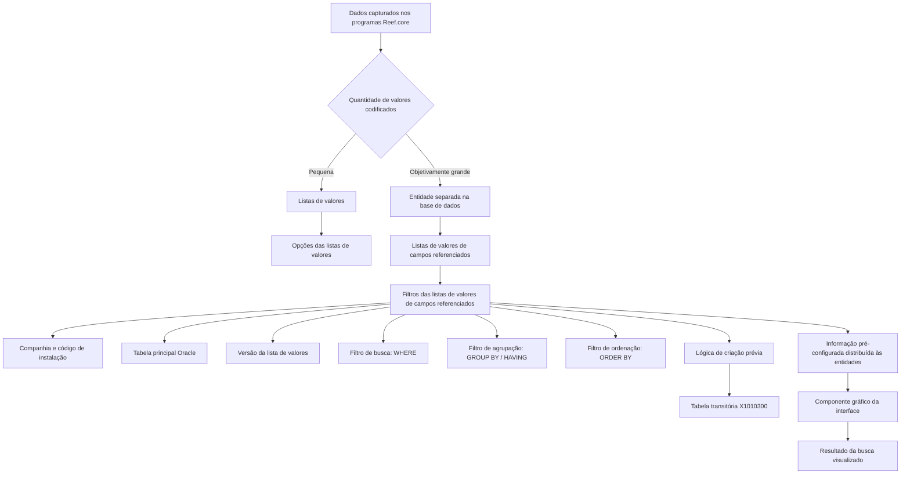

# Definição dos Filtros das Listas de Valores de Campos Referenciados — Reef.core

## 1. Metadados do Documento
- **Arquivo de Origem:** `Não informado`
- **Tipo de Documento:** `Procedimento / Documentação funcional`
- **Domínio / Sistema:** `Reef.core`
- **Público-Alvo:** `Não explicitamente identificado; conteúdo voltado à configuração funcional e técnica de catálogos Reef.core`
- **Data/Versão Identificada:** `Não identificada`

---

## 2. Resumo Executivo & Contexto de Negócio

O documento descreve a configuração dos filtros associados às listas de valores de campos referenciados do sistema Reef.core. Essas listas são utilizadas quando valores codificados estão armazenados em entidades separadas na base de dados e precisam ser recuperados segundo critérios variáveis.

No Reef.core, dados codificados com muitos valores possíveis normalmente são persistidos em entidades de banco de dados específicas. Quando há poucos valores possíveis, os dados podem ser armazenados de forma compartilhada nos repositórios de “listas de valores” e “opções das listas de valores”.

As listas de valores de campos referenciados atendem ao cenário em que uma entidade separada precisa ter seus registros filtrados conforme critérios variáveis. O Reef.core disponibiliza repositórios específicos para armazenar a configuração dessas listas e de seus filtros, permitindo que o componente gráfico da interface monte e apresente corretamente o resultado das buscas.

A configuração é distribuída às entidades com informação pré-configurada. A definição inclui companhia, instalação, tabela principal Oracle, versão da lista, filtros SQL de busca, agrupamento e ordenação, além de lógica prévia de criação em uma tabela transitória denominada `X1010300`.

O documento estabelece restrições importantes para configurações ligadas à instalação do núcleo, identificada como `TRN`. Registros configurados para a instalação `TRN` não podem ser alterados. Para catálogos personalizáveis por países, podem coexistir somente registros da instalação `TRN` e da instalação local da companhia.

---

## 3. Arquitetura, Componentes & Tecnologias Envolvidas

### Componentes e elementos identificados

| Componente / Tecnologia | Papel no contexto documentado |
| :--- | :--- |
| Reef.core | Sistema que mantém repositórios de configuração e distribui informação pré-configurada às entidades. |
| Listas de valores | Repositório compartilhado para dados codificados quando há pequena quantidade de valores possíveis. |
| Opções das listas de valores | Repositório associado às listas de valores para armazenamento compartilhado de opções. |
| Listas de valores de campos referenciados | Repositório de configuração para listas baseadas em entidades separadas da base de dados. |
| Filtros das listas de valores de campos referenciados | Repositório que armazena critérios variáveis aplicáveis às listas de valores de campos referenciados. |
| Componente gráfico da interface | Componente que conforma e apresenta o resultado da busca conforme a configuração dos filtros. |
| Entidade Oracle / tabela principal | Entidade de banco de dados para a qual a lista de valores e seus filtros são configurados. |
| SQL `WHERE` | Cláusula usada para determinar critérios de inclusão de registros na busca. |
| SQL `GROUP BY` | Cláusula usada para agrupar linhas de uma tabela segundo uma ou mais colunas. |
| SQL `HAVING` | Cláusula citada como mecanismo para filtrar grupos segundo resultado de função de agregação. |
| SQL `ORDER BY` | Cláusula usada para ordenar linhas segundo uma ou mais colunas. |
| `X1010300` | Tabela transitória usada temporária e internamente pela lógica de negócio de criação prévia. |
| `TRN` | Código da instalação do núcleo Reef.core. |



**Nota de Análise:** O documento cita entidades Oracle, cláusulas SQL e a tabela transitória `X1010300`, mas não detalha esquemas de tabelas, nomes de colunas, métodos de acesso, contratos de integração ou sintaxe completa dos filtros SQL.

---

## 4. Regras de Negócio, Especificações Funcionais & Processos

### Contexto de listas de valores

1. Os programas Reef.core capturam dados de livre formato e dados codificados.
2. Quando o número de valores possíveis de um dado codificado é objetivamente grande, as equipes de tecnologia normalmente criam entidades separadas na base de dados para registro e armazenamento.
3. Quando o número de valores possíveis de um dado é pequeno, os valores podem ser incorporados e armazenados de forma compartilhada nos repositórios:
   - Listas de valores.
   - Opções das listas de valores.
4. Quando a informação está armazenada em uma entidade separada, pode ser necessário filtrar registros segundo critérios variáveis ou mutáveis.
5. Para esse cenário, devem ser configurados critérios nos repositórios:
   - Listas de valores de campos referenciados.
   - Filtros das listas de valores de campos referenciados.
6. A configuração permite que o componente gráfico da interface apresente adequadamente o resultado da busca.

### Regras de configuração do filtro

1. **Companhia:** deve identificar o código da companhia sobre a qual é realizada a definição do filtro da lista de valores de campos referenciados.
2. **Código de instalação:** identifica a instalação associada ao filtro.
3. **Instalação do núcleo (`TRN`):**
   - Se o valor da instalação na configuração do filtro for a instalação do núcleo `TRN`, a informação não poderá ser alterada sob nenhuma circunstância.
   - A relação de listas de valores `TRN` deve ser obrigatoriamente respeitada por fazer parte do núcleo Reef.core.
4. **Tabela principal:** deve determinar o nome da entidade Oracle para a qual o filtro é configurado.
5. **Versão da lista de valores:**
   - Identifica a versão da lista de valores de campos referenciados e, consequentemente, do filtro associado.
   - Como uma mesma tabela pode ter diferentes listas de valores ou critérios de busca, o valor da versão deve ser um consecutivo iniciado em `1`.
6. **Filtro de busca:**
   - Determina o texto da cláusula para busca de registros na tabela principal e versão configurada.
   - O texto representa critérios equivalentes à cláusula SQL `WHERE`.
   - Registros somente devem ser incluídos nos resultados quando os valores de seus campos cumprirem os critérios especificados.
7. **Filtro de agrupação:**
   - Determina o texto da cláusula para agrupar informações dos registros da tabela principal e versão configurada.
   - O texto representa critérios equivalentes à cláusula SQL `GROUP BY`.
   - A cláusula `HAVING` pode ser utilizada juntamente com `GROUP BY` para filtrar grupos de linhas segundo o resultado de uma função de agregação.
8. **Filtro de ordenação:**
   - Determina o texto da cláusula para ordenar informações dos registros da tabela principal e versão configurada.
   - O texto representa critérios equivalentes à cláusula SQL `ORDER BY`.
9. **Lógica de negócio de criação prévia:**
   - Contém lógica de negócio destinada a criar, temporária e internamente, as informações necessárias à configuração da lista de valores.
   - A criação ocorre na tabela transitória `X1010300`.
10. **Coexistência de instalações em catálogos personalizáveis:**
    - Nos catálogos de configuração Reef.core que os países podem personalizar, incluindo este catálogo, somente podem coexistir:
      - Registros com código de instalação `TRN`.
      - Registros com código da instalação local.
    - A coexistência distingue a configuração padrão da configuração local.

---

## 5. Tabelas de Parâmetros, Ambientes e Estruturas de Dados

| Item / Parâmetro | Descrição / Função | Tipo / Valores / Formato | Ambiente / Observações |
| :--- | :--- | :--- | :--- |
| Companhia | Código da companhia para a qual o filtro da lista de valores de campos referenciados é definido. | Código de companhia; formato não detalhado. | Aplicável à definição do filtro. |
| Código de instalação | Identifica a instalação associada ao filtro. | Código de instalação; formato não detalhado. | Pode ser `TRN` ou código de instalação local nos catálogos personalizáveis citados. |
| `TRN` | Código da instalação do núcleo Reef.core. | Código de instalação. | Registros configurados com `TRN` não podem ser alterados. |
| Tabela principal | Nome da entidade Oracle para a qual o filtro da lista de valores é configurado. | Nome de entidade Oracle; formato não detalhado. | Uma mesma tabela pode possuir diferentes listas de valores ou critérios de busca. |
| Versão da lista de valores | Identifica a versão da lista de valores de campos referenciados e do respectivo filtro. | Número consecutivo iniciado em `1`. | Deve diferenciar listas ou critérios aplicáveis à mesma tabela. |
| Filtro de busca | Texto da cláusula que define critérios para pesquisar registros na tabela principal. | Texto SQL equivalente a `WHERE`. | Os registros devem cumprir os critérios para serem incluídos no resultado. |
| Filtro de agrupação | Texto da cláusula que define agrupamento de informações da tabela principal. | Texto SQL equivalente a `GROUP BY`; pode ser combinado com `HAVING`. | `HAVING` pode filtrar grupos conforme resultado de função de agregação. |
| Filtro de ordenação | Texto da cláusula que define ordenação das informações da tabela principal. | Texto SQL equivalente a `ORDER BY`. | Permite ordenar linhas segundo valores de uma ou mais colunas. |
| Lógica de negócio de criação prévia | Lógica para criar interna e temporariamente informações necessárias à configuração da lista de valores. | Lógica de negócio; linguagem e formato não detalhados. | Utiliza a tabela transitória `X1010300`. |
| `X1010300` | Tabela transitória para criação temporária e interna de informação necessária à configuração. | Identificador de tabela. | Não são detalhados campos, estrutura, ciclo de vida ou mecanismo de limpeza. |
| Listas de valores | Repositório compartilhado para dados codificados com pequeno número de valores possíveis. | Repositório de informação. | Associado às opções das listas de valores. |
| Opções das listas de valores | Repositório compartilhado para opções de listas de valores. | Repositório de informação. | Usado para dados codificados com poucos valores possíveis. |
| Listas de valores de campos referenciados | Repositório para configuração de listas relacionadas a entidades separadas. | Repositório de informação. | Aplicável quando registros precisam de filtragem por critérios variáveis. |
| Filtros das listas de valores de campos referenciados | Repositório para critérios de filtragem das listas de valores de campos referenciados. | Repositório de informação. | A configuração suporta a visualização adequada da busca no componente gráfico. |

---

## 6. Bateria de Perguntas & Respostas para RAG (FAQ Sintético)

### P1: Quando o Reef.core utiliza uma entidade separada na base de dados para armazenar dados codificados?
**R:** O Reef.core utiliza uma entidade separada na base de dados quando o número de valores possíveis de um dado codificado é objetivamente grande. Quando o número de valores é pequeno, os valores podem ser armazenados de forma compartilhada nos repositórios de listas de valores e opções das listas de valores.

### P2: Qual é a finalidade de uma lista de valores de campos referenciados no Reef.core?
**R:** Uma lista de valores de campos referenciados é utilizada quando a informação está armazenada em uma entidade separada da base de dados e os registros dessa entidade precisam ser filtrados segundo critérios variáveis. A configuração permite que o componente gráfico da interface apresente corretamente o resultado da busca.

### P3: Quais repositórios Reef.core são usados para configurar filtros de listas de valores de campos referenciados?
**R:** O documento identifica dois repositórios específicos: “listas de valores de campos referenciados” e “filtros das listas de valores de campos referenciados”. O primeiro está relacionado à configuração da lista, e o segundo armazena os critérios variáveis usados para filtrar seus registros.

### P4: O que acontece se um filtro for configurado para a instalação `TRN`?
**R:** Se o valor da instalação configurado no filtro corresponder à instalação do núcleo, identificada como `TRN`, a informação não poderá ser alterada sob nenhuma circunstância. Além disso, a relação de listas de valores `TRN` deve ser respeitada obrigatoriamente por integrar o núcleo do Reef.core.

### P5: Como a versão da lista de valores deve ser definida?
**R:** A versão identifica a lista de valores de campos referenciados e o respectivo filtro. Como uma mesma tabela pode possuir listas de valores ou critérios de busca distintos, a versão deve ser um valor consecutivo iniciado em `1`.

### P6: Qual é a finalidade do filtro de busca?
**R:** O filtro de busca determina o texto da cláusula usada para buscar registros na tabela principal para uma versão específica da lista de valores de campos referenciados. O documento relaciona essa configuração à cláusula SQL `WHERE`, que define os critérios que os campos devem cumprir para que seus registros sejam incluídos no resultado da consulta.

### P7: Como funcionam os filtros de agrupação e de ordenação?
**R:** O filtro de agrupação determina o texto para agrupar informações dos registros da tabela principal, em correspondência com a cláusula SQL `GROUP BY`. O documento também cita o uso conjunto de `HAVING` para filtrar grupos conforme o resultado de funções de agregação. O filtro de ordenação determina o texto para ordenar os registros, em correspondência com a cláusula SQL `ORDER BY`.

### P8: Para que serve a tabela transitória `X1010300`?
**R:** A tabela `X1010300` é usada temporária e internamente pela lógica de negócio de criação prévia. Essa lógica cria a informação necessária para configurar a lista de valores. O documento não detalha a estrutura, os campos ou o mecanismo de processamento dessa tabela transitória.

### P9: Quantas instalações podem coexistir para uma companhia em um catálogo Reef.core personalizável?
**R:** Para catálogos de configuração Reef.core que os países podem personalizar, incluindo o catálogo descrito, podem coexistir somente registros com o código de instalação `TRN` e registros com o código da instalação local. Essa separação permite distinguir configuração padrão de configuração local.

### P10: O documento define quais colunas ou tabelas Oracle devem ser usadas nos filtros SQL?
**R:** Não. O documento determina que a tabela principal identifica a entidade Oracle para a qual o filtro é configurado e descreve as finalidades equivalentes a `WHERE`, `GROUP BY`, `HAVING` e `ORDER BY`. Contudo, o documento não fornece nomes de tabelas Oracle concretas, colunas, exemplos de cláusulas SQL ou contratos de dados.

---

## 7. Glossário de Termos, Siglas & Conceitos-Chave

- **Reef.core:** Sistema citado como responsável por repositórios de informação, configuração e distribuição de informação pré-configurada às entidades.
- **Lista de Valores:** Repositório Reef.core usado para armazenamento compartilhado de dados codificados quando a quantidade de valores possíveis é pequena.
- **Opções das Listas de Valores:** Repositório associado às listas de valores para armazenamento compartilhado de opções.
- **Lista de Valores de Campos Referenciados:** Configuração destinada a listas cuja informação está armazenada em entidades separadas e pode requerer filtros variáveis.
- **Filtro de Lista de Valores de Campos Referenciados:** Critério configurado para buscar, agrupar ou ordenar registros associados a uma lista de valores de campos referenciados.
- **TRN:** Código da instalação do núcleo Reef.core.
- **Tabela principal:** Entidade Oracle para a qual a lista de valores e o filtro são configurados.
- **`WHERE`:** Cláusula SQL que especifica critérios que os valores dos campos devem cumprir para que registros sejam incluídos no resultado de uma consulta.
- **`GROUP BY`:** Cláusula SQL que permite agrupar linhas de uma tabela segundo valores de uma ou mais colunas.
- **`HAVING`:** Cláusula SQL citada para filtrar grupos de linhas conforme o resultado de uma função de agregação.
- **`ORDER BY`:** Cláusula SQL que permite ordenar linhas de uma tabela segundo valores de uma ou mais colunas.
- **`X1010300`:** Tabela transitória utilizada interna e temporariamente pela lógica de negócio de criação prévia.

---

## 8. Notas Críticas, Riscos & Limitações

- Configurações associadas à instalação do núcleo `TRN` não podem ser alteradas sob nenhuma circunstância.
- A relação de listas de valores `TRN` deve ser respeitada obrigatoriamente, por fazer parte do núcleo Reef.core.
- Em catálogos personalizáveis por países, somente podem coexistir registros da instalação `TRN` e da instalação local; o documento não descreve comportamento para outros códigos de instalação.
- A versão da lista deve iniciar em `1` e ser consecutiva, pois uma mesma tabela pode ter diferentes listas ou critérios de busca.
- A configuração de filtros usa textos equivalentes a cláusulas SQL `WHERE`, `GROUP BY` e `ORDER BY`; o documento não detalha validações sintáticas, controles de segurança, permissões ou prevenção de SQL inválido.
- A tabela transitória `X1010300` é citada, mas não há detalhes sobre estrutura, campos, retenção, concorrência, limpeza ou tratamento de falhas.
- O documento referencia a diretriz funcional “Definición Listas de Valores” como leitura recomendada. A interpretação isolada do presente documento pode conduzir a erro.
- **Nota de Análise:** Não há detalhamento sobre métodos HTTP, APIs, contratos JSON, interfaces de administração, trilha de auditoria, logs, URLs de ambientes ou procedimentos de implantação.

---

## 9. Conteúdo Bruto Estruturado (Referência Fiel)

```text
--- [PÁGINA 1 DE 3] ---

DEFINICIÓN de los FILTROS de las LISTAS de VALORES de Campos
Referenciados
Contexto
¿Qué es una Lista de Valores?
En los programas de Reef.core se han de capturar datos: datos de libre formato y datos codicados. Si el número de posibles valores de un
dato codicado es objetivamente 'grande', los equipos de tecnología normalmente suelen crear entidades separadas en la base de datos para
su registro y almacenamiento mientras que si el número de posibles valores de un dato es pequeño se pueden juntar, incorporar y almacenar
de manera compartida en dos repositorios de información de Reef.core creados al efecto para ello: "listas de valores" y "opciones de las
listas de valores".
¿Qué es una Lista de Valores de campos referenciados?
En el caso que la información esté almacenada en la base de datos en una entidad separada en ocasiones es necesario ltrar los registros
que contenga de acuerdo con criterios cambiantes / criterios variables, en cuyo caso se tendrán que congurar dichos criterios en dos
repositorios de información de Reef.core creados al efecto para ello: "listas de valores de campos referenciados" y "ltros de las listas de
valores de campos referenciados" para que el componente gráco de la interfaz conforme y visualice adecuadamente el resultado de la
búsqueda.
En este documento haremos referencia a la conguración de los ltros de las listas de valores de campos referenciados de una lista
determinada.
Objetivo
Funcionalmente, Reef.core cuenta con la posibilidad de registrar los posibles ltros de las listas de valores de campos referenciados del
sistema en un repositorio de información propio que se distribuye a las entidades con información pre-congurada.
Propiedades Operativas
Propiedades Operativas
Compañía
Este atributo del catálogo contiene el código de la compañía sobre la que se está realizando la denición del ltro en la lista de valores de
campos referenciados.
Código de la instalación
Esta propiedad de la denición identica el código de la instalación asociada al ltro de la lista de valores de campos referenciados.
Documentation / DOCUMENTACIÓN Reef
DOCUMENTACIÓN Reef
Mapfredocument
DOCUMENTACIÓN Reef
Owner
user:agonzalez_mapfre.com
Lifecycle
Approved Source
 / 
 VL
Buscar Inicio Soluciones Arquitecturas APIs Componentes Cloud Documentación Zeus Reef Ayuda
ES


--- [PÁGINA 2 DE 3] ---

Si el valor de la instalación en la conguración del ltro es la correspondiente a la instalación del núcleo, instalación (TRN) la información
no podrá alterarse bajo ningún concepto.
Tabla principal
Determina el nombre de la entidad Oracle para la que se congura el ltro en la lista de valores de campos referenciados.
Versión de la lista de valores
Este atributo identica la versión de la lista de valores de campos referenciados y por tanto para el ltro de la misma.
Puesto que una misma tabla puede tener diferentes listas de valores o criterios de búsqueda sobre ella, el valor de esta propiedad debe
ser un consecutivo que inicie con el valor 1.
Filtro de búsqueda
Determina el texto de la cláusula para buscar registros en la tabla principal y la versión de la lista de valores de campos referenciados que se
esté congurando.
En una instrucción SQL, la cláusula WHERE especica criterios que tienen que cumplir los valores de los campos para que los registros
que los contienen se incluyan en los resultados de la consulta.
Filtro de agrupación
Determina el texto de la cláusula para agrupar información de los registros de la tabla principal y la versión de la lista de valores de campos
referenciados que se esté congurando.
En una instrucción SQL, la cláusula GROUP BY nos permite agrupar las en una tabla según los valores en una o más columnas
(Conjuntamente con la cláusula HAVING se pueden ltrar grupos de las según el resultado de una función de agregación).
Filtro de ordenación
Determina el texto de la cláusula para ordenar la información de los registros de la tabla principal y la versión de la lista de valores de campos
referenciados que se esté congurando.
En una instrucción SQL, la cláusula ORDER BY permite ordenar las las de una tabla según los valores en una o más columnas.
Lógica de negocio de creación previa
Esta propiedad contiene la lógica de negocio que permite crear temporal e internamente en una tabla transitoria (X1010300) la información
necesaria para congurar la lista de valores.
Vínculos
Relación de Directrices y Documentos funcionales cuya lectura recomendada para evitar que la interpretación aislada del presente
documento pueda conducir a error.
Denición Listas de Valores
Preguntas frecuentes
(1) ¿Existe alguna restricción que tenga que ser tomada en cuenta en el uso y denición del catálogo de ltros para las listas de valores de
campos referenciados de Reef.core?
Se han de respetar obligatoriamente la relación de listas de valores TRN por ser parte del núcleo de Reef.core.
(2) ¿Cuantas instalaciones pueden coexistir para una compañía en particular?
Consejo:


--- [PÁGINA 3 DE 3] ---

En general, en los catálogos de conguración de Reef.core que los países pueden personalizar (entre los que se encuentra este), únicamente
podrán coexistir registros con el código de instalación TRN y el código de la instalación local, distinguiendo así si la conguración realizada
es la estándar o local.
```
