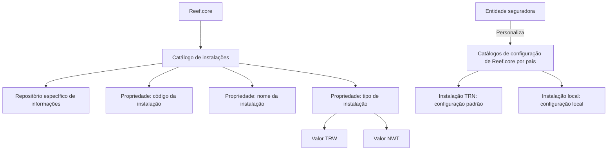

# Definição das Instalações de Reef.core

## 1. Metadados do Documento
- **Arquivo de Origem:** Não identificado no conteúdo fornecido
- **Tipo de Documento:** Especificação Funcional
- **Domínio / Sistema:** Reef.core
- **Público-Alvo:** Não explicitamente identificado
- **Data/Versão Identificada:** Não identificada

---

## 2. Resumo Executivo & Contexto de Negócio

O documento define o catálogo de instalações no contexto do sistema Reef.core. A finalidade declarada do catálogo é identificar a versão das informações em catálogos de configuração que podem ser personalizados pela entidade seguradora.

Funcionalmente, Reef.core permite codificar a relação de instalações do sistema em um repositório específico de informações. Cada instalação é caracterizada por código, nome e tipo de instalação.

A principal regra operacional apresentada diferencia configurações padrão e locais nos catálogos de configuração de Reef.core por país. Esses catálogos somente podem conter, simultaneamente, registros associados ao código de instalação `TRN` e ao código da instalação local.

O documento também estabelece uma restrição de preservação: as instalações já existentes devem ser obrigatoriamente respeitadas porque o catálogo de instalações integra o núcleo de Reef.core.

---

## 3. Arquitetura, Componentes & Tecnologias Envolvidas

Os elementos identificados no documento são:

- **Reef.core:** sistema que contém o catálogo de instalações.
- **Catálogo de instalações:** catálogo utilizado para identificar versões de informações de configuração.
- **Catálogos de configuração de Reef.core por país:** catálogos que podem conter configuração padrão e configuração local.
- **Repositório específico de informações:** repositório no qual Reef.core codifica a relação de instalações do sistema.
- **Entidade seguradora:** organização que pode personalizar determinados catálogos de configuração.
- **Instalação TRN:** código associado à configuração padrão.
- **Instalação local:** código associado à configuração local.
- **Tipos de instalação `TRW` e `NWT`:** valores possíveis para o atributo de tipo de instalação, determinados conforme a evolução da instalação.



> **Nota de Análise:** O documento não detalha tecnologias, protocolos, bancos de dados, APIs, métodos HTTP, contratos JSON, servidores, URLs de ambientes ou mecanismos físicos do repositório específico de informações.

---

## 4. Regras de Negócio, Especificações Funcionais & Processos

### Finalidade do catálogo de instalações

1. O catálogo de instalações existe para identificar a versão das informações.
2. A identificação de versão aplica-se aos catálogos de configuração do sistema Reef.core.
3. Os catálogos de configuração considerados podem ser personalizados pela entidade seguradora.
4. Reef.core dispõe da funcionalidade de codificar a relação de instalações do sistema em um repositório específico de informações.

### Propriedades operacionais da instalação

1. **Código da Instalação**
   - Identifica o código da instalação.
   - Nos catálogos de configuração de Reef.core por país, somente podem coexistir registros com:
     - o código de instalação `TRN`; e
     - o código da instalação local.
   - A coexistência desses códigos permite distinguir se uma configuração é padrão ou local.

2. **Nome da Instalação**
   - Determina a descrição da instalação.

3. **Tipo de instalação**
   - Determina o tipo de instalação associado ao código.
   - No catálogo, o valor do atributo deve ser `TRW` ou `NWT`.
   - A escolha entre `TRW` e `NWT` depende da evolução que a instalação tenha tido.

### Restrição obrigatória

- As instalações existentes devem ser obrigatoriamente respeitadas.
- A justificativa apresentada é que o catálogo de instalações faz parte do núcleo de Reef.core.

### Documentação vinculada

O documento menciona a existência de diretrizes e documentos funcionais relacionados, cuja leitura é recomendada para evitar interpretações incorretas decorrentes da análise isolada deste documento. Como exemplo, é mencionado o caminho ou referência `Documentation / DOCUMENTACIÓN Reef`.

> **Nota de Análise:** O conteúdo fornecido não descreve o procedimento para criar, alterar, excluir ou validar registros de instalação. Também não apresenta critérios adicionais para determinar quando uma instalação deve receber o tipo `TRW` ou `NWT`.

---

## 5. Tabelas de Parâmetros, Ambientes e Estruturas de Dados

| Item / Parâmetro | Descrição / Função | Tipo / Valores / Formato | Ambiente / Observações |
| :--- | :--- | :--- | :--- |
| Catálogo de instalações | Identifica a versão das informações em catálogos de configuração personalizáveis. | Catálogo funcional de Reef.core | Faz parte do núcleo de Reef.core. |
| Repositório específico de informações | Armazena a relação de instalações do sistema codificada por Reef.core. | Repositório; tecnologia não identificada | Não há detalhes de implementação. |
| Código da Instalação | Identifica o código de uma instalação. | Código; valores explicitamente citados: `TRN` e código local | Em catálogos por país, podem coexistir apenas registros `TRN` e da instalação local. |
| Código `TRN` | Código de instalação que permite identificar configuração padrão. | Código de instalação | Pode coexistir com o código de instalação local. |
| Código da instalação local | Código que permite identificar configuração local. | Código de instalação local; valor não especificado | Pode coexistir com `TRN`. |
| Nome da Instalação | Determina a descrição da instalação. | Descrição textual | Formato e obrigatoriedade não detalhados. |
| Tipo de instalação | Determina o tipo associado ao código da instalação. | `TRW` ou `NWT` | O valor depende da evolução da instalação. |
| `TRW` | Valor permitido para o tipo de instalação. | Valor de atributo | Significado expandido não informado. |
| `NWT` | Valor permitido para o tipo de instalação. | Valor de atributo | Significado expandido não informado. |
| Catálogos de configuração de Reef.core por país | Catálogos nos quais se aplica a regra de coexistência de instalações padrão e local. | Catálogos de configuração | Podem ser personalizados pela entidade seguradora. |
| Instalações existentes | Registros já existentes no catálogo de instalações. | Registros do catálogo | Devem ser obrigatoriamente respeitados. |

---

## 6. Bateria de Perguntas & Respostas para RAG (FAQ Sintético)

### P1: Qual é a finalidade do catálogo de instalações em Reef.core?
**R:** A finalidade do catálogo de instalações é identificar a versão das informações nos catálogos de configuração de Reef.core que permitem personalização pela entidade seguradora.

### P2: Onde Reef.core codifica a relação de instalações do sistema?
**R:** Reef.core possui a possibilidade funcional de codificar a relação de instalações do sistema em um repositório específico de informações. O documento não informa a tecnologia ou localização física desse repositório.

### P3: Quais propriedades operacionais definem uma instalação no catálogo de Reef.core?
**R:** O documento apresenta três propriedades operacionais: Código da Instalação, Nome da Instalação e Tipo de instalação. O código identifica a instalação, o nome determina sua descrição e o tipo determina a classificação associada ao código.

### P4: Quais códigos de instalação podem coexistir nos catálogos de configuração de Reef.core por país?
**R:** Nos catálogos de configuração de Reef.core por país, somente podem coexistir registros com o código de instalação `TRN` e com o código da instalação local.

### P5: Como Reef.core distingue uma configuração padrão de uma configuração local?
**R:** A distinção ocorre por meio dos códigos de instalação presentes no catálogo de configuração por país: o código `TRN` identifica a configuração padrão, enquanto o código da instalação local identifica a configuração local.

### P6: Quais valores são permitidos para o atributo Tipo de instalação?
**R:** O atributo Tipo de instalação pode assumir os valores `TRW` ou `NWT`, conforme a evolução que a instalação tenha tido. O documento não detalha os critérios objetivos para selecionar um desses valores.

### P7: É permitido alterar ou desrespeitar instalações já existentes no catálogo de Reef.core?
**R:** Não. As instalações existentes devem ser obrigatoriamente respeitadas, pois o catálogo de instalações integra o núcleo de Reef.core.

### P8: O documento define APIs, contratos JSON ou métodos HTTP para o catálogo de instalações?
**R:** Não. O conteúdo fornecido descreve a finalidade funcional, os atributos operacionais e a restrição de preservação das instalações existentes, mas não especifica APIs, métodos HTTP, contratos JSON ou tecnologias de integração.

### P9: O que determina o Nome da Instalação em Reef.core?
**R:** O Nome da Instalação determina a descrição da instalação. O documento não define formato, tamanho, idioma, unicidade ou obrigatoriedade desse atributo.

### P10: Por que a leitura de documentos funcionais vinculados é recomendada?
**R:** A leitura das diretrizes e documentos funcionais vinculados é recomendada para evitar que a interpretação isolada deste documento leve a erro.

---

## 7. Glossário de Termos, Siglas & Conceitos-Chave

- **Reef.core:** Sistema no qual existe o catálogo de instalações e seus catálogos de configuração.
- **Catálogo de instalações:** Catálogo utilizado para identificar a versão das informações de configuração e codificar a relação de instalações do sistema.
- **Catálogos de configuração:** Catálogos do sistema que podem ser personalizados pela entidade seguradora.
- **Entidade seguradora:** Organização que pode personalizar os catálogos de configuração de Reef.core.
- **Instalação:** Entidade identificada por código, nome e tipo no catálogo de instalações.
- **TRN:** Código de instalação associado à configuração padrão.
- **Instalação local:** Instalação cujo código permite distinguir a configuração local da configuração padrão.
- **TRW:** Valor permitido para o atributo Tipo de instalação; significado expandido não informado.
- **NWT:** Valor permitido para o atributo Tipo de instalação; significado expandido não informado.
- **VL:** Sigla exibida na referência documental; significado não informado.
- **Mapfredocument:** Termo exibido na referência documental; função não detalhada.

---

## 8. Notas Críticas, Riscos & Limitações

- O catálogo de instalações é parte do núcleo de Reef.core; portanto, instalações existentes devem ser respeitadas obrigatoriamente.
- A regra de coexistência é restritiva: nos catálogos de configuração de Reef.core por país, apenas registros `TRN` e registros da instalação local podem coexistir.
- O documento não explica o significado funcional completo das siglas `TRW` e `NWT`.
- O documento não define critérios operacionais detalhados para determinar a evolução de uma instalação e, consequentemente, o valor `TRW` ou `NWT`.
- Não há especificação de APIs, integrações, tecnologias, persistência, permissões, rotinas de manutenção, trilhas de auditoria ou mecanismos de validação.
- O documento recomenda a consulta de diretrizes e documentos funcionais relacionados para evitar interpretações isoladas incorretas.
- Parte do texto bruto apresenta caracteres de extração corrompidos, como `nalidad`, `conguración` e `Denición`; a interpretação foi limitada aos termos legíveis e sustentados pelo conteúdo.

---

## 9. Conteúdo Bruto Estruturado (Referência Fiel)

```text
--- [PÁGINA 1 DE 2] ---

DEFINICIÓN de las INSTALACIONES de Reef.core
Contexto
La nalidad básica de la existencia y uso del catálogo de instalaciones en el ámbito de Reef.core es poder identicar la versión de la
información en aquellos catálogos de conguración del sistema que permiten su personalización por parte de la entidad aseguradora.
Objetivo
Funcionalmente, Reef.core cuenta con la posibilidad de codicar la relación de instalaciones del Sistema en un repositorio de información
especíco.
Propiedades Operativas
Propiedades Operativas
Código de la Instalación
Esta propiedad de la denición identica el código de la instalación.
En los catálogos de conguración de Reef.core de los países únicamente podrán coexistir registros con el código de instalación TRN y el
código de la instalación local, distinguiendo así si la conguración realizada es la estándar o local.
Nombre de la Instalación
Esta propiedad determina la descripción de la instalación.
Tipo de instalación
Este último atributo determina el tipo de Instalación asociado al código.
En este catálogo, el valor de esta propiedad tendrá el valor TRW o NWT dependiendo de la evolución que haya tenido la instalación.
Vínculos
Relación de Directrices y Documentos funcionales cuya lectura recomendada para evitar que la interpretación aislada del presente
documento pueda conducir a error.
Ejemplo:
Documentation / DOCUMENTACIÓN Reef
DOCUMENTACIÓN Reef
Mapfredocument
DOCUMENTACIÓN Reef
Owner
user:agonzalez_mapfre.com
Lifecycle
Approved Source
 /
VL
Buscar Inicio Soluciones Arquitecturas APIs Componentes Cloud Documentación Zeus Reef Ayuda
ES


--- [PÁGINA 2 DE 2] ---

Denición Programas
Preguntas frecuentes
(1) ¿Existe alguna restricción que tenga que ser tomada en cuenta en el uso y denición del Catálogo de instalaciones de Reef.core?
Se han de respetar obligatoriamente las instalaciones existentes por ser el catálogo parte del núcleo de Reef.core.
```
