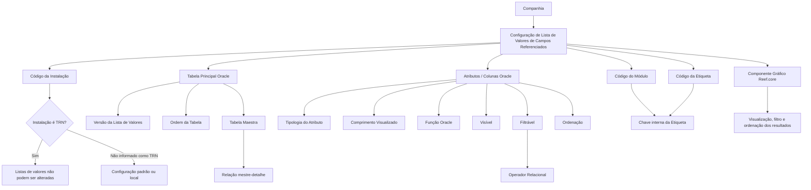

# Definição das Listas de Valores de Campos Referenciados no Reef.core

## 1. Metadados do Documento
- **Arquivo de Origem:** Não identificado no conteúdo extraído
- **Tipo de Documento:** Especificação Técnica / Documentação Funcional
- **Domínio / Sistema:** Reef.core — configuração de listas de valores de campos referenciados
- **Público-Alvo:** Desenvolvedores, Arquitetos, Analistas Funcionais, Equipes de Configuração
- **Data/Versão Identificada:** Não identificada
- **Owner identificado:** `user:agonzalez_mapfre.com`
- **Lifecycle identificado:** Approved Source

---

## 2. Resumo Executivo & Contexto de Negócio

O documento descreve a definição e a configuração das **listas de valores de campos referenciados** no sistema Reef.core. Essas listas são utilizadas quando dados codificados são armazenados em entidades Oracle separadas e precisam ser apresentados em componentes gráficos da interface do Reef.core.

O Reef.core diferencia dados de livre formato de dados codificados. Quando a quantidade possível de valores de um dado codificado é pequena, os valores podem ser armazenados de forma compartilhada nos repositórios de **listas de valores** e **opções das listas de valores**. Quando a quantidade de valores é objetivamente grande, as equipes de tecnologia normalmente criam entidades separadas na base de dados para registro e armazenamento.

As listas de valores de campos referenciados atendem ao cenário em que registros de uma entidade Oracle precisam ser filtrados segundo critérios variáveis. Para esse cenário, o Reef.core disponibiliza os repositórios de informação denominados **listas de valores de campos referenciados** e **filtros das listas de valores de campos referenciados**.

A configuração identifica tabelas, colunas, versões, ordem de composição, atributos visíveis, critérios de filtragem, operadores relacionais, etiquetas, módulos e variáveis globais. Esses elementos permitem que o componente gráfico do Reef.core forme e apresente adequadamente o resultado da busca.

O documento também estabelece uma restrição crítica de governança: listas associadas à instalação de núcleo **TRN** não podem ser alteradas. Para cada companhia, podem coexistir somente registros da instalação TRN e da instalação local, distinguindo configurações padrão das configurações locais.

---

## 3. Arquitetura, Componentes & Tecnologias Envolvidas

### Componentes e repositórios identificados

| Componente / Tecnologia | Papel identificado no documento |
| :--- | :--- |
| Reef.core | Sistema que mantém os catálogos e apresenta listas de valores em sua interface gráfica. |
| Listas de valores | Repositório compartilhado para dados codificados com pequena quantidade de valores possíveis. |
| Opções das listas de valores | Repositório compartilhado associado às listas de valores. |
| Listas de valores de campos referenciados | Repositório de configuração para listas baseadas em entidades separadas da base de dados. |
| Filtros das listas de valores de campos referenciados | Repositório para configurar critérios variáveis de filtragem. |
| Base de dados Oracle | Base de dados cujas entidades e colunas são configuradas para compor as listas de valores. |
| Tabela principal | Entidade Oracle que contém as informações da lista de valores. |
| Tabela maestra | Tabela usada na composição de uma relação mestre-detalhe com a tabela principal. |
| Componente gráfico da interface Reef.core | Componente responsável por formar, exibir, filtrar e ordenar listas de valores. |
| Instalação TRN | Instalação de núcleo do Reef.core; suas listas de valores não podem ser alteradas. |
| Instalação local | Instalação local que pode coexistir com TRN para uma companhia. |



> **Nota de Análise:** O documento menciona entidades Oracle e funções de grupo Oracle, mas não informa versões de Oracle, nomes concretos de tabelas, contratos de integração, métodos HTTP, URLs, ambientes técnicos ou detalhes de implementação.

---

## 4. Regras de Negócio, Especificações Funcionais & Processos

### 4.1 Modelo de armazenamento de dados codificados

1. O Reef.core captura dados de livre formato e dados codificados.
2. Quando o número de valores possíveis de um dado codificado é objetivamente grande, as equipes de tecnologia normalmente criam entidades separadas na base de dados para registrar e armazenar esses valores.
3. Quando o número de valores possíveis de um dado é pequeno, os valores podem ser incorporados e armazenados de maneira compartilhada nos repositórios:
   - Listas de valores.
   - Opções das listas de valores.
4. Quando a informação está armazenada em uma entidade separada e é necessário filtrar seus registros por critérios mutáveis ou variáveis, os critérios devem ser configurados nos repositórios:
   - Listas de valores de campos referenciados.
   - Filtros das listas de valores de campos referenciados.
5. Essa configuração permite que o componente gráfico da interface Reef.core forme e visualize adequadamente o resultado da busca.

### 4.2 Configuração da lista de valores de campos referenciados

1. A configuração deve indicar a **companhia** à qual a definição pertence.
2. A configuração deve indicar o **código da instalação** associado à lista.
3. Caso a instalação configurada seja a instalação de núcleo, identificada como **TRN**, as listas de valores não podem ser alteradas sob nenhuma circunstância.
4. A **tabela principal** deve identificar a entidade Oracle que contém a informação da lista de valores.
5. A **versão da lista de valores** deve identificar a versão da lista para a tabela em questão.
6. Uma mesma tabela pode possuir diferentes listas de valores ou diferentes critérios de busca.
7. A versão deve ser um valor consecutivo iniciado em `1`.
8. A propriedade **ordem tabela** deve indicar a ordem da tabela ou das tabelas consideradas para formar a sentença de obtenção das informações.
9. A ordem da tabela deve ser um número inteiro consecutivo iniciado em `1`.
10. A **tabela maestra** deve identificar o código da tabela que compõe uma sentença com a tabela principal segundo uma relação mestre-detalhe (`master-detail`).
11. A propriedade **ordem coluna** deve indicar a ordem da coluna considerada na lista de valores de campos referenciados.
12. A ordem da coluna deve ser um número inteiro consecutivo iniciado em `1`.
13. O **atributo da tabela** deve identificar a coluna Oracle que aparecerá na lista.
14. A **tipologia do atributo da tabela** deve indicar o tipo de dado da coluna. O documento cita:
    - `C` para caracteres.
    - `F` para datas.
    - `N` para valores numéricos.
15. O **comprimento visualizado** deve determinar a extensão do atributo que o componente gráfico deve considerar e apresentar na lista.
16. A propriedade **Função Oracle?** deve indicar se o atributo é uma função de grupo Oracle.
17. Quando o atributo for uma função Oracle, o nome do atributo deve referenciar o tipo de função, como:
    - `SUM` para operações de adição.
    - `MIN` para determinar o valor mínimo.
    - `MAX` para determinar o valor máximo.
18. O **código do módulo** deve identificar o código do módulo Reef.core conforme os valores existentes na tabela maestra do núcleo Reef.core.
19. O **código da etiqueta** deve identificar a etiqueta.
20. A combinação **Código do Módulo + Código da Etiqueta** forma a chave interna das etiquetas.
21. A **variável global** deve identificar a variável global associada ao valor da coluna da tabela na lista.
22. A propriedade **Visible?** deve definir se o atributo aparecerá na lista de valores e no componente gráfico da interface Reef.core.
23. A propriedade **Filtro?** deve definir se a coluna poderá ser filtrada no componente gráfico da interface Reef.core.
24. A propriedade **Ordenação?** deve definir se os registros devem ser visualizados ordenados pelo atributo da tabela.
25. O **operador relacional** somente se aplica quando o atributo de tabela for visível e puder ser usado como filtro na lista de valores de campos relacionados.

### 4.3 Operadores relacionais permitidos

| Código | Operador | Significado informado |
| :--- | :--- | :--- |
| `=` | Igual | Igual |
| `!=` | Distinto | Diferente |
| `<` | Menor | Menor que |
| `<=` | Menor ou igual | Menor ou igual a |
| `>` | Maior | Maior que |
| `>=` | Maior ou igual | Maior ou igual a |
| `L` | Como | Operador “Como” |
| `B` | Entre | Operador “Entre” |

### 4.4 Restrição de coexistência de instalações

1. O catálogo de listas de valores de campos referenciados é um dos catálogos de configuração do Reef.core que os países podem personalizar.
2. Para uma companhia específica, somente podem coexistir:
   - Registros com código de instalação `TRN`.
   - Registros com o código da instalação local.
3. A coexistência de TRN e instalação local distingue se a configuração é padrão ou local.
4. A relação de listas de valores TRN deve ser respeitada obrigatoriamente por fazer parte do núcleo Reef.core.

---

## 5. Tabelas de Parâmetros, Ambientes e Estruturas de Dados

| Item / Parâmetro | Descrição / Função | Tipo / Valores / Formato | Ambiente / Observações |
| :--- | :--- | :--- | :--- |
| Companhia | Código da companhia sobre a qual é definida a lista de valores de campos referenciados. | Código de companhia; formato não detalhado. | Catálogo de definição. |
| Código da instalação | Identifica a instalação associada à lista de valores de campos referenciados. | Inclui `TRN` e instalação local. | Se for `TRN`, a lista não pode ser alterada. |
| Tabela principal | Nome da entidade Oracle que contém a informação da lista de valores. | Nome de entidade Oracle. | Base de dados Oracle. |
| Versão da lista de valores | Identifica a versão da lista de valores para a tabela. | Consecutivo iniciado em `1`. | Uma tabela pode possuir múltiplas listas ou critérios de busca. |
| Ordem tabela | Define a ordem das tabelas consideradas na sentença de obtenção de informações. | Número inteiro consecutivo iniciado em `1`. | Aplicável quando uma ou mais tabelas compõem a sentença. |
| Tabela Maestra | Identifica o código de tabela maestra que compõe uma relação com a tabela principal. | Código de tabela; formato não detalhado. | Relação mestre-detalhe (`master-detail`). |
| Ordem coluna | Define a ordem da coluna considerada na lista de valores. | Número inteiro consecutivo iniciado em `1`. | Configuração de atributos da lista. |
| Atributo de la tabla | Identifica a coluna Oracle que deve aparecer na lista. | Atributo / coluna Oracle. | Pode ser visível, filtrável e ordenável. |
| Tipología del Atributo de la tabla | Determina o tipo de dado da coluna exibida. | `C` caracteres, `F` datas, `N` valores numéricos; outros não detalhados. | Configuração da coluna Oracle. |
| Longitud visualizada | Determina o comprimento do atributo que o componente gráfico exibirá. | Comprimento; formato numérico não detalhado. | Interface gráfica Reef.core. |
| Función Oracle? | Define se o atributo é uma função de grupo Oracle. | Sim/Não não explicitamente codificado. | Quando aplicável, o nome do atributo deve indicar a função. |
| Funções Oracle citadas | Funções de grupo que podem ser referenciadas no atributo. | `SUM`, `MIN`, `MAX`. | `SUM`: adição; `MIN`: mínimo; `MAX`: máximo. |
| Código del Módulo | Identifica o módulo Reef.core conforme valores da tabela maestra do núcleo. | Código de módulo; formato não detalhado. | Componente da chave interna da etiqueta. |
| Código de la etiqueta | Identifica uma etiqueta. | Código de etiqueta; formato não detalhado. | Com o código do módulo, forma a chave interna. |
| Chave interna da etiqueta | Identificador interno das etiquetas. | Dupla: Código do Módulo + Código da Etiqueta. | Regra explícita do documento. |
| Variable Global | Identifica variável global associada ao valor da coluna na lista. | Variável global; formato não detalhado. | Associada ao atributo de tabela. |
| Visible? | Define se o atributo será exibido na lista e no componente gráfico. | Indicador de visibilidade; valores não detalhados. | Interface Reef.core. |
| Filtro? | Define se a coluna poderá ser usada em filtragem no componente gráfico. | Indicador de filtragem; valores não detalhados. | Habilita o uso de operador relacional quando o atributo também é visível. |
| Ordenación? | Define se os registros serão exibidos ordenados pelo atributo. | Indicador de ordenação; valores não detalhados. | Interface Reef.core. |
| Operador Relacional | Define a comparação disponível para interação do usuário com filtros. | `=`, `!=`, `<`, `<=`, `>`, `>=`, `L`, `B`. | Aplicável a atributo visível e filtrável. |
| Instalação TRN | Instalação de núcleo do Reef.core. | `TRN`. | Configurações TRN devem ser respeitadas e não podem ser alteradas. |
| Instalação local | Instalação específica de uma localidade ou país. | Código local não informado. | Pode coexistir com TRN para a mesma companhia. |

> **Nota de Análise:** O documento não apresenta URLs, servidores, portas, caminhos de log, nomes físicos de tabelas Oracle, formatos de campos, valores booleanos concretos ou ambientes como desenvolvimento, homologação e produção.

---

## 6. Bateria de Perguntas & Respostas para RAG (FAQ Sintético)

### P1: O que são listas de valores de campos referenciados no Reef.core?
**R:** Listas de valores de campos referenciados são configurações usadas pelo Reef.core quando os valores são armazenados em uma entidade separada da base de dados e precisam ser apresentados na interface. A configuração identifica tabelas, colunas, critérios de filtro, visibilidade, ordenação e operadores relacionais para que o componente gráfico possa formar e exibir o resultado da busca.

### P2: Quando o Reef.core utiliza listas de valores e opções de listas de valores compartilhadas?
**R:** O Reef.core pode utilizar os repositórios compartilhados de listas de valores e opções das listas de valores quando o número de possíveis valores de um dado codificado é pequeno. Para dados codificados com quantidade objetivamente grande de valores, o documento informa que as equipes de tecnologia normalmente criam entidades separadas na base de dados.

### P3: Quando devem ser usados filtros de listas de valores de campos referenciados?
**R:** Os filtros devem ser configurados quando a informação está em uma entidade de base de dados separada e os registros precisam ser filtrados segundo critérios mutáveis ou variáveis. O Reef.core possui os repositórios de listas de valores de campos referenciados e filtros das listas de valores de campos referenciados para esse propósito.

### P4: Uma lista de valores associada à instalação TRN pode ser modificada?
**R:** Não. Se o valor de instalação na configuração da lista corresponder à instalação de núcleo `TRN`, a lista de valores não poderá ser alterada sob nenhuma circunstância. Além disso, as relações de listas de valores TRN devem ser respeitadas obrigatoriamente, pois fazem parte do núcleo Reef.core.

### P5: Como deve ser configurada a versão de uma lista de valores para uma tabela Oracle?
**R:** A versão identifica a lista de valores de campos referenciados para uma tabela específica. Como uma mesma tabela pode possuir diferentes listas de valores ou critérios de busca, o valor da versão deve ser consecutivo e iniciar em `1`.

### P6: Qual é a regra para Ordem tabela e Ordem coluna?
**R:** A propriedade Ordem tabela indica a ordem da tabela ou das tabelas consideradas para formar a sentença de obtenção das informações, e deve ser um número inteiro consecutivo iniciado em `1`. A propriedade Ordem coluna indica a ordem da coluna considerada na lista de valores de campos referenciados e também deve ser um número inteiro consecutivo iniciado em `1`.

### P7: Qual é o papel da tabela maestra na configuração?
**R:** A tabela maestra identifica o código de tabela que compõe uma sentença com a tabela principal segundo uma relação mestre-detalhe, denominada no documento como `master-detail`. O documento não detalha a sintaxe da sentença nem os tipos de junção Oracle utilizados.

### P8: Quais tipologias de atributo de tabela são citadas?
**R:** O documento cita `C` para caracteres, `F` para datas e `N` para valores numéricos. O texto apresenta reticências após esses exemplos, portanto não fornece uma relação completa de tipologias suportadas.

### P9: Como uma função de grupo Oracle deve ser configurada em um atributo?
**R:** A propriedade Função Oracle? determina se o atributo é uma função de grupo Oracle. Quando for afirmativo, o nome do atributo de tabela deve referenciar a função utilizada. O documento cita `SUM` para operações de adição, `MIN` para determinar o valor mínimo e `MAX` para determinar o valor máximo.

### P10: Como é formada a chave interna das etiquetas no Reef.core?
**R:** A chave interna das etiquetas é formada pela combinação do Código do Módulo com o Código da Etiqueta. O Código do Módulo identifica o módulo Reef.core segundo valores existentes na tabela maestra do núcleo, enquanto o Código da Etiqueta identifica a etiqueta.

### P11: Quando um operador relacional pode ser configurado para uma coluna?
**R:** O operador relacional se aplica quando o atributo de tabela é visível e também pode ser usado como filtro na lista de valores de campos relacionados. Nesse contexto, o operador define o tipo de comparação disponível durante a interação do usuário com a interface Reef.core.

### P12: Quais operadores relacionais são suportados para filtros?
**R:** O documento lista os operadores `=` para Igual, `!=` para Distinto, `<` para Menor, `<=` para Menor ou igual, `>` para Maior, `>=` para Maior ou igual, `L` para Como e `B` para Entre.

### P13: Quantas instalações podem coexistir para uma companhia?
**R:** Nos catálogos de configuração do Reef.core que os países podem personalizar, incluindo o catálogo de listas de valores de campos referenciados, podem coexistir somente registros com o código de instalação `TRN` e registros com o código da instalação local. Essa distinção permite identificar configurações padrão e locais.

---

## 7. Glossário de Termos, Siglas & Conceitos-Chave

- **Reef.core:** Sistema citado no documento, responsável pelos catálogos de configuração e pela interface gráfica que apresenta listas de valores.
- **Lista de valores:** Repositório de informação compartilhado para armazenamento de dados codificados com pequeno número de valores possíveis.
- **Opções das listas de valores:** Repositório de informação associado às listas de valores.
- **Lista de valores de campos referenciados:** Repositório de configuração para listas formadas a partir de entidades separadas da base de dados.
- **Filtros das listas de valores de campos referenciados:** Repositório usado para configurar critérios variáveis de filtragem.
- **TRN:** Código da instalação de núcleo do Reef.core. Configurações associadas a TRN não podem ser alteradas.
- **Oracle:** Tecnologia de base de dados mencionada para entidades, colunas e funções de grupo.
- **Tabela principal:** Entidade Oracle que contém a informação da lista de valores.
- **Tabela maestra:** Tabela usada com a tabela principal para compor uma relação mestre-detalhe.
- **Master-detail:** Relação mestre-detalhe entre uma tabela maestra e uma tabela principal.
- **Atributo da tabela:** Coluna Oracle que pode aparecer em uma lista de valores.
- **Função de grupo Oracle:** Função aplicada a atributos de tabela, como `SUM`, `MIN` e `MAX`.
- **Código do Módulo:** Código que identifica um módulo Reef.core conforme valores da tabela maestra do núcleo.
- **Código da Etiqueta:** Identificador da etiqueta; combinado ao código do módulo, forma a chave interna da etiqueta.
- **Variável Global:** Variável associada ao valor da coluna da tabela na lista de valores.
- **Visible?:** Propriedade que define se o atributo será exibido.
- **Filtro?:** Propriedade que define se a coluna poderá ser filtrada.
- **Ordenación?:** Propriedade que define se os registros serão exibidos em ordem pelo atributo.
- **Operador Relacional:** Operador usado para filtrar atributos visíveis e filtráveis.

---

## 8. Notas Críticas, Riscos & Limitações

- As listas configuradas para a instalação `TRN` não podem ser alteradas em nenhuma circunstância.
- As relações de listas de valores TRN devem ser respeitadas obrigatoriamente por integrarem o núcleo Reef.core.
- Para cada companhia, a coexistência é limitada aos registros `TRN` e aos registros da instalação local.
- O documento não especifica os nomes de tabelas Oracle, nomes de colunas, modelos físicos, chaves de junção ou sentenças SQL.
- O documento não detalha formatos, domínios de valores ou codificações booleanas para propriedades como `Visible?`, `Filtro?`, `Ordenación?` e `Función Oracle?`.
- O documento cita os tipos `C`, `F` e `N`, mas não fornece o catálogo completo de tipologias de atributos.
- O documento não informa autenticação, autorização, perfis de acesso, auditoria, trilhas de alteração ou processo de aprovação de configurações.
- O documento recomenda a leitura de documentos funcionais e diretrizes relacionados, especialmente “Opciones de las Listas de Valores”, para evitar interpretação isolada incorreta.
- **Nota de Análise:** O conteúdo extraído contém caracteres corrompidos de codificação em termos como `definición`, `filtrar` e `configurar`. A interpretação semântica deste relatório preserva o sentido contextual aparente, sem criar informações adicionais.

---

## 9. Conteúdo Bruto Estruturado (Referência Fiel)

```text
--- [PÁGINA 1 DE 3] ---

DEFINICIÓN de las LISTAS de VALORES de Campos Referenciados
Contexto
¿Qué es una Lista de Valores?
En los programas de Reef.core se han de capturar datos: datos de libre formato y datos codicados. Si el número de posibles valores de un
dato codicado es objetivamente 'grande', los equipos de tecnología normalmente suelen crear entidades separadas en la base de datos para
su registro y almacenamiento mientras que si el número de posibles valores de un dato es pequeño se pueden juntar, incorporar y almacenar
de manera compartida en dos repositorios de información de Reef.core creados al efecto para ello: "listas de valores" y "opciones de las
listas de valores".
¿Qué es una Lista de Valores de campos referenciados?
En el caso que la información esté almacenada en la base de datos en una entidad separada en ocasiones es necesario ltrar los registros
que contenga de acuerdo con criterios cambiantes / criterios variables, en cuyo caso se tendrán que congurar dichos criterios en dos
repositorios de información de Reef.core creados al efecto para ello: "listas de valores de campos referenciados" y "ltros de las listas de
valores de campos referenciados" para que el componente gráco de la interfaz conforme y visualice adecuadamente el resultado de la
búsqueda.
En este documento haremos referencia a la identicación de los datos que van a conformar las listas de valores de campos referenciados.
Objetivo
Funcionalmente, Reef.core cuenta con la posibilidad de registrar la relación de posibles listas de valores de campos referenciados en un
repositorio de información propio.
Propiedades Operativas
Propiedades Operativas
Compañía
Este atributo del catálogo contiene el código de la compañía sobre la que se está realizando la denición de la lista de valores de campos
referenciados.
Código de la instalación
Esta propiedad de la denición identica el código de la instalación asociada a la lista de valores de campos referenciados.
Si el valor de la instalación en la conguración de la lista es la correspondiente a la instalación del núcleo, instalación (TRN) las listas de
valores no podrán alterarse bajo ningún concepto.
Documentation / DOCUMENTACIÓN Reef
DOCUMENTACIÓN Reef
Mapfredocument
DOCUMENTACIÓN Reef
Owner
user:agonzalez_mapfre.com
Lifecycle
Approved Source
 / 
 VL
Buscar Inicio Soluciones Arquitecturas APIs Componentes Cloud Documentación Zeus Reef Ayuda
ES


--- [PÁGINA 2 DE 3] ---

Tabla principal
Determina el nombre de la entidad Oracle que contiene la información de la lista de valores.
Versión de la lista de valores
Este atributo identica la versión de la lista de valores de campos referenciados para la tabla en cuestión.
Puesto que una misma tabla puede tener diferentes listas de valores o criterios de búsqueda sobre ella, el valor de esta propiedad debe
ser un consecutivo que inicie con el valor 1.
Orden tabla
Determina el orden de la tabla o tablas que se deben considerar para conformar la sentencia de obtención de la información.
Esta propiedad debe contener un número entero consecutivo que inicia con el valor 1.
Tabla Maestra
Identica el código de tabla maestra que conforma la sentencia entre ella y la tabla principal de la lista de valores en forma maestro-detalle ó
'master-detail'.
Orden columna
Determina el orden de la columna que se ha de considerar en la lista de valores de campos referenciados.
Esta propiedad debe contener un número entero consecutivo que inicia con el valor 1.
Atributo de la tabla
Identica el atributo (columna Oracle) de la tabla que debe aparecer en la lista de valores de campos referenciados.
Tipología del Atributo de la tabla
Determina si el tipo de dato de la columna de la tabla que aparece en la lista de valores de campos referenciados contiene C caracteres, F
fechas, N valores numéricos...
Longitud visualizada
Esta propiedad determina la longitud del atributo de la tabla que el componente gráco de la interfaz debe tomar y visualizar en la lista de
valores de campos referenciados.
Función Oracle?
Esta propiedad determina si el atributo de la tabla es o no una función de grupo Oracle en cuyo caso, de ser armativo, en el nombre del
atributo de la tabla se ha de referenciar el tipo de función: (SUM para operaciones de adición, MIN para determinar el valor mínimo, MAX para
determinar el valor máximo, ...).
Código del Módulo
Esta propiedad de la denición identica el código del módulo de Reef.core de acuerdo con los posibles valores existentes en la tabla
maestra existente en el núcleo de Reef.core.
Código de la etiqueta
Esta propiedad del catálogo determina el identicador de la etiqueta.
Consejo:
Consejo:
Consejo:


--- [PÁGINA 3 DE 3] ---

La dupla Código del Módulo + Código de la Etiqueta conforma la clave interna de las etiquetas.
Variable Global
Identica la variable global asociada al valor de la columna de la tabla en la lista de valores.
Visible?
Determina si el atributo de la tabla va a ser visible o no en la lista de valores de campos referenciados y en el componente gráco de la
interfaz de Reef.core.
Filtro?
Indica si la columna de la tabla que aparece en la lista de valores es susceptible de ser ltrada o no en el componente gráco de la interfaz de
Reef.core.
Ordenación?
Determina si el conjunto de registros de la lista de valores de campos referenciados se debe o no visualizar de manera ordenada por el
atributo de la tabla.
Operador Relacional
Caso que el Atributo de la tabla sea visible y susceptible de utilizarse como ltro en la lista de valores de campos relacionados, esta
propiedad del catálogo de conguración identica el tipo de operador relacional que se va a contemplar en la interacción del Usuario con la
interfaz de Reef.core al capturar un valor determinado.
Sus posibles valores son
(=) Igual
(!=) Distinto
(<) Menor
(<=) Menor o igual
(>) Mayor
(>=) Mayor o igual
(L) Como
(B) Entre
Vínculos
Relación de Directrices y Documentos funcionales cuya lectura recomendada para evitar que la interpretación aislada del presente
documento pueda conducir a error.
Opciones de las Listas de Valores
Preguntas frecuentes
(1) ¿Existe alguna restricción que tenga que ser tomada en cuenta en el uso y denición del catálogo de listas de valores de campos
referenciados de Reef.core?
Se han de respetar obligatoriamente la relación de listas de valores TRN por ser parte del núcleo de Reef.core.
(2) ¿Cuantas instalaciones pueden coexistir para una compañía en particular?
En general, en los catálogos de conguración de Reef.core que los países pueden personalizar (entre los que se encuentra este), únicamente
podrán coexistir registros con el código de instalación TRN y el código de la instalación local, distinguiendo así si la conguración realizada
es la estándar o local.
```
