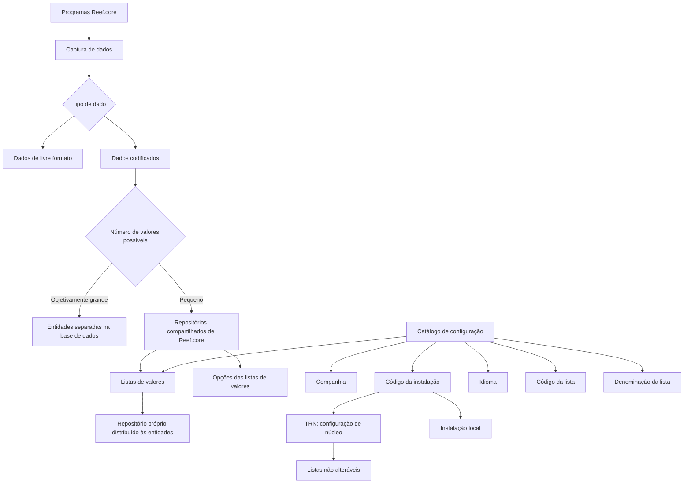

# Definição das Listas de Valores do Reef.core

## 1. Metadados do Documento
- **Arquivo de Origem:** Não identificado no conteúdo fornecido
- **Tipo de Documento:** Especificação Técnica / Documentação Funcional
- **Domínio / Sistema:** Reef.core
- **Público-Alvo:** Desenvolvedores, Arquitetos, Operação e equipes funcionais
- **Data/Versão Identificada:** Não identificada

---

## 2. Resumo Executivo & Contexto de Negócio

O documento define o contexto funcional das **Listas de Valores** no sistema **Reef.core**. Esse mecanismo é destinado ao armazenamento compartilhado de dados codificados que possuam uma quantidade objetivamente pequena de valores possíveis. Dados de livre formato e dados codificados são diferenciados no contexto da captura de informações pelos programas Reef.core.

Quando um dado codificado possui um número grande de valores possíveis, as equipes de tecnologia normalmente criam entidades separadas na base de dados para registro e armazenamento. Em contrapartida, valores codificados com poucos valores possíveis podem ser agrupados em dois repositórios de informação específicos: **listas de valores** e **opções das listas de valores**.

Funcionalmente, Reef.core registra a relação de possíveis listas de valores do sistema em um repositório próprio, distribuído às entidades. O documento concentra-se na identificação dos dados que compõem essas listas, bem como nas propriedades operativas de configuração.

A configuração inclui companhia, código de instalação, idioma, código da lista e denominação da lista. Existe uma restrição explícita para listas associadas à instalação de núcleo **TRN**: essas listas não podem ser alteradas. Também há uma convenção obrigatória para o código da lista, que deve iniciar com a constante `TIP_`.

---

## 3. Arquitetura, Componentes & Tecnologias Envolvidas

Os elementos identificados no documento são:

- **Reef.core:** sistema no qual as listas de valores são utilizadas e configuradas.
- **Listas de valores:** repositório compartilhado para valores codificados com poucos valores possíveis.
- **Opções das listas de valores:** repositório associado às listas de valores.
- **Catálogo de configuração:** catálogo que contém propriedades operativas da definição de listas de valores.
- **Instalação TRN:** instalação de núcleo do Reef.core; suas listas de valores não podem ser alteradas.
- **Instalação local:** instalação que pode coexistir com a instalação `TRN` para uma companhia, nos catálogos personalizáveis pelos países.
- **Entidades:** destinatárias da distribuição do repositório de listas de valores.



**Nota de Análise:** O documento não detalha tecnologias de implementação, estruturas físicas de banco de dados, contratos de API, métodos HTTP, mecanismos de distribuição ou interfaces de administração das listas de valores.

---

## 4. Regras de Negócio, Especificações Funcionais & Processos

### 4.1 Classificação de dados capturados no Reef.core

Os programas Reef.core devem capturar:

1. **Dados de livre formato**.
2. **Dados codificados**.

Para dados codificados, a estratégia de armazenamento depende do número de valores possíveis:

1. Quando o número de possíveis valores for objetivamente grande, as equipes de tecnologia normalmente criam entidades separadas na base de dados para registrar e armazenar os valores.
2. Quando o número de possíveis valores for pequeno, os valores podem ser agrupados, incorporados e armazenados de forma compartilhada nos repositórios Reef.core:
   - listas de valores;
   - opções das listas de valores.

### 4.2 Objetivo funcional das listas de valores

Reef.core permite registrar a relação de possíveis listas de valores do sistema em um repositório de informação próprio. Esse repositório é distribuído às entidades.

### 4.3 Propriedades operativas da definição

A definição de uma lista de valores possui as seguintes propriedades:

1. **Companhia:** contém o código da companhia para a qual a definição da lista de valores está sendo realizada.
2. **Código da Instalação:** identifica a instalação associada à lista de valores.
3. **Idioma:** identifica o idioma da denominação ou descrição da lista de valores; o documento cita espanhol, inglês e turco como exemplos.
4. **Código da Lista de Valores:** identifica internamente o código da lista no catálogo de configuração.
5. **Denominação da Lista de Valores:** contém a denominação ou descrição da lista de valores.

### 4.4 Regras obrigatórias de instalação

1. Caso o valor de instalação na configuração da lista corresponda à instalação de núcleo `TRN`, as listas de valores não podem ser alteradas sob nenhuma circunstância.
2. A relação de listas de valores `TRN` deve ser respeitada obrigatoriamente, pois faz parte do núcleo do Reef.core.
3. Em catálogos de configuração personalizáveis pelos países, incluindo o catálogo de listas de valores, podem coexistir somente:
   - um registro com código de instalação `TRN`;
   - um registro com o código da instalação local.
4. A coexistência de `TRN` e instalação local permite distinguir se a configuração é padrão ou local.

### 4.5 Convenção de codificação

O código da lista de valores deve iniciar obrigatoriamente com a constante:

```text
TIP_
```

A exigência segue as regras de programação existentes para o sistema.

### 4.6 Vínculos documentais

O documento informa a existência de uma relação de diretrizes e documentos funcionais cuja leitura é recomendada. A finalidade indicada é evitar interpretações incorretas decorrentes da leitura isolada deste documento.

**Nota de Análise:** Os títulos, localizações e conteúdos dessas diretrizes e documentos funcionais vinculados não foram detalhados no trecho fornecido.

---

## 5. Tabelas de Parâmetros, Ambientes e Estruturas de Dados

| Item / Parâmetro | Descrição / Função | Tipo / Valores / Formato | Ambiente / Observações |
| :--- | :--- | :--- | :--- |
| Companhia | Código da companhia para a qual a lista de valores é definida | Código de companhia; formato não detalhado | Aplicável à definição da lista de valores |
| Código da Instalação | Identifica a instalação associada à lista de valores | `TRN` ou código de instalação local | Para uma companhia, coexistem apenas `TRN` e instalação local nos catálogos personalizáveis pelos países |
| Instalação `TRN` | Instalação de núcleo do Reef.core | Valor literal: `TRN` | Listas associadas a `TRN` não podem ser alteradas |
| Instalação local | Código de instalação local | Código não detalhado | Distingue configuração local da configuração padrão `TRN` |
| Idioma | Idioma da denominação ou descrição da lista | Exemplos: espanhol, inglês, turco | O conjunto completo de idiomas não é detalhado |
| Código da Lista de Valores | Identificador interno da lista de valores no catálogo de configuração | Deve começar por `TIP_` | Convenção obrigatória conforme regras de programação do sistema |
| Denominação da Lista de Valores | Denominação ou descrição da lista de valores | Texto; formato não detalhado | Pode ser definida por idioma |
| Lista de valores | Repositório compartilhado para valores codificados com poucos valores possíveis | Estrutura não detalhada | Parte dos repositórios de informação do Reef.core |
| Opções das listas de valores | Repositório associado às listas de valores | Estrutura não detalhada | Mencionado como repositório compartilhado do Reef.core |
| Dados codificados com muitos valores | Dados que normalmente demandam entidades separadas | Quantidade “objetivamente grande”; limiar não detalhado | Armazenamento em entidades separadas na base de dados |
| Dados codificados com poucos valores | Dados elegíveis às listas de valores | Quantidade “pequena”; limiar não detalhado | Armazenamento compartilhado em listas e opções |

---

## 6. Bateria de Perguntas & Respostas para RAG (FAQ Sintético)

### P1: O que são listas de valores no Reef.core?
**R:** Listas de valores são repositórios de informação compartilhados do Reef.core utilizados para armazenar dados codificados quando o número de valores possíveis é pequeno. O documento também cita as opções das listas de valores como repositório associado a essa finalidade.

### P2: Quando um dado codificado deve ser armazenado em uma entidade separada na base de dados?
**R:** Quando o número de valores possíveis de um dado codificado for objetivamente grande, as equipes de tecnologia normalmente criam entidades separadas na base de dados para seu registro e armazenamento. O documento não define um limiar numérico para caracterizar “objetivamente grande”.

### P3: Quais são os repositórios utilizados para dados codificados com poucos valores possíveis?
**R:** Dados codificados com poucos valores possíveis podem ser agrupados, incorporados e armazenados de forma compartilhada nos repositórios denominados listas de valores e opções das listas de valores.

### P4: Qual é a finalidade funcional do repositório de listas de valores do Reef.core?
**R:** A finalidade funcional é registrar a relação de possíveis listas de valores do sistema em um repositório de informação próprio, que é distribuído às entidades.

### P5: Quais propriedades operativas compõem a definição de uma lista de valores?
**R:** A definição inclui companhia, código da instalação, idioma, código da lista de valores e denominação da lista de valores. O documento descreve essas propriedades como integrantes do catálogo de configuração.

### P6: Qual é a regra para uma lista de valores associada à instalação TRN?
**R:** Se a configuração da lista utilizar a instalação do núcleo, identificada como `TRN`, a lista de valores não poderá ser alterada sob nenhum conceito. A relação de listas `TRN` deve ser respeitada obrigatoriamente por fazer parte do núcleo do Reef.core.

### P7: Como deve ser formado o código de uma lista de valores?
**R:** O código da lista de valores deve iniciar com a constante `TIP_`, em conformidade com as regras de programação existentes para o sistema.

### P8: Quantas instalações podem coexistir para uma companhia em catálogos de configuração personalizáveis?
**R:** Para uma companhia específica, nos catálogos de configuração Reef.core que os países podem personalizar, podem coexistir apenas registros com o código da instalação `TRN` e com o código da instalação local. Essa coexistência diferencia configuração padrão de configuração local.

### P9: Qual é a função do idioma na definição de uma lista de valores?
**R:** O idioma identifica o idioma no qual a denominação ou descrição da lista de valores está definida. O documento apresenta espanhol, inglês e turco como exemplos.

### P10: O que representa a denominação da lista de valores?
**R:** A denominação da lista de valores é a propriedade que contém a denominação ou descrição atribuída à lista de valores.

### P11: O documento descreve APIs, métodos HTTP ou contratos JSON para listas de valores?
**R:** Não. O conteúdo fornecido descreve contexto funcional, propriedades operativas e restrições de configuração, mas não detalha APIs, métodos HTTP, contratos JSON, estruturas físicas de banco de dados ou mecanismos técnicos de distribuição.

### P12: Por que a leitura de diretrizes e documentos funcionais vinculados é recomendada?
**R:** A leitura é recomendada para evitar que a interpretação isolada do documento conduza a erro. Contudo, o trecho fornecido não especifica quais são essas diretrizes ou documentos funcionais.

---

## 7. Glossário de Termos, Siglas & Conceitos-Chave

- **Reef.core:** Sistema referido no documento como o contexto funcional das listas de valores e dos catálogos de configuração.
- **Lista de Valores:** Repositório compartilhado para dados codificados com pequeno número de valores possíveis.
- **Opções das Listas de Valores:** Repositório de informação citado em conjunto com as listas de valores.
- **Dado de livre formato:** Categoria de dado capturado pelos programas Reef.core; o documento não apresenta definição adicional.
- **Dado codificado:** Dado cujo conjunto de valores possíveis influencia a estratégia de armazenamento.
- **Catálogo de configuração:** Catálogo que contém as propriedades operativas da definição de listas de valores.
- **TRN:** Código da instalação de núcleo do Reef.core. Listas configuradas nessa instalação não podem ser alteradas.
- **Instalação local:** Código da instalação local que pode coexistir com `TRN` para uma companhia em catálogos personalizáveis.
- **`TIP_`:** Constante obrigatória que deve iniciar o código da lista de valores.

---

## 8. Notas Críticas, Riscos & Limitações

- As listas de valores associadas à instalação `TRN` são imutáveis. Alterações nesse contexto violariam uma restrição explícita do núcleo do Reef.core.
- A relação de listas de valores `TRN` deve ser obrigatoriamente respeitada.
- Para uma companhia, a coexistência de instalações é limitada a `TRN` e à instalação local nos catálogos de configuração que podem ser personalizados pelos países.
- O documento não define quantitativamente os termos “objetivamente grande” e “pequeno” para a quantidade de valores possíveis de um dado codificado.
- O documento não detalha modelo de dados, chaves, tipos de campos, regras de internacionalização além do atributo de idioma, APIs, permissões, trilhas de auditoria ou procedimentos de alteração.
- O documento recomenda consultar diretrizes e documentos funcionais vinculados, mas o trecho fornecido não contém a relação desses materiais.
- **Nota de Análise:** O texto de origem termina após `Ejemplo:`; nenhum exemplo posterior foi fornecido no conteúdo analisado.

---

## 9. Conteúdo Bruto Estruturado (Referência Fiel)

```text
--- [PÁGINA 1 DE 2] ---

DEFINICIÓN de las LISTAS de VALORES de Reef.core
Contexto
¿Qué es una Lista de Valores?
En los programas de Reef.core se han de capturar datos: datos de libre formato y datos codicados. Si el número de posibles valores de un
dato codicado es objetivamente 'grande', los equipos de tecnología normalmente suelen crear entidades separadas en la base de datos para
su registro y almacenamiento.
Ahora bien, si el número de posibles valores de un dato es pequeño se pueden juntar, incorporar y almacenar de manera compartida en dos
repositorios de información de Reef.core creados al efecto para ello: "listas de valores" y "opciones de las listas de valores".
En este documento haremos referencia a la identicación de los datos que van a conformar las listas de valores.
Objetivo
Funcionalmente, Reef.core cuenta con la posibilidad de registrar la relación de posibles listas de valores del sistema en un repositorio de
información propio que se distribuye a las entidades.
Propiedades Operativas
Propiedades Operativas
Compañía
Este atributo del catálogo contiene el código de la compañía sobre la que se está realizando la denición de la lista de valores.
Código de la Instalación
Esta propiedad de la denición identica el código de la instalación asociada a la lista de valores.
Si el valor de la instalación en la conguración de la lista es la correspondiente a la instalación del núcleo, instalación (TRN) las listas de
valores no podrán alterarse bajo ningún concepto.
Idioma
Esta propiedad identica el idioma en el que está denida la denominación o descripción de la lista de valores, como por ejemplo los idiomas
español, inglés, turco,...
Código de la Lista de Valores
Documentation / DOCUMENTACIÓN Reef
DOCUMENTACIÓN Reef
Mapfredocument
DOCUMENTACIÓN Reef
Owner
user:agonzalez_mapfre.com
Lifecycle
Approved Source
 / 
 VL
Buscar Inicio Soluciones Arquitecturas APIs Componentes Cloud Documentación Zeus Reef Ayuda
ES


--- [PÁGINA 2 DE 2] ---

Esta propiedad del catálogo de conguración identica internamente el código de la lista de valores
El código debe iniciar con la constante TIP_ de acuerdo con las reglas de programación existentes para el sistema.
Denominación de la Lista de Valores
Esta propiedad contempla la denominación o descripción que tiene la lista de valores.
Vínculos
Relación de Directrices y Documentos funcionales cuya lectura recomendada para evitar que la interpretación aislada del presente
documento pueda conducir a error.
Opciones de las Listas de Valores
Preguntas frecuentes
(1) ¿Existe alguna restricción que tenga que ser tomada en cuenta en el uso y denición del catálogo de listas de valores de Reef.core?
Se han de respetar obligatoriamente la relación de listas de valores TRN por ser parte del núcleo de Reef.core.
(2) ¿Cuantas instalaciones pueden coexistir para una compañía en particular?
En general, en los catálogos de conguración de Reef.core que los países pueden personalizar (entre los que se encuentra este), únicamente
podrán coexistir registros con el código de instalación TRN y el código de la instalación local, distinguiendo así si la conguración realizada
es la estándar o local.
Ejemplo:
```
