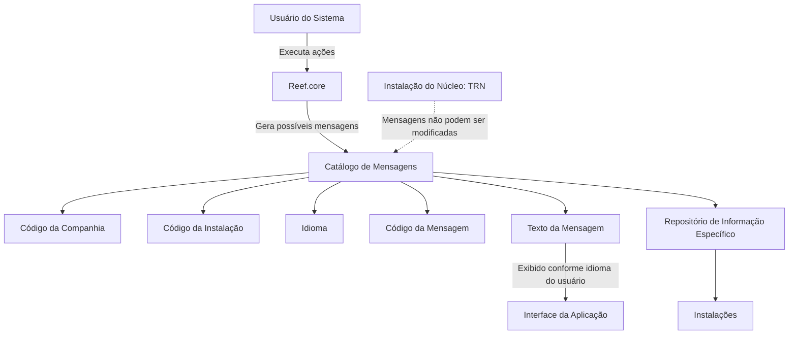

# Catálogo de Mensagens da Aplicação Reef.core — Definição, Propriedades Operativas e Restrições

## 1. Metadados do Documento
- **Arquivo de Origem:** Não identificado no conteúdo extraído
- **Tipo de Documento:** Especificação Funcional
- **Domínio / Sistema:** Reef.core / DOCUMENTACIÓN Reef / Mapfre
- **Público-Alvo:** Analistas funcionais, desenvolvedores, administradores de instalação e equipes de operação
- **Data/Versão Identificada:** Não identificada
- **Owner identificado:** `user:agonzalez_mapfre.com`
- **Lifecycle identificado:** `Approved Source / VL`

---

## 2. Resumo Executivo & Contexto de Negócio

O documento define o catálogo de mensagens da aplicação Reef.core. No contexto apresentado, uma mensagem é o conteúdo que o sistema, atuando como emissor ou comunicador, transmite ao usuário receptor que utiliza o sistema. O catálogo tem a finalidade de identificar, agrupar e organizar as mensagens que podem resultar das ações executadas pelo usuário.

Funcionalmente, Reef.core permite codificar a relação de mensagens em um repositório de informação específico. Esse repositório é entregue às instalações com o conteúdo necessário para o funcionamento correto do sistema. O catálogo considera atributos que contextualizam cada mensagem por companhia, instalação e idioma.

O documento estabelece uma restrição relevante para a instalação do núcleo: quando o valor da instalação corresponde à instalação do núcleo `TRN`, os mensagens não podem ser modificados. A seção de perguntas frequentes reforça que a configuração das mensagens associadas à instalação `TRN` deve ser obrigatoriamente respeitada.

A definição de cada mensagem abrange o código da companhia, o código da instalação, o idioma, o código da mensagem e o texto apresentado na interface. O texto exibido depende do idioma associado ao usuário que está utilizando Reef.core.

O atributo “Marca de control” é explicitamente classificado como obsoleto e descontinuado. Portanto, não deve ser usado nem reutilizado para qualquer finalidade local. Historicamente, esse atributo indicava se alterações nas definições de mensagens deveriam ser controladas durante envios de software.

---

## 3. Arquitetura, Componentes & Tecnologias Envolvidas

### Componentes e conceitos identificados

| Componente / Conceito | Descrição baseada no documento |
| :--- | :--- |
| Reef.core | Sistema no qual o catálogo de mensagens é definido e utilizado. |
| Catálogo de Mensagens | Estrutura destinada a identificar, agrupar e organizar mensagens resultantes de ações realizadas pelo usuário. |
| Repositório de informação específico | Repositório no qual a relação de mensagens pode ser codificada para distribuição às instalações. |
| Instalação | Contexto identificado por um código de instalação associado à mensagem. |
| Instalação do núcleo (`TRN`) | Instalação cujas mensagens não podem ser modificadas. |
| Companhia | Entidade identificada por código no catálogo de mensagens. |
| Idioma | Propriedade que identifica o idioma do texto da mensagem; o documento cita espanhol, inglês e turco como exemplos. |
| Interface da aplicação | Local onde o texto da mensagem é mostrado ao usuário segundo o idioma associado a esse usuário. |
| Usuário | Receptor da mensagem emitida pelo sistema. |
| Marca de control | Propriedade obsoleta e descontinuada que não deve ser utilizada. |



**Nota de Análise:** O documento descreve propriedades funcionais do catálogo de mensagens, mas não detalha tecnologias de implementação, estrutura física do repositório, métodos HTTP, contratos JSON, banco de dados, URLs, ambientes ou mecanismos de distribuição de software.

---

## 4. Regras de Negócio, Especificações Funcionais & Processos

### 4.1 Finalidade do catálogo de mensagens

1. O catálogo de mensagens identifica possíveis mensagens resultantes de ações realizadas ou executadas pelo usuário.
2. O catálogo agrupa mensagens no âmbito de Reef.core.
3. O catálogo organiza mensagens para permitir a gestão de conteúdo comunicado pelo sistema ao usuário.
4. O sistema é considerado o emissor ou comunicador da mensagem.
5. O usuário que utiliza o sistema é considerado o receptor da mensagem.

### 4.2 Codificação e disponibilidade das mensagens

1. Reef.core permite codificar a relação de mensagens.
2. A relação de mensagens é codificada em um repositório de informação específico.
3. O repositório é entregue às instalações.
4. O conteúdo entregue às instalações deve ser o necessário para o correto funcionamento do sistema.

### 4.3 Contextualização de uma mensagem

A definição de uma mensagem depende das seguintes propriedades operativas:

1. **Companhia:** determina o código da companhia sobre a qual a definição da mensagem está sendo realizada.
2. **Código da Instalação:** identifica o código da instalação associado à mensagem.
3. **Idioma:** identifica o idioma no qual o texto da mensagem está definido.
4. **Código do Mensagem:** determina o código identificador da mensagem textual.
5. **Texto do Mensagem:** determina o texto exibido na interface, de acordo com o idioma associado ao usuário que utiliza o sistema.

### 4.4 Regra de imutabilidade para a instalação do núcleo

1. Quando o valor da instalação for correspondente à instalação do núcleo `TRN`, as mensagens não poderão ser modificadas.
2. A configuração realizada para mensagens associadas à instalação `TRN` deve ser respeitada obrigatoriamente.
3. A restrição se aplica ao uso e à definição do catálogo de mensagens por companhia, instalação e idioma.

### 4.5 Regra sobre a propriedade “Marca de control”

1. A propriedade “Marca de control” é obsoleta.
2. A funcionalidade associada à propriedade foi descontinuada na definição da mensagem.
3. A propriedade não deve ser usada.
4. A propriedade não deve ser reutilizada para qualquer propósito de âmbito local.
5. Originalmente, a ativação da propriedade indicava se modificações efetuadas na definição de mensagens deveriam ser controladas durante envios de software.

### 4.6 Documentação relacionada

O documento recomenda a leitura das seguintes diretrizes e documentos funcionais para evitar uma interpretação isolada que possa conduzir a erro:

- Definición Programas
- Definición Usuarios del Sistema

**Nota de Análise:** O conteúdo extraído termina após “Ejemplo:” e a abertura de um bloco de código. Nenhum exemplo efetivo de configuração ou mensagem foi disponibilizado no texto recebido.

---

## 5. Tabelas de Parâmetros, Ambientes e Estruturas de Dados

### 5.1 Propriedades do catálogo de mensagens

| Item / Parâmetro | Descrição / Função | Tipo / Valores / Formato | Ambiente / Observações |
| :--- | :--- | :--- | :--- |
| Companhia | Contém o código da companhia sobre a qual a definição da mensagem está sendo realizada. | Código de companhia; formato não detalhado. | Aplicável à definição do catálogo. |
| Código da Instalação | Identifica o código da instalação associado à mensagem. | Código de instalação; formato não detalhado. | A instalação `TRN` possui restrição de modificação. |
| Idioma | Identifica o idioma no qual o texto da mensagem está definido. | Códigos de idioma; exemplos: espanhol, inglês e turco. | Determina o idioma do texto disponível para apresentação. |
| Código do mensagem | Determina o código da mensagem de texto. | Código de mensagem; formato não detalhado. | Identificador da mensagem textual. |
| Texto do Mensagem | Determina o texto exibido na interface da aplicação. | Texto; formato não detalhado. | Exibido de acordo com o idioma associado ao usuário. |
| Marca de control | Propriedade historicamente usada para indicar controle de alterações em envios de software. | Obsoleta / descontinuada. | Não deve ser usada ou reutilizada localmente. |

### 5.2 Restrições e estados operacionais identificados

| Item / Parâmetro | Descrição / Função | Tipo / Valores / Formato | Ambiente / Observações |
| :--- | :--- | :--- | :--- |
| Instalação do núcleo | Define o contexto de mensagens protegidas contra alteração. | `TRN` | Mensagens associadas a `TRN` não podem ser modificadas. |
| Configuração de mensagens `TRN` | Configuração de mensagens correspondentes à instalação do núcleo. | Configuração existente; detalhes não informados. | Deve ser respeitada obrigatoriamente. |
| Repositório de informação específico | Armazena a relação codificada de mensagens. | Estrutura não detalhada. | É entregue às instalações para o correto funcionamento do sistema. |
| Controle de modificações | Função histórica associada à Marca de control. | Descontinuada. | Referia-se a modificações em definições de mensagens durante envios de software. |

### 5.3 Dados documentais identificados

| Item / Parâmetro | Descrição / Função | Tipo / Valores / Formato | Ambiente / Observações |
| :--- | :--- | :--- | :--- |
| Área documental | Identificação exibida no conteúdo extraído. | `Documentation / DOCUMENTACIÓN Reef` | Associada à documentação Reef. |
| Fonte documental | Identificação exibida no conteúdo extraído. | `Mapfredocument` | Sem detalhamento adicional. |
| Owner | Proprietário identificado no documento. | `user:agonzalez_mapfre.com` | Conforme conteúdo extraído. |
| Lifecycle | Estado de ciclo de vida identificado. | `Approved Source / VL` | Significado de `VL` não detalhado. |
| Navegação documental | Itens de navegação visíveis na extração. | Buscar, Inicio, Soluciones, Arquitecturas, APIs, Componentes, Cloud, Documentación, Zeus, Reef, Ayuda | Não constitui especificação funcional do catálogo. |
| Idioma da interface documental | Idioma exibido na página documental. | `ES` | O documento está predominantemente em espanhol. |

---

## 6. Bateria de Perguntas & Respostas para RAG (FAQ Sintético)

### P1: Qual é a finalidade do catálogo de mensagens em Reef.core?
**R:** O catálogo de mensagens em Reef.core tem como finalidade identificar, agrupar e organizar os possíveis mensagens que podem ocorrer como resultado das ações realizadas ou executadas pelo usuário no sistema. No contexto descrito, o sistema atua como emissor da mensagem e o usuário atua como receptor.

### P2: Quais propriedades compõem a definição de uma mensagem no catálogo Reef.core?
**R:** A definição de uma mensagem inclui Companhia, Código da Instalação, Idioma, Código do mensagem e Texto do Mensagem. Esses atributos identificam o contexto corporativo, a instalação, o idioma do conteúdo, o identificador textual da mensagem e o texto apresentado na interface.

### P3: O que representa a propriedade Companhia no catálogo de mensagens?
**R:** A propriedade Companhia contém o código da companhia sobre a qual está sendo realizada a definição da mensagem. O documento não informa o formato técnico, tamanho ou domínio de valores desse código.

### P4: Como o idioma influencia a exibição de uma mensagem em Reef.core?
**R:** O atributo Idioma identifica o idioma no qual o texto da mensagem foi definido. O Texto do Mensagem é exibido na interface da aplicação de acordo com o idioma associado ao usuário que está utilizando o sistema. O documento cita espanhol, inglês e turco como exemplos de idiomas identificáveis por códigos.

### P5: As mensagens da instalação `TRN` podem ser alteradas?
**R:** Não. Quando o valor da instalação corresponde à instalação do núcleo `TRN`, as mensagens não podem ser modificadas. A configuração dos mensagens que correspondem à instalação `TRN` deve ser respeitada obrigatoriamente.

### P6: Qual é a restrição aplicável ao uso do catálogo de mensagens por companhia, instalação e idioma?
**R:** A restrição explicitamente indicada é que devem ser respeitadas obrigatoriamente as configurações realizadas para mensagens correspondentes à instalação do núcleo `TRN`. Essa regra se aplica ao uso e à definição do catálogo de mensagens por companhia, instalação e idioma.

### P7: Para que servia originalmente a propriedade “Marca de control”?
**R:** Originalmente, a ativação da propriedade “Marca de control” na etiqueta indicava se as modificações efetuadas na definição das mensagens deveriam ser controladas nos envios de software.

### P8: A propriedade “Marca de control” deve ser utilizada em novas definições locais?
**R:** Não. A propriedade “Marca de control” é obsoleta, sua funcionalidade foi descontinuada na definição de mensagens e ela não deve ser usada nem reutilizada para qualquer finalidade de âmbito local.

### P9: Onde a relação de mensagens pode ser codificada em Reef.core?
**R:** A relação de mensagens pode ser codificada em um repositório de informação específico. Esse repositório é entregue às instalações com o conteúdo necessário para o correto funcionamento do sistema.

### P10: O documento especifica APIs, métodos HTTP ou contratos JSON do catálogo de mensagens?
**R:** Não. O documento extraído descreve o objetivo funcional do catálogo, suas propriedades operativas, a restrição da instalação `TRN` e a obsolescência da Marca de control. Não há detalhamento de APIs, métodos HTTP, contratos JSON, banco de dados ou tecnologias de implementação.

### P11: Quais documentos relacionados são recomendados para leitura complementar?
**R:** O documento recomenda a leitura de “Definición Programas” e “Definición Usuarios del Sistema”. A recomendação existe para evitar que uma interpretação isolada do documento atual conduza a erro.

### P12: O que o Código da Instalação representa na definição de uma mensagem?
**R:** O Código da Instalação identifica o código da instalação associado à mensagem. O documento não detalha seu formato, mas estabelece que mensagens associadas à instalação do núcleo `TRN` não podem ser modificadas.

---

## 7. Glossário de Termos, Siglas & Conceitos-Chave

- **Reef.core:** Sistema no qual o catálogo de mensagens é definido e utilizado.
- **Catálogo de Mensagens:** Estrutura usada para identificar, agrupar e organizar mensagens decorrentes de ações do usuário.
- **Mensagem:** Conteúdo que o sistema deseja transmitir ao usuário; no contexto descrito, o sistema é o emissor e o usuário é o receptor.
- **Companhia:** Atributo que contém o código da companhia sobre a qual uma mensagem é definida.
- **Código da Instalação:** Atributo que identifica a instalação associada a uma mensagem.
- **Idioma:** Atributo que identifica o idioma no qual o texto da mensagem é definido.
- **Código do mensagem:** Atributo que determina o código da mensagem de texto.
- **Texto do Mensagem:** Texto exibido na interface da aplicação conforme o idioma associado ao usuário.
- **TRN:** Código identificado como a instalação do núcleo. Mensagens associadas a essa instalação não podem ser modificadas.
- **Marca de control:** Propriedade obsoleta e descontinuada; não deve ser usada nem reutilizada.
- **Repositório de informação específico:** Repositório no qual Reef.core pode codificar a relação de mensagens para entrega às instalações.
- **Lifecycle:** Campo exibido com o valor `Approved Source / VL`; o documento não define seu significado operacional.
- **VL:** Sigla exibida no campo Lifecycle; significado não identificado no conteúdo extraído.

---

## 8. Notas Críticas, Riscos & Limitações

- **Restrição crítica de alteração:** Mensagens correspondentes à instalação do núcleo `TRN` não podem ser modificadas. Alterações que desrespeitem essa configuração violam uma regra explicitamente indicada no documento.
- **Atributo descontinuado:** A “Marca de control” não deve ser usada ou reutilizada em âmbito local, pois sua funcionalidade está descontinuada.
- **Risco de interpretação isolada:** O próprio documento alerta que sua leitura isolada pode conduzir a erro e recomenda consultar “Definición Programas” e “Definición Usuarios del Sistema”.
- **Ausência de especificação técnica detalhada:** Não foram identificados detalhes sobre modelo de dados, persistência, APIs, integrações, mecanismos de entrega, ambientes, versões, URLs, métodos de autenticação ou contratos de interface.
- **Extração incompleta:** O conteúdo termina em “Ejemplo:” com a abertura de um bloco de código, mas não contém o exemplo prometido. Não é possível inferir a configuração ou o formato do exemplo ausente.
- **Termo não definido:** O valor `VL`, exibido no campo Lifecycle como `Approved Source / VL`, não é explicado no conteúdo fornecido.

---

## 9. Conteúdo Bruto Estruturado (Referência Fiel)

```text
--- [PÁGINA 1 DE 2] ---

DEFINICIÓN de los MENSAJES de la Aplicación
Contexto
En ciencias de la comunicación, el mensaje es aquello que se desea comunicar, es decir, el contenido que el emisor desea transmitirle al
receptor (en el ámbito de Reef.core el 'emisor o comunicador' es el sistema y el receptor es el Usuario que utiliza el Sistema).
La nalidad básica del catálogo de mensajes en el ámbito de Reef.core es identicar, agrupar y organizar los posibles mensajes que pueden
darse como resultado de las acciones que realiza o ejecuta el Usuario.
Objetivo
Funcionalmente, Reef.core cuenta con la posibilidad de codicar la relación de mensajes en un repositorio de información especíco que se
entrega a las instalaciones con el contenido necesario para el correcto funcionamiento del Sistema.
Si el valor de la instalación es la correspondiente a la instalación del núcleo, instalación (TRN) los mensajes no podrán modicarse.
Propiedades Operativas
Propiedades Operativas
Compañía
Este atributo del catálogo contiene el código de la compañía sobre la que se está realizando la denición del mensaje.
Código de la Instalación
Esta propiedad de la denición identica el código de la instalación asociado al mensaje.
Idioma
Esta propiedad identica el idioma en el que está denido el texto del mensaje, como por ejemplo con los códigos que identiquen a los
idiomas español, inglés, turco,...
Código del mensaje
Esta propiedad del catálogo determina el código del mensaje de texto.
Texto del Mensaje
Esta propiedad determina el texto que se mostrará en la interfaz de la aplicación de acuerdo con el idioma asociado al usuario que utiliza el
sistema.
Documentation / DOCUMENTACIÓN Reef
DOCUMENTACIÓN Reef
Mapfredocument
DOCUMENTACIÓN Reef
Owner
user:agonzalez_mapfre.com
Lifecycle
Approved Source
 /
VL
Buscar Inicio Soluciones Arquitecturas APIs Componentes Cloud Documentación Zeus Reef Ayuda
ES


--- [PÁGINA 2 DE 2] ---

Marca de control
Por ser una propiedad obsoleta, la funcionalidad de este atributo está descontinuada en la denición del mensaje por lo que no debe usarse o
reutilizarse para ningún propósito de ámbito local.
Originalmente la activación de esta propiedad en la etiqueta indicaba si se tenía o no que controlar en los envíos de software las
modicaciones efectuadas en la denición de los mensajes.
Vínculos
Relación de Directrices y Documentos funcionales cuya lectura recomendada para evitar que la interpretación aislada del presente
documento pueda conducir a error.
Denición Programas
Denición Usuarios del Sistema
Preguntas frecuentes
(1) ¿Existe alguna restricción que tenga que ser tomada en cuenta en el uso y denición del Catálogo de Mensajes por compañía, instalación
e idioma de Reef.core?
Se han de respetar obligatoriamente la conguración realizada de los mensajes que se corresponden con la instalación del núcleo (TRN).
Ejemplo:
```
