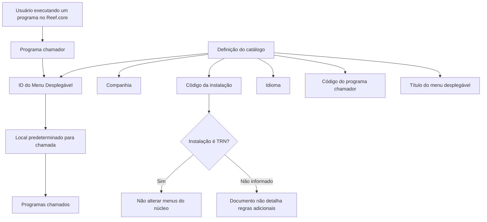

# Definição de Menus Desplegáveis de Programas no Reef.core

## 1. Metadados do Documento
- **Arquivo de Origem:** Não identificado no conteúdo fornecido
- **Tipo de Documento:** Procedimento / Especificação Funcional
- **Domínio / Sistema:** Reef.core / DOCUMENTACIÓN Reef / Mapfredocument
- **Público-Alvo:** Usuários responsáveis pela configuração funcional de programas e menus no Reef.core
- **Data/Versão Identificada:** Não identificada
- **Owner identificado:** `user:agonzalez_mapfre.com`
- **Lifecycle identificado:** Approved Source

---

## 2. Resumo Executivo & Contexto de Negócio

O documento descreve o catálogo utilizado para definir menus desplegáveis de programas no sistema Reef.core. Esses menus permitem que usuários acessem determinados programas sem abandonar a operação funcional ou o programa que está sendo executado naquele momento.

A configuração apresentada concentra-se nos programas chamadores: programas nos quais é permitida a funcionalidade de chamar outros programas por meio de um local predeterminado identificado como menu desplegável. Um mesmo programa pode possuir um ou mais locais a partir dos quais essas chamadas podem ser realizadas.

A definição do menu desplegável é associada a atributos operacionais como companhia, código da instalação, idioma, código do programa, identificador do menu e título do menu. Esses atributos determinam o contexto organizacional, técnico e de apresentação da configuração.

Existe uma restrição explícita para configurações associadas à instalação do núcleo, identificada como instalação `TRN`. Menus desplegáveis pertencentes ao núcleo da aplicação não devem ser alterados, pois são considerados parte inerente do núcleo do Reef.core.

---

## 3. Arquitetura, Componentes & Tecnologias Envolvidas

### Componentes e conceitos identificados

| Componente / Conceito | Descrição sustentada pelo documento |
| :--- | :--- |
| Reef.core | Sistema que permite configurar programas com funcionalidade de chamada a outros programas. |
| Catálogo de menus desplegáveis | Catálogo referido para identificar quais programas permitem o comportamento de chamadas a outros programas. |
| Programa chamador | Programa no qual é permitida a funcionalidade de realizar chamadas a outros programas. |
| Programas chamados | Programas que podem ser chamados a partir de programas configurados. O documento não detalha contratos, métodos ou mecanismos técnicos de chamada. |
| Instalação | Propriedade associada ao programa que contém o menu desplegável. |
| Instalação TRN | Instalação correspondente ao núcleo da aplicação. Menus relacionados a essa instalação não devem ser alterados. |
| Companhia | Código da companhia sobre a qual é realizada a definição do menu desplegável. |
| Idioma | Idioma utilizado na denominação do menu desplegável. |
| Mapfredocument | Nome exibido na navegação/documentação associada ao conteúdo. Não há detalhamento adicional. |



> **Nota de Análise:** O documento identifica a capacidade de um programa chamar outros programas, mas não detalha métodos HTTP, APIs, contratos JSON, tecnologias de integração, permissões, persistência de catálogo ou mecanismos de execução dessas chamadas.

---

## 4. Regras de Negócio, Especificações Funcionais & Processos

### Objetivo funcional

1. O Reef.core permite configurar programas que oferecem acesso a outros programas.
2. O acesso a outros programas pode ocorrer sem que o usuário saia da operação funcional em curso.
3. O acesso também pode ocorrer sem que o usuário abandone o programa que está executando.
4. O catálogo abordado pelo documento identifica os programas que permitem esse comportamento.
5. A definição inclui os programas que podem ser chamados a partir dos programas configurados.

### Regras para programas e menus

1. O código do programa identifica o programa chamador que permite chamadas a outros programas.
2. O ID do Menu Desplegável identifica o local predeterminado do programa chamador a partir do qual a chamada a outros programas pode ser realizada.
3. Um programa pode possuir um ou vários locais a partir dos quais chamadas a outros programas podem ser realizadas.
4. O título do menu desplegável identifica a denominação do menu.
5. O idioma determina o idioma no qual o menu desplegável é denominado.
6. A companhia determina o código da companhia sobre a qual a definição do menu desplegável é realizada.
7. O código da instalação identifica a instalação associada ao programa que contém o menu desplegável.

### Restrição obrigatória da instalação TRN

1. Caso o valor da instalação na configuração do menu desplegável corresponda à instalação do núcleo, isto é, à instalação `TRN`, os menus desplegáveis não devem ser alterados.
2. A justificativa explicitada é que esses menus são parte inerente do núcleo da aplicação.
3. A configuração de programas e menus desplegáveis do núcleo — aqueles com instalação `TRN` — deve ser obrigatoriamente respeitada.

---

## 5. Tabelas de Parâmetros, Ambientes e Estruturas de Dados

| Item / Parâmetro | Descrição / Função | Tipo / Valores / Formato | Ambiente / Observações |
| :--- | :--- | :--- | :--- |
| Companhia | Contém o código da companhia sobre a qual é realizada a definição do menu desplegável. | Código de companhia; formato não detalhado. | Associado ao catálogo de definição. |
| Código da Instalação | Identifica o código da instalação associada ao programa que contém o menu desplegável. | Código de instalação; formato não detalhado. | Se o valor for `TRN`, os menus não devem ser alterados. |
| Instalação TRN | Instalação correspondente ao núcleo da aplicação. | Valor explícito: `TRN`. | Configurações de programas e menus do núcleo devem ser respeitadas. |
| Idioma | Determina o idioma no qual o menu desplegável é denominado. | Idioma; valores não detalhados. | Aplicável à denominação do menu. |
| Código do programa | Identifica o código do programa chamador no qual são permitidas chamadas a outros programas. | Código de programa; formato não detalhado. | Representa o programa chamador. |
| ID do Menu Desplegável | Identifica o local predeterminado do programa chamador a partir do qual outros programas podem ser chamados. | Identificador; formato não detalhado. | Um programa pode possuir um ou vários IDs/locais de chamada. |
| Título do Menu Desplegável | Identifica a denominação do menu desplegável. | Texto; formato não detalhado. | A denominação depende do idioma configurado. |
| Programa chamador | Programa que permite realizar chamadas a outros programas. | Código de programa associado à definição. | O documento não detalha os programas chamados nem os contratos de chamada. |
| Programas chamados | Programas acessíveis a partir do programa chamador. | Não detalhado. | A documentação informa que podem ser chamados, sem especificar métodos ou interfaces. |
| Owner | Proprietário exibido no documento. | `user:agonzalez_mapfre.com` | Metadado documental. |
| Lifecycle | Estado exibido no documento. | `Approved Source` | Metadado documental. |

---

## 6. Bateria de Perguntas & Respostas para RAG (FAQ Sintético)

### P1: Qual é a finalidade dos menus desplegáveis de programas no Reef.core?
**R:** Os menus desplegáveis permitem acessar determinados programas sem sair da operação funcional em andamento e sem abandonar o programa que o usuário está executando no Reef.core.

### P2: O que o catálogo descrito no documento identifica?
**R:** O catálogo identifica quais programas permitem o comportamento de chamar outros programas por meio de menus desplegáveis.

### P3: O que representa o código do programa na definição do menu desplegável?
**R:** O código do programa identifica o programa chamador no qual é permitida a funcionalidade de realizar chamadas a outros programas.

### P4: Qual é a função do ID do Menu Desplegável?
**R:** O ID do Menu Desplegável identifica especificamente o local predeterminado do programa chamador a partir do qual podem ser realizadas chamadas aos programas.

### P5: Um programa pode ter mais de um local para chamar outros programas?
**R:** Sim. O documento declara que um programa pode ter um ou vários locais a partir dos quais pode realizar chamadas a outros programas.

### P6: O que define o título do Menu Desplegável?
**R:** O título do Menu Desplegável identifica a denominação do menu desplegável configurado.

### P7: Qual é a finalidade do atributo de idioma?
**R:** O atributo de idioma determina o idioma no qual o menu desplegável de programas é denominado.

### P8: O que ocorre quando a instalação configurada é TRN?
**R:** Quando a instalação configurada corresponde à instalação `TRN`, que representa o núcleo da aplicação, os menus desplegáveis não devem ser alterados.

### P9: Por que menus associados à instalação TRN não podem ser alterados?
**R:** Esses menus não devem ser alterados porque são considerados parte inerente do núcleo da aplicação, segundo o documento.

### P10: Quais configurações precisam ser obrigatoriamente respeitadas no Reef.core?
**R:** Devem ser obrigatoriamente respeitadas as configurações de programas e menus desplegáveis correspondentes ao núcleo, ou seja, aqueles associados à instalação `TRN`.

### P11: O documento especifica APIs, métodos HTTP ou contratos JSON para a chamada entre programas?
**R:** Não. O documento informa que programas podem chamar outros programas, mas não detalha APIs, métodos HTTP, contratos JSON, protocolos de integração ou estruturas de dados de requisição e resposta.

---

## 7. Glossário de Termos, Siglas & Conceitos-Chave

- **Reef.core:** Sistema citado como possuidor da funcionalidade de configurar programas que permitem chamadas a outros programas.
- **Menu Desplegável:** Menu associado a um programa chamador que disponibiliza locais predeterminados para chamadas a outros programas.
- **Programa chamador:** Programa no qual é permitida a funcionalidade de chamar outros programas.
- **Programas chamados:** Programas que podem ser acessados ou chamados a partir do programa chamador.
- **Catálogo:** Estrutura de configuração referida para identificar programas que permitem o comportamento de chamadas.
- **ID do Menu Desplegável:** Identificador do local predeterminado do programa chamador a partir do qual a chamada é realizada.
- **Instalação:** Código associado ao programa que contém o menu desplegável.
- **TRN:** Código da instalação correspondente ao núcleo da aplicação.
- **Núcleo da aplicação:** Parte inerente da aplicação cujas configurações de programas e menus devem ser respeitadas.
- **Mapfredocument:** Termo exibido na navegação/documentação; não possui definição adicional no conteúdo fornecido.

---

## 8. Notas Críticas, Riscos & Limitações

- A alteração de menus desplegáveis associados à instalação `TRN` é explicitamente proibida pelo documento.
- A interpretação isolada do documento pode conduzir a erro; o documento recomenda a leitura das diretrizes e documentos funcionais relacionados.
- São citadas como referências relacionadas: **Definición Programas** e **Preguntas frecuentes**.
- Não há detalhamento sobre mecanismos técnicos de chamada entre programas, APIs, autenticação, autorização, tratamento de erros, persistência ou integrações.
- Não são informados formatos, domínios de valores ou regras de validação para os códigos de companhia, instalação, programa e ID de menu.
- Não há especificação de ambientes, URLs, servidores, rotas de log, versões ou dependências técnicas.
- **Nota de Análise:** O documento lista o Reef.core e a instalação `TRN`, mas não fornece detalhes adicionais sobre arquitetura de implantação, componentes internos ou tecnologias utilizadas.

---

## 9. Conteúdo Bruto Estruturado (Referência Fiel)

```text
--- [PÁGINA 1 DE 2] ---

DEFINICIÓN de los MENUS DESPLEGABLES de Programas
Contexto
En ocasiones es necesario o deseable contar con la posibilidad de acceder a determinados programas, sin tener que salir de la operación
funcional o abandonar el Programa que el Usuario estuviera ejecutando en un momento determinado.
Objetivo
Funcionalmente, Reef.core cuenta con la posibilidad de congurar los programas que permiten dicha funcionalidad y cuales serán los
programas que podrán ser llamados desde ellos.
En este documento haremos referencia al primero de estos catálogos para identicar qué programas permiten este comportamiento.
Propiedades Operativas
Propiedades Operativas
Compañía
Este atributo del catálogo contiene el código de la compañía sobre la que se está realizando la denición del menú desplegable de
programas.
Código de la Instalación
Esta propiedad de la denición identica el código de la instalación asociada al programa que contiene el menú desplegable.
Si el valor de la instalación en la conguración del menú desplegable es la correspondiente a la instalación del núcleo (instalación TRN),
los menus desplegables no deben ser alterados por ser parte inherente al núcleo de la aplicación.
Idioma
Determina el idioma en el que se esté denominando el menú desplegable de programas.
Código del programa
Identica el código del programa llamador en el que se permite la funcionalidad de realizar llamadas a otros programas.
ID del Menú Desplegable
Identica especícamente el lugar predeterminado del programa llamador desde el que se puede realizar la llamada a los programas.
Documentation / DOCUMENTACIÓN Reef
DOCUMENTACIÓN Reef
Mapfredocument
DOCUMENTACIÓN Reef
Owner
user:agonzalez_mapfre.com
Lifecycle
Approved Source
 /
VL
Buscar Inicio Soluciones Arquitecturas APIs Componentes Cloud Documentación Zeus Reef Ayuda
ES


--- [PÁGINA 2 DE 2] ---

Un programa puede tener uno o varios lugares desde los que se puede realizar la llamada a otros programas.
Título del Menú Desplegable
Esta propiedad de la denición identica la denominación del menú desplegable.
Vínculos
Relación de Directrices y Documentos funcionales cuya lectura recomendada para evitar que la interpretación aislada del presente
documento pueda conducir a error.
Denición Programas
Preguntas frecuentes
(1) ¿Existe alguna restricción que tenga que ser tomada en cuenta en el uso y denición del catálogo de menús desplegables por compañía
de Reef.core?
Se han de respetar obligatoriamente la conguración realizada de los programas y menús desplegables correspondientes al núcleo (aquellos
con instalación TRN).
```
