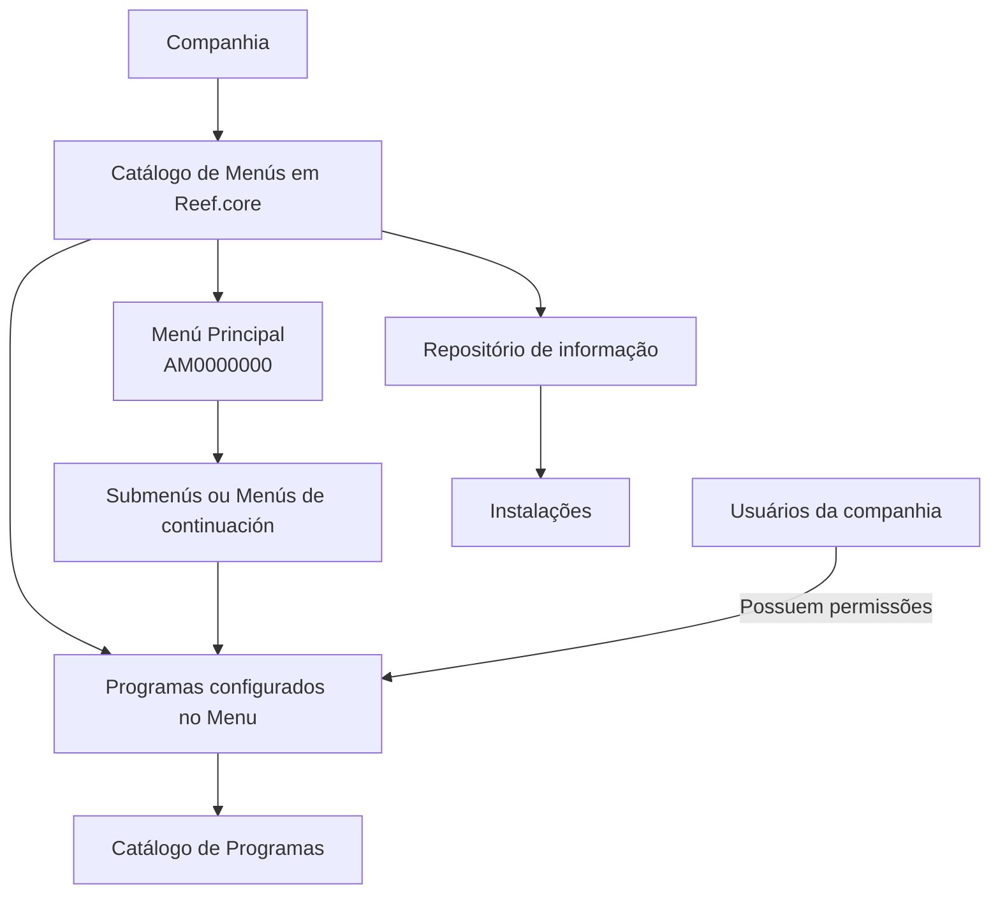

# Catálogo de Menús de Programas por Compañía em Reef.core

## 1. Metadados do Documento
- **Arquivo de Origem:** Não identificado no conteúdo fornecido
- **Tipo de Documento:** Especificação Técnica / Documentação Funcional
- **Domínio / Sistema:** Reef.core / Reef
- **Público-Alvo:** Desenvolvedores, analistas funcionais, administradores de configuração e usuários responsáveis por permissões
- **Data/Versão Identificada:** Não identificada
- **Owner identificado no conteúdo:** `user:agonzalez_mapfre.com`
- **Lifecycle identificado no conteúdo:** `Approved Source`

---

## 2. Resumo Executivo & Contexto de Negócio

O documento define o catálogo de menus de programas no âmbito de **Reef.core**. A finalidade declarada para o catálogo de menus é agrupar e organizar os programas da aplicação que os usuários da companhia podem executar, desde que possuam permissões para isso. O catálogo busca agilizar e facilitar a experiência de uso da aplicação.

Funcionalmente, Reef.core permite configurar tanto a relação de menus quanto os programas contidos em cada menu. Essas definições são mantidas em um mesmo repositório de informação e entregues às instalações com o conteúdo necessário para o correto funcionamento do sistema.

A configuração de menus é segmentada por companhia. O atributo **Compañía** contém o código da companhia para a qual a definição do menu de programas está sendo realizada. A definição também inclui o código do menu, a ordenação dos programas e o código de cada programa vinculado.

O documento estabelece que o menu principal da aplicação possui o valor constante `AM0000000`. A partir desse menu principal podem ser configurados submenus ou menus de continuação, destinados a expor funções mais específicas das operações executadas pelos usuários.

O documento também determina que um menu é, por si só, outro programa cuja tipologia o identifica como menu. Portanto, a propriedade de código do menu deve estar alinhada à definição correspondente do menu como programa no catálogo de programas. Como referência de nomenclatura, o nome de um menu normalmente é composto por `AM` + módulo associado + consecutivo.

---

## 3. Arquitetura, Componentes & Tecnologias Envolvidas

Os elementos funcionais identificados são:

| Componente / Conceito | Papel descrito |
| :--- | :--- |
| **Reef.core** | Âmbito no qual existe o catálogo de menus para agrupar e organizar programas da aplicação. |
| **Catálogo de Menús** | Estrutura de definição de menus de programas por companhia. |
| **Catálogo de Programas** | Catálogo no qual a definição do menu, considerado também um programa, deve estar coerente. |
| **Menú Principal** | Menu principal da aplicação, com valor constante `AM0000000`. |
| **Submenús / Menús de continuación** | Menus derivados do menu principal, usados para apresentar funções mais específicas. |
| **Programas** | Elementos executáveis pelos usuários quando estes possuem as permissões necessárias. |
| **Repositório de informação** | Repositório único que contém a relação de menus e os programas que cada menu contém. |
| **Instalações** | Destinatárias do conteúdo configurado no repositório para permitir o funcionamento correto do sistema. |



**Nota de Análise:** O documento não detalha tecnologias de implementação, protocolos de integração, métodos HTTP, contratos JSON, bancos de dados, URLs, ambientes técnicos ou mecanismos específicos de controle de permissões.

---

## 4. Regras de Negócio, Especificações Funcionais & Processos

### 4.1. Finalidade do catálogo de menus

1. O catálogo de menus em Reef.core deve agrupar e organizar os programas da aplicação.
2. Os programas podem ser executados por usuários da companhia somente quando os usuários possuem permissões para executá-los.
3. A organização de programas por menus tem como objetivo agilizar e facilitar a experiência do usuário.

### 4.2. Configuração funcional

1. Reef.core permite configurar a relação de menus.
2. Reef.core permite configurar os programas que cada menu contém.
3. A relação de menus e os programas associados devem residir no mesmo repositório de informação.
4. O conteúdo desse repositório é entregue às instalações.
5. O conteúdo entregue deve ser necessário para o correto funcionamento do sistema.

### 4.3. Definição por companhia

1. Cada definição de menu deve estar associada a uma companhia.
2. O atributo **Compañía** deve conter o código da companhia sobre a qual a definição do menu de programas é realizada.
3. O catálogo de menus é definido por companhia, devendo respeitar obrigatoriamente a configuração de menus e programas correspondente ao núcleo.

### 4.4. Menu principal, submenus e menus de continuação

1. O nome do menu principal da aplicação tem valor constante `AM0000000`.
2. A partir do menu principal podem ser configurados submenus.
3. A partir do menu principal podem ser configurados menus de continuação.
4. Submenus e menus de continuação procedem do menu principal.
5. Submenus e menus de continuação exibem funções mais específicas das operações a realizar.

### 4.5. Relação entre menu e programa

1. Um menu é considerado outro programa cuja tipologia assim o determina.
2. O valor do código do menu deve estar em consonância com a definição desse menu como programa no catálogo de programas.
3. O atributo **Código del programa** identifica o código do programa adscrito ao menu.
4. O atributo **Orden** define a ordem ou sequência de apresentação de um programa dentro da relação de programas configurados no menu.

### 4.6. Convenção de nomenclatura

A nomenclatura de um menu normalmente é formada por:

```text
AM + módulo associado + consecutivo
```

**Nota de Análise:** O documento utiliza o termo “normalmente”, portanto a composição `AM + módulo associado + consecutivo` é apresentada como convenção usual e não como uma regra absoluta explicitamente obrigatória.

---

## 5. Tabelas de Parâmetros, Ambientes e Estruturas de Dados

| Item / Parâmetro | Descrição / Função | Tipo / Valores / Formato | Ambiente / Observações |
| :--- | :--- | :--- | :--- |
| **Compañía** | Contém o código da companhia para a qual a definição do menu de programas é realizada. | Código de companhia; formato não detalhado. | Aplicável ao catálogo de menus por companhia em Reef.core. |
| **Código Menú** | Identifica o código do menu na definição de menu de programas. | Código; formato não detalhado. | Deve estar em consonância com a definição do menu como programa no catálogo de programas. |
| **Menú Principal** | Representa o menu principal da aplicação. | Valor constante: `AM0000000`. | Pode originar submenus ou menus de continuação. |
| **Submenús** | Menus derivados do menu principal. | Não detalhado. | Exibem funções mais específicas das operações a realizar. |
| **Menús de continuación** | Menus derivados do menu principal. | Não detalhado. | Exibem funções mais específicas das operações a realizar. |
| **Orden** | Indica a ordem ou sequência em que um programa é mostrado dentro de um menu. | Ordem/sequência; tipo numérico ou formato não detalhado. | Aplicável à relação de programas configurados no menu. |
| **Código del programa** | Identifica o código do programa adscrito ao menu. | Código; formato não detalhado. | O documento não especifica o contrato ou a estrutura do programa. |
| **Nome de menu** | Nome normalmente empregado para identificar um menu. | `AM` + módulo associado + consecutivo. | Convenção usual, não apresentada como formato obrigatório. |
| **Permissões de usuário** | Condição para que usuários da companhia possam executar programas. | Permissão; mecanismo não detalhado. | O documento não especifica matriz de permissões, papéis ou processo de concessão. |
| **Repositório de informação** | Armazena a relação de menus e os programas que os menus contêm. | Repositório; tecnologia não detalhada. | Seu conteúdo é entregue às instalações para funcionamento correto do sistema. |
| **Configuração do núcleo** | Configuração de menus e programas que deve ser respeitada obrigatoriamente. | Não detalhado. | Restrição expressa na seção de perguntas frequentes. |

---

## 6. Bateria de Perguntas & Respostas para RAG (FAQ Sintético)

### P1: Qual é a finalidade do catálogo de menus em Reef.core?
**R:** O catálogo de menus em Reef.core permite agrupar e organizar os programas da aplicação que podem ser executados pelos usuários da companhia, desde que os usuários possuam permissões para isso. A finalidade declarada é agilizar e facilitar a experiência dos usuários.

### P2: O que pode ser configurado no mesmo repositório de informação em Reef.core?
**R:** Reef.core permite configurar, no mesmo repositório de informação, tanto a relação de menus quanto os programas que cada menu contém. Esse conteúdo é entregue às instalações com os elementos necessários para o correto funcionamento do sistema.

### P3: Qual é o valor do menu principal da aplicação?
**R:** O nome do menu principal da aplicação possui o valor constante `AM0000000`.

### P4: É possível criar submenus em Reef.core?
**R:** Sim. A partir do menu principal podem ser configurados submenus ou menus de continuação. Esses menus procedem do menu principal e exibem funções mais específicas das operações que devem ser realizadas.

### P5: O que representa o atributo Compañía no catálogo de menus?
**R:** O atributo **Compañía** contém o código da companhia para a qual está sendo realizada a definição do menu de programas. O documento trata a configuração do catálogo de menus no contexto de cada companhia.

### P6: Qual é a função do atributo Orden em uma definição de menu?
**R:** O atributo **Orden** indica a ordem ou sequência em que um programa é exibido dentro da relação de programas configurados em determinado menu.

### P7: O que identifica o atributo Código del programa?
**R:** O atributo **Código del programa** identifica o código do programa adscrito ao menu. O documento não detalha o formato desse código nem os contratos ou métodos do programa.

### P8: Um menu também é considerado um programa?
**R:** Sim. O documento afirma que um menu é outro programa cuja tipologia assim o determina. Por essa razão, o valor do código do menu deve estar em consonância com a definição do menu como programa no catálogo de programas.

### P9: Como normalmente é formado o nome de um menu?
**R:** Normalmente, o nome de um menu é formado por `AM` seguido do módulo associado e de um consecutivo. O documento apresenta essa composição como uma prática usual.

### P10: Quais restrições devem ser observadas ao definir o catálogo de menus por companhia em Reef.core?
**R:** Deve-se respeitar obrigatoriamente a configuração realizada dos menus e programas correspondentes ao núcleo. O documento não detalha quais menus, programas ou mecanismos compõem esse núcleo.

### P11: O documento descreve como são concedidas as permissões de execução dos programas?
**R:** Não. O documento informa que os usuários podem executar programas caso possuam permissões, mas não descreve papéis, matriz de acesso, processo de concessão, autenticação ou tecnologia de autorização.

### P12: O documento especifica tecnologias, bancos de dados, URLs ou ambientes técnicos de Reef.core?
**R:** Não. O conteúdo fornecido descreve regras funcionais para definição do catálogo de menus, mas não especifica tecnologias de implementação, bancos de dados, URLs, servidores, portas, APIs ou ambientes técnicos.

---

## 7. Glossário de Termos, Siglas & Conceitos-Chave

- **Reef.core:** Âmbito do sistema no qual o catálogo de menus permite agrupar e organizar programas da aplicação.
- **Catálogo de Menús:** Catálogo usado para definir menus de programas por companhia.
- **Catálogo de Programas:** Catálogo que contém a definição de programas e no qual a definição de um menu, considerado também um programa, deve ser coerente.
- **Compañía:** Atributo que contém o código da companhia para a qual a definição de menu é realizada.
- **Código Menú:** Propriedade que identifica o código do menu.
- **Menú Principal:** Menu principal da aplicação, cujo valor constante é `AM0000000`.
- **Submenú:** Menu derivado do menu principal para apresentar funções mais específicas.
- **Menú de continuación:** Menu derivado do menu principal para apresentar funções mais específicas.
- **Orden:** Atributo que determina a ordem ou sequência de exibição de um programa dentro de um menu.
- **Código del programa:** Propriedade que identifica o programa adscrito ao menu.
- **AM:** Prefixo apresentado como parte da composição normal do nome de um menu.
- **Módulo asociado:** Módulo associado utilizado na composição normal do nome de um menu.
- **Consecutivo:** Elemento sequencial utilizado na composição normal do nome de um menu.
- **Núcleo:** Configuração de menus e programas que deve ser obrigatoriamente respeitada; o documento não detalha sua composição.

---

## 8. Notas Críticas, Riscos & Limitações

- A configuração de menus e programas correspondente ao **núcleo** deve ser respeitada obrigatoriamente. Alterações incompatíveis com essa configuração representam um risco funcional, embora o documento não detalhe mecanismos de validação ou bloqueio.
- A execução de programas depende de permissões de usuário, porém o documento não especifica modelo de autorização, papéis, matrizes de acesso, auditoria ou administração de permissões.
- Não há detalhamento sobre a tecnologia do repositório de informação, modelo de dados, processos de distribuição para instalações ou mecanismos de sincronização.
- Não são especificados formatos para código de companhia, código de menu, código de programa ou atributo de ordenação.
- Não são fornecidos métodos HTTP, contratos JSON, APIs, URLs, servidores, portas, ambientes, pipelines de implantação ou dependências técnicas.
- O conteúdo original contém caracteres de codificação aparentemente corrompidos em palavras como `nalidad`, `congurar`, `denición` e `especícas`. A interpretação semântica adotada neste relatório restringe-se ao contexto literal recuperável.
- **Nota de Análise:** O documento lista a relação entre catálogo de menus e catálogo de programas, porém não detalha os métodos de manutenção, persistência ou validação dessas relações.

---

## 9. Conteúdo Bruto Estruturado (Referência Fiel)

```text
--- [PÁGINA 1 DE 2] ---

DEFINICIÓN de los MENUS de Programas de la Aplicación
Contexto
La nalidad básica de tener un catálogo de menús en el ámbito de Reef.core permite agrupar y organizar los programas de la aplicación que
pueden ejecutar los usuarios de la compañía (siempre y cuando tengan permisos para ello) agilizando y facilitando la experiencia del usuario.
Objetivo
Funcionalmente, Reef.core cuenta con la posibilidad de congurar tanto la relación de menús como los programas que estos contienen en
un mismo repositorio de información que se entrega a las instalaciones con el contenido necesario para el correcto funcionamiento del
Sistema.
Propiedades Operativas
Propiedades Operativas
Compañía
Este atributo del catálogo contiene el código de la compañía sobre la que se está realizando la denición del menú de programas.
Código Menú
Esta propiedad de la denición identica el código del Menú.
El nombre del Menú Principal de la aplicación tiene el valor constante: 'AM0000000'. A partir del Menú Principal y de ser necesario podrán
congurarse Sub menús o menús de continuación, siendo estos los que proceden del menú principal y en los que se exhiben funciones
más especícas de la operaciones a realizar.
Puesto que un Menú no es más que otro programa cuya tipología así lo determina, el valor de dicha propiedad debe estar en consonancia
en la denición del menú (como programa) en el catálogo de programas.
Normalmente el nombre de un menú se conforma de la forma: AM + módulo asociado + Consecutivo.
Orden
Este atributo indica el orden o secuencia en el que se muestra el Programa dentro de la relación de Programas congurados en el Menú.
Código del programa
Consejo:
Documentation / DOCUMENTACIÓN Reef
DOCUMENTACIÓN Reef
Mapfredocument
DOCUMENTACIÓN Reef
Owner
user:agonzalez_mapfre.com
Lifecycle
Approved Source
 /
 VL
Buscar Inicio Soluciones Arquitecturas APIs Componentes Cloud Documentación Zeus Reef Ayuda
ES

--- [PÁGINA 2 DE 2] ---

Esta propiedad de la denición identica el código del programa adscrito al Menú.
Vínculos
Relación de Directrices y Documentos funcionales cuya lectura recomendada para evitar que la interpretación aislada del presente
documento pueda conducir a error.
Denición Programas
Preguntas frecuentes
(1) ¿Existe alguna restricción que tenga que ser tomada en cuenta en el uso y denición del Catálogo de Menús por compañía de Reef.core?
Se han de respetar obligatoriamente la conguración realizada de los menús y programas correspondientes al núcleo.
```
