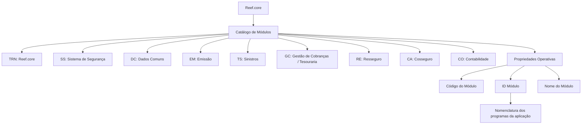

# Definição dos Módulos do Reef.core

## 1. Metadados do Documento
- **Arquivo de Origem:** `Não identificado no conteúdo fornecido`
- **Tipo de Documento:** `Especificação Técnica`
- **Domínio / Sistema:** `Reef.core / Mapfre`
- **Público-Alvo:** `Desenvolvedores, Arquitetos e equipes funcionais`
- **Data/Versão Identificada:** `Não identificada`

---

## 2. Resumo Executivo & Contexto de Negócio

O documento define o catálogo de módulos do sistema Reef.core. Funcionalmente, Reef.core permite codificar e configurar a relação dos módulos do sistema em um repositório específico de informações.

A definição de módulos estabelece propriedades operativas para identificação e descrição de cada módulo: Código do Módulo, ID Módulo e Nome do Módulo. O código identifica cada módulo de Reef.core; o ID representa o número atribuído ao módulo; e o nome contém a descrição funcional correspondente.

O documento determina que a nomenclatura de todos os programas da aplicação deve contemplar o número identificador do módulo ao qual cada programa pertence. Essa diretriz vincula a identificação técnica dos programas à organização modular do núcleo da aplicação.

O catálogo apresentado contém módulos para Reef.core, Sistema de Segurança, Dados Comuns, Emissão, Sinistros, Gestão de Cobranças/Tesouraria, Resseguro, Cosseguro e Contabilidade. As configurações existentes no catálogo devem ser obrigatoriamente respeitadas, pois fazem parte do núcleo da aplicação.

---

## 3. Arquitetura, Componentes & Tecnologias Envolvidas

O documento descreve o Reef.core como um sistema composto por módulos catalogados em um repositório específico de informações. Não há detalhamento de tecnologias, protocolos, métodos HTTP, bancos de dados, integrações externas, contratos JSON, ambientes ou topologia de infraestrutura.

Os componentes funcionais identificados são:

- `TRN` — Reef.core
- `SS` — Sistema de Segurança
- `DC` — Dados Comuns
- `EM` — Emissão
- `TS` — Sinistros
- `GC` — Gestão de Cobranças / Tesouraria
- `RE` — Resseguro
- `CA` — Cosseguro
- `CO` — Contabilidade



> *Nota de Análise: O documento não detalha relações de chamada, fluxo de dados, interfaces técnicas ou dependências operacionais entre os módulos listados.*

---

## 4. Regras de Negócio, Especificações Funcionais & Processos

### 4.1 Objetivo funcional do catálogo

O Reef.core possui a capacidade de codificar e configurar a relação de módulos do sistema em um repositório de informações específico.

### 4.2 Propriedades operativas da definição de módulo

1. **Código do Módulo**
   - Identifica o código do módulo de Reef.core.
   - Os códigos de módulo documentados são: `TRN`, `SS`, `DC`, `EM`, `TS`, `GC`, `RE`, `CA` e `CO`.

2. **ID Módulo**
   - Identifica o número atribuído ao módulo.
   - O número identificador do módulo deve ser considerado na codificação da nomenclatura de todos os programas da aplicação.
   - Cada programa deve incorporar, como parte de sua nomenclatura, o número identificador do módulo ao qual pertence.

3. **Nome do Módulo**
   - Determina a descrição do módulo.
   - A descrição deve permitir associar o código do módulo à sua área funcional.

### 4.3 Restrição obrigatória do catálogo

As configurações existentes no Catálogo de Módulos de Reef.core devem ser respeitadas obrigatoriamente, pois o catálogo faz parte do núcleo da aplicação.

### 4.4 Documentos relacionados

O documento recomenda consultar diretrizes e documentos funcionais relacionados para evitar que uma interpretação isolada gere erros. Os vínculos explicitamente citados são:

- `Definición de Programas`
- `Preguntas frecuentes`

> *Nota de Análise: O documento cita os vínculos, mas não apresenta o conteúdo dos documentos relacionados nem suas localizações ou URLs.*

---

## 5. Tabelas de Parâmetros, Ambientes e Estruturas de Dados

### 5.1 Propriedades do módulo

| Item / Parâmetro | Descrição / Função | Tipo / Valores / Formato | Ambiente / Observações |
| :--- | :--- | :--- | :--- |
| Código do Módulo | Identifica o código do módulo de Reef.core. | Códigos documentados: `TRN`, `SS`, `DC`, `EM`, `TS`, `GC`, `RE`, `CA`, `CO`. | Parte do catálogo de módulos. |
| ID Módulo | Identifica o número atribuído ao módulo. | Número identificador. | Deve ser contemplado na nomenclatura de todos os programas pertencentes ao módulo. |
| Nome do Módulo | Determina a descrição do módulo. | Descrição funcional textual. | Permite relacionar o código do módulo à área funcional correspondente. |

### 5.2 Catálogo de módulos Reef.core

| Item / Parâmetro | Descrição / Função | Tipo / Valores / Formato | Ambiente / Observações |
| :--- | :--- | :--- | :--- |
| `TRN` | Reef.core | Código de módulo | Identificado como Reef.core. |
| `SS` | Sistema de Segurança | Código de módulo | Módulo de segurança. |
| `DC` | Dados Comuns | Código de módulo | Módulo de dados comuns. |
| `EM` | Emissão | Código de módulo | Módulo de emissão. |
| `TS` | Sinistros | Código de módulo | Módulo de sinistros. |
| `GC` | Gestão de Cobranças / Tesouraria | Código de módulo | Módulo de cobranças e tesouraria. |
| `RE` | Resseguro | Código de módulo | Módulo de resseguro. |
| `CA` | Cosseguro | Código de módulo | Módulo de cosseguro. |
| `CO` | Contabilidade | Código de módulo | Módulo de contabilidade. |

### 5.3 Referências relacionadas

| Item / Parâmetro | Descrição / Função | Tipo / Valores / Formato | Ambiente / Observações |
| :--- | :--- | :--- | :--- |
| Definición de Programas | Documento funcional relacionado. | Referência documental. | Leitura recomendada para evitar interpretação isolada. |
| Preguntas frecuentes | Documento de perguntas frequentes relacionado. | Referência documental. | Inclui a questão sobre restrições de uso e definição do Catálogo de Módulos. |

---

## 6. Bateria de Perguntas & Respostas para RAG (FAQ Sintético)

### P1: Qual é o objetivo funcional do Reef.core em relação aos módulos do sistema?
**R:** O Reef.core possui a faculdade de codificar e configurar a relação de módulos do sistema em um repositório de informações específico.

### P2: Quais são as propriedades operativas definidas para um módulo de Reef.core?
**R:** As propriedades operativas identificadas são Código do Módulo, ID Módulo e Nome do Módulo.

### P3: O que identifica a propriedade Código do Módulo?
**R:** A propriedade Código do Módulo identifica o código do módulo de Reef.core.

### P4: Qual é a finalidade do atributo ID Módulo?
**R:** O atributo ID Módulo identifica o número atribuído ao módulo. Esse número deve ser contemplado na nomenclatura de todos os programas da aplicação como parte da identificação do módulo ao qual cada programa pertence.

### P5: Como o ID do módulo deve ser utilizado na nomenclatura dos programas?
**R:** Na codificação da nomenclatura de todos os programas da aplicação, deve ser contemplado o número identificador do módulo ao qual o programa pertence.

### P6: O que determina a propriedade Nome do Módulo?
**R:** A propriedade Nome do Módulo determina a descrição do módulo.

### P7: Quais módulos fazem parte do catálogo apresentado para Reef.core?
**R:** O catálogo apresenta os módulos `TRN` (Reef.core), `SS` (Sistema de Segurança), `DC` (Dados Comuns), `EM` (Emissão), `TS` (Sinistros), `GC` (Gestão de Cobranças / Tesouraria), `RE` (Resseguro), `CA` (Cosseguro) e `CO` (Contabilidade).

### P8: Existe alguma restrição para uso e definição do Catálogo de Módulos de Reef.core?
**R:** Sim. As configurações existentes no catálogo devem ser obrigatoriamente respeitadas, pois o catálogo é parte do núcleo da aplicação.

### P9: Qual código de módulo corresponde ao Sistema de Segurança?
**R:** O código `SS` corresponde ao Sistema de Segurança.

### P10: Qual código identifica o módulo de Gestão de Cobranças / Tesouraria?
**R:** O código `GC` identifica o módulo de Gestão de Cobranças / Tesouraria.

### P11: Quais documentos relacionados devem ser consultados para evitar interpretação isolada?
**R:** O documento cita `Definición de Programas` e `Preguntas frecuentes` como vínculos e documentos funcionais cuja leitura é recomendada para evitar erros de interpretação isolada.

### P12: O documento define tecnologias, URLs de ambiente ou contratos de integração dos módulos?
**R:** Não. O conteúdo fornecido define o catálogo e as propriedades dos módulos, mas não detalha tecnologias, URLs, ambientes, métodos HTTP, contratos JSON ou fluxos técnicos de integração.

---

## 7. Glossário de Termos, Siglas & Conceitos-Chave

- **Reef.core:** Sistema referido no documento, responsável por codificar e configurar a relação de módulos em um repositório específico de informações.
- **Catálogo de Módulos:** Catálogo que contém configurações existentes dos módulos de Reef.core e faz parte do núcleo da aplicação.
- **Código do Módulo:** Propriedade que identifica o código de um módulo Reef.core.
- **ID Módulo:** Atributo que identifica o número atribuído a um módulo.
- **Nome do Módulo:** Propriedade que determina a descrição de um módulo.
- **TRN:** Código do módulo Reef.core.
- **SS:** Código do Sistema de Segurança.
- **DC:** Código de Dados Comuns.
- **EM:** Código de Emissão.
- **TS:** Código de Sinistros.
- **GC:** Código de Gestão de Cobranças / Tesouraria.
- **RE:** Código de Resseguro.
- **CA:** Código de Cosseguro.
- **CO:** Código de Contabilidade.

---

## 8. Notas Críticas, Riscos & Limitações

- As configurações existentes no Catálogo de Módulos devem ser respeitadas obrigatoriamente por fazerem parte do núcleo da aplicação.
- A não utilização do número identificador do módulo na nomenclatura dos programas pode contrariar a diretriz documentada.
- A interpretação isolada deste documento pode conduzir a erro; a leitura dos documentos relacionados é recomendada.
- O conteúdo não fornece valores numéricos para os IDs dos módulos.
- O conteúdo não detalha regras de criação, alteração, remoção, aprovação ou governança do catálogo.
- O conteúdo não apresenta tecnologias, integrações, rotas, URLs, ambientes, servidores, logs, métodos HTTP ou contratos de dados.
- O documento exibe referências a “Documentation / DOCUMENTACIÓN Reef”, “Mapfredocument”, “Owner”, “Lifecycle” e “Approved Source”, mas não apresenta detalhamento operacional desses elementos.

---

## 9. Conteúdo Bruto Estruturado (Referência Fiel)

```text
--- [PÁGINA 1 DE 2] ---

DEFINICIÓN de los MÓDULOS de Reef.core
Objetivo
Funcionalmente, Reef.core cuenta con la facultad de codicar y congurar la relación de módulos del sistema en un repositorio de
información especíco.
Propiedades Operativas
Propiedades Operativas
Código del Módulo
Esta propiedad de la denición identica el código del módulo de Reef.core.
ID Módulo
Este atributo identica el número asignado al módulo.
En la codicación de la nomenclatura de todos y cada uno de los programas de la aplicación y como parte de la misma se debería
contemplar el número identicador del módulo al que pertenece el Programa.
Nombre del Módulo
Esta propiedad determina la descripción del módulo.
CÓDIGO DEL MÓDULO DESCRIPCIÓN
TRN Reef.core
SS Sistema de Seguridad
DC Datos Comunes
EM Emisión
TS Siniestros
Consejo:
Documentation / DOCUMENTACIÓN Reef
DOCUMENTACIÓN Reef
Mapfredocument
DOCUMENTACIÓN Reef
Owner
user:agonzalez_mapfre.com
Lifecycle
Approved Source
 / 
 VL
Buscar Inicio Soluciones Arquitecturas APIs Componentes Cloud Documentación Zeus Reef Ayuda
ES


--- [PÁGINA 2 DE 2] ---

CÓDIGO DEL MÓDULO DESCRIPCIÓN
GC Gestión de Cobros / Tesorería
RE Reaseguro
CA Coaseguro
CO Contabilidad
Vínculos
Relación de Directrices y Documentos funcionales cuya lectura recomendada para evitar que la interpretación aislada del presente
documento pueda conducir a error.
Denición de Programas
Preguntas frecuentes
(1) ¿Existe alguna restricción que tenga que ser tomada en cuenta en el uso y denición del Catálogo de Módulos de Reef.core?
Se han de respetar obligatoriamente las conguraciones existentes en este catálogo por ser parte del núcleo de la aplicación.
```
