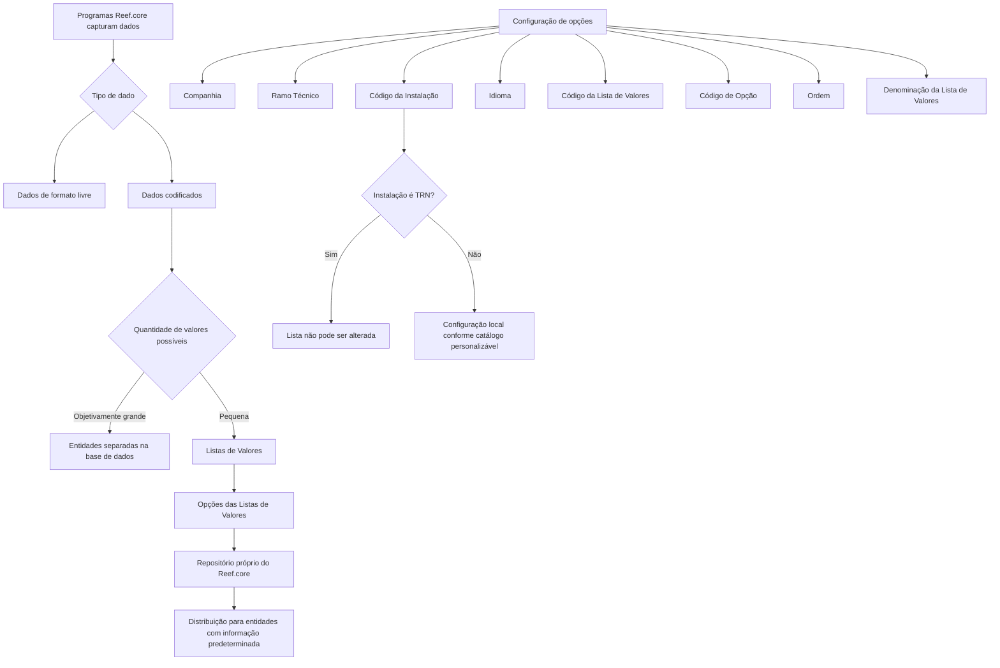

# Definição das Opções das Listas de Valores do Reef.core

## 1. Metadados do Documento
- **Arquivo de Origem:** Não informado; conteúdo extraído fornecido na solicitação.
- **Tipo de Documento:** Especificação Técnica / Documento Funcional.
- **Domínio / Sistema:** Reef.core / Mapfre.
- **Público-Alvo:** Desenvolvedores, Arquitetos, Analistas Funcionais e equipes de configuração.
- **Data/Versão Identificada:** Não identificada.
- **Lifecycle Identificado:** Approved Source.
- **Owner Identificado:** `user:agonzalez_mapfre.com`.

---

## 2. Resumo Executivo & Contexto de Negócio

O documento descreve a definição das opções das Listas de Valores no sistema Reef.core. As Listas de Valores são repositórios compartilhados destinados ao armazenamento de dados codificados quando o conjunto de valores possíveis é pequeno. Para conjuntos objetivamente grandes, o documento indica que as equipes de tecnologia normalmente criam entidades separadas na base de dados para registro e armazenamento.

No Reef.core, os dados capturados pelos programas podem ser de formato livre ou codificados. Quando os valores codificados são poucos, eles podem ser reunidos, incorporados e armazenados nos repositórios próprios denominados “listas de valores” e “opções das listas de valores”. O foco do documento é a identificação dos valores que formarão as opções de uma Lista de Valores específica.

Funcionalmente, o Reef.core permite registrar a relação das possíveis opções das Listas de Valores em um repositório de informação próprio. Esse repositório é distribuído às entidades com informações predeterminadas, permitindo que configurações padrão e locais sejam distinguidas por companhia e instalação.

O documento estabelece atributos operacionais para configurar uma opção: Companhia, Ramo Técnico, Código da Instalação, Idioma, Código da Lista de Valores, Código de Opção, Ordem e Denominação da Lista de Valores. Também apresenta restrições relevantes: as Listas de Valores associadas à instalação de núcleo `TRN` não podem ser alteradas, pois constituem parte inerente ao núcleo da aplicação Reef.core.

---

## 3. Arquitetura, Componentes & Tecnologias Envolvidas

### Componentes e conceitos identificados

| Componente / Conceito | Papel no contexto documentado |
| :--- | :--- |
| **Reef.core** | Sistema no qual são configuradas as Listas de Valores e suas opções. |
| **Listas de Valores** | Repositório compartilhado para dados codificados com quantidade pequena de valores possíveis. |
| **Opções das Listas de Valores** | Valores individuais configurados para uma Lista de Valores determinada. |
| **Repositório de informação próprio** | Repositório no qual o Reef.core registra a relação de possíveis opções das Listas de Valores. |
| **Entidades com informação predeterminada** | Entidades que recebem a distribuição das informações configuradas no repositório próprio. |
| **Companhia** | Atributo que contém o código da companhia para a qual a Lista de Valores está sendo definida. |
| **Ramo Técnico** | Atributo usado para especializar os valores da Lista de Valores para um ramo técnico específico ou para todos os ramos. |
| **Instalação TRN** | Instalação do núcleo do Reef.core; suas Listas de Valores não podem ser alteradas. |
| **Instalação local** | Código de instalação local que pode coexistir com `TRN` para uma companhia em catálogos personalizáveis. |
| **Idioma** | Atributo que identifica o idioma da denominação ou descrição de uma opção. |
| **Componente gráfico de interface** | Componente que visualiza as opções da lista respeitando o atributo de Ordem. |



**Nota de Análise:** O documento não detalha tecnologias de implementação, banco de dados específico, APIs, métodos HTTP, contratos JSON, mecanismos de distribuição ou interfaces técnicas de manutenção das opções.

---

## 4. Regras de Negócio, Especificações Funcionais & Processos

### 4.1 Critério para uso de Listas de Valores

1. Os programas do Reef.core capturam dados de formato livre e dados codificados.
2. Quando a quantidade de valores possíveis de um dado codificado é objetivamente grande, as equipes de tecnologia normalmente criam entidades separadas na base de dados para registrar e armazenar esses valores.
3. Quando a quantidade de valores possíveis de um dado é pequena, os valores podem ser reunidos, incorporados e armazenados de forma compartilhada nos repositórios:
   - Listas de Valores.
   - Opções das Listas de Valores.
4. O documento trata da identificação dos valores que constituirão as opções de uma Lista de Valores determinada.

### 4.2 Objetivo funcional

1. O Reef.core possui a capacidade de registrar a relação de possíveis opções das Listas de Valores do sistema.
2. Essa relação é registrada em um repositório de informação próprio.
3. A informação registrada é distribuída às entidades que possuem informação predeterminada.

### 4.3 Regras para Companhia

1. O atributo Companhia contém o código da companhia sobre a qual está sendo realizada a definição da Lista de Valores.
2. A coexistência de instalações é avaliada no contexto de uma companhia particular.

### 4.4 Regras para Ramo Técnico

1. O Ramo Técnico determina a chave que permite especializar os valores de uma Lista de Valores para um Ramo Técnico particular.
2. O valor genérico de Ramo Técnico é o código `999`.
3. O uso do código `999` permite especializar as opções da Lista de Valores para todos os ramos técnicos configurados no sistema.
4. O uso do código de um Ramo Técnico específico permite especializar os valores exclusivamente para esse ramo.

### 4.5 Regras para Código da Instalação

1. O Código da Instalação identifica o código da instalação associada à Lista de Valores.
2. Quando o valor da instalação na configuração da lista corresponde à instalação de núcleo `TRN`, as Listas de Valores não podem ser alteradas sob nenhuma circunstância.
3. A restrição sobre `TRN` existe porque essas Listas de Valores são parte inerente ao núcleo da aplicação Reef.core.
4. Nos catálogos de configuração do Reef.core que os países podem personalizar, incluindo o catálogo abordado pelo documento, somente podem coexistir registros com:
   - Código de instalação `TRN`.
   - Código da instalação local.
5. A coexistência de registros `TRN` e locais distingue se uma configuração é padrão ou local.

### 4.6 Regras para Idioma

1. O atributo Idioma identifica o idioma no qual está definida a denominação ou a descrição da opção da Lista de Valores.
2. O documento cita como exemplos de idiomas: espanhol, inglês e turco.

### 4.7 Regras para identificação e apresentação de opções

1. O Código da Lista de Valores identifica a Lista de Valores para a qual seus valores são configurados.
2. O Código de Opção determina o código da opção ou valor da Lista de Valores.
3. O atributo Ordem identifica a posição em que a opção será exibida no componente gráfico da interface que visualiza as opções.
4. A Denominação da Lista de Valores contém a denominação ou descrição da opção da Lista de Valores.

### 4.8 Dependência documental

O documento recomenda a leitura do documento funcional relacionado **“Definición Listas de Valores”**, pois a interpretação isolada do presente documento pode conduzir a erro.

---

## 5. Tabelas de Parâmetros, Ambientes e Estruturas de Dados

### 5.1 Atributos operacionais da definição de opções

| Item / Parâmetro | Descrição / Função | Tipo / Valores / Formato | Ambiente / Observações |
| :--- | :--- | :--- | :--- |
| Companhia | Contém o código da companhia para a qual a definição da Lista de Valores está sendo realizada. | Código de companhia; formato não detalhado. | Aplicável à configuração da Lista de Valores. |
| Ramo Técnico | Determina a chave usada para especializar valores para um Ramo Técnico particular. | Código de ramo técnico. O valor genérico identificado é `999`. | `999` aplica opções a todos os ramos técnicos configurados; um código de ramo específico aplica opções exclusivamente àquele ramo. |
| Código da Instalação | Identifica o código da instalação associada à Lista de Valores. | Código de instalação. | Quando corresponde a `TRN`, as Listas de Valores não podem ser alteradas. |
| Idioma | Identifica o idioma da denominação ou descrição da opção. | Idioma; exemplos: espanhol, inglês e turco. | Aplicável à descrição ou denominação das opções. |
| Código da Lista de Valores | Identifica a Lista de Valores para a qual os valores são configurados. | Código; formato não detalhado. | Relaciona a opção à Lista de Valores correspondente. |
| Código de Opção | Determina o código da opção ou valor da Lista de Valores. | Código; formato não detalhado. | Identifica uma opção individual da lista. |
| Ordem | Identifica a posição de exibição da opção. | Ordem; formato não detalhado. | Usado pelo componente gráfico que visualiza as opções. |
| Denominação da Lista de Valores | Contém a denominação ou descrição da opção da Lista de Valores. | Texto; idioma identificado pelo atributo Idioma. | Não deve ser interpretado como o nome da lista; o documento afirma que contém a descrição da opção. |

### 5.2 Regras de instalações coexistentes

| Item / Parâmetro | Descrição / Função | Tipo / Valores / Formato | Ambiente / Observações |
| :--- | :--- | :--- | :--- |
| Instalação do núcleo | Identifica a configuração padrão pertencente ao núcleo da aplicação. | `TRN` | Não pode ser alterada sob nenhuma circunstância quando associada à configuração da Lista de Valores. |
| Instalação local | Identifica a configuração local em catálogos personalizáveis pelos países. | Código da instalação local; não detalhado. | Pode coexistir com registros `TRN` para a mesma companhia. |
| Regra de coexistência | Distingue configuração padrão de configuração local. | Registros `TRN` e código da instalação local. | Em geral, nos catálogos personalizáveis do Reef.core, incluindo este catálogo, somente esses dois tipos podem coexistir para uma companhia. |

### 5.3 Dados não especificados no conteúdo

| Item / Parâmetro | Situação no documento | Observação |
| :--- | :--- | :--- |
| Formato dos códigos de Companhia | Não detalhado | O documento apenas informa que o atributo contém o código da companhia. |
| Formato dos códigos de Ramo Técnico | Parcialmente detalhado | Somente o valor genérico `999` é explicitamente identificado. |
| Formato dos códigos de Instalação local | Não detalhado | Apenas `TRN` é citado explicitamente. |
| Limite numérico para considerar um conjunto “pequeno” ou “objetivamente grande” | Não detalhado | O documento não define um limiar quantitativo. |
| Interface de configuração | Não detalhada | É mencionada a existência de componente gráfico de visualização, sem especificar telas, operações ou permissões. |
| Exemplo prometido na seção de coexistência | Ausente na extração recebida | O conteúdo termina após o rótulo `Ejemplo:`. |

---

## 6. Bateria de Perguntas & Respostas para RAG (FAQ Sintético)

### P1: Quando o Reef.core deve utilizar uma Lista de Valores em vez de uma entidade separada na base de dados?
**R:** O Reef.core pode utilizar Listas de Valores e Opções das Listas de Valores quando um dado codificado possuir uma quantidade pequena de valores possíveis. Quando a quantidade de valores possíveis for objetivamente grande, o documento informa que as equipes de tecnologia normalmente criam entidades separadas na base de dados para registro e armazenamento.

### P2: Qual é o objetivo funcional do repositório de opções das Listas de Valores no Reef.core?
**R:** O objetivo funcional é registrar, em um repositório de informação próprio do Reef.core, a relação de possíveis opções das Listas de Valores do sistema. Essa informação é distribuída às entidades que possuem informação predeterminada.

### P3: Para que serve o atributo Companhia na definição de uma Lista de Valores?
**R:** O atributo Companhia contém o código da companhia sobre a qual está sendo realizada a definição da Lista de Valores. O documento relaciona esse atributo ao contexto em que podem coexistir configurações de instalação padrão `TRN` e instalação local.

### P4: O que representa o código `999` no atributo Ramo Técnico?
**R:** O código `999` é o valor genérico do atributo Ramo Técnico. Quando utilizado, permite especializar as opções da Lista de Valores para todos os ramos técnicos configurados no sistema. Quando é usado o código de um ramo específico, a especialização fica restrita exclusivamente àquele ramo.

### P5: É permitido alterar uma Lista de Valores associada à instalação TRN?
**R:** Não. Se o valor da instalação na configuração da Lista de Valores corresponder à instalação do núcleo `TRN`, a Lista de Valores não poderá ser alterada sob nenhuma circunstância, porque integra o núcleo da aplicação Reef.core.

### P6: Quais instalações podem coexistir para uma companhia em um catálogo personalizável do Reef.core?
**R:** Em geral, nos catálogos de configuração do Reef.core que os países podem personalizar, incluindo o catálogo de opções das Listas de Valores, podem coexistir apenas registros com o código de instalação `TRN` e registros com o código da instalação local. Essa coexistência distingue configurações padrão de configurações locais.

### P7: Qual é a função do atributo Idioma nas opções de uma Lista de Valores?
**R:** O atributo Idioma identifica o idioma em que está definida a denominação ou a descrição da opção da Lista de Valores. O documento apresenta espanhol, inglês e turco como exemplos de idiomas possíveis.

### P8: Como uma opção é vinculada à Lista de Valores correta?
**R:** A vinculação é realizada por meio do Código da Lista de Valores. Esse atributo identifica a Lista de Valores para a qual os valores ou opções estão sendo configurados.

### P9: Qual atributo define a posição de apresentação de uma opção na interface?
**R:** O atributo Ordem identifica a ordem em que a opção da Lista de Valores será apresentada no componente gráfico da interface que visualiza as opções.

### P10: O que o campo Denominação da Lista de Valores armazena?
**R:** Apesar do nome do campo apresentado no documento, a propriedade contém a denominação ou descrição da opção da Lista de Valores. O idioma dessa denominação ou descrição é identificado pelo atributo Idioma.

### P11: O documento define o formato técnico dos códigos de opção, lista, companhia ou instalação?
**R:** Não. O documento descreve a finalidade funcional dos atributos Código de Opção, Código da Lista de Valores, Companhia e Código da Instalação, mas não informa formatos, tamanhos, tipos de dados, APIs, contratos de integração ou regras de geração desses códigos.

### P12: Que documentação relacionada deve ser consultada para evitar interpretação incorreta?
**R:** O documento recomenda a leitura da diretriz ou documento funcional denominado **“Definición Listas de Valores”**, pois a interpretação isolada do presente documento pode conduzir a erro.

---

## 7. Glossário de Termos, Siglas & Conceitos-Chave

- **Reef.core:** Sistema citado no documento que permite configurar Listas de Valores e suas opções.
- **Lista de Valores:** Repositório compartilhado do Reef.core usado para armazenar dados codificados quando a quantidade de valores possíveis é pequena.
- **Opções das Listas de Valores:** Valores individuais que compõem uma Lista de Valores determinada.
- **Dado codificado:** Dado cujo valor pertence a um conjunto de valores possíveis.
- **Dado de formato livre:** Dado capturado livremente, sem a classificação de valor codificado apresentada no documento.
- **Ramo Técnico:** Chave de especialização que permite aplicar valores de uma Lista de Valores a um ramo técnico particular ou a todos os ramos configurados.
- **TRN:** Código da instalação do núcleo do Reef.core. Listas de Valores configuradas para essa instalação não podem ser alteradas.
- **Instalação local:** Código de instalação local que pode coexistir com `TRN` em catálogos personalizáveis por países.
- **Configuração padrão:** Configuração associada ao código de instalação `TRN`.
- **Configuração local:** Configuração associada ao código da instalação local.
- **Denominação:** Nome ou descrição de uma opção da Lista de Valores no idioma identificado.
- **Lifecycle — Approved Source:** Estado identificado nos metadados exibidos no conteúdo extraído.
- **VL:** Sigla exibida na navegação do documento. O significado não é detalhado no conteúdo fornecido.

---

## 8. Notas Críticas, Riscos & Limitações

- **Restrição de núcleo:** As Listas de Valores associadas à instalação `TRN` não podem ser modificadas sob nenhuma circunstância, por serem parte inerente ao núcleo do Reef.core.
- **Risco de interpretação isolada:** O documento informa expressamente que sua leitura isolada pode conduzir a erro e recomenda consultar o documento relacionado **“Definición Listas de Valores”**.
- **Limitação de detalhe técnico:** Não há especificação de banco de dados, modelo de tabelas físicas, endpoints, métodos HTTP, autenticação, permissões, contratos de API ou mecanismos de distribuição para as entidades destinatárias.
- **Limitação de validação:** O texto não informa validações de unicidade, obrigatoriedade, tamanho, padrão ou domínio permitido para códigos de companhia, instalação, lista ou opção.
- **Limitação de idiomas:** Embora sejam citados espanhol, inglês e turco, o documento não define o catálogo completo de idiomas suportados.
- **Limitação de apresentação:** O atributo Ordem é mencionado como determinante da exibição no componente gráfico, mas não são definidos critérios para valores repetidos, lacunas de ordenação ou comportamento de ordenação.
- **Conteúdo incompleto na extração:** A seção termina após `Ejemplo:`, sem que o exemplo seja apresentado. Não é possível reconstruir ou inferir o conteúdo ausente.

---

## 9. Conteúdo Bruto Estruturado (Referência Fiel)

```text
--- [PÁGINA 1 DE 2] ---

DEFINICIÓN de las OPCIONES de las LISTAS de VALORES de
Reef.core

Contexto

¿Qué es una Lista de Valores?

En los programas de Reef.core se han de capturar datos: datos de libre formato y datos codicados. Si el número de posibles valores de un
dato codicado es objetivamente 'grande', los equipos de tecnología normalmente suelen crear entidades separadas en la base de datos para
su registro y almacenamiento.

Ahora bien, si el número de posibles valores de un dato es pequeño se pueden juntar, incorporar y almacenar de manera compartida en dos
repositorios de información de Reef.core creados al efecto para ello: "listas de valores" y "opciones de las listas de valores".

En este documento haremos referencia a la identicación de los valores que van a conformar las opciones de las listas de valores de una
lista determinada.

Objetivo

Funcionalmente, Reef.core cuenta con la posibilidad de registrar la relación de posibles opciones de las listas de valores del sistema en un
repositorio de información propio que se distribuye a las entidades con información pre-determinada.

Propiedades Operativas

Propiedades Operativas

Compañía

Este atributo del catálogo contiene el código de la compañía sobre la que se está realizando la denición de la lista de valores.

Ramo Técnico

Determina la clave del Ramo Técnico que permite 'especializar' los valores de la lista para un Ramo Técnico en particular.

Utilizando el valor genérico en este atributo (código 999) el sistema permite especializar las opciones de la lista de valores para todos los
ramos técnicos congurados en el sistema o bien, al utilizar el código de un ramo en particular de los existentes, especializar los valores
de la lista exclusivamente para este.

Código de la Instalación

Consejo:
Documentation / DOCUMENTACIÓN Reef
DOCUMENTACIÓN Reef
Mapfredocument
DOCUMENTACIÓN Reef
Owner
user:agonzalez_mapfre.com
Lifecycle
Approved Source
 /
 VL
Buscar Inicio Soluciones Arquitecturas APIs Componentes Cloud Documentación Zeus Reef Ayuda
ES

--- [PÁGINA 2 DE 2] ---

Esta propiedad de la denición identica el código de la instalación asociada a la lista de valores.

Si el valor de la instalación en la conguración de la lista es la correspondiente a la instalación del núcleo, instalación (TRN) las listas de
valores no podrán alterarse bajo ningún concepto por ser parte inherente al núcleo de la aplicación.

Idioma

Esta propiedad identica el idioma en el que está denida la denominación o descripción de la opción de la lista de valores, como por ejemplo
los idiomas español, inglés, turco,...

Código de la Lista de Valores

Esta propiedad del catálogo de conguración de opciones identica el código de la lista de valores para la que se conguran sus valores.

Código de Opción

Determina el código de la opción/valor de la lista de valores.

Orden

Identica el orden en el que se mostrará la opción de la lista en el componente gráco de la interfaz que las visualiza.

Denominación de la Lista de Valores

Contiene la denominación o descripción que tiene la opción de la lista de valores.

Vínculos

Relación de Directrices y Documentos funcionales cuya lectura recomendada para evitar que la interpretación aislada del presente
documento pueda conducir a error.

Denición Listas de Valores

Preguntas frecuentes

(1) ¿Existe alguna restricción que tenga que ser tomada en cuenta en el uso y denición del catálogo de listas de valores de Reef.core?

Se han de respetar obligatoriamente la relación de listas de valores TRN por ser parte del núcleo de Reef.core.

(2) ¿Cuantas instalaciones pueden coexistir para una compañía en particular?

En general, en los catálogos de conguración de Reef.core que los países pueden personalizar (entre los que se encuentra este), únicamente
podrán coexistir registros con el código de instalación TRN y el código de la instalación local, distinguiendo así si la conguración realizada
es la estándar o local.

Ejemplo:
```
