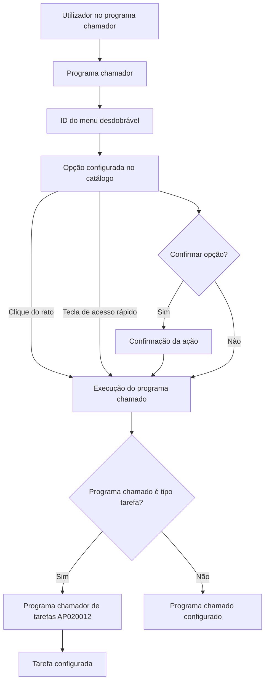

# Definição de Programas Chamados por Menus Desdobráveis no Reef.core

## 1. Metadados do Documento
- **Arquivo de Origem:** `Não identificado`
- **Tipo de Documento:** `Especificação Técnica`
- **Domínio / Sistema:** `Reef.core / Mapfre`
- **Público-Alvo:** `Desenvolvedores, Arquitetos, Operação, Negócio`
- **Data/Versão Identificada:** `Não identificada`

---

## 2. Resumo Executivo & Contexto de Negócio

O documento descreve o catálogo de configuração dos programas que podem ser chamados a partir de menus desdobráveis de programas no Reef.core. Essa funcionalidade permite acessar determinados programas sem abandonar a operação funcional em execução ou sair do programa utilizado pelo usuário.

O Reef.core possui configuração para os programas que oferecem menus desdobráveis e para os programas chamados por essas opções. O escopo deste documento é o segundo catálogo: a definição das opções e dos programas acessíveis a partir do programa chamador.

A configuração é contextualizada por companhia, instalação, idioma, programa chamador e identificador do menu desdobrável. Cada opção configura ordem de exibição, descrição, tecla de acesso rápido, programa chamado, necessidade de confirmação e, quando aplicável, tarefa executada.

A instalação de núcleo `TRN` possui proteção funcional: as opções de menus desdobráveis associadas a essa instalação não devem ser alteradas, pois são inerentes ao núcleo da aplicação. Para catálogos personalizáveis por país, podem coexistir somente registros da instalação `TRN` e da instalação local para uma mesma companhia.

---

## 3. Arquitetura, Componentes & Tecnologias Envolvidas

### Componentes e conceitos identificados

- **Reef.core:** aplicação/plataforma que disponibiliza a configuração de menus desdobráveis e programas chamados.
- **Catálogo de opções ou programas chamados:** catálogo abordado pelo documento; define os programas acessíveis por menus desdobráveis.
- **Programa chamador:** programa em execução que disponibiliza um local para chamada de menu desdobrável.
- **Menu desdobrável:** mecanismo de acesso a opções e programas sem sair do programa chamador.
- **Programa chamado:** programa acessado por clique com rato/dispositivo apontador ou tecla de acesso rápido.
- **Instalação TRN:** instalação de núcleo do Reef.core, cuja configuração de menus não deve ser alterada.
- **Instalação local:** instalação específica local que pode coexistir com `TRN` em catálogos personalizáveis.
- **Programa de tipo tarefa:** tipologia de programa chamado que pode executar uma tarefa diretamente.
- **Programa chamador de tarefas `AP020012`:** valor obrigatório para o código do programa chamado quando a tipologia do programa chamado for tarefa.



**Nota de Análise:** o documento não detalha métodos HTTP, APIs, contratos JSON, tecnologias de persistência, servidores, URLs, mecanismos de autenticação ou interfaces gráficas do Reef.core.

---

## 4. Regras de Negócio, Especificações Funcionais & Processos

### Finalidade funcional

1. O utilizador pode acessar determinados programas sem abandonar a operação funcional ou o programa atualmente em execução.
2. O Reef.core permite configurar:
   - programas que disponibilizam a funcionalidade de menu desdobrável;
   - programas que podem ser chamados por esses menus.
3. O documento trata da configuração dos programas acessíveis a partir de um programa chamador.

### Regras de instalação

1. A propriedade **Código da Instalação** identifica a instalação do registo.
2. Se o valor da instalação configurada para o menu desdobrável corresponder à instalação do núcleo, isto é, à instalação `TRN`, as opções dos menus desdobráveis não devem ser alteradas.
3. As opções associadas à instalação `TRN` são parte inerente do núcleo da aplicação.
4. Em catálogos de configuração do Reef.core que podem ser personalizados por países, incluindo este catálogo, somente podem coexistir para uma mesma companhia:
   - registos com código de instalação `TRN`;
   - registos com código da instalação local.
5. A coexistência entre `TRN` e a instalação local permite distinguir configuração padrão de configuração local.

### Regras de identificação e apresentação da opção

1. A **Companhia** define o código da companhia sobre a qual ocorre a definição dos programas associados ao menu desdobrável.
2. O **Idioma** determina o idioma em que a denominação da opção associada ao programa chamado é transcrita.
3. O **Código do programa chamador** identifica o programa que origina a chamada.
4. Um programa chamador pode possuir vários locais a partir dos quais um menu desdobrável pode ser chamado.
5. O **ID do Menu Desdobrável** identifica especificamente o local do programa chamador para o qual o registo está a ser configurado.
6. A **Opção** determina a ordem ou sequência de apresentação e visualização no menu desdobrável.
7. A **Descrição da Opção** determina a descrição ou denominação da opção ou do programa chamado.

### Regras de acionamento

1. A **Tecla de Acesso Rápido** pode determinar a letra associada à opção ou ao programa chamado.
2. A associação da tecla de acesso rápido independe de a letra estar em maiúscula ou minúscula.
3. A chamada ao programa pode ocorrer:
   - por pressão da tecla de acesso rápido;
   - por seleção da opção com rato ou dispositivo apontador.
4. O **Código do programa chamado** identifica o programa acessado pelos mecanismos de acionamento.
5. A propriedade **Confirmar Opção** determina se a ação deve ser confirmada antes de a chamada ao programa chamado ser executada.

### Regra para programas do tipo tarefa

1. Quando a tipologia do programa chamado corresponder a um programa de tipo tarefa, a propriedade **Tarefa** determina qual tarefa deve ser executada diretamente.
2. Para programas de tipo tarefa, o **Código do programa chamado** deve ter o valor do código associado ao programa chamador de tarefas: `AP020012`.

---

## 5. Tabelas de Parâmetros, Ambientes e Estruturas de Dados

| Item / Parâmetro | Descrição / Função | Tipo / Valores / Formato | Ambiente / Observações |
| :--- | :--- | :--- | :--- |
| Companhia | Código da companhia na qual é definida a associação de programas ao menu desdobrável. | Código de companhia; formato não detalhado. | Aplicável ao registo do catálogo. |
| Código da Instalação | Identifica o código da instalação do registo. | Código de instalação. | `TRN` representa a instalação do núcleo. |
| Instalação TRN | Configuração do núcleo do Reef.core. | Valor identificado: `TRN`. | As opções dos menus desdobráveis não devem ser alteradas. |
| Instalação local | Código da instalação específica local. | Código de instalação; valor não detalhado. | Pode coexistir com `TRN` em catálogos personalizáveis por país. |
| Idioma | Define o idioma da denominação da opção associada ao programa chamado. | Idioma; valores não detalhados. | Aplicável à descrição/denominação da opção. |
| Código do programa chamador | Identifica o programa que disponibiliza a chamada ao menu desdobrável. | Código de programa; formato não detalhado. | Um programa chamador pode possuir vários locais de menu. |
| ID do Menu Desdobrável | Identifica o local específico do programa chamador para o qual a configuração é criada. | Identificador; formato não detalhado. | Necessário quando existirem vários locais de menu no programa chamador. |
| Opção | Determina a ordem ou sequência de exibição da opção. | Ordem ou sequência; formato não detalhado. | Controla a apresentação no menu desdobrável. |
| Descrição da Opção | Define a descrição ou denominação da opção ou programa chamado. | Texto; formato não detalhado. | Associada ao idioma configurado. |
| Tecla de Acesso Rápido | Define a letra que aciona a opção ou o programa chamado. | Letra; maiúsculas e minúsculas são equivalentes. | Alternativa ao uso de rato/dispositivo apontador. |
| Código do programa chamado | Identifica o programa acessado pela opção. | Código de programa. | Para programa de tipo tarefa, deve ser `AP020012`. |
| Confirmar Opção | Define se a ação deve ser confirmada antes da execução da chamada. | Condição de confirmação; valores não detalhados. | Aplicável tanto à tecla de acesso rápido quanto ao clique. |
| Tarefa | Define a tarefa executada diretamente quando o programa chamado for do tipo tarefa. | Código/identificação de tarefa; formato não detalhado. | Requer programa chamado com código `AP020012`. |
| Programa chamador de tarefas | Código associado ao chamador de tarefas. | `AP020012`. | Obrigatório no campo Código do programa chamado quando a tipologia for tarefa. |

---

## 6. Bateria de Perguntas & Respostas para RAG (FAQ Sintético)

### P1: Qual é a finalidade do catálogo de programas chamados por menus desdobráveis no Reef.core?
**R:** O catálogo define os programas que podem ser acessados a partir de menus desdobráveis de um programa chamador. A funcionalidade permite ao utilizador acessar determinados programas sem sair da operação funcional ou abandonar o programa que está a executar.

### P2: O que deve acontecer com opções de menu configuradas para a instalação TRN?
**R:** As opções dos menus desdobráveis associadas à instalação `TRN` não devem ser alteradas. A instalação `TRN` corresponde à instalação do núcleo, e essas opções são parte inerente ao núcleo da aplicação.

### P3: Quais instalações podem coexistir no catálogo para uma mesma companhia?
**R:** Em geral, nos catálogos personalizáveis do Reef.core, incluindo este catálogo, podem coexistir somente registos com o código de instalação `TRN` e registos com o código da instalação local. Essa coexistência distingue a configuração padrão da configuração realizada localmente.

### P4: Para que serve o ID do Menu Desdobrável?
**R:** O ID do Menu Desdobrável identifica o local específico do programa chamador para o qual o registo está a ser configurado. Esse identificador é necessário porque um mesmo programa chamador pode ter vários locais a partir dos quais um menu desdobrável pode ser chamado.

### P5: Como é definida a ordem de apresentação das opções no menu desdobrável?
**R:** A propriedade **Opção** indica a ordem ou sequência em que uma opção é mostrada e visualizada no menu desdobrável.

### P6: Como uma opção do menu desdobrável pode acionar um programa chamado?
**R:** O programa chamado pode ser acionado por uma tecla de acesso rápido ou por seleção da opção com rato ou dispositivo apontador. O Código do programa chamado identifica o programa acessado por esses mecanismos.

### P7: A tecla de acesso rápido diferencia letras maiúsculas e minúsculas?
**R:** Não. A tecla de acesso rápido pode definir uma letra associada à opção ou programa chamado independentemente de essa letra estar em maiúscula ou minúscula.

### P8: Qual é a função da propriedade Confirmar Opção?
**R:** Confirmar Opção define se, após pressionar a tecla de acesso rápido ou selecionar a opção com rato/dispositivo apontador, o utilizador deve confirmar a ação antes de a chamada ao programa chamado ser executada.

### P9: Como deve ser configurado o Código do programa chamado quando a tipologia é tarefa?
**R:** Quando o programa chamado for de tipo tarefa, o Código do programa chamado deve receber o código associado ao programa chamador de tarefas: `AP020012`.

### P10: O que a propriedade Tarefa determina para programas chamados do tipo tarefa?
**R:** Quando a tipologia do programa chamado é tarefa, a propriedade Tarefa determina qual tarefa deve ser executada diretamente no momento da chamada.

### P11: Qual é a finalidade do campo Idioma na configuração?
**R:** O campo Idioma determina o idioma usado para transcrever a denominação da opção associada ao programa chamado.

### P12: O documento detalha contratos técnicos, APIs ou métodos HTTP dos programas chamados?
**R:** Não. O documento descreve propriedades de configuração funcional do catálogo, mas não detalha métodos HTTP, contratos JSON, APIs, URLs, portas ou tecnologias de integração dos programas chamados.

---

## 7. Glossário de Termos, Siglas & Conceitos-Chave

- **AP020012:** código associado ao programa chamador de tarefas; deve ser usado como Código do programa chamado quando a tipologia do programa chamado for tarefa.
- **Catálogo:** estrutura de configuração utilizada para definir opções e programas acessíveis por menus desdobráveis.
- **Código da Instalação:** propriedade que identifica a instalação do registo de configuração.
- **Código do programa chamado:** identificador do programa acessado por uma opção do menu desdobrável.
- **Código do programa chamador:** identificador do programa que origina a chamada por menu desdobrável.
- **ID do Menu Desdobrável:** identificador do local específico de menu dentro de um programa chamador.
- **Instalação local:** instalação específica local que pode coexistir com a configuração `TRN`.
- **Menu desdobrável:** menu que disponibiliza opções para acesso a programas sem sair do programa chamador.
- **Programa chamado:** programa acessado a partir de uma opção do menu desdobrável.
- **Programa chamador:** programa a partir do qual se disponibiliza a chamada de um menu desdobrável.
- **Reef.core:** sistema citado como responsável pela configuração de programas e menus desdobráveis.
- **Tarefa:** execução direta definida para programas chamados cuja tipologia seja programa de tipo tarefa.
- **TRN:** código da instalação do núcleo da aplicação; configurações de menus associadas a essa instalação não devem ser alteradas.

---

## 8. Notas Críticas, Riscos & Limitações

- A configuração associada à instalação `TRN` não deve ser alterada, pois integra o núcleo da aplicação.
- O catálogo permite somente a coexistência de configurações `TRN` e de instalação local para uma companhia, nos catálogos personalizáveis descritos.
- A configuração de um programa de tipo tarefa exige que o Código do programa chamado seja `AP020012`.
- O documento não detalha os valores permitidos para companhia, idioma, opção, tarefa, instalação local ou confirmação.
- O documento não fornece contratos de integração, APIs, métodos HTTP, persistência, URLs, portas, permissões ou procedimentos de implantação.
- A documentação recomenda a leitura do vínculo **Definición Programas**, pois uma interpretação isolada pode conduzir a erro.

---

## 9. Conteúdo Bruto Estruturado (Referência Fiel)

```text
--- [PÁGINA 1 DE 2] ---

DEFINICIÓN de los PROGRAMAS llamados desde los MENUS
DESPLEGABLES de Programas
Contexto
En ocasiones es necesario o deseable contar con la posibilidad de acceder a determinados programas, sin tener que salir de la operación
funcional o abandonar el programa que un usuario estuviera ejecutando en un momento determinado.
Objetivo
Funcionalmente, Reef.core cuenta con la posibilidad de congurar los programas que permiten dicha funcionalidad y cuales serán los
programas que podrán ser llamados desde ellos.
En este documento haremos referencia al segundo de estos catálogos para conocer qué se ha de congurar en los programas a los que se
podrá acceder desde el programa llamador.
Propiedades Operativas
Propiedades Operativas
Compañía
Este atributo del catálogo contiene el código de la compañía sobre la que se está realizando la denición de los programas asociados al
menú desplegable de programas.
Código de la Instalación
Esta propiedad de la denición identica el código de la instalación del registro.
Si el valor de la instalación en la conguración del menú desplegable es la correspondiente a la instalación del núcleo (instalación TRN),
las opciones de los menus desplegables no deben ser alteradas por ser parte inherente al núcleo de la aplicación.
Idioma
Determina el idioma en el que se está transcribiendo la denominación de la opción asociada al programa llamado.
Código del programa Llamador
Identica el código del programa llamador.
ID del Menú Desplegable
Documentation / DOCUMENTACIÓN Reef
DOCUMENTACIÓN Reef
Mapfredocument
DOCUMENTACIÓN Reef
Owner
user:agonzalez_mapfre.com
Lifecycle
Approved Source
 /
 VL
Buscar Inicio Soluciones Arquitecturas APIs Componentes Cloud Documentación Zeus Reef Ayuda
ES

--- [PÁGINA 2 DE 2] ---

Puesto que un programa llamador puede tener varios lugares desde los que se puede realizar la llamada a un menú desplegable, este atributo
determina especícamente el identicador correspondiente al lugar del programa llamador para el que se está congurando el registro.
Opción
Este atributo indica el orden o secuencia en el que se muestra y visualiza la opción del menú desplegable.
Descripción de la Opción
Determina la descripción o denominación de la opción o programa llamado.
Tecla de Acceso Rápido
Puesto que las teclas de acceso rápido son teclas que proporcionan una forma alternativa de hacer algo que normalmente se haría con un
ratón o dispositivo apuntador, este atributo puede determinar qué letra (independientemente que esté en mayúsculas o minúsculas) estará
asociada a la opción o programa que va a ser llamado.
Código del programa llamado
Identica el código del programa al que se accederá al pulsar la tecla de acceso rápido o al pulsar con el ratón sobre la opción del menú
desplegable.
Conrmar Opción
Determina si al pulsar la tecla de acceso rápido o al pulsar con el ratón sobre la opción del menú desplegable se tiene o no que conrmar la
acción para que la llamada al programa llamado sea ejecutada.
Tarea
En el supuesto que la tipología del programa llamado se corresponda con un programa de tipo tarea esta propiedad del catálogo determina
cual es la tarea que se ha de ejecutar directamente al realizar la llamada (en cuyo caso el código del programa llamado tiene que tener el
valor del código asociado al programa llamador de tareas: "AP020012").
Vínculos
Relación de Directrices y Documentos funcionales cuya lectura recomendada para evitar que la interpretación aislada del presente
documento pueda conducir a error.
Denición Programas
Preguntas frecuentes
(1) ¿Existe alguna restricción que tenga que ser tomada en cuenta en la conguración del catálogo de opciones o programas llamados por
los menús desplegables en Reef.core?
Se han de respetar obligatoriamente la conguración realizada para los programas y menús desplegables correspondientes al núcleo
(aquellos con instalación TRN).
(2) ¿Cuantas instalaciones pueden coexistir en este catálogo para una compañía en particular?
En general, en los catálogos de conguración de Reef.core que los países pueden personalizar (entre los que se encuentra este), únicamente
podrán coexistir registros con el código de instalación TRN y el código de la instalación local, distinguiendo así si la conguración realizada
es la estándar o la realizada localmente.
```
