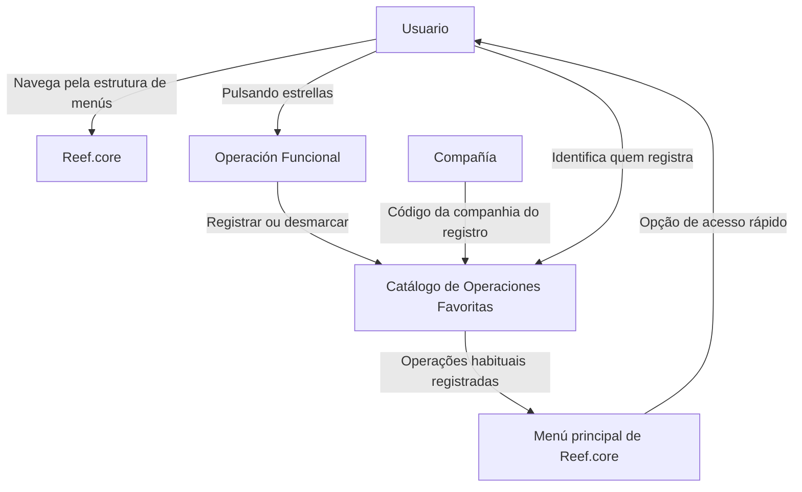

# Definição da Estrutura de Menus e Catálogo de Operações Favoritas do Reef.core

## 1. Metadados do Documento
- **Arquivo de Origem:** Não identificado
- **Tipo de Documento:** Especificação Técnica
- **Domínio / Sistema:** Reef.core
- **Público-Alvo:** Usuários, analistas funcionais, desenvolvedores e equipes de suporte do Reef.core
- **Data/Versão Identificada:** Não identificada

---

## 2. Resumo Executivo & Contexto de Negócio

O documento descreve o mecanismo de operações favoritas no Reef.core, relacionado à navegação pela estrutura de menus. O contexto apresentado reconhece que navegar pelos menus até uma Operação Funcional específica pode ser tedioso ou representar uma pequena perda de tempo.

Como resposta a essa necessidade, o Reef.core permite registrar as Operações Funcionais mais habituais de cada Usuário. Essas operações passam a ser disponibilizadas como opções de acesso no menu principal do Reef.core.

O registro de uma operação favorita é associado à Companhia sobre a qual o registro é realizado, ao Usuário que seleciona a operação e à própria Operação Funcional registrada. A interação operacional descrita consiste em pulsar estrelas para registrar ou desmarcar Operações Funcionais.

O documento também referencia os materiais “Definición Programas” e “Definición Usuarios” como leituras recomendadas. Não apresenta restrições conhecidas para o uso ou a definição do Catálogo de Operações Favoritas; a resposta registrada na seção de perguntas frequentes é “N/A”.

---

## 3. Arquitetura, Componentes & Tecnologias Envolvidas

Componentes e conceitos identificados:

- **Reef.core:** Sistema no qual são registradas e acessadas Operações Funcionais favoritas.
- **Estrutura de Menús:** Estrutura de navegação do Reef.core.
- **Menú principal de Reef.core:** Local onde as operações registradas como favoritas passam a aparecer como opção de acesso.
- **Catálogo de Operaciones Favoritas:** Catálogo que armazena o registro de operações favoritas.
- **Compañía:** Atributo que contém o código da companhia sobre a qual é feito o registro.
- **Usuario:** Propriedade que identifica o usuário que seleciona e registra uma operação.
- **Operación Funcional:** Propriedade que identifica a operação funcional registrada como favorita.
- **Estrellas:** Elemento de interação usado para registrar ou desmarcar Operações Funcionais.



**Nota de Análise:** O documento não detalha a implementação técnica do Catálogo de Operações Favoritas, incluindo modelo de persistência, APIs, métodos HTTP, contratos JSON, controles de autorização ou regras de sincronização entre ambientes.

---

## 4. Regras de Negócio, Especificações Funcionais & Processos

### Objetivo funcional

O Reef.core disponibiliza a possibilidade de registrar quais Operações Funcionais são mais habituais para os Usuários. O objetivo é reduzir o esforço de navegação pela estrutura de menus até operações utilizadas com frequência.

### Registro de Operações Funcionais favoritas

1. O Usuário identifica uma Operação Funcional no Reef.core.
2. O Usuário utiliza as estrelas para registrar ou desmarcar a Operação Funcional.
3. O registro no Catálogo de Operações Favoritas é associado à Companhia, ao Usuário e à Operação Funcional.
4. Quando registrada como favorita, a Operação Funcional passa a aparecer como opção de acesso no menu principal do Reef.core.
5. Quando desmarcada, a Operação Funcional deixa de estar registrada como favorita.

### Propriedades operativas

- **Compañía:** contém o código da companhia sobre a qual ocorre o registro das operações preferidas do Usuário.
- **Usuario:** identifica o Usuário que seleciona e registra no Reef.core a operação que deverá aparecer como opção de acesso no menu principal.
- **Operación Funcional:** identifica a operação funcional registrada como favorita.

### Restrições identificadas

A pergunta frequente sobre restrições aplicáveis ao uso e à definição do Catálogo de Operações Favoritas possui a resposta **“N/A”**. Portanto, o documento não declara restrições específicas.

---

## 5. Tabelas de Parâmetros, Ambientes e Estruturas de Dados

| Item / Parâmetro | Descrição / Função | Tipo / Valores / Formato | Ambiente / Observações |
| :--- | :--- | :--- | :--- |
| Reef.core | Sistema que permite registrar operações funcionais habituais dos Usuários. | Sistema corporativo | O documento não informa versão ou ambiente. |
| Estrutura de Menús | Estrutura de navegação até Operações Funcionais. | Estrutura de menus | Pode tornar a navegação até uma operação concreta tediosa. |
| Catálogo de Operaciones Favoritas | Catálogo utilizado para registrar operações favoritas. | Catálogo funcional | Não há detalhes de persistência ou estrutura técnica. |
| Compañía | Código da companhia sobre a qual é realizado o registro de operações preferidas. | Código de companhia | Propriedade operativa do catálogo. |
| Usuario | Usuário que seleciona e registra uma operação no Reef.core. | Identificador de usuário | Propriedade operativa do catálogo. |
| Operación Funcional | Operação funcional registrada como favorita. | Identificador de operação funcional | Propriedade operativa do catálogo. |
| Estrellas | Mecanismo de interação para registrar ou desmarcar operações. | Elemento de interface | O documento não detalha comportamento visual ou técnico. |
| Menú principal de Reef.core | Menu no qual operações favoritas aparecem como opções de acesso. | Interface de navegação | Destino funcional das operações registradas. |
| Definición Programas | Documento relacionado recomendado para leitura. | Referência documental | Não detalhado no conteúdo fornecido. |
| Definición Usuarios | Documento relacionado recomendado para leitura. | Referência documental | Não detalhado no conteúdo fornecido. |
| Owner | Responsável indicado no conteúdo extraído. | `user:agonzalez_mapfre.com` | Associado à documentação Reef. |
| Lifecycle | Estado de ciclo de vida apresentado no conteúdo. | `Approved Source` | O documento não explica o significado operacional do status. |
| Idioma | Idioma apresentado na interface documental. | `ES` | Conteúdo principal em espanhol. |

---

## 6. Bateria de Perguntas & Respostas para RAG (FAQ Sintético)

### P1: Qual problema o Catálogo de Operações Favoritas resolve no Reef.core?
**R:** O Catálogo de Operações Favoritas busca reduzir o esforço e a perda de tempo causados pela navegação através da estrutura de menus do Reef.core até uma Operação Funcional concreta. Ele permite que as operações mais habituais dos Usuários sejam disponibilizadas como opções de acesso no menu principal.

### P2: Como um Usuário registra uma Operação Funcional como favorita no Reef.core?
**R:** O documento informa que o registro ocorre pulsando sobre as estrelas associadas às Operações Funcionais. A mesma interação permite desmarcar uma Operação Funcional previamente registrada como favorita.

### P3: Quais propriedades operativas compõem o registro de uma Operação Funcional favorita?
**R:** O registro possui três propriedades operativas: **Compañía**, que contém o código da companhia sobre a qual é realizado o registro; **Usuario**, que identifica quem seleciona e registra a operação; e **Operación Funcional**, que identifica a operação registrada como favorita.

### P4: Onde uma Operação Funcional registrada como favorita fica disponível?
**R:** Uma Operação Funcional registrada pelo Usuário como favorita aparece como uma opção de acesso no menu principal do Reef.core.

### P5: Qual é o papel da propriedade Compañía no Catálogo de Operações Favoritas?
**R:** A propriedade Compañía contém o código da companhia sobre a qual está sendo realizado o registro das operações preferidas do Usuário.

### P6: Qual é o papel da propriedade Usuario no Catálogo de Operações Favoritas?
**R:** A propriedade Usuario identifica o Usuário que seleciona e registra no Reef.core a Operação Funcional que, posteriormente, aparecerá como opção de acesso no menu principal.

### P7: O documento define restrições para o uso ou a definição do Catálogo de Operações Favoritas?
**R:** Não. Na seção de perguntas frequentes, a resposta para a pergunta sobre restrições aplicáveis ao uso e à definição do Catálogo de Operações Favoritas é “N/A”. O documento não fornece restrições adicionais.

### P8: Quais documentos devem ser consultados para evitar interpretação isolada incorreta?
**R:** O documento recomenda a leitura de “Definición Programas” e “Definición Usuarios”, apresentados como vínculos de diretrizes e documentos funcionais relacionados.

### P9: O documento especifica APIs ou contratos técnicos para o Catálogo de Operações Favoritas?
**R:** Não. O conteúdo descreve o objetivo funcional, as propriedades operativas e o uso de estrelas para registrar ou desmarcar operações, mas não detalha APIs, métodos HTTP, contratos JSON, banco de dados ou mecanismos de integração.

### P10: Uma Operação Funcional favorita pode deixar de ser favorita?
**R:** Sim. O documento afirma que, pulsando sobre as estrelas, as Operações Funcionais podem ser registradas ou desmarcadas. Portanto, uma operação previamente marcada pode ser removida do conjunto de favoritas.

---

## 7. Glossário de Termos, Siglas & Conceitos-Chave

- **Reef.core:** Sistema citado no documento, responsável por disponibilizar navegação por menus e o registro de Operações Funcionais favoritas.
- **Catálogo de Operaciones Favoritas:** Catálogo no Reef.core que registra as operações funcionais mais habituais de um Usuário.
- **Compañía:** Propriedade que contém o código da companhia associada ao registro de operações preferidas.
- **Usuario:** Propriedade que identifica quem seleciona e registra uma Operação Funcional.
- **Operación Funcional:** Operação identificada no catálogo como favorita.
- **Menú principal:** Menu principal do Reef.core, no qual as operações favoritas são disponibilizadas como acesso.
- **Estrellas:** Recurso de interação utilizado para registrar ou desmarcar Operações Funcionais.
- **Lifecycle:** Campo apresentado na documentação com o valor `Approved Source`.
- **Owner:** Campo apresentado na documentação com o valor `user:agonzalez_mapfre.com`.
- **N/A:** Valor informado na pergunta frequente sobre restrições; o documento não apresenta restrições específicas.

---

## 8. Notas Críticas, Riscos & Limitações

- O documento apresenta uma definição funcional resumida e não detalha a implementação técnica do Catálogo de Operações Favoritas.
- Não há informações sobre APIs, banco de dados, autenticação, autorização, auditoria, logs, tratamento de erros, integração entre sistemas ou comportamento em caso de indisponibilidade.
- Não são identificados ambientes, URLs, servidores, versões de software, parâmetros de configuração ou critérios de desempenho.
- O significado operacional do status `Lifecycle: Approved Source` não é explicado.
- Embora a seção de perguntas frequentes indique `N/A` para restrições, isso significa apenas que o documento fornecido não lista limitações específicas; não deve ser interpretado como comprovação de ausência de restrições técnicas ou corporativas externas.
- A leitura de “Definición Programas” e “Definición Usuarios” é recomendada pelo próprio documento para evitar interpretações isoladas incorretas.

---

## 9. Conteúdo Bruto Estruturado (Referência Fiel)

```text
--- [PÁGINA 1 DE 2] ---

DEFINICIÓN de la ESTRUCTURA de MENUS de Reef.core
Contexto
En ocasiones la navegación a lo largo de la estructura de Menús de Reef.core hasta llegar al lugar concreto en el que se encuentre una
Operación Funcional puede ser algo tedioso o una pequeña pérdida de tiempo por lo que es deseable contar con un 'acceso rápido' a los
Programas u Operaciones usualmente más utilizados.
Objetivo
Funcionalmente, Reef.core cuenta con la posibilidad de registrar en Reef.core cuales son las operaciones funcionales más habituales de los
Usuarios.
Propiedades Operativas
Propiedades Operativas
Compañía
Este atributo del catálogo contiene el código de la compañía sobre la que se está realizando el registro de las operaciones preferidas del
Usuario.
Usuario
Esta Propiedad identica al Usuario que selecciona y registra en Reef.core la operación para que de aquí en adelante aparezca como opción
de acceso en el menú principal de Reef.core.
Operación Funcional
Esta propiedad del catálogo identica la operación funcional registrada como favorita.
Documentation / DOCUMENTACIÓN Reef
DOCUMENTACIÓN Reef
Mapfredocument
DOCUMENTACIÓN Reef
Owner
user:agonzalez_mapfre.com
Lifecycle
Approved Source
 /
VL
Buscar Inicio Soluciones Arquitecturas APIs Componentes Cloud Documentación Zeus Reef Ayuda
ES


--- [PÁGINA 2 DE 2] ---

Pulsando sobre las estrellas se registran o desmarcan las Operaciones Funcionales.
Vínculos
Relación de Directrices y Documentos funcionales cuya lectura recomendada para evitar que la interpretación aislada del presente
documento pueda conducir a error.
Denición Programas
Denición Usuarios
Preguntas frecuentes
(1) ¿Existe alguna restricción que tenga que ser tomada en cuenta en el uso y denición del Catálogo de Operaciones Favoritas de Reef.core?
N/A
Consejo:
```
