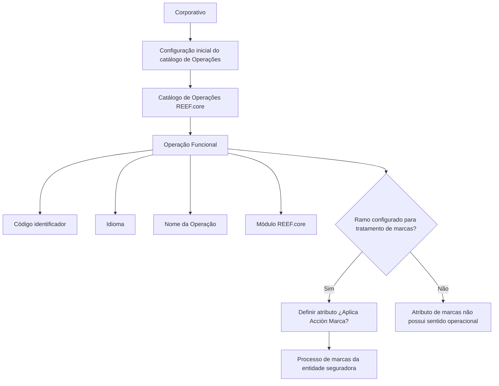

# Definição das Operações do REEF.core

## 1. Metadados do Documento
- **Arquivo de Origem:** Não informado
- **Tipo de Documento:** Especificação Funcional
- **Domínio / Sistema:** REEF.core
- **Público-Alvo:** Desenvolvedores, Arquitetos, Operação e Negócio
- **Data/Versão Identificada:** Não identificada

---

## 2. Resumo Executivo & Contexto de Negócio

O documento descreve o catálogo de definição de Operações do sistema REEF.core. As Operações são caracterizadas como fluxos operativos habilitados no sistema e possuem propriedades destinadas à sua identificação, localização funcional e classificação dentro dos módulos do REEF.core.

Cada Operação possui um código identificador, idioma de configuração, nome funcional e módulo de pertencimento. A nomenclatura do nome da Operação deve respeitar o padrão REEF.core: iniciar com um verbo em maiúsculas e seguir com o restante do nome em minúsculas.

O catálogo também contempla o atributo **“¿Aplica Acción Marca?”**, usado para determinar se uma Operação participa do processo de marcas configurado por uma entidade seguradora como uma possível ação antecipada.

A aplicabilidade de marcas depende previamente da configuração dos parâmetros do ramo. O atributo de marcas para uma Operação somente faz sentido quando o ramo foi configurado para entrar no processo de tratamento de marcas.

A configuração inicial do catálogo é fornecida pelo Corporativo e não pode ser modificada. O documento recomenda a leitura complementar de documentos sobre definição de programas, definição de marcas e perguntas frequentes, pois a interpretação isolada pode conduzir a erro.

---

## 3. Arquitetura, Componentes & Tecnologias Envolvidas

O conteúdo não apresenta uma arquitetura técnica detalhada, interfaces, APIs, tecnologias de implementação, ambientes, servidores, contratos HTTP ou estruturas de integração. O documento identifica apenas o sistema **REEF.core**, seus módulos funcionais e o catálogo de Operações.

Componentes e conceitos citados:

- **REEF.core:** Sistema que possui o catálogo de definição de Operações.
- **Catálogo de Operações:** Repositório funcional que identifica os fluxos operativos habilitados no sistema.
- **Operação Funcional:** Fluxo operativo identificado por um código.
- **Módulo REEF.core:** Módulo funcional ao qual uma Operação pertence.
- **Processo de Marcas:** Processo configurado pela entidade seguradora, no qual determinadas Operações podem ser consideradas ações antecipadas.
- **Parâmetros do Ramo:** Configuração que determina se um ramo entra no tratamento de marcas.
- **Corporativo:** Origem da configuração inicial do catálogo; suas informações não podem ser modificadas.



> **Nota de Análise:** O documento não detalha os módulos específicos do REEF.core, os valores possíveis para os atributos, métodos HTTP, contratos JSON, banco de dados, tecnologia de implementação ou mecanismos técnicos de integração.

---

## 4. Regras de Negócio, Especificações Funcionais & Processos

### 4.1 Catálogo de Operações

1. O REEF.core possui um catálogo de definição no qual são identificadas as Operações habilitadas no sistema.
2. As Operações são tratadas como fluxos operativos.
3. Cada Operação deve possuir propriedades operativas para identificação e classificação funcional.

### 4.2 Identificação da Operação

1. A propriedade **Operação** contém o código identificador da Operação Funcional.
2. O documento não especifica o formato, tamanho, padrão alfanumérico ou mecanismo de geração do código identificador.

### 4.3 Idioma da Operação

1. O atributo **Idioma** contém a chave do idioma utilizada na configuração da Operação.
2. O documento apresenta como exemplos os idiomas espanhol, inglês e turco.
3. O documento não apresenta uma lista completa de idiomas aceitos nem códigos padronizados para os idiomas.

### 4.4 Nome da Operação

1. A propriedade **Nome da Operação** contém a descrição funcional da Operação.
2. O nome deve respeitar a nomenclatura do REEF.core.
3. A nomenclatura exige que o nome da Operação comece com um verbo em maiúsculas.
4. O restante do nome da Operação deve estar em minúsculas.

### 4.5 Módulo REEF.core

1. A propriedade **Módulo REEF.core** determina o módulo ao qual a Operação pertence.
2. O módulo representa o contexto funcional no qual a Operação está registrada.
3. O documento não lista os módulos existentes no REEF.core.

### 4.6 Aplicação de Ação de Marca

1. O atributo **¿Aplica Acción Marca?** determina se uma Operação é considerada no processo de marcas.
2. O processo de marcas é configurado por uma entidade seguradora.
3. Uma Operação contemplada no processo de marcas pode representar uma das possíveis ações antecipadas a serem realizadas.
4. A definição do atributo de marcas somente possui sentido quando os parâmetros do ramo determinam que o ramo participará do processo de tratamento de marcas.
5. O documento não informa os valores técnicos permitidos para o atributo, como `Sim/Não`, `true/false` ou equivalente.

### 4.7 Governança e Restrição de Alteração

1. A configuração inicial do catálogo é fornecida pelo Corporativo.
2. As informações da configuração inicial não podem ser modificadas.
3. O documento recomenda consultar documentos funcionais complementares para evitar interpretação incorreta do catálogo de Operações quando analisado isoladamente.

---

## 5. Tabelas de Parâmetros, Ambientes e Estruturas de Dados

| Item / Parâmetro | Descrição / Função | Tipo / Valores / Formato | Ambiente / Observações |
| :--- | :--- | :--- | :--- |
| Operação | Contém o código identificador da Operação Funcional. | Código identificador; formato não informado. | Aplicável ao catálogo de Operações do REEF.core. |
| Idioma | Contém a chave do idioma usada na configuração da Operação. | Exemplos: espanhol, inglês, turco. | Lista completa de idiomas não informada. |
| Nome da Operação | Indica a descrição funcional da Operação. | Deve começar com verbo em maiúsculas; demais termos em minúsculas. | Deve respeitar a nomenclatura do REEF.core. |
| Módulo REEF.core | Determina o módulo do REEF.core ao qual a Operação pertence. | Módulo funcional; valores não informados. | Representa o contexto funcional da Operação. |
| ¿Aplica Acción Marca? | Determina se a Operação é considerada no processo de marcas. | Valores não informados. | Só possui sentido quando o ramo entra no tratamento de marcas. |
| Parâmetros do Ramo | Determinam se o ramo participará do processo de tratamento de marcas. | Configuração não detalhada. | Pré-condição para a aplicação do atributo de ação de marca. |
| Configuração inicial | Configuração inicial do catálogo de Operações. | Fornecida pelo Corporativo. | Não pode ser modificada. |
| Definição Programas | Documento complementar recomendado. | Documento funcional. | Recomendado para evitar interpretação isolada incorreta. |
| Definição de Marcas | Documento complementar recomendado. | Documento funcional. | Relacionado ao processo de marcas. |
| Perguntas frequentes | Documento complementar recomendado. | Documento funcional. | Fonte de esclarecimentos adicionais. |

> **Nota de Análise:** O documento não apresenta URLs de ambientes, caminhos de logs, servidores, portas, variáveis de configuração, modelos de dados físicos ou valores concretos de parâmetros.

---

## 6. Bateria de Perguntas & Respostas para RAG (FAQ Sintético)

### P1: Qual é o objetivo do catálogo de Operações no REEF.core?
**R:** O catálogo de Operações do REEF.core identifica as Operações habilitadas no sistema. Essas Operações são caracterizadas no documento como fluxos operativos e possuem propriedades para identificação, configuração de idioma, nomenclatura funcional, associação a módulos e participação no processo de marcas.

### P2: O que representa o campo Operação no catálogo do REEF.core?
**R:** A propriedade **Operação** contém o código identificador da Operação Funcional. O documento não informa o formato, o tamanho, a composição ou a regra de geração desse código.

### P3: Como deve ser preenchido o nome de uma Operação no REEF.core?
**R:** O nome da Operação deve conter uma descrição funcional e respeitar a nomenclatura do REEF.core: deve começar com um verbo em maiúsculas, enquanto o restante do nome deve permanecer em minúsculas.

### P4: Qual é a finalidade do atributo Idioma em uma Operação?
**R:** O atributo **Idioma** contém a chave do idioma empregada na configuração da Operação. O documento cita espanhol, inglês e turco como exemplos, sem apresentar uma relação completa de idiomas permitidos ou seus códigos.

### P5: O que o campo Módulo REEF.core informa sobre uma Operação?
**R:** O campo **Módulo REEF.core** determina o módulo do REEF.core ao qual a Operação pertence. Em termos funcionais, identifica o módulo em que a Operação está inscrita. O documento não informa quais módulos existem.

### P6: Para que serve o atributo “¿Aplica Acción Marca?”?
**R:** O atributo **¿Aplica Acción Marca?** define se uma Operação deve ser contemplada no processo de marcas configurado pela entidade seguradora. Quando aplicável, a Operação pode ser uma das possíveis ações antecipadas desse processo.

### P7: Quando o atributo de ação de marca possui sentido operacional?
**R:** O atributo de ação de marca somente possui sentido quando a configuração dos parâmetros do ramo determina que o ramo participará do processo de tratamento de marcas. Sem essa configuração prévia do ramo, a definição do atributo para a Operação não é aplicável segundo o documento.

### P8: A configuração inicial do catálogo de Operações pode ser alterada?
**R:** Não. O documento afirma que a configuração inicial é fornecida pelo Corporativo e que suas informações não podem ser modificadas.

### P9: Quais documentos devem ser consultados junto com a definição de Operações?
**R:** O documento recomenda consultar **Definição Programas**, **Definição de Marcas** e **Perguntas frequentes**. Essa leitura complementar é recomendada para evitar que a interpretação isolada do documento de Operações conduza a erro.

### P10: O documento especifica APIs, métodos HTTP ou contratos JSON das Operações?
**R:** Não. O documento descreve propriedades funcionais do catálogo de Operações, mas não detalha APIs, métodos HTTP, endpoints, contratos JSON, estruturas de banco de dados ou mecanismos de integração.

---

## 7. Glossário de Termos, Siglas & Conceitos-Chave

- **REEF.core:** Sistema que possui o catálogo de definição de Operações.
- **Operação Funcional:** Operação identificada por um código e tratada como fluxo operativo habilitado no REEF.core.
- **Catálogo de Operações:** Catálogo funcional do REEF.core que registra as Operações habilitadas.
- **Fluxo Operativo:** Forma como o documento caracteriza uma Operação habilitada no sistema.
- **Módulo REEF.core:** Módulo funcional do REEF.core ao qual uma Operação pertence.
- **Ação de Marca:** Possível ação antecipada no processo de marcas configurado pela entidade seguradora.
- **Processo de Marcas:** Processo configurado pela entidade seguradora que pode contemplar determinadas Operações.
- **Tratamento de Marcas:** Processo no qual um ramo pode participar quando definido nos parâmetros do ramo.
- **Ramo:** Elemento cujos parâmetros determinam a participação no processo de tratamento de marcas.
- **Corporativo:** Origem da configuração inicial do catálogo de Operações, cuja informação não pode ser modificada.

---

## 8. Notas Críticas, Riscos & Limitações

- A configuração inicial do catálogo é definida pelo Corporativo e não pode ser modificada, o que representa uma restrição explícita de governança e manutenção.
- A interpretação isolada do documento pode conduzir a erro; o próprio conteúdo recomenda a leitura de documentos relacionados à definição de programas, definição de marcas e perguntas frequentes.
- O documento não especifica os valores aceitos para o atributo **¿Aplica Acción Marca?**.
- O documento não detalha o formato do código identificador da Operação.
- O documento não apresenta uma lista dos módulos REEF.core disponíveis.
- O documento não informa tecnologias, ambientes, URLs, APIs, contratos de integração, regras de persistência, permissões ou mecanismos de auditoria.
- A participação de uma Operação no processo de marcas depende da configuração prévia dos parâmetros do ramo.

---

## 9. Conteúdo Bruto Estruturado (Referência Fiel)

```text
--- [PÁGINA 1 DE 2] ---

DEFINICIÓN de las OPERACIONES de REEF.CORE

Objetivo

Funcionalmente, Reef.core cuenta con un catálogo de definición en el que se identifican las Operaciones (como flujos operativos) que están habilitadas en el Sistema.

Propiedades Operativas

Operación

Esta propiedad contiene el código identificador de la Operación Funcional.

Idioma

Este Atributo contiene la clave del idioma empleado en la configuración de la Operación como por ejemplo: español, inglés, turco, ...

Nombre de la Operación

Esta propiedad indica la descripción funcional de la operación respetando la nomenclatura de Reef.core, es decir, comenzando con un verbo en mayúsculas y el resto en minúsculas.

Módulo Reef.core

Esta Propiedad determina el módulo de Reef.core al que pertenece la Operación, o dicho de otro modo, el módulo en el que funcionalmente se inscribe la Operación.

¿Aplica Acción Marca?

Este atributo del catálogo determina si la Operación se contempla o no en el proceso de marcas configurado por la entidad aseguradora como una de las posibles acciones anticipadas que se han de realizar.

Siempre y cuando se haya determinado en la configuración de los parámetros del Ramo el que éste vaya a entrar en el proceso de tratamiento de marcas, toma sentido la definición del atributo para la Operación.

Vínculos

Ejemplo:

Documentation / DOCUMENTACIÓN Reef
DOCUMENTACIÓN Reef
Mapfredocument
DOCUMENTACIÓN Reef

Owner
user:agonzalez_mapfre.com

Lifecycle
Approved Source / VL

Buscar Inicio Soluciones Arquitecturas APIs Componentes Cloud Documentación Zeus Reef Ayuda
ES


--- [PÁGINA 2 DE 2] ---

Relación de Directrices y Documentos funcionales cuya lectura recomendada para evitar que la interpretación aislada del presente documento pueda conducir a error.

Definición Programas
Definición de Marcas
Preguntas frecuentes

(1) ¿Existe alguna circunstancia operativa que deba ser tomada en consideración sobre este catálogo?

La configuración inicial viene dada desde el Corporativo y no puede modificarse su información.
```
