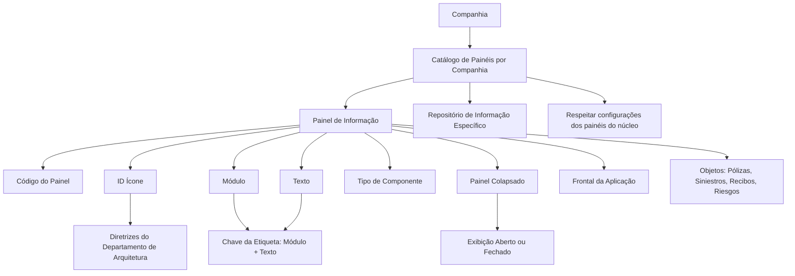
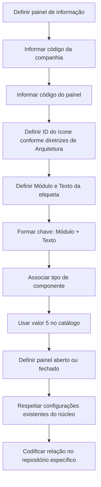

# Definição dos Painéis de Informação por Companhia no Reef.core

## 1. Metadados do Documento
- **Arquivo de Origem:** `Não informado`
- **Tipo de Documento:** `Especificação Técnica / Funcional`
- **Domínio / Sistema:** `Reef.core`
- **Público-Alvo:** `Desenvolvedores, Arquitetos, Analistas Funcionais e Operação`
- **Data/Versão Identificada:** `Não identificada`

---

## 2. Resumo Executivo & Contexto de Negócio

O documento descreve a definição de painéis de informação por companhia no sistema Reef.core. Esses painéis têm a finalidade de estruturar e organizar visualmente informações associadas a objetos de negócio, incluindo Pólizas, Siniestros, Recibos e Riesgos.

A organização em blocos de informações de natureza semelhante busca facilitar e agilizar tanto a captura quanto a consulta de informações no âmbito do Reef.core. O documento apresenta propriedades operativas que compõem a configuração de cada painel de informação.

Funcionalmente, Reef.core permite codificar a relação de painéis de informação do sistema em um repositório de informação específico. A configuração inclui a companhia, código do painel, ícone, módulo, texto, tipo de componente e comportamento de exibição colapsada.

O documento impõe uma restrição explícita: as configurações existentes dos painéis do núcleo da aplicação devem ser respeitadas obrigatoriamente. A leitura de documentos relacionados, especialmente “Definición Programas”, é recomendada para evitar interpretações isoladas ou incorretas.

---

## 3. Arquitetura, Componentes & Tecnologias Envolvidas

Os componentes e conceitos identificados são:

| Componente / Conceito | Papel identificado no documento |
| :--- | :--- |
| Reef.core | Sistema no qual os painéis de informação são definidos e utilizados. |
| Catálogo de Painéis por Companhia | Catálogo utilizado para configurar painéis de informação associados a uma companhia. |
| Repositório de informação específico | Repositório onde Reef.core pode codificar a relação de painéis de informação do sistema. |
| Painel de informação | Bloco visual que organiza informações de objetos como Pólizas, Siniestros, Recibos e Riesgos. |
| Frontal da aplicação | Camada da aplicação em que o painel é apresentado aberto ou fechado. |
| Departamento de Arquitetura | Área cujas diretrizes determinam o ícone representativo do programa. |
| Configurações dos painéis do núcleo | Configurações existentes que devem ser obrigatoriamente respeitadas. |



> **Nota de Análise:** O documento não detalha tecnologias de implementação, métodos HTTP, contratos JSON, banco de dados, URLs, ambientes, versões, integrações externas ou mecanismos técnicos de persistência do repositório de informação.

---

## 4. Regras de Negócio, Especificações Funcionais & Processos

### 4.1 Finalidade dos painéis de informação

Os painéis de informação no Reef.core devem:

1. Estruturar visualmente as informações dos objetos do sistema.
2. Organizar informações em blocos de natureza semelhante.
3. Facilitar a captura de informações.
4. Agilizar a consulta de informações.
5. Abranger, conforme os exemplos apresentados, objetos como:
   - Pólizas;
   - Siniestros;
   - Recibos;
   - Riesgos.

### 4.2 Configuração do catálogo por companhia

A relação de painéis de informação do sistema pode ser codificada pelo Reef.core em um repositório de informação específico. Cada definição de painel possui propriedades operativas relacionadas à companhia, identificação do painel, etiqueta, componente e comportamento visual.

### 4.3 Regras para propriedades do painel

1. **Companhia:** deve conter o código da companhia para a qual a definição do painel está sendo realizada.
2. **Código do Painel:** identifica o código do painel de informação no sistema.
3. **ID Ícone:** identifica o número do ícone que representa o programa, de acordo com as diretrizes do Departamento de Arquitetura.
4. **Módulo:** determina o módulo da etiqueta do painel de informação.
5. **Texto:** determina o identificador da etiqueta do painel de informação.
6. **Chave de etiqueta:** a dupla `Módulo + Texto` constitui a chave das etiquetas.
7. **Tipo de componente:** determina o tipo de componente associado ao painel de informação.
8. **Valor do tipo de componente:** no catálogo descrito, o valor dessa propriedade deve ser sempre `5`.
9. **Painel colapsado:** determina se o painel será exibido no frontal da aplicação como aberto ou fechado.
10. **Restrição do catálogo:** as configurações existentes dos painéis do núcleo da aplicação devem ser respeitadas obrigatoriamente.

### 4.4 Fluxo funcional identificado



---

## 5. Tabelas de Parâmetros, Ambientes e Estruturas de Dados

| Item / Parâmetro | Descrição / Função | Tipo / Valores / Formato | Ambiente / Observações |
| :--- | :--- | :--- | :--- |
| Companhia | Contém o código da companhia para a qual é realizada a definição do painel. | Código da companhia; formato não detalhado. | Aplicável ao Catálogo de Painéis por Companhia. |
| Código do Painel | Identifica o código do painel de informação no sistema. | Código; formato não detalhado. | Reef.core. |
| ID Ícone | Identifica o número do ícone que representa o programa. | Número do ícone; formato não detalhado. | Deve seguir diretrizes do Departamento de Arquitetura. |
| Módulo | Determina o módulo da etiqueta do painel de informação. | Valor de módulo; formato não detalhado. | Compõe a chave da etiqueta junto ao campo Texto. |
| Texto | Determina o identificador da etiqueta do painel de informação. | Identificador de etiqueta; formato não detalhado. | Compõe a chave da etiqueta junto ao campo Módulo. |
| Módulo + Texto | Dupla que conforma a chave das etiquetas. | Chave composta. | Regra explícita do documento. |
| Tipo de componente | Determina o tipo de componente associado ao painel de informação. | Valor fixo `5`. | No catálogo descrito, o valor é sempre 5. |
| Painel Colapsado | Determina como o painel aparece no frontal da aplicação. | `Abierto` ou `Cerrado`. | Equivalente funcional a aberto ou fechado. |
| Repositório de informação específico | Repositório utilizado para codificar a relação de painéis de informação do sistema. | Não detalhado. | O documento não informa tecnologia, localização ou estrutura. |
| Configurações dos painéis do núcleo | Configurações existentes que precisam ser preservadas. | Restrição obrigatória. | Aplicação núcleo do Reef.core. |

---

## 6. Bateria de Perguntas & Respostas para RAG (FAQ Sintético)

### P1: Qual é a finalidade dos painéis de informação no Reef.core?
**R:** Os painéis de informação no Reef.core têm a finalidade de estruturar e organizar visualmente informações de objetos como Pólizas, Siniestros, Recibos e Riesgos em blocos de informação de natureza semelhante. Essa organização visa facilitar e agilizar a captura e a consulta de informações.

### P2: O que representa o atributo Companhia no Catálogo de Painéis por Companhia?
**R:** O atributo Companhia contém o código da companhia sobre a qual está sendo realizada a definição do painel de informação.

### P3: Como o Código do Painel é utilizado no Reef.core?
**R:** O Código do Painel identifica o código do painel de informação no sistema Reef.core. O documento não especifica o formato, tamanho ou convenção de nomenclatura desse código.

### P4: Qual é a regra para o ID Ícone de um painel de informação?
**R:** O ID Ícone identifica o número do ícone que representa o programa. A definição do ícone deve estar de acordo com as diretrizes do Departamento de Arquitetura.

### P5: Qual é a chave das etiquetas de painéis de informação?
**R:** A chave das etiquetas é formada pela dupla `Módulo + Texto`. O campo Módulo determina o módulo da etiqueta, enquanto o campo Texto determina o identificador da etiqueta do painel de informação.

### P6: Qual valor deve ser atribuído ao Tipo de componente no catálogo descrito?
**R:** No catálogo apresentado pelo documento, o valor da propriedade Tipo de componente deve ser sempre `5`.

### P7: O que significa a propriedade Painel Colapsado?
**R:** A propriedade Painel Colapsado determina a forma de apresentação do painel no frontal da aplicação. O painel pode aparecer aberto ou fechado, descrito no texto original como “Abierto o Cerrado”.

### P8: Há alguma restrição para usar e definir o Catálogo de Painéis por Companhia no Reef.core?
**R:** Sim. Devem ser respeitadas obrigatoriamente as configurações existentes dos painéis do núcleo da aplicação.

### P9: Onde a relação de painéis de informação pode ser codificada?
**R:** Funcionalmente, o Reef.core possui a possibilidade de codificar a relação de painéis de informação do sistema em um repositório de informação específico. O documento não detalha a tecnologia ou a estrutura desse repositório.

### P10: Quais documentos relacionados são recomendados para consulta?
**R:** O documento recomenda a leitura de diretrizes e documentos funcionais relacionados para evitar interpretações isoladas. Entre os vínculos citados está o documento “Definición Programas”.

---

## 7. Glossário de Termos, Siglas & Conceitos-Chave

- **Reef.core:** Sistema no qual são definidos e utilizados os painéis de informação descritos.
- **Catálogo de Painéis por Companhia:** Catálogo que contém a configuração de painéis de informação associada a uma companhia.
- **Painel de Informação:** Bloco visual utilizado para estruturar informações de objetos do sistema.
- **Pólizas:** Tipo de objeto citado como exemplo de informação organizada por painéis.
- **Siniestros:** Tipo de objeto citado como exemplo de informação organizada por painéis.
- **Recibos:** Tipo de objeto citado como exemplo de informação organizada por painéis.
- **Riesgos:** Tipo de objeto citado como exemplo de informação organizada por painéis.
- **ID Ícone:** Número que identifica o ícone representativo do programa.
- **Módulo + Texto:** Dupla que forma a chave das etiquetas.
- **Tipo de componente:** Propriedade que determina o tipo de componente associado ao painel; o valor é sempre `5` no catálogo descrito.
- **Painel Colapsado:** Propriedade que define a apresentação aberta ou fechada do painel no frontal da aplicação.
- **Frontal da aplicação:** Camada onde o painel é visualmente apresentado.
- **Núcleo da aplicação:** Conjunto de painéis e configurações existentes que devem ser obrigatoriamente respeitados.

---

## 8. Notas Críticas, Riscos & Limitações

- O documento não informa nome de arquivo, autor, data, versão ou identificador formal da especificação.
- O documento não detalha a tecnologia, localização, estrutura ou modelo de dados do repositório de informação específico.
- Não são informados formatos, domínios de valores ou regras de validação para Companhia, Código do Painel, Módulo e Texto.
- O documento não fornece exemplos concretos de códigos de companhia, painéis, etiquetas ou ícones.
- Não há detalhamento de permissões, perfis de acesso, auditoria, logs, APIs, integrações ou procedimentos de implantação.
- A restrição de preservar as configurações existentes dos painéis do núcleo é obrigatória, mas o documento não lista quais configurações ou painéis pertencem ao núcleo.
- A leitura de “Definición Programas” é recomendada para evitar interpretações incorretas, mas o conteúdo desse documento vinculado não foi fornecido.
- **Nota de Análise:** O documento lista conceitos funcionais do Reef.core, mas não detalha contratos técnicos, métodos HTTP, entidades persistidas ou fluxos de integração entre serviços.

---

## 9. Conteúdo Bruto Estruturado (Referência Fiel)

```text
--- [PÁGINA 1 DE 2] ---

DEFINICIÓN de los PANELES de información por Compañía
Contexto
La nalidad básica del uso de paneles de información en el ámbito de Reef.core es estructurar y organizar visualmente la información de los
objetos (Pólizas, Siniestros, Recibos, Riesgos, ...) en bloques de información de similar naturaleza facilitando y agilizando de esta manera su
captura y su consulta.
Objetivo
Funcionalmente, Reef.core cuenta con la posibilidad de codicar la relación de paneles de información del Sistema en un repositorio de
información especíco.
Propiedades Operativas
Propiedades Operativas
Compañía
Este atributo del catálogo contiene el código de la compañía sobre la que se está realizando la denición del panel de Información.
Código del Panel
Esta propiedad de la denición identica el código del panel de información en el sistema.
ID Icono
Este atributo identica el número del icono que representa el programa de acuerdo con las directrices del Departamento de Arquitectura.
Módulo
Esta propiedad determina el módulo de la etiqueta del panel de información.
Texto
Esta propiedad determina el identicador de la etiqueta del panel de información.
La dupla Módulo + Texto conforman la clave de las etiquetas.
Tipo de componente
Esta propiedad determina el tipo de componente asociado al panel de información.
Documentation / DOCUMENTACIÓN Reef
DOCUMENTACIÓN Reef
Mapfredocument
DOCUMENTACIÓN Reef
Owner
user:agonzalez_mapfre.com
Lifecycle
Approved Source
 / 
 VL
Buscar Inicio Soluciones Arquitecturas APIs Componentes Cloud Documentación Zeus Reef Ayuda
ES


--- [PÁGINA 2 DE 2] ---

En este catálogo, el valor de esta propiedad siempre tendrá el valor 5.
Panel Colapsado
Esta propiedad en la conguración del panel de información determina la manera en la que aparecerá el mismo en el frontal de la aplicación:
Abierto o Cerrado.
Vínculos
Relación de Directrices y Documentos funcionales cuya lectura recomendada para evitar que la interpretación aislada del presente
documento pueda conducir a error.
Denición Programas
Preguntas frecuentes
(1) ¿Existe alguna restricción que tenga que ser tomada en cuenta en el uso y denición del Catálogo de Paneles por compañía de Reef.core?
Se han de respetar obligatoriamente las conguraciones existentes de los paneles del núcleo de la aplicación.
```
