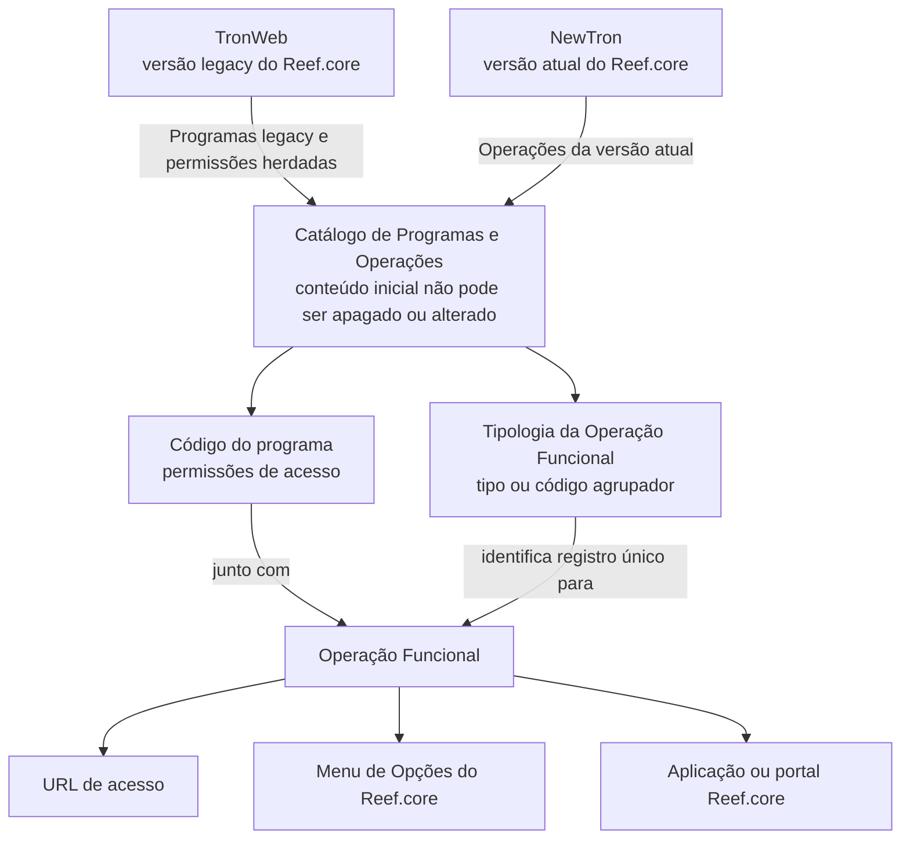

# Definição de Programas TronWeb e Operações NewTron no Reef.core

## 1. Metadados do Documento
- **Arquivo de Origem:** Não identificado
- **Tipo de Documento:** Especificação Técnica / Documentação Funcional
- **Domínio / Sistema:** Reef.core — TronWeb (versão legacy) e NewTron (versão atual)
- **Público-Alvo:** Desenvolvedores, Arquitetos, Analistas Funcionais e Operação
- **Data/Versão Identificada:** Não identificada
- **Owner identificado:** `user:agonzalez_mapfre.com`
- **Lifecycle identificado:** Approved Source

---

## 2. Resumo Executivo & Contexto de Negócio

O documento define o relacionamento entre os Programas da versão legacy do Reef.core, denominada **TronWeb**, e as Operações da versão atual do Reef.core, denominada **NewTron**. Essa relação é mantida em um catálogo de informação específico do sistema.

O catálogo é fornecido inicialmente às instalações com conteúdo que, conforme o documento, não pode ser apagado nem alterado. Essa característica estabelece uma restrição operacional importante para a gestão do catálogo de Programas e Operações do Reef.core.

A identificação de uma Operação Funcional é formada pela combinação entre o **Código do programa** e a **Tipologia da Operação Funcional**. Essa combinação identifica um registro único para determinar a Operação.

O Código do programa também controla permissões de acesso a operações e opções de menu do Reef.core. Quando uma operação herda permissões de um Programa existente no TronWeb, deve utilizar o código desse Programa legacy. Quando uma operação possui permissões próprias no Reef.core, o Código do programa deve coincidir com o valor do atributo que determina a operação.

O documento também descreve propriedades para URL de acesso, identificador da operação, disponibilidade pelo menu de opções e aplicação ou portal Reef.core que executa a operação. Não há detalhamento de métodos HTTP, contratos JSON, tecnologias de implementação, ambientes, servidores ou mecanismos técnicos de autenticação.

---

## 3. Arquitetura, Componentes & Tecnologias Envolvidas

### Componentes e conceitos identificados

| Componente / Conceito | Papel descrito |
| :--- | :--- |
| **Reef.core** | Sistema no qual são catalogadas e executadas Operações Funcionais. |
| **TronWeb** | Versão legacy do Reef.core; seus Programas podem fornecer permissões herdadas. |
| **NewTron** | Versão atual do Reef.core; suas Operações são relacionadas aos Programas do TronWeb. |
| **Catálogo de Programas e Operações** | Catálogo específico que relaciona Programas legacy e Operações da versão atual. |
| **Programa** | Entidade cujo código contém permissões para acessar uma operação ou opções de menu do Reef.core. |
| **Operação Funcional** | Operação identificada por Código do programa e Tipologia da Operação Funcional. |
| **Menu de Opções do Reef.core** | Menu a partir do qual uma operação pode ou não ser acessada diretamente. |
| **Aplicação / Portal Reef.core** | Aplicação ou portal a partir do qual a Operação Funcional é executada. |



> **Nota de Análise:** O documento não descreve interfaces técnicas, protocolos, contratos de integração, métodos HTTP, endpoints concretos, bases de dados ou tecnologias de infraestrutura.

---

## 4. Regras de Negócio, Especificações Funcionais & Processos

### 4.1 Relação entre Programas e Operações

1. O núcleo do sistema permite identificar a relação entre:
   - Programas do Reef.core legacy, denominado TronWeb.
   - Operações da versão atual do Reef.core, denominada NewTron.

2. A relação entre Programas TronWeb e Operações NewTron é registrada em um catálogo de informação específico.

3. O catálogo é entregue inicialmente às instalações com conteúdo que não pode ser:
   - Apagado.
   - Alterado.

### 4.2 Regra do Código do programa

1. O Código do programa contém as permissões para acessar:
   - Uma Operação do Reef.core.
   - Opções de menu do Reef.core.

2. Se houver herança de permissões de um Programa existente no Reef.core legacy, TronWeb:
   - O Código do programa deve ser o código do Programa legacy correspondente.

3. Se houver permissões próprias para uma operação no Reef.core:
   - O Código do programa deve coincidir com o valor do atributo que determina a Operação.

### 4.3 Regra de identificação da Operação Funcional

1. A Tipologia da Operação Funcional contém:
   - O tipo de operação funcional; ou
   - O código agrupador.

2. A Tipologia da Operação Funcional, em conjunto com o Código do programa:
   - Identifica um único registro.
   - Determina a Operação.

### 4.4 Propriedades funcionais da Operação

| Propriedade | Regra ou significado funcional |
| :--- | :--- |
| Código do programa | Contém permissões para acessar a operação ou opções de menu. Pode referenciar código de Programa TronWeb em caso de herança ou coincidir com o atributo que determina a Operação quando existirem permissões próprias. |
| Tipologia da Operação Funcional | Tipo de operação funcional ou código agrupador; junto ao Código do programa, identifica um único registro. |
| URL de acesso | URL de acesso à Operação Funcional. |
| Operação | Identificador da Operação Funcional conforme a relação de possíveis valores do catálogo mestre do Reef.core. |
| Operação acessível desde o Menu de Opções | Indicador que define se a operação é acessível diretamente pelo menu do Reef.core. |
| Aplicação | Código da aplicação ou portal Reef.core de onde a Operação Funcional é executada. |

---

## 5. Tabelas de Parâmetros, Ambientes e Estruturas de Dados

| Item / Parâmetro | Descrição / Função | Tipo / Valores / Formato | Ambiente / Observações |
| :--- | :--- | :--- | :--- |
| Código do programa | Armazena permissões de acesso a uma Operação ou a opções de menu do Reef.core. | Código; formato não detalhado. | Usa o código do Programa TronWeb quando há herança de permissões. Para permissões próprias, coincide com o atributo que determina a Operação. |
| Tipologia da Operação Funcional | Representa o tipo da operação ou código agrupador. | Tipo ou código agrupador; valores não detalhados. | Junto ao Código do programa, identifica um registro único. |
| URL de acesso | Define a URL de acesso à Operação Funcional. | URL; formato e exemplos não detalhados. | Não foram informados domínios, portas ou ambientes. |
| Operação | Identificador da Operação Funcional. | Valor pertencente à relação de valores do catálogo mestre do Reef.core. | O catálogo mestre é citado, mas não é detalhado. |
| Operação acessível desde o Menu de Opções | Informa se a operação pode ser acessada diretamente pelo menu do Reef.core. | Marca / indicador; valores concretos não detalhados. | Relacionado ao Menu de Opções do Reef.core. |
| Aplicação | Código da aplicação ou portal de origem da execução da Operação Funcional. | Código; formato não detalhado. | Refere-se a aplicações ou portais do Reef.core. |
| Catálogo de Programas e Operações | Mantém a relação entre Programas TronWeb e Operações NewTron. | Catálogo de informação específico. | Conteúdo inicial entregue às instalações não pode ser apagado nem alterado. |
| TronWeb | Versão legacy do Reef.core. | Sistema / versão. | Origem de Programas que podem fornecer permissões herdadas. |
| NewTron | Versão atual do Reef.core. | Sistema / versão. | Destino funcional das Operações relacionadas no catálogo. |
| Recomendação do Centro Corporativo | O documento declara não existir recomendação considerada pelo Centro Corporativo para uso e configuração do catálogo. | Não aplicável. | Informação declarada na seção de perguntas frequentes. |

---

## 6. Bateria de Perguntas & Respostas para RAG (FAQ Sintético)

### P1: Qual é o objetivo do Catálogo de Programas e Operações do Reef.core?
**R:** O Catálogo de Programas e Operações permite identificar a relação entre os Programas da versão legacy do Reef.core, chamada TronWeb, e as Operações da versão atual do Reef.core, chamada NewTron. Essa relação é mantida em um catálogo de informação específico.

### P2: O conteúdo inicial do Catálogo de Programas e Operações pode ser apagado ou alterado?
**R:** Não. O documento informa que o catálogo é entregue inicialmente às instalações com conteúdo que não pode ser apagado ou alterado.

### P3: Para que serve o Código do programa no Reef.core?
**R:** O Código do programa contém as permissões necessárias para acessar uma Operação ou opções de menu do Reef.core. O uso do código depende de haver herança de permissões do TronWeb ou permissões próprias no Reef.core.

### P4: Qual Código do programa deve ser usado quando uma operação herda permissões do TronWeb?
**R:** Quando uma operação herda permissões de um Programa existente no Reef.core legacy, TronWeb, o Código do programa deve ser o código desse Programa legacy.

### P5: Como deve ser definido o Código do programa para uma operação com permissões próprias no Reef.core?
**R:** Quando uma operação possui permissões próprias no Reef.core, o Código do programa deve coincidir com o valor do atributo que determina a Operação.

### P6: Quais atributos identificam unicamente uma Operação Funcional?
**R:** A combinação do Código do programa com a Tipologia da Operação Funcional identifica um único registro para determinar a Operação.

### P7: O que representa a Tipologia da Operação Funcional?
**R:** A Tipologia da Operação Funcional contém o tipo de operação funcional ou o código agrupador. Em conjunto com o Código do programa, essa propriedade identifica o registro único da Operação.

### P8: De onde vem o identificador da propriedade Operação?
**R:** A propriedade Operação contém o identificador da Operação Funcional de acordo com a relação de possíveis valores existente no catálogo mestre do Reef.core.

### P9: Como saber se uma Operação Funcional pode ser acessada pelo menu do Reef.core?
**R:** A propriedade “Operação acessível desde o Menu de Opções” funciona como uma marca que indica se a Operação é acessível diretamente pelo Menu de Opções do Reef.core.

### P10: O que informa a propriedade Aplicação no catálogo?
**R:** A propriedade Aplicação contém o código da aplicação ou do portal Reef.core a partir do qual a Operação Funcional é executada.

### P11: O documento fornece recomendações do Centro Corporativo para uso e configuração do catálogo?
**R:** Não. Na seção de perguntas frequentes, o documento afirma que não foi considerada nenhuma recomendação pelo Centro Corporativo para o uso e a configuração do Catálogo de Programas e Operações existentes no Reef.core.

### P12: O documento especifica URLs concretas, métodos HTTP ou contratos JSON das Operações Funcionais?
**R:** Não. O documento informa que existe uma propriedade de URL de acesso para a Operação Funcional, mas não fornece URLs específicas, métodos HTTP, contratos JSON ou detalhes técnicos de integração.

---

## 7. Glossário de Termos, Siglas & Conceitos-Chave

- **Reef.core:** Sistema citado como contexto dos Programas, Operações Funcionais, catálogo mestre, menu de opções e aplicações ou portais.
- **TronWeb:** Versão legacy do Reef.core.
- **NewTron:** Versão atual do Reef.core.
- **Programa:** Entidade cujo código contém permissões para acessar uma Operação ou opções de menu do Reef.core.
- **Código do programa:** Propriedade que define permissões e participa da identificação de uma Operação Funcional.
- **Operação Funcional:** Operação determinada por um registro identificado pelo Código do programa e pela Tipologia da Operação Funcional.
- **Tipologia da Operação Funcional:** Tipo de operação funcional ou código agrupador que, combinado ao Código do programa, identifica um registro único.
- **Catálogo de Programas e Operações:** Catálogo específico que registra a relação entre Programas TronWeb e Operações NewTron.
- **Catálogo mestre do Reef.core:** Catálogo citado como fonte da relação de possíveis valores para o identificador de Operação.
- **Menu de Opções:** Menu do Reef.core a partir do qual uma Operação pode ser acessível diretamente.
- **Aplicação / Portal Reef.core:** Origem de execução de uma Operação Funcional.

---

## 8. Notas Críticas, Riscos & Limitações

- O conteúdo inicial do Catálogo de Programas e Operações não pode ser apagado nem alterado; qualquer processo operacional deve considerar essa restrição.
- O documento não detalha o modelo de dados completo do catálogo, incluindo formatos, obrigatoriedade, unicidade técnica ou valores permitidos para os atributos.
- O documento menciona uma URL de acesso, mas não fornece URLs concretas, domínios, protocolos, portas ou separação por ambientes.
- Não há especificação de métodos HTTP, payloads, contratos JSON, autenticação, autorização técnica, logs, monitoramento ou tratamento de erros.
- Não há detalhamento da relação de valores existente no catálogo mestre do Reef.core.
- A FAQ afirma que o Centro Corporativo não considerou recomendações para uso e configuração do Catálogo de Programas e Operações.
- A documentação recomenda a leitura de diretrizes e documentos funcionais vinculados, pois a interpretação isolada do documento pode conduzir a erro.
- **Nota de Análise:** O documento apresenta propriedades funcionais do catálogo, mas não detalha procedimentos de criação, manutenção, consulta ou governança dos registros.

---

## 9. Conteúdo Bruto Estruturado (Referência Fiel)

```text
--- [PÁGINA 1 DE 2] ---

DEFINICIÓN de PROGRAMAS TronWeb / OPERACIONES NewTron
Objetivo
Funcionalmente, el núcleo del Sistema cuenta con la posibilidad de identicar la relación de los Programas de la versión legacy de Reef.core
(TronWeb) con las Operaciones de la Versión actual de Reef.core (NewTron) en un catálogo de información especíco que se entrega
inicialmente a las instalaciones con contenido que no se puede borrar o alterar.
Propiedades Operativas
Propiedades Operativas
Código del programa
Código del programa que contendrá los permisos para acceder a la operación o a las opciones de menú de Reef.core.
En caso de heredar los permisos de algún programa ya existente en el Legacy de Reef.core (TronWeb) deberá ser el código de dicho
programa mientras que el el caso de tener permisos propios para Reef.core deberá coincidir con el valor del atributo que determina la
operación.
Tipología de la Operación Funcional
Este atributo contiene el tipo de operación funcional ó código agrupador que identica, junto con el atributo código del programa un único
registro para determinar la Operación.
URL de acceso
Esta propiedad contiene la url de acceso a la Operación Funcional.
Operación
Esta propiedad contiene el identicador de la operación funcional de acuerdo con la relación de posibles valores existente en el catálogo
maestro de Reef.core.
Operación accesible desde el Menú de Opciones
Esta marca indica si la operación es accesible directamente o no desde el Menú de Reef.core.
Aplicación
Esta Propiedad contiene el código de la aplicación o portal de Reef.core desde donde se ejecuta la operación funcional.
Ejemplo:
Documentation / DOCUMENTACIÓN Reef
DOCUMENTACIÓN Reef
Mapfredocument
DOCUMENTACIÓN Reef
Owner
user:agonzalez_mapfre.com
Lifecycle
Approved Source
 / 
 VL
Buscar Inicio Soluciones Arquitecturas APIs Componentes Cloud Documentación Zeus Reef Ayuda
ES


--- [PÁGINA 2 DE 2] ---

Vínculos
Relación de Directrices y Documentos funcionales cuya lectura recomendada para evitar que la interpretación aislada del presente
documento pueda conducir a error.
Denición de Programas
Preguntas frecuentes
(1) ¿Existe alguna recomendación que pueda ser tomada en consideración en el uso y conguración del Catálogo de Programas y
Operaciones existentes en Reef.core?
No se ha considerado ninguna desde el Centro Corporativo.
```
