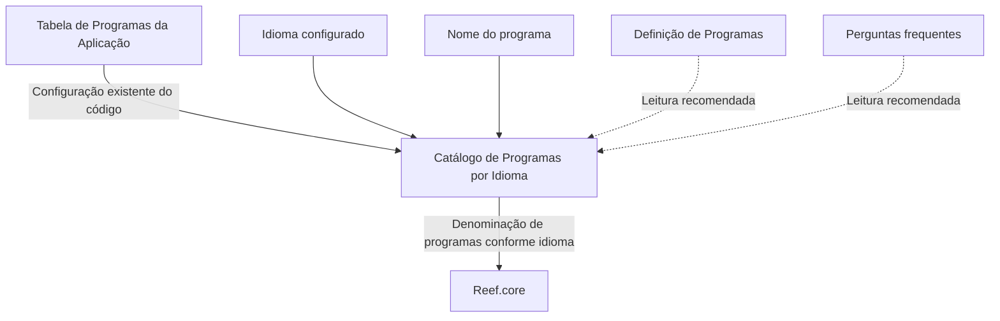

# Definição dos Programas da Aplicação por Idioma no Reef.core

## 1. Metadados do Documento
- **Arquivo de Origem:** Não identificado
- **Tipo de Documento:** Especificação Técnica / Funcional
- **Domínio / Sistema:** Reef.core — Catálogo de Programas por Idioma
- **Público-Alvo:** Desenvolvedores, Analistas Funcionais, Arquitetos e Operação
- **Data/Versão Identificada:** Não identificada

---

## 2. Resumo Executivo & Contexto de Negócio

O documento descreve a funcionalidade de definição dos programas da aplicação Reef.core por idioma. A funcionalidade permite denominar a relação de programas conforme os idiomas configurados na aplicação, utilizando um repositório de informação criado especificamente para esse propósito.

O Catálogo de Programas por Idioma associa cada programa já existente na tabela de Programas da Aplicação a um idioma e a uma denominação de programa. Dessa forma, o código do programa identifica o programa configurado no Reef.core, enquanto o idioma indica a língua utilizada para apresentar a denominação correspondente.

A especificação identifica três propriedades operativas: código do programa, idioma e nome do programa. A definição não apresenta detalhes sobre interfaces, métodos HTTP, contratos JSON, persistência física, permissões de alteração ou processos de publicação das denominações.

O documento estabelece uma restrição operacional explícita: as configurações existentes no Catálogo de Programas por Idioma devem ser respeitadas obrigatoriamente para garantir o funcionamento correto do núcleo da aplicação Reef.core.

---

## 3. Arquitetura, Componentes & Tecnologias Envolvidas

Os elementos identificados no documento são:

- **Reef.core:** núcleo da aplicação que utiliza a configuração do catálogo.
- **Tabela de Programas da Aplicação:** fonte da configuração existente dos códigos de programa.
- **Catálogo de Programas por Idioma:** repositório específico que contém a denominação de programas conforme o idioma.
- **Idioma:** propriedade que identifica a língua da denominação, com exemplos de espanhol, inglês e turco.
- **Nome do programa:** denominação configurada para um programa em determinado idioma.
- **Definição de Programas:** documento funcional relacionado cuja leitura é recomendada.
- **Perguntas frequentes:** documento funcional relacionado cuja leitura é recomendada.



**Nota de Análise:** o documento não detalha a tecnologia de armazenamento do repositório, os mecanismos de integração entre a tabela de Programas da Aplicação e o Catálogo de Programas por Idioma, nem a forma de consumo dessa configuração pelo Reef.core.

---

## 4. Regras de Negócio, Especificações Funcionais & Processos

### 4.1 Objetivo funcional

O Reef.core possui a capacidade de denominar a relação de programas em função dos idiomas configurados na aplicação. Essa capacidade utiliza um repositório de informação criado especificamente para o gerenciamento das denominações por idioma.

### 4.2 Propriedades operativas

1. **Código do programa**
   - Identifica o código do programa do Reef.core.
   - Deve estar de acordo com a configuração existente na tabela de Programas da Aplicação.

2. **Idioma**
   - Identifica o idioma no qual o programa está sendo denominado.
   - O documento apresenta como exemplos códigos que identificam os idiomas espanhol, inglês e turco.

3. **Nome do programa**
   - Determina a denominação atribuída ao programa.

### 4.3 Restrição obrigatória

As configurações existentes no Catálogo de Programas por Idioma devem ser respeitadas obrigatoriamente. O descumprimento dessa restrição pode comprometer o funcionamento correto do núcleo da aplicação Reef.core.

### 4.4 Documentação vinculada

A leitura dos documentos relacionados é recomendada para evitar interpretações incorretas decorrentes da análise isolada desta especificação:

- **Definição de Programas**
- **Perguntas frequentes**

**Nota de Análise:** o documento não especifica regras de validação para idiomas inválidos, duplicidade de denominações, obrigatoriedade de preenchimento, exclusão de configurações ou comportamento de fallback quando não houver denominação cadastrada para um idioma.

---

## 5. Tabelas de Parâmetros, Ambientes e Estruturas de Dados

| Item / Parâmetro | Descrição / Função | Tipo / Valores / Formato | Ambiente / Observações |
| :--- | :--- | :--- | :--- |
| Código do programa | Identifica o código do programa do Reef.core. | Código configurado na tabela de Programas da Aplicação. | Deve estar de acordo com a configuração existente. |
| Idioma | Identifica o idioma no qual o programa é denominado. | Códigos de idioma; exemplos citados: espanhol, inglês e turco. | O formato exato dos códigos não é especificado. |
| Nome do programa | Determina a denominação do programa. | Texto / denominação. | O documento não informa tamanho, idioma padrão ou regras de preenchimento. |
| Catálogo de Programas por Idioma | Repositório específico para a denominação da relação de programas conforme idiomas configurados. | Repositório de informação. | Suas configurações devem ser respeitadas obrigatoriamente. |
| Tabela de Programas da Aplicação | Contém a configuração existente usada como referência para o código do programa. | Tabela de configuração. | Não são apresentados estrutura, campos ou localização técnica. |
| Reef.core | Aplicação cujo núcleo depende da correta configuração do catálogo. | Sistema / núcleo da aplicação. | Não são detalhadas versão, ambiente ou tecnologia. |
| Definição de Programas | Documento funcional vinculado. | Documento relacionado. | Leitura recomendada. |
| Perguntas frequentes | Documento funcional vinculado. | Documento relacionado. | Leitura recomendada. |

---

## 6. Bateria de Perguntas & Respostas para RAG (FAQ Sintético)

### P1: Qual é o objetivo do Catálogo de Programas por Idioma no Reef.core?
**R:** O Catálogo de Programas por Idioma permite denominar a relação de programas do Reef.core conforme os idiomas configurados na aplicação, utilizando um repositório de informação criado especificamente para essa finalidade.

### P2: Quais propriedades operativas compõem a definição de programas por idioma?
**R:** A definição contém três propriedades operativas: código do programa, idioma e nome do programa. O código identifica o programa configurado; o idioma identifica a língua da denominação; e o nome do programa determina a denominação apresentada.

### P3: De onde deve vir o código do programa usado no Catálogo de Programas por Idioma?
**R:** O código do programa deve identificar o programa do Reef.core de acordo com a configuração existente na tabela de Programas da Aplicação.

### P4: O que a propriedade Idioma representa no Catálogo de Programas por Idioma?
**R:** A propriedade Idioma identifica a língua em que o programa está sendo denominado. O documento cita como exemplos códigos que identificam os idiomas espanhol, inglês e turco.

### P5: Qual é a função do campo Nome do programa?
**R:** O campo Nome do programa determina a denominação do programa para o idioma identificado na configuração correspondente.

### P6: Existe uma restrição obrigatória para o uso do Catálogo de Programas por Idioma?
**R:** Sim. As configurações existentes no Catálogo de Programas por Idioma devem ser respeitadas obrigatoriamente para o correto funcionamento do núcleo da aplicação Reef.core.

### P7: O documento define o formato técnico dos códigos de idioma?
**R:** Não. O documento menciona códigos que identificam espanhol, inglês e turco, mas não especifica o padrão, o tamanho ou os valores exatos desses códigos.

### P8: O documento detalha APIs, métodos HTTP ou contratos JSON do Reef.core?
**R:** Não. A especificação descreve apenas o objetivo funcional, as propriedades operativas e a restrição de respeitar as configurações existentes no catálogo. Não há detalhamento de APIs, métodos HTTP ou contratos JSON.

### P9: Quais documentos devem ser consultados junto desta especificação?
**R:** O documento recomenda consultar os materiais vinculados “Definição de Programas” e “Perguntas frequentes”, pois a interpretação isolada da especificação pode conduzir a erros.

### P10: O que acontece se as configurações existentes do catálogo não forem respeitadas?
**R:** O documento afirma que as configurações devem ser respeitadas obrigatoriamente para o correto funcionamento do núcleo da aplicação. Não detalha tecnicamente os erros, impactos ou comportamentos específicos decorrentes do descumprimento.

---

## 7. Glossário de Termos, Siglas & Conceitos-Chave

- **Reef.core:** Aplicação mencionada no documento, cujo núcleo depende da correta configuração do Catálogo de Programas por Idioma.
- **Catálogo de Programas por Idioma:** Repositório de informação específico usado para denominar a relação de programas conforme os idiomas configurados na aplicação.
- **Código do programa:** Propriedade que identifica o programa do Reef.core de acordo com a configuração existente na tabela de Programas da Aplicação.
- **Idioma:** Propriedade que identifica a língua em que um programa é denominado.
- **Nome do programa:** Propriedade que determina a denominação do programa.
- **Tabela de Programas da Aplicação:** Tabela de configuração existente utilizada como referência para identificar o código do programa.
- **Definição de Programas:** Documento funcional vinculado e recomendado para leitura.
- **Perguntas frequentes:** Documento funcional vinculado e recomendado para leitura.

---

## 8. Notas Críticas, Riscos & Limitações

- O funcionamento correto do núcleo do Reef.core depende do respeito obrigatório às configurações existentes no Catálogo de Programas por Idioma.
- A leitura isolada deste documento pode conduzir a interpretações incorretas; o próprio texto recomenda consultar “Definição de Programas” e “Perguntas frequentes”.
- Não há detalhamento sobre estrutura física de dados, chaves, integridade referencial, permissões, auditoria, versionamento ou processo de manutenção do catálogo.
- Não são informados os códigos exatos dos idiomas, idiomas obrigatórios, idioma padrão ou comportamento quando não houver denominação para um idioma.
- Não são descritos endpoints, interfaces, integrações, contratos de dados, rotinas de carga, logs ou mecanismos de tratamento de erros.
- O trecho de navegação “Documentation / DOCUMENTACIÓN Reef”, “Mapfredocument”, “Owner”, “Lifecycle” e “Approved Source” aparece no conteúdo bruto, mas não possui explicação funcional adicional no documento.

---

## 9. Conteúdo Bruto Estruturado (Referência Fiel)

```text
--- [PÁGINA 1 DE 1] ---

DEFINICIÓN de los PROGRAMAS de la Aplicación por Idioma
Objetivo
Funcionalmente, Reef.core cuenta con la facultad de denominar la relación de programas en función de los idiomas congurados en la
aplicación en un repositorio de información creado especícamente.
Propiedades Operativas
Propiedades Operativas
Código del programa
Esta propiedad de la denición identica el código del programa de Reef.core de acuerdo con la conguración existente en la tabla de
Programas de la Aplicación.
Idioma
Esta propiedad identica el idioma en el que está denominando el programa, como por ejemplo con los códigos que identican los idiomas
español, inglés, turco,...
Nombre del programa
Esta propiedad determina la denominación del programa.
Vínculos
Relación de Directrices y Documentos funcionales cuya lectura recomendada para evitar que la interpretación aislada del presente
documento pueda conducir a error.
Denición de Programas
Preguntas frecuentes
(1) ¿Existe alguna restricción que tenga que ser tomada en cuenta en el uso y denición del Catálogo de Programas por Idioma de Reef.core?
Se tienen que respetar obligatoriamente las conguraciones existentes en este catálogo para el correcto funcionamiento del núcleo de la
aplicación.
Ejemplo:
Documentation / DOCUMENTACIÓN Reef
DOCUMENTACIÓN Reef
Mapfredocument
DOCUMENTACIÓN Reef
Owner
user:agonzalez_mapfre.com
Lifecycle
Approved Source
 / 
 VL
Buscar Inicio Soluciones Arquitecturas APIs Componentes Cloud Documentación Zeus Reef Ayuda
ES
```
