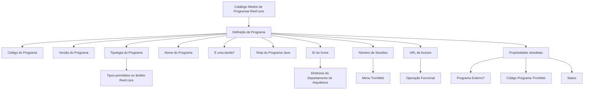

# Catálogo Mestre de Programas da Aplicação Reef.core

## 1. Metadados do Documento
- **Arquivo de Origem:** Não identificado no conteúdo extraído; referência exibida: `Mapfredocument`
- **Tipo de Documento:** Especificação Técnica
- **Domínio / Sistema:** Reef.core / TronWeb
- **Público-Alvo:** Desenvolvedores, Arquitetos, Operação e equipes responsáveis pela configuração do catálogo de programas
- **Data/Versão Identificada:** Não identificada
- **Owner identificado:** `user:agonzalez_mapfre.com`
- **Lifecycle identificado:** `Approved Source / VL`

---

## 2. Resumo Executivo & Contexto de Negócio

O documento descreve a **definição de programas da aplicação Reef.core** por meio de um catálogo mestre de informações. Esse catálogo permite configurar os programas do núcleo do Reef.core e centraliza propriedades que identificam, classificam e operacionalizam cada programa.

A configuração contempla atributos como código, versão, tipologia, nome, condição de tarefa, rota de programa Java, ícone, quantidade de sessões simultâneas e URL de acesso à operação funcional. A tipologia determina a natureza do programa-fonte conforme os tipos permitidos no âmbito do Reef.core.

O documento também registra propriedades que permanecem no catálogo, mas cuja funcionalidade foi formalmente declarada **descontinuada e obsoleta**: `Programa Externo?`, `Código Programa TronWeb` e `Status`. Essas propriedades não podem ser utilizadas nem reutilizadas para finalidades locais.

A principal restrição operacional é preservar obrigatoriamente as configurações já existentes no catálogo. Alterações ou interpretações isoladas podem comprometer o funcionamento correto do núcleo da aplicação Reef.core; por isso, o documento recomenda a leitura das diretrizes e documentos funcionais relacionados.

---

## 3. Arquitetura, Componentes & Tecnologias Envolvidas

### Componentes e conceitos identificados

| Componente / Tecnologia | Papel descrito no documento |
| :--- | :--- |
| **Reef.core** | Núcleo da aplicação e domínio no qual o catálogo mestre de programas é configurado. |
| **Catálogo de Programas** | Catálogo mestre criado especificamente para configurar programas do Reef.core. |
| **Programa** | Unidade configurável no catálogo, identificada por código, versão, tipologia, nome e outras propriedades operacionais. |
| **TronWeb** | Ambiente ou componente citado para configuração de sessões abertas no menu e para uma propriedade obsoleta de código de programa. |
| **Programa Java** | Programa cuja rota pode ser definida pelo atributo `Ruta del Programa Java`. |
| **Departamento de Arquitetura** | Área cujas diretrizes orientam a identificação do ícone do programa. |
| **Operação Funcional** | Destino acessado pela propriedade `URL de acesso`. |
| **Documentação Reef** | Área ou referência documental associada ao conteúdo. |

### Fluxo lógico de configuração do catálogo



**Nota de Análise:** o documento não descreve interfaces, métodos HTTP, contratos JSON, bancos de dados, protocolos de integração, ambientes de implantação, versões tecnológicas ou mecanismos de autenticação. O diagrama representa somente a relação lógica entre o catálogo e as propriedades explicitamente citadas.

---

## 4. Regras de Negócio, Especificações Funcionais & Processos

### Objetivo funcional

1. Reef.core possui a capacidade de configurar seus programas em um catálogo mestre de informações.
2. O catálogo mestre foi criado especificamente para a definição e configuração de programas do Reef.core.
3. A configuração existente no catálogo deve ser respeitada obrigatoriamente para garantir o funcionamento correto do núcleo da aplicação.

### Propriedades operacionais do programa

1. **Código do programa**
   - Identifica o código do programa no Reef.core.

2. **Versão do Programa**
   - Identifica a versão do programa.

3. **Tipologia de Programa**
   - Determina o tipo de programa-fonte.
   - A classificação deve seguir exclusivamente os tipos contemplados e permitidos no âmbito do Reef.core.

4. **Nome do programa**
   - Determina a denominação do programa.

5. **É uma tarefa?**
   - Quando a tipologia do programa for uma tarefa, este atributo do catálogo de configuração deve ser ativado.

6. **Rota do Programa Java**
   - Determina a rota onde o programa Java está localizado.

7. **Programa Externo?**
   - A funcionalidade está descontinuada e obsoleta no catálogo de programas do núcleo Reef.core.
   - Não pode ser usada nem reutilizada para qualquer propósito de âmbito local.
   - Originalmente, a propriedade indicava que o programa poderia ser executado externamente.

8. **Código Programa TronWeb**
   - A funcionalidade está descontinuada e obsoleta no catálogo de programas do núcleo Reef.core.
   - Não pode ser usada nem reutilizada para qualquer propósito de âmbito local.
   - Originalmente, a propriedade indicava o nome do programa no TronWeb.

9. **ID Ícone**
   - Identifica o número do ícone que representa o programa.
   - O número deve seguir as diretrizes do Departamento de Arquitetura.

10. **Número de sessões**
    - Determina a quantidade de sessões do programa que podem permanecer abertas simultaneamente no menu do TronWeb.

11. **Status**
    - A funcionalidade está descontinuada e obsoleta no catálogo de programas do núcleo Reef.core.
    - Não pode ser usada nem reutilizada para qualquer propósito de âmbito local.
    - Originalmente, a propriedade determinava o estado do programa, como ativo ou inativo.

12. **URL de acesso**
    - Contém a URL de acesso à Operação Funcional.

### Tipologias de programa permitidas

Os seguintes valores são apresentados como possíveis valores do atributo de tipologia:

- `(DLG) Dialogo`
- `(DLM) Dialogo modal`
- `(FRM) Frame`
- `(HTM) Html`
- `(INP) Forms`
- `(JAV) Java`
- `(MEN) Menu`
- `(PCO) Cobol`
- `(PL) Pl/sql`
- `(PNL) Panel`
- `(SH) Shell`
- `(TAR) Tarea`
- `(VEP) Visual café`
- `(WIN) Windows`
- `(WTW) WebTronweb`
- `(GP) Generador producto`

---

## 5. Tabelas de Parâmetros, Ambientes e Estruturas de Dados

### Atributos do catálogo de programas

| Item / Parâmetro | Descrição / Função | Tipo / Valores / Formato | Ambiente / Observações |
| :--- | :--- | :--- | :--- |
| Código do programa | Identifica o código do programa no Reef.core. | Não detalhado. | Reef.core. |
| Versão do Programa | Identifica a versão do programa. | Não detalhado. | Reef.core. |
| Tipologia de Programa | Determina o tipo de programa-fonte. | DLG, DLM, FRM, HTM, INP, JAV, MEN, PCO, PL, PNL, SH, TAR, VEP, WIN, WTW ou GP. | Deve utilizar os tipos contemplados e permitidos no âmbito do Reef.core. |
| Nome do programa | Determina a denominação do programa. | Não detalhado. | Reef.core. |
| É uma tarefa? | Indica que o programa possui tipologia de tarefa. | Atributo ativado quando a tipologia for tarefa. | Aplicável à tipologia `(TAR) Tarea`. |
| Rota do Programa Java | Determina a rota onde se encontra o programa Java. | Rota não detalhada. | Aplicável a programa Java. |
| Programa Externo? | Propriedade histórica que indicava execução externa. | Obsoleta. | Não pode ser usada ou reutilizada localmente. |
| Código Programa TronWeb | Propriedade histórica que indicava o nome do programa em TronWeb. | Obsoleta. | Não pode ser usada ou reutilizada localmente. |
| ID Ícone | Identifica o número do ícone representativo do programa. | Número de ícone. | Deve respeitar as diretrizes do Departamento de Arquitetura. |
| Número de sessões | Define quantas sessões do programa podem estar abertas ao mesmo tempo. | Quantidade numérica não detalhada. | Menu do TronWeb. |
| Status | Propriedade histórica que indicava o estado do programa, como ativo ou inativo. | Obsoleta. | Não pode ser usada ou reutilizada localmente. |
| URL de acesso | Contém a URL de acesso à operação funcional. | URL não detalhada. | Operação Funcional. |

### Valores permitidos para Tipologia de Programa

| Código | Valor apresentado | Descrição adicional disponível |
| :--- | :--- | :--- |
| DLG | Dialogo | Não detalhada. |
| DLM | Dialogo modal | Não detalhada. |
| FRM | Frame | Não detalhada. |
| HTM | Html | Não detalhada. |
| INP | Forms | Não detalhada. |
| JAV | Java | A rota do programa Java possui atributo específico. |
| MEN | Menu | Não detalhada. |
| PCO | Cobol | Não detalhada. |
| PL | Pl/sql | Não detalhada. |
| PNL | Panel | Não detalhada. |
| SH | Shell | Não detalhada. |
| TAR | Tarea | Exige ativação do atributo `Es una tarea?`. |
| VEP | Visual café | Não detalhada. |
| WIN | Windows | Não detalhada. |
| WTW | WebTronweb | Não detalhada. |
| GP | Generador producto | Não detalhada. |

### Informações documentais identificadas

| Item / Parâmetro | Descrição / Função | Tipo / Valores / Formato | Ambiente / Observações |
| :--- | :--- | :--- | :--- |
| Owner | Proprietário exibido no documento. | `user:agonzalez_mapfre.com` | Informação apresentada no cabeçalho. |
| Lifecycle | Ciclo de vida exibido no documento. | `Approved Source / VL` | Informação apresentada no cabeçalho. |
| Vínculos | Relação de diretrizes e documentos funcionais de leitura recomendada. | `Definición de Programas`; `Preguntas frecuentes` | A leitura evita interpretação isolada e incorreta do documento. |

---

## 6. Bateria de Perguntas & Respostas para RAG (FAQ Sintético)

### P1: Qual é o objetivo do Catálogo de Programas do Reef.core?
**R:** O Catálogo de Programas do Reef.core é um catálogo mestre de informações criado especificamente para configurar os programas do núcleo da aplicação Reef.core. O catálogo concentra propriedades de identificação, classificação e operação, como código, versão, tipologia, nome, rota Java, ícone, sessões e URL de acesso.

### P2: Quais são as tipologias permitidas para um programa no Reef.core?
**R:** O documento apresenta as tipologias: `(DLG) Dialogo`, `(DLM) Dialogo modal`, `(FRM) Frame`, `(HTM) Html`, `(INP) Forms`, `(JAV) Java`, `(MEN) Menu`, `(PCO) Cobol`, `(PL) Pl/sql`, `(PNL) Panel`, `(SH) Shell`, `(TAR) Tarea`, `(VEP) Visual café`, `(WIN) Windows`, `(WTW) WebTronweb` e `(GP) Generador producto`.

### P3: Quando o atributo “É uma tarefa?” deve ser ativado?
**R:** O atributo `Es una tarea?` deve ser ativado quando a tipologia configurada para o programa for uma tarefa, correspondente ao valor `(TAR) Tarea`.

### P4: Para que serve a propriedade “Ruta del Programa Java”?
**R:** A propriedade `Ruta del Programa Java` determina a rota onde está localizado o programa Java. O documento não detalha o formato aceito para essa rota, exemplos de caminho ou regras de validação adicionais.

### P5: O atributo “Programa Externo?” pode ser utilizado em novas configurações locais?
**R:** Não. A funcionalidade de `Programa Externo?` está descontinuada e obsoleta no catálogo de programas do núcleo Reef.core. O documento determina que ela não pode ser usada ou reutilizada para qualquer finalidade de âmbito local. Historicamente, indicava que o programa podia ser executado externamente.

### P6: O que representa o “Código Programa TronWeb” e ele ainda deve ser usado?
**R:** O `Código Programa TronWeb` originalmente indicava o nome do programa no TronWeb. Entretanto, a funcionalidade está descontinuada e obsoleta no catálogo de programas do núcleo Reef.core, não podendo ser usada nem reutilizada localmente.

### P7: Como deve ser definido o ID do ícone de um programa?
**R:** O `ID Icono` identifica o número do ícone que representa o programa. A escolha ou configuração desse número deve seguir as diretrizes do Departamento de Arquitetura.

### P8: O que controla o atributo “Número de sessões”?
**R:** O atributo `Número de sesiones` determina o número de sessões de um programa que podem estar abertas ao mesmo tempo no menu do TronWeb. O documento não informa valores mínimos, máximos ou padrão.

### P9: A propriedade “Status” deve ser utilizada para ativar ou inativar programas?
**R:** Não. Embora originalmente o atributo `Status` determinasse o estado do programa, como ativo ou inativo, essa funcionalidade está descontinuada e obsoleta. O documento proíbe seu uso ou reutilização para propósitos locais.

### P10: Qual é a função da URL de acesso no catálogo de programas?
**R:** A propriedade `URL de acceso` contém a URL de acesso à Operação Funcional. O texto não fornece URLs concretas, estruturas de endpoint, protocolos ou mecanismos de autenticação associados.

### P11: Existe alguma restrição obrigatória para a definição do Catálogo de Programas do Reef.core?
**R:** Sim. As configurações existentes no catálogo devem ser respeitadas obrigatoriamente para assegurar o funcionamento correto do núcleo da aplicação Reef.core.

### P12: Por que o documento recomenda consultar vínculos e documentos funcionais relacionados?
**R:** O documento informa que a leitura das diretrizes e documentos funcionais relacionados é recomendada para evitar que uma interpretação isolada do conteúdo leve a erro. Entre os vínculos citados estão `Definición de Programas` e `Preguntas frecuentes`.

---

## 7. Glossário de Termos, Siglas & Conceitos-Chave

- **Reef.core:** Núcleo da aplicação no qual os programas são configurados por meio de um catálogo mestre.
- **Catálogo de Programas:** Catálogo mestre de informações destinado à definição e configuração de programas do Reef.core.
- **DLG:** `Dialogo`, valor possível para a tipologia de programa.
- **DLM:** `Dialogo modal`, valor possível para a tipologia de programa.
- **FRM:** `Frame`, valor possível para a tipologia de programa.
- **HTM:** `Html`, valor possível para a tipologia de programa.
- **INP:** `Forms`, valor possível para a tipologia de programa.
- **JAV:** `Java`, valor possível para a tipologia de programa.
- **MEN:** `Menu`, valor possível para a tipologia de programa.
- **PCO:** `Cobol`, valor possível para a tipologia de programa.
- **PL:** `Pl/sql`, valor possível para a tipologia de programa.
- **PNL:** `Panel`, valor possível para a tipologia de programa.
- **SH:** `Shell`, valor possível para a tipologia de programa.
- **TAR:** `Tarea`, valor possível para a tipologia de programa.
- **VEP:** `Visual café`, valor possível para a tipologia de programa.
- **WIN:** `Windows`, valor possível para a tipologia de programa.
- **WTW:** `WebTronweb`, valor possível para a tipologia de programa.
- **GP:** `Generador producto`, valor possível para a tipologia de programa.
- **TronWeb:** Componente ou ambiente citado para controle de sessões no menu e para uma propriedade histórica de nome de programa.
- **Operação Funcional:** Operação acessada pela URL configurada na propriedade `URL de acceso`.
- **Departamento de Arquitetura:** Área cujas diretrizes devem ser observadas para o número do ícone representativo do programa.
- **Lifecycle:** Campo de ciclo de vida exibido como `Approved Source / VL`.

---

## 8. Notas Críticas, Riscos & Limitações

- As configurações existentes no Catálogo de Programas do Reef.core devem ser obrigatoriamente respeitadas; o documento associa esse cuidado ao correto funcionamento do núcleo da aplicação.
- As propriedades `Programa Externo?`, `Código Programa TronWeb` e `Status` estão explicitamente descontinuadas e obsoletas. Não devem ser usadas ou reutilizadas em escopo local.
- O documento não especifica formatos, validações, valores padrão ou limites para código, versão, URL, rota Java, ID de ícone e número de sessões.
- Não há detalhamento de contratos de integração, APIs, métodos HTTP, modelos de dados, banco de dados, autenticação, autorização, monitoramento ou logs.
- Não são apresentadas URLs concretas de ambientes, nomes de servidores, portas, pipelines de implantação ou versões de software.
- A leitura dos vínculos e documentos funcionais relacionados é recomendada para evitar interpretações isoladas incorretas.

---

## 9. Conteúdo Bruto Estruturado (Referência Fiel)

```text
--- [PÁGINA 1 DE 3] ---

DEFINICIÓN de los PROGRAMAS de la Aplicación
Objetivo
Funcionalmente, Reef.core cuenta con la facultad de congurar los programas de Reef.core en un catálogo maestro de información creado
especícamente para ello.
Propiedades Operativas
Propiedades Operativas
Código del programa
Esta propiedad de la denición identica el código del programa en Reef.core.
Versión del Programa
Esta propiedad de la denición identica la versión del Programa.
Tipología de Programa
Esta propiedad en la conguración del catálogo determina el tipo de programa fuente de acuerdo con los tipos contemplados y permitidos en
el ámbito de Reef.core.
Documentation / DOCUMENTACIÓN Reef
DOCUMENTACIÓN Reef
Mapfredocument
DOCUMENTACIÓN Reef
Owner
user:agonzalez_mapfre.com
Lifecycle
Approved Source
 / 
 VL
Buscar Inicio Soluciones Arquitecturas APIs Componentes Cloud Documentación Zeus Reef Ayuda
ES


--- [PÁGINA 2 DE 3] ---

Los posibles valores del atributo son:
(DLG) Dialogo
(DLM) Dialogo modal
(FRM) Frame
(HTM) Html
(INP) Forms
(JAV) Java
(MEN) Menu
(PCO) Cobol
(PL) Pl/sql
(PNL) Panel
(SH) Shell
(TAR) Tarea
(VEP) Visual café
(WIN) Windows
(WTW) WebTronweb
(GP) Generador producto
Nombre del programa
Esta propiedad determina la denominación del programa.
Es una tarea?
En el supuesto que la tipología del programa fuera una tarea, este atributo del catálogo de conguración debería estar activado en
consecuencia.
Ruta del Programa Java
Este atributo determina la ruta en donde se encuentra el programa java.
Programa Externo?
La funcionalidad de esta propiedad está descontinuada y obsoleta en la conguración del catálogo de programas del núcleo de Reef.core por
lo que no se puede usar o reutilizar para ningún propósito de ámbito local.
NOTA: Originalmente la denición de esta propiedad en el catálogo le indicaba al sistema que el programa podía ser ejecutado externamente.
Código Programa TronWeb
La funcionalidad de esta propiedad está descontinuada y obsoleta en la conguración del catálogo de programas del núcleo de Reef.core por
lo que no se puede usar o reutilizar para ningún propósito de ámbito local.
NOTA: Originalmente el valor de esta propiedad en el catálogo indicaba el nombre del programa en TronWeb.
ID Icono
Este atributo identica el número del icono que representa el programa de acuerdo con las directrices del Departamento de Arquitectura.
Número de sesiones
Esta propiedad determina el número de sesiones del Programa que pueden estar abiertas al mismo tiempo en el Menú de TronWeb.
Status
Ejemplo:


--- [PÁGINA 3 DE 3] ---

La funcionalidad de esta propiedad está descontinuada y obsoleta en la conguración del catálogo de programas del núcleo de Reef.core por
lo que no se puede usar o reutilizar para ningún propósito de ámbito local.
NOTA: Originalmente el valor de esta propiedad en el catálogo determinaba el estado en el que se encontraba el programa: Activo, Inactivo, ...
URL de acceso
Esta propiedad contiene la url de acceso a la Operación Funcional.
Vínculos
Relación de Directrices y Documentos funcionales cuya lectura recomendada para evitar que la interpretación aislada del presente
documento pueda conducir a error.
Denición de Programas
Preguntas frecuentes
(1) ¿Existe alguna restricción que tenga que ser tomada en cuenta en el uso y denición del Catálogo de Programas de Reef.core?
Se tienen que respetar obligatoriamente las conguraciones existentes en este catálogo para el correcto funcionamiento del núcleo de la
aplicación.
```
