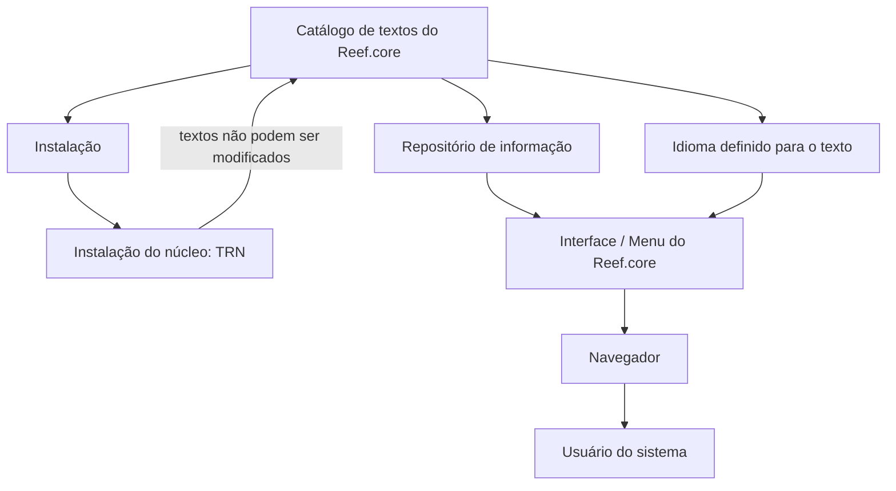

# Definição do Catálogo de Textos da Interface do Reef.core

## 1. Metadados do Documento
- **Arquivo de Origem:** Não identificado — conteúdo bruto fornecido no prompt
- **Tipo de Documento:** Especificação Técnica
- **Domínio / Sistema:** Reef.core / Reef
- **Público-Alvo:** Não identificado explicitamente
- **Data/Versão Identificada:** Não identificada
- **Owner identificado:** `user:agonzalez_mapfre.com`
- **Lifecycle identificado:** `Approved Source`

---

## 2. Resumo Executivo & Contexto de Negócio

O documento define o catálogo de textos exibidos na interface do sistema Reef.core. O catálogo permite agrupar, organizar, identificar e recuperar textos apresentados na interface, apoiando tanto a representação gráfica quanto a descrição e a compreensão funcional dos elementos exibidos.

Para apresentar um texto dinamicamente na interface do Reef.core, é necessário identificar o local em que o texto deve ser mostrado. Essa identificação permite instruir o navegador sobre a forma de realizar a apresentação do conteúdo na interface.

Funcionalmente, o Reef.core permite identificar e codificar os textos mostrados no menu do sistema. Esses textos são mantidos em um repositório de informação entregue às instalações com o conteúdo necessário para o funcionamento do sistema.

O documento estabelece uma restrição central para textos associados à instalação do núcleo: quando a configuração do texto utiliza a instalação `TRN`, os textos não podem ser modificados. A documentação também define propriedades operacionais obrigatórias para cada texto: código identificador, idioma, código da instalação e texto da etiqueta.

---

## 3. Arquitetura, Componentes & Tecnologias Envolvidas

### Componentes e conceitos identificados

| Componente / Conceito | Descrição sustentada pelo documento |
| :--- | :--- |
| **Reef.core** | Sistema cuja interface utiliza um catálogo para identificar e apresentar textos dinamicamente. |
| **Interface do Reef.core** | Camada em que os textos catalogados são exibidos aos usuários. |
| **Catálogo de textos** | Estrutura usada para agrupar, organizar, identificar, recuperar e descrever textos exibidos na interface. |
| **Menu do Reef.core** | Elemento da interface cujos textos podem ser identificados e codificados no repositório de informação. |
| **Repositório de informação** | Repositório entregue às instalações com o conteúdo necessário ao funcionamento do sistema. |
| **Navegador** | Componente que recebe instruções sobre como realizar a apresentação dinâmica dos textos. |
| **Instalação `TRN`** | Constante que identifica instalações correspondentes ao núcleo do Reef.core. Textos dessa instalação não podem ser modificados. |
| **Idioma** | Propriedade que identifica o idioma no qual um texto é definido, com exemplos como espanhol, inglês e turco. |



**Nota de Análise:** O documento descreve a relação entre catálogo, instalações, interface e navegador, mas não detalha tecnologias de implementação, contratos HTTP, banco de dados, métodos de acesso ao repositório ou mecanismos técnicos de autorização.

---

## 4. Regras de Negócio, Especificações Funcionais & Processos

### 4.1 Finalidade do catálogo de textos

1. O catálogo de textos do Reef.core deve permitir agrupar os textos apresentados na interface.
2. O catálogo de textos do Reef.core deve permitir organizar os textos apresentados na interface.
3. O catálogo de textos do Reef.core deve permitir identificar os textos apresentados na interface.
4. A organização e identificação dos textos devem facilitar:
   - A recuperação de textos para representação gráfica.
   - A descrição dos textos.
   - A compreensão funcional dos textos.
5. Para visualizar textos dinamicamente, deve-se identificar o local da interface em que cada texto será exibido.
6. A identificação do local de exibição permite fornecer instruções ao navegador sobre como apresentar o texto.

### 4.2 Gestão de textos do menu

1. O Reef.core permite identificar e codificar a relação de textos apresentada no menu do sistema.
2. A relação de textos é mantida em um repositório de informação.
3. O repositório de informação é entregue às instalações com conteúdo necessário para o funcionamento do sistema.

### 4.3 Restrição de modificação por instalação

1. Cada definição de texto possui um código de instalação.
2. As instalações correspondentes ao núcleo do Reef.core são identificadas pela constante `TRN`.
3. Quando o valor da instalação na configuração do texto corresponde à instalação do núcleo `TRN`, o texto não pode ser modificado.
4. A configuração dos textos associados à instalação do núcleo `TRN` deve ser obrigatoriamente respeitada.

### 4.4 Propriedades operacionais do catálogo

1. **Código identificador**
   - Determina o código identificador do texto na interface do Reef.core.

2. **Idioma**
   - Identifica o idioma em que o texto foi definido.
   - O documento apresenta como exemplos idiomas identificados por códigos referentes a espanhol, inglês e turco.

3. **Código da instalação**
   - Identifica o código da instalação da etiqueta.
   - Instalações do núcleo do Reef.core são identificadas pela constante `TRN`.

4. **Texto da etiqueta**
   - Expressa a descrição apresentada na interface da aplicação.
   - A apresentação deve considerar o idioma do usuário que utiliza o sistema e o idioma da definição do texto.
   - O texto deve ser escrito com a primeira letra em maiúscula e as demais letras em minúscula.

### 4.5 Convenção para operações funcionais

Quando o texto representar uma operação funcional:

1. O nome deve refletir a ação executada.
2. Devem ser respeitadas as regras ortográficas.
3. Devem ser incluídos os acentos aplicáveis.
4. Não devem ser usadas abreviações.
5. Exemplos apresentados:
   - `Crear IQRF expediente`
   - `Consultar histórico marcas`

---

## 5. Tabelas de Parâmetros, Ambientes e Estruturas de Dados

| Item / Parâmetro | Descrição / Função | Tipo / Valores / Formato | Ambiente / Observações |
| :--- | :--- | :--- | :--- |
| Código identificador | Determina o código identificador do texto na interface do Reef.core. | Código identificador; formato não detalhado. | Aplicável ao catálogo de textos. |
| Idioma | Identifica o idioma em que o texto está definido. | Códigos de idioma; exemplos citados: espanhol, inglês e turco. | Usado para apresentar o texto conforme idioma do usuário e idioma da definição. |
| Código da instalação | Identifica o código da instalação da etiqueta. | Código de instalação. | `TRN` identifica instalações do núcleo do Reef.core. |
| Instalação `TRN` | Identifica a instalação do núcleo do Reef.core. | Constante: `TRN`. | Textos configurados para `TRN` não podem ser modificados. |
| Texto da etiqueta | Descrição exibida na interface da aplicação. | Texto com primeira letra em maiúscula e restante em minúsculas. | Deve considerar o idioma do usuário e o idioma da definição do texto. |
| Nome de operação funcional | Nome exibido quando o texto representa uma operação funcional. | Deve refletir a ação; sem abreviações; com ortografia e acentos corretos. | Exemplos: `Crear IQRF expediente`; `Consultar histórico marcas`. |
| Repositório de informação | Mantém o conteúdo necessário ao funcionamento do sistema e a relação de textos do menu. | Estrutura não detalhada. | Entregue às instalações. |

---

## 6. Bateria de Perguntas & Respostas para RAG (FAQ Sintético)

### P1: Qual é a finalidade do catálogo de textos do Reef.core?
**R:** O catálogo de textos do Reef.core permite agrupar, organizar e identificar os textos exibidos na interface. Essa organização facilita a recuperação dos textos para representação gráfica, além de apoiar sua descrição e compreensão funcional.

### P2: Como um texto é exibido dinamicamente na interface do Reef.core?
**R:** Para exibir um texto dinamicamente, é necessário identificar o local da interface em que o texto deve aparecer. Essa identificação permite fornecer instruções ao navegador sobre como realizar a apresentação do conteúdo.

### P3: O que ocorre quando um texto está associado à instalação `TRN`?
**R:** Quando o valor da instalação na configuração do texto corresponde à instalação do núcleo identificada pela constante `TRN`, o texto não pode ser modificado. A configuração dos textos pertencentes ao núcleo deve ser respeitada obrigatoriamente.

### P4: O que representa a constante `TRN` no catálogo de textos?
**R:** A constante `TRN` identifica as instalações correspondentes ao núcleo do Reef.core. Textos cuja definição possui código de instalação `TRN` estão sujeitos à restrição de não modificação.

### P5: Quais propriedades operacionais são definidas para o catálogo de textos?
**R:** O documento define quatro propriedades operacionais: código identificador, idioma, código da instalação e texto da etiqueta. Cada propriedade contribui para identificar o texto, seu idioma, sua instalação de origem e sua descrição exibida na interface.

### P6: Qual é a função do código identificador de um texto?
**R:** O código identificador determina o código que identifica o texto na interface do Reef.core. O documento não especifica a estrutura, o tamanho ou o padrão de formação desse código.

### P7: Como o idioma influencia a apresentação de um texto na interface?
**R:** A propriedade de idioma identifica o idioma em que o texto foi definido. O texto exibido na interface deve estar de acordo com o idioma do usuário que utiliza o sistema e com o idioma definido para o texto.

### P8: Qual é a regra de formatação do texto da etiqueta?
**R:** O texto da etiqueta deve expressar a descrição apresentada na interface da aplicação e deve ser escrito com a primeira letra em maiúscula e o restante em minúsculas.

### P9: Como devem ser nomeadas operações funcionais no catálogo de textos?
**R:** Quando o texto se refere a uma operação funcional, o nome deve refletir a ação executada, como consultar, emitir ou criar. O nome deve respeitar a ortografia, incluir acentos e não conter abreviações.

### P10: Quais exemplos de nomes de operações funcionais são fornecidos?
**R:** O documento fornece os exemplos `Crear IQRF expediente` e `Consultar histórico marcas`. Esses exemplos ilustram que o nome deve expressar a ação funcional sem abreviações e com ortografia adequada.

### P11: Onde é mantida a relação de textos exibidos no menu do Reef.core?
**R:** A relação de textos exibidos no menu do Reef.core é identificada e codificada em um repositório de informação. Esse repositório é entregue às instalações com o conteúdo necessário para o funcionamento do sistema.

---

## 7. Glossário de Termos, Siglas & Conceitos-Chave

- **Reef.core:** Sistema cuja interface utiliza um catálogo para organizar, identificar e apresentar textos.
- **Catálogo de textos:** Estrutura usada para agrupar, organizar, identificar e recuperar textos apresentados na interface do Reef.core.
- **Código identificador:** Propriedade que determina o código identificador de um texto na interface do Reef.core.
- **Código da instalação:** Propriedade que identifica a instalação associada à etiqueta.
- **Etiqueta:** Elemento cuja descrição textual é exibida na interface da aplicação.
- **Idioma:** Propriedade que identifica a língua em que um texto foi definido.
- **Instalação:** Contexto identificado pelo código da instalação e para o qual o repositório de informação é entregue.
- **Núcleo do Reef.core:** Instalações identificadas pela constante `TRN`.
- **TRN:** Constante que identifica instalações do núcleo do Reef.core; textos associados a essa instalação não podem ser modificados.
- **Repositório de informação:** Repositório que contém a relação de textos do menu e o conteúdo necessário para o funcionamento do sistema.
- **Operação funcional:** Operação cujo nome deve refletir a ação executada, respeitando ortografia, acentos e a proibição de abreviações.
- **IQRF:** Sigla presente no exemplo `Crear IQRF expediente`; o documento não define seu significado.

---

## 8. Notas Críticas, Riscos & Limitações

- **Imutabilidade do núcleo:** Textos associados à instalação `TRN` não podem ser modificados. Alterações indevidas nesses textos violariam a restrição expressa do documento.
- **Dependência de identificação de localização:** A apresentação dinâmica de textos depende da identificação do local correto na interface. O documento não descreve o formato técnico dessa identificação.
- **Dependência de idioma:** A exibição adequada do texto depende do idioma do usuário e do idioma definido para o texto.
- **Padronização de conteúdo:** Textos de etiquetas exigem capitalização específica, e nomes de operações funcionais devem seguir ortografia, acentuação e ausência de abreviações.
- **Ausência de contratos técnicos:** O documento não detalha estruturas de persistência, APIs, formatos de código, mecanismo de distribuição do repositório ou processo técnico de edição/publicação.
- **Sigla não definida:** O documento usa a sigla `IQRF` em um exemplo, mas não informa seu significado.

---

## 9. Conteúdo Bruto Estruturado (Referência Fiel)

```text
--- [PÁGINA 1 DE 2] ---

DEFINICIÓN de los TEXTOS de la interfaz de Reef.core
Contexto
Para visualizar dinámicamente los textos en la interfaz de Reef.core se debe identicar" el lugar en el que estos se quieran mostrar pudiendo
así dar instrucciones al navegador sobre cómo debe realizarlo.
La nalidad básica del catálogo de textos de Reef.core es poder agrupar, organizar e identicar los textos que se muestran en su interfaz
facilitando de esta manera tanto su recuperación (para su representación gráca) como su descripción y comprensión funcional.
Objetivo
Funcionalmente, Reef.core cuenta con la posibilidad de identicar y codicar la relación de textos que se muestran en el Menú de Reef.core
en un repositorio de información que se entrega a las instalaciones con el contenido necesario para el funcionamiento del Sistema.
Si el valor de la instalación en la conguración del texto es la correspondiente a la instalación del núcleo, instalación (TRN) los textos no
podrán modicarse.
Propiedades Operativas
Propiedades Operativas
Código identicador
Esta propiedad del catálogo determina el código identicador del texto en la interfaz de Reef.core.
Idioma
Esta propiedad identica el idioma en el que está denido el texto, como por ejemplo, los códigos que identiquen a los idiomas español,
inglés, turco,...
Código de la Instalación
Esta propiedad de la denición identica el código de la instalación de la etiqueta siendo las correspondientes al núcleo de Reef.core
aquellas identicadas con la constante TRN.
Texto de la etiqueta
Esta propiedad expresa la descripción que se mostrará en la interfaz de la aplicación de acuerdo con el idioma que tenga al usuario que
utiliza el sistema y el idioma de la denición del texto, debiendo estar escrito con la primera letra en mayúscula y el resto en minúsculas.
Documentation / DOCUMENTACIÓN Reef
DOCUMENTACIÓN Reef
Mapfredocument
DOCUMENTACIÓN Reef
Owner
user:agonzalez_mapfre.com
Lifecycle
Approved Source
 / 
 VL
Buscar Inicio Soluciones Arquitecturas APIs Componentes Cloud Documentación Zeus Reef Ayuda
ES


--- [PÁGINA 2 DE 2] ---

Si se trata de una operación funcional el nombre debe reejar la acción que se ejecuta (consultar, emitir, crear...) respetando la ortografía,
incluyendo acentos y sin contener abreviaturas. Eg.: "Crear IQRF expediente", "Consultar histórico marcas",...
Vínculos
Relación de Directrices y Documentos funcionales cuya lectura recomendada para evitar que la interpretación aislada del presente
documento pueda conducir a error.
Denición Programas
Preguntas frecuentes
(1) ¿Existe alguna restricción que tenga que ser tomada en cuenta en el uso y denición del catálogo de textos por instalación e idioma de
Reef.core?
Se han de respetar obligatoriamente la conguración realizada en los textos que se corresponden con la instalación del núcleo (TRN).
Consejo:
```
