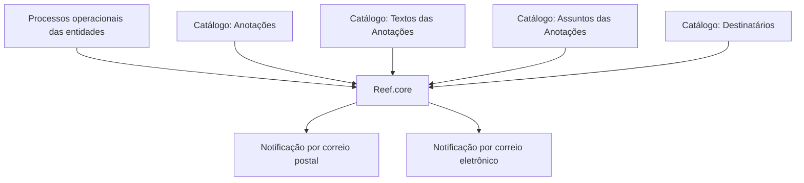

# Definição das Anotações do Sistema Reef.core

## 1. Metadados do Documento
- **Arquivo de Origem:** Não identificado no conteúdo fornecido
- **Tipo de Documento:** Procedimento / Documentação funcional
- **Domínio / Sistema:** Reef.core; Reef; Mapfre
- **Público-Alvo:** Configuradores funcionais, operação e equipes responsáveis por ferramentas corporativas
- **Data/Versão Identificada:** Não identificada
- **Owner identificado:** `user:agonzalez_mapfre.com`
- **Lifecycle identificado:** Approved

---

## 2. Resumo Executivo & Contexto de Negócio

O documento descreve a funcionalidade de **anotações** no núcleo do sistema **Reef.core**. O núcleo permite configurar e enviar notificações por correio postal ou correio eletrônico durante processos operacionais das entidades.

O objetivo declarado é conhecer a relação de catálogos que precisam ser configurados e sua ordem de execução. A configuração ordenada desses catálogos é apresentada como necessária para definir e deixar plenamente operacional a funcionalidade nas ferramentas corporativas.

Os catálogos explicitamente relacionados à funcionalidade são: **Anotações**, **Textos das Anotações**, **Assuntos das Anotações** e **Destinatários**. O conteúdo fornecido não detalha campos, valores permitidos, contratos de integração, métodos de envio ou regras de seleção de destinatários.

A documentação está associada às referências “Documentation / DOCUMENTACIÓN Reef”, “Mapfredocument” e “DOCUMENTACIÓN Reef”. O documento apresenta status de ciclo de vida **Approved**, mas não informa versão, data de aprovação ou responsável funcional além do owner listado.

---

## 3. Arquitetura, Componentes & Tecnologias Envolvidas

### Componentes e conceitos identificados

| Componente / Conceito | Papel sustentado pelo documento |
| :--- | :--- |
| **Reef.core** | Núcleo que permite configurar e enviar notificações em processos operacionais das entidades. |
| **Ferramentas corporativas** | Contexto no qual a funcionalidade de anotações deve ficar plenamente operacional. |
| **Catálogo de Anotações** | Catálogo listado para configuração da funcionalidade. |
| **Catálogo de Textos das Anotações** | Catálogo listado para configuração da funcionalidade. |
| **Catálogo de Assuntos das Anotações** | Catálogo listado para configuração da funcionalidade. |
| **Catálogo de Destinatários** | Catálogo listado para configuração da funcionalidade. |
| **Correio postal** | Canal de notificação suportado pelo núcleo Reef.core. |
| **Correio eletrônico** | Canal de notificação suportado pelo núcleo Reef.core. |



> **Nota de Análise:** O documento declara que existe uma ordem de execução dos catálogos, porém não apresenta explicitamente a sequência entre Anotações, Textos das Anotações, Assuntos das Anotações e Destinatários.

---

## 4. Regras de Negócio, Especificações Funcionais & Processos

1. O núcleo **Reef.core** permite a configuração e o envio de notificações.
2. As notificações ocorrem nos processos operacionais das entidades.
3. Os canais de notificação mencionados são:
   - correio postal;
   - correio eletrônico.
4. Para tornar a funcionalidade plenamente operacional em ferramentas corporativas, o documento indica que é necessário configurar os catálogos relacionados.
5. Os catálogos citados são:
   - Anotações;
   - Textos das Anotações;
   - Assuntos das Anotações;
   - Destinatários.
6. O documento estabelece que existe uma relação entre os catálogos e uma ordem de execução, sem detalhar a dependência funcional, o fluxo de cadastro, critérios de validação ou regras de precedência.

> **Nota de Análise:** Não há no conteúdo fornecido definição de campos obrigatórios, regras de composição de texto, critérios para escolha de canal, regras de roteamento, modelos de mensagem, eventos disparadores ou tratamento de falhas de entrega.

---

## 5. Tabelas de Parâmetros, Ambientes e Estruturas de Dados

| Item / Parâmetro | Descrição / Função | Tipo / Valores / Formato | Ambiente / Observações |
| :--- | :--- | :--- | :--- |
| Reef.core | Núcleo que permite a configuração e o envio de notificações. | Sistema / núcleo | Utilizado em processos operacionais das entidades. |
| Notificação postal | Canal de notificação mencionado. | Correio postal | Não há detalhes de integração, formato ou operação. |
| Notificação eletrônica | Canal de notificação mencionado. | Correio eletrônico | Não há detalhes de integração, formato ou operação. |
| Anotações | Catálogo necessário para a funcionalidade. | Catálogo | Sem campos ou valores especificados. |
| Textos das Anotações | Catálogo necessário para a funcionalidade. | Catálogo | Sem estrutura de texto especificada. |
| Assuntos das Anotações | Catálogo necessário para a funcionalidade. | Catálogo | Sem regras de associação especificadas. |
| Destinatários | Catálogo necessário para a funcionalidade. | Catálogo | Sem critérios de seleção especificados. |
| Owner | Proprietário registrado na documentação. | `user:agonzalez_mapfre.com` | Identificado no conteúdo bruto. |
| Lifecycle | Estado do ciclo de vida da documentação. | `Approved` | Sem versão ou data associada. |
| Fonte de documentação | Referências documentais exibidas. | Documentation / DOCUMENTACIÓN Reef; Mapfredocument | Sem URL identificável no conteúdo. |

---

## 6. Bateria de Perguntas & Respostas para RAG (FAQ Sintético)

### P1: Qual é a finalidade da funcionalidade de anotações no Reef.core?
**R:** A funcionalidade permite configurar e enviar notificações durante processos operacionais das entidades. Os canais mencionados no documento são correio postal e correio eletrônico.

### P2: Quais canais de notificação são suportados pelo núcleo Reef.core?
**R:** O documento menciona envio de notificações via correio postal ou correio eletrônico. Não há detalhamento sobre provedores, protocolos ou configurações específicas desses canais.

### P3: Quais catálogos devem ser configurados para ativar a funcionalidade de anotações?
**R:** O documento lista quatro catálogos: Anotações, Textos das Anotações, Assuntos das Anotações e Destinatários.

### P4: Qual é a ordem correta de configuração dos catálogos de anotações?
**R:** O documento informa que é necessário conhecer a relação entre os catálogos e sua ordem de execução, mas não apresenta a sequência explícita de configuração entre Anotações, Textos das Anotações, Assuntos das Anotações e Destinatários.

### P5: Em que contexto as notificações do Reef.core são utilizadas?
**R:** As notificações são utilizadas nos processos operacionais das entidades e devem ser configuradas para que a funcionalidade esteja plenamente operacional nas ferramentas corporativas.

### P6: O documento define campos ou formatos para o catálogo de Textos das Anotações?
**R:** Não. O conteúdo apenas lista “Textos das Anotações” como um catálogo a configurar; não descreve campos, tamanho, idioma, modelo, variáveis ou regras de composição de texto.

### P7: Como o Reef.core seleciona os destinatários de uma notificação?
**R:** O documento identifica “Destinatários” como um catálogo necessário, mas não descreve critérios de seleção, regras de roteamento, grupos, endereços ou prioridades.

### P8: O documento especifica como escolher entre envio postal e envio eletrônico?
**R:** Não. O texto informa que o núcleo Reef.core permite notificações por correio postal ou eletrônico, mas não estabelece regras de decisão, preferências ou condições para cada canal.

### P9: Qual é o estado do ciclo de vida da documentação?
**R:** O conteúdo bruto identifica o campo “Lifecycle” com o valor `Approved`. Não foram identificadas data de aprovação, número de versão ou histórico de alterações.

### P10: Quem é o owner registrado para a documentação de anotações?
**R:** O conteúdo bruto apresenta `user:agonzalez_mapfre.com` como owner da documentação.

---

## 7. Glossário de Termos, Siglas & Conceitos-Chave

- **Reef.core:** Núcleo do sistema Reef que permite configurar e enviar notificações em processos operacionais das entidades.
- **Anotações:** Catálogo citado como necessário para a funcionalidade de notificações.
- **Textos das Anotações:** Catálogo citado para configuração dos textos relacionados às anotações.
- **Assuntos das Anotações:** Catálogo citado para configuração dos assuntos relacionados às anotações.
- **Destinatários:** Catálogo citado para configuração dos receptores das notificações.
- **Correio postal:** Canal de envio de notificações mencionado no documento.
- **Correio eletrônico:** Canal de envio de notificações mencionado no documento.
- **Lifecycle:** Campo de ciclo de vida documental; o valor identificado é `Approved`.
- **Mapfredocument:** Referência documental exibida no conteúdo bruto, sem detalhamento adicional.
- **DOCUMENTACIÓN Reef:** Referência à documentação do Reef identificada no conteúdo bruto.

---

## 8. Notas Críticas, Riscos & Limitações

- A ordem de execução/configuração dos catálogos é citada, mas não é apresentada. Isso impede derivar uma sequência operacional confiável.
- Não há campos, tipos, valores, exemplos, identificadores ou relacionamentos entre os catálogos.
- Não há especificação dos eventos operacionais que disparam uma notificação.
- Não há regras para decidir entre correio postal e correio eletrônico.
- Não há definição de contratos técnicos, APIs, formatos de mensagem, persistência, logs, monitoramento ou tratamento de erros.
- Não há URLs, nomes de ambientes, servidores, versões de software ou dados de implantação.
- O documento está marcado como `Approved`, mas não contém data, versão ou histórico de revisão identificável.
- **Nota de Análise:** O conteúdo fornecido é uma visão resumida da funcionalidade. Qualquer implementação ou configuração adicional exigiria documentação complementar que detalhe os catálogos, suas dependências e o processo de execução.

---

## 9. Conteúdo Bruto Estruturado (Referência Fiel)

```text
--- [PÁGINA 1 DE 1] ---

DEFINICIÓN de las ANOTACIONES del Sistema

Contexto
El Núcleo de Reef.core permite la configuración y envío de notificaciones vía correo postal o electrónico en los procesos operativos de las entidades.

Objetivo
Conocer la relación de Catálogos que se deben configurar y el orden en su ejecución para definir y tener plenamente operativa esta funcionalidad de las herramienta Corporativa.

Catálogos
Anotaciones
Textos de las Anotaciones
Asuntos de las Anotaciones
Destinatarios

Documentation / DOCUMENTACIÓN Reef
DOCUMENTACIÓN Reef
Mapfredocument
DOCUMENTACIÓN Reef

Owner
user:agonzalez_mapfre.com

Lifecycle
Approved Source
 / 
 VL

Buscar Inicio Soluciones Arquitecturas APIs Componentes Cloud Documentación Zeus Reef Ayuda
ES
```
