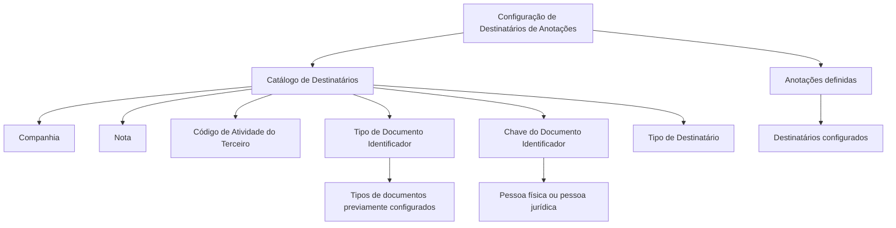

# Configuração dos Destinatários de Anotações — Catálogo Reef

## 1. Metadados do Documento
- **Arquivo de Origem:** Não identificado no conteúdo fornecido
- **Tipo de Documento:** Especificação Técnica / Funcional
- **Domínio / Sistema:** Reef — Anotações / Catálogo de Destinatários
- **Público-Alvo:** Analistas funcionais, desenvolvedores e equipes de configuração
- **Data/Versão Identificada:** Não identificada

---

## 2. Resumo Executivo & Contexto de Negócio

O documento descreve a configuração dos destinatários das anotações no sistema Reef. O objetivo declarado é definir as pessoas para as quais as anotações previamente definidas serão destinadas ou direcionadas.

A configuração é realizada por meio de um catálogo de Destinatários, contendo dados identificativos da companhia, da nota, da atividade do terceiro e do documento identificador da pessoa física ou jurídica. O documento estabelece que a identificação utiliza tipos de documentos previamente configurados no sistema.

A configuração diferencia pessoas físicas e jurídicas por meio de campos como Tipo de Documento Identificador e Chave do Documento Identificador. Os exemplos fornecidos usam NIF para o Banco de Santander, como pessoa jurídica na Espanha, e DNI para Juan Pérez Pérez, como pessoa física.

O documento também registra vínculos para a documentação Reef e identifica `user:agonzalez_mapfre.com` como proprietário. O ciclo de vida indicado é `Approved Source`.

---

## 3. Arquitetura, Componentes & Tecnologias Envolvidas

Os componentes explicitamente citados são:

- **Reef:** sistema ou domínio documental no qual a configuração é realizada.
- **Anotações:** entidades cuja destinação é configurada.
- **Catálogo de Destinatários:** catálogo que armazena os dados de configuração dos destinatários.
- **Colapsador:** estrutura que contém o atributo Tipo Documento Identificador.
- **Tipos de documentos configurados previamente no sistema:** catálogo ou configuração prévia usada para identificar pessoas físicas ou jurídicas.
- **DOCUMENTACIÓN Reef / Mapfredocument:** referências documentais apresentadas na seção de vínculos.



**Nota de Análise:** o conteúdo não descreve arquitetura de infraestrutura, APIs, microsserviços, protocolos, métodos HTTP, contratos JSON, bancos de dados, ambientes de execução ou rotas de logs.

---

## 4. Regras de Negócio, Especificações Funcionais & Processos

1. A finalidade da configuração é definir as pessoas às quais as anotações definidas serão destinadas ou dirigidas.

2. O atributo **Companhia** contém o código da companhia sobre a qual a configuração está sendo realizada.

3. O atributo **Nota** contém a chave da nota. A chave funciona como código identificador da nota e é utilizada para configurar:
   - título da nota;
   - textos enriquecidos;
   - demais elementos indicados por “etc.” no conteúdo original, sem detalhamento adicional.

4. A propriedade **Código de Atividade do Terceiro** informa o código da atividade do terceiro.

5. O atributo **Tipo Documento Identificador**, localizado no colapsador, contém o tipo de documento usado para identificar uma pessoa física ou jurídica.

6. O tipo de documento identificador deve pertencer aos tipos de documentos que tenham sido previamente configurados no sistema.

7. O atributo **Chave do Documento Identificador** contém a chave do segurado.

8. Os exemplos de identificação apresentados são:
   - Banco de Santander: pessoa jurídica identificada no Reino de Espanha pelo Tipo de Documento `NIF` e pela chave de documento `A-39000013`.
   - Juan Pérez Pérez: pessoa física identificada pelo Tipo de Documento `DNI` e pela chave `50818772`.

9. O campo **Tipo de Destinatário** é descrito como o tipo de nota atribuído à nota em sua configuração e indica a natureza da anotação.

10. A seção de perguntas frequentes informa que não há recomendação operacional local a ser considerada para codificação, uso e definição da tabela de Destinatários do Sistema: `N/A`.

---

## 5. Tabelas de Parâmetros, Ambientes e Estruturas de Dados

| Item / Parâmetro | Descrição / Função | Tipo / Valores / Formato | Ambiente / Observações |
| :--- | :--- | :--- | :--- |
| Companhia | Contém o código da companhia sobre a qual é realizada a configuração. | Código de companhia; formato não detalhado. | Aplicável ao catálogo de Destinatários. |
| Nota | Contém a chave da nota utilizada para identificá-la e configurar título e textos enriquecidos. | Chave/código da nota; formato não detalhado. | O conteúdo menciona configuração de título, textos enriquecidos etc. |
| Código de Atividade do Terceiro | Indica o código da atividade do terceiro. | Código; formato não detalhado. | Não há lista de atividades no documento. |
| Tipo Documento Identificador | Define o tipo de documento usado para identificar pessoa física ou jurídica. | Tipos previamente configurados no sistema. | Atributo localizado no colapsador. |
| Chave do Documento Identificador | Contém a chave do segurado. | Chave de documento; formato não detalhado. | Utilizada juntamente com o tipo de documento identificador. |
| Tipo de Destinatário | Indica a natureza da anotação conforme o tipo de nota atribuído na configuração. | Tipo de nota; valores não detalhados. | A redação original associa o tipo de destinatário ao tipo de nota. |
| Exemplo de pessoa jurídica | Banco de Santander identificado no Reino de Espanha. | Tipo: `NIF`; Chave: `A-39000013`. | Exemplo apresentado pelo documento. |
| Exemplo de pessoa física | Juan Pérez Pérez identificado no sistema. | Tipo: `DNI`; Chave: `50818772`. | Exemplo apresentado pelo documento. |
| Owner | Proprietário indicado na documentação. | `user:agonzalez_mapfre.com` | Metadado apresentado na seção de vínculos. |
| Lifecycle | Estado de ciclo de vida do conteúdo. | `Approved Source` | Metadado apresentado na seção de vínculos. |

---

## 6. Bateria de Perguntas & Respostas para RAG (FAQ Sintético)

### P1: Qual é o objetivo da configuração de Destinatários de Anotações no Reef?
**R:** O objetivo é definir as pessoas para as quais as anotações previamente definidas serão destinadas ou dirigidas.

### P2: Qual campo identifica a companhia sobre a qual a configuração é realizada?
**R:** O atributo **Companhia** do catálogo de Destinatários contém o código da companhia sobre a qual a configuração está sendo realizada.

### P3: Qual é a finalidade do atributo Nota no catálogo de Destinatários?
**R:** O atributo **Nota** contém a chave da nota, que funciona como código identificador para configurar o título da nota, seus textos enriquecidos e outros elementos não detalhados no documento.

### P4: O que representa o Código de Atividade do Terceiro?
**R:** O **Código de Atividade do Terceiro** indica o código da atividade do terceiro. O documento não apresenta formato, valores permitidos ou catálogo de atividades.

### P5: Como uma pessoa física ou jurídica é identificada na configuração de Destinatários?
**R:** A pessoa física ou jurídica é identificada por meio do **Tipo Documento Identificador** e da **Chave do Documento Identificador**. O tipo de documento deve estar previamente configurado no sistema.

### P6: Onde está localizado o atributo Tipo Documento Identificador?
**R:** O documento afirma que o atributo **Tipo Documento Identificador** está localizado no colapsador.

### P7: O que armazena a Chave do Documento Identificador?
**R:** A **Chave do Documento Identificador** contém a chave do segurado.

### P8: Como o Banco de Santander é identificado no exemplo do documento?
**R:** O Banco de Santander é apresentado como pessoa jurídica identificada no Reino de Espanha pelo Tipo de Documento `NIF` e pela chave de documento `A-39000013`.

### P9: Como Juan Pérez Pérez é identificado no exemplo do documento?
**R:** Juan Pérez Pérez é apresentado como pessoa física identificada no sistema pelo Tipo de Documento `DNI` e pela chave `50818772`.

### P10: O que o Tipo de Destinatário indica?
**R:** O **Tipo de Destinatário** é descrito como o tipo de nota atribuído à nota durante sua configuração e indica a natureza da anotação.

### P11: Existem recomendações operacionais locais para codificação, uso ou definição da tabela de Destinatários?
**R:** Não. A seção de perguntas frequentes informa `N/A` para recomendações operacionais locais relacionadas à codificação, ao uso e à definição da tabela de Destinatários do Sistema.

### P12: O documento define APIs, métodos HTTP ou contratos JSON do catálogo de Destinatários?
**R:** Não. O documento não detalha APIs, métodos HTTP, contratos JSON, tecnologias de implementação, persistência de dados ou integrações técnicas.

---

## 7. Glossário de Termos, Siglas & Conceitos-Chave

- **Reef:** domínio ou sistema documental citado como contexto da configuração de Destinatários e Anotações.
- **Anotações:** elementos definidos no sistema que podem ser destinados ou dirigidos a pessoas configuradas.
- **Destinatário:** pessoa para a qual uma anotação é destinada ou dirigida.
- **Catálogo de Destinatários:** catálogo que contém os atributos usados para configurar a identificação e natureza dos destinatários.
- **Colapsador:** estrutura mencionada como local do atributo Tipo Documento Identificador.
- **NIF:** tipo de documento usado no exemplo para identificar o Banco de Santander no Reino de Espanha. O significado expandido da sigla não é fornecido pelo documento.
- **DNI:** tipo de documento usado no exemplo para identificar Juan Pérez Pérez. O significado expandido da sigla não é fornecido pelo documento.
- **Chave do Documento Identificador:** atributo que contém a chave do segurado.
- **Tipo de Destinatário:** atributo que indica a natureza da anotação conforme o tipo de nota atribuído em sua configuração.
- **Approved Source:** valor exibido no campo Lifecycle da documentação vinculada.

---

## 8. Notas Críticas, Riscos & Limitações

- O documento é predominantemente funcional e não apresenta detalhes de implementação técnica.
- Não há especificação de APIs, métodos HTTP, contratos JSON, bancos de dados, regras de autenticação, logs, URLs de ambientes, portas ou versões de software.
- Não há detalhamento dos valores permitidos para Companhia, Código de Atividade do Terceiro, Tipo de Destinatário ou Chave do Documento Identificador.
- O campo Tipo de Destinatário possui descrição potencialmente ambígua, pois é apresentado como “o tipo de nota atribuído à nota”; o documento não esclarece uma taxonomia de destinatários.
- A pergunta frequente sobre recomendações operacionais locais possui resposta `N/A`; portanto, não existe orientação operacional adicional registrada no conteúdo fornecido.
- **Nota de Análise:** o documento cita o catálogo de Destinatários, mas não detalha os fluxos de criação, alteração, exclusão, validação, persistência ou consumo dos dados configurados.

---

## 9. Conteúdo Bruto Estruturado (Referência Fiel)

```text
--- [PÁGINA 1 DE 2] ---

CONFIGURACIÓN de los DESTINATARIOS de las Anotaciones
Objetivo
El objetivo es denir las personas a las que se destinará o dirigirán las anotaciones denidas.
Datos Identicativos
Datos Identicativos
Compañía
Este Atributo del catálogo de Destinatarios contiene el código de la compañía sobre la cual se está realizando la conguración.
Nota
Este atributo contendrá la clave de la nota que será el código que identique a la misma para congurar su título, sus textos enriquecidos etc.
Código de Actividad del Tercero
Esta propiedad indicará el código de la Actividad del Tercero.
Tipo Documento Identicador
Este Atributo del colapsador contiene el [tipo de documento] con el que se va a identicar a la persona física o jurídica de acuerdo con los
tipos de documentos que hayan sido congurados en el sistema previamente.
Clave del Documento Identicador
Este Atributo del catálogo contendrá la clave del Asegurado.
A modo de ejemplos:
El Banco de Santander como persona jurídica se identica en el Reino de España con el Tipo de Documento NIF con clave de documento
A-39000013
Juan Pérez Pérez como persona física se identicará en el sistema con el Tipo de Documento DNI cuya clave es 50818772
Tipo de Destinatario
El tipo de nota asignado a la nota en su conguración, indica la naturaleza de la misma.
Vínculos
Documentation / DOCUMENTACIÓN Reef
DOCUMENTACIÓN Reef
Mapfredocument
DOCUMENTACIÓN Reef
Owner
user:agonzalez_mapfre.com
Lifecycle
Approved Source
 /
 VL
Buscar Inicio Soluciones Arquitecturas APIs Componentes Cloud Documentación Zeus Reef Ayuda
ES


--- [PÁGINA 2 DE 2] ---

Relación de Directrices y Documentos funcionales cuya lectura recomendada para evitar que la interpretación aislada de la presente entrada
pueda conducir a error.
Anotaciones
Preguntas frecuentes
(1) ¿Existe alguna recomendación operativa que deba ser tomada en consideración localmente en la codicación, uso y denición de la tabla
de Destinatarios del Sistema?
N/A
```
